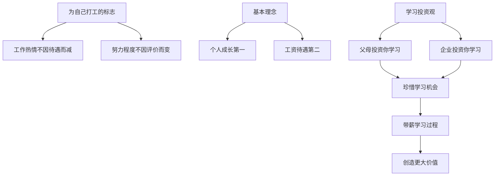
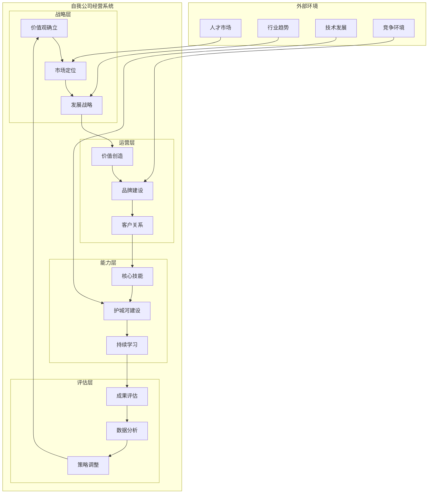

# 经营好自我公司：个人职业发展理念与实践体系梳理

## 各部分核心思想详解

### 5. 靠谱品牌塑造 - 核心思想

### 8. 公司关系管理 - 核心思想

#### 正确的公司关系观

- **平台价值**：珍惜企业搭建的学习平台
- **深度沉淀**：在一家公司沉淀3-4年
- **内在积累**：关注技能、经验、资源的积累
- **理性选择**：要么忍，要么滚

### 9. 未来导向思维 - 核心思想

#### 为自己打工的理念

- **心态转变**：不为外在因素影响工作热情
- **价值排序**：个人成长第一，工资待遇第二
- **投资视角**：把工作当成带薪学习过程

## 系统架构图

## 关键成功要素

### 1. 思维转换
- **从雇员到CEO**：把自己当成公司经营者
- **从被动到主动**：主动创造价值而非被动接受
- **从短期到长期**：建立长期经营思维

### 2. 价值创造
- **市场导向**：基于市场需求确定价值定位
- **持续价值**：源源不断为客户创造价值
- **差异化优势**：建立独特的竞争优势

### 3. 品牌建设
- **靠谱品牌**：建立可信赖的个人品牌
- **专业形象**：在专业领域建立影响力
- **口碑积累**：通过优质服务积累口碑

### 4. 长期经营
- **护城河建设**：多维度建立竞争壁垒
- **持续学习**：保持学习和成长的能力
- **战略调整**：基于市场变化调整策略

## 实践建议

### 短期行动(1-6个月)
1. **思维转换**：开始用经营者思维看待工作
2. **价值分析**：分析自己当前能提供的价值
3. **品牌建设**：开始建立靠谱的个人品牌
4. **技能评估**：评估当前技能的市场价值

### 中期规划(6个月-2年)
1. **护城河建设**：开始建设核心竞争优势
2. **价值提升**：持续提升自己的价值创造能力
3. **网络建设**：建立优质的人脉网络
4. **成果积累**：积累可展示的工作成果

### 长期战略(2-5年)
1. **市场地位**：在细分领域建立领先地位
2. **多元发展**：考虑发展协同的副业
3. **平台选择**：基于价值匹配选择更好平台
4. **经验传承**：开始指导和影响他人

## 注意事项

### 避免的误区
1. **急功近利**：避免为了短期利益损害长期发展
2. **单一发展**：避免只关注某一个领域
3. **忽视品牌**：避免只关注技能忽视个人品牌
4. **频繁跳槽**：避免为了跳槽而跳槽

### 关键原则
1. **价值导向**：始终以创造价值为核心
2. **长期主义**：建立长期经营思维
3. **持续学习**：保持学习和成长的能力
4. **诚信经营**：建立诚信可靠的个人品牌

## 成功案例分析

### 客服实习生案例解析

**成功要素分析**：
- **超预期服务**：做得比要求的更多
- **主动学习**：深入了解产品和业务
- **系统思维**：不仅做事，还优化流程
- **跨界思维**：不设边界，全面参与
- **价值创造**：最终对业务产生重要价值

## 总结

经营好自我公司的核心价值在于：

1. **思维转换**：从打工者思维转向经营者思维
2. **价值创造**：建立持续的价值创造能力
3. **品牌建设**：塑造靠谱可信的个人品牌
4. **长期经营**：建立可持续的竞争优势
5. **未来导向**：为自己的未来而投资和努力

通过这套理念和方法的实践，可以帮助个人：
- 建立更加主动的职业发展观
- 创造更大的个人价值和市场竞争力
- 获得更多的选择权和主动权
- 实现个人与组织的共同成长
- 为未来的职业发展奠定坚实基础

最终实现从"为别人打工"到"为自己未来打工"的根本转变，成为自己人生的真正经营者。