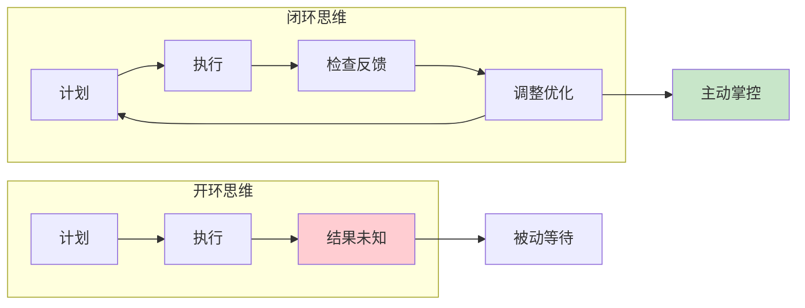
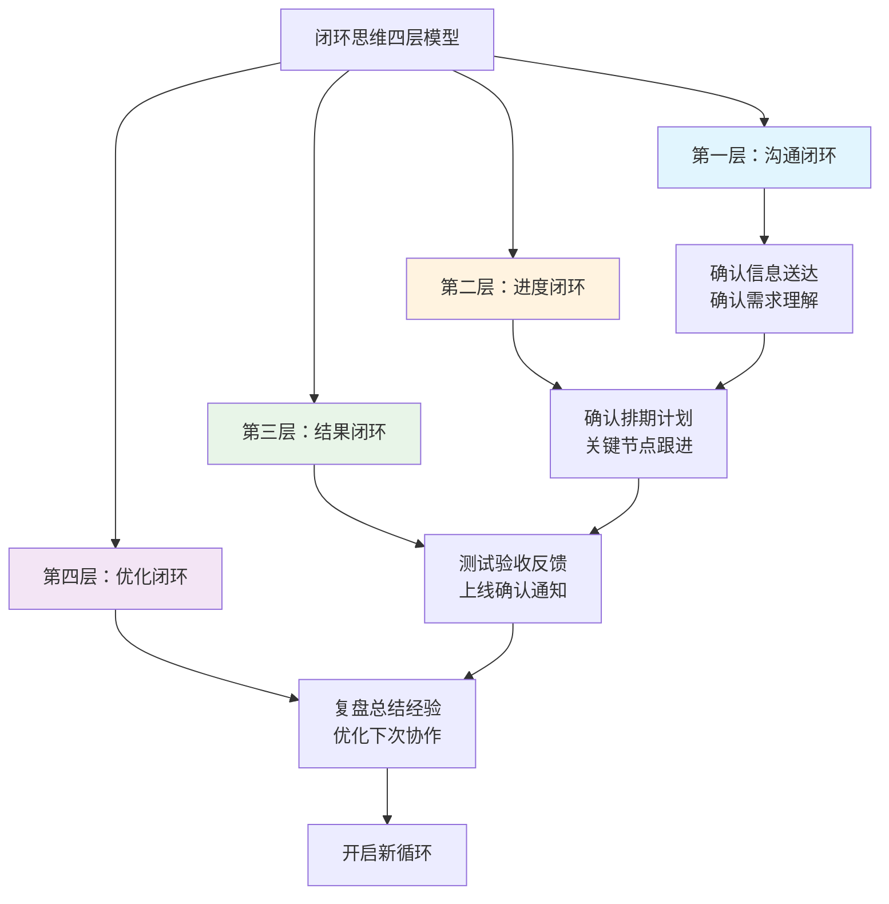
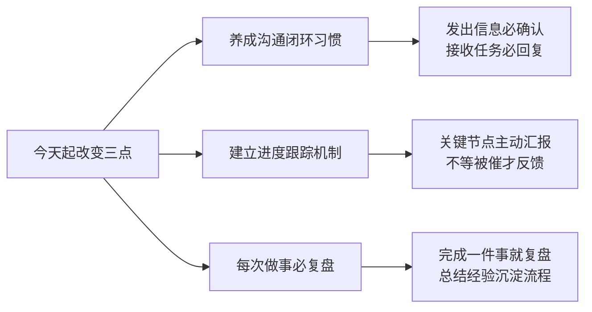

# 2.5闭环思维的逻辑
#### 目录介绍
- [01.为何要闭环思维](#01为何要闭环思维)
- [02.闭环思维重要性](#02闭环思维重要性)
- [03.闭环思维的概念](#03闭环思维的概念)
- [04.如何去培养闭环](#04如何去培养闭环)
- [05.未闭环和已闭环](#05未闭环和已闭环)
- [06.我们来看个例子](#06我们来看个例子)
- [07.今天起改变三点](#07今天起改变三点)
- [08.课后作业思考下](#08课后作业思考下)

## 01.为何要闭环思维

开环导航（无闭环）："去机场。"然后司机就凭记忆和感觉开。路上堵不堵？有没有事故？飞机是否准点？他不管。你只能忐忑不安地坐在车里听天由命。

闭环导航（有闭环）："去机场。"高德地图立刻规划路线。上路后，它实时反馈："前方拥堵500米，通过需要15分钟"。它主动检查并提供新方案："为您推荐一条新路线，快5分钟"。你根据反馈做出处理："好的，切换路线"。最终，它确认结果："您已到达目的地"。

闭环思维，就是你为自己的人生和工作安装的一套"高德地图"。它让你从不确性中寻找确定性，从被动等待变为主动掌控。

为什么要有闭环思想？因为它不是一种简单的技巧，而是一种发展策略。它帮助我们：在不确定性中创造确定性。在协作中建立坚不可摧的信任。在经验中萃取能力，实现复利式成长。

## 02.闭环思维重要性

在复杂多变的世界中，每天都会面对各种各样的问题。生活中的琐事，工作中的难题，都需要进行深入的思考和剖析。

思考并非简单的头脑风暴，而是需要遵循一定的逻辑和规律。明白思考问题的底层逻辑，特别是逻辑思维和逻辑闭环的重要性。

## 03.闭环思维的概念

思维闭环是指思维过程中的逻辑链条形成一个完整的闭环，起始于问题，经过一系列推理分析，最终回到问题本身，形成一个圆满的解答。

这种思维模式要求不仅仅停留在问题的表面，而是要深入挖掘问题的本质，寻找问题的根源，从而得出有效的解决方案。

逻辑思维是实现逻辑闭环的关键。逻辑思维是一种基于事实和规则的推理过程，它要求在分析问题时保持清晰、准确、有条理。

通过逻辑思维，可以将复杂的问题拆解成若干个简单的子问题，逐一进行剖析和解答。同时，逻辑思维还能帮助识别并剔除错误的信息和观点，确保思考过程始终基于事实和真相。

## 04.如何去培养闭环

如何培养和提高逻辑思维和逻辑闭环的能力呢？

①学会"刨根问底"。面对问题时，不要满足于表面的答案，而是要深入挖掘问题的根源和背后的原因。通过不断地提问和质疑，逐渐揭示问题的真相，找到问题的关键所在。

②保持开放的心态和批判性思维。开放的心态意味着我们要愿意接受新的观点和想法，不固步自封；而批判性思维则要求对所接收的信息进行审慎的评估和筛选，确保思考过程始终基于可靠的事实和证据。

③注重知识的积累和学习。只有掌握了足够的知识和信息，才能更好地理解问题、分析问题并解决问题。因此，应该保持学习的热情和好奇心，不断扩充自己的知识储备。

闭环思维是一种系统性的思维方式和工作方法，强调从起点到终点的完整循环，确保每个环节都有反馈、验证和调整，最终形成完整的"计划-执行-检查-行动"循环。

1. 完整性：有始有终，不半途而废 
2. 反馈性：及时获取执行结果信息 
3. 验证性：检查执行效果与预期的差异 
4. 调整性：根据反馈进行优化改进 
5. 责任性：对结果负责，不推诿不逃避

## 05.未闭环和已闭环

背景：公司要举办一场大型线上市场活动，你作为市场部的负责人，需要技术部帮你开发一个临时的活动落地页。

未闭环的做法（开环思维）：

计划 (Plan)：写了一份需求文档。 这个需求文档也没有拉齐一下。

执行 (Do)：把文档邮件发给技术部负责人，并抄送双方领导。

然后呢？没有然后了。你没确认对方是否收到、是否理解需求。你没主动跟进排期和进度。技术部因为忙于其他项目，你的需求被搁置了。 

结果：活动临近，页面还没开发。你跑去向老板哭诉："技术部不配合！" 技术部反驳："你也没催啊，我们不知道这个这么急！" 项目失败，部门间产生矛盾。

闭环思维的做法：

第一层闭环：沟通闭环。行动：发出需求邮件后，立即通过即时通讯工具或电话联系技术部负责人："XX你好，我刚发了一个活动页面的需求，比较急，麻烦查收一下，看看有没有不理解的地方。"目的：确认信息已送达且被理解，完成沟通闭环。

第二层闭环：进度闭环。行动：与技术部确认排期和开发计划（例如，"下周三给我初版，对吗？"）。在关键时间点（如周三早上）主动跟进："今天方便看一下初版进展吗？有什么困难吗？" 目的：监控过程，确保执行不偏离轨道，完成进度闭环。

第三层闭环：结果闭环。行动：拿到初版后，立即测试，将修改反馈给技术部。页面正式上线后，主动告知技术部："页面已上线，感谢支持！"，并将活动数据结果分享给他们。目的：交付完整成果，并给予反馈，完成结果闭环。

第四层闭环：优化闭环。行动：活动结束后，组织一个复盘会，与技术部一起总结："这次合作哪些地方可以优化？下次需求文档是否可以写得更规范以便你们开发更高效？" 目的：将本次循环的经验转化为下一个循环的优化点，完成优化闭环，让未来的协作更顺畅。

## 06.我们来看个例子

项目背景：某公司要开发一款电商移动应用，项目经理小王负责该项目。

需求阶段闭环。具体行动：1.与业务方多次沟通，明确需求细节；2.组织开发、测试、设计团队进行需求评审；3.将确认后的需求形成正式文档；4.建立需求变更流程，任何变更都经过评审。闭环体现在需求确认后不是终点，而是持续收集反馈，确保需求准确无误。

开发阶段闭环。具体行动：1.制定详细的开发计划和时间节点；2.每日站会汇报进度，及时发现偏差；3.代码完成后进行测试和同行评审；4.发现问题立即修复，不拖延到下一阶段。闭环体现在开发不是写完代码就结束，而是通过测试和评审确保代码质量。

测试阶段闭环。具体行动：1.测试人员提前介入，参与需求评审；2.设计完整的测试用例覆盖所有功能；3.发现缺陷后详细记录并跟踪处理状态；4.开发修复后必须重新验证，确保问题真正解决；5.进行回归测试，防止修复引入新问题。闭环体现在测试不是简单找bug，而是确保每个问题都得到彻底解决。

上线阶段闭环。具体行动：1.制定详细的上线计划和回滚方案；2.上线后密切监控系统运行状态和性能指标；3.收集用户反馈和使用数据；4.根据反馈持续优化产品功能。闭环体现在上线不是项目终点，而是通过用户反馈开启新的优化循环。

总结阶段闭环。具体行动：1.项目结束后组织复盘会议；2.总结成功经验和失败教训；3.将经验沉淀为文档和规范；4.优化开发流程和工具；5.分享给其他团队，避免重复犯错。闭环体现在每个项目结束都成为下一个项目更好的起点。

## 07.今天起改变三点

**第一点：养成沟通闭环的习惯**。从今天起，做到"凡事有回应"——收到任务消息立即确认，发出信息后主动跟进对方是否收到并理解。不要以为"我发了"就等于"对方知道了"。每次沟通后，用一句话确认："我理解的是XXX，对吗？"这个简单的动作能避免80%的沟通误解。

**第二点：建立你的进度跟踪机制**。对你手上的每一个任务，设定关键检查节点，到了节点就主动汇报进度——不管进展顺利还是遇到了困难。可以用一个简单的表格记录：任务名称、当前进度、下一步计划、风险点。每天花5分钟更新，比被催10次更高效。

**第三点：养成事后复盘的习惯**。从今天起，每完成一件有意义的事情（不管大小），花10分钟做一次简单复盘：哪些做得好可以继续？哪些做得不好需要改进？有什么经验可以沉淀成流程？把复盘结果记录下来，半年后你会拥有一份价值连城的经验库。

## 08.课后作业思考下

**1. 闭环能力自测**：回顾你最近一个月经手的所有工作任务，按照四层闭环模型（沟通闭环、进度闭环、结果闭环、优化闭环）逐一检查。每一层你做到了多少？你最容易断裂的是哪一层？制定一个具体的改进计划。

**2. 开环VS闭环对比**：回想一个你曾经"开环"处理的事情（比如发了邮件就不管了、布置了任务就没跟进），它最终的结果是什么？如果用闭环思维重新处理，你会在哪些环节做得不同？把这个反思写下来，作为警醒。

**3. 复盘模板设计**：参考文中的项目闭环案例，为你最常做的一类工作设计一个标准复盘模板。模板应包含：目标回顾、过程评估、结果分析、经验总结、改进计划五个部分。下次完成类似工作时，用这个模板做一次完整复盘。

**4. 闭环协作实验**：选择一个需要与他人协作的任务，完整运用四层闭环思维来执行——从沟通确认、进度跟踪、结果反馈到事后复盘。记录整个过程中对方的反应和最终效果，对比以往的协作方式，看看闭环思维带来了哪些改变。
