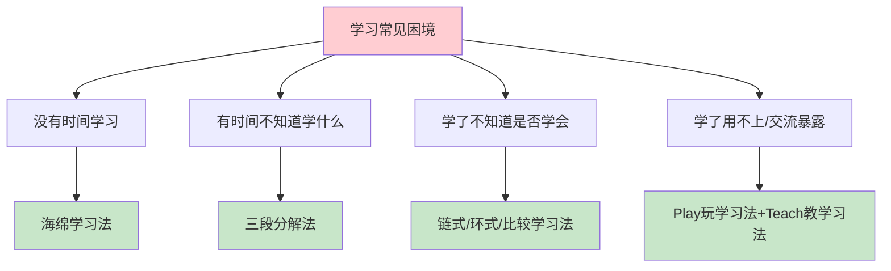
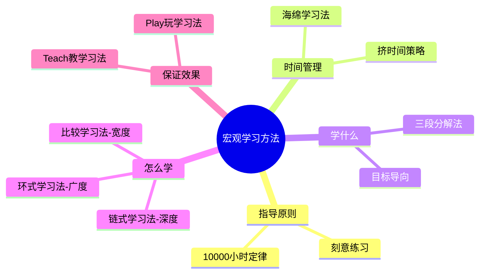
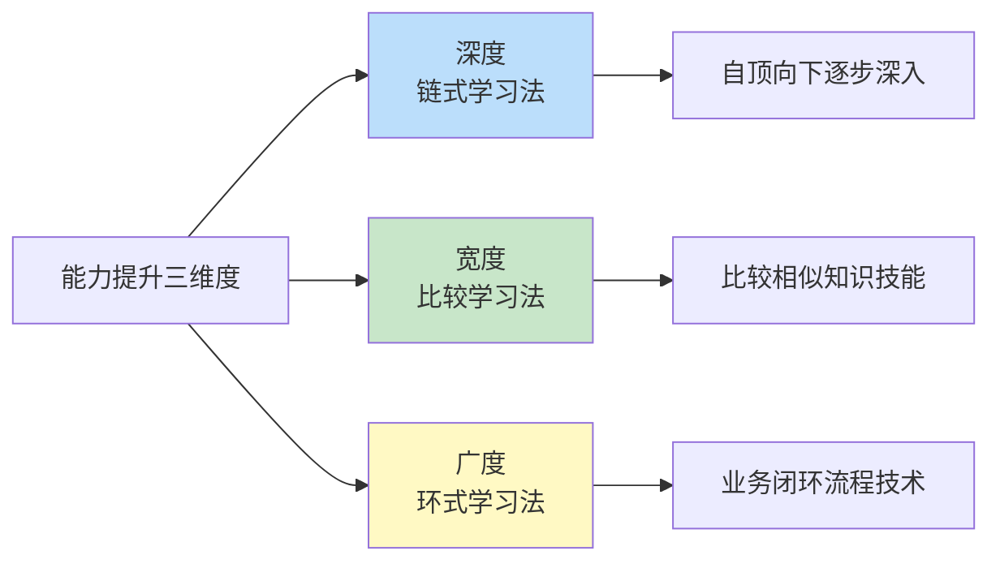
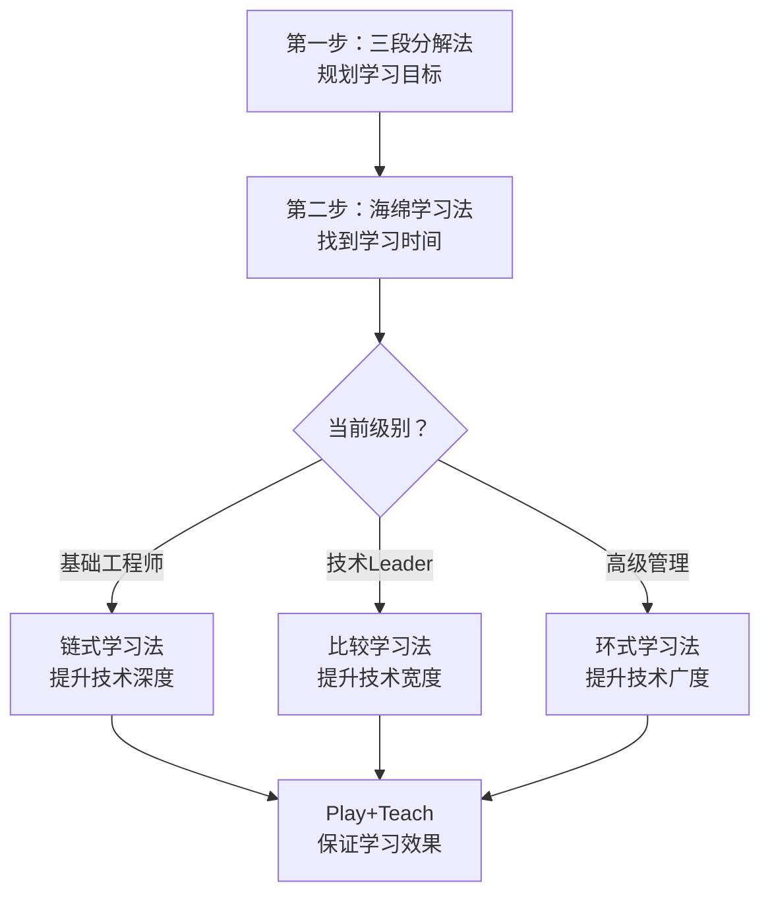

# 3.1宏观学习的方法
#### 目录介绍
- [01.先来说一个场景](#01先来说一个场景)
- [02.宏观指导的原则](#02宏观指导的原则)
- [03.用海绵法找时间](#03用海绵法找时间)
- [04.学什么三段分解](#04学什么三段分解)
- [05.链式和环式思考](#05链式和环式思考)
- [06.玩和教保证效果](#06玩和教保证效果)
- [07.学习方法论沉淀](#07学习方法论沉淀)
- [08.组合地灵活使用](#08组合地灵活使用)
- [09.总结和梳理一下](#09总结和梳理一下)
- [10.思考题要做一下](#10思考题要做一下)

## 01.先来说一个场景

不知道你有没有这样的感受：上班累得要死，还要陪家人，还有群里各种吃瓜，看剧，根本就没什么时间学习；等到哪天有点空余时间，又因为没有计划，只能随便找本书或者上网学习看看。

就算知道要针对某个技能专门提升一下，也不知道怎么学才能达到精通水平；过段时间回头一看，前几weeks学的东西又忘得差不多了；跟别人交流一下子就暴露了水平……

**根据上面的例子，小杨大概拆分成几个问题**：

1. 没有时间去学习
2. 有了空闲时间不知道怎么安排
3. 即使学习了后不知道是否学会
4. 感觉学到了但是一旦交流或使用，又不会呢。

因此建立一套学习机制很关键，或者写，或者做，或者计划，或者跟小伙伴交流，需要什么样的准则，下面会逐一说到……

## 02.宏观指导的原则

一套系统的学习方法，既需要一个统领全局的宏观指导原则，让人能够一目了然地理解它的核心内容，同时也要能够回答以下四个关键问题，小杨总结如下：

1. **刻意练习**？学习渠道，信息太多了，如何保证自己有效学习并学以致用。
2. **时间从哪里来**？如果没有足够的时间投入，再好的理论也只是纸上谈兵。
3. **学什么**？找到正确的学习方向，明确了学习的目标，才能做到有的放矢。
4. **怎么学**？不同的学习目的应该有不同的学习方法，保证学习的投入产出比。
5. **怎么保证学习效果**？如何解决"学了用不上，学了就忘"两个常见影响学习效果的问题。

## 03.用海绵法找时间

总的指导原则是10000小时定律，它是一个很出名的，用于专业领域提升的理论。

有大量的相关资料可以参考（例如《异类》《1万小时天才理论》等），其核心思想是：**如果你想要在专业领域不断提升自己的能力，必须投入足够的时间**。

10000 小时可不短，相当于平均每天3小时，持续10年时间。平时工作就已经"累成狗"了，可能还有家人需要照顾，怎么才能找到自己的10000小时呢？

这就要靠海绵学习法。海绵学习法是一个时间管理方法，它可以让你轻松地挤出时间，既不会对工作、家庭和娱乐有明显的影响，又能够兼顾学习。

## 04.学什么三段分解

有了时间之后，我们要学什么呢？怎么才能制定合理的学习目标呢？如何制定可行的学习计划并能够真正落地呢？这就要靠三段分解法。

三段分解法是制定学习目标和计划的方法，它基于职业等级体系，将10000小时逐级分解，最终落实到可以实施的各项学习行动。

## 05.链式和环式思考

确定目标和计划后，我们具体要怎么提升能力呢？能力可以拆解成三个维度：深度、宽度和广度。针对能力的不同维度，有3个不同的学习方法：

**链式学习法**适合提升深度，通过自顶向下逐步深入的方式，将关联技术逐一掌握。

**比较学习法**适合提升技术宽度，通过比较相似的知识或者技能，全面掌握单个领域的技术。

**环式学习法**适合提升技术广度，通过学习业务闭环流程中相关技术，全面掌握多个领域的技术。

## 06.玩和教保证效果

就算用对了方法，在学习过程中还是会遇到一些难以解决的困难，这些困难会导致我们学习效果不好。

**第一个常见困难是，如果平时不学，真正要用的时候又来不及临时学；但如果平时学了，可能要等很久才能在工作找到的实践机会，到时候技术可能都生疏了**。

**第二个常见的困难是，学完之后感觉学得不深，跟别人讨论的时候，或者在晋升答辩环节被问到的时候，就发现很多东西明明学过，却说不出个所以然来**。

针对这两个常见影响学习效果的问题，小杨通过学习和实践，归纳提炼出如下两种学习方法：

Play——玩学习法，可以用来解决工作中暂时没有实践机会的问题，学以致"玩"，通过"玩耍"的方式来应用。

Teach——教学习法，可以用来解决学得不深的问题，教学相长，通过"教学"的方式来加深理解。

## 07.学习方法论沉淀

通过三步学习法规划，第一步制定目标；第二步实践学习；第三步运用输出。

通过极简学习法实践，极简学习法作为一种高效的学习方法，通过精简资源、时间和学习材料，帮助我们更专注于最重要的概念和技能，从而实现用最小的投入获取最大的学习收益。

通过费曼学习法输出，费曼学习法就是一个操作简单，并且具有普适性的方法，它只有四个步骤：假装讲给孩子听、复习卡住的地方、整理并简化笔记、讲给别人听至懂。

## 08.组合地灵活使用

这些学习方法是相辅相成的，你可以根据你当前的级别和实际工作内容，把它们组合起来使用，具体的方式如下：

**第一步，无论你当前是什么级别，先用"三段分解法"来规划你的学习目标和计划**。

**第二步，使用"海绵学习法"来找到你可以用于学习的时间**。

**第三步，根据学习目标采取相应的学习方法**。

如果你是基础工程师，你的技术提升，以技术深度为主，你可以采取"链式学习法"来学习某技术以提升技术深度；

如果你是技术leader级别，除了技术深度外，还需要提升技术宽度，你可以采取"比较学习法"来学习某个领域技术；

如果你是高级管理级别，你可以采用"环式学习法"来学习跨领域的技能，比如学习大前端等业务闭环流程涉及的技术领域。

如果你是吃瓜群众，你当然也可以采用该方法，了解该吃什么瓜，怎么吃，如何收集信息，如何发表自己观点等等，照样可以提高吃瓜能力。

## 09.总结和梳理一下

总结一下这一讲的重点内容：一套系统的学习方法，既需要一个总的指导原则，也需要回答 4 个关键问题：时间从哪里来？学什么？怎么学？怎么保证效果？

在总结的这套学习方法中，10000小时定律提供了指导原则；

1. 海绵学习法解决了时间从哪里来的问题；
2. 三段分解法解决了学什么的问题；
3. 链式、环式和比较学习法解决了怎么学的问题；
4. Play 和 Teach 学习法解决了怎么保证学习效果的问题。

学习方法是相辅相成的，你需要基于当前的级别和工作内容，把多个方法组合起来使用。

## 10.思考题要做一下

你在学习过程中遇到的最大困难或者困惑是什么？你尝试了什么解决方法呢，效果怎么样？

