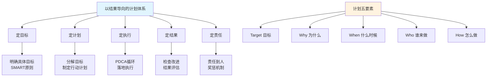

# 4.1以结果导向计划
#### 目录介绍
- [01.看看小杨的案例](#01看看小杨的案例)
- [02.小杨该如何去做](#02小杨该如何去做)
- [03.要以结果为导向](#03要以结果为导向)
- [04.定目标明确目标](#04定目标明确目标)
- [05.定计划分解目标](#05定计划分解目标)
- [06.定执行落地策略](#06定执行落地策略)
- [07.定结果检查改进](#07定结果检查改进)
- [08.定责任推动奖惩](#08定责任推动奖惩)

## 01.看看小杨的案例

小杨是一名刚参加工作的运营数据分析师，最近直属领导给了他一个项目，一个月后要看这个结果，部门大领导到时候需要小杨去做汇报。

小杨兴冲冲地拿到了数据源，一番操作：数据清洗、统计汇总、归因分析，把当月的数算了个平均值，大概感觉了一下，然后在周五下班后加了一会儿班，兴冲冲地在工作大群里发给了总监。

总监把小杨叫过去，问他，这个结果该怎么看，有对照吗，你得出来这个数据的计算逻辑是什么，有参照吗，这些策略规则的价值点、意义是什么？

总监批评了小杨一个小时，小杨本以为终于拿到重要项目了，还可以表现一下自己，结果……如果小杨按照计划管理的方式去做这个项目，那么结果会完全不一样。

## 02.小杨该如何去做

**那么小杨该怎么做才能不被领导批评呢**。最开始拿到需求的时候，对待不懂不明确的地方要多问，尤其是找到需求方，理解他的目标是否合理，目标是什么，业务场景是什么？

其次明确了需求之后，按照以往的经验，比如这个数据策略的项目，先观察现有数据特征，是否需要加入对照组，历史同比/环比的平均水平值是多少，基于历史的基准，然后来做筛选和判断。

预估工期多久，及时反馈给领导需要多久可以做完，有什么困难，哪些资源拿不到需要去协调？

然后得到了数据的汇总统计结果之后，该用什么形式来展示？是通过表格展示还是ppt或者思维导图呈现。

最后基于前面几个步骤，该怎么呈现出结果，这些数字或者结论能怎么反馈出这次的项目效果，可以做出什么策略调整？一切都需要做好详细的计划！

## 03.要以结果为导向

从目标设定、计划制定、执行、检查、结果确认、责任明确和奖惩机制等方面，探讨如何构建以结果为导向的执行力。

那么为什么要做计划？目前是我们可以明确目标，然后去评估拥有的资源和当前情况，然后确定具体方案，最后才会有工作效率和工作质量的提升。

做计划有五要素：Target、Why、When、Who、How，即做一件事之前先想清楚目标/目的是什么，为什么要做这件事？即痛点是什么？

花多久时间去做这件事/项目？排期是多久？需要跨部门、组内协调资源吗？谁配合？技术方案/解决方案是什么？怎么去做？适用场景有哪些呢？

小到简单的需求多问几个为什么？大到复杂的项目可以科学的规划，把控进度和节奏，能够给领导做及时的正向反馈，也能让需要配合的同事心里有数需要做什么？

## 04.定目标明确目标

以目标为导向是一种管理和行动的方法，它强调将行动和决策与明确的目标相对应。这种方法的核心是确保所有的努力都朝着实现预定目标的方向前进。如何明确目标呢？

1. 具体化目标：确保您的目标是具体和明确的。避免模糊的表述，而是明确指定您想要实现的结果。例如，将目标从“提高销售”具体化为“增加销售额10%”。
2. 要可衡量性：确保您的目标是可衡量的，使用具体的指标或度量标准来衡量目标的实现程度。例如，使用销售额、客户满意度调查结果等来衡量目标的达成情况。
3. 要可实现性：确保目标是可实现的，并与能力和资源相匹配。考虑目前的情况、可用的资源和时间，以确保目标是合理和可行的。
4. 要有时限性：为目标设定明确的截止日期或时间范围。这将帮助您保持紧迫感和动力，并能够跟踪进展。
5. 一定写下来：将目标写下来，并将其放在一个可见的地方。这样可以提醒您，并使目标更加具体和真实。

## 05.定计划分解目标

在明确目标之后，需要将目标分解成具体的任务，并制定相应的计划。计划要具有可行性、可操作性和可评估性。

确保每个任务都有明确的责任人、完成时间和质量要求。同时，计划还要注重灵活性，以应对可能出现的各种变化。

有了具体的计划，但经常还是一年过去，发现实际和计划相比，总是有差距。是的，这是普遍现象，你可能并不例外：统计数字表明，在年初制定了计划的人中，只有 8% 实现了这些计划。

对于计划的估计总是过于乐观，乐观地期待 “惊喜”，然后又“惊吓”地接受现实。那如何才能让计划更具可行性呢？又可以从哪些方面来检视呢？

1. 确定主要目标：首先明确主要目标和次要目标。确保目标是具体、可衡量、可实现和有时限的。
2. 识别关键要素：确定实现主要目标所需的关键要素或关键任务。这些是实现目标所必需的关键步骤或组成部分。
3. 划分为子目标：将主要目标分解为更小的子目标。每个子目标应该是可衡量和可实现的，并且与主要目标直接相关。
4. 要确定里程碑：为每个子目标设定明确的里程碑或关键阶段。这些里程碑将帮助跟踪进展，并提供实现目标的里程碑标志，根据需要进行调整和修正。
5. 制定行动计划：为每个子目标制定具体的行动计划。确定需要采取的具体行动步骤、资源需求和时间安排。

## 06.定执行落地策略

执行是计划得以实现的关键环节。需要将计划细化到每个岗位、每个员工，确保人人有事干、事事有人干。

在执行过程中，要注重沟通协调，确保各部门之间的顺畅配合。同时，还要不断推动PDCA循环（计划-执行-检查-处理），通过持续改进来提高执行力。

## 07.定结果检查改进

检查是确保执行效果的重要手段。需要在执行过程中设置检查点，对任务完成情况进行定期或不定期的检查。

通过检查，及时发现并纠正问题，确保任务按照既定计划进行。同时，还要注重结果的质量，确保最终成果符合企业的要求。

结果的确认是执行过程的最后环节。企业需要对执行结果进行认真评估和总结，明确哪些做得好、哪些需要改进。

对于好的结果要给予表彰和奖励，以激发员工的积极性和创造力；对于不好的结果则要深入分析原因，找出问题所在，并制定相应的改进措施。

## 08.定责任推动奖惩

在执行过程中，责任要明确到人。每个人都要清楚自己的职责和任务，确保在执行过程中能够承担起相应的责任。

同时，还要建立责任追究机制，对于执行不力或造成损失的员工要给予相应的惩罚和纠正。

奖励要公正、公开、透明，确保能够激发人的积极性和创造力；惩罚则要严格、公正、合理，确保能够起到警示和纠正作用。

