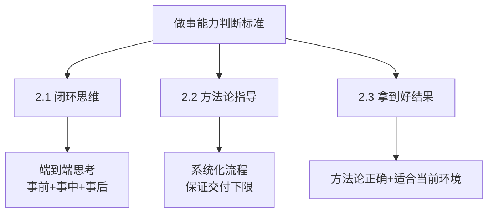
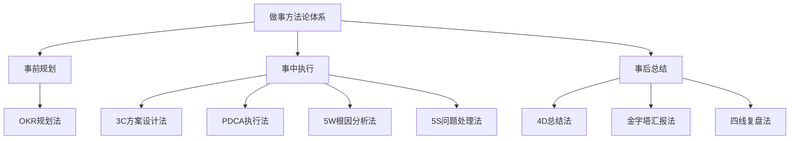
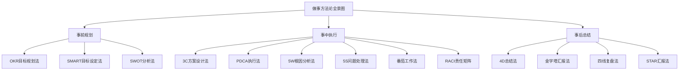
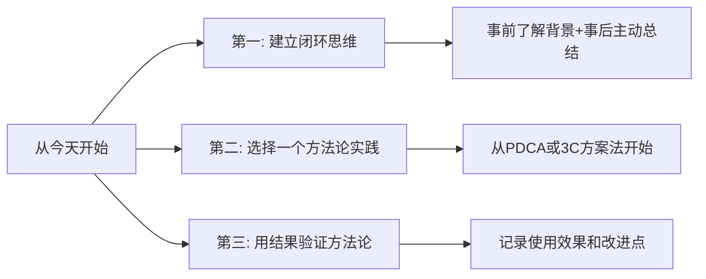

# 5.1掌握些做事方法
#### 目录介绍
- [1.先来说一个背景](#1先来说一个背景)
- [2.能力的判断标准](#2能力的判断标准)
- [3.讲究做事的方法](#3讲究做事的方法)
- [4.做事方法论全景](#4做事方法论全景)
- [5.最后总结一下](#5最后总结一下)
- [6.今天起改变三点](#6今天起改变三点)
- [7.课后作业思考下](#7课后作业思考下)

## 1.先来说一个背景

先看一个案例，你在工作中肯定听到过这样的评价，"这个人做事很靠谱"或者"这个人做事很厉害"。但是你有没有想过：同一个部门的人，级别一样，岗位职责一样，参与的项目也差不多，为什么你会觉得其中某些人做事就是比大部分人更靠谱、更厉害呢？

你可能会认为，这是因为他们态度更积极，更加会表现。但是如果你带过团队就会知道，做事的态度和做事的能力不是等价的。尤其是在部门绩效拉通和晋升预审这些场合，如果你向其他部门的负责人介绍的时候，说自己团队的某个成员"做事积极主动，很认真，很拼"，那么多半会被"怼"得很惨。比如有人可能会说："晚上9点下班就算拼了？我们团队的 xxx 做项目的时候都是11点才准备下班。"

那么，高级别的管理者是怎么判断你的做事能力强不强的呢？有三条判断标准是能够达成共识的。

### 2.能力的判断标准

### 2.1 具备闭环思维

什么是闭环思维：**闭环思维是最基本的能力要素，也就是说，做事的时候不能只是完成任务了事，而是要从端到端的角度去思考和落地。端到端的过程！**

无论什么事情，端到端的过程都可以分为事前规划、事中执行和事后总结三个阶段，但是大部分人都只关注"事中执行"的阶段，而对事前和事后两个阶段并不在意。

| 闭环阶段 | 核心动作 | 大部分人的状态 | 闭环思维的做法 |
|----------|----------|---------------|---------------|
| 事前规划 | 了解背景、明确价值 | 觉得"不是我的事" | 主动了解为什么做、价值是什么 |
| 事中执行 | 落地方案、推进任务 | 只关注这个阶段 | 高质量执行+及时同步信息 |
| 事后总结 | 复盘结果、提炼经验 | 觉得"不是必须的" | 主动总结、汇报、沉淀方法论 |

1. 第一个原因是，这两个阶段不是自己负责的。比如对技术人员来说，需求是产品经理提的，需求上线后也是产品经理来做业务分析，这些都不是你的本职工作。 
2. 第二个原因是，这两个阶段的任务并不一定是强制要求的。比如有些团队的 Team Leader 是问题驱动型的，要么完成项目任务，要么处理问题，而不会主动去规划什么东西，因为规划有时候是一件很费脑筋的事情。也有的人完成任务就万事大吉，接着去做下一个任务，而不会对当前任务进行总结，不会去想哪些做得好可以传承，做得不好可以改进。

但是如果你有了闭环思维，那么就算不是你自己负责的事情，或者不是强制要求的事情，你也会想方设法地去了解更多信息，思考下次怎么做得更好。

举个实际开发案例，以开发人员为例，虽然你只负责开发环节，但是如果按照闭环思维来做事，在做之前你除了理解需求之外，还应该去了解"为什么做这个需求""需求的价值是什么"（事前规划），需求上线之后，你还应该去了解"需求上线后的结果怎么样？""具体的业务数据是多少？""我通过做这件事情收获了什么"（事后总结）等等。

而如果你本来就是端到端地负责某件事情的话，那就更加需要学会事后复盘、给领导汇报等技巧了，而不是做完事情之后被动地等着别人来问结果。

### 2.2 有方法论指导

为何需要方法论：有了闭环思维，做事就已经比较靠谱了。但是事情能不能做得漂亮，光有闭环思维是不够的，还需要看你的做事有没有方法论，也就是说，你做事的时候不只是靠经验教训的历史积累，还有一套系统的流程或者模板。

方法论的第一个优势在于，无论遇到什么情况，你都能取得比较好的结果，能够保证交付质量的下限。否则如果只凭经验，那么下次情况稍微发生一些变化，你就不适应了。

方法论的第二个优势在于，你的行为背后是有一套逻辑支撑的，而不是拍脑袋随便拍出来的，这样会更有说服力。比如你说"我觉得XX业务功能可以改一改"，但是又给不出充分的理由，那么别人很可能认为你是在瞎指挥；但如果你分析业务数据和数据量化，在这个基础上提出改进建议，那么别人接受的可能性就大多了。

### 2.3 能拿到好的结果

有了方法论是不是就一定很厉害呢？其实还不一定。首先，你可能虽然有方法论，但其实你的方法论是错误的。其次，你之前形成的方法论可能很厉害，但并不适合当前公司或者业务。所以最后，判断你的方法论好不好，其实还是要看最后的结果好不好，给公司带来了多少价值，这也是晋升原则中的价值原则讲的内容。

虽然我们说是否能够拿到好的结果会有运气的成分，但剔除掉运气的因素，方法论的影响也很大。这也是很多从大公司出来的高P人员拿着原来的方法论到了中小公司或者创业公司，生搬硬套导致水土不服的原因。

## 3.讲究做事的方法

经过多年的实践检验和筛选，我逐步形成了一套系统的做事方法论，它按照闭环思维的三个阶段展开，整体结构如下：

事前规划

1. OKR 规划法：英特尔提出、谷歌发扬光大的方法，通过合理地设定目标和分解关键成果来弥补 KPI 的缺陷，用于制定工作规划。OKR 规划不同于传统
2. KPI 规划，更加注重聚焦和逻辑，你可以理解为"OKR 方法教你如何制定牛逼的 KPI"。

事中执行

1. 3C 方案设计法：我原创的方法，通过制定多个备选方案来系统地分析事情相关的方方面面，避免思维狭隘，用于设计合理的落地方案。 
2. PDCA 执行法：美国人提出、日本人发扬光大的方法，通过四个环节的循环来把控执行过程，保证具体事项高效高质地落地，用于推进事情的执行。 
3. 5W 根因分析法：丰田集团提出的方法，又叫"丰田五问法"，通过五个为什么来深挖问题本质，用于分析根本原因。 
4. 5S 问题处理法：我原创的方法，通过五个步骤来解决问题，化"危"为"机"，用于系统地处理问题。

事后总结

1. 4D 总结法：我原创的方法，通过四个维度来整理做事的收获，能够帮助你在完成任务后进一步全方位地提升自己的能力，用于事后总结。 
2. 金字塔汇报法：我参考麦肯锡的金字塔原理所提出的方法，通过遵循四个原则来展示工作成果，从而更容易获得高级别管理人员的认可，用于事后汇报。 
3. 四线复盘法：我原创的方法，通过四个角度来复盘重大问题，达到公平公正的处理效果，避免背锅和甩锅，用于重大问题发生后的复盘改进。

## 4.做事方法论全景

经过多年的实践检验和筛选，做事方法论可以分为三大类，覆盖事前、事中、事后全流程：

| 分类 | 方法论 | 核心用途 | 来源 |
|------|--------|----------|------|
| 事前规划 | OKR 规划法 | 制定工作规划和目标 | 英特尔提出，谷歌发扬光大 |
| 事前规划 | SMART 目标法 | 设定清晰可衡量的目标 | 管理学经典理论 |
| 事前规划 | SWOT 分析法 | 分析内外部优势劣势 | 战略管理经典工具 |
| 事中执行 | 3C 方案设计法 | 设计有理有据的方案 | 原创方法 |
| 事中执行 | PDCA 执行法 | 保证事项高效落地 | 美国提出，日本发扬光大 |
| 事中执行 | 5W 根因分析法 | 深挖问题根本原因 | 丰田集团 |
| 事中执行 | 5S 问题处理法 | 系统地处理问题 | 原创方法 |
| 事中执行 | 番茄工作法 | 提升专注力和执行效率 | Francesco Cirillo |
| 事中执行 | RACI 责任矩阵 | 明确任务角色分工 | 项目管理经典工具 |
| 事后总结 | 4D 总结法 | 全方位事后总结 | 原创方法 |
| 事后总结 | 金字塔汇报法 | 结构化展示工作成果 | 参考麦肯锡金字塔原理 |
| 事后总结 | 四线复盘法 | 重大问题复盘改进 | 原创方法 |
| 事后总结 | STAR 汇报法 | 结构化讲述工作经历 | 面试与汇报经典工具 |

除此之外，还有二八法则、六顶思考帽、MECE分析法、鱼骨图分析法等通用方法论，它们可以在不同阶段灵活运用，帮助你更系统、更全面地思考和做事。

## 5.最后总结一下

总结一下内容，关于做事能力，有三条业界达成共识的判断标准，分别是闭环思维、方法论和结果。

总结的做事方法分为事前规划、事中执行和事后总结三个阶段。方法论不是越多越好，关键是找到适合自己当前阶段的几个核心方法，反复练习，形成肌肉记忆。

记住一句话：**方法论的价值不在于你知道多少，而在于你用了多少。** 知道100种方法但一个都不用，不如只掌握3种方法但每天都在用。

## 6.今天起改变三点

**第一，从今天起建立闭环思维。** 接到下一个任务时，不要直接埋头开干。先花10分钟了解：为什么要做这件事？它的价值是什么？做完之后，再花10分钟总结：结果怎么样？我学到了什么？下次可以怎么改进？这30分钟的额外投入，会让你的做事质量产生质的飞跃。

**第二，选择一个方法论开始实践。** 不要贪多，先从最简单的开始。推荐从PDCA执行法入手——下一次做事的时候，先列计划（Plan），再执行（Do），做完检查结果（Check），最后总结改进（Action）。用一个月时间把这个方法练熟，再去学习下一个。

**第三，用结果来验证你的方法论。** 方法论好不好，不是看理论多么高大上，而是看用了之后结果有没有变好。每次使用方法论后，记录一下：用了什么方法？效果如何？哪里可以改进？持续迭代，形成属于你自己的做事方法体系。

## 7.课后作业思考下

1. 回顾你最近完成的一个项目或任务，用"事前规划-事中执行-事后总结"三个阶段来审视，你在哪个阶段做得好，哪个阶段有欠缺？
2. 从本章列出的方法论全景图中，选择一个你从未用过的方法论，在下一周的工作中刻意实践一次，记录使用过程和效果。
3. 找一位你认为"做事很靠谱"的同事或前辈，观察他/她做事的方式，看看能否识别出他/她使用了哪些方法论（即使他/她自己并不自知）。
4. 思考一下：你自己有没有什么独特的做事方法？如果有，试着用"背景-步骤-案例-适用场景"的结构把它整理出来，形成你自己的方法论。

