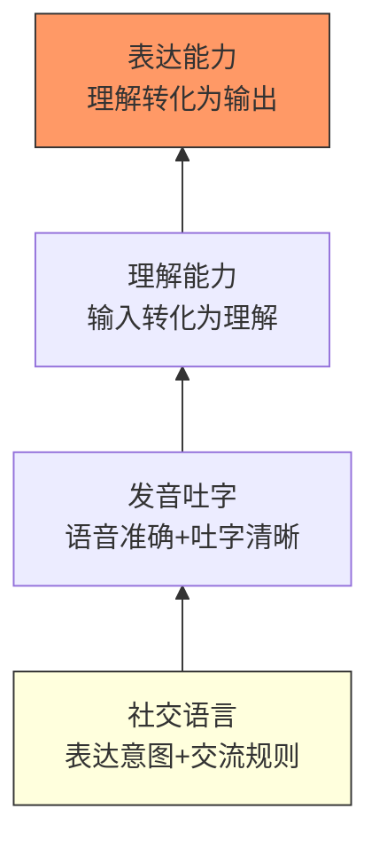
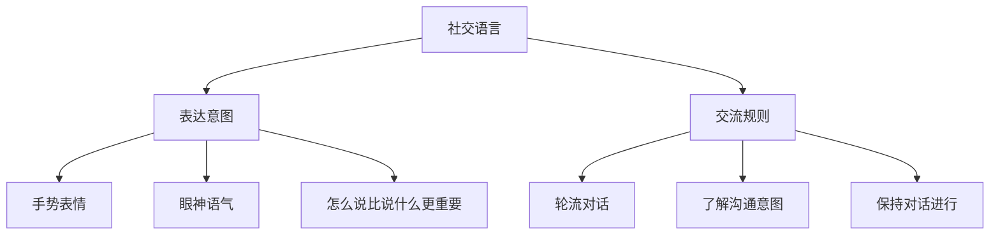
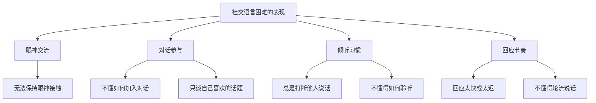
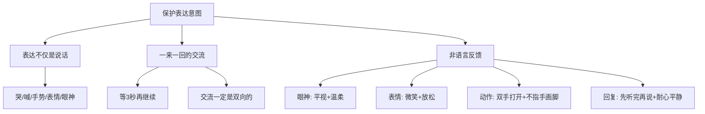
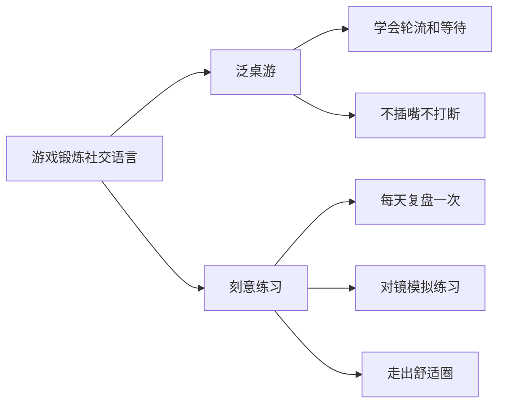
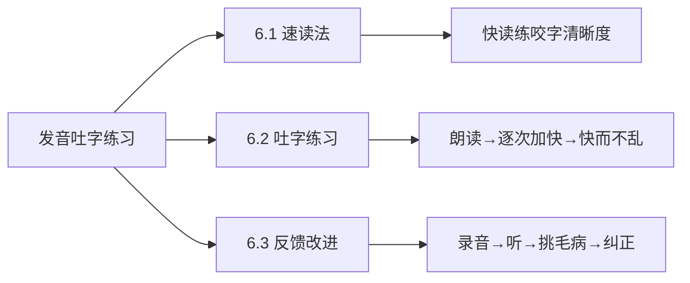
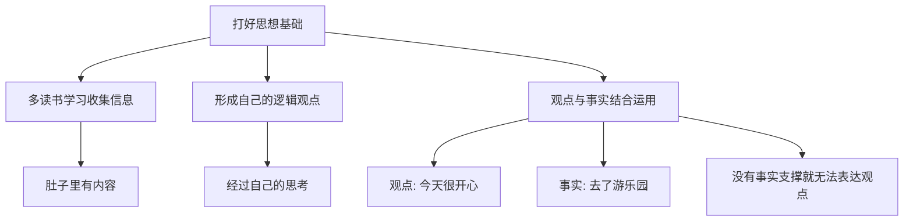
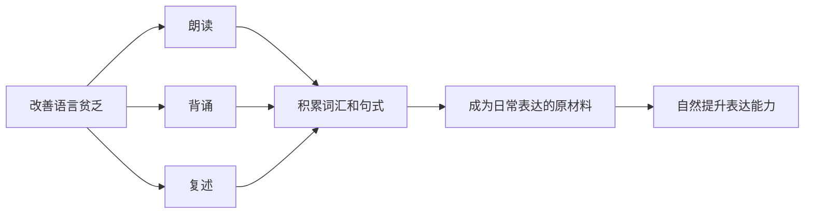

# 6.1语言底蕴的提升
#### 目录介绍
- [01.语言发展金字塔](#01语言发展金字塔)
- [02.社交语言是什么](#02社交语言是什么)
- [03.语言困难的表现](#03语言困难的表现)
- [04.保护好表达意图](#04保护好表达意图)
- [05.通过游戏来锻炼](#05通过游戏来锻炼)
- [06.发音吐字的练习](#06发音吐字的练习)
- [07.打好思想的基础](#07打好思想的基础)
- [08.改善语言的贫乏](#08改善语言的贫乏)
- [10.今天起改变三点](#10今天起改变三点)
- [12.课后作业思考下](#12课后作业思考下)

## 01.语言发展金字塔

讲话和演讲最基本的也是最重要的，就是要语音准确、吐字清晰、语言有底蕴。语言能力的金字塔，即语言发展的4大要素，由底层至顶层依次为社交语言、发音吐字、理解能力和表达能力。

社交语言：语言运用在社交场景中能发挥最大功能，

发音吐字：好的声音，不仅能准确恰当地表情达意，而且能声声入耳，娓娓动听。所以，要讲究发声的方法和技巧，还要不断训练发音吐字并且改进优化。

理解能力：是指将外界接收到的信息（听到的话、读到的文字）转化为自己能理解的内容的能力。没有理解力，就无法真正消化别人传递的信息，更无法做出有效回应。理解力是"输入"的关键环节。

表达能力：是语言金字塔的顶端，是将自己理解的内容转化为清晰、有条理的语言输出给别人的能力。表达力建立在前三层能力之上，只有社交语言、发音吐字和理解能力都打好基础，表达才能真正流畅自如。

## 02.社交语言是什么

社交语言的目的是表达意图和交流规则。这两点可以说是非常关键和重要！这就是社交语言，它在语言发展金字塔的底端。

表达意图：手势、表情、怎么说。表达意图不仅仅是开口说话，还包括你的每一个手势、眼神、表情等。另外，同一句话用不同的口气说，呈现的效果是不同的，表达的意图自然也不同。

交流规则：轮流对话，了解对方的沟通意图，保持对话的进行，交流是一个双向通道，要有一来一回、有来有往。其次，有些人不懂看眼色，不懂"听话听音"。了解对方沟通的意图，这也是交流规则。

另外，还有些人平时聊天的时候很容易把聊天"聊死"。那么，该怎么保持对话顺利进行，这也是交流规则。没有社交语言作为基础，上面的能力发展都会受到局限。

## 03.语言困难的表现

出现一些问题：平时说话、表达没有问题，但是出现了一些社交方面的困难，比如不合群、无法与人保持眼神交流等。基于上述特征，语言发展的评估细分出了"社交语言困难"这一名词。

社交语言困难的表现如下：无法保持眼神交流；不懂得如何加入同龄人的游戏中；不懂得轮流说话；不愿意分享；只谈自己喜欢的话题；总是打断他人对话，不懂得如何聆听；回应他人的时间不准确，如太快或太迟回应等。

## 04.保护好表达意图

要明白，表达不仅仅是说话，还包括哭、喊、叫、手势、表情、眼神等。

从难受时候的哭，到遇到挫折后的丧气，这些都是表达；一开心就乱拍手，笑的表情，看着别人的眼神，这些也是表达。因此，需要及时地反馈，保护好表达意图。

### 4.1 表达需要一来一回

别人可能刚想跟你表达，因为你不停地说，别人一下子就蒙了，不知道接下来该怎么办。从你那里接收的情绪感觉是哪里不对。

因此，真正保护好表达意图，需要一来一回，等3秒再继续。什么叫慢慢说话？就是一来一回的表达……交流一定是双向的！

### 4.2 非语言的表达反馈

语言发展过程中，对待别人的表达，除了给出及时反馈之外，还需要有一些非语言上的反馈相结合。动作、表情、语气都是非常重要的。

眼神：和别人平视甚至略低于别人眼睛，这样他人可以感受到平等和安全。如果是居高临下，会让别人感受到地是威胁。

表情：脸部放松、眼神温柔、嘴角上扬保持微笑。如果是眉头紧锁、面部紧绷、嘴巴下垂，那让别人也不容易聊下去。

动作：双手打开、温柔比划、特别注意不要指手画脚。如果是站着、不耐烦地走动、双手叉腰或环绕胸前、用手指着鼻子，那会导致别人反感。

回复：等待别人说完再回复、先提问澄清再评判、耐心平静的说话。如果是打断、大吼、打断、情绪激动，那表达将难以和谐！

## 05.通过游戏来锻炼

特别推崇"玩中学"。因此，可以通过一些合适的游戏来锻炼社交语言。"泛桌游"：学习"轮流"的概念，第一个游戏，把它称作"泛桌游"。桌游这个概念大家应该不陌生了。

需要明白社交语言里交流的规则：你说完我说，不随意插嘴，不打断别人。桌游是培养交流规则、学习轮流概念特别好的游戏之一。这样一来一回，慢慢地就学会了轮流和等待。

刻意练习。每天进行一次复盘，反思当天哪几个场景下自己已经做得很好了，哪几个场景可以做得更好。

对于可以做得更好的地方，在脑海里复盘、演练一遍：下次遇到类似的场景可以怎么说？肢体语言可以怎样？眼神可以怎样？语气、语调可以怎样？

甚至可以对着镜子练一下。学习的本质就是难的，当你觉得很难时，就需要刻意地去强化、去练习，走出舒适圈。

## 06.发音吐字的练习

### 6.1 尝试速读法

速读法是一个锻炼语音准确、吐字清晰的有效方法，这是因为快读能练习咬字清晰度、发音准确度，而且是能练习思维的敏捷度和反应的快速度。

### 6.2 怎么练习吐字

找一篇演讲词或一篇优美的散文。先拿来字典、词典把文章中不认识或弄不懂的字、词查出来，彻底弄明白，然后开始朗读。读的过程中不要有停顿，发音要准确，吐字要清晰，要尽量达到发声完整。

因为如果你不把每个字音都完整地发出来，那么，速度加快以后，就会让人听不清楚你在说什么，也就失去了"快"的意义。

一般开始朗读的时候，速度较轻，逐次加快，一次比一次读得快，最后达到你所能达到的最快速度。快而不乱，每个字、每个音都发得十分清楚、准确，没有含混不清的地方。

速读法练习的优点是不受时间、地点的约束，无论何时、何地，只要手头有一篇文章就可以练习，而且还不受人员的限制，不需要别人的配合，一个人就可以独立完成。

### 6.3 吐字反馈和改进

当然你也可以速读练习的时候用录音笔，练习完后自己听听，挑出速读中出现的毛病。比如，哪个字发音不够准确，哪个地方吐字还不清晰等，这样就更有利于你有目的地进行纠正、学习，进行改进。

## 07.打好思想的基础

克服思想贫乏只有一个途经，就是多去读书，学习，收集信息，然后以此来形成自己逻辑的观点，让自己的大脑有很多想法。

如果你肚子里面没有充足的内容，而且你对这些内容，没有经过自己的思考，你很难形成自己的表达体系。观点与事实的运用，就是我们表达的基础。

我今天过得很开心，是你的观点；我今天去了游乐园，是你的事实。如果你没有事实的支撑，你就无法跟别人表达你很开心这个心情。

## 08.改善语言的贫乏

为什么主张朗读，背诵和复述这些锻炼方法呢？因为这种方法，可以积累丰富的词汇和句式，而这却是我们表达的原材料。

多阅读，多看书，多朗读，从中积累相当数量的词汇和句式。那么这些语言材料就会成为我们日常的表达式，自然提升我们的表达能力。

## 10.今天起改变三点

对于沟通，"说什么"和"怎么说"同样重要。怎么说，其实就是一种沟通技巧。

第一，当你还在着急为什么不说话时，请提醒自己：表达不仅仅是会开口，保护表达意愿更重要。及时给予反馈，注意非语言信号（眼神、表情、动作），让每一次交流都是双向的。

第二，从今天开始刻意练习社交语言。每天至少进行一次复盘：今天哪些场景我做得好？哪些可以改进？下次遇到类似场景该怎么应对？对着镜子练一练你的表情和肢体语言。

第三，坚持朗读和速读训练。每天花10-15分钟朗读一篇文章或演讲稿，先慢后快，注意发音准确、吐字清晰。录下音来回放听，找出自己的薄弱点，有针对性地改进。积累的词汇和句式会逐渐转化为你的日常表达能力。

## 12.课后作业思考下

写下自己现在的社交语言现状是怎样的，希望改进的地方是什么，进行细节化。

