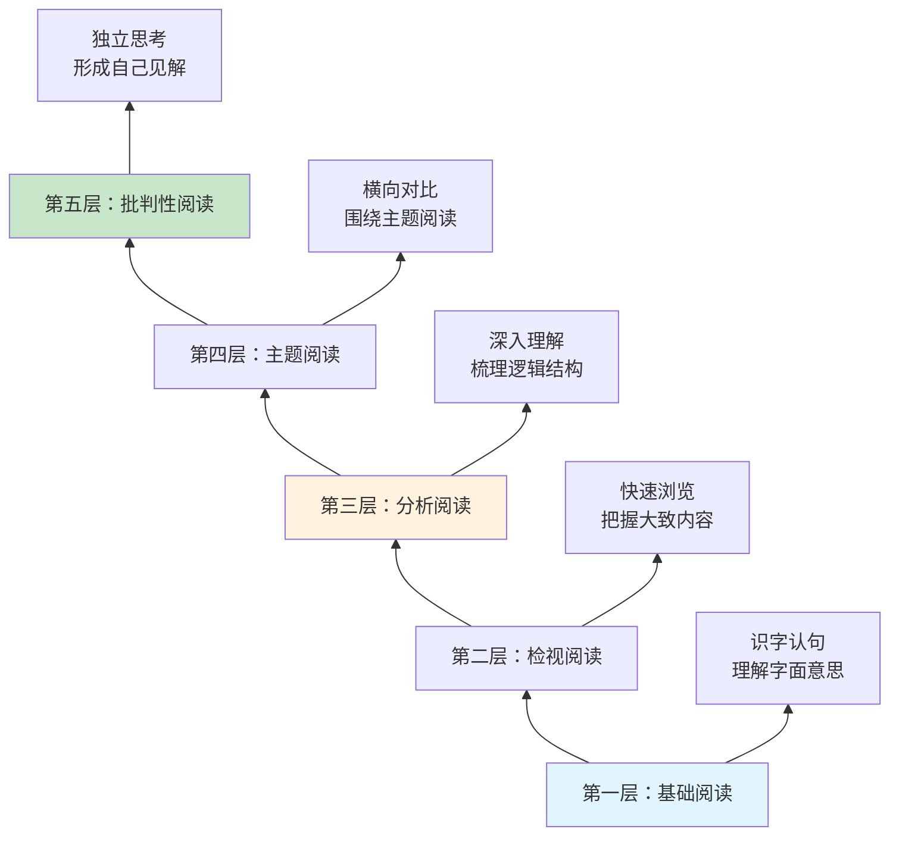
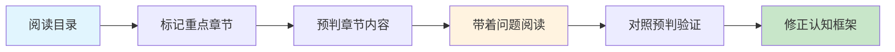
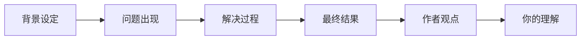
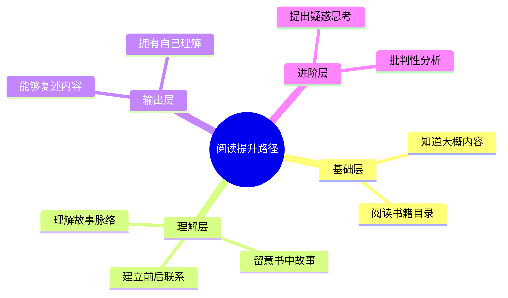

# 6.2阅读的持续提升
#### 目录介绍
- [01.阅读提升的背景](#01阅读提升的背景)
- [02.阅读能力有层次](#02阅读能力有层次)
- [03.阅读能力的分层](#03阅读能力的分层)
- [04.知道阅读的大概](#04知道阅读的大概)
- [05.阅读书籍的目录](#05阅读书籍的目录)
- [06.留意书里的故事](#06留意书里的故事)
- [07.前后建议起联系](#07前后建议起联系)
- [08.理解故事的脉络](#08理解故事的脉络)
- [09.能够复述出内容](#09能够复述出内容)
- [10.拥有自己的理解](#10拥有自己的理解)
- [11.提出疑惑和思考](#11提出疑惑和思考)
- [12.课后作业思考下](#12课后作业思考下)

## 01.阅读提升的背景

在这个信息爆炸的时代，阅读能力比以往任何时候都更加重要。无论是工作中的技术文档、行业报告，还是生活中的书籍、文章，阅读都是我们获取知识、提升认知的核心途径。

然而，很多人的阅读还停留在"看过"的层面，看完一本书后，既说不出核心观点，也无法将书中的知识运用到实际中。这种低效的阅读方式，本质上是在浪费时间。

提升阅读能力，不仅仅是提高阅读速度，更重要的是提升阅读的深度和理解力，让每一次阅读都能产生真正的价值。

## 02.阅读能力有层次

阅读能力并非一成不变，而是可以通过有意识的训练不断提升的。根据认知发展理论，阅读能力可以划分为多个层次，从最基础的"识字阅读"到最高级的"批判性阅读"。

每个层次都有不同的特征和要求，了解这些层次有助于我们评估自己当前的水平，并有针对性地进行提升。

## 03.阅读能力的分层

将阅读能力细分为以下几个可操作的层级：

| 层级 | 能力描述 | 核心动作 | 检验标准 |
|------|----------|----------|----------|
| **Level 1** | 知道大概内容 | 浏览目录和标题 | 能说出书的主题 |
| **Level 2** | 留意关键信息 | 标记重点段落 | 能复述核心故事 |
| **Level 3** | 建立前后联系 | 做笔记、画导图 | 能梳理逻辑脉络 |
| **Level 4** | 理解深层含义 | 思考为什么 | 能解释背后原理 |
| **Level 5** | 复述并表达 | 写读书笔记 | 能讲给别人听 |
| **Level 6** | 形成自己见解 | 结合经历思考 | 有独立的观点 |
| **Level 7** | 提出质疑思考 | 批判性分析 | 能发现不足之处 |

## 04.知道阅读的大概

对我来说，我知道阅读是有趣的、好玩的。只有觉得有趣，才会想去学。有趣比有用更重要。

在开始阅读一本书之前，先花5-10分钟快速浏览，了解这本书大概讲什么内容。这个阶段的目标不是深入理解，而是建立一个整体的框架感。

具体做法包括：看封面、序言和推荐语，了解作者背景和写作目的；浏览目录结构，了解全书的章节安排和逻辑线索；随机翻看几页，感受作者的写作风格和内容深度。

## 05.阅读书籍的目录

目录是一本书的骨架，通过仔细阅读目录，你可以快速掌握全书的知识结构。好的阅读习惯是，先把目录当作一张"地图"来研究。

具体做法：将目录手抄或拍照保存；标记出你最感兴趣或最需要的章节；根据目录预判每个章节可能讲述的内容；带着问题去阅读对应的章节。

## 06.留意书里的故事

留意一下阅读中，你印象深刻的故事。故事是知识的载体，人类的大脑天生对故事有更强的记忆力。

在阅读过程中，要特别关注作者用来说明观点的案例和故事。这些故事往往是作者精心挑选的，它们能帮助我们更直观地理解抽象的概念。

建议在阅读时准备一个笔记本，记录下让你印象深刻的故事，并标注它出现在哪个章节、用来说明什么观点。这样做的好处是，当你需要向别人解释某个概念时，可以直接引用这些故事。

## 07.前后建议起联系

高质量的阅读不是线性的，而是网状的。在阅读过程中，要有意识地将当前阅读的内容与之前读过的内容建立联系。

比如，你在读到第五章的某个观点时，发现它和第二章的某个案例有呼应关系，这就是在建立联系。这种联系越多，你对全书的理解就越深入。

同时，也要将书中的内容与你已有的知识和经验建立联系。这就是"温故而知新"的过程，将新知识嫁接到已有的知识树上，形成更加稳固的理解。

## 08.理解故事的脉络

在留意故事的基础上，进一步理解故事背后的逻辑脉络。一个好的故事通常包含：背景设定、问题出现、解决过程和最终结果。

理解脉络的方法：尝试用自己的话，将一个故事的起因、经过、结果串联起来；思考作者为什么选择这个故事来说明观点；如果换一个故事，效果会不会一样。

## 09.能够复述出内容

能够复述是检验理解程度的重要标准。如果你读完一本书或一个章节后，无法用自己的话复述出核心内容，说明你的理解还不够深入。

复述的几个层次：第一层，能说出这本书/章节讲了什么主题；第二层，能说出核心观点和论据；第三层，能用自己的例子来说明这些观点；第四层，能向完全不了解的人解释清楚。

建议每读完一个章节，花5分钟合上书，尝试用自己的话复述核心内容。如果发现说不清楚的地方，再回去重新阅读。

## 10.拥有自己的理解

阅读的最终目的不是记住作者的观点，而是在此基础上形成自己的理解和见解。

具有独立理解的标志：能够结合自己的经历和认知，对书中的观点进行补充或修正；能够发现不同书籍之间观点的异同，进行比较分析；能够将书中的理论转化为可落地的行动方案。

写读书笔记是培养独立理解的最佳方式。好的读书笔记不是抄书，而是写下你的思考、联想和感悟。

## 11.提出疑惑和思考

批判性阅读是阅读能力的最高层次。它要求我们不盲目接受作者的观点，而是带着质疑的态度去思考。

批判性阅读的要点：作者的论据是否充分？是否存在逻辑漏洞？作者的观点是否有适用边界？在什么情况下可能不成立？是否存在作者没有考虑到的角度？如果将这些观点应用到不同场景，结果会怎样？

## 12.课后作业思考下

1. 回顾你最近读的一本书，你能用自己的话复述出核心内容吗？
2. 在阅读过程中，你是否有意识地将新内容与已有知识建立联系？
3. 尝试用本章介绍的分层方法，评估一下你当前的阅读能力处于哪个层级？
4. 选一本书，按照从目录到故事到脉络到复述的流程阅读一遍，看看效果如何？

