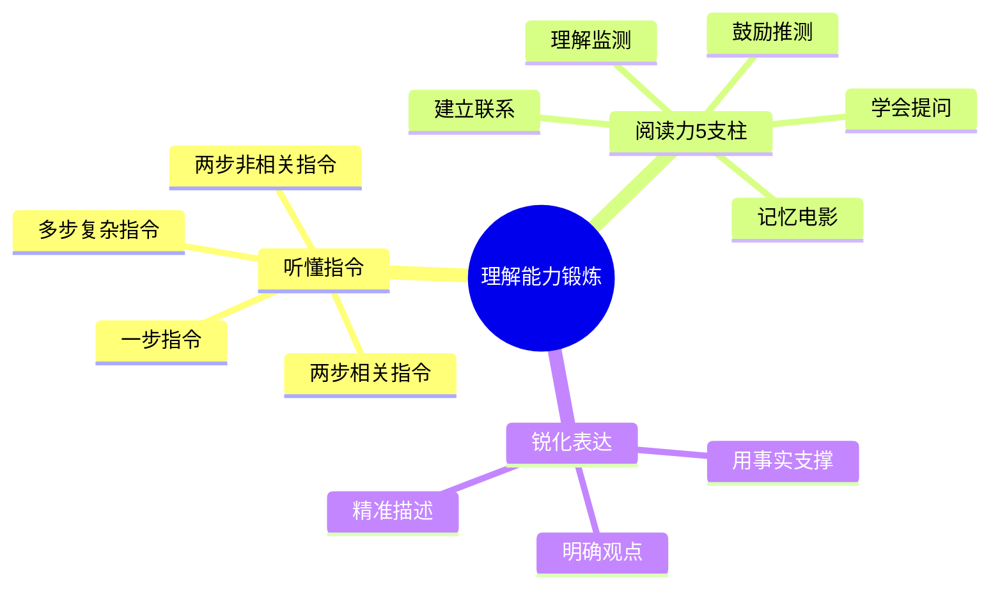
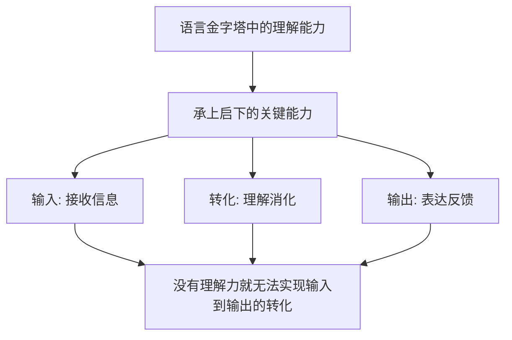
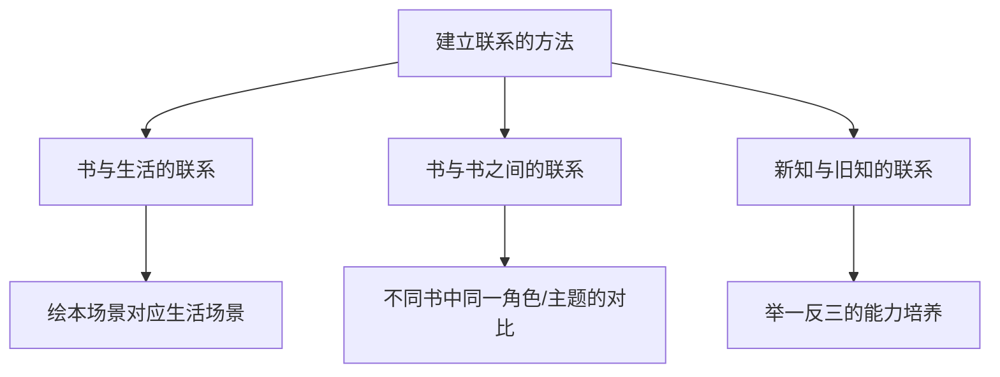
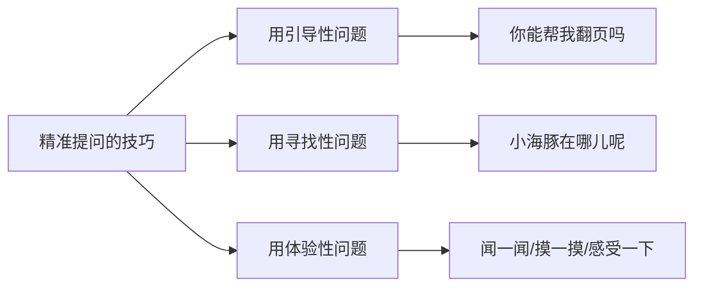
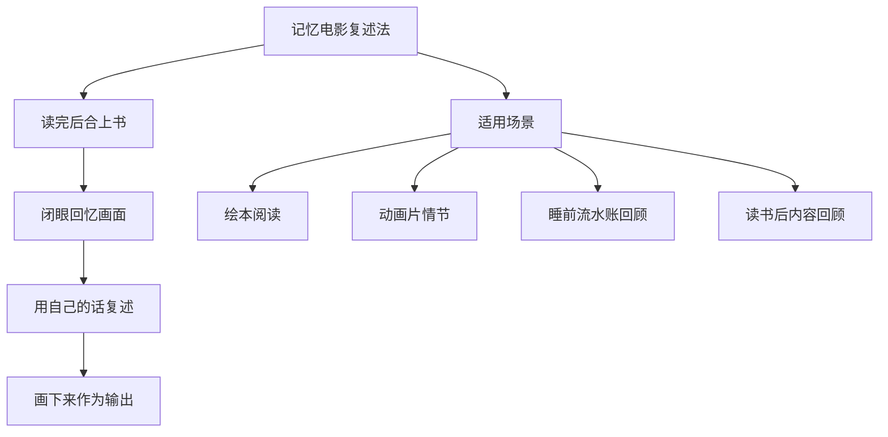
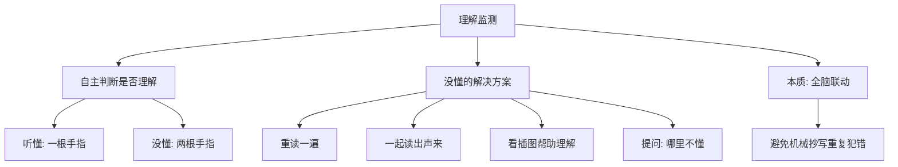

# 6.3理解能力的锻炼
#### 目录介绍
- [01.什么是理解能力](#01什么是理解能力)
- [02.如何清晰听懂指令](#02如何清晰听懂指令)
- [03.需要建议事物联系](#03需要建议事物联系)
- [04.怎样学会精准提问](#04怎样学会精准提问)
- [05.学会记忆电影复述](#05学会记忆电影复述)
- [06.带着疑惑鼓励推测](#06带着疑惑鼓励推测)
- [07.理解监测提升能力](#07理解监测提升能力)
- [08.去锐化表达能力](#08去锐化表达能力)
- [11.今天起改变三点](#11今天起改变三点)
- [12.课后作业思考下](#12课后作业思考下)

### 01.什么是理解能力

- 我们都追求金字塔顶端的"表达能力"，但在"表达能力"和"社交语言"当中，有一个承上启下的能力特别重要，那就是"理解能力"。
- 如果没有"理解能力"，就无法把我们对他说的话说出来， 也就是无法实现从"输入"转化为"输出"。

### 02.如何清晰听懂指令

- 孩子能听懂的指令是有发展规律的
    - 下达指令的时候不要超越这个规律了，比如一着急就会说："擦干脸、换衣服、背书包、上学去！"孩子根本记不住这么多。
- 平常可以玩一玩指令游戏
    - 珍珠两岁左右去上过几次早教课，老师就带着做这种游戏，那时候清楚的发现，刚两岁的孩子，如果给她两个指令"把倒的瓶子扶起来，拿一张香蕉的图片回来"，她真的会顾此失彼，就是她还没达到那个能力呢。

### 03.需要建议事物联系

- 从小孩角度看建立联系
    - 从父母的角度来说，建立联系是培养孩子举一反三能力特别好的方法。从孩子的角度来说，我们让孩子知道了阅读绘本对自己有什么好处。具体来说，就是可以跟孩子聊绘本与生活的场景有什么相同，和之前的绘本有什么相同。
    - 比如"宝宝你看，这是一个娃娃，跟你一样哦，她也是圆圆的脸蛋，有眼睛鼻子和嘴巴。""这只小老鼠跟《谁偷吃了我的曲奇饼》里面的小老鼠一样，它也是小老鼠。小老鼠现在变成了一个挖掘工人，它不吃曲奇饼了。"大一点去海洋馆后，就可以买一本关于海洋馆的绘本读。
    - 读完这段书的这一天晚上，我给珍珠读《第一次上幼儿园》，我问她："你还记得第一次上幼儿园时候么？"她说："我不爱上幼儿园，现在爱上了。"哈哈，原来她还记得那时候的感觉啊。

### 04.怎样学会精准提问

- 举一个小孩教学场景
    - 例如："你能帮妈妈翻页吗？""小海豚呢？妈妈也找不到了呢，小海豚在哪儿呢？"拿起绘本，凑近鼻子，深吸一口气："嗯，好香啊，小d要不要闻一下？"
    - 这方面我觉得我做的还不错，我记得从她能听懂指令开始吧，我经常装着找不到什么的样子，有时也真是没看到呢，然后问问她："你找到……了么？""这个……在哪里呢，我怎么没看到啊。"然后她就会指出来，如果她之前也没注意的话，听了我的问题，她就会在画面里面找。我还经常带着她假装闻呐、摸呐，这个我觉得家长要先进入那个情景里面去，带动孩子。

### 05.学会记忆电影复述

- 举个例子
    - 比如读完《谁偷吃了我的曲奇饼》后，我们合上绘本，闭着眼睛说："妈妈闭上眼睛看到了这样一幅画面：有个小老鼠特别小，她肚子好饿，于是偷偷爬上了曲奇罐。它想打开罐子，因为它看到里面有好多饼干。"这样的复述，我称之为"记忆电影"。
    - 孩子复述完，我会多做一步，鼓励她说："听上去这是一个特别有趣的画面，我们要不要把它画下来？"这也是一种输出，同时也培养了孩子早期的艺术启蒙。觉得这样的输出的方法特别好，尤其是画下来的方式。
- 像电影一样复述
    - 这个既适用于绘本阅读，也可以复述动画片情节，也适合晚上睡觉前玩"流水账"游戏，回顾复述绘本里的情节，也可以回顾这一天做了些什么。
    - 比如你看了一本书，这个时候关闭书籍，大脑里面过一下，然后通过电影记忆的方式去复述一下书本的内容。有多少说多少。

### 06.带着疑惑鼓励推测

- 举个例子
    - 在读绘本的时候，我们不要着急一下读完。例如，看到某一页的时候，可以停下来问："她的鼻子红红的，她再整理一个小包。她怎么了？她要去干什么？"孩子猜测完，我就会翻页，说："让我们看看小女孩是不是这样。"
    - 推测是在引入左脑参与阅读，令孩子有更高的专注度去读完这本书。所有人都是这样的，当你觉得"我已经对后面要发生的事情做出了猜测"，会更想知道故事的结果，想知道自己想得对不对、跟书上讲的是不是一样的。这时，孩子势必会更感兴趣，想更好的参与其中。

### 07.理解监测提升能力

- 举个例子
    - 当孩子的自主阅读萌芽以后，可以教孩子用手势表示听得懂或听不懂。听得懂：一根手指；听不懂：两根手指。这是很多美国幼儿园针对四五岁孩子常用的方式，即让孩子自己提出来看懂了还是没看懂。
- 听不懂怎么办
    - 听不懂怎么办：重读一遍；我们一起读出声来；看插图帮助理解；提问：哪里不懂？
    - 这个能力很重要，它相当于全脑联动。有些孩子上学以后，会反复出现同样的错误，其实就是因为孩子没有监测自己是否理解、是否真正有思考的能力，机械地把订正的内容抄一遍，下次遇到了还是会出错。
- 学会问自己是否真正理解
    - 感觉这个方法很好啊，有时候我自己学东西时候也是，学是学了，有没有真正理解呢，如果不自问一下还真不会发现自己有没有思考。

### 08.去锐化表达能力

- 如果你说了一大堆，别人依然一头雾水的话，那就是说你的话没有明确的中心，不知所云。其实表达能力的强与弱，取决于你自己有没有清楚理解到你要表达的观点是什么。
- 你想跟别人描述一栋非常宏伟的建筑物，你只是说这座建筑物很大，很高，很长，别人也没有一个清晰的概念。
- 但如果你说，这座建筑物占地面积有五个足球场这么大，走路绕一圈也要二十分钟，那么别人自然明白到这个建筑物到底有多宏伟了。
- 开口之前，你一定要清楚知道自己想要表达的观点；有了观点后，你才可以围绕着这个观点做阐述。

### 11.今天起改变三点
- 听懂指令4步走：一步指令—两步相关指令—两步非相关指令—多步复杂指令；
- 阅读力5大支柱：建立联系、学会提问、记忆电影、鼓励推测、理解监测；
- 理解力培养的基础：社交语言一定要提升，土壤没准备好，就无法开花结果。

### 12.课后作业思考下

1. 回想一下你最近一次没有理解别人意思的场景，是哪个环节出了问题？是没听清指令，还是没有建立联系，还是没有深入思考？
2. 尝试用"记忆电影"的方法，复述你最近读过的一篇文章或看过的一部电影的内容，看看能回忆起多少细节。
3. 下次阅读文章时，试着在中间停下来，预测一下接下来的内容，然后继续阅读验证你的猜测。
4. 找一个你认为自己理解了的知识点，尝试向一个完全不了解的人解释，看看是否真的理解透了。

