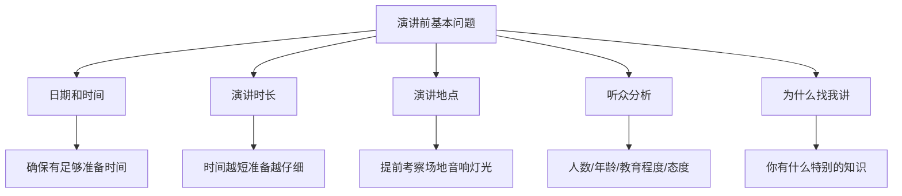
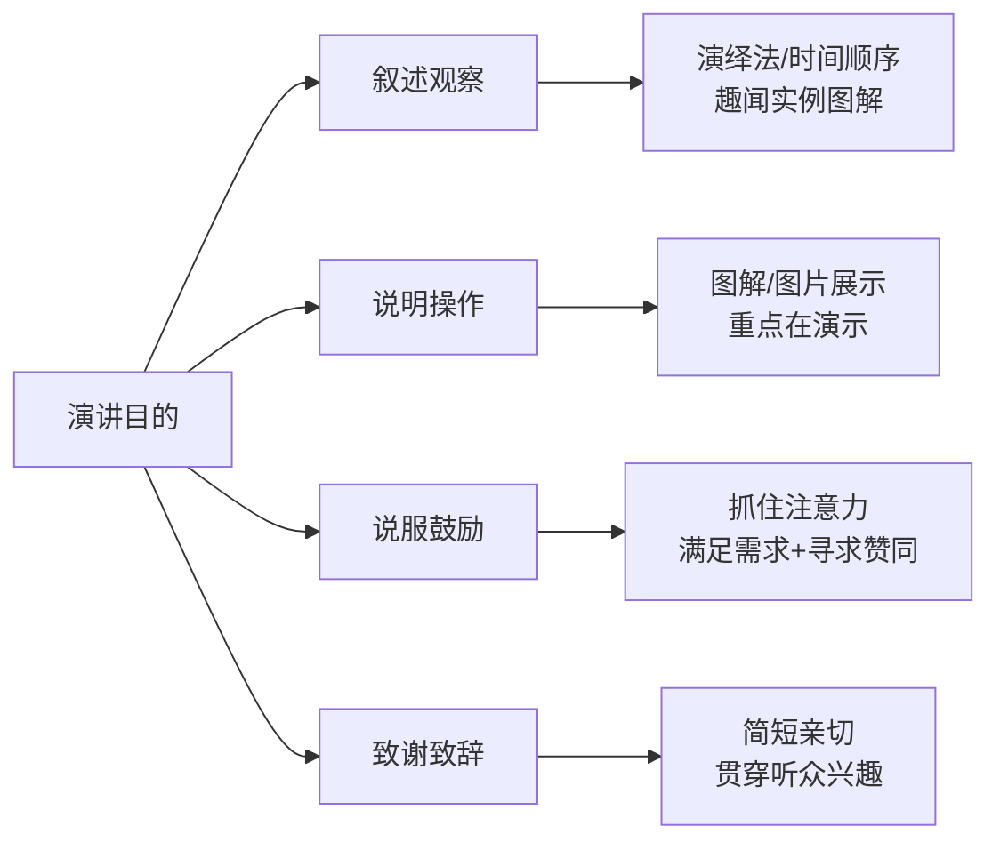
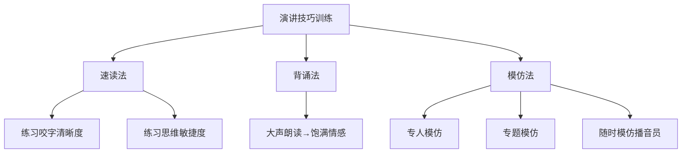
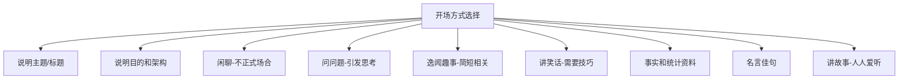
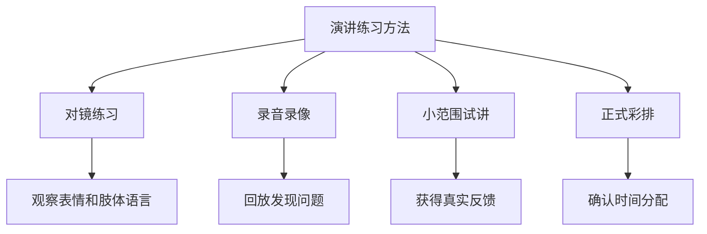

# 6.7公众演讲的提升
#### 目录介绍
- [01.演讲的基本问题](#01演讲的基本问题)
- [02.演讲的方式](#02演讲的方式)
- [03.演讲内容](#03演讲内容)
- [04.收集资料](#04收集资料)
- [05.制作大纲](#05制作大纲)
- [06.演讲的技巧](#06演讲的技巧)
- [07.演讲的开场白](#07演讲的开场白)
- [08.开场的方式](#08开场的方式)
- [09.讲稿](#09讲稿)
- [10.大量练习](#10大量练习)
- [11.演讲的结尾](#11演讲的结尾)
- [12.结尾的方式](#12结尾的方式)

### 01.演讲的基本问题

- 一位演讲家曾说过；如果你要我说五分钟，那我需要两星期的时间准备。如果你要我说一小时，那我需要一星期的时间准备。如果你不在意我要说多久，那我现在就可以开始。
- 演讲的日期和时间：确定你有足够的准备时间，不只是准备书面材料，还要准备视觉辅助工具。
- 演讲的时间要多长：演讲的时间越短，就越要仔细地准备。
- 演讲的地点：演讲前先去看看场地，确定演讲厅的类型和大小，是否为阶梯式座位、音响效果、灯光等状况。
- 谁会来听演讲：人数、年龄、性别、教育程度、对演讲主题的了解程度、来听演讲的原因和态度。
- 为什么要找我讲：你有什么特别的知识？听众对你会有何期望？如果公司请你以新员工的身份，跟公司说说你的印象，那么没有人会期望你表现得像个已经有三十年工作经验的总经理。

### 02.演讲的方式

- 演讲的方式：演讲的目的决定演讲的方式
- 目的：叙述观察结果、背景原因、事实、细节
- 方式：了解听众对主题的了解程度，采用恰当的语言，插入趣闻轶事，实例，图解等，使演讲内容更生动有趣。采用演绎法，或是按照时间顺序，选词用字要精确。
- 目的：说明事情如何运作、程序如何完成、行动如何执行。
- 方式：重点放在展示上，就是用图解、图片的方式。
- 目的：说服、信服、或鼓励
- 方式：抓住听众的注意力，找出听众的需求与兴趣，证明你能够满足这些需求，寻求观众的反应或赞同。
- 目的：致谢词，餐后致辞
- 方式：简短，控制笑点的量或引用别人的笑话也很有用。把演讲的内容与听众的兴趣及当时的场合贯穿起来，要既亲切又特别。

### 03.演讲内容
- 花时间搜集和组织你的想法。
- 有空的时候就想想演讲内容。如上班的路上。
- 与同事和朋友讨论该主题。
- 随身带本笔记，随时记下临时产生的想法。
- 先列出你想传达的3个核心信息，围绕这3个核心点展开内容组织。
- 每一个核心信息都要有支撑材料：数据、案例、故事或引用。

### 04.收集资料
- 只要时间允许，尽量多阅读。不要只搜集演讲时会用到的信息，也不要只搜集跟主题有关的信息。在网络上找到的资料，一定要确认其正确性。
- 建立一个资料文件夹，按照主题分类存放搜集到的材料。
- 注意收集与听众直接相关的数据和案例，这样更容易引起共鸣。
- 好的素材来源包括：专业书籍、行业报告、TED演讲、新闻事件和个人经历。

### 05.制作大纲
- 不管你如何制作大纲，都应该合逻辑、有组织。即使你在计算机上打出基本的大纲，不妨还是把每个重点和其发展思路写在一张卡片上，看看什么样的顺序最合适。最后，照顾好开头和结尾的部分，中间的部分就会自动出现。
- 大纲的基本结构：引入（10%时间）→ 核心内容（80%时间）→ 总结收尾（10%时间）。
- 每个核心要点之间要有自然的过渡和衔接，避免突兀的跳转。

### 06.演讲的技巧

- 速读法。找一篇演讲稿， 读的过程中不要有停顿，发音要准确，吐字要清晰，要尽量达到发声完整。
- 背诵法。先把文章背下来，在背的基础上，大声朗读，最后用饱满的情感，准确的语言，语调进行背诵。
- 模仿法。模仿专人，口语表达能力强的人，录下录音模仿。专题模仿，一个人讲一个故事，大家轮流模仿，看谁最像。随时模仿。 跟着播音员、演播员、演员进行模仿，注意他的声音、语调，他的神态、动作，边听边模仿，边看边模仿，天长日久，你的口语能力就得到了提高。而且会增加你的词汇，增长你的文学知识。

### 07.演讲的开场白
- 记住，演讲一开始，你的“表演”就开始了。因此正式开始前，先安排下你的舞台。花点时间把你的笔记和视觉辅助工具等摆好，方便之后使用。确定笔记本或计算机高度够高，不用老是低着头看。
- 不要犹豫。听众就位后就开始。但是先用几秒钟的时间浏览一下台下听众，让他们也打量一下你。
- 不要用陈腔滥调开场，像是“今天很荣幸”。也许你想谢谢听众，但是可以晚一点说，甚至放在结尾。
- 不要道歉。也许你觉得自己的知识，主题，能力不行，但是只要你充满自信地登场，听众也会对你有信心，而这份自信来自你周全的准备。
- 开场白必须有趣，有创意，让听众想继续听你之后要说的内容。不要太早引入高潮。记住，这只是开场白，内容不要太长，跟整个演讲的长度比例适当。

### 08.开场的方式

- 说明演讲的主题或标题。不需要说的很吸引人，因为听众可能已经知道你的主题了。
- 说明你的目的和演讲的架构。采用演绎的顺序，是很安全妥当的做法。
- 闲聊。用在不正式的场合。
- 问问题。想想你的演讲主题，听众会提出哪些问题。
- 逸闻趣事。必须说的有技巧，跟主题相关，简短，而且有可能的话，跟你切身相关。
- 讲笑话。如果你很会讲笑话，那不妨试试这个做法。
- 事实和统计资料。用的精简，可以引起听众的注意与兴趣。
- 名言佳句。
- 讲故事。每个人都喜欢听故事，但是你的故事要选得好，讲得好。

### 09.讲稿
- 人的记忆会出错，有了讲稿，就不会有遗漏的地方，在讲稿上还可以发展出复杂的论点，有了讲稿，就不会搞错顺序。有能力把讲稿背下来。如果你对自己的演讲内容非常熟悉，在卡片或白纸上找顺序写下重点，主要的论点和例子，这是最好的做法。
- 讲稿不是用来念的，而是用来记忆和提示的。一份好的讲稿应该包含关键词和提示语，而不是一字不差的原文。
- 建议在讲稿中用不同颜色标注：红色表示必须讲的核心要点，蓝色表示可选的补充材料，绿色表示过渡衔接的话术。

### 10.大量练习

- 充分的准备，大量的练习，同时录音录下来，确认时间的分配。
- 至少练习3次以上，每次练习后记录需要改进的地方。第一次重点关注内容完整性，第二次关注时间分配，第三次关注语气和互动。
- 如果可能，找2-3个朋友做模拟听众，让他们提出问题和反馈。这比自己对着墙练习效果好得多。

### 11.演讲的结尾
- 用一个有力的总结结束。
- 如果你突然想到新的东西，务必克制冲动。我们很容易说出演讲之外的新思路。
- 不要重复。不要看着演讲稿念结尾词。把结尾词背下来，这样你就可以在达到结尾高潮时看着观众。

### 12.结尾的方式
- 问题。让听众去思考。提出一个发人深省的问题，让听众在离开后仍然会思考你的演讲内容。
- 行动。你希望大家现在就采取行动，不要等到以后才行动。给出一个明确的、可执行的下一步行动。
- 奖励。说明听众能够从行动中得到什么益处。让听众看到行动的价值和回报。
- 回顾。回到开场时提到的故事或问题，形成首尾呼应，给听众一种完整感。
- 金句收尾。用一句有力的总结句结束，让听众记住你的核心信息。

### 结语

- 演讲是后天习得的技巧，每个人都有能力习得这份技巧。所有伟大的演讲家最初都是最差劲的演讲者。因此技巧和自信来自努力和练习，只要你坚持不懈，掌握这项技能，升职和加薪都是很快的事。