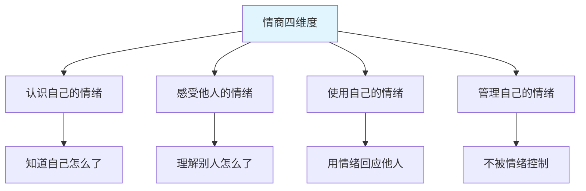
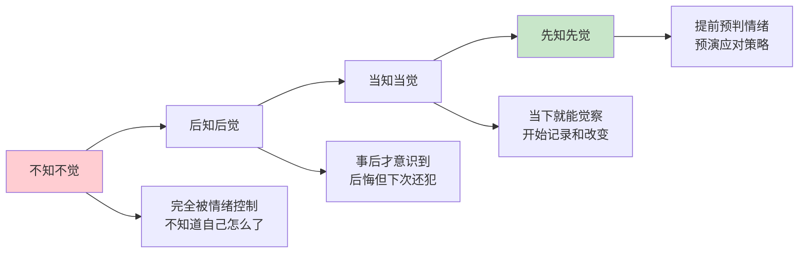
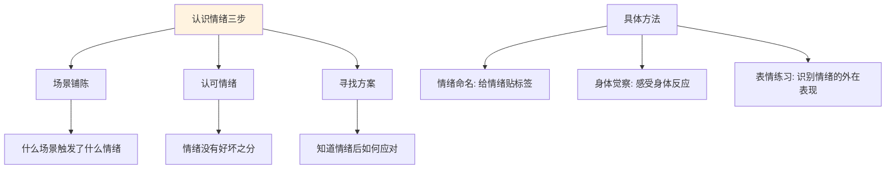
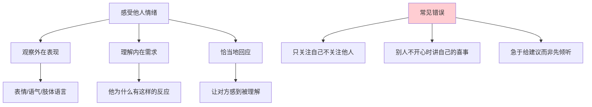
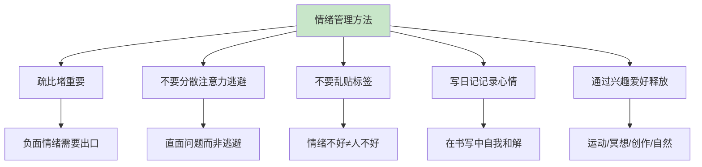
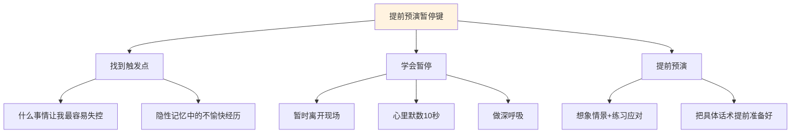
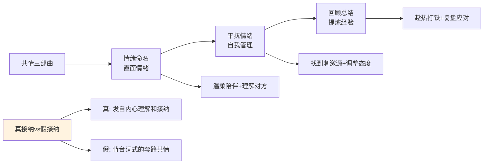
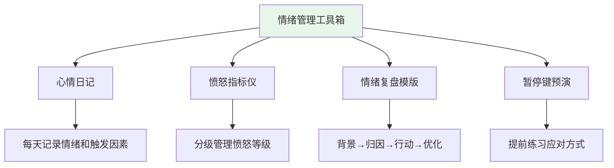
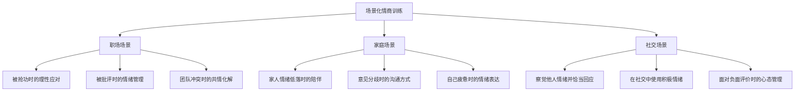
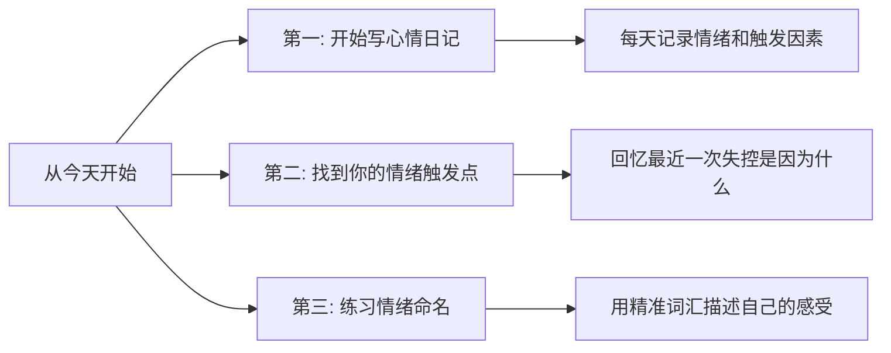

# 7.7情商能力的学习
#### 目录介绍
- [01.情商到底是什么](#01情商到底是什么)
- [02.情绪管理四阶段](#02情绪管理四阶段)
- [03.如何认识自己的情绪](#03如何认识自己的情绪)
- [04.感受他人的情绪](#04感受他人的情绪)
- [05.使用和管理情绪](#05使用和管理情绪)
- [06.提前预演暂停键](#06提前预演暂停键)
- [07.情绪共情三部曲](#07情绪共情三部曲)
- [08.情绪管理的工具箱](#08情绪管理的工具箱)
- [09.场景化情商训练](#09场景化情商训练)
- [10.今天起改变三点](#10今天起改变三点)
- [12.课后作业思考下](#12课后作业思考下)

## 01.情商到底是什么

### 1.1 情商的四个维度

情商不是"会说话"或"八面玲珑"那么简单。看了些书，总结下来情商包含以下四个维度：

**认识自己的情绪**：知道自己当下处于什么情绪状态——是愤怒、焦虑、失落还是开心。很多人其实不知道自己"怎么了"，只是觉得"烦"却说不清楚为什么。

**感受他人的情绪**：能够察觉到身边的人处于什么样的情绪状态。生活中那些被叫做"缺心眼儿"的人，往往就是缺乏这个能力——你明明很不开心，他却自顾自地跟你分享自己的喜悦。

**使用自己的情绪**：善于用自己的情绪、表情、语气来回应他人。跟那些高情商的人聊天，你会觉得特别舒服——他们能够用恰当的情绪回应让你感到被理解和接纳。

**管理自己的情绪**：在极端情绪状态下还能做出理性的选择。兴奋时知道怎么让自己平静，低落时知道怎么让自己振作。

### 1.2 情商与成功的关系

很多人到了三十岁之后会深刻体会到：成功不仅仅需要智商。无论拿到怎样的牌，都有勇气打出来，都有能力把手里的牌打好——成功在很大程度上取决于你如何管理自己的情绪。

在职场中，你的技术能力决定了你能做什么工作，而你的情商决定了你能和什么人合作、能走多远。

### 1.3 情商低的典型表现

| 维度 | 低情商表现 | 高情商表现 |
|------|-----------|-----------|
| **认识情绪** | "不知道，就是烦，别理我" | "我现在感到焦虑，因为XX事情" |
| **感受他人** | 别人不开心时自顾自说自己的事 | 察觉到对方情绪变化并恰当回应 |
| **使用情绪** | 永远板着脸、草草回应 | 用表情语气让对方感到被理解 |
| **管理情绪** | 顺利时意气风发，困难时一蹶不振 | 无论顺逆都能保持情绪稳定 |

## 02.情绪管理四阶段

### 2.1 第一层：不知不觉

在这个阶段，你完全被情绪支配。工作压力大、生活不顺心、遭遇挫折时，莫名地烦躁、焦虑，对谁都没有好脾气。如果有人问你"怎么了"，你的回答往往是"你别管，反正我特别烦"。

这种混沌的情绪状态非常危险——**如果你自己都不知道自己怎么了，怎么谈情绪管理呢？** 不知不觉是情绪管理的"零点"，对情绪没有察觉的人最容易被情绪控制。

### 2.2 第二层：后知后觉

开始反问自己："我怎么了？我到底出了什么问题？"逐渐明白了自己的情绪来源。但问题是：知道了却控制不住。

典型的死循环是：你明白"不该发脾气"→遇到事情时又没控制住→事后后悔自责："我真的不想这样，我当时就是控制不住"→深深地自我否定→下次又重蹈覆辙。

后知后觉虽然比不知不觉进步了，但如果停留在这个阶段太久，自责和挫败感会不断累积。

### 2.3 第三层：当知当觉

突破口在于**写心情日记**。在每天舒适的状态下（比如睡前），回顾当天发生了什么，把出现过的负面情绪记录下来。

**关键是不仅要记录情绪，还要记录三件事**：

1. 之前发生了什么事？（触发因素）
2. 当时我的心理变化是怎样的？（情绪发展过程）
3. 我最终爆发时发生了什么？（行为后果）

一开始写会觉得困难，但这恰恰说明你对自己的情绪觉察能力还很弱。**当你不断记录和积累后，你对自己情绪起伏的变化会越来越敏锐**——你会变成一个"有心人"，在情绪升起的当下就能觉察到它。

### 2.4 第四层：先知先觉

**不再满足于"当下发觉"，而是进一步思考：我怎么能提前预防这些问题？**

在心情日记中追加一个问题："如果同样的情况再次发生，我哪里可以做得更好？我当时应该如何做？"

这就是"情绪管理复盘"。在进行复盘时一定要尽量仔细，最好落实到**"具体的动作可以怎么做，话应该怎么说"**。复盘能力越好，你对情绪的掌控能力就越强。

很多人说"学了很多道理，遇到事情还是脱口而出不该说的话"——就是因为从来没有做过情绪复盘。情绪复盘最关键的是**提前做演练**，把可能发生的情景想象得特别真实，然后练习你的应对方式。

## 03.如何认识自己的情绪

### 3.1 情绪认知的三个要素

好的情绪认知需要三个要素：

**第一，场景铺陈——理解"我为什么会有这样的情绪"。** 情绪不是凭空产生的，它总是由特定的场景触发。比如"我很难过"——什么时候难过？当有人不让我参与讨论时，我会很难过；当我想分享一件事却没人听时，我会很难过；当其他人难过时，我也会难过。

**第二，认可情绪——情绪没有好坏之分。** 很多人把愤怒、悲伤、焦虑归为"不好的情绪"，觉得自己不应该有这些感受。但实际上，所有情绪都是正常的心理反应，它们是信号灯，告诉你内心正在发生什么。认可情绪的存在，才能有机会管理它。

**第三，寻找方案——知道情绪后如何应对。** 认识了情绪、接纳了情绪之后，最关键的是找到应对方式。比如"当我难过时，我可以告诉身边的人我很难过，他们会陪伴我"。

### 3.2 情绪命名训练

给情绪贴上准确的标签，是情绪管理的第一步。很多人只会说"烦""不爽""不开心"，但这些词太笼统了。试着用更精准的情绪词汇来描述你的感受：

| 大类 | 细分情绪词汇 |
|------|-------------|
| **愤怒系** | 生气、恼火、愤怒、暴怒、不满、被冒犯 |
| **悲伤系** | 难过、失落、沮丧、绝望、心酸、惆怅 |
| **焦虑系** | 担忧、紧张、不安、恐惧、慌张、焦躁 |
| **愉悦系** | 开心、满足、兴奋、感动、自豪、平静 |
| **其他** | 尴尬、委屈、嫉妒、内疚、迷茫、无聊 |

情绪的颗粒度越细，你对自己的了解就越深。"我生气了"和"我觉得被冒犯了"是两种不同的情绪体验，需要不同的应对策略。

### 3.3 表情和身体语言觉察

练习各种情绪对应的表情——嘴角上扬是开心，嘴角下撇是难过，嘴巴张圆是惊讶，眉头紧锁是生气。对着镜子做各种表情，有助于你更清晰地识别自己和他人的情绪状态。

同时注意身体的信号：心跳加速、拳头握紧、肩膀耸起通常意味着愤怒或紧张；浑身无力、呼吸变慢通常意味着悲伤或沮丧。学会通过身体信号来识别情绪，比等到情绪爆发时才反应要好得多。

## 04.感受他人的情绪

### 4.1 培养对他人情绪的敏感度

感受他人的情绪需要两个前提：**观察力**和**同理心**。

**观察力**：通过对方的表情、语气、语速、肢体语言来捕捉情绪信号。说话声音变小了，可能是沮丧；语速加快了，可能是焦虑；眼神回避了，可能是尴尬或不安。

**同理心**：不是简单地看到"他生气了"就结束，而是进一步理解"他为什么生气"。尝试站在对方的角度思考："如果我遇到同样的事情，我会有什么感受？"

### 4.2 不同场景下的情绪感受

**家里的氛围**：来客人时是欢乐的，早上刚起床时是平静的，家人下班回来时的情绪如何？经常觉察家庭氛围的变化，有助于维护家庭关系。

**工作场所的氛围**：在繁忙的办公室，同事们的情绪状态如何？开会时谁在压抑不满？项目紧张时团队整体的情绪走向如何？

**公共场所的氛围**：在地铁上、在餐厅里、在商场中，周围人的情绪如何？多观察不同场所的氛围，以及不同的人在同一场景下的不同反应，可以大幅提升你的情绪感知力。

### 4.3 感受他人情绪时的常见错误

**急于给建议**：别人向你倾诉时，第一反应不应该是"你应该怎么做"，而是"我理解你的感受"。先倾听、先共情，再给建议

**否定对方的情绪**："你有什么好难过的""这点事算什么"——这些话虽然可能是好意，但会让对方感到不被理解

**只关注自己**：别人在说自己的困扰，你却接过话题说"我也是啊，我比你更惨"——这不是共情，这是把焦点转回自己身上

## 05.使用和管理情绪

### 5.1 疏比堵更重要

遇到负面情绪时，千万不要脱口而出"不要伤心""不许悲观""振作起来"——无论是对自己还是对别人。负面情绪如果不被疏导，它不会消失，只会在心里越积越多，最终以更严重的形式爆发。

**正确的做法是给情绪一个出口。** 允许自己伤心、允许自己哭、允许自己暂时低落。然后在情绪平复后，理性地分析问题、寻找解决方案。

### 5.2 不要用分散注意力来逃避

很多人一有情绪就马上吃东西、看剧、刷手机来分散注意力。这种方式虽然短期内能"止痛"，但长期来看只是在逃避问题——你永远没有机会学会真正管理自己的情绪。

需要直面自己的情绪问题。先搞清楚"我怎么了""为什么会这样"，然后再寻找解决方案。逃避只会让问题越来越大。

### 5.3 不要乱贴标签

情绪不好不意味着人不好。很多人觉得消极就是传播负能量、心情低落就是不上进——这是在给情绪贴"好坏"的标签，是不对的。

**情绪没有好坏之分。** 即使你当下情绪不好、发了脾气，也不意味着你这个人不好。不要因为一次情绪失控就全盘否定自己。承认"我这次情绪管理做得不好"和否定"我是个情绪化的人"是完全不同的——前者是建设性的反思，后者是破坏性的自我否定。

### 5.4 写日记记录心情

写日记看似简单，却是最有效的情绪管理工具之一。在书写过程中，你的思绪会慢慢理清，很多当下想不通的事情在写的过程中就想通了，达到自我和解。

这些一笔一画留下的痕迹也在告诉你：回过头看看，原来这一路走来，你真的已经做得很好了。

### 5.5 通过兴趣爱好释放情绪

**户外活动**：花时间在户外，与大自然接触带来平静和放松。散步、跑步、徒步都是很好的情绪调节方式。

**冥想放松**：通过冥想、深呼吸、放松练习，帮助你放松身心，减轻焦虑和压力。

**运动释放**：跑步、游泳、打球等运动可以释放累积的负面情绪，促进身体释放内啡肽，产生愉悦感。

**创造性表达**：通过写作、音乐、绘画等创造性方式来表达自己的情绪，既能宣泄又能产出有价值的东西。

## 06.提前预演暂停键

### 6.1 找到你的情绪触发点

每个人都有特别容易失控的"触发点"——有些事情别人无所谓，你却一触即发。这是因为记忆中有一部分"隐性记忆"——过去不愉快的经历会在类似的情境下被激活，导致情绪失控。

**追根溯源去想**：我刚才怎么了？什么事情让我这么难受？为什么到了这个临界点就爆发了？曾经发生过什么类似的事？越具体越好。

当你感知到那个触发点后，才能真正有的放矢。你会明白：不是针对这个人、这件事失控，而是因为某种感受触动了内心深处的一段经历，才有了这样的失控。

### 6.2 两种暂停方式

**学会放下**：如果触发点来自过去的痛苦记忆，可以尝试和它"告别"。闭上眼睛，想象当年那个受到伤害的自己，对他说："我已经长大了，我知道那些经历很痛苦，但我现在选择放下，因为我希望自己能更好地管理情绪。"这种心理暗示虽然简单，但长期坚持会有效。

**提前预演"暂停键"**：每个人暂停的方式不同——有人需要暂时离开现场、有人需要做深呼吸、有人需要在心里默数10秒、有人需要捏捏自己的手来提醒自己。不管哪种方式，都需要**提前预演**——在平静的时候想象那个可能失控的情景，然后练习你的暂停动作和应对话术。

### 6.3 愤怒指标仪

给自己制作一个"愤怒指标仪"：

| 愤怒等级 | 我的表现 | 我可以做什么 |
|----------|----------|-------------|
| **轻微** | 叹气、内心不满 | 做深呼吸，提醒自己冷静 |
| **中等** | 嗓门变大、语气变冲 | 暂时离开现场，喝杯水 |
| **严重** | 大声争吵、想摔东西 | 立刻停止对话，离开15分钟冷静 |
| **极端** | 完全失控、说伤人的话 | 紧急暂停，事后必须做情绪复盘 |

在平静时讨论和制订好这个计划，当愤怒来临时就可以对照自己的"指标仪"，及时采取对应的措施。所谓高情商，其实就是**内在的觉察力特别高**——不是能忍，而是清楚地知道自己的情绪到了什么程度，并知道该怎么应对。

## 07.情绪共情三部曲

### 7.1 共情的正确打开方式

共情是情绪管理中最推荐的方法，但**千万不要把共情变成套路**。人是非常敏感的，别人一下子就能分辨出你是真的理解他，还是在用"话术"应付他。

**真接纳**："你真的很难过，如果是我遇到这种情况也会特别难受。你想聊聊吗？"——真诚、发自内心。

**假接纳**："你好生气，因为你的方案被否定了。"——机械、背台词、没有情感。

### 7.2 共情三步走

**第一步：情绪命名，直面情绪。** 不要急于阻止或转移情绪，先温柔地陪伴在旁边，给一个缓冲时间。然后真正去理解对方到底怎么了——不是简单地背台词"你很生气"，而是用心去感受他的处境。

**第二步：平抚情绪，自我管理。** 调节情绪的三个步骤：
1. 看看是什么事情刺激了自己，产生了什么不良情绪，有多强烈
2. 思考自己对这件事的判断和态度是否有问题
3. 如果改变态度还不能稳定情绪，就要考虑是不是更深层的性格或认知模式需要调整

情绪其实是认知评价和生活态度的反映。改变态度和认知评价，能够间接改变情绪。

**第三步：回顾总结，提炼经验。** 情绪平复后，趁热打铁进行思维复盘——回顾刚刚发生了什么，抓住这个机会思考：以后遇到类似的事情可以怎么做？这一步经常被忽视，但它是把情绪管理从"偶然做到"变成"稳定能力"的关键。

## 08.情绪管理的工具箱

### 8.1 心情日记

每天睡前花5-10分钟记录当天的情绪：

- 今天最强烈的情绪是什么？
- 是什么事情触发的？
- 我当时是怎么反应的？
- 如果重来一次，我会怎么做？

坚持记录一个月后你会发现：你对自己的情绪模式有了清晰的认识——什么事情最容易让你失控、你通常怎么反应、你最需要改进的是什么。

### 8.2 情绪复盘模版

当一次情绪事件发生后，用以下模版进行复盘：

| 环节 | 问题 | 你的记录 |
|------|------|----------|
| **背景** | 当时的情绪是什么？什么事情触发的？ | ______ |
| **归因** | 这个情绪的本质原因是什么？ | ______ |
| **行动** | 我当时做了什么？效果如何？ | ______ |
| **优化** | 如果再来一次，我会怎么做得更好？ | ______ |

### 8.3 情绪管理的底线原则

不管你处于情绪管理的哪个阶段，有几条底线原则要牢记：

**不在愤怒时做重大决定。** 愤怒时做的决定，80%以上会后悔。给自己至少24小时的冷静期。

**不在情绪激动时发消息/邮件。** 写完后先存草稿，第二天再看一遍。你会发现很多内容你不会再想发出去了。

**光宣泄情绪没有用。** 吵完、哭完、抱怨完之后，问题还在那里。真正有效的是：先处理情绪，再处理问题。

## 09.场景化情商训练

### 9.1 职场情商训练

**被抢功时**：闭上眼睛想象这个场景——你辛苦做的成果被别人拿去邀功了。你会怎么做？练习第三种反应方式：觉察情绪→理清思路→理性沟通。

提前准备话术："领导，关于这个项目我想和您聊聊。我是主要负责人，在XX方面投入了XX精力，取得了XX成果。我希望能够得到更准确的认可，同时也想了解您对我后续工作的期望。"

**被批评时**：不要急于反驳或辩解。先深呼吸，然后区分"批评的内容"和"批评的方式"——内容是否有道理？如果有道理就虚心接受；方式让你不舒服可以事后单独沟通。

### 9.2 家庭情商训练

**家人情绪低落时**：不要说"有什么好难过的"或"你想太多了"。试着说："我看出来你不太开心，要不要聊聊？"然后认真倾听，不急于给建议。

**意见分歧时**：在做出反应之前先确认："你刚才说的意思是……对吗？"很多家庭矛盾源于理解偏差——你以为对方在攻击你，其实对方只是在表达焦虑。

### 9.3 社交情商训练

**察觉并回应他人情绪**：和朋友聊天时，不只是听内容，还要注意对方的语气和表情变化。当你感觉到对方情绪有变化时，主动关心："你是不是有什么心事？"

**使用积极情绪**：在社交场合中，有意识地展示积极的情绪——真诚地微笑、热情地回应、适度地赞美。积极的情绪是有感染力的，它会让周围的人也感到愉悦。

## 10.今天起改变三点

**第一，从今天开始写心情日记。** 睡前花5分钟记录：今天最强烈的情绪是什么？什么事情触发的？我的反应是什么？如果重来会怎么做？不需要写很长，关键是每天都记。坚持一个月，你会对自己的情绪模式有全新的认识。

**第二，找到你最大的情绪触发点。** 回忆最近一次情绪失控的经历：是什么事情触发的？为什么偏偏这件事让你失控？背后的深层原因是什么？找到触发点后，提前预演一个"暂停键"——下次再遇到类似情况时，你的第一反应应该是什么。

**第三，练习用精准词汇描述自己的情绪。** 从今天开始，每次感受到情绪波动时，不要只说"烦""不开心"，而是尝试用更精准的词汇来命名："我现在感到焦虑，因为……""我有点委屈，因为……"。精准地命名情绪，是管理情绪的第一步。

## 12.课后作业思考下

1. 对照情绪管理四阶段（不知不觉、后知后觉、当知当觉、先知先觉），判断一下你目前处于哪个阶段？你的下一步目标是什么？针对目标制定一个具体的行动计划。

2. 回顾你生活和工作中最容易让你情绪失控的"触发点"是什么？用本章学到的方法分析：这个触发点背后的深层原因是什么？今后可以如何预防和应对？

3. 从明天开始坚持写心情日记，连续记录7天。每天记录：最强烈的情绪、触发因素、你的反应、如果重来你会怎么做。7天后回顾，找出你的情绪管理模式。

4. 回忆一次你面对别人负面情绪的经历——你当时的回应方式是什么？对照本章的"共情三部曲"，你做得好的环节和不够好的环节分别是什么？下次可以如何改进？
