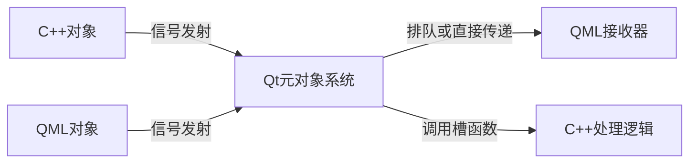

# 09.QML和C++
#### 目录介绍
- 9.1 快速集成方式
  - 9.1.1 QML和C++概念
  - 9.1.2 两者为何集成
  - 9.1.3 集成方式说明
  - 9.1.4 有哪些场景用
  - 9.1.5 关键考量因素
  - 9.1.6 集成设计原则
- 9.2 集成通信机制
  - 9.2.1 属性绑定
  - 9.2.2 方法调用
  - 9.2.3 信号-槽系统
- 9.3 对象注册方式
  - 9.3.1 将C++注册到QML
  - 9.3.2 注册上下文属性
  - 9.3.3 注册QML类型
  - 9.3.4 生命周期管理
  - 9.3.5 注册调试技术
  - 9.3.6 注册最佳实践
- 9.4 信号槽设计
  - 9.4.1 基本通信模型
  - 9.4.2 信号槽核心特性
  - 9.4.3 C++到QML通信
  - 9.4.4 QML到C++通信
  - 9.4.5 信号参数处理机制
  - 9.4.6 高级连接技术
  - 9.4.7 信号槽优化策略
  - 9.4.8 信号槽调试
  - 9.4.9 信号槽最佳实践
- 9.5 在C++中操作QML
  - 9.5.1 C++加载QML对象
  - 9.5.2 对象名字访问加载QML对象
  - 9.5.3 C++访问QML对象成员
- 9.6 案例-用户登录功能
  - 9.6.1 C++定义登录逻辑
  - 9.6.2 册并暴露登陆
  - 9.6.3 QML实现登录界面
- 9.7 案例-数据列表展示
  - 9.7.1 C++定义数据模型
  - 9.7.2 注册
  - 9.7.3 QML展示数据列表
- 9.8 案例-实时数据更新
  - 9.8.1 C++定义数据更新
  - 9.7.2 注册
  - 9.7.3 QML展示更新


## 9.1 快速集成方式

### 9.1.1 集成的概念

QML 和 C++ 的集成是 Qt 框架的一大优势，它允许开发者将 QML 的灵活性和易用性与 C++ 的强大功能结合起来。

通过这种集成，开发者可以在 QML 中使用 C++ 提供的逻辑、数据模型和功能，同时保持 QML 的简洁性和动态性。

### 9.1.2 两者为何集成

为什么需要 QML 和 C++ 集成？ 虽然 QML 非常适合构建用户界面，但有时需要使用 C++ 来处理复杂的逻辑或性能关键的任务，例如：

- 数据处理和计算。
- 与底层系统或硬件交互。
- 使用现有的 C++ 库或代码。
- 构建复杂的数据模型（如 `QAbstractListModel`）。
- 实现自定义 QML 类型。

通过集成，QML 可以专注于界面设计，而 C++ 负责处理复杂的逻辑和性能优化。

### 9.1.3 集成方式说明

QML 与 C++ 的集成主要有以下几种方式：

1. **将 C++ 对象暴露给 QML**：将 C++ 类注册为 QML 类型，供 QML 使用。通过 `qmlRegisterType` 或 `setContextProperty`。
2. **在 QML 中调用 C++ 方法**：通过信号槽机制或直接调用 C++ 方法（`Q_INVOKABLE` ）。
3. **在 C++ 中操作 QML 对象**：通过 `QQuickItem` 或 `QObject` 访问和操作 QML 对象。

### 9.1.4 有哪些场景用

1. 复杂数据处理与可视化。**场景**：处理大数据集、实时流数据。QML直观展示 + C++高性能计算。
2. 硬件设备驱动与控制。**场景**：物联网/嵌入式设备交互。
3. 数据库与持久化存储。**场景**：应用数据持久化管理。C++：SQL查询封装（SQLite/MySQL），QML：数据展示和用户输入。
4. 本地系统接口访问。场景：文件系统监控，打印机控制，Wi-Fi，网络，蓝牙信息获取。

### 9.1.5 关键考量因素

| **考量因素** | **QML优势** | **C++优势** | **最佳实践** |
|--------------|-------------|-------------|-------------|
| 性能         | UI渲染优化 | 计算效率高 | 复杂逻辑放C++ |
| 安全性       | 易被查看   | 编译后保护 | 敏感操作放C++ |
| 开发效率     | UI开发快速 | 逻辑复用强 | UI用QML，核心用C++ |
| 多平台支持   | 跨平台UI   | 条件编译支持 | 平台相关代码放C++ |
| 长期维护     | UI易调整   | 稳定API    | 分层架构隔离 |

### 9.1.6 集成设计原则

**设计原则**：

1. 界面布局、动画、简单交互 → 纯QML
2. 数据处理、设备控制、算法实现 → C++封装
3. 业务逻辑 → QML调用C++接口
4. 状态管理 → C++作为数据源，QML绑定属性

## 9.2 集成通信机制

### 9.2.1 属性绑定

使用 `Q_PROPERTY` 将C++属性暴露给QML。示例：

```cpp
Q_PROPERTY(int value READ value NOTIFY valueChanged)
```

QML自动绑定：`Text { text: sensorData.value }`

### 9.2.2 方法调用

`Q_INVOKABLE` 标记可被QML调用的方法。示例：

```cpp
Q_INVOKABLE bool login(const QString &username, const QString &password);
```

QML调用：`button.onClicked: authManager.login(usernameField.text, passwordField.text)`

### 9.2.3 信号-槽系统

C++信号触发QML函数执行。示例：

```qml
Connections {
  target: networkManager
  onDataReceived: (data) => handleData(data)
}
```

## 9.3 对象注册方式

### 9.3.1 将C++注册到QML

将C++注册到QML是Qt框架实现C++与QML集成的基础机制，其本质是**在QML运行环境中暴露C++类的接口**，使这些C++对象能被QML识别、访问和操作。

这一过程解决了两大关键问题：

1. **类型系统整合** - 将静态类型的C++世界接入动态类型的QML环境
2. **跨语言交互** - 建立C++和JavaScript(ECMAScript)之间的通信桥梁

| **方法**                  | **适用场景**            | **QML访问方式**       | **生命周期管理**      |
|---------------------------|------------------------|-----------------------|-----------------------|
| `setContextProperty()`    | 单例/全局服务         | 直接访问              | 父对象自动管理       |
| `qmlRegisterType()`       | 可复用组件            | 实例化对象           | QML引擎管理          |
| `qmlRegisterSingletonType()`| 全局配置             | 单例访问             | 持久化存在          |

### 9.3.2 注册上下文属性

将C++对象实例注册为全局可访问属性：

```cpp
// main.cpp
// C++类实例
MyController controller; 
engine.rootContext()->setContextProperty("controller", &controller);
```

**QML中访问：**

```qml
Text { 
    text: controller.statusMessage
    color: controller.isReady ? "green" : "red"
}

Button {
    onClicked: controller.performAction()
}
```

**适用场景**：

- 应用程序全局服务（如配置管理、数据库访问）
- 单例模式对象
- 界面无关的核心逻辑对象

### 9.3.3 注册QML类型

将C++类注册为可在QML中实例化的类型，通过 `qmlRegisterType` 或 `qmlRegisterSingletonType`，可以将 C++ 类注册为 QML 类型。

```cpp
// main.cpp
qmlRegisterType<MyClass>("com.yc.myclass", 1, 0, "MyClass");
```

参数说明：

- `com.yc.myclass`：模块名（避免命名冲突）
- `1, 0`：主版本和次版本
- `MyClass`：QML中使用的类型名

**QML中使用**：将 C++ 方法暴露为 QML 可调用的方法。相当于你可以，在qml中直接调用C++方法。

```qml
import com.yc.myclass 1.0

MyClass {
    id: myClass
    onMessageChanged: console.log("Message changed:", message)
}

Button {
    text: "Change Message"
    onClicked: myClass.message = "New message from QML"
}

Text {
    text: myClass.message
    anchors.centerIn: parent
}
```

**适用场景**：

- 可复用的UI组件
- 数据模型类
- 需要多个实例的对象

### 9.3.4 生命周期管理

注册对象的不同生命周期策略：

| **注册方式**         | **所有权**          | **管理机制**                     | **场景**                      |
|----------------------|---------------------|----------------------------------|-------------------------------|
| 上下文属性           | C++拥有             | `QObject`父对象机制             | 持久性服务，全局控制器        |
| 注册类型实例化       | QML拥有             | QML垃圾回收(GC)机制            | 临时组件，视图相关对象       |
| 显式所有权转移       | JavaScript拥有      | `QQmlEngine::setObjectOwnership`| 需要JS控制生命周期的对象     |

### 9.3.5 注册调试技术

检查注册状态：

```cpp
// 查看已注册类型
qDebug() << engine.rootContext()->contextPropertyNames();

// QML中检查
Component.onCompleted: {
    console.log("Available props:", Object.keys(this))
}
```

性能监控，注册使用`QQmlEngine::objectCreated`信号跟踪对象创建：

```cpp
QObject::connect(&engine, &QQmlEngine::objectCreated,
    QObject *obj, const QUrl &url {
        qDebug() << "Object created at" << url << ":" << obj->metaObject()->className();
    });
```

### 9.3.6 注册最佳实践

1. **分层架构设计原则**
  - GUI层：纯QML（动画/布局/简单交互）
  - 适配层：QObject包装类
  - 业务层：纯C++逻辑
  - 系统层：操作系统接口/硬件控制

2. **接口设计规范**
  - 限制暴露：仅暴露必要接口
  - 命名规范：使用QML友好名称（camelCase）
  - 类型转换：复杂类型使用`QVariant`容器

3. **性能优化**
   ```cpp
   // 批量注册代替多次注册
   void registerTypes() {
       qmlRegisterType<Type1>("MyApp", 1, 0, "Type1");
       qmlRegisterType<Type2>("MyApp", 1, 0, "Type2");
   }
   ```

## 9.4 信号槽设计

### 9.4.1 基本通信模型

Qt的信号槽机制是支撑QML与C++无缝集成的核心通信系统，其设计允许跨越C++和QML边界进行双向通信。



### 9.4.2 信号槽核心特性

- **语言无关**：自动跨越C++/QML边界传递数据
- **类型安全**：在连接时验证参数类型兼容性
- **线程安全**：支持跨线程通信
- **松耦合**：发送方无需知道接收方存在
- **动态连接**：运行时创建/销毁连接

### 9.4.3 C++到QML通信

**C++类定义（SensorMonitor.h）**

```cpp
class SensorMonitor : public QObject {
    Q_OBJECT
signals:
    void temperatureChanged(double value); // 暴露给QML的信号
public:
    Q_INVOKABLE void update() { 
        emit temperatureChanged(25.3); // 触发信号
    }
};
```

注册如下：

```cpp
SensorMonitor sensorMonitor;
engine.rootContext()->setContextProperty("sensorMonitor", &sensorMonitor);
```

**QML接收实现**

```qml
Button {
    text: "更新温度"
    onClicked: sensorMonitor.update() // 触发更新
}

// 连接 C++ 信号到 QML 处理函数
// 信号处理
Connections {
    target: sensorMonitor
    function onTemperatureChanged(value) {
        temperatureDisplay.text = "当前温度: " + value.toFixed(1) + " °C"
    }
}
```

### 9.4.4 QML到C++通信

**C++槽函数定义**

```cpp
#ifndef CONTROLLER_H
#define CONTROLLER_H

#include <QObject>
#include <QString>

class Controller : public QObject {
    Q_OBJECT
public:
    // 显式构造函数
    explicit Controller(QObject *parent = nullptr);

public slots:
    // 登录处理槽函数声明
    void handleLogin(const QString &username, const QString &password);

signals:
    // 可选：添加登录结果信号
    void loginResult(bool success, const QString &message);

private:
    // 私有成员变量和方法
    bool validateCredentials(const QString &username, const QString &password);
};

#endif // CONTROLLER_H

# 下面这个是cpp文件

#include "Controller.h"
#include <QDebug>

void Controller::handleLogin(const QString &username, const QString &password){
    // 验证凭证
    bool success = validateCredentials(username, password);
    // 发出登录结果信号
    QString message = success ? "登录成功" : "用户名或密码错误";
    emit loginResult(success, message);
    // 可选：记录登录尝试
    qDebug() << "登录尝试:" << username << (success ? "成功" : "失败");
}

bool Controller::validateCredentials(const QString &username, const QString &password){
    // 当前保持示例代码的简单验证
    return username == "admin" && password == "123456";
}
```

**QML信号触发**

```qml
Button {
   text: "登录"
   width: 200
   onClicked: {
       // 调用 C++ 槽函数
       controller.handleLogin(usernameField.text, passwordField.text)
   }
}
```

使用Connections元素，可以监听回调结果

```qml
Connections {
   target: controller
   function onLoginResult(success, message) {
       if (success) {
           loginStatus.text = message
           loginStatus.color = "green"
           // 导航到主界面...
       } else {
           loginStatus.text = message
           loginStatus.color = "red"
       }
   }
}
```

### 9.4.5 信号参数处理机制


### 9.4.6 高级连接技术


### 9.4.7 信号槽优化策略


### 9.4.8 信号槽调试


### 9.4.9 信号槽最佳实践

## 9.4 在QML中调用C++

### 9.4.1 信号槽机制

C++ 和 QML 可以通过信号和槽进行通信。C++ 可以发出信号，QML 可以监听并响应。在 C++ 中定义信号和槽，在 QML 中连接信号和调用槽。

**C++ 代码，发出信号**

```cpp
#include <QObject>
#include <QString>

class MyClass : public QObject {
    Q_OBJECT

public slots:
    void showMessage(const QString &message) {
        qDebug() << "Message from QML:" << message;
    }
};
```

**QML 代码**

```qml
import QtQuick 2.15
import QtQuick.Controls 2.15

ApplicationWindow {
    visible: true
    width: 400
    height: 300

    MyClass {
        id: myClass
    }

    Button {
        text: "Call C++ Slot"
        onClicked: myClass.showMessage("Hello from QML")
    }
}
```

## 9.5 在C++中操作QML

通过 `QQuickItem` 或 `QObject` 访问和操作 QML 对象。

### 9.5.1 C++加载QML对象

**C++ 代码**

```cpp
#include <QGuiApplication>
#include <QQmlApplicationEngine>
#include <QQuickItem>
#include <QDebug>

int main(int argc, char *argv[]) {
    QGuiApplication app(argc, argv);

    QQmlApplicationEngine engine;
    engine.load(QUrl(QStringLiteral("qrc:/main.qml")));

    QObject *rootObject = engine.rootObjects().first();
    QQuickItem *button = rootObject->findChild<QQuickItem*>("myButton");
    if (button) {
        button->setProperty("text", "Changed from C++");
    }

    return app.exec();
}
```

**QML 代码**
```qml
import QtQuick 2.15
import QtQuick.Controls 2.15

ApplicationWindow {
    visible: true
    width: 400
    height: 300

    Button {
        id: myButton
        text: "Click Me"
        anchors.centerIn: parent
    }
}
```


### 9.5.2 对象名字访问加载QML对象


### 9.5.3 C++访问QML对象成员

## 9.6 案例-用户登录功能

### 9.6.1 C++定义登录逻辑

```cpp
#ifndef AUTHMANAGER_H
#define AUTHMANAGER_H

#include <QObject>
#include <QString>

class AuthManager : public QObject{
    Q_OBJECT
public:
    // 构造函数
    explicit AuthManager(QObject *parent = nullptr);

    // 登录验证接口
    Q_INVOKABLE bool login(const QString &username, const QString &password);
};

#endif // AUTHMANAGER_H
```

在实现文件中：

```cpp
#include "AuthManager.h"

AuthManager::AuthManager(QObject *parent)
    : QObject(parent){
    // 初始化操作（实际项目中可加载配置等）
}

bool AuthManager::login(const QString &username, const QString &password){
    // 生产环境应替换为以下实现：
    // 1. 数据库查询
    // 2. 加密验证
    // 3. 网络API调用
    // 当前保持示例代码的模拟验证
    return username == "admin" && password == "123456";
}
```

### 9.6.2 册并暴露登陆

在 `main.cpp` 中注册并暴露 `AuthManager`：

```cpp
#include <QQmlContext>  //必须导入这个
#include "AuthManager.h"

int main(int argc, char *argv[]) {
   AuthManager authManager;
   engine.rootContext()->setContextProperty("authManager", &authManager);
}
```

### 9.6.3 QML实现登录界面

```qml
Column {
   anchors.centerIn: parent
   spacing: 10

   TextField {
       id: usernameField
       placeholderText: "Username"
   }

   TextField {
       id: passwordField
       placeholderText: "Password"
       echoMode: TextInput.Password
   }

   Button {
       text: "Login"
       onClicked: {
           if (authManager.login(usernameField.text, passwordField.text)) {
               console.log("Login successful!");
           } else {
               console.log("Login failed!");
           }
       }
   }
}
```

## 9.7 案例-数据列表展示

### 9.7.1 C++定义数据模型

```cpp
#ifndef DATAMODEL_H
#define DATAMODEL_H

#include <QAbstractListModel>
#include <QStringList>
#include <QHash>

class DataModel : public QAbstractListModel {
    Q_OBJECT
public:
    // 角色枚举 - 使用枚举值定义数据角色
    enum ItemRoles {
        NameRole = Qt::UserRole + 1  // 第一个自定义角色从 Qt::UserRole + 1 开始
    };

    explicit DataModel(QObject *parent = nullptr);

    // 模型接口重载
    int rowCount(const QModelIndex &parent = QModelIndex()) const override;
    QVariant data(const QModelIndex &index, int role = Qt::DisplayRole) const override;

    // 必须重写的角色名称映射
    QHash<int, QByteArray> roleNames() const override;

    Q_INVOKABLE void addItem(const QString &name);
    Q_INVOKABLE void removeItem(int index);

private:
    QStringList m_data;  // 实际存储数据的容器
};

#endif // DATAMODEL_H
```

具体实现类如下所示：

```cpp
#include "DataModel.h"

// 构造函数：初始化数据
DataModel::DataModel(QObject *parent) : QAbstractListModel(parent){
    // 初始化模拟数据
    m_data << "Apple" << "Banana" << "Orange";
}

// 返回模型行数
int DataModel::rowCount(const QModelIndex &parent) const{
    Q_UNUSED(parent); // 对于列表模型不需要parent参数
    return m_data.size();
}

// 获取特定索引的数据
QVariant DataModel::data(const QModelIndex &index, int role) const{
    // 检查索引有效性
    if (!index.isValid() || index.row() < 0 || index.row() >= m_data.size())
        return QVariant();

    // 返回请求的角色数据
    if (role == NameRole || role == Qt::DisplayRole) {
        return m_data.at(index.row());
    }

    return QVariant();
}

// 返回角色名称映射
QHash<int, QByteArray> DataModel::roleNames() const {
    QHash<int, QByteArray> roles;
    roles[NameRole] = "name";  // 映射为 QML 可访问的 "name" 属性

    // 可选：添加标准角色映射提高兼容性
    roles[Qt::DisplayRole] = "display";

    return roles;
}

void DataModel::addItem(const QString &name) {
    beginInsertRows(QModelIndex(), rowCount(), rowCount());
    m_data.append(name);
    endInsertRows();
}

void DataModel::removeItem(int index){
    if(index < 0 || index >= m_data.size()) return;

    beginRemoveRows(QModelIndex(), index, index);
    m_data.removeAt(index);
    endRemoveRows();
}
```

### 9.7.2 注册

在 `main.cpp` 中注册并暴露 `DataModel`：

```cpp
#include <QQmlContext>
#include "DataModel.h"

int main(int argc, char *argv[]) {
   DataModel dataModel;
   engine.rootContext()->setContextProperty("dataModel", &dataModel);
}
```

### 9.7.3 QML展示数据列表

```qml
ListView {
    width: 200; height: 250
    model: dataModel  // 从 C++ 注册的模型实例

    delegate: Item {
        width: ListView.view.width
        height: 40

        // 通过 roleNames() 映射的名称访问
        Text {
            text: model.name  // 对应 C++ 中的 NameRole
            anchors.centerIn: parent
        }
    }
}
```

## 9.8 案例-实时数据更新

**场景**：在 QML 中实时显示从 C++ 更新的数据（如传感器数据）。

### 9.8.1 C++定义数据更新

在 C++ 中定义数据源：

```cpp
#ifndef SENSORDATA_H
#define SENSORDATA_H

#include <QObject>
#include <QTimer>

class SensorData : public QObject{
    Q_OBJECT
    // QML可访问的属性
    Q_PROPERTY(int value READ value NOTIFY valueChanged)

public:
    explicit SensorData(QObject *parent = nullptr);
    // 属性访问器
    int value() const;

signals:
    // 属性变化通知信号
    void valueChanged();

private slots:
    // 定时更新数据的槽函数
    void updateValue();

private:
    int m_value;        // 存储的数值
    QTimer *m_timer;    // 定时器指针
};

#endif // SENSORDATA_H
```

在具体实现文件中：

```cpp
#include "SensorData.h"

// 初始化父对象
// 初始化值为0
SensorData::SensorData(QObject *parent) : QObject(parent), m_value(0) {
    // 创建定时器并设置父对象保证自动销毁
    m_timer = new QTimer(this);
    // 连接定时器信号到更新槽
    connect(m_timer, &QTimer::timeout, this, &SensorData::updateValue);
    // 启动1秒间隔的定时器
    m_timer->start(1000);
}

int SensorData::value() const{
    return m_value;
}

void SensorData::updateValue(){
    // 增加数值并触发更新
    m_value += 1;
    emit valueChanged ();

    // 实际项目中应替换为真实的传感器读取逻辑
    // 例如: m_value = readSensorValue();
}
```


### 9.8.2 注册

在 `main.cpp` 中注册并暴露 `SensorData`：

```cpp
#include "SensorData.h"

int main(int argc, char *argv[]) {
   SensorData sensorData;
   engine.rootContext()->setContextProperty("sensorData", &sensorData);
}
```

### 9.8.3 QML展示更新

在 QML 中显示实时数据

```qml
// 通过注册的上下文属性访问
Text {
    anchors.centerIn: parent
    text: "传感器数值: " + sensorData.value
    font.pixelSize: 24
}

// 可选的暂停按钮
Button {
    anchors.bottom: parent.bottom
    text: "暂停"
    onClicked: sensorData.m_timer.stop()
}
```


