# 01.Qt Core
#### 目录介绍
- 01.核心功能与基础类

Qt Core 是 Qt 框架的基础模块，提供了跨平台的 C++ 核心功能，不依赖于 GUI 组件。以下是 Qt Core 的主要技术栈和功能分类：

## 一、核心功能与基础类

### 1. 对象模型与元对象系统
- **QObject**：所有 Qt 对象的基类，提供信号槽机制、对象树管理、事件处理等核心功能
- **QMetaObject**：提供运行时类型信息（RTTI）和反射能力
- **Q_GADGET**：为非 QObject 类添加元对象能力
- **Q_PROPERTY**：声明属性系统
- **Q_INVOKABLE**：使方法可通过元对象系统调用

### 2.容器类
- **序列容器**：
   - QList：通用动态数组
   - QVector：连续内存数组（Qt 6 中与 QList 合并）
   - QLinkedList：双向链表
   - QStack：栈实现
   - QQueue：队列实现
- **关联容器**：
   - QMap：红黑树实现的键值对
   - QHash：哈希表实现的键值对
   - QSet：无序集合
   - QMultiMap/QMultiHash：支持多值的映射
- **字符串处理**：
   - QString：Unicode 字符串处理
   - QByteArray：原始字节数据处理
   - QStringView：字符串视图（只读）
   - QChar：Unicode 字符处理

## 二、并发与多线程

### 1. 线程管理
- **QThread**：平台无关的线程类
- **QThreadPool**：线程池管理
- **QRunnable**：可在线程池中运行的任务基类
- **QFuture**/**QFutureWatcher**：异步计算模型
- **QPromise**：配合 QFuture 使用（Qt 6）

### 2. 同步原语
- **QMutex**/**QMutexLocker**：互斥锁
- **QReadWriteLock**：读写锁
- **QSemaphore**：信号量
- **QWaitCondition**：条件变量
- **QAtomic***：原子操作类

## 三、文件与 I/O 系统

### 1. 文件操作
- **QFile**：文件读写
- **QDir**：目录操作
- **QFileInfo**：文件信息
- **QFileSystemWatcher**：文件系统监控

### 2. 数据流
- **QDataStream**：二进制数据序列化
- **QTextStream**：文本数据流
- **QBuffer**：内存缓冲区

### 3. 资源系统
- **QResource**：访问 Qt 资源系统（.qrc）
- **QSettings**：跨平台应用程序设置存储

## 四、日期与时间处理

### 1. 时间类
- **QDate**：日期处理
- **QTime**：时间处理
- **QDateTime**：日期时间处理
- **QTimeZone**：时区支持

### 2. 计时器
- **QTimer**：定时器
- **QElapsedTimer**：高精度计时器
- **QDeadlineTimer**：截止时间计时器（Qt 6）

## 五、网络通信基础

### 1. 底层网络
- **QTcpSocket**/**QUdpSocket**：TCP/UDP 套接字
- **QLocalSocket**：本地套接字（进程间通信）
- **QNetworkProxy**：网络代理支持

### 2. 协议支持
- **QUrl**/**QUrlQuery**：URL 解析与构建
- **QHostInfo**：主机信息查询
- **QNetworkInterface**：网络接口信息

## 六、事件系统

### 1. 事件处理
- **QEvent**：事件基类
- **QCoreApplication**：事件循环管理
- **QEventLoop**：事件循环
- **QAbstractEventDispatcher**：事件分发器抽象

### 2. 自定义事件
- 自定义事件类型
- 事件过滤器（eventFilter）
- 发送事件（sendEvent/postEvent）

## 七、插件系统

### 1. 插件框架
- **QPluginLoader**：动态加载插件
- **QFactoryInterface**：插件工厂接口
- **Q_GLOBAL_STATIC**：全局静态对象

## 八、工具类与算法

### 1. 实用工具
- **QVariant**：通用类型容器
- **QDebug**：调试输出
- **QRandomGenerator**：随机数生成
- **QCommandLineParser**：命令行参数解析

### 2. 算法与函数式编程
- **QtAlgorithms**：基本算法（已弃用，推荐 STL）
- **QtConcurrent**：并行计算框架
- **QScopeGuard**：作用域守卫（Qt 6）

## 九、国际化与本地化

### 1. 多语言支持
- **QTranslator**：翻译加载器
- **QLocale**：本地化信息（日期、货币等格式）
- **QCollator**：字符串排序规则

## 十、内存管理

### 1. 智能指针
- **QSharedPointer**：共享指针
- **QWeakPointer**：弱引用指针
- **QScopedPointer**：作用域指针
- **QPointer**：QObject 感知指针

### 2. 对象生命周期
- 父子对象树自动管理
- QObject::deleteLater() 延迟删除

## 十一、序列化与数据格式

### 1. 数据格式支持
- **QJsonDocument**/**QJsonObject**/**QJsonArray**：JSON 支持
- **QCbor**：CBOR 格式支持（Qt 6）
- **QDataStream**：二进制序列化

## 十二、系统集成

### 1. 平台抽象
- **QOperatingSystemVersion**：操作系统版本检测
- **QSysInfo**：系统信息
- **QStorageInfo**：存储设备信息

### 2. 进程管理
- **QProcess**：启动和控制外部进程
- **QProcessEnvironment**：进程环境变量

## 十三、设计模式实现

### 1. 常用模式
- **信号槽**：观察者模式实现
- **QSingleton**：单例模式模板
- **QStateMachine**：状态机框架

## 十四、性能分析工具

### 1. 性能工具
- **QElapsedTimer**：代码计时
- **QLoggingCategory**：分类日志
- **QTest**：单元测试框架（部分功能在 Qt Test 模块）

## 技术栈全景图

```mermaid
graph TD
    A[Qt Core] --> B[对象模型]
    A --> C[容器类]
    A --> D[并发编程]
    A --> E[文件I/O]
    A --> F[日期时间]
    A --> G[网络基础]
    A --> H[事件系统]
    A --> I[插件系统]
    A --> J[工具类]
    A --> K[国际化]
    A --> L[内存管理]
    A --> M[序列化]
    A --> N[系统集成]
    A --> O[设计模式]
    A --> P[性能工具]
    
    B --> Q[QObject]
    B --> R[信号槽]
    B --> S[元对象]
    
    D --> T[QThread]
    D --> U[QThreadPool]
    D --> V[QFuture]
    
    G --> W[QTcpSocket]
    G --> X[QUrl]
    
    H --> Y[QEvent]
    H --> Z[QEventLoop]
    
    J --> AA[QVariant]
    J --> AB[QDebug]
    
    K --> AC[QTranslator]
    K --> AD[QLocale]
    
    L --> AE[智能指针]
    L --> AF[对象树]
    
    M --> AG[QJson]
    M --> AH[QDataStream]
    
    N --> AI[QProcess]
    N --> AJ[QStorageInfo]
```

## 典型应用场景

### 1. 服务器后端开发
- 使用 QCoreApplication 创建无 GUI 应用
- QTcpServer/QTcpSocket 实现网络服务
- QThreadPool 管理线程池
- QSettings 管理配置

### 2. 命令行工具
- QCommandLineParser 解析参数
- QTextStream 处理输入输出
- QFile/QDir 文件操作
- QProcess 调用系统命令

### 3. 嵌入式系统
- QFileSystemWatcher 监控文件变化
- QSettings 存储配置
- QTimer 定时任务
- QSocketNotifier 集成系统事件

### 4. 数据处理
- QVector/QList 高效数据存储
- QtConcurrent 并行计算
- QJsonDocument 处理 JSON 数据
- QDataStream 序列化数据

## 版本演进与趋势

### Qt 5 → Qt 6 主要变化
1. **容器类优化**：
   - QVector 与 QList 合并
   - 引入 QStringView 等视图类
   - 改进连续内存容器性能

2. **C++ 现代特性**：
   - 全面支持 C++17
   - 引入 QScopeGuard
   - 改进类型推导

3. **网络协议**：
   - 增强 HTTP 支持
   - 改进 SSL/TLS 实现
   - 引入 QCbor 支持

4. **并发模型**：
   - 增强 QFuture 功能
   - 引入 QPromise
   - 改进线程池管理

5. **模块重构**：
   - 拆分部分功能到新模块
   - 优化核心模块依赖
   - 提升跨平台一致性

Qt Core 作为 Qt 框架的基石，提供了强大而全面的基础设施，适用于从嵌入式系统到高性能服务器的各种应用场景，其设计哲学强调跨平台能力、性能优化和现代 C++ 最佳实践。