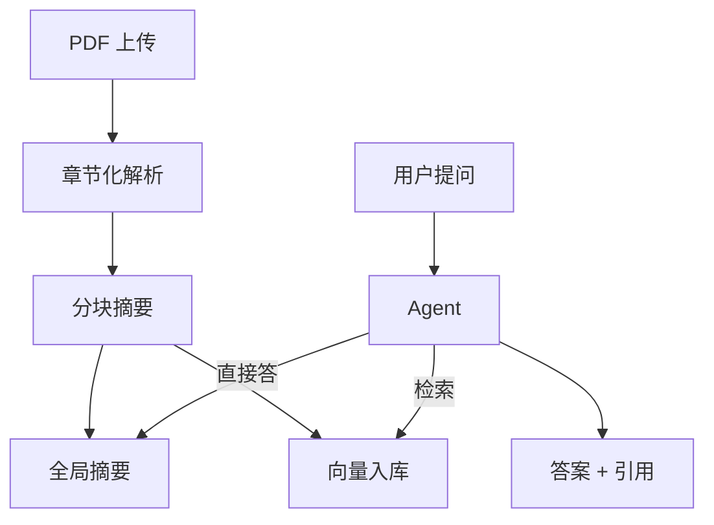

# 项目 02：PDF 论文速读 Agent —— 5 分钟读完一篇论文

> 📝 **本文待写作**。专栏二第 2 篇。科研 / 技术人员每周要读大量论文、白皮书，本项目让 Agent 帮你快速掌握核心。

---

## 摘要

**能做什么**：上传一篇 PDF，5 分钟输出章节化摘要 + 思维导图，还能追问细节。
**技术栈**：PyPDF + LangChain + OpenAI + Streamlit
**代码量**：约 400 行
**对标产品**：ChatPDF、AI PDF

---

## 一、这个项目能做什么

- 上传 Transformer 论文，产出「问题 / 方法 / 实验 / 结论」四段式摘要
- "作者的核心创新点是什么？和 BERT 有什么区别？"（追问 Q&A）
- 生成思维导图（Mermaid 输出）
- 导出为 Markdown 笔记

---

## 二、技术选型与架构

### 架构图



### 核心 Agent 能力

- Tool：`retrieve_chunks`（向量检索）
- Tool：`get_section`（按章节读全文）
- Tool：`generate_mindmap`（Mermaid 输出）

---

## 三、环境准备

```bash
pip install pypdf langchain-openai chromadb streamlit
```

---

## 四、核心代码逐步拆解

### Step 1：PDF 章节化解析（处理跨页公式与图表）

### Step 2：分块摘要（Map-Reduce 模式）

### Step 3：向量入库（ChromaDB）

### Step 4：Agent 层（Streamlit 前端）

---

## 五、进阶优化

- 支持公式识别（Nougat / Mathpix）
- 支持图表理解（GPT-4V）
- 多文档对比阅读

---

## 六、部署上线

- Streamlit Cloud 一键部署
- Docker 私有部署

---

## 七、扩展方向

**关联原理文章（专栏一）**：
- [04.智能体工具生态详解](../01.Agent/04.智能体工具生态详解.md)

---

## 八、完整源码

- GitHub 仓库：TODO

---

> 📅 计划发布时间：2026-09-02
> ✍️ 写作状态：📝 待写作
