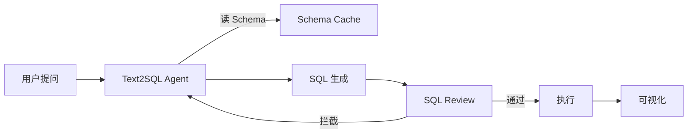

# 项目 03：Text2SQL 数据库助手 —— 让不会 SQL 的人查数据库

> 📝 **本文待写作**。专栏二第 3 篇。产品 / 运营不会写 SQL，每次找开发要数据 —— 让 Agent 直接搞定。

---

## 摘要

**能做什么**：说"查询上个月销售额 top 10 的商品"，Agent 读表结构、生成 SQL、执行、返回可视化结果。
**技术栈**：SQLAlchemy + LangChain SQL Agent + Plotly
**代码量**：约 500 行
**对标产品**：Vanna.AI、DB-GPT

---

## 一、这个项目能做什么

- "查询上个月销售额 top 10 的商品"
- "对比 Q1 和 Q2 各产品线的增长率"
- 生成柱状图 / 折线图 / 饼图
- 生成 SQL 时可预览、可确认

---

## 二、技术选型与架构

### 架构图



### 核心 Agent 能力

- Tool：`get_schema`（增量拉取表结构）
- Tool：`execute_sql`（带只读约束）
- Tool：`plot_result`（生成图表）

---

## 三、环境准备

```bash
pip install sqlalchemy langchain-openai plotly streamlit
```

---

## 四、核心代码逐步拆解

### Step 1：Schema Prompt 工程

大表结构如何压缩进 Prompt

### Step 2：SQL 安全审查（防注入、防删表）

**只允许 SELECT、拒绝 DROP/DELETE/UPDATE**

### Step 3：Few-shot 例子提升准确率

### Step 4：结果可视化

---

## 五、进阶优化

- 语义层（Semantic Layer）
- 表关系图注入 Prompt
- 慢查询检测

---

## 六、部署上线

- 内网部署（数据不出企业）
- 权限收敛：每个用户看得到的表不一样

---

## 七、扩展方向

**关联原理文章（专栏一）**：
- [04.智能体工具生态详解](../01.Agent/04.智能体工具生态详解.md)

---

## 八、完整源码

- GitHub 仓库：TODO

---

> 📅 计划发布时间：2026-09-16
> ✍️ 写作状态：📝 待写作
