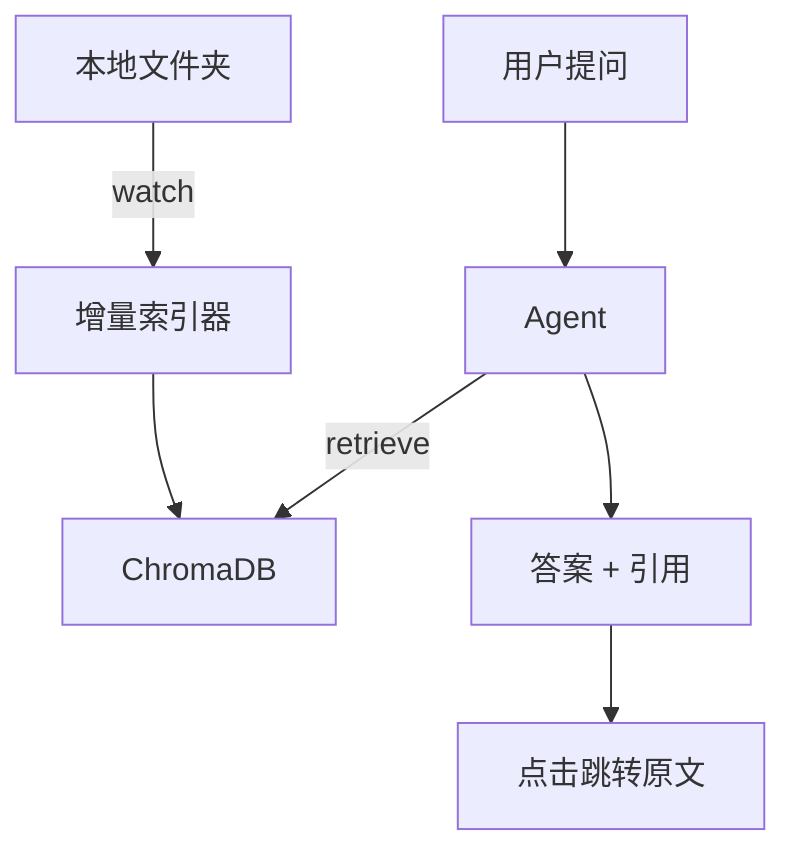

# 项目 04：个人知识库助手 —— 你的第二大脑

> 📝 **本文待写作**。专栏二第 4 篇。Notion / Obsidian 里几千篇笔记，找不到自己写过什么 —— 让 Agent 帮你翻。

---

## 摘要

**能做什么**：多格式文档索引，向量检索 + Agent 问答 + 溯源引用。
**技术栈**：ChromaDB + LangChain + Streamlit
**代码量**：约 600 行
**对标产品**：Cursor Rules、Notion AI、Mem

---

## 一、这个项目能做什么

- "我之前写过关于 Kubernetes 网络的笔记吗？"
- "把我笔记里关于 GC 的内容整理成一篇博客大纲"
- 支持增量索引（新增笔记自动入库）
- 引用溯源（点击答案跳转到原文）

---

## 二、技术选型与架构

### 架构图



### 核心 Agent 能力

- Tool：`search_notes`（向量检索）
- Tool：`read_full_note`（读取完整笔记）
- Tool：`list_tags`（按 tag 浏览）

---

## 三、环境准备

```bash
pip install chromadb langchain-openai streamlit watchdog
```

---

## 四、核心代码逐步拆解

### Step 1：多格式解析（MD / PDF / DOCX）

### Step 2：分块策略（按标题层级 vs 固定长度）

### Step 3：增量索引（watchdog 监听）

### Step 4：Agent 问答 + 引用溯源

---

## 五、进阶优化

- 混合检索（BM25 + 向量）
- Rerank 提升相关性
- 本地嵌入模型（bge-large-zh）省 token

---

## 六、部署上线

- 完全本地部署（Ollama + 本地嵌入）
- Docker 一键启动

---

## 七、扩展方向

**关联原理文章（专栏一）**：
- [03.智能体记忆系统设计](../01.Agent/03.智能体记忆系统设计.md)
- [07.RAG 与智能体混合架构](../01.Agent/07.RAG与智能体混合架构.md)

---

## 八、完整源码

- GitHub 仓库：TODO

---

> 📅 计划发布时间：2026-09-30
> ✍️ 写作状态：📝 待写作
