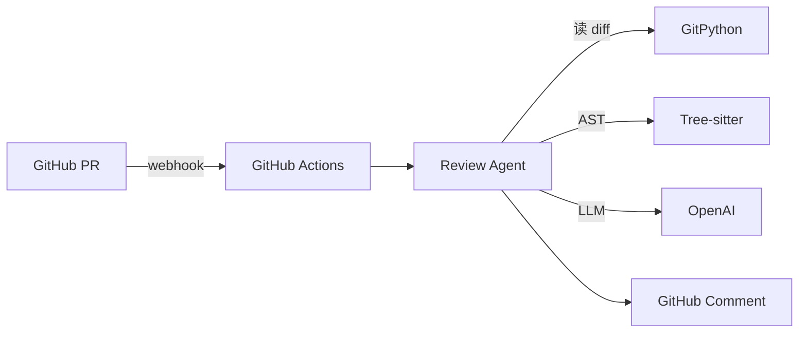

# 项目 05：代码 Review Agent —— 自动化 PR 审查

> 📝 **本文待写作**。专栏二第 5 篇。小团队没人力做严格 CR，PR 质量参差不齐 —— 让 Agent 当你的第一道审查关卡。

---

## 摘要

**能做什么**：PR 提交后自动审查、多维度打分、GitHub 评论区留言。
**技术栈**：GitPython + Tree-sitter + OpenAI + GitHub Actions
**代码量**：约 700 行
**对标产品**：CodeRabbit、Sourcery、Qodo

---

## 一、这个项目能做什么

- 提 PR 后 3 分钟内收到 AI 评审评论
- 检测 SQL 注入、硬编码密钥、性能陷阱
- 输出风格建议（可关闭）
- 支持自定义 review checklist

---

## 二、技术选型与架构

### 架构图



### 核心 Agent 能力

- Tool：`read_diff`（获取变更）
- Tool：`get_full_file`（读取完整文件上下文）
- Tool：`post_comment`（回写 GitHub）

---

## 三、环境准备

```bash
pip install PyGithub tree-sitter langchain-openai
```

---

## 四、核心代码逐步拆解

### Step 1：解析 Git Diff

### Step 2：多维度评审 Prompt（安全 / 性能 / 风格 / 可读性）

### Step 3：结构化输出（严重程度分级）

### Step 4：CI/CD 集成（GitHub Actions Workflow）

---

## 五、进阶优化

- 只评审新增/修改行，不评审 unchanged
- 团队级 style guide 注入
- 与代码所有者互动（追问）

---

## 六、部署上线

- GitHub App 形式发布
- 私有部署到 GitLab / Gitee

---

## 七、扩展方向

**关联原理文章（专栏一）**：
- [11.智能体生产化部署](../01.Agent/11.智能体生产化部署.md)

---

## 八、完整源码

- GitHub 仓库：TODO

---

> 📅 计划发布时间：2026-10-14
> ✍️ 写作状态：📝 待写作
