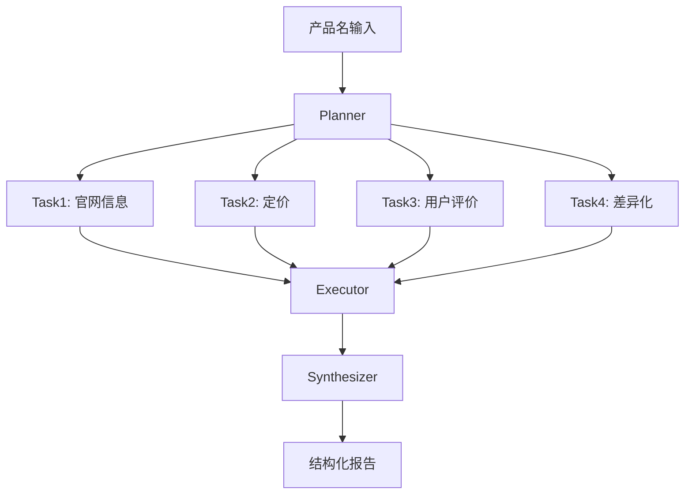

# 项目 06：竞品调研 Agent —— 3 小时的活 10 分钟做完

> 📝 **本文待写作**。专栏二第 6 篇。产品经理 / 创业者做竞品分析常常花几天，本项目十分钟给你一份结构化报告。

---

## 摘要

**能做什么**：输入产品名，产出「产品定位 / 核心功能 / 定价 / 用户评价 / 差异化机会」报告。
**技术栈**：Tavily Search + Playwright + Plan-and-Execute
**代码量**：约 800 行
**对标产品**：Perplexity、Genspark

---

## 一、这个项目能做什么

- 输入 "Notion"，产出完整对比报告（Word / PDF）
- 支持多竞品横向对比
- 引用溯源（每条结论有出处链接）

---

## 二、技术选型与架构

### 架构图



### 核心 Agent 能力

- Planner Agent
- Executor Agent（Tavily / Playwright）
- Synthesizer Agent（汇总）

---

## 三、环境准备

```bash
pip install tavily-python playwright langchain-openai
playwright install
```

---

## 四、核心代码逐步拆解

### Step 1：Plan-and-Execute 编排

### Step 2：Tavily 搜索 + Playwright 抓取

### Step 3：多源信息去重与融合

### Step 4：结构化报告生成（Markdown → Word）

---

## 五、进阶优化

- 竞品数据库缓存
- 增量更新（新出的定价变动）

---

## 六、部署上线

- SaaS 化：给非技术用户用

---

## 七、扩展方向

**关联原理文章（专栏一）**：
- [06.智能体规划与推理](../01.Agent/06.智能体规划与推理.md)

---

## 八、完整源码

- GitHub 仓库：TODO

---

> 📅 计划发布时间：2026-10-28
> ✍️ 写作状态：📝 待写作
