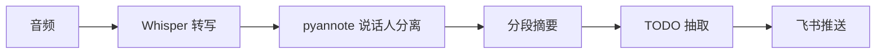

# 项目 09：会议纪要 Agent —— 5 分钟自动出纪要与 TODO

> 📝 **本文待写作**。专栏二第 9 篇。每天开一堆会，会后没人整理纪要，行动项常常被遗忘。

---

## 摘要

**能做什么**：录音转写、说话人分离、摘要、抽取 TODO、推送到飞书 / 钉钉。
**技术栈**：Whisper + pyannote + LangChain + 飞书 API
**代码量**：约 800 行
**对标产品**：Otter.ai、飞书妙记

---

## 一、这个项目能做什么

- 会议结束 5 分钟内，飞书群自动收到「摘要 + TODO + 截止日期」
- 支持中英文混合会议
- 说话人自动分离
- 按主题分段

---

## 二、技术选型与架构

### 架构图



### 核心 Agent 能力

- Tool：`transcribe`（Whisper）
- Tool：`diarize`（说话人）
- Tool：`extract_todos`（结构化输出）
- Tool：`post_feishu`（飞书群 API）

---

## 三、环境准备

```bash
pip install openai-whisper pyannote.audio requests
```

---

## 四、核心代码逐步拆解

### Step 1：音频预处理（降噪、切片）

### Step 2：Whisper 转写 + 说话人对齐

### Step 3：结构化 TODO 抽取 Prompt

### Step 4：飞书 Webhook 推送

---

## 五、进阶优化

- 实时会议纪要（边开边转）
- 声纹识别绑定用户

---

## 六、部署上线

- 本地部署（数据不出企业）
- 与飞书 / 钉钉 / 腾讯会议深度集成

---

## 七、扩展方向

**关联原理文章（专栏一）**：
- [04.智能体工具生态详解](../01.Agent/04.智能体工具生态详解.md)

---

## 八、完整源码

- GitHub 仓库：TODO

---

> 📅 计划发布时间：2026-12-09
> ✍️ 写作状态：📝 待写作
