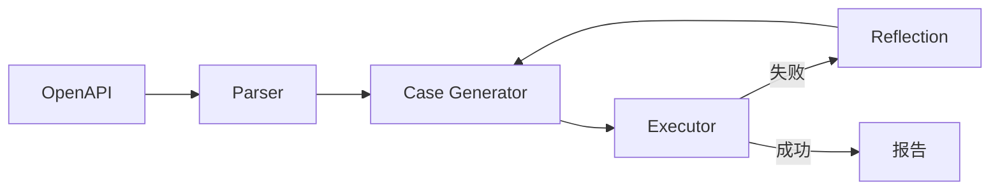

# 项目 11：自动化测试 Agent —— 从 OpenAPI 到测试用例

> 📝 **本文待写作**。专栏二第 11 篇。QA / 开发写测试用例耗时，接口一改测试就崩 —— 让 Agent 帮你写和维护。

---

## 摘要

**能做什么**：读 API 文档 → 生成用例 → 执行 → 失败分析 → 反思修复。
**技术栈**：Swagger 解析 + pytest + Agent 反思机制
**代码量**：约 1000 行
**对标产品**：Testim、Mabl

---

## 一、这个项目能做什么

- 给一个 OpenAPI YAML，自动产出覆盖正常 / 异常 / 边界的测试代码
- 自动执行并生成报告
- 失败用例自我反思、修正

---

## 二、技术选型与架构

### 架构图



### 核心 Agent 能力

- Tool：`parse_openapi`
- Tool：`run_pytest`
- Tool：`analyze_failure`
- Tool：`patch_case`（自我修复）

---

## 三、环境准备

```bash
pip install openapi-spec-validator pytest langchain-openai
```

---

## 四、核心代码逐步拆解

### Step 1：OpenAPI 解析

### Step 2：等价类 / 边界值 / 异常路径生成

### Step 3：pytest 执行 & 结果解析

### Step 4：Reflection 循环

---

## 五、进阶优化

- 用例覆盖率评估
- 测试数据自动生成

---

## 六、部署上线

- CI/CD 集成

---

## 七、扩展方向

**关联原理文章（专栏一）**：
- [10.智能体评测与观测](../01.Agent/10.智能体评测与观测.md)

---

## 八、完整源码

- GitHub 仓库：TODO

---

> 📅 计划发布时间：2027-01-06
> ✍️ 写作状态：📝 待写作
