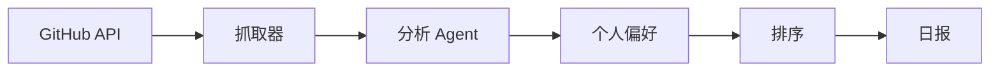

# 项目 12：GitHub Trending 追踪 Agent —— 每日个性化开源推荐

> 📝 **本文待写作**。专栏二第 12 篇。技术人想跟踪开源趋势，但每天刷 GitHub 太耗时。

---

## 摘要

**能做什么**：抓 Trending → 分析 → 分类 → 个性化推荐 → 生成日报。
**技术栈**：GitHub API + LangChain + 用户画像
**代码量**：约 600 行
**对标产品**：无直接对标（差异化机会）

---

## 一、这个项目能做什么

- 每天推送 5 个值得关注的开源项目
- 附一句话解读 + 与你收藏项目的相似度
- 支持按语言 / 领域筛选

---

## 二、技术选型与架构

### 架构图



### 核心 Agent 能力

- Tool：`fetch_trending`
- Tool：`repo_summary`
- Tool：`match_user_profile`

---

## 三、环境准备

```bash
pip install PyGithub langchain-openai
```

---

## 四、核心代码逐步拆解

### Step 1：GitHub Trending 抓取

### Step 2：项目一句话总结（Agent 读 README）

### Step 3：用户画像构建（从 star 历史）

### Step 4：相似度排序 + 日报输出

---

## 五、进阶优化

- Star 图谱聚类
- 项目质量评估（活跃度 / issue 响应）

---

## 六、部署上线

- Serverless 定时任务

---

## 七、扩展方向

**关联原理文章（专栏一）**：
- [03.智能体记忆系统设计](../01.Agent/03.智能体记忆系统设计.md)

---

## 八、完整源码

- GitHub 仓库：TODO

---

> 📅 计划发布时间：2027-01-20
> ✍️ 写作状态：📝 待写作
