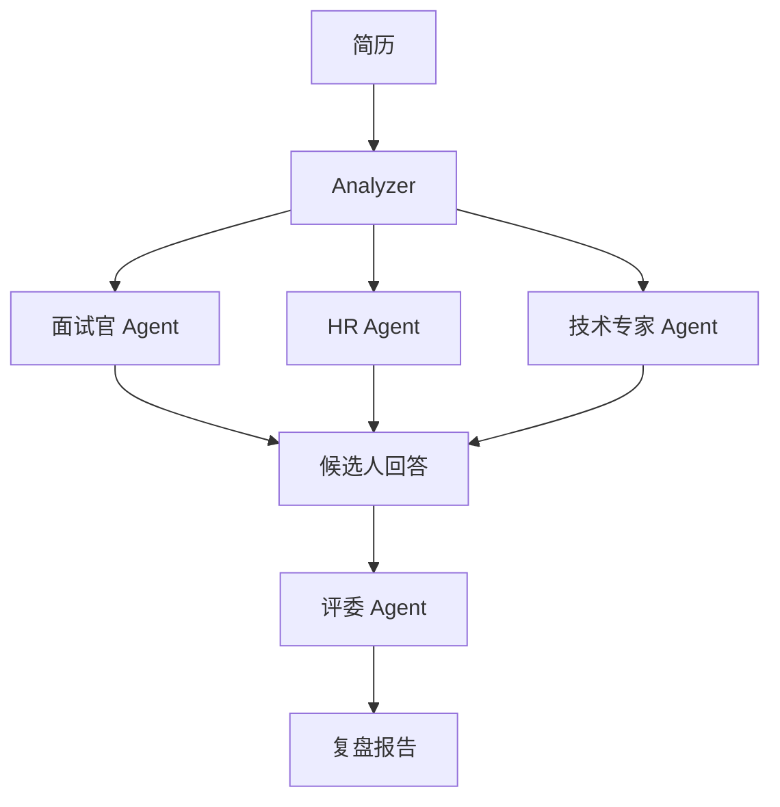

# 项目 13：面试模拟 Agent —— 多 Agent 扮演真实面试场景

> 📝 **本文待写作**。专栏二第 13 篇。求职者缺少真实面试练习，模拟面试 App 千篇一律 —— 用多 Agent 还原真实场。

---

## 摘要

**能做什么**：简历分析 → 面试官提问 → 追问 → 评分 → 复盘。
**技术栈**：AutoGen 多 Agent（面试官 + HR + 技术专家 + 评委）
**代码量**：约 1200 行
**对标产品**：Interview Warmup（Google）、Karat

---

## 一、这个项目能做什么

- 上传简历，多个 Agent 扮演不同角色轮流追问
- 面试结束后收到「优势 / 劣势 / 改进建议」报告
- 支持语音输入输出

---

## 二、技术选型与架构

### 架构图



### 核心 Agent 能力

- 简历分析
- 多角色扮演（Prompt 差异化）
- 追问机制
- 评分与复盘

---

## 三、环境准备

```bash
pip install pyautogen langchain-openai openai-whisper
```

---

## 四、核心代码逐步拆解

### Step 1：AutoGen 多 Agent 定义

### Step 2：角色 Prompt 设计

### Step 3：轮次调度（谁在什么时候说话）

### Step 4：评委汇总 + 报告生成

### Step 5：语音输入输出（可选）

---

## 五、进阶优化

- 面试题库分级
- 微表情分析（GPT-4V）
- 面试录像回放

---

## 六、部署上线

- Web App

---

## 七、扩展方向

**关联原理文章（专栏一）**：
- [08.多智能体协作机制](../01.Agent/08.多智能体协作机制.md)

---

## 八、完整源码

- GitHub 仓库：TODO

---

> 📅 计划发布时间：2027-02-03
> ✍️ 写作状态：📝 待写作
