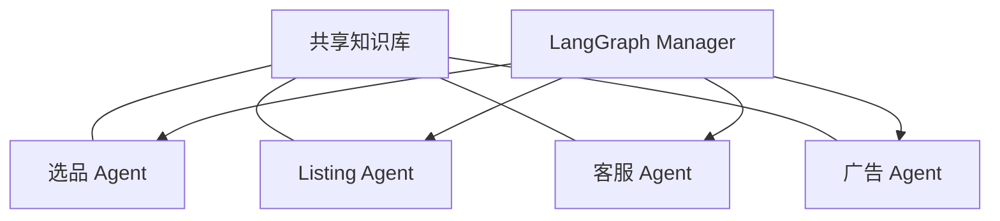

# 项目 14：跨境电商 Agent 全家桶 —— 选品到运营的 AI 团队

> 📝 **本文待写作**。专栏二第 14 篇。跨境卖家一个人要做选品 / 上架 / 客服 / 营销，忙不过来 —— 建一个 Agent 团队接住。

---

## 摘要

**能做什么**：选品 + Listing 撰写 + 客服 + 广告优化，共享知识库。
**技术栈**：LangGraph 主编排 + 多个专业 Agent + Shopify / 亚马逊 API
**代码量**：约 2000 行
**对标产品**：无完整对标（蓝海）

---

## 一、这个项目能做什么

- 一个 Agent 团队完成新品上架完整流程
- 广告投放数据反哺 Listing 优化
- 客服对话反哺产品改进

---

## 二、技术选型与架构

### 架构图



### 核心 Agent 能力

- 选品：数据 API + 趋势分析
- Listing：SEO 关键词 + 多语言
- 客服：邮件自动回复
- 广告：Amazon Ads API 优化

---

## 三、环境准备

```bash
pip install langgraph langchain-openai shopify
```

---

## 四、核心代码逐步拆解

### Step 1：共享知识库设计

### Step 2：选品 Agent

### Step 3：Listing 撰写 Agent（多语言）

### Step 4：客服 Agent（邮件模式）

### Step 5：广告优化 Agent

### Step 6：Manager 编排

---

## 五、进阶优化

- 图像生成 Agent（产品图）
- Review 情感分析回流

---

## 六、部署上线

- 云端 SaaS 部署
- 多租户隔离

---

## 七、扩展方向

**关联原理文章（专栏一）**：
- [09.MCP 协议深度解读](../01.Agent/09.MCP协议深度解读.md)
- [11.智能体生产化部署](../01.Agent/11.智能体生产化部署.md)

---

## 八、完整源码

- GitHub 仓库：TODO

---

> 📅 计划发布时间：2027-02-17
> ✍️ 写作状态：📝 待写作
