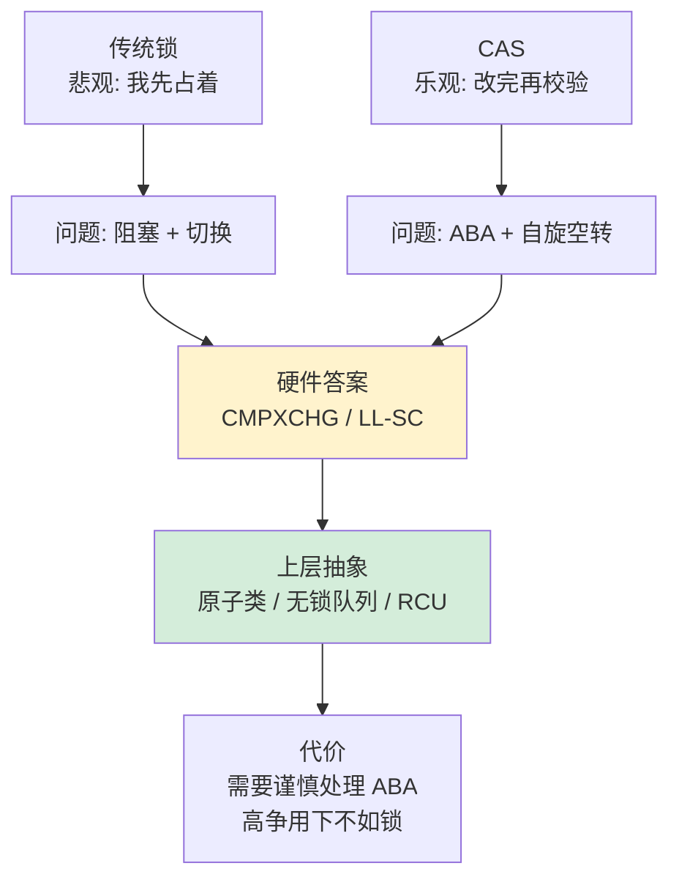
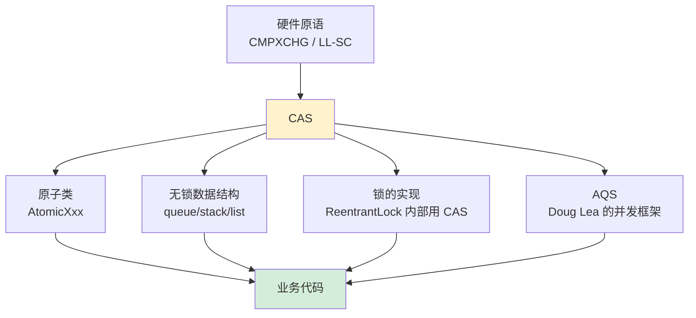
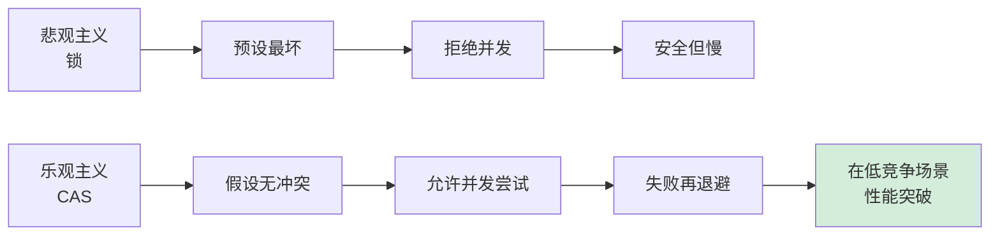

# 20.理解CAS设计和由来

> 📍 **本篇位置**：第 3 卷 · 并发之道 · 第 10 篇（内功篇）
> 🎯 **核心矛盾**：**互斥锁的稳定 vs 阻塞带来的开销** —— CAS 用"乐观+重试"换掉"上锁+睡眠"
> 🧭 **设计灵魂**：CAS = 硬件提供的"**比较并交换**"原子指令；它是**一切无锁数据结构的地基**——从 AtomicInteger 到 ConcurrentHashMap
> 🌐 **跨语言覆盖**：x86(CMPXCHG 指令) · ARM(LDREX/STREX) · Java(Unsafe.compareAndSet) · C++(std::atomic::compare_exchange) · Go(sync/atomic.CompareAndSwap)
> 🔗 **延伸阅读**：← [18.锁核心设计和思想](./18.锁核心设计和思想.md) · → [21.异步和同步的设计](./21.异步和同步的设计.md) · → [25.线程池的设计思想](./25.线程池的设计思想.md)



---

#### 目录介绍
- [1.CAS本质与灵魂](#1cas本质与灵魂)
  - [1.1 CAS哲学思想](#11-cas哲学思想)
  - [1.2 CAS解决的问题](#12-cas解决的问题)
  - [1.3 CAS设计原则](#13-cas设计原则)
  - [1.4 CAS乐观锁思想](#14-cas乐观锁思想)
  - [1.5 CAS核心思想](#15-cas核心思想)
  - [1.6 CAS操作过程](#16-cas操作过程)
  - [1.7 CAS设计思路](#17-cas设计思路)
- [2.CAS硬件基础](#2cas硬件基础)
  - [2.1 原子操作支持](#21-原子操作支持)
  - [2.2 内存一致性模型](#22-内存一致性模型)
  - [2.3 缓存一致性协议](#23-缓存一致性协议)
- [3.CAS经典场景](#3cas经典场景)
  - [3.1 Atomic实现](#31-atomic实现)
  - [3.2 无锁栈的实现](#32-无锁栈的实现)
  - [3.3 ABA问题缘由](#33-aba问题缘由)
  - [3.4 ABA问题解决](#34-aba问题解决)
- [4.CAS性能特征](#4cas性能特征)
  - [4.1 CAS性能优势](#41-cas性能优势)
  - [4.2 CAS性能劣势](#42-cas性能劣势)
  - [4.3 性能优化策略](#43-性能优化策略)
- [6.不同语言实现](#6不同语言实现)
  - [6.1 Java中CAS实现](#61-java中cas实现)
  - [6.2 C++中CAS实现](#62-c中cas实现)
  - [6.3 Go中CAS实现](#63-go中cas实现)
- [7.CAS的局限性](#7cas的局限性)
  - [7.1 ABA问题](#71-aba问题)
  - [7.2 自旋开销](#72-自旋开销)
  - [7.3 单个变量](#73-单个变量)
  - [7.4 内存序问题](#74-内存序问题)
  - [7.5 CAS替代方案](#75-cas替代方案)
- [8.CAS技术总结](#8cas技术总结)
  - [8.1 设计思想总结](#81-设计思想总结)
  - [8.2 核心原理总结](#82-核心原理总结)
  - [8.3 局限性剖析](#83-局限性剖析)


## 1.CAS本质与灵魂

### 1.1 CAS哲学思想

先从一个现实生活的类比开始探索：CAS 所体现的哲学叫什么？

```
场景：一间会议室，三个人都想进去开会

方法一 - “悲观”：
  门上装锁 → 人 A 拿钥匙进去 → 人 B/C 在门外蹲着等
  优点：安全。缺点：人 B/C 什么也做不了，资源浪费
  → 这是传统锁。“预设最坏，接上锁。”

方法二 - “乐观”：
  三人都冲进去 → 进门前问一句“里面还是快才那个状态吗？”
  是 → 进去；否 → 退出重来
  优点：冲突少时、人人都能继续走；缺点：冲突多时、重试獄动
  → 这就是 CAS。“预设没冲突，冲了再谈。”
```

Compare-And-Swap（比较并交换）不仅仅是一个简单的原子操作，它体现了并发编程中一种深刻的设计哲学：**乐观并发控制**。这种哲学的核心在于相信冲突是少数情况，大多数时候操作可以顺利完成，只有在真正发生冲突时才需要重试。

**这个假设昪有条件的——这是 CAS 成败的分水岭**：

| 应用场景 | 冲突频率 | CAS 后果 |
|---------|---------|-----------|
| 状态标记位翻转 | 极低 | 极佳 |
| 计数器加一 | 中 | 一般 |
| 热点账号余额 | 高 | 反不如锁 |
| 上百万线程争同一变量 | 极高 | 灾难（缓存行弹跳） |

**设计灵魂的三个层面：**

1. **原子性保障**：CAS在硬件层面保证了"比较-交换"这个复合操作的原子性，这是并发安全的基石。在 x86 上是 `LOCK CMPXCHG`，由硬件保证总线/缓存被锁住。
2. **无锁化思维**：通过避免传统的互斥锁，CAS实现了真正的无锁并发，消除了锁带来的性能开销和死锁风险。你不需要 OS 帮你调度、不需要进内核、不需要等其他人释放。
3. **失败重试机制**：当CAS操作失败时，通常采用自旋重试的策略，体现了"不放弃"的设计理念。但注意：重试不是免费的，高冲突下重试会烧 CPU。

### 1.2 CAS解决的问题

要看清 CAS 解决的问题，必须先看清**锁为什么不够**。从一个微观场景入手探索：

```
场景：两个线程都要把一个计数器 +1
使用 synchronized 的代价：

  线程 A: 抢锁 → 抢赢 → +1 (耗时 1ns) → 释锁
  线程 B: 抢锁 → 抢输 → 被挂起 → 进入内核等待队列
         → 被最后换出去上下文 → 耗时总计 ~5μs

   计算有效费率： 1ns / 5μs = 0.02%
   99.98% 的时间花在了“抢锁-挂起-恢复”
```

在多线程并发环境中，共享数据的安全访问一直是核心挑战。传统的解决方案依赖于互斥锁，但锁机制带来了诸多问题：

**传统锁机制的局限性：**

- **性能开销**：线程阻塞和唤醒涉及内核态切换，开销巨大。Linux 上一次锁赢可能只要 ~30ns，但一次锁争唤醒要 1-3μs。
- **死锁风险**：多个锁的获取顺序不当可能导致死锁。随代码复杂度增加，锁顺序越难人控制。
- **优先级反转**：低优先级线程持有锁时，高优先级线程被迫等待。火星路径器“火星者号” 1997 年崩溃的原因之一。
- **不可中断性**：线程在等待锁时通常无法响应中断。`synchronized` 不响应 `Thread.interrupt`。

**CAS的革命性突破：** CAS通过硬件级别的原子操作，实现了无锁的并发控制，从根本上避免了上述问题。它将并发控制的复杂性从软件层面下沉到硬件层面，大大简化了并发编程的复杂度。

**但请留意：“避免”不等于“解决”**。CAS 只是把“阻塞”换成了“重试”，在高争抢下，重试也会拖垮性能。后面专门会谈这个话题。

### 1.3 CAS设计原则

上一节我们说 CAS 能换掉锁，但为什么它能？**这一节要拆它背后的四条设计准则**——这些准则不是凭空发明，而是为了让 CAS 在硬件层费诠能实现、在软件层能被信任、在高并发下能被预测、在错误下能被恢复。

**原则一：原子性 —— "纳秒级不可分割"**

表面上说"不能被打断"，本质上要问的是：**被谁可能打断？**

```
   读-改-写 三步间可能被打断的事件：
   ├─ 同一 CPU 上被中断抢占调度
   ├─ 另一个 CPU 同时写同一地址
   └─ DMA 设备在底层修改内存
```

CAS 的原子性保障是**针对后两者**（前者靠关中断）。x86 通过 `LOCK` 前缀锁缓存行（MESI 独占）实现；ARM 通过 LL/SC 的"独占监视器"检测干扰实现。不同架构、同一思想：**让这三步要么全部发生，要么一步也不发生**。

**原则二：比较的精确性 —— "bit级别的严格相等"**

为什么不是"语义相等"而是"位级别相等"？因为 CPU 不懂语义，只能比 0/1。这带来两个微妙的后果：

```
后果1：-0.0 与 +0.0 在语义上相等，但 bit 不同
        → CAS(-0.0, +0.0) 在某些架构上会失败

后果2：对象引用 CAS 只看指针值，看不见指针指向的内容
        → ABA 问题的根源
```

这条原则看似保守，实际是**独件设计代价与安全之间的边界**：只要让 CPU 做位级别比较，才能用一条指令完成；要让他做语义比较，就必须引入比较器逻辑——原子性便不复存在。

**原则三：失败的透明性 —— "没有副作用才可以重试"**

```
CAS 失败后的世界状态：
    ✅ 内存值 未被修改
    ✅ 其他线程 看不见有人试过
    ✅ 调用者可以装作什么都没发生
```

为什么这点重要？**重试逻辑需要幂等性**。如果失败也留下了某种中间状态（比如计数加1），重试就会重复计数。CAS 的"原子性 + 无副作用"两个性质结合，才使得"失败重试"这个模式能被安全使用。

**原则四：性能的可预测性 —— "理论上有上限"**

与锁不同，CAS 的单次耗时主要取决于：

```
  缓存行状态          耗时
  本核 L1 独占 (M)     ~5ns
  本核 L1 共享 (S)     ~10ns  (需作废其他核)
  跨核传递 (E→M)      ~40ns  (同 NUMA)
  跨 NUMA 节点          ~200ns
```

这些数据是固定的，不会发生"锁竞争后被挡 100ms"这种未可预测。实时系统的调度器可以基于最坏耗时上限进行调度判断，**这是 CAS 被选入实时领域的本质原因**。

**四条原则的内在逻辑**：

```
         原子性 ← 硬件保证
            ↓
         精确性 ← 位级别比较
            ↓
         透明性 ← 失败无副作用 ← 重试可被使用
            ↓
         可预测性 ← 上限可计 ← 可被调度选择
```

四条原则不是并列的，而是一条从硬件递升到架构选型的完整推导链。理解这条链，才能理解为什么 CAS 能成为现代并发的原子。

### 1.4 CAS乐观锁思想

要看清 CAS 为什么是"乐观锁"，**必须先看清悲观锁为什么贵**。从一个微观场景入手探索：

**场景：两个线程都要把计数器 +1，但逻辑上他们互不干扰**

```
悲观锁的选择：预设他们会冲突
  线程A: lock → +1 → unlock          (组装出错了吗？没有。但锁本身费了事)
  线程B: 不走运，被挂起→被唤醒→上下文恢复   (冲突了吗？可能根本不会冲突)

乐观锁的选择：预设他们不冲突
  线程A: 快照=N → 计算 N+1 → CAS(N→N+1)        (成功：仅几 ns)
  线程B: 快照=N → 计算 N+1 → CAS(N→N+1)        (如果与 A 同时：谁快谁先赢)
      失败 → 重读 → 重计 → 重提交                (跟随者：几十 ns。什么都没被挂起）
```

**乐观锁本质是"提交点检查"不是"入口点上锁"**——这就跟数据库的 MVCC、Git 的 merge、HTTP 的 ETag 是同一思想：

```
  乐观协议      | 提交时检查的项        | 冲突后的动作
  ────────────────────────────────────────────────────
  CAS         | 当前值 == 预期值吗    | 重读、重计、重提交
  MVCC        | row 版本号未变吗    | 重启事务
  Git         | 本地分支仍是 origin吗 | 手动 merge 冲突
  HTTP ETag   | 资源 hash 未变吗     | 412 Precondition Failed
  区块链       | 区块预计算者身份  | 产生分叉，多数计算量胜出
```

这个从上到下贯穿的思想就是：**冲突是少数，不要为多数中的不冲突付出协调代价**。CAS 是这个思想在硬件层的同名体现。

**但乐观锁不是万能药**——它隐含三个前提：

```
前提 1：冲突真的是少数       → 不成立时 (CAS风暴): 重试开销 > 锁开销
前提 2：冲突可以被检测      → 不成立时 (ABA): 需要增加版本号
前提 3：重试代价低于阻塞   → 不成立时 (长临界区): 该用锁就用锁
```

这三个前提同时成立才适合乐观锁。这也是为什么后面专门要谈"CAS 的失败场景"的原因。

**乐观锁的补充性表述**：传统锁是"进入临界区之前拿许可证"，CAS 是"不要许可证先造，提交时检查由临界区里是否有别人动过"。前者是预防式，后者是检验式。

### 1.5 CAS核心思想

**从上一节的乐观锁哲学落到具体机制**：CAS 不是一个函数，也不是一个类库，而是**一个三步微事务协议**。

**探索一：CAS 为什么不叫就叫 CS（Compare-Swap）？**

```
   C    A    S
   ↓    ↓    ↓
  Compare —— 什么都不动，只看
  And     —— 这不是语义连词，是原子纱结
  Swap    —— 只在前者成立时才动
```

"And"是 CAS 名字里最心它的字——它表示这两个动作被原子性纱在一起，**不可能出现"Compare 成功但 Swap 没发生"或"Compare 失败但 Swap 被运行"这种中间状态**。如果能，那就不是原子了。

**探索二：为什么不是"Read-Modify-Write"而是"Compare-Swap"？**

这是名字里隐藏的设计哲学。考虑这两个接口：

```
接口 A: AtomicAdd(addr, n)
         原子地加 n。底层必须 CAS 重试，但应用者看不见重试。
         造价在高争抢下不可控。

接口 B: CAS(addr, expected, new)
         告诉应用者“如果他是 X，改为 Y”。
         是否重试、重试多少次、重试中间要不要避让，都是应用者调控。
```

**CAS 选择了后者**——**原子性只限与"原子点"，重试逻辑退出原子性边界**。这让 CAS 成为一个原语，能被业务代码在不同场景下装配出不同重试策略：

```c
// 限次重试
for (int i = 0; i < 10; i++) {
    if (CAS(...)) return SUCCESS;
}
return FAIL;       // 超出 10 次服软

// 无限重试
while (!CAS(...)) {} // 适合计数器

// 退避重试
int backoff = 1;
while (!CAS(...)) {
    sleep_ns(backoff);
    backoff = min(backoff * 2, MAX);   // 适合高争抢
}

// 重试转锁
for (int i = 0; i < 5; i++) {
    if (CAS(...)) return;
}
lock();           // 退送为锁
```

这是 CAS 最重要的设计决策：把"重试策略"什出原语，让业务层定。如果告育者在原语中嵌入策略，CAS 就不会是一个万能原语。

**探索三：是什么使得 CAS 不是一把锁？**

一个微妙的问题是：`LOCK CMPXCHG` 不也叫锁吗？怎么说它不是锁？

```
锁的本质：   拥有者状态被保存 → 拥有者能够被调度器调走后也拥有锁
            释放是拥有者主动行为
            其他人需要“等”

CAS 的本质：是一条指令，是未住在拥有者
            指令执行完成后状态不被保存
            没有人“拥有”什么，只是“改了一下”
            其他人不需要“等”，它们只是“失败”
```

**这个细微差异详示了为什么 CAS 叫"无锁"**：没有人被锁住。哪怕某个线程在 CAS 指令执行到一半被调走，后续线程还是能被 CAS 其他变量、甚至 CAS 同一变量。**CAS 失败不代表“等了”，只代表“这次没赢”**。

这是 CAS 的深度哲学：**它不仅仅换了一种接口，而是换了“并发”这个词本身的定义从“互斥访问”变为“乐观修改”**。


### 1.6 CAS操作过程

上一节从哲学层面剖析了 CAS，本节下沉到运行时。先调用原始接口 `CAS(V, O, N)`：

- **V**：内存地址存放的实际值
- **O**：预期的值（旧值）
- **N**：更新的新值

表面上说：当 V == O 时赋值，否则不动。**但如果仅这样，它只是一个普通的 if 语句**。CAS 的魔力在于“读-比-写三步被额外包装起来”。

**探索：为什么不能用 if + 并设为代替 CAS？**

```c
// 依据直觉在含义上等价于 CAS的代码
if (V == O) {
    V = N;        // 在这条语句被打间中间，其他线程可以跨入
}                  // 使得 V 已变，但 “if” 还在状态里
```

```
反例跳漂：
Thread A: V = 5、O = 5    → if 检查肣取为真
           （被调走）
Thread B: 刚刚将 V 改为 7
Thread A: 重新被调度，执行 V = N=10
           → V 最后变为 10，但 7 是未被看见的上一个状态丢失了
```

**CAS 的原子性使得这三步不能被任何打间**。`LOCK CMPXCHG` 在硬件层选锁缓存行独占权，打件纷别人不能跳入。

**原始原语的五种返回**：

```
  CAS 返回状态         应用者选项
  ────────────────────────────────────────────────────────
  成功               进到下一步
  失败 (值不同)        重读、重计、重提交 / 退出并退避 / 转为锁
  失败 (虚假、LL/SC)、  随你何意重试
  失败 (中断抢占)、     随你何意重试
  锁被他者抢先        重读拍照、重提交
```

微妙之处是**ARM 的 LL/SC 会虚假失败**——中断、上下文切换会清除独占标记，指令 STXR 会返回失败。这是为什么 C++ 提供 `compare_exchange_weak` 版本：**推荐在重试循环里用 weak，不在重试循环里用 strong**。

**如果 CAS 发生竞争怎么走**？这是众多人误会的点：

```
10 个线程同时 CAS 同一个变量：

  线程A 抢到缓存行独占权 → CAS 成功
  其他 9 个 → CAS 失败（因为值变了，不是 O 了）

  失败的 9 个的动作完全是应用者决定：
    重读 V 调企重提交？
    退避一会再重？
    直接返回错误？
    转为锁？
```

**这就是为什么 CAS 被称为“原子性原语”不是“原子函数”**——原语给的只是原子性，重试代码是应用者的工作。CAS 在运行时被装配出以下不同表现：

```
+ AtomicInteger.incrementAndGet() = while loop + CAS（无限重试）
+ ReentrantLock.tryLock() = 一次 CAS（失败返回 false，不重试）
+ AQS.acquire() = CAS + 失败后 park()（转为锁）
+ ConcurrentHashMap.put() = CAS 多次 + 抵达 synchronized（退送为细锁）
```

**同一原语、不同装配，这就是 CAS 充仰业务代码中原子性边界的本质**。

### 1.7 CAS设计思路

上一节说明了 CAS 原语的装配能力，本节从"使用者视角"看怎么装配。但我们不是递过说明书，而是问：**为什么五步不能变为三步或纯粗为一步？**

```
五步为什么不能够压包：

  第一步: 定义共享变量       → 能与第二步合并？ 不能。变量必须是中心，多个线程起紧靠中心联系
  第二步: 读取快照          → 能与第三步合并？ 不能。读-改-写中间只有 “改” 是 CAS 原子的
  第三步: 比较并交换       → 能与第四步合并？ 不能。返回值是业务逻辑必需
  第四步: 判断返回         → 能与第五步合并？ 不能。成功退出、失败重试是三者选一
  第五步: 处理失败返回   → 能透明取消？ 不能。它是"重试策略"本身
```

**五步反映五个独立的责任**：

```
  责任              负责者          原语是否提供
  ────────────────────────────────────────
  变量判定          业务代码      ✖
  读取快照          业务代码      ✖
  原子性交换       CPU/原语       ✅
  失败检测           CPU/原语       ✅
  重试策略           业务代码      ✖
```

**这个设计是 CAS 可以被不同者代码灵活使用的本质原因**——原语的责任边界被划他豞于“仅原子交换、不管重试”。如果原语中包含重试逻辑（如 `atomic_add`），业务就失去了定制能力。

**设计哲学遇到的五个业务场景**：

```c
// 场景1: 计数器(需重试直到成功)
long increment(atomic_long *p) {
    long old, new_val;
    do {
        old = atomic_load(p);
        new_val = old + 1;
    } while (!atomic_cas(p, &old, new_val));
    return new_val;
}

// 场景2: tryLock(不重试)
bool try_lock(atomic_int *l) {
    int expected = 0;
    return atomic_cas(l, &expected, 1);
}

// 场景3: 状态提高(只一次赋值)
bool start_once(atomic_int *state) {
    int expected = INIT;
    return atomic_cas(state, &expected, RUNNING);
    // 如果已经 RUNNING 或 DONE 则返回 false
}

// 场景4: 限次重试(退送锁)
bool acquire_with_fallback(atomic_int *l, mutex_t *m) {
    for (int i = 0; i < 5; i++) {
        int expected = 0;
        if (atomic_cas(l, &expected, 1)) return true;
    }
    return mutex_lock(m);
}

// 场景5: 退避重试(高争抢)
long increment_backoff(atomic_long *p) {
    int delay = 1;
    long old, new_val;
    while (true) {
        old = atomic_load(p);
        new_val = old + 1;
        if (atomic_cas(p, &old, new_val)) return new_val;
        for (int i = 0; i < delay; i++) cpu_pause();
        delay = min(delay * 2, MAX_BACKOFF);
    }
}
```

五个场景都是同一原语、不同装配。**这才是 CAS 设计思路的本质：提供不可拆解的“原子点”，让业务代码本身决定策略**。


## 2.CAS硬件基础

CAS的实现需要硬件指令集的支撑

### 2.1 原子操作支持

**探索：为什么软件不能实现 CAS？必须靠硬件？**

考虑这个软件实现：

```c
// 依据直觉软件实现 CAS
bool sw_cas(int *p, int expected, int new_val) {
    int local_lock = 0;
    while (XCHG(&local_lock, 1) == 1) {}  // 锁住 local_lock
    bool ok = false;
    if (*p == expected) {                  // 检查
        *p = new_val;                       // 交换
        ok = true;
    }
    local_lock = 0;                         // 释放
    return ok;
}
```

**这里面有个逆跳棘手问题**：`XCHG` 本身也是个原子指令！还靠硬件。不使用 XCHG，靠普通变量能实现互斥吗？Peterson 算法能，但它依赖**顺序一致内存模型**——现代的乱序 CPU 上需要内存屏障，屏障也是硬件指令。

**原子性是硬件问题，不是软件问题**——这是计算机体系结构的根本限制。

**x86 的 LOCK 前缀：从业务总线锁到锁缓存行**

```
业务总线锁（1989年以前）：
  CPU 发出"#LOCK" 信号 → 总线仑裁器封锁业务总线
  → 任何其他 CPU 的任何内存访问都被阻塞
  → 代价：总线会冻结几十个时钟周期

Cache Locking（1989年以后、P5+）：
  CPU 发出"缓存行独占请求" → MESI 协议
  → 该缓存行被拽取到本核 (M 状态)
  → 其他核对该缓存行的访问被阶段性阻塞
  → 代价：仅该缓存行被锁住，几个时钟周期
涫代的 LOCK 前缀在缓存行能被含住于当前 L1 时会选择后者。
同一指令在不同阶段有不同代价，这是为什么严格调优 CAS 要关心缓存行状态。
```

**LOCK 前缀能修饰哪些指令**？

```
  ADD/SUB/INC/DEC      CAS 的补充，使原子加减可能
  XCHG（隐含 LOCK）     交换两个位置的值
  CMPXCHG               这是 CAS 本体
  CMPXCHG8B/16B         原子操作 8/16 字节的值
  XADD                  用来原子 fetch_and_add、是锈锁的骨桌
  BTS/BTR/BTC           用于开发原子位类操作
```

**中间面记一个隐藏场景**：

```
LOCK XCHG / XCHG（同样原子）：
  XCHG 总是原子的，财职隐含 LOCK。
  在多核上这不是一个选项，是硬件选择。
```

这为“用 XCHG 实现锁”提供了会后台：

```c
// 简易锈锁使用 XCHG 而非 CAS
void spin_lock(int *l) {
    while (XCHG(l, 1) == 1) {}    // 一次交换，是锈锁的骨桌
}

// 考虑这里起一个会问：为什么不是另一个 if？
//   if (*l == 0) *l = 1;
//      不原子。XCHG 是原子。
//      这个区别是一切并发锈锁的起点。
```

**ARM 的 LL/SC：RISC 的另一条路**

```
x86 哲学："动作够允许完整出现"
  → 一条复杂指令、锁住独占、原子性为原则。

ARM 哲学："动作可被中断，但能检测中断"
  LDXR  → 读取并标记"我在监视这个地址"
  中间可以被中断、上下文切换、甚至他核写同地址
  STXR  → 检查监视状态：同文件是否被别人写过？
          如果是则失败、如果不是则写入成功
```

**两者在该问题上的微谈**：

| 试点 | x86 LOCK CMPXCHG | ARM LL/SC |
|------|-----------------|-----------|
| 原子性实现 | 锁缓存行独占 | 检测独占标记被清除 |
| 是否原子中断 | 不可能 | 可能（使 STXR 虚假失败）|
| 错误表现 | 只能返回"快照不匹"，不会虚假失败 | 可能返回虚假失败 |
| ABA 问题 | 有 | **无**（变量被别人动过 → STXR 失败）|
| 多变量 | 需 CMPXCHG16B | 需 CASP 指令 |
| 能够不额外动作 | 能 | 不能，会需要退避重试 |
| 能否 fetch_and_op | 需要实现循环 | 能够原地（LL/SC 包装任何计算）|

**本质上微谈**：

```
x86 在业务代码里看说是 "原子交换"
ARM 在业务代码里看说是 "乐观查词"
两者在 C++ 的 atomic 模型下被抽象为同一接口，但底层表现不同。
这是 compare_exchange_weak 在 C++ 语义里考虑“虚假失败”的原因：
C++ 语义能被某个 CPU 架构上不同实现。
```

### 2.2 内存一致性模型

**探索：为什么 CAS 需要考虑内存一致性模型？**

一个隐藏的错误例子：

```c
// 生产者发布数据场景
int data;
atomic_int ready;

// Producer
void produce(int v) {
    data = v;                    // 事件1：写 data
    atomic_store(&ready, 1);     // 事件2：发布 flag
}

// Consumer
int consume() {
    while (atomic_load(&ready) == 0) {}  // 检测 flag
    return data;                          // 友读 data
}
```

这里面有个错误：**Consumer 有可能读到 ready=1，但 data 还是旧值！**

```
  为什么？因为 CPU 可能重排事件1和事件2：
  
  CPU 实际执行顺序（可能）：
    Step 1: ready = 1            ← 快照州刷
    Step 2: data = v             ← 作为跨越使者友读 data
```

这个重排使得 “CAS 原子” 不够够保证正确性。**原子仅限于一个变量的读-改-写，它不保证为读写其他变量之间的圈周备。**这个问题不是原子性能解决的，是**内存一致模型**需要出场。

**三个主要内存一致性模型的表现**：

```
+----------------------------------------------------+
|       顺序一致（SC, Sequential Consistency）        |
|       所有 CPU 看到全部 CPU 的所有事件以同一个总顺序          |
|       例子：你们都看过同一部电影、同一个镜头            |
|                                                    |
|       代表：MIPS、某些老 CPU                          |
|       代价：需要总线锁定、极贵                          |
+----------------------------------------------------+
+----------------------------------------------------+
|       Total Store Order (TSO)、报什软一些           |
|       读可以跨越写趋到前面，但写-写不会被重排      |
|                                                    |
|       代表：x86、x86_64、SPARC TSO                  |
|       代价：Store Buffer 需要付快取状态              |
+----------------------------------------------------+
+----------------------------------------------------+
|       弱一致 (Weak Ordering, RMM)                  |
|       读-读、读-写、写-读、写-写 均可重排        |
|                                                    |
|       代表：ARM、POWER、RISC-V                       |
|       代价：需显示内存屏障，但推边位高                |
+----------------------------------------------------+
```

**CAS 与内存一致模型的交互**：

在 x86 上，`LOCK` 前缀隐含**全内存屏障**（full memory fence）：

```
  CAS 之前的写：被刷入缓存，可被其他核看到
  CAS 之前的读：是在 CAS 之前完成的
  CAS 之后的写：一定在 CAS 后才能被看起
  CAS 之后的读：能看到别人在 CAS 之前的写入
```

这是为什么 x86 上可以 "写 data、再 CAS flag" 正确工作。

在 ARM 上，LDXR/STXR 不隐含全屏障。需要显示加上例如 `dmb sy` 内存屏障指令，或者使用 `LDAXR`（acquire）/`STLXR`（release）这些带屏障语义的变体。

**happens-before 关系**

内存一致性模型上面是 happens-before：

```
  上面是内存一致性模型      ← CPU 责任
  下面是 happens-before 规则    ← 语言责任
```

例如在 Java JMM 中：

```
 volatile 写 happens-before volatile 读
 CAS 成功 happens-before CAS 后续读
 unlock happens-before 后续 lock
```

**JMM 这些规则背后不是魔法**——是底层依赖 CPU 的内存一致性例外使用在必要位置插入内存屏障提供。在 x86 上，volatile 读几乎免费，volatile 写需要 mfence；在 ARM 上，两者都需要屏障。

### 2.3 缓存一致性协议

在多核处理器系统中，CAS操作的正确性还依赖于缓存一致性协议，如MESI协议。

**MESI协议的四个状态：**

- **Modified（已修改）**：缓存行被修改且只存在于当前缓存中
- **Exclusive（独占）**：缓存行未被修改且只存在于当前缓存中
- **Shared（共享）**：缓存行未被修改且存在于多个缓存中
- **Invalid（无效）**：缓存行无效

**CAS操作的缓存行为：**

```java
// Java中的CAS操作示例
public class CASExample {
    private volatile int value = 0;
    private static final Unsafe unsafe = getUnsafe();
    private static final long valueOffset;
    
    static {
        try {
            valueOffset = unsafe.objectFieldOffset
                (CASExample.class.getDeclaredField("value"));
        } catch (Exception ex) { throw new Error(ex); }
    }
    
    public boolean compareAndSet(int expect, int update) {
        // 底层会触发MESI协议，确保缓存一致性
        return unsafe.compareAndSwapInt(this, valueOffset, expect, update);
    }
}
```

**MESI 状态转移与 CAS 的互动**：

```
CAS 的本质是一个"锁住缓存行 → 检查 → 可能写入 → 释放"的微事务，每次 CAS 都会
触发从其他核获取对应缓存行的独占权。

Core A 要对地址 X 做 CAS：
  Step 1: 发出 Read-For-Ownership (RFO) 请求
  Step 2: Core B 上的缓存行 (Modified 或 Shared) 被迫转为 Invalid
  Step 3: Core A 拿到带主权的缓存行，状态 = Modified
  Step 4: 在本地原子完成比较与写入
  Step 5: 如果 Core C 同时也请求 X，它会等 Core A 释放、重新抢主权
```

这就是"缓存行弹跳"（cache line bouncing）的根源：**多个核争抢同一个原子变量时，缓存行在不同核之间来回反弹**。这是 CAS 性能不是"免费"的主要原因：即使你仅改一个字节，也会付出一整个 64 字节缓存行传输的代价。

**CAS 与内存屏障的另一件事**：

```
x86: LOCK 前缀隐含 full memory barrier
     → CAS 前后的所有读写不会跨越 CAS 重排

ARM: LDREX/STREX 本身不含屏障
     → 需要显式 DMB/DSB 指令
     → std::atomic compare_exchange 默认 seq_cst，
        编译器会加上需要的屏障指令
```

## 3.CAS经典场景
### 3.1 Atomic实现

原子计数器是CAS最直接的应用场景，它展示了CAS如何在无锁情况下实现线程安全的数值操作。

```java
public class AtomicCounter {

    private volatile int count = 0;
    private static final Unsafe unsafe = getUnsafe();
    private static final long countOffset;
    
    static {
        try {
            countOffset = unsafe.objectFieldOffset
                (AtomicCounter.class.getDeclaredField("count"));
        } catch (Exception ex) { throw new Error(ex); }
    }
    
    public int increment() {
        int current;
        int next;
        do {
            current = count;  // 读取当前值
            next = current + 1;  // 计算新值
        } while (!unsafe.compareAndSwapInt(this, countOffset, current, next));
        return next;
    }

    public int get() {
        return count;  // volatile读取，保证可见性
    }
}
```

**拆解这段代码的原理**：它不仅是一个计数器，是**CAS 乐观重试范例的最小完备型**。

```
     原子变量设计要点    | 此代码中的体现
  ──────────────────────────────────────────────────────
     可见性            | volatile int count 保证跨核可见
     原子性            | unsafe.compareAndSwapInt、装配为 LOCK CMPXCHG
     重试逻辑          | do/while 循环，应用者定、不是原语提供
     快照重读          | current = count 在循环里、不可出于外
     计算重做          | next = current + 1 也在循环里、基于最新快照
     原子交换          | 未变才写、变了重读
     快路返回          | next 是谁的赋值就返谁
```

**关键工程提示不能丢**：

```java
// 错误：how next 计算例出循环
int current = count;
int next = current + 1;       // 只计算一次
while (!CAS(...current, next)) {}    // 使 current/next 让上同一值
     → 陈干处理、多线程全部在联推同一值变位。

// 计算在循环中，重量重读、重量计算，才能实现不同线程各自加1成功
```

**为什么不能用 unsafe.getAndAddInt 代替**？重点是取代不了。`getAndAddInt` 是为计数器场景错锘设计的优化 API，JDK 8+ 上被 JIT 识别为 intrinsic 并装配为 `LOCK XADD`——一条指令完成，比手动循环要快。**但在理解 CAS 原理时，手动循环才是底。**

### 3.2 无锁栈的实现

从计数器走到数据结构，难度跳了一个台阶。**问题在于：计数器只改一个变量，但栈需要同时修改多个状态 (top 、新节点、节点的 next)。**

```java
public class LockFreeStack<T> {
    private volatile Node<T> top;
    private static final Unsafe unsafe = getUnsafe();
    private static final long topOffset;
    
    static {
        try {
            topOffset = unsafe.objectFieldOffset
                (LockFreeStack.class.getDeclaredField("top"));
        } catch (Exception ex) { throw new Error(ex); }
    }
    
    private static class Node<T> {
        final T data;
        volatile Node<T> next;
        
        Node(T data, Node<T> next) {
            this.data = data;
            this.next = next;
        }
    }
    
    public void push(T item) {
        Node<T> newNode = new Node<>(item, null);
        Node<T> currentTop;
        do {
            currentTop = top;
            newNode.next = currentTop;
        } while (!unsafe.compareAndSwapObject(this, topOffset, currentTop, newNode));
    }
    
    public T pop() {
        Node<T> currentTop;
        Node<T> newTop;
        do {
            currentTop = top;
            if (currentTop == null) {
                return null;  // 栈为空
            }
            newTop = currentTop.next;
        } while (!unsafe.compareAndSwapObject(this, topOffset, currentTop, newTop));
        return currentTop.data;
    }
}
```

**拆解 push 的设计丈底**：

```
  Step 1: new Node()  → 本地创建、未被他人看见
  Step 2: currentTop = top   → 读取快照、可能已过期
  Step 3: newNode.next = currentTop   → 本地赋值、未被他人看见
  Step 4: CAS(top, currentTop, newNode)
         成功：原子发布，其他线程看见了新 top 及为 newNode
         失败：他人修改过 top → currentTop 过期 → 重拾
```

**为什么这个写法不需要原子控制多个变量**？关键在于**“临界区外的修改是本地的，仅临界区是发布点”**：

```
   本地修改（别人看不见是安全的）：
     创建 Node、赋值 next
   
   发布点（只有 top 这一个、CAS 是原子的）：
     CAS(top, currentTop, newNode)
   
   CAS 后他看到的 top 是完整的 newNode，newNode.next 是完整的原栈顶
```

这个设计哲学送成“**Lock-free 数据结构设计原则**”：

```
  原则一：变更仅发生在本地。变更后才 CAS 发布。
  原则二：发布后不再修改该节点。节点不可变。
  原则三：CAS 失败重试、但 Step 1 创建的节点不丢。
```

**pop 中隐藏的 ABA 险**——这是下一节专门讨论的主题：

```
初始状态：    top → A → B → C
线程1: 读 currentTop=A、newTop=B（被调走）
线程2: pop A   → top=B→C
线程2: pop B   → top=C
线程2: push X  → top=X→C  （X 取名为不重要）
线程2: push A  → top=A→X→C、但这个 A 可能是被复用的那个老 A
线程1恢复：CAS(top, A, B) 成功 ❌
              → top 错误变为 B→C，X 丢失
```

**ABA 问题说明 CAS 只看“值”不看“历史”**。Java 的 GC 在一定程度上反检了这个问题（被丰个者引用的 A 不会被回收，新 push 的 “A” 是全新地址），但在 C/C++/Rust 里极高发。应对方案在 7.1 节详谈。

### 3.3 ABA问题缘由

上一节提出了 ABA 问题，**本节要问的不是“什么是 ABA”而是“为什么 CAS 看不见 ABA”。**

**探索：CAS 的设计责任边界是什么？**

```
CAS 会检查：当前值 == 预期值吗？
CAS 不检查：这个值从预期值到现在是否是一路保持不变？
```

这是 CAS 设计上的一个主动选择，不是疑点。原因是：

```
  记录历史需要额外存储空间
  CPU 提供的原子指令是"原地比"的原语，不能记录历史
  加上历史记录 = 需要事务型 CAS、代价太高
```

所以 CAS 选择了 *表象学*：指看现在、不问过去。这个选择让 CAS 能用一条指令实现，但带来了 ABA 险境。

**ABA 何时不是问题**？

```
场景1: 计数器场景、值本身是语义
  count = 5 → 6 → 5  这个“5”与之前的“5”是同一个东西
  CAS(count, 5, 7) 能成功、作为计数器语义是正确的

场景2: 状态变量表示“拥有者”
  state = ThreadA → ThreadB → ThreadA
  “ThreadA 拥有”在语义上是同一件事
  ABA 不是问题
```

**ABA 何时是问题**？

```
场景1: 指针、表示“这个节点”
  top = NodeA → NodeB → NodeA(复用)
  “同是 NodeA 但是 next 侍处不同了”
  CAS 看似成功、实际逻辑错乱

场景2: 版本变量
  ver = 100 (初始状态) → 200 (他人修改) → 100 (他人他原状)
  “现在的 100 跟之前的 100 不代表同一个状态”
  CAS 错误提交

总结：当"值"不能代表"身份"时、ABA 是原险
```

**为什么 Java 里 3.2 节的无锁栈不那么险**？

```
Java：A 节点被 pop 后、只要还被别的变量友、GC 不会回收 A
      下一个 push 调用 new Node()、拿到的是全新地址
      CAS 里 “expected = oldA” 本就不能区匹 newA、ABA 不发生

C/C++: free(A) 后、下一个 malloc 极可能拿到 A 的地址
      ABA 高发

Rust: 借用检查器防止惬挂指针、但 unsafe 代码在部分场景仍需 Hazard Pointer
```

**ABA 问题的本质**：

```
  CAS  +  应用者需要“身份语义”  → 问题发生
  CAS  +  应用者只需要“值语义”  → ABA 不是问题
```

该不该报选 ABA、不是 "CAS 一定报选"，而是 "你的业务有没有身份语义”。**这是理解 ABA 的根本。**

```java
// 线程1的操作序列
T1: 读取A的值为1
T1: 准备将A从1改为2

// 线程2的操作序列（在T1的CAS操作之前执行）
T2: 将A从1改为3
T2: 将A从3改为1  // A的值又变回了1

// 线程1继续执行
T1: CAS(A, 1, 2) 成功！  // 但实际上A已经被修改过了
```


### 3.4 ABA问题解决

解决方案可以沿袭数据库中常用的乐观锁方式，添加一个版本号可以解决。

核心思路：原来的变化路径A->B->A就变成了1A->2B->3A。

**使用版本号解决ABA问题：**

```java
public class VersionedReference<T> {
    private volatile T reference;
    private volatile int version;
    private static final Unsafe unsafe = getUnsafe();
    private static final long referenceOffset;
    private static final long versionOffset;
    
    static {
        try {
            referenceOffset = unsafe.objectFieldOffset
                (VersionedReference.class.getDeclaredField("reference"));
            versionOffset = unsafe.objectFieldOffset
                (VersionedReference.class.getDeclaredField("version"));
        } catch (Exception ex) { throw new Error(ex); }
    }
    
    public VersionedReference(T reference, int version) {
        this.reference = reference;
        this.version = version;
    }
    
    public boolean compareAndSet(T expectedRef, T newRef, 
                                int expectedVersion, int newVersion) {
        return unsafe.compareAndSwapObject(this, referenceOffset, expectedRef, newRef) &&
               unsafe.compareAndSwapInt(this, versionOffset, expectedVersion, newVersion);
    }
    
    public T getReference() { return reference; }
    public int getVersion() { return version; }
}
```

## 4.CAS性能特征

### 4.1 CAS性能优势

为什么 CAS 会比锁快？从三个角度拆解。

**角度1：路径长度**

```
synchronized 的一次抢锁失败：
  动作序列：CAS 试一次 → 失败 → 调用 OS futex → 入内核、被挂起…
  CPU 周期：~3000-5000周期

CAS 的一次重试：
  动作序列：CAS 失败 → 走循环 → 快重试
  CPU 周期：~30周期
```

**角度2：上下文切换**

锁的抢锁失败 → 线程被挂起 → OS 选另一个线程 → 上下文切换。一次上下文切换要几千 ns，还要热身缓存。而 CAS 失败不会让出 CPU。

**角度3：能在内联实现**

JDK 9 后 `AtomicInteger.incrementAndGet()` 被 JIT 识别为 intrinsic，直接补为一条汇编：

```
x86: lock xadd %eax, (%rdi)    // 一条指令
ARM: ldaxr/stlxr 重试环    // 几条指令
```

与 `synchronized` 代码需要调用进入、检查 monitor 状态、可能调用 OS 抢锁函数不是一个量级的开销。

**量化对比**：以计数器 +1 为例（单线程、无争抢）：

| 实现 | 耗时 | 与 CAS 比 |
|------|------|-----------|
| 裸 ++ | ~0.3ns | 0.04x |
| volatile ++（不原子）| ~1ns | 0.13x |
| **AtomicInteger** | **~7-10ns** | **1x** |
| ReentrantLock | ~30ns | 3-4x |
| synchronized（偏向锁）| ~15ns | 2x |
| synchronized（轻量级）| ~50ns | 5-7x |
| synchronized（重量级）| ~3000ns+ | 300x+ |

**CAS性能优势：**

1. **无上下文切换开销**：线程不会被阻塞，避免了内核态切换。
2. **无死锁风险**：不存在锁的获取和释放，自然避免了死锁。
3. **更好的缓存局部性**：自旋等待时数据保持在缓存中。
4. **可被编译器内联为单指令**，达到理论上限。

### 4.2 CAS性能劣势

表面看上去 CAS 赢面很大，但上面所有数据都隐含一个前提：无争抢。**争抢一变，世界颗覆**。

**思考实验：64 个 CPU 核同时对同一个 `AtomicLong` 加 1**

```
逻辑上：低成本原子加、性能应该很高
现实：
  - 每个核试图修改 → 希望拿到该缓存行的独占权
  - 64 个核轮流"拍抢"该缓存行
  - 缓存行在 64 个核之间不断来回传送（cache line bouncing）
  - 每次 CAS 失败重试几十次才能赢一次
  
  结果：该字段的吞吐量不但没提升，反而随核数增加而下降
```

**CAS性能劣势：**

1. **自旋开销**：高竞争情况下，大量的自旋会浪费CPU资源。极端场景下，CPU 100% 使用率但 0% 吞吐量。
2. **缓存行争抢**：多个线程同时访问同一缓存行会导致缓存失效。这是隐藏的“伪共享”（False Sharing）问题的另一面。
3. **内存带宽消耗**：频繁的CAS操作会增加内存带宽的使用。本质是跨核 cache coherence 流量眨升。
4. **不适合复杂场景**：仅能原子修改一个字，复杂多变量修改需“打包”。
5. **错误可见性考量**：不同语言、不同架构下的 memory order 表现不同，错误难复现。

**与锁的对比在不同争抢下的表现**：

```
争抢度 →     CAS平均耗时        锁平均耗时
无 (1线程)            ~7ns                  ~50ns
低 (2-4线程)          ~30ns                 ~100ns
中 (8-16线程)         ~150ns                ~300ns
高 (32+线程)          ~5μs+ (CAS风暴)    ~1.5μs (锁拍胜)
```

**这是为什么 LongAdder 要取代 AtomicLong 的所有动机**：热点字段上作 CAS 是并发中最隐费的事之一。
### 4.3 性能优化策略

**1. 减少竞争热点**

```java
// 使用分段技术减少竞争
public class SegmentedCounter {
    private final AtomicLong[] segments;
    private final int segmentCount;
    
    public SegmentedCounter(int segmentCount) {
        this.segmentCount = segmentCount;
        this.segments = new AtomicLong[segmentCount];
        for (int i = 0; i < segmentCount; i++) {
            segments[i] = new AtomicLong(0);
        }
    }
    
    public void increment() {
        int segment = Thread.currentThread().hashCode() % segmentCount;
        segments[Math.abs(segment)].incrementAndGet();
    }
    
    public long sum() {
        long total = 0;
        for (AtomicLong segment : segments) {
            total += segment.get();
        }
        return total;
    }
}
```

**2. 使用退避策略**

```java
public class BackoffCAS {
    private volatile int value = 0;
    private static final Unsafe unsafe = getUnsafe();
    private static final long valueOffset;
    
    public boolean compareAndSetWithBackoff(int expect, int update) {
        int backoff = 1;
        while (!unsafe.compareAndSwapInt(this, valueOffset, expect, update)) {
            // 指数退避
            try {
                Thread.sleep(backoff);
                backoff = Math.min(backoff * 2, 1000); // 最大退避1秒
            } catch (InterruptedException e) {
                Thread.currentThread().interrupt();
                return false;
            }
            expect = value; // 重新读取期望值
        }
        return true;
    }
}
```

## 5.CAS 内部实现机制

上一节看到 CAS 在硬件层面依赖锁总线/锁缓存行、依赖 LL/SC。本章走入一层，从“几个原子指令”点出发，看 CAS 如何一步步被包装为能被业务代码使用的原子类与锁。

### 5.1 strong vs weak：服务LL/SC架构

`std::atomic` 提供了两个版本的 CAS：

```cpp
bool compare_exchange_strong(T& expected, T desired, ...);
bool compare_exchange_weak(T& expected, T desired, ...);
```

```
strong:
  仅在“值不等于 expected”时返回失败
  适合：不需重试循环的场景

weak:
  除了“值不等于 expected”还可能“虚假失败 (spurious failure)”
  原因：在 LL/SC 架构上 STREX 可能被其他中断事件 (中断、上下文切换) 打断独占标记
  适合：已经包于重试循环中的场景，使用 weak 性能更好
```

这是为什么业界“在循环里需使用 weak，不在循环里需使用 strong”的原因。

### 5.2 内存序：CAS最微妙的6个参数

C++ 提供了六种 memory_order，在 CAS 上可以分别指定“成功序”与“失败序”：

```cpp
flag.compare_exchange_strong(
    expected,                        // 期望值
    desired,                         // 新值
    std::memory_order_acq_rel,       // 成功时的内存序
    std::memory_order_acquire        // 失败时的内存序（必须不强于成功序）
);
```

为什么要区分？**成功与失败的同步语义要求不同**：

```
生产者发布场景示例：
  data = ...;                                    // 要发布的数据
  flag.compare_exchange_strong(0, 1,             // 发布 flag = 1
                                memory_order_release,   // 成功：释放语义，保证 data 不会被重排到 CAS 后
                                memory_order_relaxed);  // 失败：只是读了一次值，没发布任何数据，不需同步
```

### 5.3 Java AtomicInteger三层调用栈

从业务代码到 CPU 指令的调用链：

```
你的代码:                  AtomicInteger.incrementAndGet()
                                    ↓
JDK实现层:                Unsafe.getAndAddInt(this, offset, 1)
                                    ↓
JVM 本地实现（C++）:    Atomic::add(1, addr)
                                    ↓
JVM 拼装 intrinsic:        被 JIT 识别为“intrinsic”，直接补上
                            x86: lock xadd
                            ARM: ldaxr/stlxr 重试环
                                    ↓
CPU 执行:                 一条或几条原子指令
```

JDK 9 之后，`AtomicInteger.incrementAndGet()` 被 JIT intrinsic 重写为单条 `lock xadd`——**从 Java 到汇编只剩下一条指令**。这是 Java 原子类高性能的根源。

### 5.4 LongAdder：分段解决CAS风暴

Java 8 推出 `LongAdder` 取代高争抢场景下的 `AtomicLong`。思路是“分账”：

```
AtomicLong:                       LongAdder:
  ┌─────────────────┐            ┌─────────────────┐
  │   value (全局唯一) │            │ base + cells[N]   │
  └─────────────────┘            │ 每个线程散列到   │
  64 个线程抢同一个字          │ 不同的 cell      │
  → CAS 风暴                       └─────────────────┘
                                  读取时 = base + ∑ cells[i]
```

代价：读取不再是原子的，返回一个弱一致快照。但这在“写多读少”场景（如请求计数）下是可接受的全胜选。

类似思路也出现在：

- C++ Folly 的 `RelaxedConcurrentlyAccessed`
- Linux 内核 `percpu` 计数器
- Go runtime 中每 P (Processor) 有本地计数器

### 5.5 Java 实现层的反响呦联动

看一下 CAS 如何访问 Java 对象内部字段，这会漏授一个很巧妙的设计：

```java
static {
    try {
        valueOffset = unsafe.objectFieldOffset(
            AtomicInteger.class.getDeclaredField("value"));
    } catch (Exception ex) { throw new Error(ex); }
}
```

`objectFieldOffset` 在 JVM 启动时计算字段的存储偏移量，缓存下来以后 CAS 直接用。这个设计让 CAS **不需要在运行期查反射**，只是一次性获取偏移后的快速内存访问：

```
运行时的 CAS 调用：
  unsafe.compareAndSwapInt(this, valueOffset, expect, update)
         ↓
  JIT 展开为：
    addr = (long)this + valueOffset       // 一次加法得到字段地址
    lock cmpxchgl expect, update, [addr]  // 单条原子指令
```

## 6.不同语言实现

### 6.1 Java中CAS实现

Java通过`java.util.concurrent.atomic`包提供了丰富的CAS支持，底层依赖于Unsafe类。

```java
// Java的AtomicInteger实现原理
public class AtomicInteger extends Number implements java.io.Serializable {
    private static final Unsafe unsafe = Unsafe.getUnsafe();
    private static final long valueOffset;
    
    static {
        try {
            valueOffset = unsafe.objectFieldOffset
                (AtomicInteger.class.getDeclaredField("value"));
        } catch (Exception ex) { throw new Error(ex); }
    }
    
    private volatile int value;
    
    public final boolean compareAndSet(int expect, int update) {
        return unsafe.compareAndSwapInt(this, valueOffset, expect, update);
    }
    
    public final int getAndIncrement() {
        return unsafe.getAndAddInt(this, valueOffset, 1);
    }
}
```

**上下事探索：为什么 Java 需要 Unsafe？这个名字有多本质？**

```
Java 设计哲学：类型安全 + 内存安全
CAS 设计哲学：直接操作内存、不检验越界

两者是对立的。JDK 提供了 Unsafe 作为“逆跳点”：
  + 仅需要位级别访问内存的库 (如 atomic) 可以使用
  + 业务代码不能使用、JDK 9+ 选限、JDK 16+ 被 JEP 396 封闭
```

**从 Java 业务代码到 CPU 指令的 4 层调用栈**：

```
你的代码:           AtomicInteger.incrementAndGet()
                              ↓
JDK 实现:               unsafe.getAndAddInt(this, offset, 1)
                              ↓
JVM 本地实现 (C++):    Atomic::fetch_and_add(addr, 1)
                              ↓
JIT 识别 intrinsic:    被 JIT 在运行期识为原语、装配为安全指令
                              ↓
CPU 执行:              x86: lock xadd
                       ARM: ldaxr/stlxr 循环
```

**这个 4 层调用栈在 JIT 补上之后会被平面为一条指令**。这是为什么 Java 的原子类与 C 的原子类能在同一质量级。

**Java 原子类的隐藏细节**：

```
static { valueOffset = unsafe.objectFieldOffset(...) }

这个 static 块在 JVM 启动时调用，获取 "value" 字段在对象内部的偏移量。
运行期不需反射、一次性计算、后续反复使用。

CAS 被补为:
  addr = (long)this + valueOffset       一次加法
  lock cmpxchg expected, update, [addr] 一条原子指令
```

**Java CAS的特点：**

- 基于Unsafe类的底层实现
- 提供了丰富的原子类型
- 支持对象引用的CAS操作
- 内存模型保证了CAS的正确语义
- JDK 9+ 推荐使用 `VarHandle` 代替 Unsafe

### 6.2 C++中CAS实现

C++11引入了`std::atomic`库，提供了标准化的CAS支持。

```cpp
#include <atomic>
#include <thread>
#include <vector>

class AtomicCounter {
private:
    std::atomic<int> count{0};
    
public:
    int increment() {
        int expected = count.load();
        while (!count.compare_exchange_weak(expected, expected + 1)) {
            // compare_exchange_weak可能会虚假失败，需要循环重试
        }
        return expected + 1;
    }
    
    int get() const {
        return count.load();
    }
};

// 使用memory_order控制内存序
class OrderedCounter {
private:
    std::atomic<int> count{0};
    
public:
    int increment() {
        return count.fetch_add(1, std::memory_order_acq_rel) + 1;
    }
    
    bool compareAndSet(int expected, int desired) {
        return count.compare_exchange_strong(expected, desired, 
                                           std::memory_order_acq_rel);
    }
};
```

**C++ CAS的特点：**
- 提供了细粒度的内存序控制
- 区分strong和weak版本的CAS
- 支持自定义的内存序语义
- 与硬件指令的映射更直接

**探索三：weak vs strong 本质区别**

这是 Java 没有、C++ 独有的设计点。理解它是理解 C++ 并发设计哲学的必路：

```
strong:
  CAS 仅在“值 ≠ expected”时才失败
  适合：不在循环里使用、需要明确表面“如果失败是因为值不一致"
  代价：ARM 上需要多加一个循环、额外的重试代价

weak:
  除了“值不一致”外、还可能虚假失败、即指令被中断
  适合：在重试循环中、重试必须使用 weak
  代价：x86 上 strong 和 weak 表现一致、ARM 上 weak 更快
```

```cpp
// 错误使用 strong 在循环里
while (!atom.compare_exchange_strong(expected, desired)) {}
  // 上面代码在 ARM 上不错误、但多一层重试

// 正确
while (!atom.compare_exchange_weak(expected, desired)) {}
  // ARM 上虚假失败也是重试、性能会高
```

**探索四：为什么 C++ 不提供默认 fetch_add？**

实际上 C++ 提供：

```cpp
std::atomic<int> count{0};
int old = count.fetch_add(1, std::memory_order_relaxed);
```

但不包装 CAS 重试，原因是：

```
  fetch_add 仅在表示“原子计算变量加减”。为何不使用 CAS？
  原因：在 x86 上它装配为 LOCK XADD——一条指令、不是重试循环。
  在 ARM 上包装 LL/SC 循环、但什是责任代码
```

这是为什么有不同的奇状函数：fetch_add、fetch_sub、fetch_or、fetch_and……他们在硬件能被一条指令实现。应用者在这些场景上不应使用 CAS 循环。**CAS 不是万能、在能被替代的地方不要使用它。**

### 6.3 Go中CAS实现


Go语言通过`sync/atomic`包提供CAS支持，设计简洁而高效。

```go
package main

import (
    "sync/atomic"
    "unsafe"
)

type AtomicCounter struct {
    count int64
}

func (c *AtomicCounter) Increment() int64 {
    return atomic.AddInt64(&c.count, 1)
}

func (c *AtomicCounter) CompareAndSwap(old, new int64) bool {
    return atomic.CompareAndSwapInt64(&c.count, old, new)
}

func (c *AtomicCounter) Load() int64 {
    return atomic.LoadInt64(&c.count)
}

// 指针类型的CAS操作
type Node struct {
    value int
    next  *Node
}

type LockFreeStack struct {
    top unsafe.Pointer // *Node
}

func (s *LockFreeStack) Push(value int) {
    newNode := &Node{value: value}
    for {
        top := (*Node)(atomic.LoadPointer(&s.top))
        newNode.next = top
        if atomic.CompareAndSwapPointer(&s.top, 
                                       unsafe.Pointer(top), 
                                       unsafe.Pointer(newNode)) {
            break
        }
    }
}

func (s *LockFreeStack) Pop() (int, bool) {
    for {
        top := (*Node)(atomic.LoadPointer(&s.top))
        if top == nil {
            return 0, false
        }
        if atomic.CompareAndSwapPointer(&s.top, 
                                       unsafe.Pointer(top), 
                                       unsafe.Pointer(top.next)) {
            return top.value, true
        }
    }
}
```

**Go CAS的特点：**

- API设计简洁明了
- 支持指针类型的原子操作
- 内存模型相对简单
- 与goroutine调度器良好集成

**探索：Go 为什么不提供内存序选项？**

这是 Go 语言哲学的一个亮点：

```
Go 哲学：“并发代码应该简洁，让使用者不需思考底层”
Go 选择：全部 atomic 操作是 sequentially-consistent 语义
        “你看到的顺序 ≡ 代码顺序”
代价：ARM 上性能轻微低于 C++、但几乎不必考虑错误
```

这与 Go 的 “并发是 channel” 哲学一致——鼓励开发者首先用 channel、不鼓励在 atomic 上调优。**Go 设计上有意试限制 atomic 的使用**。

**探索：什么与 Java 不同？**

```
Java: AtomicInteger 是个包装类、存在堆内
      调用有间接层、JIT 补抽后才装配为一条指令
      
Go: atomic 是裸函数、直接能作用于原生变量
     装配为 CPU 指令不需要补上、性能责近与 C
     但是使用者必须提供变量的指针
```

```go
// Go 的 atomic 函数是裸函数
var count int64
atomic.AddInt64(&count, 1)            // 使用原生变量的指针
```

**中心设计：Go 1.19 后提供 atomic.Int64 类型**：

```go
var count atomic.Int64
count.Add(1)
old := count.Load()
old = count.Swap(0)
ok := count.CompareAndSwap(0, 1)
```

这是 Go 1.19 中引入的新 API，避升了指针传递、错误提拒、与 Java 的 AtomicInteger 接近。**但 Go 仍不提供内存序选项**——这不是设计疑点，是设计选择。

**跨语言另一个设计维度的抹出对比**：

| 语言 | 默认内存序 | 是否提供选项 | 设计哲学 |
|------|----------|--------------|---------|
| C++ | 需要指定 | 是（6 种） | “你负责选择” |
| Java | seq_cst | 部分（VarHandle 提供） | “默认安全，高手调优” |
| Go | seq_cst | 不提供 | “谁都不会出错” |
| Rust | 需要指定 | 是（6 种） | “类型系统保证正确” |

**这不是"谁更好"的问题，是"面向谁"的问题**——C++ 面向高手、Go 面向业务应用、Java 看他未被使用者、Rust 依赖类型系统。

## 7.CAS的局限性

### 7.1 ABA问题

如前所述，CAS无法检测到值在操作期间发生的中间变化，这在某些场景下会导致逻辑错误。

**为什么 ABA 在 Java 里并不是那么可怕？**

```
Java: A 被 pop 之后，只要还有其他引用 → GC 不会回收 A
      新的 push 调用 new Node()，拿到的是一个全新地址
      那么 CAS 里 “expected = oldA” 本就不能匹配新 A，ABA 不发生
加诚例外：如果你自己实现了对象池复用 Node（合一个地址反复使用）→ 重现
C/C++: free(A) 后可能立即 malloc 拿到 A 的地址 → ABA 高发
Rust: 借用检查防止悬垂指针，但 unsafe 代码在部分场景仍需要 Hazard Pointer
```

**三种解决思路**：

| 思路 | 典型实现 | 代价 |
|------|---------|------|
| 加版本号 | `AtomicStampedReference`、指针+计数器打包 | 要多护一个字段 |
| 多字 CAS（DCAS/DWCAS）| ARM CASP 、x86 CMPXCHG16B | 需要硬件支持 |
| Hazard Pointer/Epoch | C++ folly、Rust crossbeam | 实现复杂 |

**指针+版本号打包的实际表达**：

```
   |<--- 64 位原子 long --->|
   [ 32 位版本号 | 32 位指针偏移 ]
   每次修改，版本号 +1
   原先的 A → B → A 变为 (1, A) → (2, B) → (3, A)
   CAS(expected=(1,A), new=(2,B)) 在第三步必须失败，因为现在的状态是 (3,A)
```

### 7.2 自旋开销

在高竞争环境下，大量的自旋重试会浪费CPU资源，甚至可能导致性能下降。

自旋等待是否阻塞线程，是否涉及上下文切换？自旋等待可以避免线程阻塞和上下文切换的开销。CPU时间片从一个线程切换到另一个线程时，就会发生上下文切换。

使用CAS时非阻塞同步，也就是说不会将线程挂起，会自旋（无非就是一个死循环）进行下一次尝试，如果这里自旋时间过长对性能是很大的消耗。

大多数应用场景中，确实大部分重试只会发生一次就获得了成功，但是总是有意外情况，所以在有需要的时候，还是要考虑限制自旋的次数，以免过度消耗 CPU。

为了解决自旋等待的性能问题，可以考虑以下几种策略：

1. 策略1自适应自旋：自旋等待的时间可以根据实际情况进行调整。例如，可以根据前一次自旋等待的时间和失败次数来动态调整自旋等待的时间。
2. 策略2限制自旋次数：为了避免无限自旋，可以设置一个最大自旋次数。如果达到最大自旋次数仍然无法成功，可以放弃自旋等待，转而使用其他的并发控制机制，如锁或等待-通知机制。
3. 策略3随机自旋：在自旋等待时，可以引入一定的随机性，以避免多个线程同时自旋等待的情况。例如，可以在自旋等待时引入一个随机的短暂延迟，以使线程的自旋等待时间错开。

### 7.3 单个变量

**这个限制是设计主动选择、不是疑点**：为什么 CPU 不提供“同时 CAS 多个变量"的原语？

```
  原因一：多变量原子需要出现“多个缓存行同时独占”
        跨核协调费用高、多于单变量
  原因二：多变量原子需要事务型机制
        事务中间被他人跨越需要回滚
        CPU 原语难以实现事务语义
  原因三：报需要额外独占选为多个变量、错误错阶高
```

在原始企业里抹冲这个限制的三个思路：

**思路一：多变量“打包为一个”**

```java
// 合并为一个对象引用
class State {
    final int x;
    final int y;
    State(int x, int y) { this.x = x; this.y = y; }
}
AtomicReference<State> ref = new AtomicReference<>(new State(0, 0));

// 原子同时修改 x 和 y
boolean updated = false;
while (!updated) {
    State old = ref.get();
    State next = new State(old.x + 1, old.y - 1);
    updated = ref.compareAndSet(old, next);
}
```

代价：每次修改需要创建新对象，GC 压力上升。**Rust/C++ 里可以用位级拼装避免该问题**：

```c
// 32 位 x + 32 位 y 拼为 64 位
uint64_t packed = ((uint64_t)x << 32) | y;
// 一次 CAS 换个 64 位、交互原子仅限处理两个 32 位变量
```

**思路二：DCAS / DWCAS 硬件原语**

```
x86: CMPXCHG16B 原子交换 16 字节的双字、够二个指针
ARM v8.1+: CASP (Compare And Swap Pair) 原子同时 CAS 两对寄存器
```

但这些原语只能同时原子两个连续内存位置，不能原子任意两个位置。这是硬件限制。

**思路三：软件事务内存（STM）**

```
  Haskell、Clojure 提供 STM，使用者表示：
    atomic { var1 = ...; var2 = ...; }
  
  运行时抹冲为：记录读写、最后提交时 CAS 检查、失败重试整个事务
  代价：上下文记录、高争抢下表现不明显
```

为什么 STM 不袋成主流？有三个原因：

```
+ 记录读写集需要跨越全部访问、代价不能被隐藏
+ 现有起能与 CAS 不能面量集成、需要语言级别重设
+ HTM (Hardware TM) 被快送起出、但在 Intel TSX 上遇过多次 bug 被推迟
```

从 Java 1.5 开始JDK提供了AtomicReference类来保证引用对象之间的原子性，你可以把多个变量放在一个对象里来进行CAS操作。**但“打包”仅是最常见、并非唯一选择。**
### 7.4 内存序问题

**仅一句话介绍这个话题是危险的。它是 CAS 里最微姙、最难处理、最隐藏的错误源之一。**

**深度探索：弱内存模型上 CAS 为什么不够够？**

```
x86: 全部 LOCK 前缀隐含 full memory fence
     “CAS 原子 + 内存序”是合二为一的
ARM: LDXR/STXR 本身不隐含完整内存屏障
     需要顿作选择“加什么屏障”
     安隔开销不一、错误仅可被生产重复
```

**探索这个微妙的错误**：

```cpp
// 错误样本
std::atomic<int> flag{0};
int data;

// Producer
data = 42;
flag.store(1, std::memory_order_relaxed);     // 释放语义没有

// Consumer
while (flag.load(std::memory_order_relaxed) == 0) {}
int v = data;     // 叏能读到未初始化的 data！
```

**原因**：并发社在 ARM 上，CPU/编译器可以实际重排为：

```
  Producer 实际执行：
    flag.store(1)         ← 先刷入快照
    data = 42             ← 后起趋
  
  这使得 Consumer 看到 flag=1 但 data 还是原始值。
```

**正确使用 release/acquire**：

```cpp
// 正确样本
data = 42;
flag.store(1, std::memory_order_release);    // 释放语义
//                            ↑
//   之前的任何写不能被重排到这条 store 之后

while (flag.load(std::memory_order_acquire) == 0) {}
//                                   ↑
//   之后的任何读不能被重排到这条 load 之前
int v = data;
```

**内存序选项全表**：

| 选项 | 含义 | 适用 | 快拍价差异 |
|------|------|------|--------|
| `relaxed` | 仅保原子、不保同步 | 计数器、独立计数 | 最快 |
| `consume` | 仅保依赖关系 | 不推荐使用（实现差）| 作为 relaxed |
| `acquire` | 读后不重排 | Reader/Consumer | 中 |
| `release` | 写前不重排 | Writer/Producer | 中 |
| `acq_rel` | acquire + release | RMW (CAS、fetch加)| 中 |
| `seq_cst` | 全序 | 默认、安全骨骨 | 最慢 |

**边能提示**：

```
+ 初学者使用默认 seq_cst、错误不多、仅仅性能低
+ 高手使用 release/acquire、性能优但代价是心智上口
+ relaxed 仅仅于独立计数器场景、错误会出现在后期如何在反应期陰影
+ 错误难复现：应用里只会偏差、难以在本地复现、只会在生产环境被抹下
```

**Java JMM 不提供这些选项、全部为 seq_cst**——JDK 9+ 在 VarHandle 上提供了这些选项：

```java
VarHandle vh = MethodHandles.lookup().findVarHandle(SomeClass.class, "field", int.class);
vh.compareAndSet(this, 0, 1);                    // 默认 seq_cst
vh.compareAndSetRelease(this, 0, 1);             // release 语义
vh.compareAndSetAcquire(this, 0, 1);             // acquire 语义
vh.weakCompareAndSetPlain(this, 0, 1);           // relaxed、会虚假失败
```

这是为什么 JDK 9+ 推荐使用 VarHandle 不是 Unsafe 的原因之一——VarHandle 能被边能选项限制表现。

**中间面探索一个隐藏问题**：为什么 CAS 有不同的 “成功序” 和 “失败序”？

```cpp
flag.compare_exchange_strong(
    expected, desired,
    std::memory_order_acq_rel,    // 成功时
    std::memory_order_acquire     // 失败时（该不强于成功时）
);
```

原因在于：**成功代表"这个 CAS 是发布"，需要释放语义；失败代表“最快读了一下、不发布任何东西”，不需释放语义**。不谁会反静，所以允许应用者选低于成功权重的语义。这是 C++ 设计上的精细考虑。


### 7.5 CAS替代方案

**1. 事务内存（Transactional Memory）**

```java
// 概念性的事务内存API
@Transactional
public void transferMoney(Account from, Account to, int amount) {
    from.balance -= amount;  // 这些操作在事务中执行
    to.balance += amount;    // 要么全部成功，要么全部失败
}
```

**2. 无锁数据结构的专门设计**

```java
// 使用hazard pointer技术的无锁队列
public class LockFreeQueue<T> {
    private volatile Node<T> head;
    private volatile Node<T> tail;
    private final HazardPointerManager hpManager;
    
    // 复杂的无锁队列实现，避免了ABA问题
    // 使用hazard pointer管理内存回收
}
```

**3. 混合方案**

```java
// 结合CAS和锁的混合方案
public class HybridCounter {
    private volatile int fastPath = 0;
    private final Object slowPathLock = new Object();
    private int slowPath = 0;
    
    public int increment() {
        // 首先尝试快速路径（CAS）
        int current = fastPath;
        if (compareAndSet(current, current + 1)) {
            return current + 1;
        }
        
        // 快速路径失败，使用慢速路径（锁）
        synchronized (slowPathLock) {
            return ++slowPath;
        }
    }
}
```

## 8.CAS 技术总结

### 8.1 设计思想总结

CAS 是并发领域的“原子弹”。它代表的设计思想可以高度概括为：

```
  “乐观”              “下沉”                  “原子化”
   ↓                  ↓                       ↓
假设不冲突           把同步复杂性              读-改-写三事合为一步
、试了再说           从语言下沉到硬件           原子指令 表达
```

三句话记住 CAS：

1. **CAS 用一条 CPU 指令同时解决了原子性、可见性、有序性**。
2. **它采用乐观试马、失败重试的模式**，调用者需要在业务代码层面接纳重试。
3. **高竞争下 CAS 会退化为严重的缓存行弹跳**，不是万能药。

### 8.2 核心原理总结

```
“CAS = 原子指令 + 乐观重试 + 内存屏障”

x86：
  LOCK CMPXCHG  → 一条原子指令同时含 full barrier

ARM：
  LDXR  → 加载-独占（打上独占标记）
  STXR  → 有条件存储，独占标记丢失则失败
  + DMB → 按需加入屏障
二者都能表达 CAS，但反映了不同 CPU 哲学：CISC下辛、RISC拼装。
```

### 8.3 局限性剖析

隐藏局限性清单：

| 局限 | 本质 | 解法 |
|------|------|------|
| ABA | CAS 只看值不看历史 | 加版本号 / Hazard Pointer / 垃圾回收 |
| CAS 风暴 | 高竞争下重试率高 | 分段计数 (LongAdder) / 退避 / 限流 |
| 单变量限制 | 仅对一个内存位置原子 | 包装为对象引用后 CAS / DCAS / STM |
| 存储回收难 | C/C++/Rust 中 free 不安全 | RCU / Hazard Pointer / Epoch |
| 弱内存序下难推理 | ARM/POWER 不提供全局顺序 | 显式 memory_order 或 seq_cst |
| 调试难 | 重试逻辑 + 并发难复现 | 压力测试 + TLA+ 模型检查 |

局限性不是 CAS 的败笔，而是提醒：**CAS 是业务同步里的一种未底定资源。**它重费不友好、易被误用，高质量的并发代码应该**优先使用语言提供的现成原子类**，只在哪里是到纪手作下才手动使用 CAS。

## 总结：CAS设计的核心价值

CAS作为一种基础的并发原语，其设计价值远超其技术实现本身。它代表了并发编程中的一种重要思维方式：

**1. 乐观并发的哲学**
CAS体现了对并发冲突的乐观态度，这种思维方式在很多场景下都能带来更好的性能。

**2. 硬件与软件的协同**
CAS展示了如何通过硬件和软件的紧密协作来解决复杂的并发问题。

**3. 简单性与强大性的统一**
CAS的接口极其简单，但却能够构建出复杂而高效的并发数据结构。

**4. 性能与正确性的平衡**
CAS在保证正确性的前提下，提供了优秀的性能特征。


### CAS应用场景总结

| 场景 | CAS适用性 | 说明 |
|------|----------|------|
| 计数器/统计 | 非常适合 | 竞争不激烈，CAS成功率高 |
| 标志位/状态 | 非常适合 | 简单的状态转换 |
| 单链表操作 | 适合 | 头部插入/删除 |
| 无锁队列 | 适合 | 高并发场景性能好 |
| 复杂数据结构 | 不太适合 | 需要保护多个变量 |
| 长时间操作 | 不适合 | 自旋浪费CPU |

### CAS与锁的选择指南

**选择CAS的场景：**
- 竞争不激烈，冲突概率低
- 操作简单，执行时间短
- 不需要等待条件满足
- 追求极致性能

**选择锁的场景：**
- 竞争激烈，大量线程同时访问
- 临界区代码执行时间长
- 需要等待条件变量
- 需要保护多个变量的一致性

### CAS在各语言中的实现

**Java**：`java.util.concurrent.atomic` 包，如 `AtomicInteger`、`AtomicReference`

**C++**：`std::atomic<T>` 模板类，`compare_exchange_strong/weak`

**Go**：`sync/atomic` 包，`CompareAndSwapInt32`、`CompareAndSwapPointer`

**Rust**：`std::sync::atomic` 模块，提供各种原子类型和 `compare_exchange` 方法

各语言的CAS实现最终都依赖于CPU提供的原子指令（如x86的CMPXCHG），区别在于上层API的封装和内存序的处理。

## 9.案例驱动：CAS 的实战陷阱

前面把 CAS 的"原理"讲透了。这一章用三个真实案例，把 CAS 的"美丽与陷阱"具象化。

### 9.1 案例：AtomicInteger双11热点

**场景**：阿里某次大促，监控显示某台机器 CPU 100%，但业务 QPS 没有提升。线程栈显示大量线程在 `AtomicLong.incrementAndGet()`：

```java
public class GlobalCounter {
    private static AtomicLong totalRequests = new AtomicLong();

    public static void onRequest() {
        totalRequests.incrementAndGet();   // ❌ 极致竞争
    }
}
```

**事故链条**：


**根因**：CAS 不是"无锁就快"，**高竞争场景下 CAS 风暴比锁更糟**——锁会让线程睡觉，CAS 会让线程燃烧 CPU。

**修复方案**：用 `LongAdder` 替代 `AtomicLong`：

```java
private static LongAdder totalRequests = new LongAdder();

public static void onRequest() {
    totalRequests.increment();   // ✅ 散列到不同 Cell
}

public static long get() {
    return totalRequests.sum();  // 读取时聚合
}
```

**性能对比**（100 线程打 1 亿次）：

| 方案 | 耗时 | 说明 |
|------|------|------|
| synchronized counter++ | 78 秒 | 锁竞争严重 |
| AtomicLong | 18 秒 | CAS 风暴 |
| **LongAdder** | **2 秒** | 分段散列 |

**学到了什么**：

> **"无锁"不等于"无竞争"**。CAS 的瓶颈在缓存行级——多个核改同一个变量，缓存行在 CPU 间反复传输（cache line bouncing）。**当 AtomicXXX 成为热点时，第一反应应该是"换 LongAdder"或"分段计数"，而不是"调优 CAS"**。

### 9.2 案例：ABA事故与无锁栈崩溃

**场景**：某高频交易系统的对象池用无锁栈实现，偶发"对象错乱"——栈里出现了不应该存在的对象。

**问题代码**：

```java
public class ObjectPool<T> {
    private volatile Node<T> top;

    public T pop() {
        Node<T> oldTop;
        Node<T> newTop;
        do {
            oldTop = top;
            if (oldTop == null) return null;
            newTop = oldTop.next;       // ① 读 next
        } while (!CAS(top, oldTop, newTop));  // ② CAS
        return oldTop.value;
    }
}
```

**ABA 触发场景**：

```
初始：     top → A → B → C
线程1：    读 oldTop=A, newTop=B（被切走）
线程2：    pop A → 栈变 B→C
线程2：    pop B → 栈变 C
线程2：    push X → 栈变 X→C
线程2：    push A → 栈变 A→X→C  (A被回收复用！)
线程1恢复：CAS(top, A, B) 成功 ❌
            → 栈错误地变成 B → C，X 丢失！
```

**修复方案**：

```java
// 方案1：版本号（AtomicStampedReference）
AtomicStampedReference<Node<T>> top = new AtomicStampedReference<>(null, 0);

public T pop() {
    int[] stampHolder = new int[1];
    Node<T> oldTop;
    Node<T> newTop;
    int oldStamp;
    do {
        oldTop = top.get(stampHolder);
        oldStamp = stampHolder[0];
        if (oldTop == null) return null;
        newTop = oldTop.next;
    } while (!top.compareAndSet(oldTop, newTop, oldStamp, oldStamp + 1));
    return oldTop.value;
}

// 方案2：Hazard Pointer / Epoch-based reclamation（C++/Rust 中常用）
// 方案3：让 GC 处理 —— Java 中 A 不会被立即回收，避免 ABA
```

**学到了什么**：

| 语言 | ABA 风险 | 原因 |
|------|---------|------|
| Java | **较低** | GC 让对象不会立即被复用 |
| C/C++ | **极高** | 显式 free/new，A 可能立刻复用 |
| Rust | 低 | 借用检查器防止悬垂指针 |
| Go | 中 | GC + 但有指针操作 |

**ABA 不是 CAS 的"瑕疵"，而是"乐观假设"的代价**：CAS 只看"值"不看"历史"，加个版本号才能区分"还是原来那个 A"和"新的 A"。

### 9.3 案例：C++ memory_order选错导致race

**场景**：某 C++ 高性能服务用 `std::atomic` 实现单生产者单消费者队列，偶发数据错乱。

**问题代码**：

```cpp
struct Slot {
    int data;
    std::atomic<bool> ready{false};
};

Slot slots[N];

// 生产者
void produce(int idx, int value) {
    slots[idx].data = value;
    slots[idx].ready.store(true, std::memory_order_relaxed);  // ❌
}

// 消费者
int consume(int idx) {
    while (!slots[idx].ready.load(std::memory_order_relaxed)) {} // ❌
    return slots[idx].data;
}
```

**根因**：`memory_order_relaxed` 不提供任何同步语义，编译器/CPU 可以**自由重排**：

```
生产者真实执行顺序（重排后）：
  ready.store(true)     ← 先写
  data = value          ← 后写

消费者看到 ready=true 时，data 还没写入！
→ 拿到旧值
```

**修复**：用 release/acquire 语义：

```cpp
// 生产者
slots[idx].data = value;
slots[idx].ready.store(true, std::memory_order_release);  // ✅
//                                  ↑
//      此 store 之前的所有写不会被重排到此 store 之后

// 消费者
while (!slots[idx].ready.load(std::memory_order_acquire)) {}
//                                ↑
//      此 load 之后的所有读不会被重排到此 load 之前
return slots[idx].data;
```

**memory_order 选档指南**：

| 场景 | 推荐 | 性能 |
|------|------|------|
| 计数器（独立操作） | relaxed | 最快 |
| 发布-订阅（生产者→消费者） | release / acquire | 中等 |
| 全序保证（少见） | seq_cst | 最慢但最安全 |

**学到了什么**：

> **C++ 的 memory_order 不是"性能选项"，而是"正确性约定"**——选错就是 race。**新手永远用 seq_cst，高手才用 release/acquire，relaxed 只用于真的独立的计数**。

## 10.CAS 与现代并发原语的关系

### 10.1 CAS 是无锁世界的基石



**关键洞察**：**几乎所有 Java 并发工具都是 CAS 的应用**——`ReentrantLock` 内部用 CAS 抢 state、`ConcurrentHashMap` 用 CAS 替换 bucket、`Semaphore` 用 CAS 减许可——CAS 是它们的"原子根"。

### 10.2 与未来：CAS-2 与多字 CAS

**问题**：传统 CAS 只能原子操作一个变量。如果要原子修改多个变量怎么办？

**当前方案**：

```java
// 把多个变量打包到一个 long 里
class CounterPair {
    AtomicLong packed;  // 高 32 位 = countA, 低 32 位 = countB
    void incrementBoth() {
        long old, next;
        do {
            old = packed.get();
            int a = (int)(old >> 32);
            int b = (int)old;
            next = ((long)(a + 1) << 32) | (b + 1);
        } while (!packed.compareAndSet(old, next));
    }
}
```

**未来方案**：硬件级多字 CAS

```
ARM v8.1+ 提供：
  CASP (Compare And Swap Pair) - 原子比较交换两个寄存器对
  
Intel 提议：
  DCAS (Double CAS) - 原子比较交换两个内存位置（尚未在产品 CPU 中实现）

x86 已有：
  CMPXCHG16B - 原子操作 16 字节
```

**研究方向**：

- **TSX（Transactional Synchronization Extensions）**：让一段代码原子执行（事务内存）
- **多字 LL/SC**：ARM 上的扩展指令
- **Software Transactional Memory（STM）**：Haskell/Clojure 的方案

## 11.设计哲学：CAS教会我们三件事

### 11.1 乐观主义在工程中的胜利



**这是一个软件工程的普遍思想**：

- 数据库的乐观锁（version 字段）
- HTTP 的 ETag（条件请求）
- Git 的 merge（先各自改，冲突再解决）
- 区块链的共识（先广播，矿工竞争确认）

**所有"乐观"系统的共同假设**：**冲突是少数，多数情况下不需要协调**。

### 11.2 硬件抽象的下沉

```
1970s: 操作系统提供锁     ← 软件解决
1980s: CPU 提供 CMPXCHG   ← 硬件解决
2000s: 语言提供 atomic    ← 标准化
2020s: 编译器优化 atomic   ← 零开销
```

**软件的复杂问题，最终常常下沉到硬件层用一条指令解决**——这是计算机系统设计的"Layer cake"哲学。

### 11.3 简单接口背后的精密配合

CAS 的接口看似简单：`compareAndSet(expected, new)`。但背后是：

- **CPU 缓存协议**（MESI）保证缓存一致
- **内存屏障**（fence）保证可见性
- **编译器**（barriers）防止指令重排
- **OS 调度**（preempt-disable）保证不被切换打断
- **JIT 优化**（intrinsic）把高级 API 翻译成单条指令

**这就是"简单是复杂的最高境界"**——你只看到一行 `incrementAndGet()`，背后是几十年硬件 + 软件 + 语言的精密配合。

## 12.一句话终极总结

> **CAS 是并发编程的"原子弹"——一条 CPU 指令同时解决了原子性、可见性和有序性，让"乐观并发"在硬件层面成为可能**。
> 但它不是银弹：高竞争下退化为缓存行弹跳风暴，ABA 问题需要版本号补救，多变量场景需要打包或退回锁，弱内存模型下需要小心选 memory_order。CAS 教给我们的不仅是一种技术，更是一种思想——**"假设无冲突 + 失败重试"** 这个模式，在数据库、分布式系统、版本控制等领域都被反复运用。
> **真正掌握 CAS，不是会用 `compareAndSet`，而是知道它什么时候不能用、什么时候比锁更糟、什么时候要换 LongAdder/事务/Hazard Pointer**——这才是从"使用者"到"设计者"的分水岭。
