# 22.单线程模型的思想

> 📍 **本篇位置**：第 3 卷 · 并发之道 · 第 12 篇（范式分流点）
> 🎯 **核心矛盾**：**多核的诱惑 vs 并发 Bug 的地狱** —— 干脆放弃并发，只用一个线程 + 异步 IO，反而爆红 20 年
> 🧭 **设计灵魂**：单线程不是"慢"，而是"**简单** + **可预测**"——代价换来的是零竞态、零锁、零数据竞争
> 🌐 **跨语言覆盖**：JavaScript(V8 单线程 + Event Loop) · Node.js(libuv 事件循环) · Redis(单线程命令处理) · Nginx(Worker 进程内单线程) · Dart(Isolate 内单线程)
> 🔗 **延伸阅读**：← [21.异步和同步的设计](./21.异步和同步的设计.md) · → [23.协程核心设计思想](./23.协程核心设计思想.md) · → [41.消息机制设计思想](./43.消息机制设计思想)

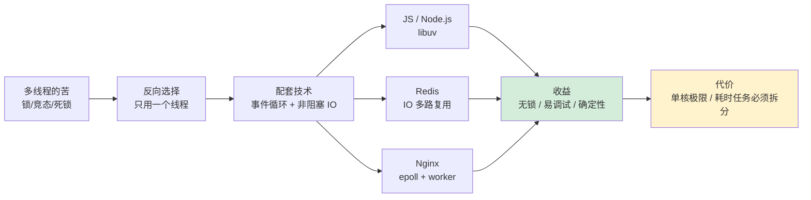

---

#### 目录介绍
- [01.概述与背景](#01概述与背景)
  - [1.1 单线程模型理念](#11-单线程模型理念)
  - [1.2 多线程模型挑战](#12-多线程模型挑战)
  - [1.3 要解决的问题](#13-要解决的问题)
- [02.认识单线程模型](#02认识单线程模型)
  - [2.1 餐厅厨房比喻](#21-餐厅厨房比喻)
  - [2.2 单线程模型](#22-单线程模型)
  - [2.3 单线程核心思想](#23-单线程核心思想)
  - [2.4 单线程挑战](#24-单线程挑战)
- [03.核心设计思想](#03核心设计思想)
  - [3.1 协作式VS抢占式](#31-协作式vs抢占式)
  - [3.2 协作式调度思想](#32-协作式调度思想)
- [04.协程实现多任务](#04协程实现多任务)
  - [4.1 并发VS并行](#41-并发vs并行)
  - [4.2 任务调度器设计](#42-任务调度器设计)
  - [4.3 多任务执行时序图](#43-多任务执行时序图)
  - [4.4 协程栈管理](#44-协程栈管理)
- [05.多请求设计原理](#05多请求设计原理)
  - [5.1 请求处理架构](#51-请求处理架构)
  - [5.2 请求顺序机制](#52-请求顺序机制)
  - [5.3 优先级队列设计](#53-优先级队列设计)
  - [5.4 并发请求处理策略](#54-并发请求处理策略)
- [06.事件循环机制设计](#06事件循环机制设计)
  - [6.1 事件循环核心架构](#61-事件循环核心架构)
  - [6.2 事件循环执行流程](#62-事件循环执行流程)
  - [6.3 非阻塞I/O设计](#63-非阻塞io设计)
- [07.实际应用分析](#07实际应用分析)
  - [7.1 协程VS线程](#71-协程vs线程)
  - [7.2 实际应用场景](#72-实际应用场景)


## 01.概述与背景

### 1.1 单线程模型理念

单线程模型是一种基于**协作式任务切换**的并发编程范式，它通过在单个线程内实现任务的协作式调度，替代了传统的抢占式多线程模型。这种设计思想的核心在于：**用协作代替竞争，用调度代替抢占**。

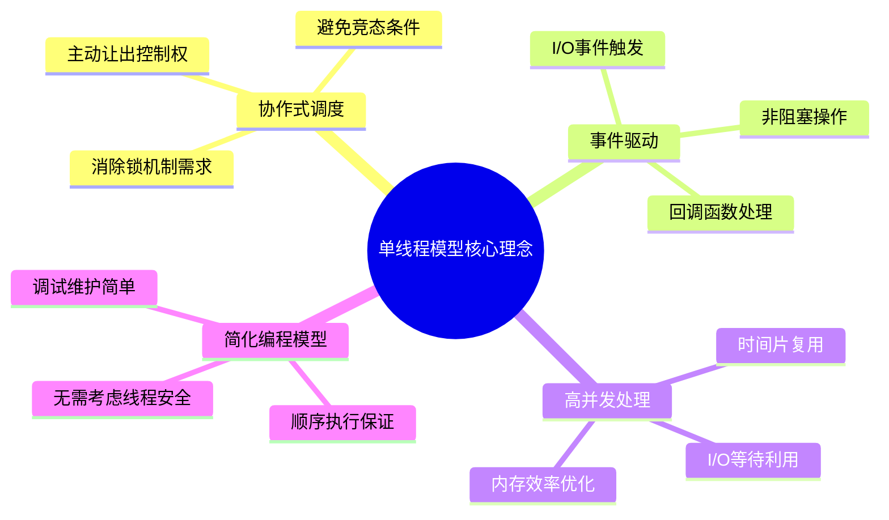

### 1.2 多线程模型挑战

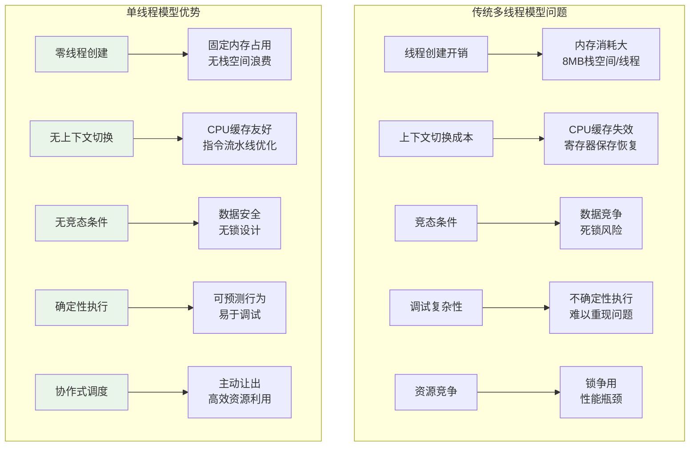

### 1.3 要解决的问题


| 问题领域 | 传统方案 | 单线程模型方案 | 优势 |
|----------|----------|----------------|------|
| **并发处理** | 多线程+锁 | 协程+事件循环 | 无锁、高效 |
| **I/O密集型** | 线程池+阻塞I/O | 异步I/O+回调 | 资源利用率高 |
| **内存管理** | 每线程独立栈 | 共享堆+协程栈 | 内存效率优化 |
| **错误处理** | 异常跨线程传播 | 统一错误处理 | 简化异常管理 |
| **调试测试** | 不确定性执行 | 确定性执行 | 可重现性好 |


## 02.认识单线程模型

### 2.1 餐厅厨房比喻

想象一个餐厅厨房，有三种工作模式：

| 工作模式 | 工作方式 | 对应编程模型 | 缺点 |
| :--- | :--- | :--- | :--- |
| **多线程厨房** | 每个订单配一个厨师+一套厨具（线程）。10个订单需要10个厨师，成本高，厨师间容易碰撞（资源竞争）。 | **多线程** | 创建/切换线程开销大，易发生竞态条件，需要复杂的锁机制。 |
| **单线程阻塞厨房** | 只有一个厨师。接到订单后，厨师必须**一直守着**锅直到水烧开，期间不能做任何事。 | **同步阻塞** | 效率极低，CPU大部分时间在空闲等待。 |
| **单线程+事件循环厨房（协程）** | 一个高效厨师。烧水时**不等待**，而是去切菜；等水烧开的**等待时间**用来炒菜。 | **协程/异步** | 需要精心设计任务拆分，所有任务不能有长时间阻塞操作。 |

**第三种模式就是协程的核心思想：充分利用等待时间。**

### 2.2 单线程模型

单线程模型是指：**程序只有一个主执行线程**。代码一行接一行地顺序执行。

**同步执行**：代码按照顺序逐行执行，前一行代码执行完毕后，才会执行下一行。

**阻塞问题**：如果某段代码执行时间过长（如复杂的计算或同步 I/O 操作），会阻塞后续代码的执行，导致页面卡顿或无响应。

**关键挑战**：遇到阻塞问题后，在传统的同步阻塞模型中，线程会停下来傻等，导致CPU资源被白白浪费。

```javascript
// 传统同步阻塞模型（低效）
console.log('开始点餐');
let data = readFileSync('menu.txt'); // 线程在这里阻塞，直到文件读完
console.log('菜单是:', data);
cookFood(); // 直到上面完成后才执行
```

**解决方案**：**异步非阻塞 + 事件循环**。

### 2.3 单线程核心思想

单线程模型的设计思想体现了以下核心理念：

1. **协作优于竞争**: 通过协作式调度避免线程间的资源竞争
2. **事件驱动优于轮询**: 基于事件的响应式编程模型
3. **异步优于同步**: 非阻塞I/O最大化系统吞吐量
4. **简单优于复杂**: 单线程执行模型简化了并发编程的复杂性

### 2.4 单线程挑战

单线程模型在处理耗时任务时存在明显的局限性：

- **阻塞问题**：如果主线程被长时间占用，页面会失去响应。
- **性能瓶颈**：无法充分利用多核 CPU 的优势。


## 03.核心设计思想

### 3.1 协作式VS抢占式

为什么取名"协作"和"抢占"？这不是名词差异、是哲学差异。

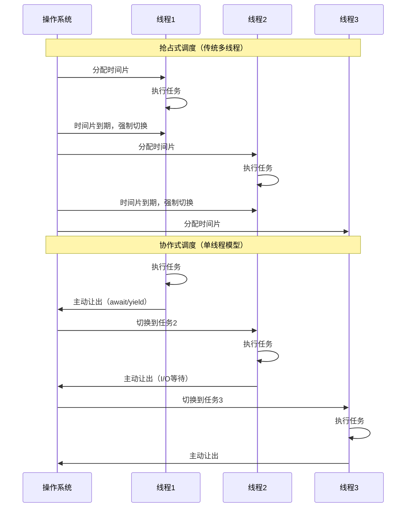

**探索：抢占式在哪里“贵”？**

抢占式调度是个双刃剑。看似公平（人人有份），但代价是三处隐藏成本：

```
成本一：内核介入
  每次调度必须陷入内核态、保存全部寄存器、恢复另一个线程的全部寄存器
  开销约 1~5 μs、CPU 周期坐满 1500~10000 个

成本二：缓存失效
  L1/L2/L3 缓存、TLB 都是为“当前在跑的线程”准备的
  切换后全部作废、需要重新加载代价高达 100~500 个周期

成本三：同步复杂度
  你不知道最年什么时候被亝出 CPU
  读-改-写三步随时被中断、只能请劳锁/CAS保护
```

**协作式为什么“快”？**

协作式是个“你说你让出、谁都不会强制你让出”的哲学。这意味着：
```
  零锁：读-改-写间不能被中断，本身就是原子的
  零上下文切换：仅在“让出点”保存必要状态、开销 ~100~500 ns
  高缓存友好度：CPU 始终在同一任务上跑，缓存本服赍闱
```

**代价：必须保证任务不会犬頁"忘记让出"**

一个任务跑 5 秒不让出，其他任务全部占充 5 秒。**这是单线程模型最大的工程陕阱**、也是事件循环生态中必须提供“Worker Pool”的原因。


### 3.2 协作式调度思想


核心机制

```java
// 协作式调度的核心抽象
public abstract class Coroutine {
    private CoroutineState state = CoroutineState.CREATED;
    private Object yieldValue;
    
    // 协程的执行入口
    public abstract void run();
    
    // 主动让出控制权
    protected void yield() {
        this.state = CoroutineState.YIELDED;
        // 保存当前执行状态
        saveExecutionContext();
        // 切换到调度器
        Scheduler.getInstance().schedule();
    }
    
    // 等待异步操作完成
    protected void await(Future<?> future) {
        this.state = CoroutineState.WAITING;
        future.onComplete(() -> {
            this.state = CoroutineState.READY;
            Scheduler.getInstance().wakeup(this);
        });
        yield();
    }
    
    // 恢复执行
    public void resume() {
        this.state = CoroutineState.RUNNING;
        restoreExecutionContext();
        run();
    }
}
```

状态转换模型

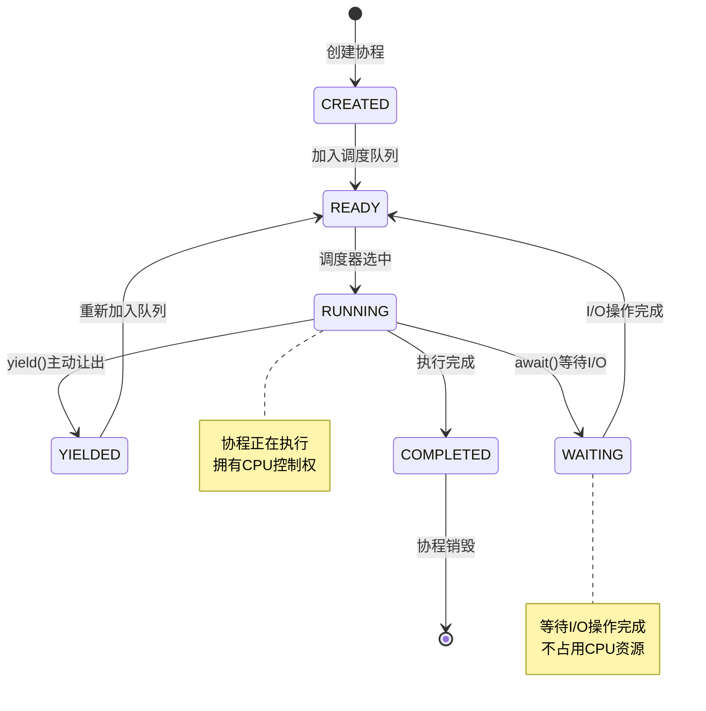

## 04.协程实现多任务

### 4.1 并发VS并行

这是并发领域最容易被混淆、也是面试最常考的两个词。

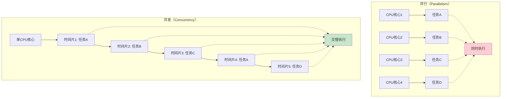

**一句话说清**：
```
并发（Concurrency） = 多个任务同时“进行中”（not necessarily 同时跳动）
并行（Parallelism）  = 多个任务同时“跳动中”
```

**Rob Pike 的经典比喻**：
```
并发 = 你同时能处理多件事（处理过程重叠）
并行 = 你同时能上多件事（同一时刻多件事都在跳动）

例子：你一个人同时烧菜、烧饭、煤面——这是并发（你只有一双手）
夫妻两人一个烧饭一个烧菜——这是并行（两双手同时跳）
```

**单线程模型一定是并发、不是并行**：
```
  100万 个请求同时“进行中”  → 并发能力顶顶高
  但同一时刻只能某个请求“跳” → 并行能力 = 1
```

这让人起个反直觉：**单线程模型能跑赢多线程，不是因为它“同时跳多件事”，而是因为它“万件事同时“不跳””**。IO 等待期间可以源源不断”推进”别人、不需要多线程。

**CPU密集 为什么必须多线程？**
```
  IO 密集：99% 时间在“等”、只需几个钉的人去提交
  CPU 密集：99% 时间在“跳”、需要多个人同时跳
```

这就是 Node.js / Redis / Nginx 都提供 Worker Pool / Worker 进程的原因。混合使用“事件循环 + 多 Worker”能同时赢两项。


### 4.2 任务调度器设计


```java
public class CoroutineScheduler {
    private final Queue<Coroutine> readyQueue = new LinkedList<>();
    private final Set<Coroutine> waitingSet = new HashSet<>();
    private Coroutine currentCoroutine;
    
    // 事件循环：单线程多任务的核心
    public void eventLoop() {
        while (!readyQueue.isEmpty() || !waitingSet.isEmpty()) {
            // 1. 处理就绪的协程
            if (!readyQueue.isEmpty()) {
                currentCoroutine = readyQueue.poll();
                currentCoroutine.resume();
            }
            
            // 2. 检查等待中的I/O操作
            checkIOCompletion();
            
            // 3. 处理定时器事件
            processTimerEvents();
            
            // 4. 如果没有就绪任务，等待I/O事件
            if (readyQueue.isEmpty()) {
                waitForIOEvents();
            }
        }
    }
    
    // 协程主动让出时的调度逻辑
    public void yield(Coroutine coroutine) {
        if (coroutine.getState() == CoroutineState.YIELDED) {
            readyQueue.offer(coroutine);
        } else if (coroutine.getState() == CoroutineState.WAITING) {
            waitingSet.add(coroutine);
        }
        // 继续事件循环，执行下一个任务
    }
}
```

### 4.3 多任务执行时序图

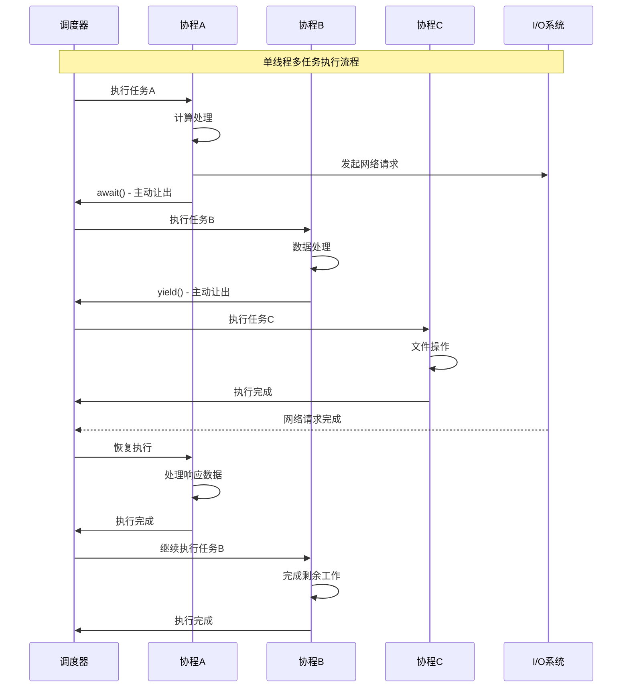

### 4.4 协程栈管理

栈切换机制

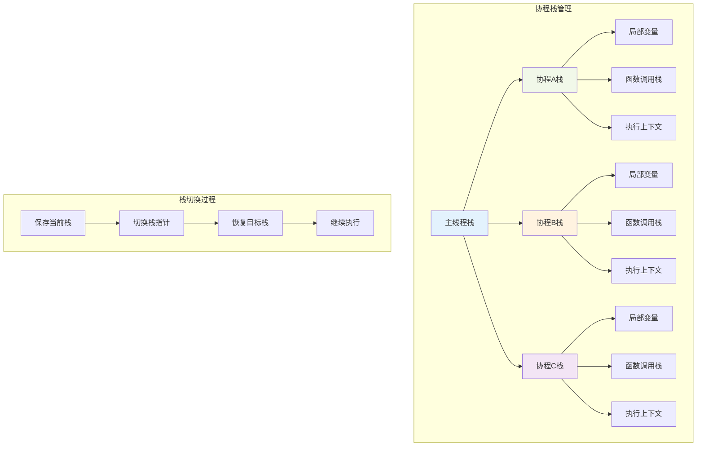

栈内存优化

```java
public class CoroutineStack {
    private static final int DEFAULT_STACK_SIZE = 64 * 1024; // 64KB
    private static final Stack<CoroutineStack> stackPool = new Stack<>();
    
    private byte[] stackMemory;
    private int stackPointer;
    private boolean inUse;
    
    // 栈池化管理，减少内存分配
    public static CoroutineStack allocate() {
        synchronized (stackPool) {
            if (!stackPool.isEmpty()) {
                CoroutineStack stack = stackPool.pop();
                stack.reset();
                return stack;
            }
        }
        return new CoroutineStack(DEFAULT_STACK_SIZE);
    }
    
    public static void deallocate(CoroutineStack stack) {
        synchronized (stackPool) {
            if (stackPool.size() < MAX_POOL_SIZE) {
                stack.inUse = false;
                stackPool.push(stack);
            }
        }
    }
    
    // 栈上下文保存和恢复
    public void saveContext(CoroutineContext context) {
        context.stackPointer = this.stackPointer;
        context.registers = getCurrentRegisters();
    }
    
    public void restoreContext(CoroutineContext context) {
        this.stackPointer = context.stackPointer;
        setCurrentRegisters(context.registers);
    }
}
```

## 05.多请求设计原理

### 5.1 请求处理架构


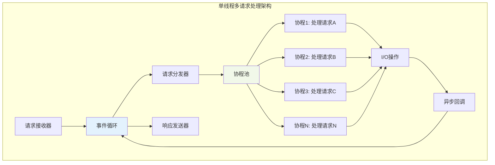

### 5.2 请求顺序机制


FIFO队列保证

```java
public class RequestProcessor {
    private final Queue<Request> requestQueue = new ConcurrentLinkedQueue<>();
    private final Map<String, Queue<Request>> sessionQueues = new ConcurrentHashMap<>();
    
    // 全局请求顺序保证
    public void processRequest(Request request) {
        requestQueue.offer(request);
        wakeupEventLoop();
    }
    
    // 会话级别顺序保证
    public void processSessionRequest(Request request) {
        String sessionId = request.getSessionId();
        sessionQueues.computeIfAbsent(sessionId, k -> new LinkedList<>())
                    .offer(request);
        wakeupEventLoop();
    }
    
    // 事件循环中的顺序处理
    public void eventLoop() {
        while (running) {
            // 1. 处理全局队列（FIFO顺序）
            Request globalRequest = requestQueue.poll();
            if (globalRequest != null) {
                processInCoroutine(globalRequest);
            }
            
            // 2. 处理会话队列（每个会话内部FIFO）
            for (Queue<Request> sessionQueue : sessionQueues.values()) {
                Request sessionRequest = sessionQueue.poll();
                if (sessionRequest != null) {
                    processInCoroutine(sessionRequest);
                    break; // 轮询处理，保证公平性
                }
            }
            
            // 3. 处理I/O完成事件
            processIOCompletion();
        }
    }
}
```

### 5.3 优先级队列设计

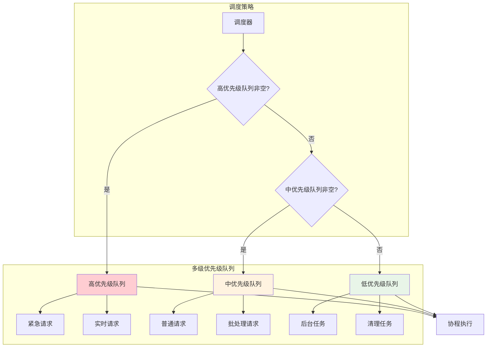


### 5.4 并发请求处理策略

```java
public class ConcurrentRequestHandler {
    private final CoroutineScheduler scheduler;
    private final Map<String, RequestContext> activeRequests = new ConcurrentHashMap<>();
    
    // 并发处理多个请求
    public void handleRequest(Request request) {
        String requestId = request.getId();
        RequestContext context = new RequestContext(request);
        activeRequests.put(requestId, context);
        
        // 创建协程处理请求
        Coroutine coroutine = new Coroutine() {
            @Override
            public void run() {
                try {
                    // 业务逻辑处理
                    processBusinessLogic(request);
                    
                    // 可能的I/O操作
                    if (needDatabaseAccess(request)) {
                        DatabaseResult result = await(database.queryAsync(request.getQuery()));
                        request.setDatabaseResult(result);
                    }
                    
                    if (needNetworkCall(request)) {
                        NetworkResponse response = await(httpClient.getAsync(request.getUrl()));
                        request.setNetworkResponse(response);
                    }
                    
                    // 生成响应
                    Response response = generateResponse(request);
                    sendResponse(response);
                    
                } finally {
                    activeRequests.remove(requestId);
                }
            }
        };
        
        scheduler.schedule(coroutine);
    }
    
    // 请求取消处理
    public void cancelRequest(String requestId) {
        RequestContext context = activeRequests.get(requestId);
        if (context != null) {
            context.cancel();
            activeRequests.remove(requestId);
        }
    }
}
```

## 06.事件循环机制设计

### 6.1 事件循环核心架构

事件循环不是一个“队列”、而是**四个队列联动**的复合设计。

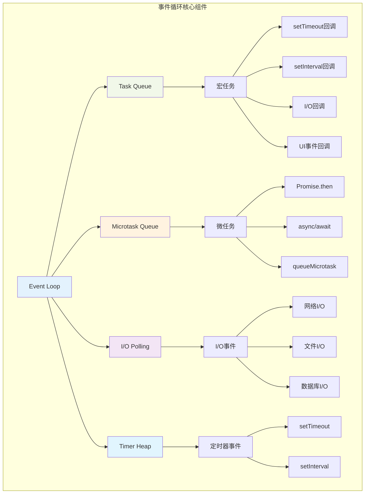

**探索：为什么要区分宏任务与微任务？**

这是个被必须重看到过、但几乎没人讲过“为什么”的陕阱。考虑以下场景：

```javascript
// 场景：Promise 链中间被 setTimeout 插足
async function logIn() {
    const user = await fetchUser();          // 微任务返回
    const profile = await fetchProfile();    // 微任务返回
    showWelcome(profile);
}
```

如果没有微任务优先、仅有宏任务队列：
```
  fetchUser 结束、then 回调进任务队列
  “这时中间什么都可能插进来”：setTimeout 起、UI 事件响、IO 事件响
  用户看到：“profile 动画被动画生活代进上变问”
```

**微任务的理论作用**：保证**一条 Promise 链能一口气跑完**、不被外部事件切走。这个体验上就是“交互资体”：不会动画会中间被其他事件插一脚、不会出现“半个 UI 表现”。

**五层优先级**（Node.js libuv 底层骑以）：
```
   1) 同步代码             → 优先级最高
   2) 微任务（process.nextTick / Promise.then）
   3) Timer 阶段（setTimeout / setInterval）
   4) Pending callbacks 阶段（上个 tick 剩的）
   5) Poll 阶段（IO 事件回调）
   6) Check 阶段（setImmediate）
   7) Close 阶段（关闭回调）
```

**Node.js vs 浏览器区别**：浏览器只区分宏/微任务两类，Node.js 有五个阶段 + 微任务。这是面试重点陕阱点。


### 6.2 事件循环执行流程


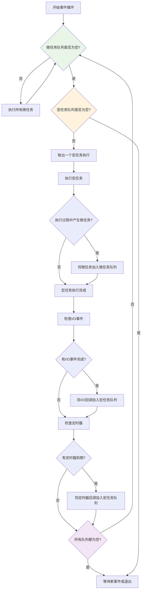

### 6.3 非阻塞I/O设计

“非阻塞 IO” 不是一个词、是四种不同的意思。要看懂底层、必须先理清这四种。

**探索：IO 模型的四种状态**

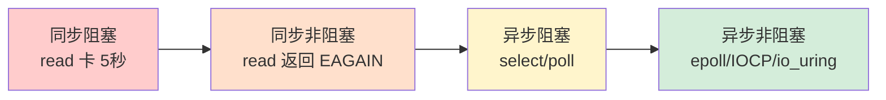

**结合实例说明**：

```c
// 同步阻塞 —— 你在店里当面等菜、不能走
bytes = read(fd, buf, 1024);   // 阻塞 5 秒

// 同步非阻塞 —— 问问菜好了没、没好就先走、一下就问
fcntl(fd, F_SETFL, O_NONBLOCK);
while ((bytes = read(fd, buf, 1024)) == -1 && errno == EAGAIN) {
    do_other_stuff();    // 问他考事、但你还是要不断轮询
}

// 异步阻塞 —— 告诉店员“菜好了叫我”、你去别处等叫
select(maxfd+1, &readfds, NULL, NULL, NULL);   // 谁好了、叫你
for (fd = 0; fd <= maxfd; fd++) {
    if (FD_ISSET(fd, &readfds)) read(fd, ...);
}

// 异步非阻塞 —— 告诉店员“菜好了、你出去送到我桌子上、我只需拿就劣”
struct io_uring_sqe *sqe = io_uring_get_sqe(&ring);
io_uring_prep_read(sqe, fd, buf, len, offset);
io_uring_submit(&ring);
// IO 完成后、内核把结果直接仅出在 CQ、你 wait 一下就拿到
```

**主流事件循环用哪种？**
```
libuv (Node.js)   → 二层、Linux 用 epoll、Windows 用 IOCP
Redis ae          → 与 libuv 类似、选二层
Nginx Worker      → 直接用 epoll
Go runtime        → netpoll 上封装 epoll/kqueue/IOCP
Tokio (Rust)       → mio 上封装 epoll、可选 io_uring
```

```java
public class NonBlockingIOManager {
    private final Selector selector;
    private final Map<SelectionKey, IOCallback> callbacks = new HashMap<>();

    public Future<ByteBuffer> readAsync(SocketChannel channel) {
        CompletableFuture<ByteBuffer> future = new CompletableFuture<>();
        try {
            channel.configureBlocking(false);
            SelectionKey key = channel.register(selector, SelectionKey.OP_READ);
            callbacks.put(key, k -> {
                ByteBuffer buf = ByteBuffer.allocate(1024);
                int n = channel.read(buf);
                buf.flip();
                future.complete(buf);
            });
        } catch (IOException e) { future.completeExceptionally(e); }
        return future;
    }

    // 事件循环中调用
    public void pollIOEvents(long timeoutMs) throws IOException {
        if (selector.select(timeoutMs) == 0) return;
        Set<SelectionKey> keys = selector.selectedKeys();
        for (SelectionKey k : keys) callbacks.remove(k).onReady(k);
        keys.clear();
    }
}
```

**如果是同步非阻塞、你就在 提问轮询 —— 这不比同步阻塞快。只有加上 IO 多路复用、“不轮询、被通知” 的变革才发生。**


## 07.实际应用分析

### 7.1 协程VS线程

| 特性 | 线程 (Thread) | 协程 (Coroutine) |
| :--- | :--- | :--- |
| **调度方式** | 操作系统内核抢占式调度 | 用户态协同式调度（主动让出） |
| **创建开销** | 较大（需分配MB级栈内存） | 极小（通常KB级） |
| **切换成本** | 高（需内核介入，保存所有寄存器） | 极低（只需保存少量上下文） |
| **数量上限** | 千级（受内存限制） | 百万级（轻松创建） |
| **并发模型** | 并行（多核）或并发（单核） | 并发（单线程内交替执行） |
| **编程复杂度** | 高（需要锁、同步机制） | 低（类似同步代码的写法） |


### 7.2 实际应用场景

适合协程的场景（I/O密集型）

- **Web服务器**：处理大量HTTP请求（大部分时间在等待网络I/O）
- **爬虫程序**：同时抓取多个网站
- **聊天服务器**：管理大量并发连接
- **数据库操作**：等待查询结果

不适合协程的场景（CPU密集型）

- **视频编码**：需要大量计算，几乎没有I/O等待
- **科学计算**：持续占用CPU
- **图像处理**：计算密集型任务

**对于CPU密集型任务**，应该使用：**多线程 + 协程**（如Go语言的goroutine，会自动在多核上调度）


### 7.3 单线程模型的最佳实践

**1. 避免阻塞操作**

单线程模型中，任何阻塞操作都会导致整个系统停滞。关键原则：
- 所有I/O操作必须使用非阻塞API
- 计算密集型任务拆分为多个小任务，穿插执行
- 使用任务队列解耦生产者和消费者

**2. 合理使用定时器**

- 避免使用精确定时器做频繁的轮询
- 利用事件驱动替代定时轮询
- 注意定时器回调中的异常处理

**3. 错误处理策略**

单线程中未捕获的异常可能导致整个线程崩溃：
- 关键操作使用 try-catch 保护
- 实现全局异常处理器
- 日志记录和监控告警

**4. 性能监控**

- 监控事件循环的耗时，检测长任务
- 统计消息队列长度，发现积压问题
- 追踪关键路径的执行时间

## 08.跨语言模型对比

单线程 + 事件循环的思想被多语言反复实现，但每个语言都有自己的实现哲学。

### 8.1 五大单线程架构上台

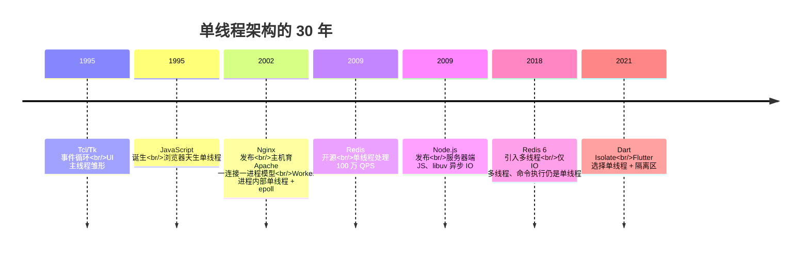

### 8.2 跨语言实现抹出

| 实现 | 事件循环名 | I/O 多路复用 | 适用场景 | 并发能力 |
|------|-----------|----------------|---------|---------|
| **JavaScript (V8)** | Microtask + Macrotask | 无外部 IO（浏览器代理）| 浏览器 UI | 单机一核低到中等 |
| **Node.js** | libuv | epoll/kqueue/IOCP | 服务器 / CLI | 单机高并发 |
| **Redis** | 自研 ae | epoll/kqueue/select | 内存数据库 | 10 万 QPS |
| **Nginx Worker** | 自研 | epoll | HTTP 反代 | 10 万连接 |
| **Dart (Flutter)** | Isolate 事件循环 | platform channel | 跨平台 UI | UI 连贯 |

### 8.3 Redis单线程能跑100万QPS？

这是个典型的反直觉问题。**拆开这 100 万 QPS 背后的六个设计决策**：

```
决策一：纯内存 → 一条命令 几十微秒，不是几毫秒
决策二：IO 多路复用 → 一个线程看完所有连接
决策三：单线程命令 → 零锁、零上下文切换、零缓存作废
决策四：高效数据结构 → SDS、ziplist、listpack 都是内存优化后的产物
决策五：多路复用选 epoll → 100万 fd 仅一次 epoll_wait
决策六：高效协议 → RESP 语言不反序列化、仅“看一下”
```

**结果**：单个命令 ≈ 0.5 微秒 → 100 万 QPS 是物理上限。不是"单线程难能可贵"，是"多线程加上去不妨能提高吗"——Redis 6 引入的仅仅是 IO 多线程、**命令执行仍是单线程**。

### 8.4 Nginx Worker隐藏双层设计

Nginx 是个低调的架构抹点：

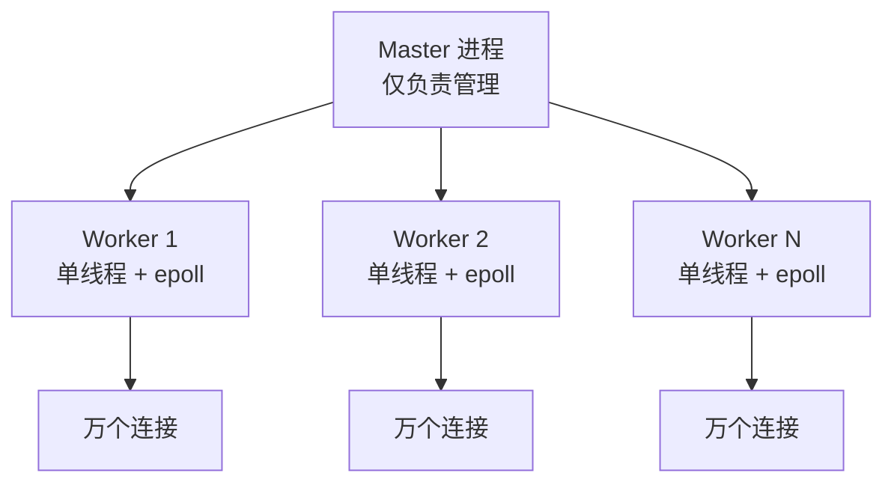

**核心设计哲学**：

- **外层多进程**：充分利用多核、进程间完全隔离（某个 Worker 崩溃不影响其他）
- **内层单线程**：避免锁、最大化单个进程处理能力

**这个“多进程 * 单线程”架构是高并发服务器的黄金设计**——Apache 的 “一连接一进程”在同类场景下被严重限制。

## 09.经典陷阱与反模式

单线程看似简单，但有五个典型的陷阱不踩不知道。

### 陷阱①｜CPU密集任务阻事件循环

```javascript
// ❌ 在 Node.js 主线程跑大计算
const data = computePrimes(1_000_000);   // 5 秒同步计算
// 这 5 秒里所有 HTTP 请求都被让着、服务实际上停了

// ✅ 拆到 Worker Thread
const { Worker } = require('worker_threads');
const worker = new Worker('./compute.js', { workerData: 1_000_000 });
worker.on('message', data => { /* 主线程仍响应 */ });
```

**根因**：事件循环的哲学是"推迟为二、仅计算为一"——计算最快、是占用者。占用多久、服务就被护多久。

### 陷阱②｜微任务饱饱

```javascript
// ❌ 微任务递归 → 宏任务永远收不到
function loop() {
    Promise.resolve().then(loop);   // 递归调微任务
}
loop();
// setTimeout 、 setInterval 、 IO 回调、UI 事件 全部被饱饱
```

**根因**：JavaScript 事件循环是"微任务饱饱后才跳到宏任务"——你一直递归调微任务，其他什么都收不到。

### 陷阱③｜隐式跨事件循环依赖

```javascript
// ❌ 跨事件循环保存状态
let counter = 0;
async function handler(req, res) {
    counter++;            // 读-改-写三步被 await 打断
    await fetch(...);
    counter--;
    res.send(counter);   // 你看到的 counter 是谁留下的？
}
```

**根因**：虽然是单线程，但 `await` 是个让出点。**顶多股能同时进入 handler**，变量表现为“补际交错”、不是并发错误，但同样令人难以理解。

### 陷阱④｜内存泄漏于闭包

```javascript
const handlers = [];
function registerOnce(data) {
    handlers.push(() => process(data));   // 闭包依赖 data、永不释放
}
```

**根因**：单线程里未释放的闭包是隐式内存泄漏。这里别人主动调劳动套，data 永不被 GC。Chrome DevTools 的 Heap Snapshot 可调查。

### 陷阱⑤｜错误一步令服务崩溃

```javascript
// ❌ Node.js 主线程未捕获异常 → 整个进程退出
process.on('uncaughtException', (err) => {
    log.error(err);
    process.exit(1);   // 这是谁都推荐的选择、全场隐藏状态丢弃
});
```

**根因**：单线程意味着 1 个未捕获异常 = 全部服务崩溃。必须在所有可能错误点插入 try/catch、Promise.catch、以及进程级别的 uncaughtException 兜底，然后推荐反转进程刷出纯净状态。

## 10.一句话总结

> **单线程模型的本质，是用“物理上不走过摆”换“逻辑上可推理”。**

三层认知：

```
表层抽象：只有一个线程，多任务靠合作式调度 —— 看起来慢
中层抽象：事件循环 + 非阻塞 IO，让“等待”不占用主线程 —— 实际能跑出 10万 QPS
底层抽象：零锁、零上下文切换、硬件缓存友好、确定性可调试 —— 这才是它能跑赢多线程的本质原因
```

终极建议：

- **IO 密集场景（网关、缓存、反代、脚本语言运行时）**→ **单线程是首选**；
- **CPU 密集场景（视频转码、加密、计算）** → 多线程/多进程/Worker Pool；
- **混合场景** → **主线程调度 + Worker Pool 干重活**，这是 Node.js / Nginx / Redis 6 都走上的路。

---

## 📎 延伸阅读

- **前一篇**：[21.异步和同步的设计](./21.异步和同步的设计.md)（单线程的前提是异步 IO）
- **下一篇**：[23.协程核心设计思想](./23.协程核心设计思想.md)（单线程中“任务”的本质是协程）
- **范式分流**：[24.Actor与CSP并发模型](./24.Actor与CSP并发模型.md)（单线程 + 消息传递 = 最干净的并发模型）
- **对照阅读**：[15.并发编程设计思想](./15.并发编程设计思想.md)（多线程范式的全谱）


