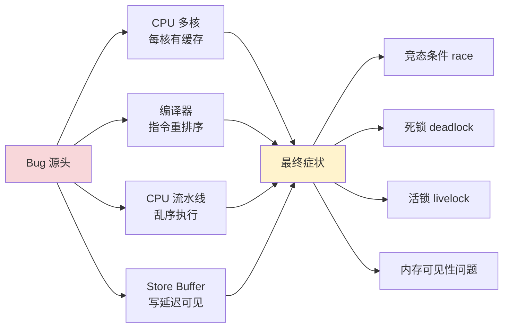
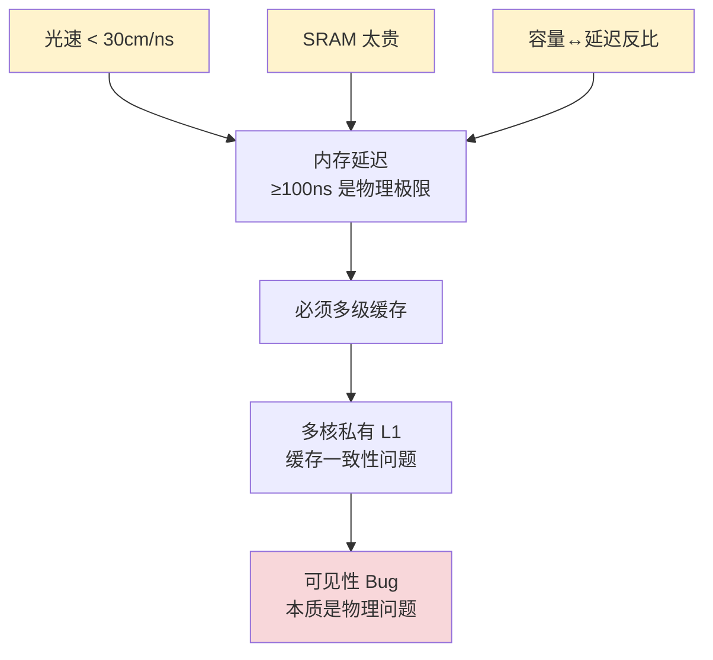
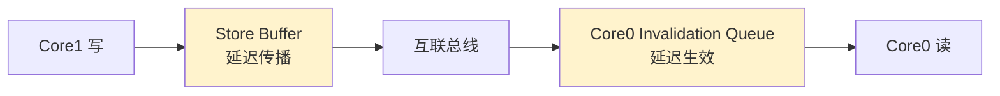
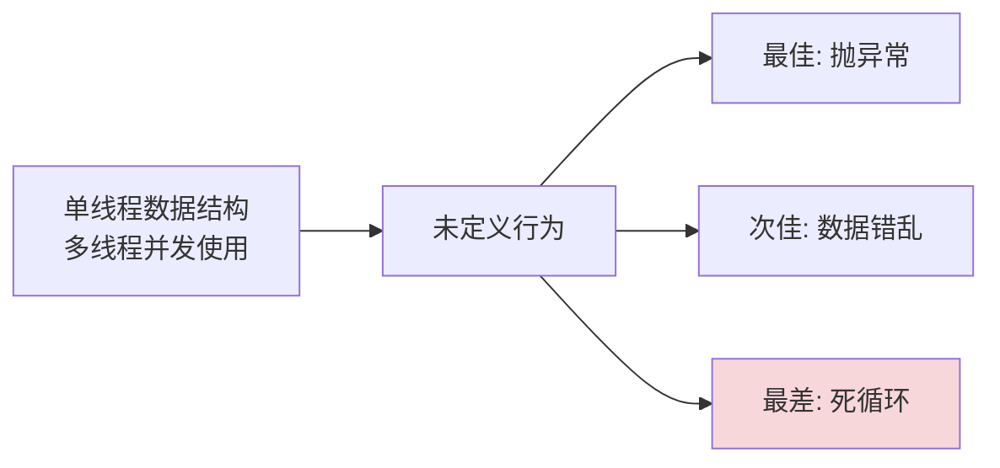
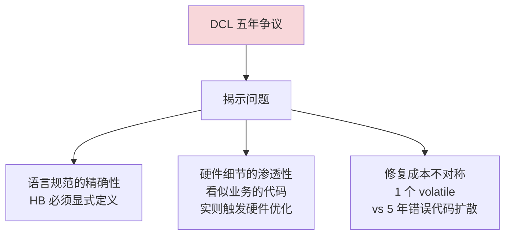
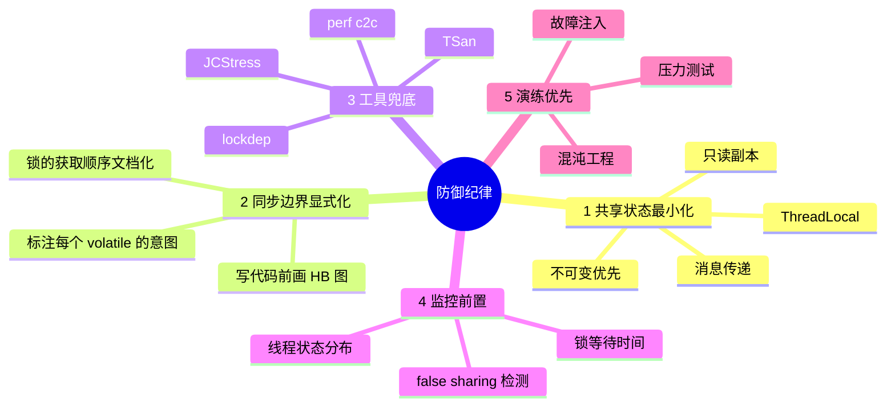
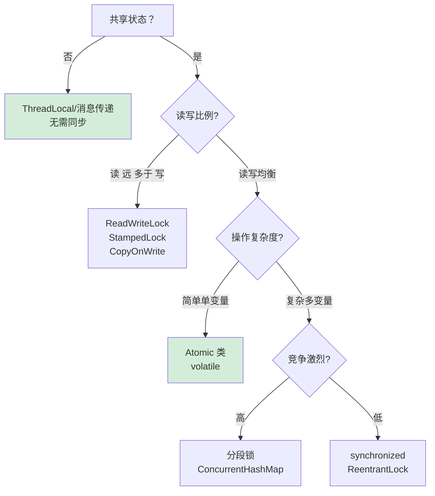

# 16.并发Bug源头由来

> 📍 **本篇位置**：第 3 卷 · 并发之道 · 第 6 篇
> 🎯 **核心矛盾**：**程序员的顺序直觉 vs 硬件的乱序现实** —— 你以为按行执行，CPU/编译器/缓存都在偷偷打乱
> 🧭 **设计灵魂**：并发 Bug 不是"运气差"，而是"硬件性能优化的必然代价"——理解了根因才知道为什么需要内存屏障
> 🌐 **跨语言覆盖**：Java(双重检查锁定经典踩坑 + JMM 保护) · C/C++(无 volatile 不保证多线程) · Go(竞态检测器 -race) · Rust(编译期消灭一类) · JS(单线程世界观下的 SharedArrayBuffer 陷阱)
> 🔗 **延伸阅读**：← [15.并发编程设计思想](./15.并发编程设计思想.md) · → [17.并发编程安全设计](./17.并发编程安全设计.md) · → [31.内存模型技术设计](./31.内存模型技术设计.md)



---

#### 目录介绍
- [1.并发编程故事](#1并发编程故事)
  - [1.1 并发的挑战](#11-并发的挑战)
  - [1.2 核心部件差异](#12-核心部件差异)
  - [1.3 CPU缓存故事](#13-cpu缓存故事)
  - [1.4 线程切换故事](#14-线程切换故事)
  - [1.5 指令重排序](#15-指令重排序)
  - [1.6 三大问题总结](#16-三大问题总结)
  - [1.7 并发bug本质](#17-并发bug本质)
- [2.多线程脏数据](#2多线程脏数据)
  - [2.1 脏数据由来](#21-脏数据由来)
  - [2.2 原子性Bug](#22-原子性bug)
  - [2.3 可见性Bug](#23-可见性bug)
  - [2.4 有序性Bug](#24-有序性bug)
- [3.脏数据根因](#3脏数据根因)
  - [3.1 原子性根因](#31-原子性根因)
  - [3.2 可见性问题](#32-可见性问题)
  - [3.3 有序性根因](#33-有序性根因)
- [4.定义游戏规则](#4定义游戏规则)
  - [4.1 需要内存模型](#41-需要内存模型)
  - [4.2 Java内存模型](#42-java内存模型)
  - [4.3 C++内存模型](#43-c内存模型)
  - [4.4 C语言规则](#44-c语言规则)
  - [4.5 ObjC内存模型](#45-objc内存模型)
- [00.超卖200单事故说起](#00超卖200单事故说起)


## 00.超卖200单事故说起

### 0.1 双11凌晨：100件库存卖出312单

某电商平台 2019 年双 11 大促，一款定价 1 元的引流商品「**100 件限量秒杀**」。系统设计极其朴素——库存放 Redis 里，下单时执行 `DECR stock`，跌到负数就拒绝。

凌晨 0:00:01，秒杀开始。0:00:03，系统开始报警："库存为负数：-212"。最终对账：**100 件库存，扣款成功 312 单**，超卖 212 单，公司当晚紧急赔付 ¥80 万。

事后排查，开发人员**坚信代码没问题**，截图给老板看：

```java
// 后台库存扣减逻辑
public boolean deduct(long productId, int qty) {
    int current = inventoryDao.getStock(productId);  // ① 查库存
    if (current >= qty) {                            // ② 判断
        inventoryDao.updateStock(productId, current - qty);  // ③ 扣减
        return true;
    }
    return false;
}
```

"**这不就是查→判断→扣三步吗？库存够才扣，不够就拒，怎么会卖超？**"

### 0.2 老板的灵魂三问

老板问了三个问题，工程师当场答不上来：

**问题 1**：你说"库存够才扣"，可是从①到③，**中间有多长时间？**

```
工程师：嗯……几毫秒？
老板：那几毫秒里，会不会有别的请求也在执行①？
工程师：……
```

**问题 2**：你写 `current - qty`，这是哪个 `current`？

```
工程师：就是上面查出来的啊。
老板：可那是一个"过去时刻的快照"，
     ③ 执行的时候，数据库里真实的 stock 还是这个值吗？
工程师：……
```

**问题 3**：单元测试为什么测不出来？

```
工程师：单测都过了，模拟了 100 个请求，扣完正好是 0。
老板：那是因为单元测试是顺序跑的——每个请求等上一个完成才执行。
     线上是 5 万 QPS 同时打进来，他们看到的库存都是 100。
工程师：……
```

### 0.3 用并发思维"慢动作回放"

把工程师的代码放到多线程视角下慢放，事故就一目了然：

```
时刻      请求 A (qty=1)         请求 B (qty=1)         数据库 stock
─────────────────────────────────────────────────────────────────
T1       ① 读 stock = 100                                  100
T2                              ① 读 stock = 100           100
T3       ② 100 ≥ 1 → 通过                                  100
T4                              ② 100 ≥ 1 → 通过           100
T5       ③ 写 stock = 100-1 = 99                           99
T6                              ③ 写 stock = 100-1 = 99    99
─────────────────────────────────────────────────────────────────
结果：扣了两次，stock 只少了 1 → 多卖了 1 件
扩展到 5 万 QPS：100 件库存，可以瞬间被 312 个请求"看到≥1"，全部放行
```

**这是一个经典的 check-then-act（先检查后执行）反模式**。它有一个特别坏的特性：

> **所有错误的请求都"自我觉得"是合法的**——每个请求看到的快照里库存确实够，每个请求做的判断确实正确。但所有请求拼起来，结果是错的。

### 0.4 这个事故揭示了什么

工程师对代码的直觉建立在**单线程心智模型**上：

```
我以为的执行：
  请求 A：读→判→写→读→判→写→读→判→写……（一个一个来）
  请求 B：等 A 全部完成再开始

实际的执行：
  请求 A：    读 ─── 判 ─── 写
  请求 B：       读 ─── 判 ─── 写
  请求 C：           读 ─── 判 ─── 写
  ……
  几千个请求的"读判写"在 CPU 时间线上互相交错
```

**这个错位，本质上是同一个问题在三个不同层面的体现**：

```mermaid
flowchart TB
    Q[超卖事故] --> L1[业务层<br/>check-then-act 不原子]
    Q --> L2[语言层<br/>i-- 等复合操作不原子]
    Q --> L3[硬件层<br/>LOAD/ADD/STORE 三步可被打断]
    L1 & L2 & L3 --> R[同一个根因<br/>"逻辑整体"被任意切片]
    style Q fill:#f8d7da
    style R fill:#fff3cd
```

### 0.5 五个层层递进的追问

带着"超卖事故"，整篇文章其实就是在回答下面五个递进的问题：

| 追问 | 答案章节 |
|---|---|
| 为什么我以为的"一步"，CPU 看是好几步？ | §1.4 / §3.1 |
| 为什么 A 改了 stock，B 居然看到旧值？ | §1.3 / §3.2 |
| 为什么我代码"先 check 后 act"，会被重排？ | §1.5 / §3.3 |
| 这些"硬件偷工减料"是 bug 吗？为什么没人修？ | §1.2（速度鸿沟） |
| 那程序员该如何活在这个世界里？ | §4 / §7 / §8 |

### 0.6 修复预演：四个层次的解药

后面会展开，这里先把四把"解药"的清单列出来，让读者带着对照感往下读：

```
解药 1（业务层）：把"读-判-写"合成一步原子操作
   → Lua 脚本 / Redis DECR / 数据库 UPDATE WHERE stock>=qty

解药 2（语言层）：用同步原语建立 happens-before
   → synchronized / Lock / volatile / Atomic*

解药 3（硬件层）：用 CPU 提供的原子指令
   → CAS（Compare-And-Swap）/ LL-SC / 原子算术指令

解药 4（架构层）：从源头消除共享
   → 不可变数据 / 消息传递 / 单线程模型 / 分片
```

带着这次事故的"具体感"，进入正题——你将看到，**所有抽象的"原子性、可见性、有序性"原理，最终都能落到这次超卖事故的 312 单上**。

---

## 01.并发编程故事

### 1.1 并发的挑战

先从一个随手能试出来的现象开始探索。运行下面这段代码三次：

```java
int counter = 0;
Thread t1 = new Thread(() -> { for (int i = 0; i < 100000; i++) counter++; });
Thread t2 = new Thread(() -> { for (int i = 0; i < 100000; i++) counter++; });
t1.start(); t2.start(); t1.join(); t2.join();
System.out.println(counter);
```

**期望输出**：200000。**实际输出**：103847、142003、197851，每次不一样。如果用 macOS Apple Silicon 跑可能错得更明显（弱内存模型），用 x86 跑可能运气好反倒偶尔跳出“看起来正确”的 200000。

**这一个现象似乎揭示了并发世界的三个深刻不同于顺序世界的特质**：

```
1. 同一段代码跑出不同结果 → 不确定性（Non-determinism）
2. 加印刷、换机器、加 sleep 都能改变现象 → 观察者效应（Heisenbug）
3. 出错位置不是"出错原因" → 不易定位（Non-locality）
```

单线程程序是确定性的——相同输入总能得到相同输出。而并发程序中，线程调度由 OS 内核控制，开发者无法控制线程何时被中断、何时恢复，这引入了**不确定性**。

**并发问题难以调试的根源**：

| 阶段 | 顺序程序 | 并发程序 |
|------|---------|---------|
| 复现 | 输入一样就能复现 | 输入一样也不一定复现 |
| 调试 | 加断点、单步 | 断点本身会改变时序 |
| 推理 | 代码顺序 = 执行顺序 | 代码顺序 ≠ 执行顺序 |
| 测试 | 单元测试可覆盖 | 依赖压测、并发测试、形式验证 |

**三个术语重点识别**：

- **时序依赖**（timing-dependent）：Bug 只在特定调度顺序下触发。你看代码永远看不出问题，只有线上运行几周后一次眼错误才会有人报 bug。
- **不可复现**（non-reproducible）：同样的代码运行多次，结果可能不同。这是本质，不是偶发。
- **海森堡效应**（Heisenberg effect）：加日志/断点后，时序改变，Bug 消失。**这是并发调试里最让人崩溃的营带**——“我加了打印它就不重现了”不是问题不存在，而是问题被你掩盖了。

### 1.2 核心部件差异

为什么并发会出现那么多诡异问题？要回答这个问题，必须先打起一个初始认识：**现代计算机不是你以为的那种"顺序机器"**。

现代计算机体系中，三大核心部件的速度差异是一切并发设计的根源：

```
部件          延迟量级         类比
────────────────────────────────────
CPU寄存器     ~0.3ns          1秒
L1 Cache     ~1ns            3秒
L2 Cache     ~3ns            10秒
L3 Cache     ~10ns           30秒
主内存(RAM)   ~100ns          5分钟
SSD          ~100μs          3.5天
机械硬盘      ~10ms           11.5个月
网络(同机房)   ~500μs          17天
网络(跨城)    ~50ms           4.7年
```

如果把CPU一次操作视为"一秒钟"，那么：

- **读一次内存** ≈ 等5分钟
- **读一次SSD** ≈ 等3.5天
- **读一次磁盘** ≈ 等将近一年

这就是说的"CPU天上一天，内存地上一年"。CPU太快了，快到它大部分时间都在**等**——等内存、等磁盘、等网络。

#### 为什么这个差距是"物理定律强制的"，不是工艺问题

很多人以为"再发展几十年内存就能追上 CPU"——错。**这个差距来自三条物理铁律**，永远没法消除：

**铁律 1：光速**

```
光速 ≈ 30 万 km/s = 30 cm/ns
3GHz 的 CPU，1 个时钟周期 ≈ 0.33 ns
0.33 ns 内，光只能跑 10 cm

结论：CPU 每个时钟周期内，"信息"最远只能传 10 cm
     主板上 CPU 到 RAM 通常 5-10 cm，单程就够呛
     再加上电路延迟、信号同步、协议握手 → 100ns 是物理极限
```

**铁律 2：晶体管成本——SRAM vs DRAM**

```
SRAM (L1/L2/L3 用)：1 bit 需要 6 个晶体管（双稳态触发器）
                    速度快(~1ns)，但成本极高，密度低
                    32KB L1 已经占据 CPU 不少面积
                    做 8GB SRAM？需要 1 万亿个晶体管，价格百万美元级

DRAM (主内存用)：    1 bit 只需要 1 个电容 + 1 个晶体管
                    成本低，密度高，但需要不停刷新
                    访问速度慢（~100ns），但 1 元/GB 量产可行
```

**结论**：你不可能用 SRAM 做主存——经济上不允许；也不可能让 DRAM 快起来——物理上不允许。**只能在中间加多层缓存做妥协。**

**铁律 3：容量与延迟的反比**

```
容量翻倍 → 寻址电路延迟增加 ≈ √2 倍
所以：32KB L1 ≈ 1ns
     256KB L2 ≈ 3ns
     8MB L3 ≈ 10ns
     16GB RAM ≈ 100ns

不是"工程师不够努力"，而是"地址解码电路本身要时间"
```

**这三条铁律加起来 → 多级缓存是唯一出路 → 多核独立 L1 → 缓存一致性问题 → 可见性 Bug**。



**这一段的认知跃迁**：可见性 Bug 不是软件 Bug，**它是物理定律在多线程程序里的回声**。理解了这一点，就不会再问"为什么不能写一个'神奇内存'让所有问题消失"——你是在和光速对抗。

#### 如果什么都不优化，会如何？

```
CPU 读取内存 → 等 100ns
CPU 计算 1ns → 然后又读内存 → 又等 100ns
...
实际利用率 ≈ 1%
```

这个矛盾催生了整个并发编程的底层设计逻辑：**绝不让CPU闲着。**

为了摆脱等待，硬件工程师引入了三大优化——这三个优化在单线程下透明无感，但在多线程下变成三大 Bug 之源：

```
优化一：CPU 加多级缓存 → 【可见性问题】
         为了不等内存，加上 L1/L2/L3 。每个核独立的 L1，
         变量以多份存在 → 别人看不到你的修改。
优化二：OS 线程调度 → 【原子性问题】
         为了不让 IO 等待浪费 CPU，OS 随时可以抢占线程 →
         一句语句的代码可能被打断。
优化三：指令重排序 → 【有序性问题】
         为了填满流水线，编译器/CPU 会调换指令顺序 →
         你看到的代码顺序 ≠ CPU 实际执行顺序。
```

下面三节会逐个拆解它们。

### 1.3 CPU缓存故事

优化：CPU缓存 → 引入可见性问题

**为什么要缓存？** CPU每次读内存要等"5分钟"，太慢。解决办法：在CPU和内存之间加高速缓存（L1/L2/L3），把热数据放在离CPU最近的地方。

```
┌─────────────────────────────────────────┐
│              多核CPU架构                  │
│                                         │
│  ┌──────────┐        ┌──────────┐       │
│  │  Core 0  │        │  Core 1  │       │
│  │┌────────┐│        │┌────────┐│       │     ← 每个核心私有缓存
│  ││  L1-D  ││        ││  L1-D  ││       │
│  ││ (32KB) ││        ││ (32KB) ││       │
│  │└────────┘│        │└────────┘│       │
│  │┌────────┐│        │┌────────┐│       │
│  ││  L2    ││        ││  L2    ││       │
│  ││(256KB) ││        ││(256KB) ││       │
│  │└────────┘│        │└────────┘│       │
│  └─────┬────┘        └────┬─────┘       │
│        └───────┬──────────┘             │
│          ┌─────┴─────┐                  │
│          │ L3 (共享)  │← 共享缓存         │
│          │  (8MB+)   │                  │
│          └─────┬─────┘                  │
└────────────────┼────────────────────────┘
                 │
          ┌──────┴──────┐
          │  主内存 RAM  │
          │  (GB级别)    │
          └─────────────┘
```

**问题来了**：每个CPU核心有自己私有的L1/L2 Cache。当Core 0修改了变量`x`，新值可能只写入Core 0的L1 Cache，还没来得及刷回主内存。此时Core 1从自己的Cache或主内存读`x`——读到的是**旧值**。

```
时刻    Core 0                    Core 1                  主内存x
──────────────────────────────────────────────────────────────────
T0                                                         0
T1     x = 1 (写入L1 Cache)                                0
T2                               读x → 从自己的Cache得到0    0
T3                               认为 x == 0（实际已经是1）   0
```

**这就是可见性问题**：一个核心对共享变量的修改，对另一个核心不可见。

### 1.4 线程切换故事

优化：线程切换/时间片 → 引入原子性问题

**为什么要线程切换？** 一个线程在等I/O（读磁盘、等网络）的时候，CPU是空闲的。如果只有一个线程，CPU就白等了"一年"。操作系统的解决方案是：**时间片轮转**——让CPU在多个线程间快速切换，线程A等I/O时，切到线程B继续干活。

```
        时间线 →
        ┌─────┬─────┬─────┬─────┬─────┬─────┐
线程A   │执行  │ I/O等待....................│执行 │
        └─────┘     │                     └─────┘
                    ▼
        ┌─────┴─────┐
        │ L3 (共享)  │← 共享缓存
        │  (8MB+)   │
        └─────┬─────┘
                 │
          ┌──────┴──────┐
          │  主内存 RAM  │
          │  (GB级别)    │
          └─────────────┘
```

**问题来了**：线程切换可以发生在**任何两条CPU指令之间**。一条高级语言语句往往对应多条CPU指令，线程可能在语句"执行到一半"时被切走。

操作系统不知道也不关心你的"业务逻辑边界"在哪里，它只按时间片切换。**一条语句在你眼里是一步，在CPU眼里可能是好几步，这几步之间随时可能被打断。**

### 1.5 指令重排序

优化：指令重排序 → 引入有序性问题

**为什么要重排序？** CPU内部有多个执行单元（ALU、FPU、Load/Store Unit），为了让它们尽可能并行工作，CPU和编译器会对没有数据依赖的指令进行**重排序**。

```
原始代码:
  a = 1;       // ① 写内存（慢，要等100ns+）
  b = a + 1;   // ② 依赖①，必须等
  c = 2;       // ③ 和①②无关

CPU优化后的执行顺序:
  a = 1;       // ① 发起写操作（异步）
  c = 2;       // ③ 不等①完成，先执行这条（因为无依赖）
  b = a + 1;   // ② 等①完成后执行

效果: ①和③并行，节省了一次等待
```

重排序发生在三个层面：

- **编译器优化**：编译器重排指令顺序
- **CPU 流水线**：乱序执行（Out-of-Order Execution）
- **存储缓冲区**：Store Buffer 导致写操作延迟可见

在单线程内，这种重排序是**安全的**——CPU保证最终结果与顺序执行一致（as-if-serial语义）。

**问题来了**：在多线程环境下，其他线程观察到的执行顺序可能和代码顺序完全不同。

### 1.6 三大问题总结

```
速度鸿沟
  │
  ├──CPU太快 ──→ 加Cache ──→ 每核独立Cache ──→ 【可见性问题】
  │                                              一个核心的写，另一个核心看不到
  │
  ├──I/O太慢 ──→ 线程切换 ──→ 任意指令间切换 ──→ 【原子性问题】
  │                                              复合操作被打断
  │
  └──充分利用 ──→ 指令重排 ──→ 多线程间顺序不一致 → 【有序性问题】
     CPU流水线                                     代码顺序≠执行顺序
```

**三个问题本质上是同一个根源的三个面**：硬件工程师为了弥合速度鸿沟做的优化，在单线程下完全透明，但在多线程下暴露了底层细节。

### 1.7 并发bug本质

线程安全的本质问题只有一个：**多个执行流同时访问共享可变状态时，结果不可预测。**

所有的并发Bug都可以追溯到同一个源头：

> **硬件工程师为了填平CPU/内存/IO之间的速度鸿沟，引入了缓存、线程、流水线优化。这些优化在单线程下完全透明，但在多线程下打破了程序员"代码按顺序执行、写了就能看到、一条语句不可分割"的直觉。**

而所有的并发解决方案，本质上都是在两条路中选一条：

1. **消除共享**：线程局部存储、消息传递（Post/Channel）、不可变数据 → 从源头消除问题
2. **管控共享**：锁、原子操作、内存屏障 → 在问题发生时阻止它

## 02.多线程脏数据

### 2.1 脏数据由来

为什么会出现脏数据？脏数据的本质是**对共享状态的非原子性操作**。

当一个操作在逻辑上应该是不可分割的，但实际执行中被拆分成多个步骤，其他线程在中间状态读写了同一数据，就产生了脏数据。

并发错误（数据竞争、可见性问题、原子性破坏）的发生需要同时满足三个条件：

```
① 共享：多个线程访问同一块内存
② 可变：至少一个线程对这块内存执行写操作
③ 无序：读写操作不是一步完成，这些访问之间没有 happens-before 关系
```

### 2.2 原子性Bug

**案例：i++ 不是原子操作**

```cpp
// 共享变量
int counter = 0;

// 线程A和线程B同时执行
void Increment() {
  for (int i = 0; i < 100000; ++i) {
    counter++;  // 看似一行，实则三步
  }
}
```

`counter++` 在CPU层面分解为：

```
编译后的CPU指令:
  ① LOAD  [counter] → R1    // 读。从内存读到寄存器
  ② ADD   R1, 1 → R1        // 改。寄存器+1
  ③ STORE R1 → [counter]    // 写。写回内存
```

两个线程交错执行：

```
时间线        线程A                  线程B               counter(内存)
─────────────────────────────────────────────────────────────────
  T1         ① LOAD (读到0)                               0
  T2         ──被OS切走──→                                 
  T3                               ① LOAD (读到0)         0
  T4                               ② ADD  (R1=1)          0
  T5                               ③ STORE(写回1)         1
  T6         ←──切回──                                     
  T7         ② ADD  (R1=1)                                1
  T8         ③ STORE(写回1)                               1
─────────────────────────────────────────────────────────────────
结果: 两次++，期望counter=2，实际counter=1
```

**两次自增，结果只加了1。**

### 2.3 可见性Bug

```cpp
// C++ 示例
bool stop = false;

// 线程A
void Worker() {
  while (!stop) {  // 编译器可能优化为只读一次，永远循环
    DoWork();
  }
}

// 线程B
void RequestStop() {
  stop = true;     // 写入可能滞留在CPU Cache中
}
```

在`-O0`（无优化）下，程序可能正常工作。在`-O2`及以上，Worker**永远不会停下来**。


### 2.4 有序性Bug

半初始化对象，Java中著名的双重检查锁定（DCL）问题：

```java
class Singleton {
    private static Singleton instance;

    public static Singleton getInstance() {
        if (instance == null) {                // 第一次检查
            synchronized (Singleton.class) {
                if (instance == null) {        // 第二次检查
                    instance = new Singleton(); // 问题在这里
                }
            }
        }
        return instance;
    }
}
```

`instance = new Singleton()` 在JVM层面分解为：

```
1. 分配内存
2. 调用构造函数初始化
3. 将引用赋值给 instance
```

编译器/CPU可能重排序为 `1→3→2`，此时线程B在步骤3后读到非null的 `instance`，但对象还没初始化完——**读到半初始化的对象**。

## 3.脏数据根因

**数据竞争**：多个线程同时访问共享数据

- **原子性**：操作的不可分割性
- **可见性**：一个线程对共享变量的修改对其他线程的可见性
- **有序性**：程序执行的顺序性保证

### 3.1 原子性根因

> 一组操作要么全部执行完成，要么全部不执行。

CPU指令级别只保证单条指令的原子性。高级语言中一条语句通常编译成多条指令，中间随时可能被线程切换打断。

`counter++` 在C++源码层面是一行，但编译到CPU指令层面是**三个独立操作**：

```
源码:  counter++;

CPU指令:
  ① LOAD   [0x7fff1234] → R1     // 从内存地址读值到寄存器
  ② ADD    R1, 1 → R1            // 寄存器中做加法
  ③ STORE  R1 → [0x7fff1234]     // 从寄存器写回内存
```

关键认知：**CPU的原子性保证粒度是单条指令，不是一行源码。** 操作系统的线程调度器可以在任意两条指令之间插入线程切换。

一句话总结：**`counter++`的Bug本质是"读-改-写"三步操作之间存在被打断的窗口，线程基于过时的快照值做计算，导致写回时覆盖了其他线程的更新。**

**第一层：硬件层 —— 寄存器是线程私有的。这是最根本的原因。**

```
┌─────────────────────────────────────────┐
│                CPU                       │
│  ┌─────────────┐  ┌─────────────┐       │
│  │   Core 0    │  │   Core 1    │       │
│  │  ┌───────┐  │  │  ┌───────┐  │       │
│  │  │R1=100 │  │  │  │R1=100 │  │       │
│  │  │R2=... │  │  │  │R2=... │  │       │
│  │  └───────┘  │  │  └───────┘  │       │
│  │  线程A的     │  │  线程B的     │       │
│  │  执行上下文   │  │  执行上下文   │       │
│  └─────────────┘  └─────────────┘       │
│                                         │
│  寄存器是核心私有的，互相看不见对方的值      │
└─────────────────────────────────────────┘
```

每个CPU核心有一组**独立的寄存器**。线程A把counter加载到Core 0的R1，线程B把counter加载到Core 1的R1——这是两个**物理上完全隔离**的存储单元。它们各自在自己的寄存器里计算，互不知情。

**第二层：OS层 —— 抢占式调度不尊重业务边界**

操作系统的调度器基于**时间片**工作：

```
线程A获得CPU
  ↓
执行N条指令
  ↓
时间片耗尽 / 更高优先级线程就绪 / 系统中断
  ↓
OS保存线程A的上下文（所有寄存器值）到内存(TCB)
  ↓
恢复线程B的上下文（从TCB加载寄存器值）
  ↓
线程B开始执行
```

调度器的切换点是**任意两条指令之间**——它不知道你的 `counter++` 是一个"逻辑整体"。在OS看来，LOAD、ADD、STORE就是三条独立指令，在它们之间切换完全合法。

更关键的是：**线程切换时保存/恢复的上下文包含寄存器值。** 线程A被切走时R1=100被保存，切回来时R1=100被恢复——这个值已经"过时"了，但CPU不知道。

**第三层：语言层 —— 源码的抽象欺骗了你**

```
你看到的:        counter++;          // 一个操作
编译器生成的:     LOAD; ADD; STORE;   // 三个操作
CPU执行的:       三个独立的微操作      // 每个之间都可能被打断
```

C/C++/Java/OC 这些语言的 `++` 运算符是**语法糖**，它让"读-改-写"这个三步操作看起来像一步。但编译器没有义务把它编译成原子指令——事实上在大多数架构上也做不到（普通的LOAD和STORE是分开的指令）。

#### 反向追问：为什么 CPU 不直接提供"原子 LOAD-ADD-STORE"？

读到这里，每个工程师心里都会冒出一个问题：

> "既然 LOAD/ADD/STORE 三步会被打断，**那 CPU 不能直接造一条 'ADD-MEMORY' 指令一次完成吗？**"

答案是：**能造，但代价巨大，所以默认不开。**

让我们顺着 CPU 设计师的思路一路追下去：

**追问 1：x86 上不是有 `add [mem], 1` 吗？**

确实有，但**它在多核下也不原子**。x86 的 `add [mem], 1` 在内部仍然是"读 → 改 → 写"三个微操作，只不过对**单核**原子。多核环境下，Core 0 和 Core 1 同时执行 `add [mem], 1`，它们的"读-改-写"仍然会交错。

**追问 2：那再加 `lock` 前缀总行了吧？**

`lock add [mem], 1` 才是真正的原子指令。它强制 CPU 做：

```
1. 锁住目标内存对应的整个缓存行（其他核全部退避）
2. 完成读-改-写（5-30 个时钟周期内）
3. 释放缓存行锁
```

但**这个原子的代价**：

```
普通的 add 寄存器指令：≤ 1 个时钟周期
普通的 mov 内存指令：  ~3 个时钟周期（命中 L1）
lock add 内存指令：    ~30-50 个时钟周期（强制刷 store buffer + 缓存行独占）

差距：原子操作比普通操作慢 30-50 倍
```

**追问 3：那为什么 `i++` 不默认编译成 `lock add`？**

因为 99% 的 `i++` 是单线程的，**为了 1% 的并发场景让 99% 的代码变慢 50 倍，得不偿失**。所以 C++/Java 的语义要求：

```
普通 i++ → 编译成普通 LOAD/ADD/STORE（性能优先）
volatile i++ → 不允许（仍非原子，编译器报警）
AtomicInteger.incrementAndGet() → 编译成 lock xadd（原子但慢）
```

**追问 4：硬件层面有没有"廉价的原子"？**

有，叫 **LL/SC（Load-Linked / Store-Conditional）**。ARM、RISC-V、POWER 全是这种设计：

```
ldxr  x1, [addr]    // Load-Exclusive：标记这个地址被我"盯上了"
add   x1, x1, #1
stxr  w2, x1, [addr] // Store-Exclusive：如果期间没人动过，就写
                     // w2 返回是否成功，失败就重试
```

LL/SC 不锁缓存行，只用一个"独占监视器"标记，**比 x86 的 lock 便宜得多，但需要重试循环**。这就是为什么"无锁编程"在 ARM 上比在 x86 上更适用。

**这段反向追问的认知跃迁**：

> 原子性不是"理所当然"的——它是**硬件设计师在性能和正确性之间的精心权衡**。普通 `i++` 不原子不是"硬件的疏忽"，而是**为了让单线程程序快 50 倍的有意妥协**。如果你想要原子性，请明确告诉硬件——通过 `lock`、CAS、LL/SC 这些"我愿意付钱买原子性"的指令。

### 3.2 可见性问题

> 一个线程对共享变量的修改，另一个线程能否立即看到。

```
Core 0 (线程A: Worker)           Core 1 (线程B: RequestStop)
┌──────────────────────┐        ┌──────────────────────┐
│ 执行 while (!stop)    │        │ 执行 stop = true      │
│                      │        │                      │
│ ┌──────────────────┐ │        │ ┌──────────────────┐ │
│ │    寄存器         │ │        │ │    寄存器         │ │
│ └────────┬─────────┘ │        │ └────────┬─────────┘ │
│ ┌────────┴─────────┐ │        │ ┌────────┴─────────┐ │
│ │   Store Buffer   │ │        │ │   Store Buffer   │ │
│ │                  │ │        │ │  stop=true (等待) │ │
│ └────────┬─────────┘ │        │ └────────┬─────────┘ │
│ ┌────────┴─────────┐ │        │ ┌────────┴─────────┐ │
│ │   L1 Cache       │ │        │ │   L1 Cache       │ │
│ │   stop=false     │ │        │ │                  │ │
│ └────────┬─────────┘ │        │ └────────┬─────────┘ │
└──────────┼───────────┘        └──────────┼───────────┘
           └──────────────┬────────────────┘
                    ┌─────┴──────┐
                    │  L3 / 主内存 │
                    │ stop=false  │
                    └────────────┘
```

Core 1执行`stop = true`时：

```
步骤1: 值写入Core 1的Store Buffer（极快，~1个时钟周期）
步骤2: Store Buffer异步将值刷到Core 1的L1 Cache
步骤3: MESI协议发送Invalidate消息给Core 0
步骤4: Core 0收到消息，标记自己Cache中的stop为Invalid
步骤5: Core 0下次读stop时，Cache Miss，从Core 1的Cache/主内存获取新值
```

步骤3-5需要时间（通常几十纳秒）。在这个窗口内，Core 0可能读到旧值。

```
bool stop 可见性Bug的完整根因:

  stop 是普通 bool，不是 atomic
       ↓
  C++标准: 多线程无同步读写非atomic变量 = 未定义行为
       ↓
  编译器利用UB假设:
    "没有数据竞争" → "stop不会被别人改" → "循环内不用重读"
       ↓
  循环不变量外提: stop的读从循环内移到循环外，只读一次
       ↓
  生成的机器码: 循环内没有 LOAD stop 的指令
       ↓
  Worker永远看到第一次读到的 false → 死循环
       ↓
  (即使编译器没优化，CPU Cache延迟也可能导致短暂的不可见，ARM上更明显)
```

**核心洞察**：可见性问题的本质不在于"值传播得慢"，而在于**编译器从根本上消除了"读"的动作**。

#### 深入硬件：MESI 协议与 Store Buffer 的真相

上面讨论了"编译器消除了读动作"的语言层面问题。但即使编译器老老实实生成了"每次循环都 LOAD"的代码，**硬件层面仍然会让你失望**——因为 CPU 之间的"通信"也不是免费的。

**MESI 协议：缓存一致性的状态机**

每个 CPU 缓存行有 4 种状态：

```
M (Modified) ：被本核独占且修改过，主存里是旧值
E (Exclusive)：被本核独占但未修改，和主存一致
S (Shared)   ：多个核都有，和主存一致（只读）
I (Invalid)  ：已失效，必须重新从其他核或主存加载
```

状态转移示例：

```
初始：stop = false 在主存中
Core 0 读 stop → Core 0 缓存行变 E（独占）
Core 1 读 stop → 双方都变 S（共享）
Core 1 写 stop = true →
   ├─ Core 1 的缓存行：S → M
   ├─ Core 0 的缓存行：S → I （收到 Invalidate 消息）
Core 0 下次读 stop → 缓存 I → 必须从 Core 1 拉新值
```

理论上 MESI 保证了一致性。但是——**MESI 太慢了**。每次写都要等所有其他核确认 Invalidate，CPU 等不起。

**于是有了 Store Buffer——可见性 Bug 的真正源头**

```
Core 1 写 stop = true 时：
  1. 不直接更新缓存（那要等 Invalidate ACK，几十纳秒）
  2. 把"我要写 stop = true"塞进 Store Buffer（几乎零延迟）
  3. CPU 立即继续执行下一条指令
  4. Store Buffer 异步把消息发出去，等 ACK 后再真正更新缓存
```

```
Core 1 视角：                        Core 0 视角：
─────────────────                   ─────────────────
T1 写 stop=true 到 Store Buffer      while(!stop) 还在循环
T2 继续执行后续代码                   ↓ 反复读，命中本地缓存（旧值）
T3 ...                              ↓
T4 Store Buffer flush，发 Invalidate ↓
T5                                  收到 Invalidate，缓存行变 I
T6                                  下次读 → 终于看到 true
```

**T1 到 T5 之间，可能间隔几十甚至几百个时钟周期**。这段时间里 Core 0 看到的就是过期值——这就是"可见性延迟"的硬件本质。

**Invalidation Queue：让收方也偷懒**

CPU 设计师还嫌不够，又加了对称的优化：

```
Core 0 收到 Invalidate 消息后：
  1. 不立即把缓存行标 I（那要查所有寄存器是否在用这个值）
  2. 把"待失效"塞进 Invalidation Queue
  3. 立即回 ACK 给 Core 1（让 Core 1 不等）
  4. 异步处理 Queue，真正失效缓存行
```

**结果**：Core 0 已经回了 ACK，但实际上**还没真的让缓存失效**——下次读 stop 仍然命中本地旧值。

**两个 buffer 叠加的灾难效果**：



**两个延迟乘起来 → 可见性窗口可能长达数百纳秒**。在 3GHz CPU 上，那是 **1000 条指令的时间**。Core 0 在这 1000 条指令里看到的都是旧值。

#### 内存屏障的硬件本质

那么 `volatile` / `Atomic*` / `synchronized` 是怎么修复这个问题的？答案是**它们强制 CPU 把 Store Buffer 和 Invalidation Queue 都"立刻清空"**：

```
volatile 写 stop = true 实际生成：
  store stop, true
  mfence              ← 关键：等 Store Buffer 完全 flush
  // 此后才能继续执行

volatile 读 stop 实际生成：
  lfence              ← 关键：等 Invalidation Queue 完全处理
  load stop
  // 此后看到的才是最新值
```

**屏障的代价**：mfence 在 x86 上 30-50 周期，arm 的 dmb 更贵（100+ 周期）。**这就是为什么 volatile 不是免费的——它强制 CPU 放弃了一切异步缓冲优化**。

**这段的认知跃迁**：

> 可见性 Bug 不是"值没传过去"，而是 CPU 设计师在"性能"和"一致性"之间故意留了多个异步缓冲区——Store Buffer 让写方偷懒、Invalidation Queue 让读方偷懒。**volatile 和内存屏障的真正作用，是让程序员能在关键时刻强制"关闭这些偷懒优化"**，付出性能代价换正确性。理解了这一点，就能明白为什么"过度同步"代价惊人——你是在反复打断 CPU 的整个流水线和异步管线。

### 3.3 有序性根因

> 程序执行的顺序不一定是代码书写的顺序。

这段代码看起来逻辑无懈可击——双重检查、加锁保护，应该万无一失。但它有一个隐蔽的Bug，而且这个Bug不是原子性问题，不是可见性问题，而是**有序性问题**——指令重排序。

在Java源码层面，`instance = new Singleton()` 是一行。但JVM执行时分解为**三个步骤**：

```
字节码/JIT层面:

  ① memory = allocate();          // 分配对象内存空间
  ② ctorSingleton(memory);        // 调用构造函数，初始化对象
  ③ instance = memory;            // 将引用指向分配的内存地址
```

正常顺序是 `① → ② → ③`。执行完③后，`instance` 指向一个**完全初始化好的对象**。

重排序：③跑到②前面。JIT编译器（或CPU）发现②和③之间**没有数据依赖**——③只是把地址赋给`instance`，不需要等对象初始化完成。于是它可能重排序为：

```
  ① memory = allocate();          // 分配内存
  ③ instance = memory;            // 先把引用指向内存（此时对象还没初始化！）
  ② ctorSingleton(memory);        // 后初始化对象
```

Bug发生的精确时序

```
时刻    线程A                              线程B                        instance状态
──────────────────────────────────────────────────────────────────────────────────────
T1     if (instance == null) → true                                     null
T2     synchronized 获取锁                                               null
T3     if (instance == null) → true                                     null
T4     ① allocate() → 0x9A3B                                           null
T5     ③ instance = 0x9A3B  ← 重排序！                                  0x9A3B (未初始化)
       ┌────────────────────────────────────────────────────────────┐
T6     │                                  if (instance == null)     │   0x9A3B (未初始化)
T7     │                                    → false（不为null了！）   │
T8     │                                  return instance;          │   0x9A3B (未初始化)
T9     │                                  instance.doSomething()    │   ← 使用半初始化对象！
       └────────────────────────────────────────────────────────────┘
T10    ② ctorSingleton(0x9A3B)                                         0x9A3B (初始化完成)
T11    synchronized 释放锁                                               0x9A3B (初始化完成)
──────────────────────────────────────────────────────────────────────────────────────
```

**关键点在T5到T9之间：**

- T5：线程A执行了重排序后的③，`instance`已经不为null了，但指向的对象**构造函数还没执行**
- T6-T7：线程B执行第一次`if (instance == null)`检查——**在synchronized外面**，不受锁保护
- T7：`instance`不为null，线程B认为单例已经创建好了
- T8：线程B直接返回这个`instance`
- T9：线程B调用这个对象的方法——**对象的字段还是默认值（0/null/false）**

这是这个Bug最精妙的地方。很多人疑惑：不是加了`synchronized`吗？

```java
public static Singleton getInstance() {
    if (instance == null) {                // ← 线程B在这里读instance
        synchronized (Singleton.class) {   //    没有进锁！
            if (instance == null) {
                instance = new Singleton();
            }
        }
    }
    return instance;                       // ← 线程B在这里返回
}
```

**第一次null检查在synchronized块外面。** 这正是DCL的设计目的——避免每次调用都加锁（性能优化）。但这也意味着线程B读`instance`时**没有任何同步保障**。

`synchronized`的happens-before规则是：**unlock happens-before 后续的lock**。但线程B根本没执行lock——它在第一次检查时发现`instance`非null，直接return了。所以synchronized对线程B**完全不起作用**。

```
DCL Bug的根因链:

  new Singleton() 分解为三步: ①分配 ②初始化 ③赋引用
          ↓
  JIT/CPU 将 ②③ 重排序为 ③② (单线程内合法)
          ↓
  线程B在synchronized外部读到非null的instance
          ↓
  线程B没有任何同步操作，不受happens-before保护
          ↓
  线程B拿到引用时，构造函数还没执行完
          ↓
  线程B使用半初始化对象 → 字段为默认零值 → 程序行为异常/崩溃
```

这个Bug之所以经典，是因为它揭示了一个深刻的道理：**在并发世界里，"代码写在前面"不等于"先执行"，"引用非null"不等于"对象可用"。** 你的直觉建立在顺序执行的心智模型上，而CPU和编译器活在一个可以自由重排的世界里——它们只对单线程负责。

#### 反向追问：JIT 凭什么敢于重排？as-if-serial 原则

读到这里，工程师会愤怒：

> "我代码明明写的是 ①→②→③，JIT 凭什么把 ② 和 ③ 调换？这不是它的 Bug 吗？"

不是 Bug。**JIT 严格遵守了一条 50 年历史的原则：as-if-serial（如同串行执行）**。

**as-if-serial 原则的精确定义**：

```
编译器、CPU 可以对指令任意重排，
只要单线程下的执行结果不变。
```

注意关键词："**单线程下**"。JIT/CPU 只对单线程负责——这是它们的契约边界。

**回到 DCL**：

```java
instance = new Singleton();
// 拆解：
①  memory = allocate()
②  ctor(memory)
③  instance = memory
```

JIT 看到这三步：

```
单线程视角分析：
  - ② 依赖 ① 吗？是（要先有内存才能构造）
  - ③ 依赖 ① 吗？是（要先有内存才能赋值）
  - ③ 依赖 ② 吗？  ← 关键
```

**③ 不依赖 ②**——单线程下无论先 ② 还是先 ③，对当前线程后续代码可见的结果完全一样：`instance` 都指向已构造完成的对象（因为单线程会等所有指令做完才继续）。

所以 JIT 推理："**②③ 顺序无所谓，先 ③ 后 ② 还能省一次寄存器移动呢**"——大胆重排！

**这里有一个深刻的认知错位**：

| 程序员视角 | JIT 视角 |
|---|---|
| ① ② ③ 是"业务步骤" | ① ② ③ 是"数据依赖图的节点" |
| ② 必须在 ③ 前面（直觉） | ② 和 ③ 没有数据依赖（可以换） |
| 我考虑多线程怎么办 | 我只对单线程负责 |
| 你重排导致我 Bug | 单线程结果没变啊（合同履行了） |

**那程序员怎么办？两条路：**

**路径 1：用同步原语显式建立 happens-before**

```java
private static volatile Singleton instance;
//                ^^^^^^^^^ 这就是给 JIT 的"合同补丁"
//                它告诉 JIT：volatile 写之前的写，
//                不允许重排到 volatile 写之后
```

**路径 2：用类初始化保证（Initialization-on-demand Holder）**

```java
class Singleton {
    private static class Holder {
        static final Singleton INSTANCE = new Singleton();
    }
    public static Singleton get() { return Holder.INSTANCE; }
}
// JVM 规范保证：类初始化（<clinit>）是线程安全的，且
// 在 INSTANCE 被任何线程读到之前，构造函数必然完成
// 这是 JVM 帮你写好的"合同补丁"
```

#### 数据依赖与控制依赖的边界

为了真正理解 JIT 重排的边界，工程师需要掌握三种依赖：

| 依赖类型 | 例子 | JIT 能否重排 |
|---|---|---|
| **真依赖（写后读）** | `a=1; b=a;` | ❌ 不能 |
| **反依赖（读后写）** | `b=a; a=2;` | ⚠️ 单线程下可以（重命名寄存器） |
| **输出依赖（写后写）** | `a=1; a=2;` | ✅ 第一条可以删 |
| **控制依赖（if 后续）** | `if(a)b=1;` | ✅ 可以提前推测执行 |

**有序性 Bug 的根本来源**：JIT 用"数据依赖"作为重排的边界，但程序员的"语义依赖"往往是**控制依赖**或**跨线程依赖**——这两种都不在 JIT 的雷达里。

**这段的认知跃迁**：

> 有序性 Bug 不是"JIT 太自由"，而是**JIT 和程序员的契约边界不同**：JIT 只承诺"单线程数据依赖不破坏"，程序员却以为"我写的顺序就是执行顺序"。**volatile/synchronized/final 的本质，是给 JIT 增加新的契约条款**——告诉它"这里我有跨线程依赖，你不能这么自由"。理解了这一点，就能从"为什么这里要加 volatile"的死记硬背，升级为"哪些地方必须给 JIT 打补丁"的主动判断。

## 4.定义游戏规则

### 4.1 需要内存模型

为什么需要内存模型？硬件不保证多线程的行为，那谁来保证？答案是**编程语言的内存模型**——它定义了：在多线程环境中，对共享变量的读写，什么时候能保证看到什么值。

#### 探索过程：如果没有内存模型会怎样？

让我们做一个思想实验——假设 Java 没有 JMM（事实上 Java 1.4 之前 JMM 就是有缺陷的），后果是什么？

**后果 1：同样的代码在不同 JVM 上行为不同**

```java
private boolean stop = false;
private int value = 0;

// 线程 A（写方）
public void writer() {
    value = 42;
    stop = true;  // ← 这两行的顺序，谁来保证？
}

// 线程 B（读方）
public void reader() {
    if (stop) {
        System.out.println(value);  // 一定打印 42 吗？
    }
}
```

**没有 JMM 时**：

```
HotSpot JVM 实现：可能保证（也可能不）
OpenJ9 JVM 实现：完全不保证
GraalVM 实现：取决于优化级别
ARM 服务器上的 JVM：经常打印 0
x86 服务器上的 JVM：偶尔打印 0
```

**结果**：你的代码在你的电脑上跑得好，部署到生产环境可能就崩。**Java 的"一次编写，到处运行"承诺直接破产**。

**后果 2：硬件厂商和软件厂商互相甩锅**

```
程序员：我代码没问题，是 JVM 重排错了！
JVM 团队：我们没重排，是 CPU 重排！
CPU 厂商：我们的重排符合 ARM 规范，是程序员该写屏障！
程序员：……我怎么知道哪些 ARM 屏障对应 Java 的哪些操作？
```

这就是没有内存模型的世界——**没有统一的契约，所有人都在指责所有人**。

#### 内存模型的本质：跨抽象层的合同

内存模型不是"一份描述硬件的文档"，**它是一份合同**，连接四个不同抽象层：

```mermaid
flowchart TB
    P[程序员<br/>"我写 volatile 这里"] --> M[内存模型 JMM/JLS<br/>定义可见性/有序性的语义]
    M --> C[编译器/JIT<br/>"我得保证 volatile 写之前的<br/>所有写不能重排到它之后"]
    M --> J[JVM 运行时<br/>"我得在合适位置插屏障"]
    M --> H[硬件抽象<br/>"我得把 JVM 屏障映射到<br/>x86/ARM/POWER 的具体指令"]
    H --> CPU[CPU 实际执行<br/>x86 mfence / ARM dmb / POWER sync]
    style M fill:#fff3cd
```

**这份合同的精妙之处**：

| 层 | 关心什么 | 不关心什么 |
|---|---|---|
| 程序员 | 我加 volatile 后能不能正确 | 它在 ARM 上是 dmb 还是 ldar |
| JIT 设计师 | volatile 写时插哪些屏障 | 程序员的业务逻辑 |
| 硬件设计师 | 我的 dmb 指令做什么 | volatile 这个词 |

**JMM 让每一层只需要面对自己上下游的合同**，不必懂全栈。这是软件工程史上最优雅的"契约层"之一。

#### 各语言内存模型的"契约重点"对比

| 语言 | 主要解决问题 | 暴露程度 | 程序员负担 |
|---|---|---|---|
| **Java (JMM)** | 让 JVM 跨平台一致 | 高层抽象（happens-before） | 低（懂 volatile/synchronized 就够） |
| **C++ (memory_order)** | 让程序员能精细优化 | 暴露 6 档屏障 | 高（必须懂 acquire/release） |
| **C (C11 atomics)** | 提供基础原子原语 | 中等 | 中（生态弱，常用 pthread/平台原语） |
| **Go (memory model)** | 围绕 channel 简化 | 高层抽象（hb + channel） | 低（用 channel 就对了） |
| **Rust** | 编译期消灭一类 Bug | 暴露 + 类型保证 | 中（编译器帮你检查） |

**核心洞察**：内存模型的"高层 vs 底层"是语言设计哲学的体现：

- Java/Go：**保护程序员**——99% 的人只用 volatile/channel，安全但性能受限
- C++/Rust：**信任程序员**——给你 6 档屏障，自己选最便宜的，但用错就崩

回到 §0 超卖事故——它的修复路径在不同语言中的"模样"：

```java
// Java：用 AtomicInteger（JMM 内置 happens-before）
private AtomicInteger stock = new AtomicInteger(100);
boolean ok = stock.updateAndGet(v -> v >= qty ? v - qty : v) >= 0;
```
```cpp
// C++：用 atomic + acq_rel（精确选择屏障强度）
std::atomic<int> stock{100};
int old = stock.load(std::memory_order_acquire);
do { if (old < qty) return false; }
while (!stock.compare_exchange_weak(old, old - qty,
        std::memory_order_acq_rel));
```
```go
// Go：用 atomic 包（基于 happens-before）
for {
    old := atomic.LoadInt32(&stock)
    if old < qty { return false }
    if atomic.CompareAndSwapInt32(&stock, old, old-qty) { return true }
}
```

**同一个事故，在内存模型不同的语言里"长得不一样"**——这就是内存模型的真实意义：**它定义了你描述并发问题的"语言"**。

### 4.2 Java内存模型

Java是最早把内存模型写入语言规范的主流语言（JDK5, JSR-133）。JMM抽象出了**主内存**和**工作内存**两层模型：

```
┌──────────────────────────────────────────────┐
│                    JVM                        │
│                                              │
│  ┌────────────┐          ┌────────────┐      │
│  │  线程A      │          │  线程B      │      │
│  │┌──────────┐│          │┌──────────┐│      │
│  ││ 工作内存  ││          ││ 工作内存  ││      │
│  ││ x的副本=1 ││          ││ x的副本=0 ││      │
│  │└─────┬────┘│          │└─────┬────┘│      │
│  └──────┼─────┘          └──────┼─────┘      │
│         │      ┌──────┐        │             │
│         └──────┤主内存 ├────────┘             │
│                │ x=1  │                      │
│                └──────┘                      │
└──────────────────────────────────────────────┘
```

JMM的核心规则是 **happens-before**（先行发生关系）：

```
如果操作A happens-before 操作B，则A的结果对B可见。

内置的happens-before规则:
───────────────────────────────────────────────────────
1. 程序顺序规则     同一线程内，前面的操作HB后面的操作
2. monitor锁规则    unlock HB 后续的lock
3. volatile规则     volatile写 HB 后续的volatile读
4. 线程启动规则     Thread.start() HB 新线程的第一个操作
5. 线程终止规则     线程的最后操作 HB Thread.join()返回
6. 传递性           A HB B 且 B HB C → A HB C
```

Java的设计哲学：**提供高层抽象（synchronized/volatile），隐藏硬件细节。** 开发者只需理解happens-before规则，不需要知道底层是MESI协议还是Store Buffer。

### 4.3 C++内存模型


C++是系统级语言，它的内存模型比Java更底层——直接暴露了硬件的内存序语义：

```cpp
// 六种内存序，从弱到强
memory_order_relaxed     // 最弱：只保证原子性，不保证顺序
memory_order_consume     // 数据依赖序（实践中几乎不用）
memory_order_acquire     // 获取屏障：防止后续读写上移
memory_order_release     // 释放屏障：防止之前读写下移  
memory_order_acq_rel     // acquire + release
memory_order_seq_cst     // 最强：全局顺序一致（默认）
```

C++给了开发者**精确控制的能力**：

```cpp
// 场景1：简单计数器，不关心顺序，只要原子性
std::atomic<int> counter{0};
counter.fetch_add(1, std::memory_order_relaxed);  // 最高性能

// 场景2：生产者-消费者，需要保证数据可见
std::atomic<bool> flag{false};
int payload = 0;

// 生产者
payload = 42;
flag.store(true, std::memory_order_release);  // payload=42不会被重排到flag之后

// 消费者  
while (!flag.load(std::memory_order_acquire));  // flag之后的读不会被重排到flag之前
use(payload);  // 保证看到42

// 场景3：不确定需要什么序？用默认的seq_cst（最安全，有性能代价）
std::atomic<int> x{0};
x.store(1);  // 默认seq_cst
int v = x.load();  // 默认seq_cst
```

Java vs C++ 内存模型对比：

```
维度              Java                      C++
──────────────────────────────────────────────────────────────
设计哲学          简单安全，隐藏底层           精确控制，暴露底层
内存序选择        2种(volatile/非volatile)    6种(relaxed到seq_cst)
默认安全性        较高(有happens-before兜底)   较低(需手动选择memory_order)
性能调优空间      有限                        极大
出Bug概率        较低                        较高
典型用户          应用开发者                   系统/基础库开发者
```

### 4.4 C语言规则

C11之前，C语言**没有**内存模型。并发完全靠平台特定的原语：

```c
// POSIX线程
pthread_mutex_t mtx = PTHREAD_MUTEX_INITIALIZER;
pthread_mutex_lock(&mtx);
shared_data++;
pthread_mutex_unlock(&mtx);

// 防止编译器优化的"土方法"
volatile int flag = 0;  // C的volatile只阻止编译器优化，不涉及CPU屏障

// 编译器屏障（GCC扩展）
asm volatile("" ::: "memory");

// CPU内存屏障（Linux内核）
smp_mb();  // 全屏障
smp_rmb(); // 读屏障
smp_wmb(); // 写屏障
```

C11引入了`_Atomic`和`<stdatomic.h>`，但实际使用远不如C++普及。很多C项目仍然依赖平台特定方案。

### 4.5 ObjC内存模型

OC没有独立的内存模型，它的并发安全主要依赖**GCD（Grand Central Dispatch）**：

```objectivec
// 核心思路：用串行队列消除并发
dispatch_queue_t serialQueue = dispatch_queue_create("com.app.data", DISPATCH_QUEUE_SERIAL);

// 所有对sharedData的访问都dispatch到串行队列
dispatch_async(serialQueue, ^{
    self.sharedData = newValue;  // 串行执行，天然线程安全
});

// 读也要走串行队列（同步读）
__block NSString *result;
dispatch_sync(serialQueue, ^{
    result = self.sharedData;
});
```

这和当前项目的 `Threads::MainThread()->Post(...)` 是**同一思路**——把并发问题转化为串行问题。


### 4.6 并发Bug防御清单

在实际开发中，可以通过以下清单来预防并发Bug：

**代码审查重点**

1. 所有共享可变状态是否有同步保护？
2. 锁的获取顺序是否一致？（防死锁）
3. 是否存在check-then-act模式？（原子性问题）
4. volatile变量是否只用于简单读写？（不适用于复合操作）

**设计层面防御**

1. 优先使用不可变对象
2. 共享状态尽量使用线程安全集合
3. 缩小锁的粒度和持有时间
4. 使用原子变量替代简单的synchronized

**测试层面防御**

1. 使用压力测试暴露并发问题
2. 利用线程安全检测工具（TSan、FindBugs）
3. 编写并发单元测试，模拟竞态条件
4. 代码审查中特别关注多线程代码

### 4.7 并发Bug经典案例分析

**Double-Check Locking问题**

```java
// 经典的DCL问题（Java 5之前有bug）
public class Singleton {
    private static volatile Singleton instance;
    
    public static Singleton getInstance() {
        if (instance == null) {           // 第一次检查
            synchronized (Singleton.class) {
                if (instance == null) {   // 第二次检查
                    instance = new Singleton();
                }
            }
        }
        return instance;
    }
}
```

这个案例同时涉及可见性和有序性问题：

- **不加volatile**：`instance = new Singleton()` 可能被重排为先赋值后初始化，导致其他线程拿到未初始化的对象
- **加volatile后**：禁止指令重排，保证对象完全初始化后才对其他线程可见

**HashMap并发导致死循环**

JDK 1.7中，HashMap在多线程扩容时可能导致链表成环，进而触发CPU 100%的死循环。根因是扩容时的头插法在并发下会破坏链表结构。解决方案：使用ConcurrentHashMap。

## 5.内存模型与硬件视角

讨论了三大原则、三大根因、若干案例，但这些"症状"背后真正的机理是 **CPU 内存模型** 与 **JMM(Java Memory Model)** 之间的契约。本章把视角拉到硬件层，看看 Bug 是如何被 CPU"合法地制造"出来的。

### 5.1 CPU 重排序的三大来源

并发 Bug 中"看上去代码顺序很合理却出了错"的根本原因——**有三层重排会同时发生**：

```
源代码                                  → 看到的执行结果
  │                                          ▲
  │ 编译器优化（指令重排）                     │ CPU 可见性窗口
  │   - 寄存器分配/合并                        │
  │   - 提前预取                               │
  ▼                                            │
  汇编指令序列                                 │
  │                                            │
  │ CPU 流水线乱序执行（OoO Execution）          │
  │   - 等待内存的指令推迟                       │
  │   - 后续不依赖指令先执行                     │
  ▼                                            │
  发射给执行单元                                │
  │                                            │
  │ 内存系统重排                                │
  │   - 写缓冲区合并                            │
  │   - Invalidation Queue 推迟失效             │
  ▼                                            │
  最终内存效果 ─────────────────────────────────┘
```

每一层都是**单线程语义不变**的合法优化，但放到多线程下会暴露重排：

```c
// 原代码                       // 单 CPU 上的合法重排
data = 42;                       flag = 1;          // 写缓冲区先 flush
flag = 1;                        data = 42;         // data 写入缓存
                                 ↓
// 另一线程                       另一线程看到的顺序：
if (flag == 1)                   flag = 1, data = 0  // ← 经典悲剧
    use(data);                   use(0)
```

### 5.2 内存模型分类

不同 CPU 架构提供的内存模型严重影响并发代码的写法：

| 架构 | 内存模型 | 默认乱序情况 |
|------|---------|-------------|
| x86/x64 | TSO（Total Store Ordering） | 仅允许 Store→Load 乱序，相对强一致 |
| ARM v8 | 弱一致性 | 允许几乎所有重排，需 DMB/DSB 屏障 |
| POWER | 弱一致性 | 允许几乎所有重排 |
| Alpha | 极弱一致性 | 甚至允许依赖读重排（已退役） |
| RISC-V | 可选 RVWMO/RVTSO | 弱一致性为默认 |

这就是为什么"x86 上跑得好的 Java 代码移植到 ARM 服务器上突然出 Bug"——以前隐式依赖了 TSO，**真正的 Bug 一直存在，只是被强模型遮掩了**。

#### 一个能让你冒冷汗的实验：x86 vs ARM 输出不同

下面这段代码，**在 x86 上几乎不会出问题，在 ARM 服务器上经常翻车**：

```java
// 共享变量
int x = 0, y = 0;
int r1 = 0, r2 = 0;

// 线程 A
Thread tA = new Thread(() -> {
    x = 1;          // ① 写 x
    r1 = y;         // ② 读 y
});

// 线程 B
Thread tB = new Thread(() -> {
    y = 1;          // ③ 写 y
    r2 = x;         // ④ 读 x
});

// 启动两个线程并 join
// 问题：r1 == 0 && r2 == 0 可能吗？
```

**程序员的直觉推理**：

```
情况 1：A 全跑完，B 才开始 → r1=0, r2=1
情况 2：B 全跑完，A 才开始 → r1=1, r2=0
情况 3：A、B 交错执行    → 至少有一个能看到对方的写
所以 r1==0 && r2==0 不可能
```

**实际结果**：

```
x86 (TSO 强模型)：
  跑 1 亿次：r1==0 && r2==0 出现 ≈ 0 次
  → 程序员的直觉看似正确

ARM v8 (弱模型)：
  跑 1 亿次：r1==0 && r2==0 出现 ≈ 数百到数千次
  → 直觉破产
```

**为什么 ARM 上会出现"双 0"？**

```
x86 TSO 模型：
  允许：Store-Load 重排（写之后的读可以提前）
  禁止：Store-Store 重排、Load-Load 重排、Load-Store 重排

ARM 弱模型：
  全部允许重排（除非有显式屏障）

ARM 上线程 A 的实际执行可能是：
  ②  r1 = y     ← 这条提前到 ① 之前（"反正没数据依赖"）
  ①  x = 1
线程 B 同理：
  ④  r2 = x     ← 提前到 ③ 之前
  ③  y = 1

结果：
  ②: 先读 y → 此时 B 还没写，r1 = 0
  ④: 先读 x → 此时 A 还没写，r2 = 0
  ① ③ 才执行 → 但已经晚了
  → r1 == 0 && r2 == 0
```

**这就是著名的 "Independent Reads of Independent Writes (IRIW)" / "Store-Load 重排" 悖论**。

#### 这个实验的真正可怕之处

**可怕之处 1：Bug 的"潜伏期"长达数年**

很多公司的 Java 服务从 2010 年开始用 x86 跑得好好的，2020 年迁移到 AWS Graviton（ARM 服务器）后，开始出现各种诡异 Bug：

```
- 单元测试全过
- 压力测试在 x86 也过
- 一上 ARM，10 万 QPS 跑 1 小时就出错一次
- 错误现象散乱：偶尔状态不一致、偶尔 NPE、偶尔打印旧值
```

**根因都是同一个**：代码中有大量的"x86 模式下的隐式依赖"——程序员从来不知道自己依赖了 TSO，因为 TSO 太强了，掩盖了所有问题。

**可怕之处 2：你想测试也很难复现**

```
x86 上：1 亿次 0 个错误 → 你以为代码正确
ARM 上：1 亿次几百个错误 → 概率 ≈ 0.0001%
```

哪种压力测试能可靠地暴露 0.0001% 的 Bug？基本只有 **JCStress** 这种专门的微观压测工具能造出"可靠的并发反例"。

**可怕之处 3：服务器市场正在向 ARM 迁移**

```
2018 年：99% 服务器是 x86
2023 年：AWS Graviton、Apple M 系列、华为鲲鹏开始普及
2025 年：ARM 服务器份额预计 ≥ 30%

迁移的企业普遍面临"代码在 ARM 上不稳定"的问题
根因 99% 都是隐藏的内存模型 Bug
```

#### 这一段的认知跃迁

| 表层认知 | 深层认知 |
|---|---|
| "我在 x86 测过没问题" | x86 的强模型可能掩盖了你的 Bug |
| "ARM 上的 Bug 是 ARM 的错" | 是你的代码本来就错，ARM 只是诚实暴露 |
| "加 volatile 就能跨平台正确" | 是的——这就是 JMM 跨平台一致性的精髓 |
| "我可以写 lock-free 代码" | 在 x86 上写很容易，在 ARM 上稍不注意就翻车 |

> **真正可移植的并发代码不是"x86 上跑得好的代码"，而是"严格遵守 JMM/C++ memory model 契约的代码"**。前者是侥幸，后者才是工程。

### 5.3 JMM 提供的契约

Java Memory Model（JSR-133）通过 **happens-before** 关系定义跨线程可见性：

```
基础 happens-before 规则：

1. 程序顺序规则       同一线程内，前面的语句 hb 后面的语句
2. 监视器锁规则       unlock 操作 hb 后续对该锁的 lock
3. volatile 规则      volatile 写 hb 后续 volatile 读
4. 线程启动规则       Thread.start() hb 该线程内任何动作
5. 线程终止规则       线程内最后的动作 hb 其他线程的 join() 返回
6. 中断规则           interrupt() hb 被中断线程的中断检测
7. 终结器规则         构造完成 hb 终结器开始
8. 传递性             A hb B && B hb C → A hb C
```

**关键洞察**：JMM 不是描述**实际执行顺序**，而是定义**可允许的执行结果**。JIT 在不破坏 happens-before 的前提下可以做任何重排。这给并发 Bug 的"复现性"带来了麻烦——同样的代码、不同的 JIT 决策会产生不同的乱序窗口。

### 5.4 内存屏障的实质

不同语言和库提供的"同步原语"，在硬件层面其实都是**插入特定的内存屏障指令**：

```
高层概念              ↔   x86 实现        ↔   ARM 实现
volatile 写            ↔   mov + mfence    ↔   stlr / dmb ish
volatile 读            ↔   mov             ↔   ldar / dmb ish
synchronized 入口      ↔   lock cmpxchg    ↔   ldaxr/stlxr + dmb
synchronized 出口      ↔   mov + mfence    ↔   stlr + dmb ishst
std::atomic acquire    ↔   mov             ↔   ldar
std::atomic release    ↔   mov             ↔   stlr
std::atomic seq_cst    ↔   mov + mfence    ↔   ldar/stlr + dmb sy
```

**屏障的成本**：x86 的 `mfence` 大约 30-40 个时钟周期，ARM 的 `dmb sy` 在某些实现上达到 100+ 周期。这就是为什么"过度同步"会带来明显的性能损失——**每加一条屏障就是给 CPU 戴了一次紧箍咒**。

### 5.5 false sharing：隐形Bug

并发 Bug 不只来自显式共享，还有"伪共享"——**两个看似不相关的变量恰好在同一个缓存行上，行为像是被绑定了**：

```c
struct Counters {
    long a;       // CPU 0 频繁更新
    long b;       // CPU 1 频繁更新
};                // a 和 b 在同一 64 字节缓存行

线程 A 在 CPU 0 上更新 a：
  → 整个缓存行变 Modified
  → CPU 1 的副本 Invalidate
线程 B 在 CPU 1 上更新 b：
  → CPU 1 重新拉取缓存行
  → CPU 0 的副本 Invalidate
线程 A 再更新 a：
  → 又拉一次……

吞吐量退化为接近串行
```

**解决方案**：填充到独立缓存行（cache line padding）：

```java
// JDK 8 提供 @Contended 注解
@sun.misc.Contended
class Counter { volatile long value; }

// 或手动填充
class PaddedCounter {
    volatile long value;
    long p1, p2, p3, p4, p5, p6, p7;  // 填到 64 字节
}
```

这是一个**硬件层面的并发 Bug**——代码看起来无共享，但 CPU 把不相关的数据"误认为"共享。**只有理解硬件，才能写出真正高效的并发代码**。

## 6.工程视角：并发 Bug 排查

### 6.1 并发 Bug 的特点

并发 Bug 之所以可怕，在于它的**不可重现性**：

```
普通 Bug                    并发 Bug
确定性触发                   概率性触发
日志能定位                   日志改变了竞态窗口
单步调试可见                 调试器自身改变时序
单元测试能覆盖               压测才可能复现
```

调试并发 Bug 时，**观察行为本身改变了被观察对象**——这就是并发版本的"海森堡 Bug"（Heisenbug）。

### 6.2 排查工具谱系

| 工具 | 适用语言 | 检测能力 |
|------|---------|---------|
| **ThreadSanitizer (TSan)** | C/C++/Go/Rust | 数据竞争（运行期检测） |
| **Helgrind / DRD** | C/C++ | Valgrind 系列，竞态/锁顺序 |
| **JCStress** | Java | 微观字节码级 JMM 行为压测 |
| **lockdep** | Linux 内核 | 死锁的锁顺序检测 |
| **perf c2c** | Linux | false sharing 检测 |
| **Java Flight Recorder** | Java | 锁竞争、线程阻塞分析 |
| **Async Profiler** | Java | 火焰图，定位竞争热点 |
| **Loom 模型检查** | 通用 | 形式化遍历所有可能交错 |

### 6.3 排查方法论

```
症状识别 → 重现条件分析 → 缩小竞态窗口 → 形式化建模 → 修复验证

1. 症状识别       数据不一致/死锁/性能突降/CPU 100%
2. 重现条件分析    多核才出？高负载才出？特定 JVM 参数？
3. 缩小竞态窗口    sleep 注入、降负载、单核运行验证假设
4. 形式化建模      画出"线程交错图"，找出违反 hb 的步骤
5. 修复验证       JCStress 长时间压测、TSan 全跑通
```

### 6.4 从根因预防的工程纪律

**排查永远比预防代价高**。一线工程实践的核心纪律：

1. **能不共享就不共享**：优先 ThreadLocal、消息传递、不可变对象
2. **共享必要时尽量缩小作用域**：把锁的临界区压到最小
3. **优先使用经过验证的并发库**：`java.util.concurrent`、`crossbeam`、`folly`，不要自己造轮子
4. **关键代码上 JCStress / TSan 持续跑**：把"概率 Bug"变成"必然检测"
5. **写代码前画 happens-before 图**：而不是写完后排查

> **核心信念**：并发 Bug 的本质不是"写错了"，而是"没写清楚"。只有在脑中清晰地推导出每一对操作之间的 happens-before 关系，代码才是正确的——其余都是侥幸。

## 7.真实事故复盘：代码到生产

把前面六章的"原理"和"工具"拼起来还不够，真正能让认知留在脑子里的是**事故现场**。这一章选三个有据可查的并发事故，把"代码 → 现象 → 根因 → 修复"完整走一遍。

### 7.1 案例：HashMap死循环CPU100%

**时间**：2014 年某互联网公司线上事故，多次出现单台机器 CPU 100% 但内存正常、服务无响应。

**现象**：jstack 抓到的线程栈大量停在 `HashMap.get()` / `HashMap.transfer()`：

```
"http-nio-8080-exec-23" #234 RUNNABLE
  at java.util.HashMap.get(HashMap.java:421)
  at java.util.HashMap.transfer(HashMap.java:600)
```

**根因复盘**：JDK 1.7 的 HashMap 在扩容时使用**头插法**，多线程同时触发扩容会让链表成环：

```
原链表（单线程）：A → B → null

线程1 扩容到一半（被切走，只挪了 A）：
  新桶：A → null
  旧桶：B → null

线程2 同时扩容（也用头插法）：
  把 A 头插：A → null
  把 B 头插：B → A → null

线程1 恢复，继续扩容（用旧的引用）：
  把 B 头插：B → A → null   ← 看似正常
  把 A 头插：A → B → A      ← 环形！

下次 get(key)：
  while (e != null) e = e.next;   ← 永远 e != null → 死循环 → CPU 100%
```

**修复方案**：

1. 紧急修复：换 `ConcurrentHashMap`
2. 根本修复：升级到 JDK 1.8——HashMap 改用**尾插法**，扩容不再成环（虽然仍非线程安全，但不会死循环）

**学到了什么**：



**这个事故揭示了一个真理**：JDK 文档明确说 "HashMap is not thread-safe"，但**"不安全"的具体表现是什么**？很多工程师以为最坏情况是"丢数据"，没想过会是"CPU 烧干"。**未定义行为的真正可怕之处在于它的不可预测性**。

### 7.2 案例：DCL加volatile之争

**时间**：1999-2004，"双重检查锁定"在 Java 社区争论了 5 年，最终在 JSR-133 内存模型修订后才有定论。

**第一版 DCL（错误，1999 年广为流传）**：

```java
public static Singleton getInstance() {
    if (instance == null) {                  // 第一次检查（无锁）
        synchronized (Singleton.class) {
            if (instance == null) {           // 第二次检查（持锁）
                instance = new Singleton();   // ← 重排序炸弹
            }
        }
    }
    return instance;
}
```

**专家警告（2001 年 "Double-Checked Locking is Broken" 宣言）**：JMM 没规定构造完成 happens-before 引用赋值，导致其他线程能拿到半初始化对象。

**第二版（错误的"修复"）**：把外层检查也加锁——直接退化成普通锁，没意义。

**第三版（正确，2004 年 JSR-133 后）**：

```java
private static volatile Singleton instance;   // ← 关键：volatile

public static Singleton getInstance() {
    if (instance == null) {
        synchronized (Singleton.class) {
            if (instance == null) {
                instance = new Singleton();
            }
        }
    }
    return instance;
}
```

**volatile 解决了什么**：JSR-133 修订后，`volatile` 写之前的所有写操作（包括构造函数中的字段初始化）不能被重排到 `volatile` 写之后。这意味着：当线程 B 看到 `instance != null` 时，对象一定已经构造完成。

**完整的字节码层面理解**：

```
没有 volatile：
  1. allocate            → memory
  2. instance = memory   ← 重排到这里
  3. invokespecial <init> ← 构造延后

有了 volatile：
  1. allocate            → memory
  2. invokespecial <init> ← 构造完成
  3. storefence          ← volatile 屏障，禁止重排
  4. instance = memory   ← 此后可见
```

**学到了什么**：



**当下还有人写 DCL 吗？** Java 5+ 推荐用 **静态内部类**或 **enum 单例**——后者由 JVM 保证线程安全和反序列化安全，零脑力负担。

### 7.3 案例：False Sharing让程序慢10倍

**时间**：某高频交易系统在 8 核机器上的吞吐量比 4 核机器还低，工程师百思不得其解。

**复现代码**：

```java
class Counters {
    volatile long countA;   // 线程 A 频繁更新
    volatile long countB;   // 线程 B 频繁更新
}
```

**现象**：

```
线程数  吞吐量
1       1000 万 ops
2       95 万 ops    ← 双线程比单线程慢 10 倍！
4       30 万 ops
```

**根因复盘**：`long` 是 8 字节，`countA` 和 `countB` 加起来 16 字节，**完全在同一 64 字节缓存行**中。

```
缓存行（64 字节）布局：
[ countA(8) | countB(8) | padding(48) ]
              ↑           ↑
        两线程的"独立"变量实际共享同一缓存行

执行时序：
T1: CPU1 写 countA → 整行 Modified → CPU2 缓存 Invalid
T2: CPU2 写 countB → CPU2 重新拉行 → CPU1 缓存 Invalid
T3: CPU1 写 countA → CPU1 重新拉行 → CPU2 缓存 Invalid
... 缓存行在 CPU 间反复横跳，缓存命中率接近 0
```

**这就是"伪共享"——硬件强加的隐形并发开销**。代码层面看不到任何竞争，CPU 缓存协议（MESI）却把它们变成了串行。

**修复方案**：

```java
class Counters {
    volatile long countA;
    long p1, p2, p3, p4, p5, p6, p7;  // 填充到 64 字节
    volatile long countB;
}

// 或 JDK 8+:
@sun.misc.Contended  volatile long countA;
@sun.misc.Contended  volatile long countB;
```

修复后 2 线程吞吐量恢复到 1900 万 ops，**正比于核数**。

**学到了什么**：

> **并发性能的最后一英里在硬件层**——你的代码可能完全无误，JMM 也不会报错，但 CPU 缓存的物理布局会偷走你的性能。**只有理解 CPU 缓存行，才能写出真正高扩展性的并发代码**。

## 8.防御编程实战清单

### 8.1 五条核心纪律



### 8.2 代码审查重点（10 条）

| 序号 | 审查点 | 不通过的典型 |
|------|--------|-------------|
| 1 | 所有共享可变状态都有保护？ | 公开字段 + 多线程访问 |
| 2 | volatile 是否仅用于"标志位"？ | volatile 上做 i++ |
| 3 | DCL 写法是否加 volatile？ | 缺 volatile 的单例 |
| 4 | 锁顺序是否一致？ | A 锁 L1→L2，B 锁 L2→L1 |
| 5 | 临界区是否做 IO？ | synchronized 内调 RPC |
| 6 | check-then-act 是否原子？ | `if (!contains) put` |
| 7 | wait 是否在 while 里？ | `if (!cond) wait()` |
| 8 | 集合的迭代是否在锁内？ | 边遍历边修改 |
| 9 | 锁对象是否是稳定的？ | 锁 String、Boolean、Integer |
| 10 | 异常时锁是否释放？ | 缺 try-finally |

### 8.3 选型决策树



## 9.一句话总结

> **并发 Bug 的本质，是"程序员的顺序心智模型"和"CPU/编译器/缓存的乱序现实"之间的契约破裂**。
> 三大失守点——原子性（一条语句不可分割）、可见性（写了别人能看到）、有序性（按代码顺序执行）——并不是孤立的现象，而是**同一组硬件性能优化在多线程视角下的三个侧面**。理解了 CPU 为什么要乱序、为什么要缓存、为什么要分割指令，你才能从根源上看穿每一个 Bug 的"它必然会发生"。**写正确的并发代码不是侥幸，而是把硬件细节内化为肌肉记忆，让每一行代码都隐含 happens-before 的精确推导**。

