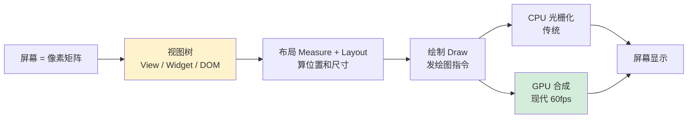
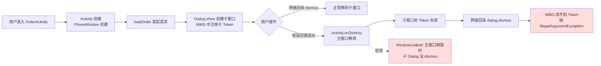
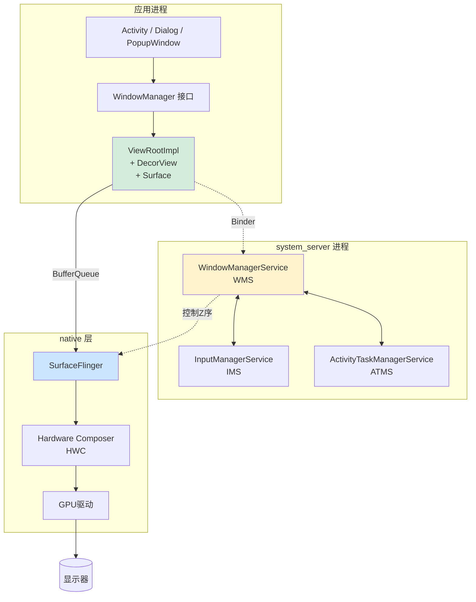

# 40.窗口核心设计思想

🎯 **核心矛盾**：**像素矩阵的同质 vs UI 元素的层次** —— 窗口系统用"树"把二维平面切成可交互的区域

🧭 **设计灵魂**：所有 GUI 框架都是**视图树 + 布局算法 + 绘制管线**三件套——唯一的区别在"渲染怎么合成"（CPU 画 vs GPU 合成）

🌐 **跨语言覆盖**：Android(View / ViewGroup / Surface) · iOS(UIView / CALayer / Core Animation) · Web(DOM / CSS 盒模型 / 合成层) · Flutter(Widget / Element / RenderObject 三棵树) · Qt(QWidget / QPainter)

🔗 **延伸阅读**：→ [41.消息机制设计思想](./43.消息机制设计思想) · → [42.手势事件设计灵魂](./42.手势事件设计灵魂.md) · ← [35.数据拷贝设计原理](./35.数据拷贝设计原理.md)



---

#### 目录介绍
- [00.窗口泄漏崩溃事故](#00窗口泄漏崩溃事故)
  - [0.1 凌晨上线的崩溃日志](#01-凌晨上线的崩溃日志)
  - [0.2 三个反直觉的现象](#02-三个反直觉的现象)
  - [0.3 用窗口系统视角拆解](#03-用窗口系统视角拆解)
  - [0.4 这次事故揭示了什么](#04-这次事故揭示了什么)
  - [0.5 五个层层递进的追问](#05-五个层层递进的追问)
- [01.概述与背景](#01概述与背景)
  - [1.1 窗口的由来与背景](#11-窗口的由来与背景)
  - [1.2 为何需要窗口](#12-为何需要窗口)
  - [1.3 主要解决问题](#13-主要解决问题)
  - [1.4 设计目标](#14-设计目标)
  - [1.5 设计哲学思想](#15-设计哲学思想)
- [02.不同平台窗口机制](#02不同平台窗口机制)
  - [2.1 Android窗口机制](#21-android窗口机制)
  - [2.2 iOS窗口机制](#22-ios窗口机制)
  - [2.3 Web窗口机制](#23-web窗口机制)
  - [2.4 平台对比分析](#24-平台对比分析)
  - [2.5 通用抽象提炼](#25-通用抽象提炼)
- [03.窗口架构设计](#03窗口架构设计)
  - [3.1 整体架构图](#31-整体架构图)
  - [3.2 分层架构设计思想](#32-分层架构设计思想)
  - [3.3 核心组件协作](#33-核心组件协作)
  - [3.4 窗口与显示系统的关系](#34-窗口与显示系统的关系)
- [04.窗口类型设计](#04窗口类型设计)
  - [4.1 为什么要区分窗口类型](#41-为什么要区分窗口类型)
  - [4.2 应用窗口](#42-应用窗口)
  - [4.3 子窗口](#43-子窗口)
  - [4.4 系统窗口](#44-系统窗口)
  - [4.5 窗口类型与Z序设计](#45-窗口类型与z序设计)
  - [4.6 类型设计的权衡](#46-类型设计的权衡)
- [05.窗口属性设计](#05窗口属性设计)
  - [5.1 窗口属性全貌](#51-窗口属性全貌)
  - [5.2 布局属性设计](#52-布局属性设计)
  - [5.3 标志位设计思想](#53-标志位设计思想)
  - [5.4 透明度与动画属性](#54-透明度与动画属性)
  - [5.5 属性继承与覆盖](#55-属性继承与覆盖)
- [06.窗口管理器设计](#06窗口管理器设计)
  - [6.1 为什么需要窗口管理器](#61-为什么需要窗口管理器)
  - [6.2 窗口管理器核心职责](#62-窗口管理器核心职责)
  - [6.3 窗口的增删改查](#63-窗口的增删改查)
  - [6.4 焦点与输入事件分发](#64-焦点与输入事件分发)
  - [6.5 窗口动画与过渡](#65-窗口动画与过渡)
  - [6.6 多窗口与分屏设计](#66-多窗口与分屏设计)
- [07.窗口与View的关系](#07窗口与view的关系)
  - [7.1 窗口是View的容器](#71-窗口是view的容器)
  - [7.2 ViewRootImpl桥接设计](#72-viewrootimpl桥接设计)
  - [7.3 DecorView的职责](#73-decorview的职责)
  - [7.4 Surface与Canvas的关系](#74-surface与canvas的关系)
- [08.窗口加载View机制](#08窗口加载view机制)
  - [8.1 从setContentView说起](#81-从setcontentview说起)
  - [8.2 布局加载全流程](#82-布局加载全流程)
  - [8.3 测量布局绘制三部曲](#83-测量布局绘制三部曲)
  - [8.4 窗口首帧渲染设计](#84-窗口首帧渲染设计)
  - [8.5 懒加载与按需渲染](#85-懒加载与按需渲染)
- [09.窗口生命周期设计](#09窗口生命周期设计)
  - [9.1 窗口的创建与销毁](#91-窗口的创建与销毁)
  - [9.2 窗口可见性管理](#92-窗口可见性管理)
  - [9.3 窗口状态机设计](#93-窗口状态机设计)
  - [9.4 窗口泄漏与防护](#94-窗口泄漏与防护)
- [10.设计思想总结与演进](#10设计思想总结与演进)
  - [10.1 核心设计模式提炼](#101-核心设计模式提炼)
  - [10.2 窗口设计的哲学本质](#102-窗口设计的哲学本质)
  - [10.3 从窗口看GUI架构演进](#103-从窗口看gui架构演进)
  - [10.4 跨领域思想迁移](#104-跨领域思想迁移)
- [11.经典陷阱与生产级反模式](#11经典陷阱与生产级反模式)
  - [11.1 陷阱一：AppContext创建业务窗口](#111-陷阱一appcontext创建业务窗口)
  - [11.2 陷阱二：父窗口销毁后dismiss子窗口](#112-陷阱二：父窗口销毁后dismiss子窗口)
  - [11.3 陷阱三：滥用APPLICATION_OVERLAY](#113-陷阱三：滥用application_overlay)
  - [11.4 陷阱四：onCreate中获窗口尺寸](#114-陷阱四：oncreate中获窗口尺寸)
  - [11.5 陷阱五：依赖设备Z序表现](#115-陷阱五：依赖设备z序表现)
  - [11.6 陷阱六：输入法弹起遮挡输入框](#116-陷阱六：输入法弹起遮挡输入框)
  - [11.7 陷阱七：SurfaceView销毁后lockCanvas](#117-陷阱七：surfaceview销毁后lockcanvas)
- [12.一句话总结：窗口设计的认知阶梯](#12一句话总结：窗口设计的认知阶梯)
  - [12.1 三层认知](#121-三层认知)
  - [12.2 设计哲学一句话](#122-设计哲学一句话)
  - [12.3 与本卷其它章节的呼应](#123-与本卷其它章节的呼应)
  - [12.4 延伸阅读](#124-延伸阅读)


## 00.窗口泄漏崩溃事故

### 0.1 凌晨上线的崩溃日志

2022 年某次大版本上线，监控平台凌晨告警：线上 ANR 暴涨 **150%**，集中在一个看似简单的页面——网络请求完成后弹一个进度对话框。

查日志，最频繁的崩溃栈是：

```
android.view.WindowLeaked: Activity com.app.OrderActivity has leaked window
    DecorView@a3b5c7e[OrderActivity] that was originally added here
    at android.view.ViewRootImpl.<init>(ViewRootImpl.java:559)
    at android.view.WindowManagerGlobal.addView(WindowManagerGlobal.java:331)
    at android.app.Dialog.show(Dialog.java:342)
    at com.app.OrderActivity.showProgress(OrderActivity.java:128)
```

**业务代码极简**：

```java
void loadOrder() {
    ProgressDialog dialog = new ProgressDialog(this);
    dialog.show();
    
    api.fetchOrder(orderId, new Callback() {
        @Override
        public void onSuccess(Order order) {
            dialog.dismiss();      // ① 业务正常时关闭
            renderOrder(order);
        }
        @Override
        public void onError(Exception e) {
            dialog.dismiss();      // ② 业务异常时关闭
            showError(e);
        }
    });
}
```

看起来"两条路径都关闭了 dialog"，**为什么还会泄漏？** 

### 0.2 三个反直觉的现象

复现这次崩溃需要满足三个条件，每一个都是工程师容易忽视的窗口系统暗角：

```
现象 1：用户在请求过程中按返回键退出页面
   → Activity.onDestroy() 已调用
   → 但 Dialog 还在「等」网络回调
   → onSuccess/onError 才执行 dismiss
   → 此时 Activity 已死，窗口找不到宿主 → 泄漏

现象 2：dismiss 抛 IllegalArgumentException
   "View not attached to window manager"
   → 因为 Activity 销毁时窗口已被框架强制移除
   → 再 dismiss 等于「双重移除」

现象 3：日志说"originally added here"
   → 框架记录了窗口添加的堆栈
   → 但泄漏检测是 Activity.onDestroy 后做的
   → 中间间隔几秒甚至几分钟
   → 真正的崩溃栈和泄漏堆栈对不上，难以排查
```

### 0.3 用窗口系统视角拆解

这次事故的根因图谱：



关键洞察：**Dialog 不是普通的 View——它是窗口（WMS 中独立注册）**。普通 View 跟随 Activity 销毁自动消失，但 Dialog 是子窗口，需要显式 dismiss 才会从 WMS 中移除。如果 Activity 先于 Dialog 销毁，子窗口就成了"无主之物"。

### 0.4 这次事故揭示了什么

工程师对窗口的直觉建立在 **"Dialog = 一种特殊的 View"** 的朴素心智模型上：

```
我以为：
  Dialog 像 TextView 一样
  Activity 销毁时它会自动跟着销毁

实际：
  Dialog 是「子窗口」
  在系统服务进程的 WMS 中独立登记
  绑定一个 Token（窗口身份令牌）
  生命周期需要显式管理
  Activity 销毁不会级联销毁子窗口
```

**这个错位，本质上是"View 概念"和"窗口概念"的混淆**：

| 视角 | 你以为的 | 实际是 |
|---|---|---|
| 进程位置 | 应用进程内的 UI 元素 | WMS 中独立注册的窗口 |
| 生命周期 | 跟随父容器销毁 | 需要显式 dismiss |
| 渲染机制 | 共享父 Surface | 拥有独立 Surface |
| 输入事件 | 父 View 分发 | WMS 直接路由 |

这就是本篇要回答的核心矛盾：

> **窗口（Window）和视图（View）是两个不同维度的概念。窗口管理在系统服务进程，视图渲染在应用进程，两者通过 ViewRootImpl 桥接。理解这个分层，才能避免 90% 的窗口相关 bug。**

### 0.5 五个层层递进的追问

带着这次事故，整篇文章其实就是在回答下面五个递进的问题：

| 追问 | 答案章节 |
|---|---|
| 窗口为什么必须独立于 View 存在？历史动机是什么？ | §01 |
| Android/iOS/Web 三个平台的窗口实现差在哪里？ | §02 |
| 窗口的层级、属性、管理器是怎么协同工作的？ | §03~§06 |
| 窗口和 View 的边界在哪里？为什么 Dialog 是窗口而不是 View？ | §07~§08 |
| 窗口的生命周期为什么会泄漏？怎么从架构上根治？ | §09 |

带着这次事故的"具体感"，进入正题——你将看到，**所有抽象的"窗口管理"原理，最终都能落到这次窗口泄漏事故的根因图上**。

---

## 01.概述与背景

### 1.1 窗口的由来与背景

"窗口"是图形用户界面（GUI）中最古老也最核心的抽象概念之一。要理解窗口为什么重要，我们可以从一个生活场景开始。

**生活类比：办公桌上的文件夹**。想象你的办公桌上摆着好几个文件夹。每个文件夹里装着不同项目的资料——一个是财务报表，一个是设计稿，一个是会议纪要。你可以把某个文件夹放在最上面（获得焦点），翻阅其中的内容（操作View控件），也可以把它暂时移到一边（最小化），或者打开一个新的文件夹盖在上面（新窗口覆盖）。

这就是窗口的本质——**屏幕上一块独立的、可管理的矩形区域，承载着特定的内容和交互**。

窗口的概念最早出现在1970年代的Xerox PARC实验室，后来被Apple的Macintosh和Microsoft的Windows系统发扬光大。"Windows"这个操作系统的名字本身就说明了窗口在GUI中的核心地位。

在现代移动和Web开发中，窗口的概念无处不在：

- **Android**：每个Activity对应一个窗口（PhoneWindow），Dialog是一个子窗口，状态栏和导航栏是系统窗口，Toast是一个特殊的系统窗口
- **iOS**：每个应用至少有一个UIWindow，Alert弹窗、键盘都是独立的窗口
- **Web**：浏览器的每个标签页是一个窗口（BrowsingContext），iframe是子窗口，`window.open()`可以创建新窗口

虽然三个平台的实现差异很大，但它们面对的是同一个核心问题：**如何在有限的屏幕空间上，管理多个独立的内容区域，并协调它们之间的层级、焦点和交互？**

### 1.2 不为人知的窗口史

```
1973 年   Xerox Alto：第一台带 GUI 的电脑
          重叠窗口（Overlapping Windows）首次出现
          但每次切换窗口要重绘整个画面
          
1981 年   Xerox Star：商用化但失败（昂贵 + 慢）
          奠定了"桌面比喻"（Desktop Metaphor）
          
1984 年   Apple Macintosh：消费级 GUI 的开端
          单进程窗口管理，所有窗口共享一个屏幕缓冲区
          切换窗口闪烁严重
          
1985 年   Windows 1.0：磁贴式窗口（不允许重叠！）
          因为 Apple 起诉过 Xerox 重叠窗口的专利
          
1990 年   X Window System v11：跨进程窗口管理
          Client-Server 架构（应用是 Client，窗口管理器是 Server）
          → 现代 WMS 设计的祖先
          
2003 年   Mac OS X Quartz Compositor：第一个 GPU 合成的窗口系统
          每个窗口独立 Surface，GPU 合成
          → 移动时代窗口系统的范本
          
2008 年   Android 1.0：基于 SurfaceFlinger 的合成模型
2010 年   iOS 4：Core Animation 全面 GPU 合成
2018 年   Android Q：开始支持自由窗口（Desktop Mode）
```

这条时间线告诉我们：**窗口系统的演进史，就是"硬件能力"和"用户体验"的螺旋**。每次硬件进步（更快的 CPU/GPU、更大的内存），就允许更复杂的窗口管理（重叠→透明→GPU 合成→多任务分屏）。

### 1.2 为何需要窗口

在没有窗口系统的年代（命令行时代），整个屏幕只有一个"画面"——程序直接在屏幕缓冲区上绘制内容。这种方式的问题很明显：

1. **无法多任务**：一个程序占据整个屏幕，要切换到另一个程序只能退出当前程序
2. **无法分层**：弹出一个对话框后，如果要恢复底下的内容，需要重新绘制整个屏幕
3. **无法隔离**：一个程序的绘制错误可能破坏另一个程序的显示内容

窗口系统的出现，就是为了解决这三个问题。它在"应用"和"屏幕"之间引入了一个**中间层**——窗口。每个应用不再直接操作屏幕，而是在自己的窗口内绘制内容。窗口系统（Window Manager）负责将所有窗口合成为最终的屏幕画面。

**类比**：如果把屏幕比作一块白板，没有窗口系统时，所有人都在同一块白板上写字（混乱不堪）。有了窗口系统，每个人各自有一块透明玻璃板（窗口），白板的管理员（窗口管理器）负责将这些玻璃板按顺序叠放，组合成最终的画面。

反向论证：DOS 时代真实经历过的痛

```
场景：1995 年用 DOS 写代码
   编辑器：Borland Turbo C
   编译器：tcc
   
   写完代码 → 退出 Turbo C → 命令行 tcc 编译
   编译报错 → 抄下错误行号 → 重新进 Turbo C → 跳到该行修改
   再退出 → 再编译 → 再进 → ...
   
   你不能同时看到"代码"和"编译错误"
   因为屏幕只有一个，不能切分
```

90 年代后期 IDE 把这个流程整合到一个进程里——但操作系统级的多窗口才是根本解：**窗口让屏幕从"一块整地"变成"可分割的房间"，每个房间各做各的事互不干扰**。

### 1.3 主要解决问题

窗口系统从诞生到今天，核心解决的是以下五个问题：

**问题一：内容隔离**。不同的功能模块需要在独立的区域内绘制，互不干扰。Activity的内容不应该被Dialog的绘制破坏，状态栏的更新不应该影响应用界面。窗口为每个内容区域提供了独立的"画布"，实现了绘制层面的隔离。

**问题二：层级管理**。屏幕上同时存在多个窗口时，哪个在上面哪个在下面？弹出一个Dialog时它应该盖在Activity上面；显示Toast时它应该在所有应用窗口之上。窗口系统通过**Z序（Z-order）**来管理层级关系。

**问题三：输入路由**。当用户点击屏幕时，这个触摸事件应该交给哪个窗口处理？窗口系统需要根据窗口的位置、层级和属性来精确路由输入事件。

**问题四：生命周期协调**。窗口不是一成不变的——它会被创建、显示、隐藏、移动、调整大小、销毁。这些状态变化需要一个统一的机制来协调。

**问题五：资源管理**。每个窗口都需要占用系统资源（Surface缓冲区、GPU纹理等）。窗口系统需要在性能和资源占用之间取得平衡。

### 1.5 警醒的资源数字

```
单个 1080p 全屏窗口的 Surface 内存：
   1920 × 1080 × 4 字节（RGBA） = 8.3 MB（单缓冲）
   双缓冲：16.6 MB
   三缓冲：24.9 MB（Android 默认）
   
一个普通 Activity 通常涉及：
   1 个主窗口 Surface（24.9 MB）
   N 个 SurfaceView（视频/相机各一个）
   M 个 Dialog 子窗口（短暂存在）
   
如果 5 个应用都在后台保留窗口：
   5 × 24.9 = 124.5 MB GPU 内存
   → 中低端机直接 OOM
```

这就是为什么 Android 引入了"应用切到后台时回收 Surface"的机制——**资源稀缺迫使系统必须做"窗口可见性的精细化管理"**。

### 1.4 窗口设计目标

| 目标 | 描述 | 实现方式 | 设计思想 |
|------|------|----------|----------|
| **内容隔离** | 不同窗口的绘制互不干扰 | 独立Surface/Canvas | 沙箱隔离思想 |
| **层级有序** | 窗口之间有明确的覆盖关系 | Z序+窗口类型分层 | 优先级调度思想 |
| **输入精确** | 触摸/键盘事件正确路由 | 焦点管理+HitTest | 事件驱动思想 |
| **高性能** | 窗口操作不卡顿 | 硬件加速+合成渲染 | 异步化+批量化 |
| **可扩展** | 支持新的窗口类型 | 类型分层+属性可配 | 开闭原则 |
| **安全性** | 防止恶意窗口欺骗用户 | 权限校验+类型限制 | 最小权限原则 |

### 1.5 设计哲学思想

窗口系统的设计体现了多个深刻的哲学思想，这些思想不仅指导了窗口系统的设计，也是理解所有GUI架构的钥匙。

**哲学一：分层——让复杂度可管理**

窗口系统最核心的设计哲学就是**分层**。从上到下：应用层（开发者操作View）→ 窗口层（Activity管理窗口）→ 合成层（SurfaceFlinger合成画面）→ 显示层（Display HAL输出到屏幕）。每一层只关心自己的职责，上层不需要知道下层的实现细节。

**哲学二：容器——给内容一个"家"**

窗口本质上是一个**容器（Container）**。它不关心里面装什么内容，它只负责提供一个独立的、有边界的区域，管理这个区域的位置、大小、可见性和输入事件。这种"容器与内容分离"的设计思想在软件工程中随处可见：Docker容器不关心里面运行什么应用、HTML的`<div>`不关心里面放什么元素。**好的容器设计，是对内容的"无知"——知道得越少，通用性越强。**

**哲学三：合成——将局部组合为整体**

屏幕上最终呈现的画面，不是由某个单一程序绘制的，而是由多个窗口的内容**合成（Compositing）**而成的。每个窗口独立绘制自己的内容，然后由合成器按层级叠放。当一个窗口的内容变化时，只需要重新绘制那个窗口，然后重新合成一次，不需要重绘所有窗口。这是窗口系统高性能的基础。

**哲学四：间接——应用不直接操作屏幕**

应用永远不直接操作屏幕像素。应用在自己的Surface上绘制内容，然后由窗口管理器决定何时、在哪里、以什么方式将这些内容呈现到屏幕上。这种**间接性**带来了极大的灵活性：窗口管理器可以对窗口进行缩放、移动、旋转、甚至三维变换，而应用完全不需要感知这些变化。

**哲学五：信任分级——不是所有窗口都平等**

窗口系统将窗口分为不同的类型，每种类型有不同的权限。普通应用只能创建应用窗口和子窗口，系统窗口需要特殊权限。这体现了**最小权限原则**——每个组件只获得完成其任务所必需的最小权限。


## 02.各平台窗口机制

理解窗口的设计思想，最好的方式是对比不同平台的实现。Android、iOS、Web三大平台面对同一个问题，但走了不同的技术路线。

### 2.1 Android窗口机制

Android的窗口系统是三个平台中最"显式"、最复杂的设计。它把窗口系统的每个环节都暴露为独立的组件，职责分明但关系复杂。

**核心组件**：

| 组件 | 职责 | 设计角色 |
|------|------|----------|
| **Window** | 窗口的抽象基类，定义窗口的通用行为 | 抽象接口 |
| **PhoneWindow** | Window的唯一实现，管理DecorView和窗口属性 | 具体实现 |
| **DecorView** | 窗口的根View，包含标题栏和内容区域 | 容器 |
| **WindowManager** | 应用侧的窗口操作接口 | 门面 |
| **WindowManagerService** | 系统侧的窗口管理核心服务 | 管理器 |
| **ViewRootImpl** | 连接View树和WMS的桥梁 | 桥接器 |
| **Surface** | 窗口的绘制缓冲区 | 画布 |
| **SurfaceFlinger** | 将多个Surface合成为最终画面 | 合成器 |

**Android设计思想的深层分析**：

Android窗口系统最显著的设计特点是**跨进程架构**。窗口的管理逻辑（WMS）运行在系统服务进程中，窗口的绘制逻辑运行在应用进程中，两者通过Binder IPC通信。

为什么要把窗口管理放在独立的系统进程中？这是一个**安全性与公平性**的设计决策：应用不能直接操作其他应用的窗口（安全隔离）；WMS作为"裁判"统一决定层级和焦点（全局仲裁）；WMS可以统一管理Surface的分配和回收（资源管控）。

另一个值得关注的设计是Android选择在Java层和Native层都有窗口管理逻辑。Java层的PhoneWindow负责窗口的逻辑管理（属性设置、DecorView创建），Native层的SurfaceFlinger负责高效的合成渲染。这种"逻辑与性能分离"的设计思想，让上层开发者不需要理解GPU合成就能使用窗口。

一段最容易被忽视的真相：你 new Dialog() 时 WMS 还不知道它

```java
Dialog dialog = new Dialog(this);   // ① 只创建了 Java 对象
                                    //    PhoneWindow 构造出来了
                                    //    但 WMS 还不知道有这个窗口的存在

dialog.setContentView(R.layout.x); // ② View 树创建出来了
                                    //    但还没有 Surface
                                    //    WMS 还是不知道

dialog.show();                      // ③ 这一步才真正 addView
                                    //    进行 Binder 调用到 WMS
                                    //    WMS 分配 Token、计算 Z 序、准备 Surface
                                    //    → 窗口才"实际存在"
```

这就是为什么 Android 面试中经常问"Dialog 什么时候创建 Surface" ——答案是**在 show() 中 Binder 进入 WMS 后**，而不是 new 的时候。理解这个点，才能理解为什么 §0 的泄漏会发生：**Token 是东西临时身份证**，Activity 销毁后 Token 失效，但 Java 对象还在，dismiss 时中 Binder 发现 Token 不认识。

### 2.2 iOS窗口机制

与Android不同，iOS的窗口系统采用了更**简洁、隐式**的设计。大多数开发者甚至不需要直接操作窗口——UIKit框架帮你隐藏了几乎所有窗口管理的细节。

**iOS窗口的关键特性**：

- **UIWindow继承自UIView**：窗口本身就是一个View。这意味着窗口可以享受View的所有能力（动画、变换、响应链），而不需要单独实现。
- **Scene机制（iOS 13+）**：引入UIWindowScene后，一个应用可以有多个独立的"场景"，每个场景有自己的窗口集合。这是为了支持iPad的多窗口。
- **自动焦点管理**：iOS自动将最上面的visible窗口设为keyWindow，开发者通常不需要手动管理。

**iOS设计思想的深层分析**：

iOS体现了**约定优于配置**的设计哲学。大多数应用只需要一个UIWindow，开发者只需要关注ViewController和View的管理。

UIWindow继承自UIView的设计意味着：统一的渲染管线（窗口和View使用同一套Core Animation）、统一的事件处理（窗口参与响应链）、统一的动画系统（窗口可以直接使用UIView动画API）。这种"万物皆View"的统一设计极大地简化了开发者的心智负担。

探索：为什么 iOS 没有"WindowLeaked"问题

```objc
// iOS 代码示例
UIAlertController *alert = [UIAlertController ...];
[self presentViewController:alert animated:YES completion:nil];

// 用户退出页面时：
self 被 pop 出栈
   → self 的 retain count 变为 0
   → self 的 dealloc 被调用
   → self 持有的 alert 引用被释放
   → alert 的 retain count 变为 0
   → alert 被销毁
   → alert 的 view、UIWindow 都被锁定锁定释放
```

**关键区别**：iOS 的 UIWindow 生命周期由 ARC 引用计数控制，而 Android 的窗口生命周期由 WMS 远程控制。

```
iOS：retain 计数 = 0 → 自动销毁→ 不会泄漏
Android：Java 引用不存在 ≠ WMS 里的 Token 也被清除
          → Java 对象被 GC 了，WMS 还以为窗口存在
          → 出现不一致 → 泄漏错误
```

这就是为什么 Google 不断调整 Android 的 Lifecycle、LiveData、ViewModel ——都是在"打补丁"，让 Java 对象生命周期与窗口生命周期一致。

### 2.3 Web窗口机制

Web的"窗口"概念是三个平台中最特殊的——浏览器从一开始就有window对象，但它的含义与原生平台大不相同。

**Web窗口的层次结构**：

| 层次 | 概念 | 对应Android | 对应iOS |
|------|------|-------------|---------|
| 浏览器窗口 | 整个浏览器应用 | — | — |
| 标签页 | BrowsingContext | Task/Activity栈 | UIScene |
| window对象 | JavaScript全局上下文 | PhoneWindow | UIWindow |
| document | DOM根 | DecorView | rootView |
| iframe | 嵌入的子文档 | 子窗口 | 子UIWindow |

**Web设计思想的深层分析**：

Web窗口系统最独特的设计是**沙箱隔离**。每个标签页、每个iframe都运行在独立的安全上下文中。一个恶意网页无法访问另一个标签页的DOM。

Web还引入了**CSS层叠上下文（Stacking Context）**。与Android/iOS通过窗口类型定义Z序不同，Web通过CSS属性（z-index、transform、opacity等）动态创建层叠上下文。这种设计更灵活但也更复杂。

**探索：z-index 为什么经常"无效"**

```html
<div class="a" style="z-index: 999">我应该在最上面</div>
<div class="b" style="z-index: 1">但我在上面了</div>
```

如果两者 position 都是 static（默认），z-index 完全失效。这是剩下所有 Web 开发者踩过的坑。

**根因：**z-index 只在"创建层叠上下文"的元素上生效。创建层叠上下文的条件有 20+ 种，主要包括：

```
position: relative/absolute/fixed/sticky + z-index 非 auto
opacity < 1
transform 非 none
filter 非 none
mix-blend-mode 非 normal
will-change
isolation: isolate
```

这里有一个**设计哲学**同于 Android 的窗口类型范围：**不同「层叠上下文」内的 z-index 不可比**。父元素创建了层叠上下文后，子元素的 z-index 就只能在这个小上下文内排序——跳不出去。

这与 Android 的 type 值分段是同一个思想：**高优先级类别内部可以排序，但不能跨越类别边界**。

**与 Android type 分段的本质一致性**

| Android | Web |
|---|---|
| type 值分段（1-99/1000-1999/2000-2999） | 层叠上下文嵌套 |
| 应用窗口无法超越系统窗口 | 子元素 z-index 无法超越父层叠上下文 |
| Z 序 = type×十亿 + 创建时间 | 最终 Z 序 = 层叠路径乘积 |

### 2.4 平台对比分析

| 维度 | Android | iOS | Web |
|------|---------|-----|-----|
| **窗口基类** | Window（抽象类） | UIWindow（继承UIView） | window（全局对象） |
| **管理方式** | 跨进程WMS集中管理 | 应用内自管理 | 浏览器引擎管理 |
| **层级控制** | type值分区+Z序排序 | windowLevel属性 | z-index+层叠上下文 |
| **隔离粒度** | 进程级（应用间） | 进程级（应用间） | 进程级（标签页间） |
| **复杂度** | 高（显式管理） | 低（隐式管理） | 中（CSS层叠规则） |
| **多窗口支持** | 原生支持（分屏/悬浮窗） | iOS 13+ Scene | 天然支持（标签页） |

### 2.5 通用抽象提炼

尽管三个平台的实现差异很大，我们可以提炼出窗口系统的**五个通用要素**：

1. **窗口对象（Window）**：一个矩形区域的抽象，拥有位置、大小、可见性、层级等属性，内部承载View/DOM等内容元素
2. **窗口管理器（Window Manager）**：负责窗口的增删改查、层级排序和焦点管理，是窗口之间关系的仲裁者
3. **渲染表面（Surface/Layer）**：窗口的"画布"，一块独立的内存缓冲区
4. **合成器（Compositor）**：将多个窗口的渲染表面合成为最终的屏幕画面
5. **输入路由器（Input Router）**：将用户的触摸/键盘等输入事件路由到正确的窗口

这五个要素的思想无处不在：Photoshop的图层系统、视频编辑软件的轨道叠放、甚至地图应用中地图层+标注层+UI层的分层渲染，都是同一个"分层+合成"模式的不同表现形式。

### 2.6 一句话窗口本质

**"窗口"不是一种 UI 控件，是「安全单元 + 渲染单元 + 事件单元」三者的合体。**

三个平台的差异只在「三者怎么绑定」：

- Android：三者明确拆开，有专门的 Token、Surface、InputChannel 
- iOS：三者与 UIView 合为一体（UIWindow extends UIView） 
- Web：三者隐藏在 BrowsingContext + Layer + Event Target 里

## 03.窗口架构设计

### 3.1 整体架构图

以Android为主视角，窗口系统的整体架构可以分为四个层次：应用层（Activity/Dialog）→ 框架层（WindowManager/ViewRootImpl）→ 服务层（WMS）→ 渲染层（SurfaceFlinger）。

应用层通过WindowManager接口向框架层提交窗口操作请求；框架层中的ViewRootImpl通过Binder与WMS通信；WMS管理所有窗口的状态后，由渲染层的SurfaceFlinger完成最终的合成输出。



### 3.2 为什么架构这么复杂？

这里有一个坚硬的理由：**跨进程交互、跨 CPU/GPU 交互、跨 Java/Native 交互** 这三个边界是不可避免的：

```
跨进程：WMS 必须在 system_server 中，不能放在应用中
           → 应用崩溃不能拖垮整个窗口系统
           → 一个应用不能看/改另一个应用的窗口

跨 CPU/GPU：Surface 是 CPU 写、GPU 读的共享内存
             → 需要 BufferQueue 这种生产者-消费者同步机制
             → 需要 fence 机制同步 GPU 渲染与合成

跨 Java/Native：Surface 交由 Native 的 SurfaceFlinger 合成
               → Java 层只能通过 JNI 接触底层能力
               → "学不会"的看似复杂，本质是跨语言边界
```

因此看起来"嵌套多层"的架构，实际上是「三道边界」的必然产物。你可以合并架构中同一边界内的层，但不能跨边界合并。

### 3.3 分层架构设计思想

**第一层：应用层——面向开发者的"门面"**

开发者调用`setContentView(R.layout.xxx)`一行代码，背后的窗口创建、DecorView初始化、Surface申请、WMS注册等复杂操作全部被隐藏。这是**门面模式（Facade Pattern）**的经典应用。

**第二层：框架层——连接应用和系统的"桥梁"**

核心类是`ViewRootImpl`。它向上接管View树的测量/布局/绘制流程，向下通过Binder与WMS通信。这体现了**桥接模式（Bridge Pattern）**——将视图的抽象和窗口的实现解耦。

**第三层：服务层——全局的"调度中心"**

WMS运行在系统服务进程中，是整个窗口系统的"大脑"。它维护着所有窗口的状态信息，负责决定每个窗口的层级、位置和可见性。这是**集中式管理**的设计——窗口管理天然需要全局视野。

**第四层：渲染层——将像素送到屏幕的"最后一公里"**

SurfaceFlinger接收所有窗口的Surface缓冲区，通过Hardware Composer或GPU合成为一帧画面。这一层的设计思想是**双缓冲/三缓冲+垂直同步（VSync）**，保证画面不撕裂。

### 3.4 核心组件协作

窗口从创建到显示的核心流程：应用调用addView→ViewRootImpl向WMS注册窗口→WMS分配WindowState并计算Z序→ViewRootImpl执行measure/layout/draw→Surface提交给SurfaceFlinger合成→输出到屏幕。

这个流程体现了三个关键设计特点：

1. **异步流水线**：窗口的"注册"和"渲染"是分开的，注册完成后窗口有了"身份"但还没有内容
2. **Surface的延迟创建**：Surface不是在窗口创建时立即分配的，而是在第一次需要渲染时才创建——**懒初始化**避免了浪费内存
3. **单向数据流**：内容的流动方向是 应用→Surface→SurfaceFlinger→屏幕，没有反向流动

### 3.5 窗口与显示系统的关系

窗口在显示系统中的核心角色是**独立渲染单元**。每个窗口拥有自己的渲染表面（Surface），可以独立地进行内容绘制。

**类比：电影的后期制作**。每个演员在绿幕前单独拍摄（窗口在自己的Surface上绘制），后期团队将素材按图层顺序叠放（合成器按Z序合成），某些图层做透明度混合，最终合成完整画面。

这种**增量更新**设计是高性能渲染的基础——当一个窗口的内容变化时，只需重绘那个窗口的Surface然后重新合成，其他窗口的Surface直接复用上一帧内容。


## 04.窗口类型设计

### 4.1 为何区分窗口类型

一个自然的问题：既然都是"屏幕上的矩形区域"，为什么要把窗口分成不同的类型？

答案在于**安全性和可管理性**。试想一个没有类型区分的窗口系统：任何应用都可以创建一个覆盖全屏的、置顶的窗口。恶意应用可以伪造锁屏界面骗取密码。窗口类型本质上是一种**访问控制机制**——通过将窗口划分为不同类型，对每种类型赋予不同的权限和层级范围。

**类比**：这就像一栋办公楼的楼层分配——1-10楼是普通办公区（应用窗口），11-15楼是楼内服务区（子窗口），16-20楼是大楼管理层（系统窗口）。普通员工不能随便跑到管理层。

### 4.2 应用窗口

应用窗口（Application Window）是最常见的窗口类型，对应用户看到的每一个"页面"。Android中type值范围为1-99。

```java
public static final int FIRST_APPLICATION_WINDOW = 1;
public static final int TYPE_BASE_APPLICATION   = 1;  // 应用基础窗口
public static final int TYPE_APPLICATION        = 2;  // 普通Activity窗口
public static final int TYPE_APPLICATION_STARTING = 3;  // 启动预览窗口
public static final int LAST_APPLICATION_WINDOW  = 99;
```

应用窗口的核心设计原则是**一对一绑定**——一个Activity对应一个窗口，一个窗口对应一个Surface。Activity创建时窗口创建，Activity销毁时窗口销毁。

`TYPE_APPLICATION_STARTING`（启动窗口）的设计尤其有趣。当用户点击App图标时，系统先显示一个带有主题色的空白窗口，让用户感觉应用"立即响应"了。这是一种**感知优化**——实际上应用还没准备好，但用户的感受是"打开了"。**感知速度比实际速度更重要。**

#### 为什么 Activity 打不开时你看到的是"闪中闪"

```
场景：点应用图标中间闪一下白色，然后才出页面

原因：
   1. 点击 → ActivityManager 准备启动 Activity
   2. 这时应用进程还没启动 → 根本没代码跑
   3. WMS 上身：给你创建一个 TYPE_APPLICATION_STARTING 窗口
      背景 = Theme 里的 windowBackground
   4. 默认 windowBackground 是 白色 → 闪白顶
   5. 应用进程启动，Activity onCreate 才被执行
   6. 正式的 Activity 窗口准备好后，Starting 窗口被替换

解决：
   方案 1：设置 windowBackground 为应用主调色
          → 闪中间是主调色，脚眼程度陆低
   方案 2：<item name="android:windowIsTranslucent">true</item>
          → 启动窗口透明，看起来从上一个页面直接跳过来
          → 但这会损失一个动画帧
   方案 3：在 windowBackground 里设计有品牌识别度的 splash
          → 这才是 Material Design 推荐的做法
```

这个看起来"小问题"背后是**启动体验设计**的哲学：根本问题不是应用启动慢，是"启动期间用户看什么"。Splash 屏、骨架屏、Activity 转场动画都是同一个思想的实体化。

### 4.3 子窗口

子窗口（Sub Window）依附于某个父窗口存在，不能独立显示。Android中type值范围为1000-1999。典型场景：PopupWindow、ContextMenu。

```java
public static final int FIRST_SUB_WINDOW         = 1000;
public static final int TYPE_APPLICATION_PANEL    = 1000;  // 面板窗口
public static final int TYPE_APPLICATION_MEDIA    = 1001;  // 媒体窗口
public static final int TYPE_APPLICATION_ATTACHED_DIALOG = 1003; // 附属Dialog
public static final int LAST_SUB_WINDOW          = 1999;
```

子窗口的核心设计原则是**依附性（Dependency）**：层级依附（Z序始终在父窗口之上）、生命周期依附（父窗口销毁时子窗口自动销毁）、位置依附（位置相对于父窗口计算）。

这种"父子关系"的设计思想非常普遍——DOM元素的父子关系、进程的父子关系都体现了同样的依附性：**子级的生存依赖于父级，父级的销毁级联到子级**。

#### 子窗口与子 View 在代码上的表象差异

```java
// 子 View 怎么写
FrameLayout parent = findViewById(R.id.parent);
Button child = new Button(this);
parent.addView(child);    // 同一 Surface、共享 parent 的布局

// 子窗口怎么写
WindowManager wm = getWindowManager();
View popupView = ...;
WindowManager.LayoutParams lp = new WindowManager.LayoutParams();
lp.type = WindowManager.LayoutParams.TYPE_APPLICATION_PANEL;
lp.token = parentWindow.getDecorView().getWindowToken();   // 依附主窗口
wm.addView(popupView, lp); // 独立 Surface、独立输入通道
```

两个写法看似都是"加个东西上去"，但后者多了五个东西：**独立 Token + 独立 Surface + 独立 InputChannel + 独立 Z 序 + WMS Binder 调用**。这五个东西加起来反过来代价是必须面对生命周期管理。这就是为什么§0 事故中你忘了 dismiss 会泄漏，但你忘了 setVisibility(GONE) 不会泄漏。

### 4.4 系统窗口

系统窗口（System Window）权限最高、层级最高。Android中type值范围为2000-2999。典型场景：StatusBar、Toast、InputMethod。

```java
public static final int FIRST_SYSTEM_WINDOW  = 2000;
public static final int TYPE_STATUS_BAR      = 2000;  // 状态栏
public static final int TYPE_TOAST           = 2005;  // Toast提示
public static final int TYPE_INPUT_METHOD    = 2011;  // 输入法窗口
public static final int TYPE_APPLICATION_OVERLAY = 2038; // 应用悬浮窗
public static final int LAST_SYSTEM_WINDOW   = 2999;
```

系统窗口体现了**特权隔离**的安全设计思想。创建系统窗口需要声明特殊权限（`SYSTEM_ALERT_WINDOW`），从Android 6.0开始还需要用户手动授权。

**输入法窗口**的设计特别有趣——它必须在应用窗口之上（否则被遮挡），又必须"知道"应用窗口的布局（以便推动输入框不被键盘遮挡）。Android通过`softInputMode`来协调这个矛盾。

#### 从一个常见需求倒推设计：为什么 Toast 不能被点击

```
Toast 的设计要求：
   - 在所有应用之上（包括锁屏）考虑上面
   - 但用户点击应该"穿透"到下面的应用
   - 不能抢走焦点

设计选择：
   1. type = TYPE_TOAST           → 保证高于应用窗口
   2. flags |= FLAG_NOT_FOCUSABLE → 不抢焦点
   3. flags |= FLAG_NOT_TOUCHABLE → 点击事件穿透
   4. flags |= FLAG_KEEP_SCREEN_ON= 0  → 不防止屏幕休眠
```

Toast 看似是个「小控件」，但他身上集中了 type + 三个 flag 的组合设计才能达到这个效果。这就是为什么 Android 11 后限制了自定义 Toast 的 view——为了防止恶意应用老使这几个 flag 做钉鱼。

### 4.5 窗口类型与Z序设计

三种窗口类型的type值范围构成了**分段式Z序系统**：

```
Z序（由低到高）：
┌─────────────────────────────────────┐
│  系统窗口层 (2000-2999)               │  ← 最顶层
│  StatusBar、Toast、InputMethod       │
├─────────────────────────────────────┤
│  子窗口层 (1000-1999)                 │  ← 中间层
│  PopupWindow、ContextMenu           │
├─────────────────────────────────────┤
│  应用窗口层 (1-99)                    │  ← 最底层
│  Activity、Dialog                    │
└─────────────────────────────────────┘
```

这种分段设计的精妙之处：**类型即优先级**（不需要手动设置层级）、**同类型内可排序**（通过创建时间/焦点状态排序）、**安全边界**（应用窗口无论怎么设置都无法超越系统窗口）。

### 4.6 类型设计的权衡

**灵活性 vs 安全性**：type值的分段限制了灵活性，但保证了安全性。Android选择了安全优先。

**简单性 vs 表达力**：三种类型简单易懂，但有时不够精细。Android通过不断增加新的type常量来扩展表达力。

**隐式约定 vs 显式控制**：Android要求显式指定窗口类型（增加复杂度但可预测），iOS则更隐式（系统自动决定窗口层级）。


## 05.窗口属性设计

### 5.1 窗口属性全貌

窗口属性（Window Attributes）控制窗口行为和外观。在Android中，这些属性被封装在`WindowManager.LayoutParams`中。属性设计体现了**参数对象模式**——把几十个参数封装到一个对象中，实现可扩展性、默认值和可传递性。

### 5.2 布局属性设计

窗口的布局属性决定了位置和大小。`width/height`字段同时承载精确像素值和语义值（-1=MATCH_PARENT，-2=WRAP_CONTENT），这种"多义复用"避免了额外的类型字段。

**gravity的位运算设计**：gravity使用位标志（Bit Flags）来组合对齐方式。`Gravity.TOP | Gravity.LEFT`表示左上角对齐。这种设计在系统编程中非常常见——Linux文件权限、TCP标志位都采用同样的设计。核心优势：**一个整数字段同时表达多个独立的布尔属性，且组合操作极其高效**。

### 5.3 标志位设计思想

窗口的行为标志（flags）决定了触摸行为、显示行为、安全行为：

```java
public static final int FLAG_NOT_FOCUSABLE   = 0x00000008;  // 不接收焦点
public static final int FLAG_NOT_TOUCHABLE   = 0x00000010;  // 不接收触摸
public static final int FLAG_NOT_TOUCH_MODAL = 0x00000020;  // 触摸穿透
public static final int FLAG_FULLSCREEN      = 0x00000400;  // 全屏显示
public static final int FLAG_KEEP_SCREEN_ON  = 0x00000080;  // 保持屏幕常亮
public static final int FLAG_SECURE          = 0x00002000;  // 禁止截屏
```

标志位体现了**组合优于继承**的原则。如果为每种行为组合创建子类，子类数量会爆炸式增长。通过标志位组合，一个通用Window类+不同flags组合，可以表达2^N种行为。

**FLAG_NOT_TOUCH_MODAL**值得单独讨论。设置后，窗口只处理自己区域内的触摸，区域外的事件"穿透"到下面的窗口。在弹窗场景中至关重要——用户点击PopupWindow外部区域可以触发关闭，同时底部窗口也能正常响应。

#### 从源码看为什么 Modal 这个名字

```java
// PhoneWindowManager.java
if ((flags & FLAG_NOT_TOUCH_MODAL) == 0) {
    // 不设该 flag 时：
    // 这个窗口会"吸走"所有区域内外的触摸事件
    // 类似于 Web 中的 modal dialog——不点中不能操作背后
    consumeAllTouchOutsideOfWindow();
}
// 设了 flag 后：超出区域的触摸会背后中返还给 WMS 重新路由到下一层窗口
```

三种常见组合场景：

```
场景 1：普通 Dialog
   不设 FLAG_NOT_TOUCH_MODAL、不设 FLAG_NOT_TOUCHABLE
   → 点中 Dialog 可点击、点外部被 Dialog 听走但默认关闭 Dialog

场景 2：默认 PopupWindow 不能点外部关闭
   设 FLAG_NOT_TOUCH_MODAL
   → 区域外点击穿透到 Activity，Activity 照常响应
   → 要点外部关闭的需要 setOutsideTouchable(true)

场景 3：被恶意利用的「点击劫持」
   TYPE_APPLICATION_OVERLAY + FLAG_NOT_TOUCHABLE 透明窗口
   → 用户看起来点的是下面的现金但实际点的是遮罩中的「同意」按钮
   → Android 12 为此推出 hide_overlay_windows API，金融应用可隐藏这类覆盖窗口
```

**一个位的 flag 汇集了安全、交互、存取三重考量**——这才是为什么 Android 勒出几十个 flag 而不是几个子类。

### 5.4 透明度与动画属性

`alpha`控制窗口自身透明度，`dimAmount`控制窗口背后其他窗口的暗度。两者的设计意图完全不同：alpha让窗口"半透明"，dimAmount让背景"变暗"突出前景。

这体现了**视觉层次**的设计思想——通过透明度和暗度的配合，引导用户注意力到最重要的窗口上。与摄影中的"景深"概念类似：主体清晰（前景窗口），背景模糊（背景变暗）。

### 5.5 属性继承与覆盖

窗口属性遵循**就近覆盖、逐级继承**的原则：系统默认值 → Theme主题值 → Window属性值 → View属性值。这种分层覆盖在CSS的"层叠"机制中也有对应——**提供合理的默认值，允许逐级覆盖**。

## 06.窗口管理器设计

### 6.1 为什么需要窗口管理器

想象没有窗口管理器的世界：每个应用自己决定窗口位置和层级，结果会是多个应用抢占同一块屏幕区域、触摸事件被错误截获。窗口管理器就像一个**交通警察**，统一管理布局、指挥事件分发、维持层级秩序。

### 6.2 窗口管理器核心职责

WMS的核心职责包括：窗口生命周期管理（addWindow/removeWindow）、层级管理（Z序计算）、焦点管理、布局计算、输入路由、动画管理、策略执行（屏幕旋转/分屏/锁屏）。

WMS的职责设计体现了**中介者模式**——所有窗口不直接通信，而是通过WMS协调。当新窗口加入时，WMS重新计算所有窗口的层级和布局。这种集中式设计保证了**全局一致性**。

### 6.3 窗口的增删改查

**添加窗口**的第一步是权限检查，体现了**安全优先**的设计。然后进行Token验证——WindowToken是窗口身份的"令牌"，防止"冒充"其他应用创建窗口。

**移除窗口**不是简单的删除，而是有序的清理：播放退出动画→从Z序列表移除→释放Surface→重新计算布局→更新焦点→通知InputManager。这体现了**优雅降级**的设计思想。

#### addWindow 中的 Token 验证为什么是「安全原子」

```java
// WindowManagerService.addWindow() 核心片段
int addWindow(Session session, IWindow client, LayoutParams attrs, ...) {
    // ① 检查权限
    int res = mPolicy.checkAddPermission(attrs, callingUid);
    if (res != ADD_OKAY) return res;
    
    // ② Token 验证
    WindowToken token = mWindowMap.windowForClientLocked(...);
    if (token == null) {
        // 应用窗口必须事先在 Activity 创建时注册 Token
        // 子窗口必须使用父窗口的 Token
        // 系统窗口使用 SYSTEM_TOKEN（这需要上一步的权限验证通过）
        return ADD_BAD_TOKEN;
    }
    
    // ③ 为该窗口创建 WindowState
    WindowState win = new WindowState(this, session, client, token, ...);
    
    // ④ 分配 Surface
    win.attach();
    
    // ⑤ 插入到与同 type 同位置的窗口列表
    addWindowToListInOrderLocked(win);
    
    // ⑥ 请求重新布局
    mWindowPlacerLocked.performSurfacePlacement();
    
    return ADD_OKAY;
}
```

这五个步骤中任何一步失败，都会返回错误码。§0 事故中"Token 不存在"的错误就是事后调 dismiss 时步骤 ② 失败。

#### removeWindow 的「丰里」清理顺序

```
removeWindow(WindowState win) {
  if (win.mAnimatingExit) return;          // 正在动画中返回
  win.mAnimatingExit = true;
  prepareWindowToDisplayDuringRelayout();   // 1. 启动退出动画
  scheduleAnimationLocked();
  // 动画结束后回调：
  finishExit() {
    mWindows.remove(win);                   // 2. 从Z序列表移除
    win.destroySurface();                   // 3. 释放原生 Surface
    inputDispatcher.unregisterChannel();    // 4. 取消输入路由
    requestUpdateInputWindows();            // 5. 刷新输入状态机
    relayoutAllWindows();                   // 6. 重算布局（后面的窗口可能变大）
    moveFocus();                            // 7. 调整焦点
  }
}
```

**这个顺序不能乱一个字**：动画未完成就释放 Surface→画面裂变；布局未重算就调整焦点→事件发错位置。**WMS 中 80% 的 ANR 来自这个顺序被打乱**。

### 6.4 焦点与输入事件分发

焦点窗口决定了键盘事件发送给谁。确定规则：从Z序最高的可聚焦窗口开始检查，跳过设置了FLAG_NOT_FOCUSABLE的窗口，找到第一个满足条件的窗口。

触摸事件分发更复杂，需要**自顶向下的命中测试（Hit Test）**：从Z序最高的窗口开始，检查窗口是否可见、触摸点是否在区域内、是否设置了FLAG_NOT_TOUCHABLE。找到第一个满足条件的窗口后分发事件。

#### 事件分发的三个层次，理清才敢谈 onTouch

多数人讨论 Android 事件分发只谈 ViewGroup.dispatchTouchEvent，但这只是第三层。完整的事件传递是：

```
物理触摸 → /dev/input/event*  (Linux 内核)
           ↓
      EventHub 读取 (system_server 进程)
           ↓
      InputReader 解析 → 产生 MotionEvent
           ↓
      InputDispatcher 路由
           ↓
      【Hit Test】 找到事件应该去哪个窗口   ←— 层 1：WMS 跨窗口路由
           ↓
      通过对应窗口的 InputChannel 发送事件到应用进程
           ↓
      ViewRootImpl.WindowInputEventReceiver
           ↓
      ViewRootImpl.processInputEvents
           ↓
      【DecorView.dispatchTouchEvent】                    ←— 层 2：从窗口进入 View 世界
           ↓
      【ViewGroup.dispatchTouchEvent 递归下发】        ←— 层 3：View 树内部分发
           ↓
      取决于 onInterceptTouchEvent + onTouchEvent、OnTouchListener、OnClickListener
```

完整三层后你才会理解为什么面试里"事件分发"的问题总要问起 Activity——因为他在问你到底是在层 1、层 2 还是层 3 看问题。

#### 为什么 Hit Test 要"自顶向下"

倒过来想：如果从下往上检查，会发生什么？

```
场景：正在看送餐软件，底部存在一个中心点「点菜」按钮
顶部弹出一个覆盖全屏的微信收资信息提示

错误设计（从下往上检查）：
   1. 底部点菜按钮在区域内 → 路由给 Activity
   2. Activity 出现了点菜付款页面
   3. 用户实际看到的是微信提示 → 点击的是看不见的东西
   4. 被金融安全机构判定为「点击劫持」漏洞

正确设计（从上往下检查）：
   1. 顶部微信提示窗口覆盖了点击位置 → 优先路由
   2. 提示窗口响应事件
   3. 用户看到什么 = 点中什么
```

**"从上往下检查"不是技术选择，是安全要求**。如果逆过来，恶意应用可以透明兑金按钮遮面隐藏点击。Android 项中为此设计了`FLAG_WINDOW_IS_OBSCURED` 与 §10 提到的 hide_overlay_windows API。

### 6.5 窗口动画与过渡

窗口级别的动画操作的是整个Surface而不是单个View，即使窗口内有几百个View，动画也只需要对一个Surface做变换，性能极高。这就是为什么Activity转场动画总是流畅，而复杂View动画可能卡顿——**操作的粒度不同**。

### 6.6 多窗口与分屏设计

多窗口面临三个挑战：尺寸不确定性（应用必须适应任意尺寸）、焦点共存（Android的设计是"只有一个焦点窗口"）、资源竞争（系统需要合理分配GPU资源）。多窗口体现了窗口系统从**独占式**向**共享式**的演进，与操作系统从单任务→多任务→多用户的发展方向一致。


## 07.窗口与View的关系

### 7.1 窗口是View的容器

很多开发者把窗口和View混为一谈，但它们的定位完全不同：**窗口**是系统级概念（在WMS中注册、有Surface、参与层级排序），**View**是应用级概念（在应用进程内部存在，通过measure/layout/draw渲染到Surface上）。

两者的关系是：**窗口为View提供了一块可以绘制的"画布"（Surface），以及与系统交互的"通道"（输入事件、配置变化等）**。

**类比**：窗口是**画框**，View是画框里的**画作**。画框决定展示位置和大小，但画作的内容与画框无关。

#### 一张表彻底厘清

| 维度 | 窗口（Window） | View |
|---|---|---|
| 进程位置 | WMS（system_server）有记账 | 应用进程内 |
| 标识 | Token（IBinder） | int id |
| 数量级 | 一个 Activity 几个~十几个 | 一个 Activity 几百~上千 |
| 拥有 Surface | 是（每个独立） | 否（共享父窗口的） |
| 接收输入事件 | InputChannel 直连 | 父窗口分发下来 |
| 测量绘制 | 触发 ViewRootImpl.performTraversals | View.onMeasure/onLayout/onDraw |
| Z 序参与方 | 是（type + 时间） | 否（仅在父窗口内 elevation） |
| 创建成本 | 高（涉及 Binder + GraphicBuffer） | 低（仅 Java 对象） |

**错误直觉"Dialog 是 View"的危险**：你不会为 TextView 手动调用 dismiss，你会以为 Dialog 也如此——**§0 事故的根因。**

#### 从 Surface 数量判断"是不是窗口"

```bash
# adb 在设备上查看当前窗口数
adb shell dumpsys SurfaceFlinger | grep -c "^Display 0"

# 典型输出：
Window{... StatusBar}            # 系统窗口
Window{... NavigationBar}        # 系统窗口
Window{... ImeContainer}         # 输入法窗口
Window{... com.app.MainActivity} # 主窗口
Window{... PopupWindow:abc}      # 子窗口
→ 五个窗口，五个 Surface，五条 InputChannel
```

不会出现在这个清单里的就不是窗口。Button、TextView、ImageView 都不在这里——**这是判断一个结构是不是窗口的实验方法**。

### 7.2 ViewRootImpl桥接设计

ViewRootImpl是连接View世界和窗口世界的"桥梁"，具有双重身份：对View来说它是View树的"管家"（发起measure/layout/draw、分发输入事件），对WMS来说它是窗口在应用侧的"代理"（通过Binder通信、管理Surface）。

ViewRootImpl体现了**桥接模式**的精髓——将抽象（View层级的渲染逻辑）和实现（窗口系统的通信协议）解耦，使它们可以独立变化。如果未来改变渲染方式或WMS通信协议，只需修改ViewRootImpl对应部分。

#### 看一眼它的成员，就明白为什么它是桥接器

```java
public final class ViewRootImpl ... {
    // ① 面向 View 世界
    final View mView;                       // DecorView
    final ViewVisibilityChecker mViewVisibilityChecker;
    boolean mLayoutRequested;
    
    // ② 面向窗口世界
    final IWindowSession mWindowSession;    // 连接 WMS 的 Binder
    final IWindow.Stub mWindow;             // WMS 回调本进程的接口
    final WindowManager.LayoutParams mWindowAttributes;
    final Surface mSurface = new Surface();
    
    // ③ 面向输入事件世界
    InputChannel mInputChannel;             // WMS 直接推送输入事件
    WindowInputEventReceiver mInputEventReceiver;
    
    // ④ 面向渲染世界
    ThreadedRenderer mAttachInfo.mThreadedRenderer;  // 硬件加速渲染器
    Choreographer mChoreographer;           // 帧调度
}
```

四个世界在 ViewRootImpl 里汇合，**这是 Android UI 框架中唯一同时持有 IBinder + Surface + InputChannel + Renderer 的实体**。它不是设计者的随意选择，而是"主线程上唯一同时能看见这四件物件的位置"——**职责身份合并是架构上的必然**。

#### performTraversals 为什么是"众多问题的集散地"

ViewRootImpl.performTraversals 是 Android UI 性能问题的中心：

```
performTraversals():
  1. relayoutWindow()           → 向 WMS 请求调整窗口大小 / 获取 Surface
  2. performMeasure()           → 递归 measure View 树
  3. performLayout()            → 递归 layout View 树
  4. performDraw()              → 递归 draw 生成周未提交代码
  5. surface.unlockCanvasAndPost() → 提交给 SurfaceFlinger
```

任何一步卡 1ms 都会从帧中减少 16.6ms 预算。这就是为什么 Systrace 你总是看到这个函数在。

### 7.3 DecorView的职责

DecorView是窗口的根View，结构为：DecorView → LinearLayout → [TitleBar, FrameLayout(id:content) → 开发者布局]。

**为什么需要DecorView？**这体现了**模板模式**——提供标题栏+内容区域的标准结构，不同Theme选择不同模板，开发者只需关心内容区域。同时也是**装饰器模式**——在开发者布局外面包裹了一层系统 UI 元素。

#### 不同 Theme 下 DecorView 结构的差异

```
Theme.Light                       → R.layout.screen_simple
  LinearLayout (vertical)
    ├ FrameLayout (TitleBar)         (顶部标题栏)
    └ FrameLayout (content)          (你的布局)

Theme.NoActionBar                 → R.layout.screen_simple_overlay_action_mode
  FrameLayout
    └ FrameLayout (content)          (仅内容区域)

Theme.Dialog                      → R.layout.screen_title_dialog
  LinearLayout (vertical)
    ├ TextView (Title)              (弹窗标题)
    └ FrameLayout (content)

Theme.Fullscreen                  → R.layout.screen_simple
  但设置 FLAG_FULLSCREEN 仅为全屏加嵌点到 SystemBar
```

你调 setContentView() 谁 最后被裹在中间这个 id=content 的 FrameLayout 里，**这是 Activity 与 DecorView 绑定的唯一接口**。在这个接口以上都是系统的东西，以下都是你的东西。

#### DecorView 为什么不是纯粹的 FrameLayout

看 DecorView 的源码能发现他另外负责了窗口级的事务：

```java
public class DecorView extends FrameLayout {
    @Override
    protected void onAttachedToWindow() {
        super.onAttachedToWindow();
        // 窗口附加时，处理状态栏颜色、隐藏身份、选择高亮、Caption 栏以及 DragShadow……
    }

    @Override
    public boolean dispatchKeyEvent(KeyEvent event) {
        // 特别处理 返回键、菜单键等后退给上层 
    }
    
    @Override
    public WindowInsets dispatchApplyWindowInsets(WindowInsets insets) {
        // 状态栏 / 导航栏 / 划论拼接的 inset 调配
    }
}
```

这是为什么你不能"用 FrameLayout 代替 DecorView"——后者是「窗口与 View 边界处的身份证」，负责许多「仅顶层 View 才能看到的事」（WindowInsets / Caption / DragEvent / 状态栏颜色推送）。
### 7.4 Surface与Canvas的关系

Surface是窗口的"物理画布"，内部维护BufferQueue（2-3个GraphicBuffer）实现**生产者-消费者**模型：应用dequeueBuffer获取空闲缓冲区→在上面绘制→queueBuffer提交→SurfaceFlinger读取合成。

Canvas封装了绘制API（drawRect、drawText等），把绘制命令转换为底层图形库（Skia/OpenGL/Vulkan）的调用。这种Surface→Canvas→绘制命令→图形库→GPU的层层封装，又是分层抽象思想的体现。

#### 双缓冲越过"画面撝裂"的原理

如果只有一块缓冲区会怎么样？

```
应用正在写第N帧上半部分
   同时 SurfaceFlinger 读走 了下半部分 去合成
→ 屏幕上上半是第N帧、下半是第N-1帧 → 画面撝裂 (Tearing)
```

双缓冲解决后，反过来会有"卡顿"：

```
App 帧N写完 → swap 交给 SF
App 开始写帧N+1 → 但 swap 以后上一块 buffer 又被 SF 拿走了
App 拿不到空闲 buffer → 阻塞等待 → 卡顿
```

三缓冲是为了缓解这个问题：App / 合成中 / 当前在屏三份可以同时进行，让 App 不需要等待。

```
Android 4.1 之前：双缓冲 → 画面不撝裂但经常卡
Android 4.1+：   三缓冲 + VSync + Choreographer 三件套
               → 「Butter 项目」，这是"黄油变黄"谜下的原因
```

#### 为什么重绘不需要重新申请 Surface

```
误区：每帧绘制都从 WMS 重新申请一个 Surface
实际：Surface 只在创建 / 尺寸变化时才调 WMS
         每帧绘制：只是从 BufferQueue 调 dequeue/queue
         这些都是应用进程内部的共享内存操作
         不过 Binder，性能极高
```

这是为什么"在 onDraw 里调 invalidate"不会拖垮性能——这里面的开销完全是进程内、并且依赖 GPU 加速。


## 08.窗口加载View机制

### 8.1 从setContentView说起

`setContentView(R.layout.activity_main)`这一行代码触发了完整链路：Activity→PhoneWindow.setContentView()→installDecor()创建DecorView→根据Theme选择模板→LayoutInflater.inflate()解析XML→反射创建View对象→递归inflate子View→添加到ContentView。

这个链路体现了**延迟初始化**的设计思想：DecorView在第一次setContentView时才创建、Surface要到第一次绘制时才分配、View的measure/layout等到下一个VSync信号才触发。**能晚做的事情尽量晚做**，让每一步只做必要的事。

### 8.2 布局加载全流程

LayoutInflater的工作：获取XML解析器→解析根标签创建根View→递归解析子标签创建子View→添加到parent。

**Factory拦截机制**是一个精妙的设计——允许在View创建之前进行拦截。这是**拦截器模式**的应用：AppCompatActivity利用它将`<Button>`自动替换为`AppCompatButton`；换肤框架在View创建时替换资源。这让框架可以在不修改应用代码的前提下改变View的创建行为。

### 8.3 测量布局绘制三部曲

View从XML到屏幕像素经历**measure（大小）→ layout（位置）→ draw（内容）**三个阶段，由ViewRootImpl在VSync信号到来后依次触发。

**为什么分三个阶段？**这是**阶段分离**的思想：可以跳过不需要的阶段（透明度变了只需重绘不需重新measure/layout）；每个阶段可以独立优化（比如layout缓存、draw硬件加速）；调试时可以定位问题出在哪个阶段。

### 8.4 窗口首帧渲染设计

窗口首帧渲染是用户感知应用启动速度的关键：

```
Activity.onCreate() → setContentView() → 构建View树
Activity.onResume() → WindowManager.addView() → 创建ViewRootImpl
ViewRootImpl.requestLayout() → 等待VSync → performTraversals()
performMeasure → performLayout → performDraw → Surface提交
SurfaceFlinger合成 → 第一帧画面显示
```

Android引入了**启动窗口（Starting Window）**来优化首帧感知：在应用进程启动前，系统先显示一个带有Theme背景色的窗口。等应用真正绘制完成后，启动窗口被替换。用户看到的是"立即响应+内容逐渐加载"的体验，而不是"点击后长时间空白"。

#### 启动类型与窗口的对应关系

并不是所有启动都走「启动窗口」：

| 启动类型 | 场景 | 启动窗口 | 耗时 |
|---|---|---|---|
| **冷启动** | 应用进程不存在 | 是（最需要） | 800ms–2s |
| **温启动** | 进程在但 Activity 被销毁 | 是 | 300–800ms |
| **热启动** | Activity 仍在后台 | 否（直接恢复） | <100ms |

冷启动的 800ms-2s 中，应用进程创建 + Application.onCreate 占据超过一半。这就是为什么你的 Application.onCreate 中不能做耗时初始化——会被启动窗口掩盖但不会加速启动。

#### 原生骨架屏与启动窗口的本质一致

```
你以为：骨架屏是 Web 发明的东西
实际：Android 启动窗口 = 骨架屏的原生版本
         两者都是：「在真内容加载前，先给个『类似』的占位圈」
         都是「用一个低成本的预览换取了"永远不可能为 0"的初始化时间」
```

在同一个设计思想下，Web 的 React Suspense、Flutter 的 FutureBuilder、iOS 的 LaunchScreen 都是同一个东西的变体。**本质是代明"启动体验"不能裂裂零零留给最后的应用，而是需要跨越应用边界进行调度**。

### 8.5 懒加载与按需渲染

窗口系统的渲染优化大量使用了**懒加载**思想：

- **ViewStub**：一个零大小的View，在需要时才inflate真正的布局。适合"可能不需要显示"的复杂布局（如错误页面、空状态页面）
- **RecyclerView**：只渲染屏幕可见区域的Item，滚动时复用已离屏的ViewHolder
- **Fragment懒加载**：ViewPager中不可见的Fragment延迟加载数据

这些设计的核心思想是：**不要做用户看不到的工作**。在有限的16ms渲染周期内，只处理屏幕上可见的内容。


## 09.窗口生命周期设计

### 9.1 窗口的创建与销毁

窗口的生命周期与宿主（Activity/Dialog）的生命周期紧密绑定：

```
Activity.onCreate() → PhoneWindow创建（但还没有Surface）
Activity.onResume() → WindowManager.addView() → 向WMS注册 → 分配Surface
Activity.onPause() → 窗口失去焦点
Activity.onStop() → 窗口不可见（Surface可能被回收）
Activity.onDestroy() → WindowManager.removeView() → 从WMS注销 → 释放Surface
```

这种绑定设计体现了**RAII（Resource Acquisition Is Initialization）**的思想：资源（窗口/Surface）的获取和释放与对象（Activity）的生命周期绑定，确保不会出现"Activity已销毁但窗口还在"的资源泄漏。

### 9.2 窗口可见性管理

窗口的可见性不是简单的"可见/不可见"，而是一个**多级状态**：

| 状态 | 含义 | Surface | CPU渲染 |
|------|------|---------|---------|
| **前台可见** | 窗口完全可见且有焦点 | 已分配，活跃 | 全速渲染 |
| **可见无焦点** | 窗口可见但不是焦点（被半透明Dialog覆盖） | 已分配 | 正常渲染 |
| **部分可见** | 窗口被部分遮挡 | 已分配 | 可能降帧 |
| **不可见** | 窗口完全被覆盖 | 可能被回收 | 停止渲染 |
| **已销毁** | 窗口不再存在 | 已释放 | — |

这种分级设计让系统可以根据窗口的可见程度合理分配资源——**越不可见的窗口获得越少的资源**，这是资源管理中"按需分配"思想的体现。

### 9.3 窗口状态机设计

窗口的状态变化可以建模为一个**有限状态机（FSM）**：

```
 [未创建] --addWindow()--> [已创建/不可见]
 [已创建/不可见] --setVisible()--> [可见]
 [可见] --获得焦点--> [可见+有焦点]
 [可见+有焦点] --失去焦点--> [可见]
 [可见] --被完全覆盖--> [已创建/不可见]
 [已创建/不可见] --removeWindow()--> [已销毁]
```

状态机设计的好处是**行为可预测**——在任何一个状态下，对任何一个事件的响应都是确定的。这使得窗口系统的行为可以被严格测试和验证。

### 9.4 窗口泄漏与防护

窗口泄漏是Android开发中常见的问题。当Activity已经销毁但窗口还没有被移除时，就会发生泄漏。**§0 事故就是这个问题的现场**。

**常见泄漏场景**：Activity销毁前没有dismiss的Dialog、Activity销毁后还在显示的Toast、后台线程持有窗口引用导致Activity无法GC。

#### 泄漏检测是怎么运作的

看ActivityThread在onDestroy后的代码：

```java
// android.app.ActivityThread.handleDestroyActivity
final void handleDestroyActivity(...) {
    // ... 调用 onDestroy ...
    
    WindowManager wm = activity.getWindowManager();
    View decorView = activity.mDecor;
    
    if (mWindowManager != null) {
        ((WindowManagerImpl) wm).closeAll(
            null,
            activity.getClass().getName(),
            "Activity"        // 这里会扫描与 Activity 关联的所有窗口
        );
    }
}

// WindowManagerImpl.closeAll→WindowManagerGlobal.closeAll
void closeAll(IBinder token, String who, String what) {
    for (int i = 0; i < mViews.size(); ++i) {
        ViewRootImpl root = mRoots.get(i);
        if (root.mAttachInfo.mToken == token) {
            // 发现一个应该被父销毁的窗口还在！
            try {
                removeViewLocked(i, false);
            } catch (...) { }
            
            // 输出警告
            Log.e(TAG, what + " " + who + " has leaked window " + ...);
        }
    }
}
```

**这里有个设计哲学：框架不会静静泄漏，会「德诋」开发者**。为什么？因为泄漏是反模式，框架需要让你看到 ——不只是警告，实际上还会调用 removeViewLocked 负责"掩盖"你的 bug，但留下日志跟踪。

**防护设计**：

1. **Activity.onDestroy()中自动清理**：Android框架在Activity销毁时会检查是否有未关闭的窗口，并输出"Activity has leaked window"的警告
2. **弱引用持有**：Dialog/PopupWindow应该通过弱引用持有Activity，当Activity被GC时自动释放
3. **Lifecycle感知**：现代Android开发中，利用Lifecycle组件让窗口自动响应宿主的生命周期变化

#### §0 事故的架构级修复

```kotlin
// 反面教材（§0 现场）
class OrderActivity : AppCompatActivity() {
    fun loadOrder() {
        val dialog = ProgressDialog(this)
        dialog.show()
        api.fetchOrder(orderId, callback)   // dialog 与 Activity 生命周期脱节
    }
}

// 正面教材 1：Lifecycle 感知
class OrderActivity : AppCompatActivity() {
    fun loadOrder() {
        val dialog = ProgressDialog(this)
        dialog.show()
        
        lifecycle.addObserver(object : DefaultLifecycleObserver {
            override fun onDestroy(owner: LifecycleOwner) {
                if (dialog.isShowing) dialog.dismiss()
            }
        })
        
        api.fetchOrder(orderId, callback)
    }
}

// 正面教材 2：用 Coroutines + viewModelScope 自动取消
class OrderViewModel : ViewModel() {
    fun loadOrder() = viewModelScope.launch {
        // ViewModel 销毁时 viewModelScope 自动取消
        // 网络请求也会被取消
        val order = repo.fetchOrder(orderId)
        _orderLiveData.value = order
    }
}

class OrderActivity : AppCompatActivity() {
    val viewModel: OrderViewModel by viewModels()
    fun loadOrder() {
        val dialog = ProgressDialog(this)
        dialog.show()
        viewModel.orderLiveData.observe(this) { order ->
            // observe 是 Lifecycle 感知的，Activity 销毁后不会回调
            dialog.dismiss()
            renderOrder(order)
        }
        viewModel.loadOrder()
    }
}
```

窗口泄漏的本质是**所有权问题**——谁拥有窗口？谁有权决定窗口何时销毁？好的设计应该让窗口的生命周期与其宿主保持一致，最现代的答案是"Lifecycle 感知 + Coroutines 作用域"。


## 10.设计思想总结与演进

### 10.1 核心设计模式提炼

| 设计模式 | 在窗口系统中的应用 | 通用价值 |
|----------|-------------------|----------|
| **门面模式** | Activity/PhoneWindow封装复杂的窗口操作 | 简化子系统的使用 |
| **桥接模式** | ViewRootImpl连接View和WMS | 解耦抽象和实现 |
| **中介者模式** | WMS协调所有窗口的关系 | 集中管理复杂交互 |
| **装饰器模式** | DecorView为开发者布局添加系统UI | 动态增加功能 |
| **模板模式** | DecorView根据Theme选择窗口模板 | 固定流程，可变步骤 |
| **拦截器模式** | LayoutInflater.Factory拦截View创建 | 非侵入式修改行为 |
| **生产者-消费者** | Surface的BufferQueue机制 | 解耦生产和消费速率 |
| **状态机模式** | 窗口的可见性/焦点状态管理 | 行为可预测、可验证 |

### 10.2 窗口设计的哲学本质

如果用一句话概括窗口系统的设计哲学：**用分层换简洁，用隔离换安全，用间接换灵活**。

**用分层换简洁**：四层架构让每一层的复杂度都是可控的。开发者只需要理解应用层，框架工程师理解框架层，系统工程师理解服务层和渲染层。

**用隔离换安全**：窗口之间的绘制隔离（独立Surface）、管理隔离（跨进程WMS）、权限隔离（窗口类型），共同构建了一个安全可靠的窗口系统。

**用间接换灵活**：应用不直接操作屏幕，而是通过窗口→Surface→SurfaceFlinger的间接路径。这种间接性让系统可以在应用无感知的情况下实现分屏、画中画、窗口动画等高级功能。

### 10.3 从窗口看GUI架构演进

窗口系统的演进方向可以概括为：

```
单窗口（命令行）→ 多窗口（桌面GUI）→ 全屏窗口（移动时代）→ 自适应窗口（折叠屏/多屏）
```

每一次演进都带来了新的设计挑战：多窗口要求层级管理和焦点管理，全屏窗口要求精细的生命周期管理，自适应窗口要求动态布局和资源管理。但核心的五个要素——窗口、管理器、渲染表面、合成器、输入路由——始终不变。

### 10.4 跨领域思想迁移

窗口系统的设计思想可以迁移到很多领域：

**1. 分层+合成思想 → 游戏引擎**。游戏引擎中的图层系统（背景层、角色层、UI层、特效层）和窗口系统的多窗口合成是同一种设计模式。

**2. Z序管理思想 → 网络协议优先级**。窗口的Z序管理和网络QoS（服务质量）中的优先级队列本质相同——都是在有限资源下决定"谁先被处理"。

**3. 容器思想 → 容器化部署**。窗口作为View的容器，与Docker作为应用的容器在设计哲学上惊人相似：隔离、可管理、可迁移、生命周期绑定。

**4. 事件路由思想 → 微服务网关**。窗口系统的输入事件路由（根据位置和层级将事件分发给正确的窗口）与API网关的请求路由（根据URL和规则将请求转发给正确的服务）在设计模式上一致。

**5. 启动窗口思想 → 骨架屏**。Android的启动窗口（Starting Window）让用户感觉应用"立即响应"，Web前端的骨架屏（Skeleton Screen）在数据加载前显示页面结构，两者都是"感知优化"的实践——**先给用户一个框架，再填充内容**。

---

**最后总结**：窗口看似只是"屏幕上的一个矩形区域"，但它背后蕴含着分层、隔离、合成、间接、信任分级等众多经典的设计思想。这些思想的价值远超窗口系统本身——它们是理解和设计所有图形界面系统的基础。当你下次遇到"多个内容区域需要共存"的问题时，不妨想想窗口系统的设计：**给每个内容一个独立的容器，用一个管理器统一调度，用一个合成器组合输出。**

---

## 11.经典陷阱与生产级反模式

回到 §0 的 Activity has leaked window 事故现场，类似的"看似稳但不稳"的窗口陷阱在工业界比想象中要多。下面是七个最常见的，每一个都对应过实际线上事故。

### 11.1 陷阱一：AppContext创建业务窗口

```java
// ❌ 必崩，BadTokenException
Dialog dialog = new Dialog(getApplicationContext());
dialog.show();
```

**为什么致命**：Application 的 Context 没有 Activity Token，创建出的窗口是"无主窗口"，WMS 拒绝添加。

**修复**：业务弹窗一定用 Activity Context；警告式悬浮窗要用 TYPE_APPLICATION_OVERLAY 类型 + Application Context（且要权限）。

```kotlin
// ✅ 正确做法
class MyActivity : AppCompatActivity() {
    fun showDialog() {
        // this 是 Activity，自动有 Token
        AlertDialog.Builder(this)
            .setMessage("...")
            .show()
    }
}
```

### 11.2 陷阱二：父窗口销毁后dismiss子窗口

```java
// ❌ §0 事故的核心代码
progressDialog.dismiss();   // 抛 IllegalArgumentException
                            // "View not attached to window manager"
```

**修复一：防御式 try-catch**（治标）：

```kotlin
fun safeDismiss(dialog: Dialog?) {
    dialog?.takeIf { it.isShowing }?.let {
        try { it.dismiss() } catch (e: Exception) { /* 忽略 */ }
    }
}
```

**修复二：Lifecycle 感知**（§9.4 推荐，治本）：

```kotlin
class OrderActivity : AppCompatActivity() {
    fun loadOrder() {
        val dialog = ProgressDialog(this).apply { show() }

        // 让 dialog 跟随 Activity 生命周期自动 dismiss
        lifecycle.addObserver(object : DefaultLifecycleObserver {
            override fun onDestroy(owner: LifecycleOwner) {
                if (dialog.isShowing) dialog.dismiss()
            }
        })

        api.fetchOrder(orderId, callback)
    }
}
```

**修复三：viewModelScope + Flow**（最现代）：

```kotlin
// Activity
val viewModel: OrderViewModel by viewModels()

override fun onCreate(savedInstanceState: Bundle?) {
    super.onCreate(savedInstanceState)
    val dialog = ProgressDialog(this).apply { show() }

    viewModel.orderFlow
        .flowWithLifecycle(lifecycle)
        .onEach { state ->
            when (state) {
                is Loaded -> { dialog.dismiss(); render(state.order) }
                is Failed -> { dialog.dismiss(); showError(state.error) }
            }
        }
        .launchIn(lifecycleScope)
}
```

### 11.3 陷阱三：滥用APPLICATION_OVERLAY

```java
// ❌ Android 12+ 被系统限流 / 随机隐藏
WindowManager.LayoutParams params = new WindowManager.LayoutParams(
    WindowManager.LayoutParams.TYPE_APPLICATION_OVERLAY);
params.flags = FLAG_NOT_FOCUSABLE | FLAG_NOT_TOUCHABLE;
// 在这上面记录所有点击位置（点击劫持）
```

**为什么被限**：这类悬浮窗可能遮挡其他应用、捕获点击、伪造系统 UI，近几年被恶意应用玩坏了。

**现代替代**：
- 消息提示用 Bubble API（Android 11+ 系统级气泡）
- 视频小窗用 Picture-in-Picture
- 跨应用唤起用 Notification + PendingIntent

### 11.4 陷阱四：onCreate中获窗口尺寸

```java
// ❌ 得到 0
@Override
protected void onCreate(Bundle savedInstanceState) {
    super.onCreate(savedInstanceState);
    setContentView(R.layout.activity_main);
    int width = getWindow().getDecorView().getWidth();   // 0
}
```

**原因**：onCreate 时 ViewRootImpl 尚未完成首次 measure，DecorView 还没真正附加到 WMS。

**修复**：等首帧。

```kotlin
// ✅ 等待第一次 layout 完成
view.doOnLayout {
    val width = it.width   // 这里才是真的
}

// ✅ 或者用 Choreographer 等下一帧
Choreographer.getInstance().postFrameCallback {
    val width = view.width
}

// ✅ Compose 中根本不用考虑这个，BoxWithConstraints 自动给你
@Composable
fun Screen() {
    BoxWithConstraints {
        val widthPx = constraints.maxWidth   // 永远是对的
    }
}
```

### 11.5 陷阱五：依赖设备Z序表现

```
现象：A 厂商手机上 Toast 在 Dialog 上面，B 厂商手机上 Toast 在 Dialog 下面。
原因：
   - 原生 Toast type=2005 (TYPE_TOAST)
   - Dialog type=2003 (TYPE_APPLICATION_ATTACHED_DIALOG)
   - 但某些定制系统将品牌 Toast 改成了别的 type 值
   - 不同厂商对 SystemUI 的层级也做了改造

修复：避免依赖跨厂商的层级假设
   1. 用 Snackbar 代替 Toast（应用窗口内部，层级稳定）
   2. 用 DialogFragment 代替 Dialog（生命周期与 Fragment 绑定）
   3. 真要悬浮提示用应用内的 BottomSheet 而不是系统 Toast
```

**核心心智模型**：**只有"在自己应用窗口内部"的层级是稳定的**，跨窗口层级永远是"系统厂商可调"的。

### 11.6 陷阱六：输入法弹起遮挡输入框

```
现象：点输入框，键盘弹出后输入框被遮住。

诊断方法：
   adb shell dumpsys input_method
   看 mLastImeTargetWindow 是不是当前 Activity

原因：Manifest 没设 windowSoftInputMode 或设为 stateUnchanged|adjustResize
      但 Activity 设了 fullscreen 主题
      → 系统全屏时 adjustResize 失效

修复：
   <activity ...
       android:windowSoftInputMode="adjustResize"
       android:theme="@style/AppTheme.NoFullscreen">

   或者 Android 11+ 用新的 WindowInsetsController API：
```

```kotlin
// Android 11+ 现代写法
ViewCompat.setOnApplyWindowInsetsListener(rootView) { v, insets ->
    val ime = insets.getInsets(WindowInsetsCompat.Type.ime())
    v.updatePadding(bottom = ime.bottom)
    insets
}
```

### 11.7 陷阱七：SurfaceView销毁后lockCanvas

```java
// ❌ 自定义 SurfaceView 渲染线程的常见崩溃
class GameRenderer extends Thread {
    @Override
    public void run() {
        while (running) {
            Canvas canvas = surfaceHolder.lockCanvas(null);
            // 此时 SurfaceView 可能已被 detach
            drawFrame(canvas);
            surfaceHolder.unlockCanvasAndPost(canvas);  // IllegalStateException
        }
    }
}
```

**修复**：监听 surfaceDestroyed 标识，每次 lock 前检查 isValid。

```kotlin
class GameRenderer(private val holder: SurfaceHolder) : Thread() {
    @Volatile var running = false

    override fun run() {
        while (running) {
            if (!holder.surface.isValid) {
                Thread.sleep(16)
                continue
            }
            val canvas = holder.lockCanvas() ?: continue
            try {
                drawFrame(canvas)
            } finally {
                if (holder.surface.isValid) {
                    try { holder.unlockCanvasAndPost(canvas) }
                    catch (e: IllegalStateException) { /* 已销毁 */ }
                }
            }
        }
    }
}

// SurfaceHolder.Callback 中：
override fun surfaceDestroyed(holder: SurfaceHolder) {
    renderer.running = false
    renderer.join()   // 等渲染线程退出，避免还有未完成 lock
}
```

---

## 12.一句话总结：窗口设计的认知阶梯

### 12.1 三层认知

| 阶段 | 思维方式 | 典型问题 |
|---|---|---|
| 初级 | "窗口 = 一个画面" | new Dialog 后忘记 dismiss、Z 序冲突 |
| 中级 | "窗口有独立的 Surface + Token" | 能正确选择窗口类型与 flag、理解 Activity vs Application Context |
| 高级 | **"窗口 = 安全单元 + 渲染单元 + 事件单元"** | 能从架构上设计多窗口交互、防御点击劫持、规划生命周期 |

### 12.2 设计哲学一句话

> **"窗口"不是屏幕上的一个区域，是「在屏幕资源上'圈地'的架构抽象」。**
>
> 每个窗口是一块被圈出来的「领土」，拥有独立的身份（Token）、独立的资源（Surface）、独立的事件通道（InputChannel）。WMS 是这些领土之间的「仲裁者」，决定谁能扣谁、谁能看谁、谁能获取点击。
>
> 理解了这个，你才能反错 Dialog 泄漏、点击劫持、Z 序冲突、跨应用交互这些「看似不相关」的问题为什么本质是同一个问题。

回到 §0 的事故：真正的修复不是"在 dismiss 外面包 try/catch"——而是**重构生命周期语义**：

```
旧路：Activity 手动持有 Dialog 引用
        → 记得 dismiss 就正常，忘了就泄漏
        → 人为面临一万个空间复杂度

新路：Lifecycle上下文作为 Owner
        → ViewModel + viewModelScope 取消能力
        → lifecycleScope 取消能力
        → Compose 的 LaunchedEffect
        → 从「人记住 dismiss」变为「生命周期自动传递」
```

**Bug 在架构设计层被消灭，而不是在调用层被修补**——这才是工业级窗口设计的真正姿态。

### 12.3 与本卷其它章节的呼应

```
09.对象和函数访问原理       ─→ ViewRootImpl 中 Surface 由 JNI 跨语言调用
33.内存回收机制设计         ─→ §0 事故中窗口泄漏会造成 Activity 无法 GC
34.多种引用技术设计         ─→ Dialog 持有 Activity 强引用 vs 弱引用的选择
35.数据拷贝设计原理         ─→ SurfaceFlinger 跨进程 BufferQueue 是零拷贝优化的典范
41.视图加载渲染设计         ─→ 本章是 41 章「叠加在窗口之上」的上门
42.手势事件设计灵魂         ─→ InputDispatcher → InputChannel → ViewRootImpl 是本章§6.4 详述
43.消息机制设计思想         ─→ Choreographer 与 VSync 依赖主线程 Looper
```

### 12.4 延伸阅读

- AOSP：`frameworks/base/services/core/java/com/android/server/wm/`（WMS 源码）
- AOSP：`frameworks/native/services/surfaceflinger/`（SurfaceFlinger 源码）
- 书：《深入理解 Android 内核设计思想》林学森
- 书：《iOS UIView 完全手册》（UIWindow 部分）
- W3C：HTML Living Standard - Browsing Contexts
- Chromium：`docs/design/rendering_pipeline.md`
- Flutter：engine/shell/platform 各平台窗口适配层
- 调试：`adb shell dumpsys window` / `dumpsys SurfaceFlinger`
