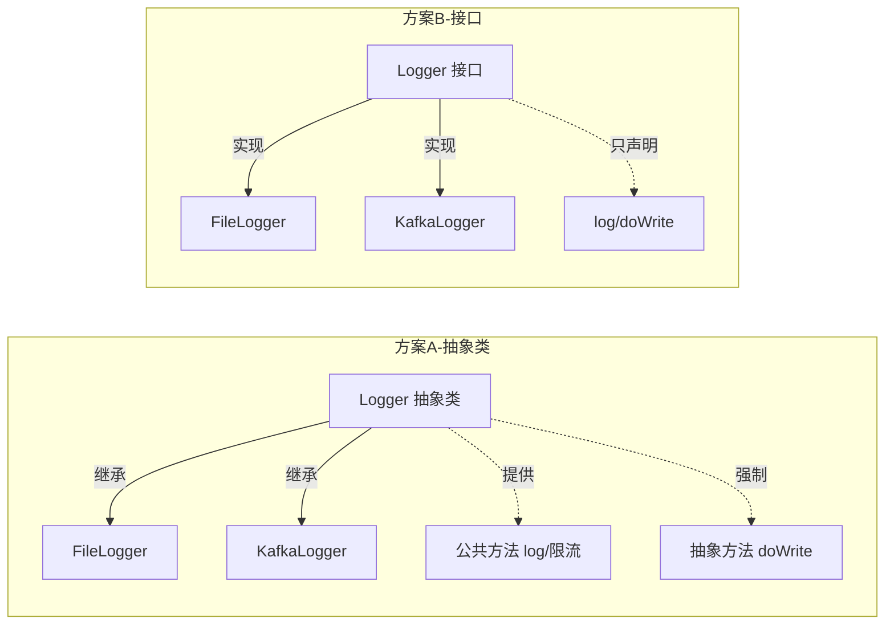
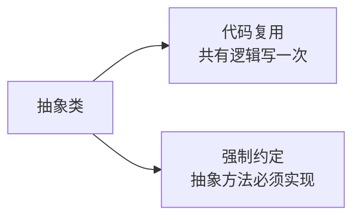
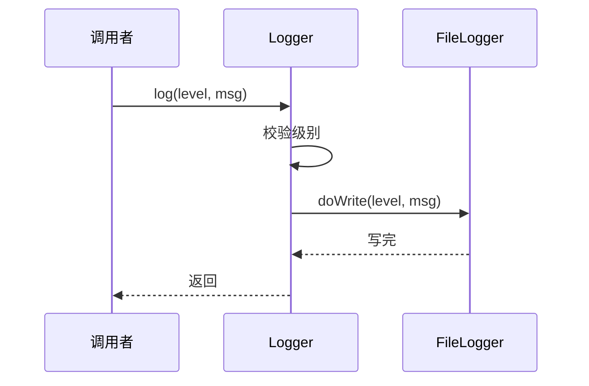
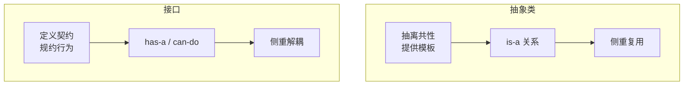
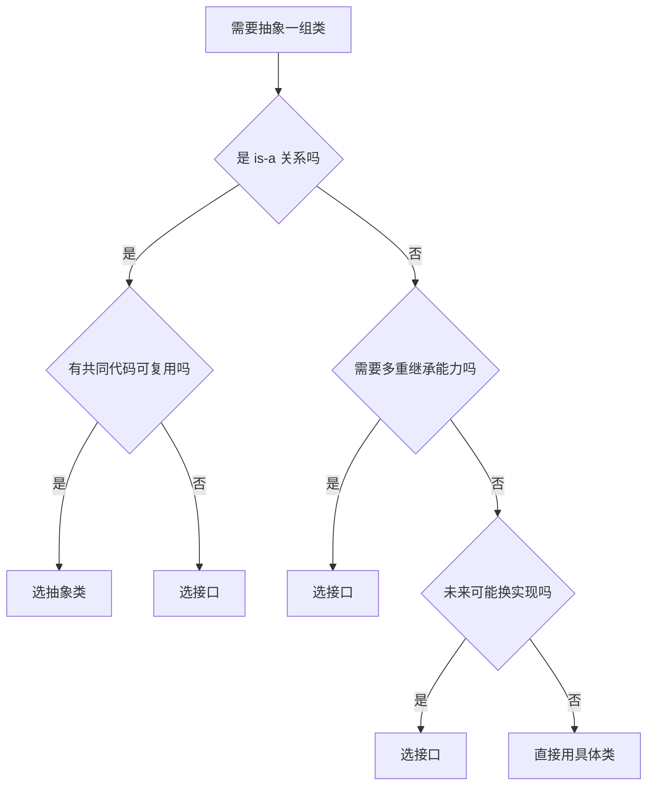
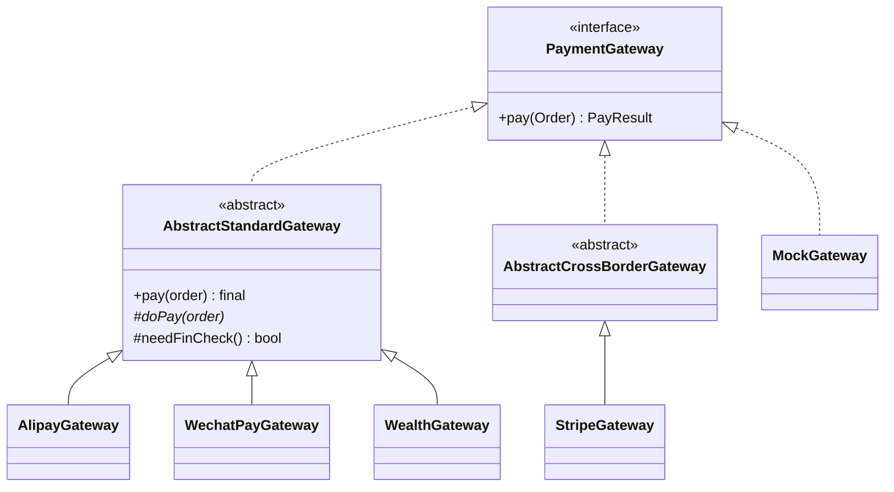
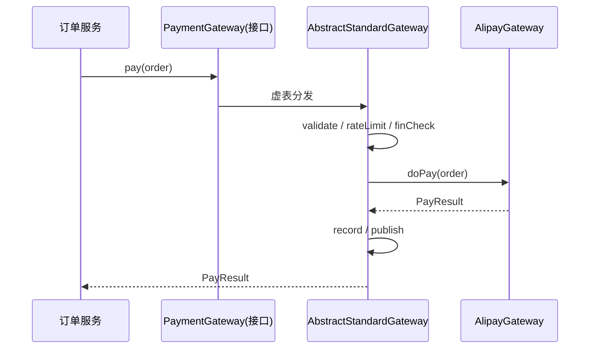

# 第一卷第3章：接口vs抽象类比较

#### 目录介绍
- [1.先回答上篇思考题](#1先回答上篇思考题)
  - [1.1 上篇遗留三道题](#11-上篇遗留三道题)
  - [1.2 日志器被改了47次](#12-日志器被改了47次)
  - [1.3 五次反转排查](#13-五次反转排查)
  - [1.4 灵魂五连问](#14-灵魂五连问)
- [2.从一个困惑切入](#2从一个困惑切入)
  - [2.1 日志器的烦恼](#21-日志器的烦恼)
  - [2.2 两种方案对比](#22-两种方案对比)
  - [2.3 抽象的本质](#23-抽象的本质)
- [3.抽象类详解](#3抽象类详解)
  - [3.1 语法定义](#31-语法定义)
  - [3.2 三大特点](#32-三大特点)
  - [3.3 解决的问题](#33-解决的问题)
  - [3.4 模板模式](#34-模板模式)
  - [3.5 模拟实现](#35-模拟实现)
- [4.接口详解](#4接口详解)
  - [4.1 语法定义](#41-语法定义)
  - [4.2 三大特点](#42-三大特点)
  - [4.3 解决的问题](#43-解决的问题)
  - [4.4 标记接口](#44-标记接口)
  - [4.5 默认方法](#45-默认方法)
- [5.两者深度对比](#5两者深度对比)
  - [5.1 语法层差异](#51-语法层差异)
  - [5.2 设计层差异](#52-设计层差异)
  - [5.3 关系建模差异](#53-关系建模差异)
  - [5.4 演化路径差异](#54-演化路径差异)
- [6.如何选择](#6如何选择)
  - [6.1 决策树](#61-决策树)
  - [6.2 实战场景](#62-实战场景)
  - [6.3 组合使用](#63-组合使用)
- [7.总结与延伸](#7总结与延伸)
- [8.综合实战案例](#8综合实战案例)
  - [8.1 支付网关接需求](#81-支付网关接需求)
  - [8.2 纯接口方案的坎](#82-纯接口方案的坎)
  - [8.3 抽象类提炼模板](#83-抽象类提炼模板)
  - [8.4 接口+抽象类双层](#84-接口抽象类双层)
  - [8.5 类图与时序图](#85-类图与时序图)
  - [8.6 留下三道思考题](#86-留下三道思考题)
- [08.认知跃迁总结](#08认知跃迁总结)

---

## 1.先回答上篇思考题

### 1.1 上篇遗留三道题

上一篇 [02.面向对象的特性](./02.面向对象特性思考) 末尾留下了三道题：

- 🟢 `Wallet#isAllowed` 改成 `private` 会怎么样？
- 🟡 信用账户用**继承**还是用**组合**？
- 🔴 流水要事务性写入数据库，抽象层应该如何演化？

本篇要回答的是**中题**和**难题**：

| 题 | 本篇答案 |
|---|---|
| 🟢 | `private` 后子类不能重写——抽象点被锁死，信用/冻结账户都无从演化 |
| 🟡 本篇答 | **说明什么是子类型**——信用钱包 is-a 钱包 → 抽象类；只是另一种規则 → 接口 / 策略组合 |
| 🔴 本篇答 | 抽象出 `TxPipeline`——骨架由抽象类提供（模板），动作如「持久化」「发事件」由接口可插拔 |

三道题同时指向**本篇的核心重点**：抽象类与接口，到底要怎么选？

### 1.2 日志器被改了47次

让这个问题从抽象变成血肉，来看一段真实代码史。

某中台项目 `MyLogger.java` 的 git 记录：

```
2021-04-12  init: 创建 MyLogger工具类
2021-05-03  feat: 支持写文件
2021-06-09  feat: 支持写 Kafka——代码中出现第一个 if(type=="kafka")
2021-08-21  feat: 支持写 ES——出现第二个 if
2022-01-14  fix: ES 限流逻辑现在影响了文件写入
2022-03-30  feat: 多租户隔离
2022-09-11  fix: 多租户下限流错乱
...                  ...
2024-02-07  refactor: 拆分为 Logger 接口 + 抽象类——第47个commit
```

**3 年服务商仅增加了 3 个，代码却被改了 47 次**。最后一次提交备注是「这是最后一次重构」——你看出问题了吗？


这反映出一个深刻事实：**99% 的技术重构都是「被迫重构」，而不是「主动选型」**。本篇要让你从第一天就能选对。

### 1.3 五次反转排查

重构中间，项目组并不是一路平顺。我们还原出五次“是抽象类还是接口”的反反复复：

- **反转 1**：主张抽象类 → 发现 `KafkaLogger` 还要 `extends KafkaProducer`，Java 单继承锁死。
- **反转 2**：改接口 → 发现限流、错误重试、日志头拼装，**每个实现三份重复代码**。
- **反转 3**：加 `default` 方法 → 发现限流需要实例状态存 token bucket，**接口不能存字段**。
- **反转 4**：妥协为"包含一个 `RateLimiter` 字段的抖动抽象类" → 发现调用方只能看到 `extends`，**失去了接口的多重可组合性**。
- **反转 5**：最终落定为**双层**——「对外 Logger 接口（能力契约） + 对内 AbstractLogger 抽象类（骨架复用）」。

> 最后这个“双层”方案，正是 Spring、Netty、Mybatis等一线框架的默认取舍。

### 1.4 灵魂五连问

```
Q1 ── 接口和抽象类本质上是同一类东西吗？
       └─→ §04 二者深度对比
Q2 ── 为什么 Java 只能单继承却可以多实现？
       └─→ §02 / §03 设计意图
Q3 ── default 方法出现后，接口是不是能取代抽象类？
       └─→ §03.5 default 方法的边界
Q4 ── 「什么时候选哪个」有没有一个不诡辩的补丁？
       └─→ §05 决策树
Q5 ── 为什么主流框架都选「接口+抽象类」双层？
       └─→ §05.3 / §07 综合实战
```

---

## 2.从一个困惑切入

### 2.1 日志器的烦恼

继上一篇的电商系统。我们要给系统加一个日志组件，要支持：
- 写文件
- 写消息队列（kafka）
- 写远程 ES

**所有日志器都要做几件相同的事**：判断日志级别是否启用、组装消息头、限流。**而具体"写到哪里"则各不相同**。

### 2.2 两种方案对比



方案 A 用抽象类——**有公共代码可复用**；
方案 B 用接口——**只定义契约，无任何复用**。

哪个更好？答案不是"哪个更高级"，而是**取决于你想解决什么问题**。

### 2.3 抽象的本质

抽象的根本动作：**从具体细节中抽离共性**。

- 抽象类抽离的是 **"是什么 + 共同行为实现"**——is-a 关系；
- 接口抽离的是 **"能做什么"**——has-a / can-do 关系。

记住这两个关系词，后面所有差异都从此推导。

---

## 3.抽象类详解

### 4.1 语法定义

```java
public abstract class Logger {
    private String name;
    private Level minLevel;

    public Logger(String name, Level minLevel) {
        this.name = name; this.minLevel = minLevel;
    }

    // 模板方法：固定流程，复用给所有子类
    public final void log(Level level, String msg) {
        if (level.intValue() < minLevel.intValue()) return;
        doWrite(level, msg);   // 留给子类去实现
    }

    // 抽象方法：必须由子类实现
    protected abstract void doWrite(Level level, String msg);
}

public class FileLogger extends Logger {
    @Override
    protected void doWrite(Level level, String msg) {
        // 写文件
    }
}
```

### 4.2 三大特点

```
1. 不能 new（强制被继承）
2. 可以包含字段、可以包含已实现方法
3. 子类必须实现所有抽象方法
```

### 4.3 解决的问题

抽象类同时给你两件武器：



如果用普通父类 + 空 `log()` 方法：
- 子类**忘记重写也不会报错**——bug 在运行时才暴露；
- 父类可以被 `new` 出来——增加误用风险。

抽象类正是为了堵住这两个口子。

### 3.4 模板模式

抽象类天然适合**模板方法模式**：

```
固定算法骨架（基类的 final 方法）
   └─ 可变步骤（abstract 方法，子类填空）
```



**调用方只看到 `log`，子类只关心 `doWrite`**——双方都不用关心对方。

### 3.5 模拟实现

Python 没有 `abstract` 关键字？也能模拟：

```python
class Logger:
    def __init__(self):
        if type(self) is Logger:
            raise TypeError("不能直接实例化")
    def do_write(self, level, msg):
        raise NotImplementedError("子类必须实现 do_write")
```

通过**构造函数禁止实例化 + 方法抛 `NotImplementedError`**，实现等价的语义保护。

---

## 4.接口详解

### 4.1 语法定义

```java
public interface Filter {
    void doFilter(RpcRequest req) throws RpcException;
}

public class AuthFilter implements Filter {
    public void doFilter(RpcRequest req) { /* 鉴权 */ }
}

public class RateLimitFilter implements Filter {
    public void doFilter(RpcRequest req) { /* 限流 */ }
}
```

### 4.2 三大特点

```
1. 不能有实例字段（Java 8 前不能有方法体）
2. 只声明契约，不提供实现
3. 类可以实现多个接口（突破单继承限制）
```

### 4.3 解决的问题

接口的核心价值是 **解耦**，不是复用：

```java
public class App {
    private List<Filter> filters;   // 只依赖接口
    public void handle(RpcRequest req) {
        for (Filter f : filters) f.doFilter(req);
    }
}
```

- 新增一种过滤器（如黑名单）→ **只加新类**，`App` 零修改；
- 测试时可以注入假 Filter；
- 不同模块各自演进，互不踩脚。

### 4.4 标记接口

有一类接口什么方法都不声明（如 `Cloneable`、`Serializable`），称为 **Marker Interface**。它们的唯一作用是**贴标签**——通知编译器/运行时"这个类具有某种能力"。

### 4.5 默认方法

Java 8 起，接口可以有 `default` 方法：

```java
public interface Comparator<T> {
    int compare(T a, T b);
    default Comparator<T> reversed() { return (a, b) -> compare(b, a); }
}
```

这是为了**接口演化**——给老接口加方法时不破坏已有实现。但要警惕：默认方法不应承担"代码复用"职责，那是抽象类的活。

---

## 5.两者深度对比

### 5.1 语法层差异

| 维度 | 抽象类 | 接口 |
|------|--------|------|
| 字段 | 任意 | 仅 `static final` |
| 方法实现 | 可有 | Java 8+ 限默认方法 |
| 构造器 | 有 | 无 |
| 子类关键字 | extends | implements |
| 多重继承 | 单 | 多 |

### 5.2 设计层差异



### 5.3 关系建模差异

| 关系 | 选择 | 例子 |
|------|------|------|
| is-a（本质相同） | 抽象类 | `FileLogger is-a Logger` |
| can-do（具备能力） | 接口 | `Bird can-do Fly` |
| like-a（外观相似） | 接口 | `List like-a Iterable` |

### 5.4 演化路径差异

- **抽象类**：自下而上——先有重复子类，再抽公因式上提；
- **接口**：自上而下——先定义协议，再让任何愿意遵守的类实现。

```
抽象类设计：发现 FileLogger 与 KafkaLogger 都要做"级别校验" → 提到父类
接口设计：先约定"凡是日志器，必须 doWrite()" → 谁愿意做日志器谁实现
```

---

## 6.如何选择

### 6.1 决策树



### 6.2 实战场景

| 场景 | 推荐 | 理由 |
|------|------|------|
| Android `BaseActivity` | 抽象类 | 子类共享生命周期模板 |
| MVP 的 View / Presenter | 接口 | 仅约束行为，便于替换 |
| 支付渠道（支付宝/微信） | 接口 | 多种实现并存 |
| HTTP 框架的 `Filter` 链 | 接口 | 无关类型层级，仅需契约 |
| ORM 的 `BaseEntity` | 抽象类 | 共享 id/createTime 字段 |

### 6.3 组合使用

实际项目里两者经常**搭配出场**：

```java
// 接口定义协议
public interface PaymentGateway {
    PayResult pay(Order order);
}

// 抽象类提供公共骨架
public abstract class AbstractGateway implements PaymentGateway {
    @Override
    public final PayResult pay(Order order) {
        validate(order);
        log(order);
        PayResult r = doPay(order);
        notify(r);
        return r;
    }
    protected abstract PayResult doPay(Order order);
}

// 具体实现只填空
public class AlipayGateway extends AbstractGateway {
    protected PayResult doPay(Order order) { /* 调支付宝 */ }
}
```

**接口给契约，抽象类给骨架，具体类给特殊性**——这是企业级框架的经典三层。

---

## 7.总结与延伸

| 维度 | 抽象类 | 接口 |
|------|--------|------|
| 关系 | is-a | has-a / can-do |
| 主要价值 | 复用 | 解耦 |
| 设计方向 | 自下而上 | 自上而下 |
| 适用场景 | 同源类的共同骨架 | 跨类型的能力契约 |

但选好了"用接口还是抽象类"还不够。更重要的是：**调用方应该依赖接口，而不是具体实现**——这是软件设计中最常被引用、也最常被违反的一条原则。

下一篇 [04.接口而非实现编程](04.接口而非实现编程.md) 会用图片存储与支付渠道两个真实案例，详细拆解这条原则的应用与边界。

---

## 8.综合实战案例

> 延续主线——02 篇我们造了 `Wallet`，本篇要为“从钱包出发”的**支付网关**选对抽象。

### 8.1 支付网关接需求

PM 需求清单：

```
1. 接入 支付宝 / 微信支付 / 银联
2. 每一家都要走这些公共步骤：
   参数校验 → 限流 → 财务检查 → 发起调用 → 重试 → 记账 → 发领域事件
3. 只有“调用第三方”这一步不同
4. 后期要接跨境支付（PayPal/Stripe）
```

### 8.2 纯接口方案的坎

第一版：

```java
public interface PaymentGateway {
    PayResult pay(Order order);
}
public class AlipayGateway   implements PaymentGateway { /* 200 行 */ }
public class WechatPayGateway implements PaymentGateway { /* 195 行 */ }
public class UnionPayGateway  implements PaymentGateway { /* 210 行 */ }
```

问题马上油漆未干就浮现：

| 现象 | 本质 |
|---|---|
| 三个类的参数校验代码 90% 一样 | 公共骨架未提炼 |
| 限流改了一次，三个类都要同步 | 重复代码 |
| 新加「财务检查」微服务调用 → 三个类一起改 | 修改辐爹过大 |
| 面试新人接个 Stripe 要五天 | 新手不知道公共逻辑不能漏 |

### 8.3 抽象类提炼模板

提炼出骨架：

```java
public abstract class AbstractPaymentGateway implements PaymentGateway {
    @Override
    public final PayResult pay(Order order) {        // final 锁住骨架
        validate(order);
        rateLimit();
        finCheck(order);
        PayResult r = retry(() -> doPay(order));     // 唯一可插拔
        record(order, r);
        publish(new PaidEvent(order, r));
        return r;
    }
    protected abstract PayResult doPay(Order order);  // 子类只填“差异那一点”
    // validate / rateLimit / finCheck / retry / record / publish
    // 都是抽象类里的 final 公共方法
}
public class AlipayGateway extends AbstractPaymentGateway {
    @Override protected PayResult doPay(Order order) { /* 30 行 */ }
}
```

代码量从 **600 行 → 250 行**。略详。

但问题远未结束。

### 8.4 接口+抽象类双层

三个跟进需求让“纯抽象类”也坌了：

1. **需求 A**：理财产品也要「支付」，但他们**不走财务检查**也**不限流**。
2. **需求 B**：测试环境需要一个 `MockGateway` 手动返回返回值。
3. **需求 C**：跨境支付需要 `extends ThirdPartySdkBase`，Java 单继承少不了。

三件事同时发生，如果只有抽象类这一条路，**你要么拆出三棵抽象类树，要么让 SDK Wrapper 变成抽象类重复逯复用。两者都是坑**。

最终代码是“接口 × 抽象类”的两层：

```java
// 能力层：什么是“可被调用去支付的东西”
public interface PaymentGateway {
    PayResult pay(Order order);
}

// 骨架层：「企业级标准的骨架」
public abstract class AbstractStandardGateway implements PaymentGateway { ... }

// 骨架层：「跨境供应商的骨架（必须 extends ThirdPartySdkBase）」
public abstract class AbstractCrossBorderGateway extends ThirdPartySdkBase
    implements PaymentGateway { ... }

// 插拔层
public class MockGateway       implements PaymentGateway { ... }   // 测试用
public class AlipayGateway     extends AbstractStandardGateway { ... }
public class StripeGateway     extends AbstractCrossBorderGateway { ... }
public class WealthGateway     extends AbstractStandardGateway { @Override protected boolean needFinCheck() { return false; } }
```

> 到这里你会发现：**接口与抽象类从来不是二选一，而是“面向不同读者”**。
>
> 接口写给「调用方」看：你能打什么交道。
> 抽象类写给「实现者」看：你要填什么空。

### 8.5 类图与时序图





### 8.6 留下三道思考题

> 答案在第 04 篇开头揭晓。

- **🟢 易**：`AbstractStandardGateway.pay(...)` 用了 `final`。为什么不可以不加 `final`？不加会出什么事？
- **🟡 中**：现在 `needFinCheck()` 是抽象类里的一个可重写方法。如果改为「多插拔」（限流/财务检查/重试都可插拔），你会怎么设计？抽象类还够不够用？
- **🔴 难**：跨境支付商不仅要 `extends ThirdPartySdkBase`，还要遵守 PCI-DSS 合规（每个调用都需走合规检查器）。这件事怎么加进去？它是横切关注点，、应该走接口、抽象类、还是其他处理？

---

## 9.认知跃迁总结

回到开篇 47 次重构的日志器。它从一开始就应该是「接口 + 抽象类」双层——但这件事你能只看书学会吗？不能。**它需要你亲手别扭五次**，每一次反转都会让你对"接口 vs 抽象类"的认知加深一层。

一句话：

> **接口回答「能干什么」，抽象类回答「如何干」。两者不是二选一，是两个不同问题的答案。**

下一篇 [04.接口而非实现编程](04.接口而非实现编程.md)——你这里已经学会了「该怎么设计抽象」，但还有一个更哲学的问题：**调用方**为什么要看接口而不是实现？下篇就从一次【云迁移 6 万行代码】的虐漆事故说起。
