# 第一卷第11章：DDD与战术建模

#### 目录介绍
- [01.需求文档失真70%](#01需求文档失真70)
  - [1.1 业务方与开发的鸿沟](#11-业务方与开发的鸿沟)
  - [1.2 一次需求评审复盘](#12-一次需求评审复盘)
  - [1.3 灵魂五连问](#13-灵魂五连问)
- [02.DDD是什么](#02ddd是什么)
  - [2.1 Eric Evans的初衷](#21-eric-evans的初衷)
  - [2.2 战略与战术分层](#22-战略与战术分层)
  - [2.3 与本系列的关系](#23-与本系列的关系)
- [03.通用语言](#03通用语言)
  - [3.1 业务方与开发的桥](#31-业务方与开发的桥)
  - [3.2 命名即建模](#32-命名即建模)
  - [3.3 反模式现场](#33-反模式现场)
- [04.限界上下文](#04限界上下文)
  - [4.1 边界的力量](#41-边界的力量)
  - [4.2 上下文映射](#42-上下文映射)
  - [4.3 防腐层设计](#43-防腐层设计)
  - [4.4 拆错的代价](#44-拆错的代价)
- [05.实体与值对象](#05实体与值对象)
  - [5.1 身份的本质](#51-身份的本质)
  - [5.2 值对象的不变性](#52-值对象的不变性)
  - [5.3 何时升格为实体](#53-何时升格为实体)
  - [5.4 Money建模实战](#54-money建模实战)
- [06.聚合与聚合根](#06聚合与聚合根)
  - [6.1 一致性边界](#61-一致性边界)
  - [6.2 聚合根的责任](#62-聚合根的责任)
  - [6.3 聚合大小的取舍](#63-聚合大小的取舍)
  - [6.4 跨聚合通信](#64-跨聚合通信)
- [07.领域服务与应用服务](#07领域服务与应用服务)
  - [7.1 三种服务边界](#71-三种服务边界)
  - [7.2 领域逻辑放哪里](#72-领域逻辑放哪里)
  - [7.3 贫血vs充血对决](#73-贫血vs充血对决)
- [08.领域事件](#08领域事件)
  - [8.1 事件的语义](#81-事件的语义)
  - [8.2 事件溯源](#82-事件溯源)
  - [8.3 事件风暴工作坊](#83-事件风暴工作坊)
- [09.六边形与整洁架构](#09六边形与整洁架构)
  - [9.1 端口与适配器](#91-端口与适配器)
  - [9.2 依赖方向法则](#92-依赖方向法则)
  - [9.3 与DI/DIP呼应](#93-与didip呼应)
- [10.综合案例收束](#10综合案例收束)
  - [10.1 11篇案例的回顾](#101-11篇案例的回顾)
  - [10.2 用DDD最终重塑](#102-用ddd最终重塑)
  - [10.3 完整系统类图](#103-完整系统类图)
  - [10.4 留下三道终极思考](#104-留下三道终极思考)
- [11.系列收束](#11系列收束)

---

> 本篇是「面向对象设计」系列**第 11 篇 · 收束之作**。  
> 上一篇 [10.可测试性设计](./10.可测试性实战设计) 让你的代码"可以验收"。  
> 但**OOP 走到尽头是 DDD**——前 10 篇都在讲"代码怎么写得更好"，本篇要回答**"代码到底在表达什么业务"**。  
> 没有 DDD 的 OOP，只是更优雅的语法；有 DDD 的 OOP，才是真正的工程之道。

---

## 01.需求文档失真70%

### 1.1 业务方与开发的鸿沟

2024 年 9 月，某中台项目「**会员等级权益系统**」迭代评审。一段对话——

```
产品 PM:    会员升级到铂金后,优先发货
工程师 A:   你说的"会员"是 user 表里那个 vip_level 字段吗?
产品 PM:    啊…不是, 是会员中心系统里的会员
工程师 A:   那个会员 ID 跟 user_id 一样吗?
产品 PM:    应该一样吧? 会员中心说他们用 union_id 关联的
工程师 B:   那个 union_id 跟 user_id 之前出过对不齐的事故
产品 PM:    那以你们说为准吧
工程师 C:   等下, "优先发货"是指物流环节优先, 还是订单分配仓库时优先?
产品 PM:    呃…都算吧?
```

会议结束后，开发小组复盘。同一份需求里的「**会员**」出现了**3 套含义**：

| 视角 | 说的"会员"指 | 内部 ID | 数据存储 |
|---|---|---|---|
| 业务/产品 | 「能享受铂金权益的人」 | `member_id` | 会员中心 `t_member` |
| 用户系统 | 「平台注册用户」 | `user_id` | `t_user` |
| 订单系统 | 「下单时记录的人」 | `customer_id` | 订单库 `customer_id` 字段 |

**关键现实**：这三个 ID 在数据上**有 7% 对不齐**——会员中心丢失同步、用户改绑手机、订单老数据未迁移。

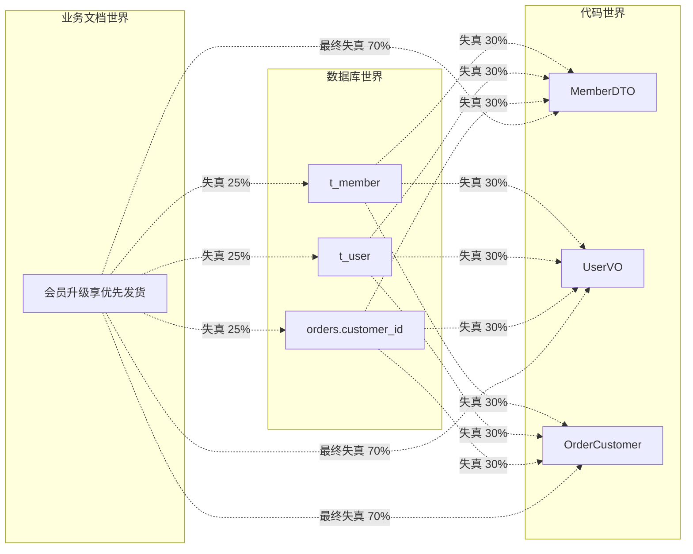

**70% 失真**怎么算的？业界经验值：

- 业务文档 → 表设计：失真 ~25%
- 表设计 → 代码命名：失真 ~30%
- 代码 → 跨服务交互：失真 ~30%
- **复合失真**：1 - (0.75 × 0.70 × 0.70) ≈ **63-72%**

> 60% 以上的工程能量浪费在「**翻译三种语言**」上。这不是个别项目的问题——**只要业务方和开发方说的不是同一种话，这种失真必然发生**。DDD 的全部价值就是消除这种失真。

### 1.2 一次需求评审复盘

接上节，团队后来用 DDD 的"事件风暴"工作坊重新对齐了 4 小时。**对齐前**会议室白板：

```
[业务画的]                    [工程师画的]
会员                           User + UserExtraInfo + MemberCenter
   ↓                              ↓
升级                          UserStatusUpdater (写 4 张表)
   ↓                              ↓
铂金                          PlatLevelEnum.PT (枚举)
   ↓                              ↓
优先发货                       OrderPriorityFlag (订单字段)
```

**对齐后**白板：

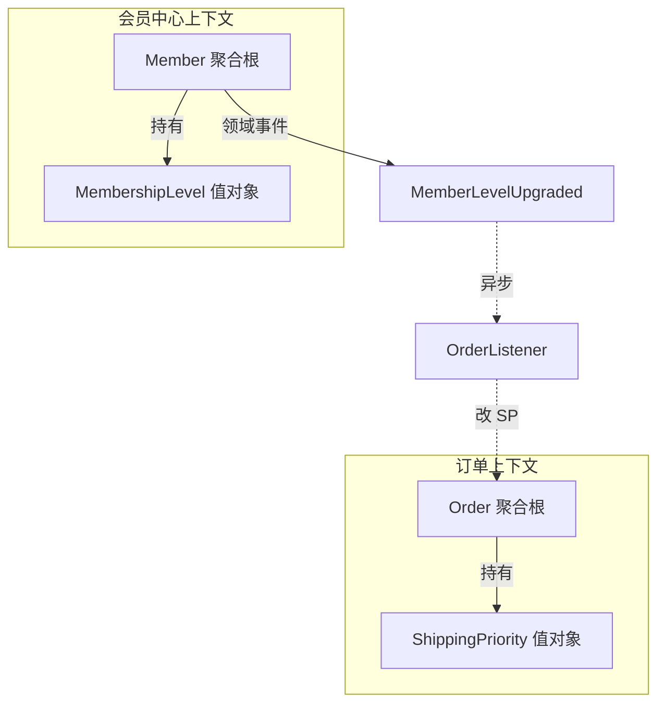

**4 小时换回的成果**——业务/产品/开发**对每个名词的含义达成共识**，并明确了**两个上下文的边界**。后续 3 个月迭代再没出过"会员是谁"的扯皮。

> **DDD 真正的价值，体现在评审会上的扯皮变少。** 它不是"另一种代码风格"，而是"**让代码与业务对齐的工程方法**"。

### 1.3 灵魂五连问

```
Q1 ── 代码到底在表达什么? 数据? 还是业务?
       └─→ §01.1 Eric Evans 的初衷
Q2 ── 为什么"对象 = 数据库表"是 OOP 最大的误解?
       └─→ §06.3 充血 vs 贫血
Q3 ── 业务概念为什么会在代码里失真?
       └─→ §02 通用语言
Q4 ── DDD 与前 10 篇是什么关系? 是替代还是补充?
       └─→ §01.3 与本系列的关系
Q5 ── 何时 DDD 是过度设计?
       └─→ §03.4 拆错的代价
```

---

## 02.DDD是什么

### 2.1 Eric Evans的初衷

2003 年，Eric Evans 出版了那本蓝色封面的 *Domain-Driven Design*。原话：

> 「软件项目最大的复杂性**不是技术**，而是**领域**。我们花了 50 年研究"代码怎么写"，却几乎没研究"代码到底在表达什么"。」

这本书提出一个看似简单的命题：**让代码长得像业务**。但执行起来涉及：

- **战略层**：怎么划分系统边界
- **战术层**：怎么用对象表达业务规则
- **过程层**：业务方/开发/测试怎么对齐

20 年后，DDD 已经从「**一种思想**」变成了「**微服务架构的事实标准**」。但绝大多数团队**只学了战术层的几个概念**（实体/值对象/聚合根），而**忽略了战略层**——这是 DDD 在工程界**用得多但用不好**的根本原因。

### 2.2 战略与战术分层

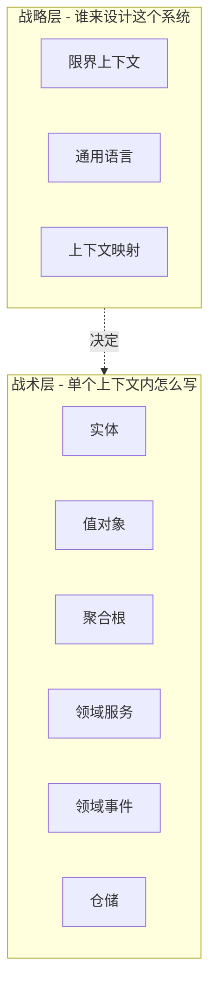

| 层 | 关键问题 | 对应工件 |
|---|---|---|
| **战略层** | 这个系统应该被切成几块? 每块归谁? | 限界上下文图、上下文映射 |
| **战术层** | 单个上下文里怎么用 OOP 表达业务? | 实体/值对象/聚合/事件 |

**本篇专攻战术层**——因为它是工程师每天会用上的部分。战略层涉及组织架构、康威定律，是另一个层面的话题（推荐《领域驱动设计精粹》深入）。

### 2.3 与本系列的关系

前 10 篇与 DDD 的关系——

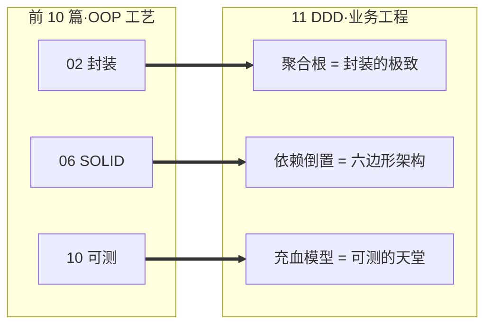

| 前 10 篇问的问题 | 本篇问的问题 |
|---|---|
| 怎么写好对象? | 这个对象**应该叫什么、表达什么**? |
| 怎么用接口解耦? | 这个**接口是哪个上下文的边界**? |
| 怎么避免坏味道? | 怎么让**业务模型与代码完全对齐**? |

> **没有 DDD 的 OOP，是更优雅的语法; 有 DDD 的 OOP，是真正的工程之道。**

---

## 03.通用语言

### 3.1 业务方与开发的桥

**通用语言（Ubiquitous Language）**：业务、产品、开发**说同一种话**——这是 DDD 整个体系的基石。

实践上很简单：**词汇表**。但 80% 的项目没做对。

```
业务说: 退款        | 工程师听到: cancel ← 错失语义
业务说: 暂存订单    | 工程师听到: draft ← 错失语义
业务说: 客户        | 工程师听到: User ← 范围不对
业务说: 撤销发货    | 工程师听到: stop_shipping ← 不可逆性丢失
```

**正确做法**：建立一份团队公认的词汇表——

```
退款 (Refund):
  含义: 已支付订单, 钱原路返回
  对应: RefundOrder 聚合根 + Refund 领域事件
  边界: 不包括"取消未支付订单", 那叫 Cancel
  
取消 (Cancel):
  含义: 未支付订单的撤销
  对应: Order.cancel() 方法 + OrderCancelled 事件
  边界: 不修改任何资金状态
```

> **同一份词汇表，要在产品文档、代码、测试用例、API 文档里完全一致**。任何不一致都是失真的源头。

### 3.2 命名即建模

DDD 最常被低估的洞见：**命名 = 建模**。

```java
// 选 A 还是 B 是建模决策, 不是审美决策
class Order {
    public void cancel() { ... }      // A: "取消"——业务可逆
    public void revert() { ... }      // B: "回滚"——技术中性
    public void abort()  { ... }      // C: "中止"——非正常路径
}
```

三个名字暗示**三种不同的业务模型**——

| 命名 | 业务含义 | 后续设计 |
|---|---|---|
| `cancel` | 用户/系统主动取消 | 触发 `OrderCancelled` 事件,可重新下单 |
| `revert` | 系统出错回滚 | 不会触发业务事件,只是技术回退 |
| `abort` | 异常中止 | 触发风控告警,可能不可恢复 |

**如果你选了 `cancel` 但业务方说的是 `abort`——后续所有事件、状态机、运维流程都会跟业务期望对不齐**。

> **取一个好名字，已经做完了 50% 的设计。**

### 4.3 反模式现场

最常见的失真：

```java
// 业务文档: "用户购买商品后扣减库存"
// 代码: 
class StockManager {
    public void update(Long pid, Integer qty) {
        // 30 行 SQL...
    }
}

// 问题: 
// 1. "用户购买"这件事消失了 - 看不到 Order/User
// 2. "扣减库存"变成模糊的 "update" - 失去业务语义
// 3. "商品"变成 Long pid - 失去类型安全
```

修复后：

```java
class StockReductionService {
    public StockReductionResult reduce(OrderPlaced event) {
        // event 携带订单上下文
        return inventory.deduct(event.items());   // "deduct" 而非 "update"
    }
}
```

**改了什么**？

- 类名从 `Manager`（无意义）→ `StockReductionService`（业务动词）
- 方法名从 `update`（CRUD 思维）→ `reduce`（业务动作）
- 入参从 `Long, Integer`（贫血）→ `OrderPlaced`（业务事件）

**代码读起来跟业务文档一致——这就是通用语言达标的标志**。

---

## 04.限界上下文

### 4.1 边界的力量

「**用户**」在不同子系统里，是不同的实体：

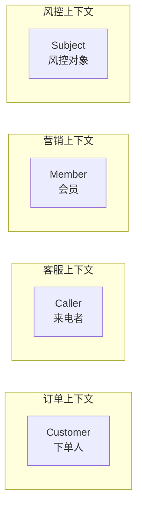

**同一个张三**，在四个上下文里有四个完全不同的"对象"：
- 订单里关心他的**地址、联系方式**
- 客服里关心他的**最近 5 通电话内容**
- 营销里关心他的**等级、积分**
- 风控里关心他的**设备指纹、行为序列**

**反模式**：搞一个巨型 `User` 类把所有字段都塞进去——50 个字段、20 个 Service 围着它转。这就是 §00.1 的"会员中心 vs 用户系统 vs 订单系统"扯皮的根源。

**正模式**：每个上下文**有自己的 User 模型**，字段只包含本上下文关心的部分。**跨上下文用 ID 引用 + 防腐层翻译**。

### 4.2 上下文映射

Eric Evans 定义了 **9 种上下文映射模式**——常见的：

| 模式 | 关系 | 示例 |
|---|---|---|
| **共享内核** | 两个上下文共享一小部分核心模型 | 订单/物流共享 `Address` 值对象 |
| **客户-供应商** | 上游决定下游接收什么 | 用户中心是供应商,订单是客户 |
| **顺从者（Conformist）** | 下游被动接受上游模型 | 接入第三方支付,只能照他的字段 |
| **防腐层（ACL）** | 下游保护自己,翻译上游模型 | 订单用 `MemberAdapter` 翻译会员中心 |
| **分离方式** | 完全独立,无交互 | 客服与风控彼此不关心 |

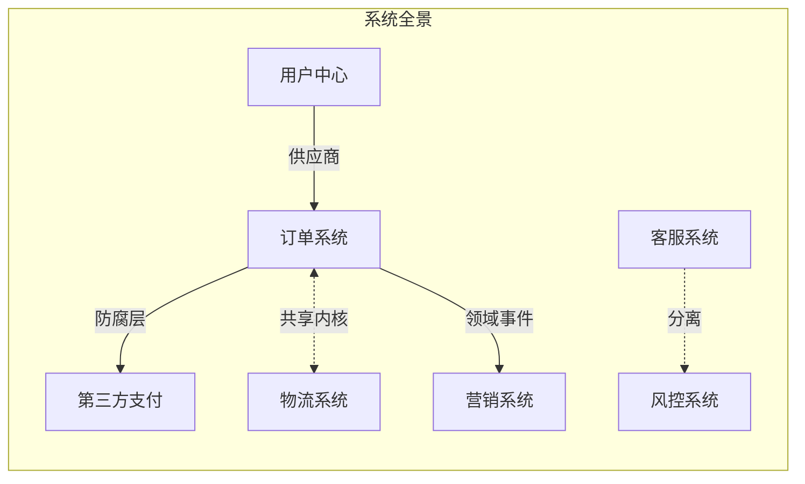

### 3.3 防腐层设计

接入外部系统（如第三方支付、外部 SDK）必须有**防腐层（Anti-Corruption Layer, ACL）**——它的责任：

1. **翻译模型**——把外部模型转换成本上下文的语言
2. **隔离变化**——外部 API 改了，只动 ACL，不动核心
3. **保护语义**——外部的"奇怪概念"不污染本上下文

```java
// 没有 ACL —— 反模式
class OrderService {
    @Autowired AlipaySdk alipay;
    public void pay(Order o) {
        // alipay 的字段名/语义/异常体系污染整个 OrderService
        AlipayResult r = alipay.tradeCreate(...);
        if (r.getCode() == 200) ...;
    }
}

// 有 ACL —— 正模式
class OrderService {
    private final PaymentGateway gateway;   // 我自己的接口
    public void pay(Order o) {
        PaymentResult r = gateway.charge(o);   // 本上下文的语言
    }
}
class AlipayPaymentAdapter implements PaymentGateway {  // ACL
    @Autowired AlipaySdk alipay;
    public PaymentResult charge(Order o) {
        AlipayResult r = alipay.tradeCreate(...);
        return translate(r);   // 翻译! 把 Alipay 模型翻成 PaymentResult
    }
}
```

> 与 04 篇 §08.3 「云迁移 6 万行代码」遥相呼应——**ACL 是面向接口编程的最高形态**。

### 3.4 拆错的代价

**拆得太碎**——「微服务地狱」：

```
拆出 50 个微服务,
单次下单要调 12 个服务,
任何一个挂了订单都不能下,
分布式事务搞得开发想哭...
```

**拆得太粗**——「单体退化」：

```
所有业务塞一个上下文,
团队之间互相 Block,
发版要全员协调,
3 年后又长成大泥球...
```

**判据**：**Conway's Law（康威定律）**——上下文边界 ≈ 团队边界。

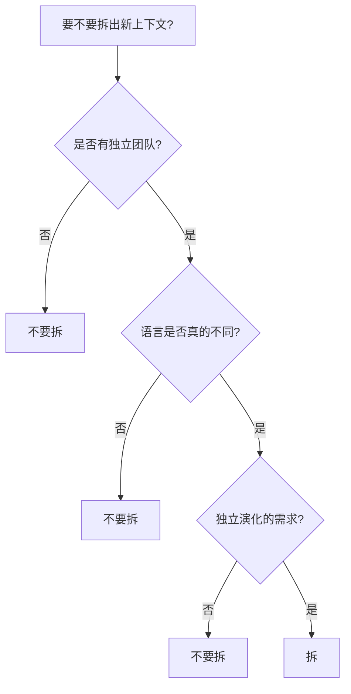

> 「**1 个 5 人团队 ≈ 1 个上下文**」是经验法则。少于这个规模拆，会被分布式事务和跨服务调用拖垮。

---

## 05.实体与值对象

### 5.1 身份的本质

**实体（Entity）**：通过 **ID** 标识，**ID 决定相等性**。

```java
class Order {
    private final OrderId id;
    private BigDecimal amount;
    private String status;
    
    @Override public boolean equals(Object o) {
        return o instanceof Order && ((Order) o).id.equals(this.id);
    }
}
```

**两个 `Order` 即使所有字段都一样，只要 ID 不同，就是不同的订单**。这正是「**身份**」概念——订单像人，**ID 就是身份证**。

### 5.2 值对象的不变性

**值对象（Value Object）**：通过 **属性** 标识，没有独立身份。

```java
final class Money {
    private final BigDecimal amount;
    private final Currency currency;
    
    // 必须不可变
    public Money(BigDecimal a, Currency c) { ... }
    public Money plus(Money other) { ... }   // 返回新对象
    
    @Override public boolean equals(Object o) {
        return o instanceof Money && 
               ((Money) o).amount.equals(this.amount) &&
               ((Money) o).currency.equals(this.currency);
    }
}
// new Money(100, USD).equals(new Money(100, USD))  → true
```

**两个 `Money(100, USD)` 完全相等**——它们没有"是哪一份钱"的概念。

判据：

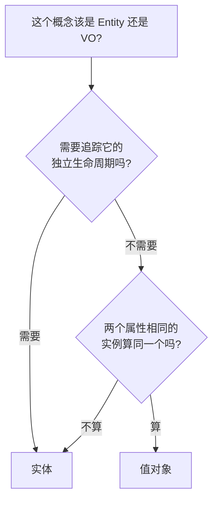

### 5.3 何时升格为实体

**地址**通常是值对象，但在物流系统中**可能升格为实体**——

```java
// 物流系统：地址有自己的生命周期(被多次访问、收件状态变化)
class DeliveryAddress {
    private final AddressId id;
    private LocationStatus status;       // 已收件/未收件/失败
    private List<DeliveryAttempt> attempts;
}
```

**信号**：当一个原本的值对象**开始有"状态"或"历史"**，它就值得升格。

### 5.4 Money建模实战

经典三层演化：

**Level 1：原始类型偏执**
```java
double balance = 100.5;
balance += 0.1;          // 0.6 浮点误差!
```

**Level 2：BigDecimal**
```java
BigDecimal balance = new BigDecimal("100.5");
balance = balance.add(new BigDecimal("0.1"));   // 精确,但...
```

**Level 3：Money 值对象**
```java
final class Money {
    BigDecimal amount;
    Currency  currency;
    
    public Money plus(Money other) {
        if (!currency.equals(other.currency)) 
            throw new IllegalArgumentException("Cannot add USD to RMB");
        return new Money(amount.add(other.amount), currency);
    }
}
// new Money(100, USD).plus(new Money(50, RMB))   ← 编译过, 运行时拒绝
```

**为什么 Money 必须是值对象**：

| 维度 | BigDecimal | Money |
|---|---|---|
| 货币安全 | ❌ 100USD + 50RMB = 150 | ✓ 抛异常 |
| 不变性 | ✓ | ✓ |
| 业务语义 | ❌ 看不出是钱 | ✓ |
| 单位扩展 | ❌ | ✓ 加 `convert(rate)` 等方法 |

> **每一个业务概念都值得一个值对象**——`Phone`、`Email`、`OrderId`、`Quantity`...这就是与 08 篇 §2.5 "基本类型偏执"的呼应。

---

## 06.聚合与聚合根

### 6.1 一致性边界

**聚合（Aggregate）**：**业务一致性的最小单元** = **事务的边界**。

```java
// Order 聚合: Order(根) + OrderItem + ShippingAddress
class Order {
    private List<OrderItem> items;
    private ShippingAddress address;
    
    public void addItem(Product p, int qty) {
        // 不变量: 总价 = sum(items.price * qty), 由聚合根守
        items.add(new OrderItem(p, qty));
    }
}
```

**为什么是"事务边界"**——

```sql
-- 一个事务内,聚合内部状态必须一致
BEGIN TRANSACTION;
UPDATE order SET total = ?;
INSERT INTO order_item ...;
COMMIT;
-- 跨聚合不在同一事务: Order 与 Inventory 通过最终一致性协调
```

### 6.2 聚合根的责任

**聚合根（Aggregate Root）**：聚合中**唯一对外暴露**的对象。

三大责任：

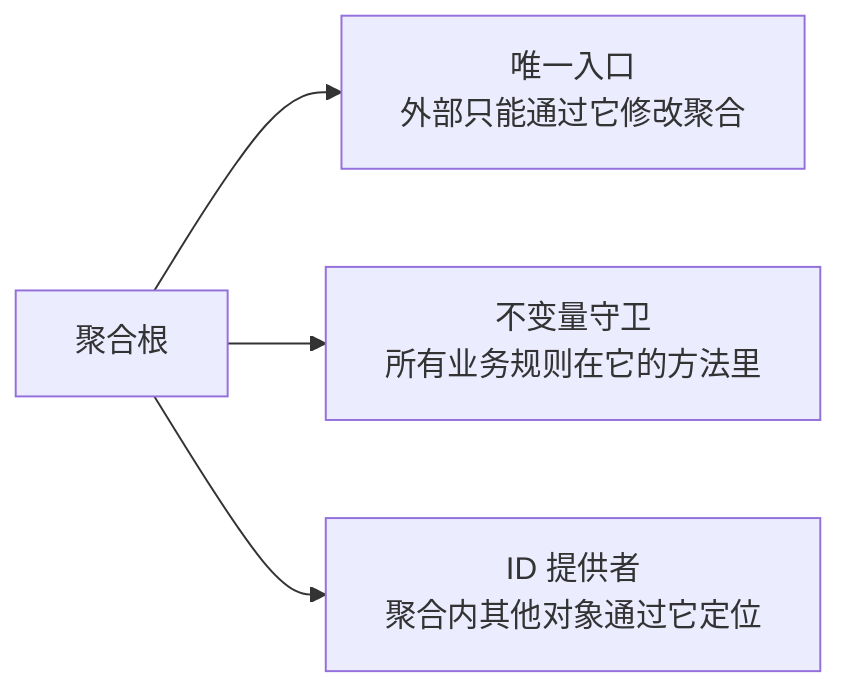

**反模式**：

```java
// 反例: 外部直接修改聚合内部
order.getItems().add(new OrderItem(...));   // 绕过 Order, 总价没更新
```

**正模式**：

```java
order.addItem(product, qty);   // 必须通过 Order 自己的方法
```

### 6.3 聚合大小的取舍

**大聚合**：

```
Customer 聚合: Customer(根) + 100 个 Order + 1000 个 OrderItem
```

- 加载慢——查 Customer 要捞 1000+ 行
- 并发冲突——两个用户改自己 Order，**整个 Customer 锁住**

**小聚合**：

```
Customer 聚合: Customer(根)
Order   聚合: Order(根) + OrderItem
```

- 加载快
- 并发好
- 但**跨聚合一致性外推到应用层**——`Order.place()` 后要发事件让 `Customer` 异步更新统计

**经验法则**：**聚合 ≤ 5 个对象 / 聚合根方法 ≤ 10 个**。超过就该拆。

### 5.4 跨聚合通信

**两条铁律**：

1. **不要直接引用对方对象**——用 ID 引用
2. **改一个聚合，发事件让对方异步响应**

```java
// 反例
class Order {
    private Customer customer;       // 直接引用,加载 Order 把 Customer 也带进来
    
    public void place() {
        customer.incrementOrderCount();   // 跨聚合直接改对方状态! 事务边界混乱
    }
}

// 正例
class Order {
    private CustomerId customerId;       // 只引 ID
    
    public List<DomainEvent> place() {
        return List.of(
            new OrderPlaced(this.id, this.customerId, this.total())
        );
    }
}
// 应用层: 监听 OrderPlaced 事件,异步更新 Customer
```

> 与 10 篇 §03.4 副作用集中化、§3.5 纯函数优先**完全一致**——聚合根方法**返回事件**而不是直接执行。

---

## 07.领域服务与应用服务

### 7.1 三种服务边界

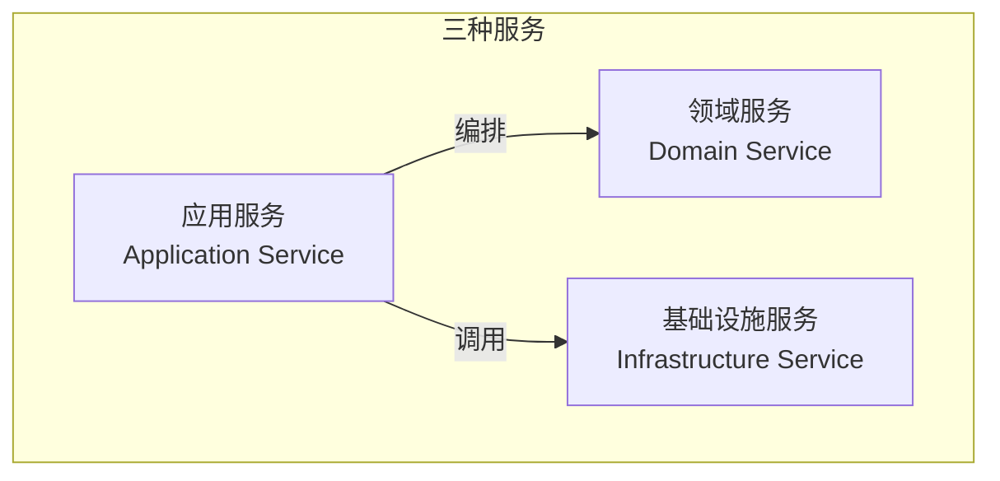

| 服务类型 | 职责 | 例子 |
|---|---|---|
| **应用服务** | 编排领域对象,处理事务、安全、日志 | `OrderApplicationService.placeOrder()` |
| **领域服务** | 表达**跨实体**的业务规则 | `PricingService.calculatePrice(order, customer)` |
| **基础设施服务** | 技术能力实现 | `MysqlOrderRepo`、`KafkaPublisher` |

### 7.2 领域逻辑放哪里

**判据**——一个新业务规则该放哪里？

```mermaid
flowchart TD
    Q[新业务规则放哪?] --> Q1{规则只涉及一个实体的字段?}
    Q1 -->|是| E[放实体方法]
    Q1 -->|否| Q2{涉及多个实体, 且天然属于其中一个?}
    Q2 -->|是| Q3[放主实体方法<br/>把另一个作为参数]
    Q2 -->|否| Q4{涉及多个实体, 谁都不"主"?}
    Q4 -->|是| DS[放领域服务]
    Q4 -->|否, 是流程| AS[放应用服务]
```

**例子**：

```java
// 规则1: "订单总价 = items 价格之和" → 实体方法
class Order {
    public Money total() { return items.stream().map(...).reduce(...); }
}

// 规则2: "订单+顾客等级算最终折扣价" → 领域服务（跨两个实体）
class PricingService {
    public Money finalPrice(Order order, Customer customer) {
        Money base = order.total();
        Discount d = customer.level().discount();
        return d.apply(base);
    }
}

// 规则3: "下单时, 校验 → 计算 → 扣库存 → 落库 → 发事件" → 应用服务（编排）
class OrderApplicationService {
    @Transactional
    public OrderId placeOrder(PlaceOrderCommand cmd) {
        Customer customer = customerRepo.find(cmd.customerId());
        Order    order    = Order.create(cmd, customer);
        Money    finalPrice = pricingService.finalPrice(order, customer);
        order.confirmPrice(finalPrice);
        inventoryService.reserve(order.items());
        orderRepo.save(order);
        eventPublisher.publishAll(order.events());
        return order.id();
    }
}
```

### 7.3 贫血vs充血对决

**贫血模型**——传统 Java：

```java
class Order {                          // 数据结构
    Long id; BigDecimal amount; ...
    // 50 个 getter/setter, 没业务方法
}
class OrderService {                   // 行为
    public void confirm(Order o) {
        if (o.getStatus() != "PAID") throw ...;
        o.setStatus("CONFIRMED");
        ...
    }
}
```

问题：与 08 篇 §3.2 描述的一模一样——封装失效，不变量没人守。

**充血模型**——DDD：

```java
class Order {                          // 数据 + 行为
    private Long id;
    private Money amount;
    private OrderStatus status;
    
    public List<DomainEvent> confirm() {
        if (this.status != OrderStatus.PAID) 
            throw new IllegalStateException("only PAID can confirm");
        this.status = OrderStatus.CONFIRMED;
        return List.of(new OrderConfirmed(this.id));
    }
}
class OrderApplicationService {        // 编排, 不写业务规则
    @Transactional
    public void confirm(OrderId id) {
        Order order = repo.find(id);
        List<DomainEvent> events = order.confirm();
        repo.save(order);
        eventPublisher.publishAll(events);
    }
}
```

> 与 02 篇封装、08 篇贫血坏味道完全闭环——**DDD 是充血模型的天然形态**。

---

## 08.领域事件

### 8.1 事件的语义

**领域事件（Domain Event）**：业务上**已发生**的事实——三个特征：

| 特征 | 含义 |
|---|---|
| **过去时** | `OrderPlaced`，不是 `PlaceOrder`（命令是未来时） |
| **不可变** | 已发生的事不能改 |
| **业务含义** | 不是技术信号（不是 `RowUpdated`） |

```java
public final class OrderPlaced {
    public final OrderId    orderId;
    public final CustomerId customerId;
    public final Money      total;
    public final Instant    placedAt;
    public OrderPlaced(...) { ... }
}
```

### 8.2 事件溯源

**Event Sourcing**：**用事件流而非状态作为真相之源**。

```
传统 CRUD:
   订单状态      created  →  paid  →  shipped  →  delivered
   存储          只存最终状态

事件溯源:
   事件流        OrderCreated → OrderPaid → OrderShipped → OrderDelivered
   存储          所有事件不可变保存
   状态          通过事件回放计算出来
```

**好处**：

- 完整业务历史（审计、对账无敌）
- 时间旅行（任何时刻的状态都能算出来）
- 与 §10 §8.4 思考题**呼应**——事件流就是"带外部状态的纯函数"

**代价**：

- 存储开销大
- 复杂查询要靠 CQRS 投影
- 事件演化（schema 改了怎么办）很难

> **事件溯源是核武器**——业务历史必须完整时（金融/审计/合规）才用。一般业务用领域事件做集成就够。

### 7.3 事件风暴工作坊

Alberto Brandolini 发明的业务建模方法——**用便利贴在大墙上贴**：

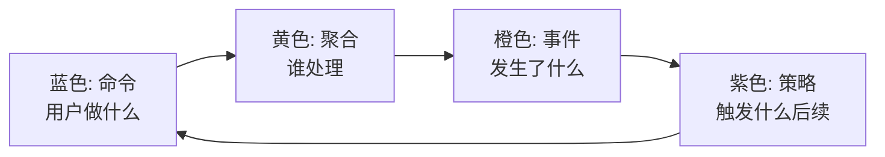

**4 小时工作坊**能产出：

- 业务时间线（事件序列）
- 限界上下文边界
- 聚合候选
- 通用语言词汇表

> §00.2 那次"4 小时对齐"用的就是这套方法。**在墙上贴便利贴**比写需求文档高效 10 倍——所有人**同时贡献、同时看见**。

---

## 08.六边形与整洁架构

### 8.1 端口与适配器

Alistair Cockburn 2005 年提出**六边形架构（Hexagonal Architecture）**：

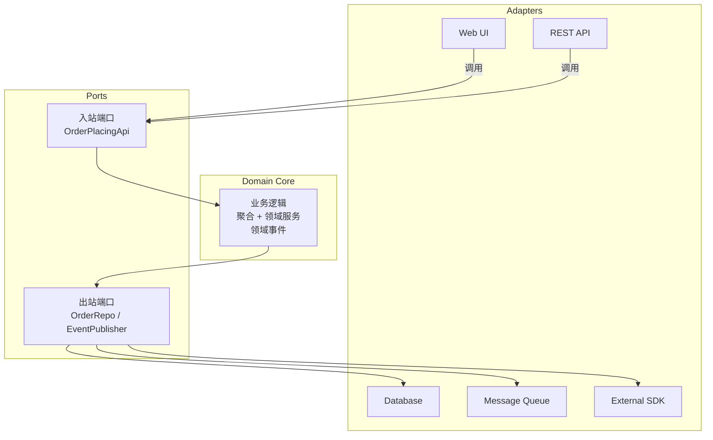

**关键洞见**：

- 内环（Domain）**不知道**外环（Adapters）的存在
- 所有依赖**通过端口（接口）**连接
- 适配器实现端口

### 8.2 依赖方向法则

Robert C. Martin 的**整洁架构**——所有依赖**朝向中心**：

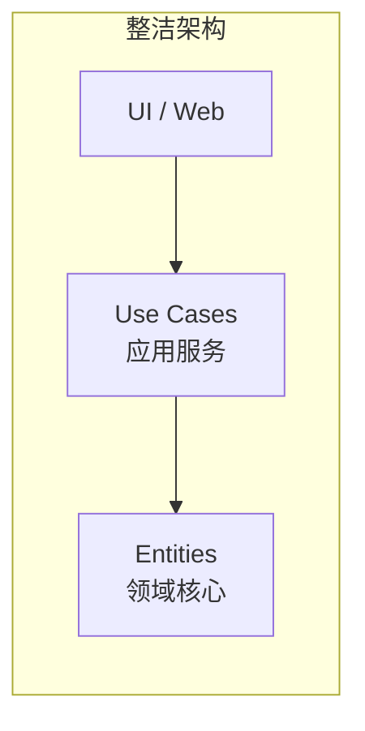

**法则**：

> **源代码依赖必须从外向内单向流动**。内层不能 import 外层。

```java
// ✓ 正确
package com.shop.domain;
public class Order { ... }   // 不依赖任何外部包

// ✗ 错误
package com.shop.domain;
import com.shop.infrastructure.MysqlOrderDao;   // 内层引用外层!
```

### 8.3 与DI/DIP呼应

六边形架构 = **DIP 在系统层的最大化体现**。

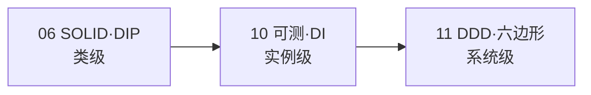

| 层级 | 视角 | 工具 |
|---|---|---|
| 类级 DIP | 高层不依赖低层 | 接口 + 实现分离 |
| 实例级 DI | 测试可替换 | 构造函数注入 |
| 系统级六边形 | 业务核心独立 | 端口与适配器 |

> **三个层级是同一思想的递进**。一个团队能做到第一级容易，做到第三级才算 OOP 大成。

---

## 09.综合案例收束

### 9.1 11篇案例的回顾

整个系列的"电商订单系统"是一棵**演化树**：

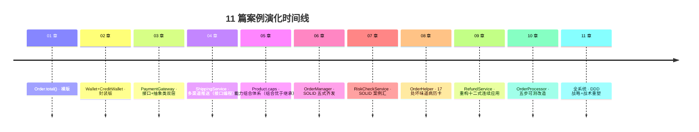

每一章都在**前一章的基础上加一层抽象**。到了第 11 章，我们已经积累了：

- **6 个聚合**（Order / Wallet / Product / Customer / Refund / Risk）
- **20+ 个值对象**（Money / Address / OrderId / Phone / ...）
- **10+ 个领域事件**（OrderPlaced / OrderConfirmed / OrderRefunded ...）
- **50+ 个接口**（PaymentGateway / OrderRepo / RiskProvider ...）

### 9.2 用DDD最终重塑

10 篇我们让 `OrderProcessor` 可测——但**还没有 DDD 的形**。本节最后一次改造：

**Step 1·识别限界上下文**：

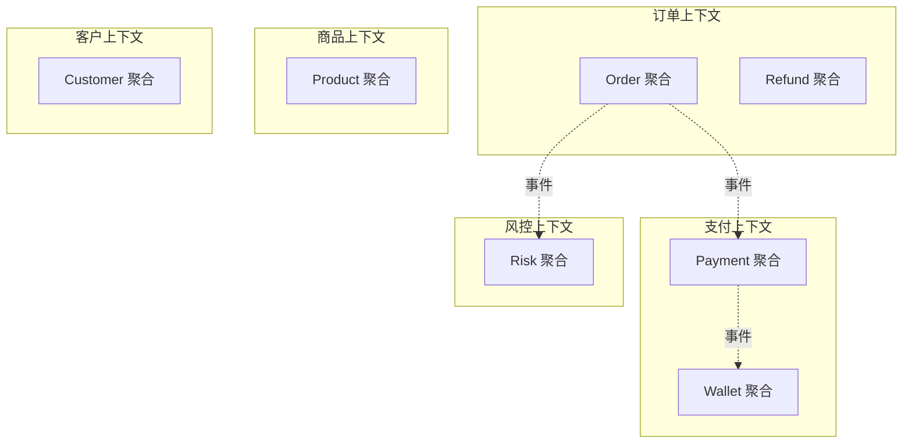

5 个上下文，每个独立演化。

**Step 2·明确每个聚合的不变量**：

```java
class Order {
    /** 不变量:
     * I1: items 非空
     * I2: total = sum(items.subtotal())
     * I3: status 状态机: DRAFT → PAID → SHIPPED → DELIVERED → CLOSED
     * I4: 仅 DRAFT 可改 items
     * I5: 仅 PAID 可发起退款
     */
    public List<DomainEvent> place(...) {
        if (items.isEmpty())          throw new InvariantViolation("I1");
        if (status != DRAFT)           throw new InvariantViolation("I4");
        // ... 守卫所有不变量后,变更状态
        return List.of(new OrderPlaced(...));
    }
}
```

**Step 3·应用服务编排**：

```java
@ApplicationService
class PlaceOrderService {
    @Transactional
    public OrderId place(PlaceOrderCommand cmd) {
        Customer customer = customerRepo.find(cmd.customerId());
        List<Product> products = productRepo.findAll(cmd.productIds());
        
        Order order = Order.create(cmd, customer, products);    // 聚合自治
        List<DomainEvent> events = order.place(...);
        
        orderRepo.save(order);
        eventPublisher.publishAll(events);   // 异步触发其他上下文
        return order.id();
    }
}
```

**Step 4·六边形架构布局**：

```
src/main/java/com/shop/
├── domain/                  ← 内核, 零外部依赖
│   ├── order/
│   │   ├── Order.java
│   │   ├── OrderItem.java
│   │   ├── OrderId.java
│   │   ├── OrderRepository.java        ← 端口接口
│   │   └── OrderPlaced.java            ← 领域事件
│   ├── customer/
│   ├── product/
│   └── shared/
│       └── Money.java
├── application/              ← 用例编排
│   └── order/
│       └── PlaceOrderService.java
├── infrastructure/           ← 适配器实现
│   ├── persistence/
│   │   └── MybatisOrderRepository.java
│   ├── messaging/
│   │   └── KafkaEventPublisher.java
│   └── external/
│       └── AlipayPaymentAdapter.java
└── interfaces/               ← 入站适配器
    ├── rest/
    │   └── OrderController.java
    └── consumer/
        └── PaymentResultConsumer.java
```

**包依赖单向**：interfaces / infrastructure → application → domain。**永远不允许反向**。

### 9.3 完整系统类图

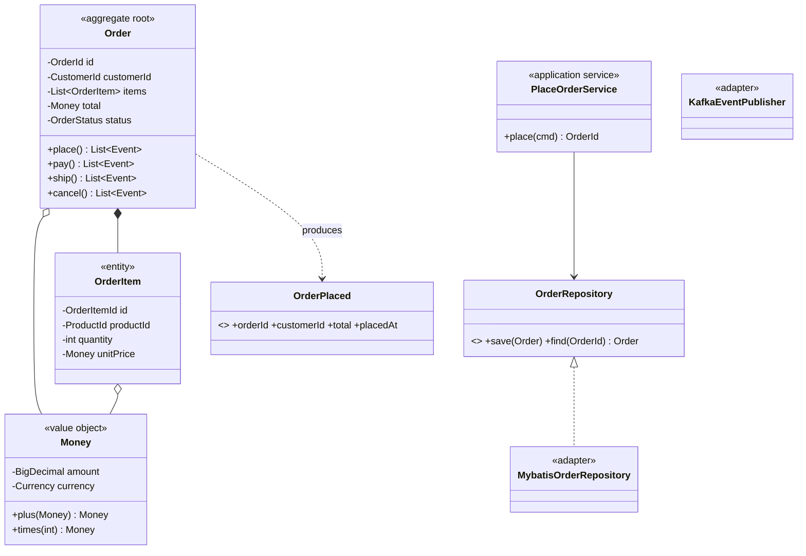

至此，**系列 11 篇所有概念在这一张图里全部就位**：聚合根、实体、值对象、领域事件、端口、适配器、应用服务——是 OOP 的「**最终形态**」。

### 9.4 留下三道终极思考

> 这不是为下一篇留的题，是留给**未来 5 年的你**。

- **🟢 易**：你正在维护的项目里有几个限界上下文? 它们的边界**和团队组织**对得上吗? 如果对不上，是哪一边错了?
- **🟡 中**：把当前最复杂的服务拆成 3 个聚合——一致性外推到应用层后，**事务原子性会被破坏**。你打算用什么机制保证最终一致? Saga? 事务消息? 重试 + 补偿? 三种各有什么代价?
- **🔴 难**：如果要把整个系统重构为**事件溯源**，前置条件是什么? 业务上必须满足什么? 团队上必须满足什么? 工具链上必须满足什么? **如果其中一项不满足，会发生什么样的灾难?** ——这道题，是工程师从"会用 DDD"到"敢决策架构"的分水岭。

---

## 10.系列收束

**11 篇连贯主线回顾**：

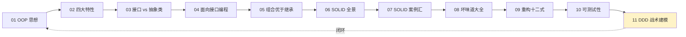

**主线的三个层次**：

| 层次 | 章节 | 解决的问题 |
|---|---|---|
| **形** | 01-05 | 怎么写一个对象 |
| **理** | 06-10 | 怎么让对象组合得健康 |
| **道** | 11 | 业务和代码怎么对齐 |

**一段送给读者的话**：

> **写代码是术，建模业务是道**。
>
> **术让你能完成任务，道让你能设计系统**。
>
> 真正的工程师，是在每一行代码里都在回答两个问题——
>
> 「**这段代码表达了什么业务**?」
>
> 「**5 年后还有人能读懂吗**?」
>
> 而 OOP，从语法到 SOLID 到 DDD，都是为了让这两个问题**有更可靠的答案**。

**进阶推荐**：

| 方向 | 书目 |
|---|---|
| 战术深化 | Vaughn Vernon《实现领域驱动设计》 |
| 战略思维 | Eric Evans《领域驱动设计》 |
| 架构演进 | Mark Richards《软件架构：架构模式与实践》 |
| 重构精进 | Martin Fowler《重构（第 2 版）》 |
| 测试纪律 | Kent Beck《测试驱动开发》 |
| 实战项目 | DDD-Sample（github.com/citerus/dddsample-core） |

最后——OOP 不是答案，是**思考方式**。当你下一次看到一段代码时，希望本系列在你脑中留下的不是规则、不是公式，**是一种习惯**：

> 「这里**应该**是什么样? 它**为什么**长成现在这样? 我**能让它**变得更好吗?」

这种习惯，就是从「会写代码」到「**懂工程**」的距离。

---

🎉 至此，「面向对象设计」系列 11 篇全部完结。  
🔗 配套延伸：[设计模式实战](https://github.com/yangchong211/YCDesignBlog) | [yccoding.com](https://yccoding.com)
