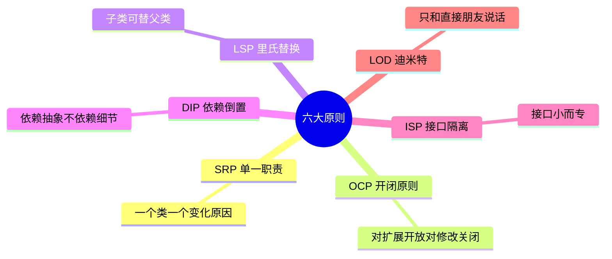
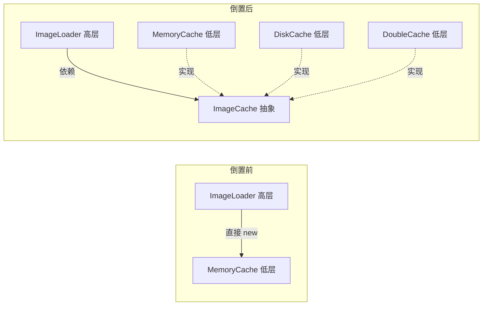
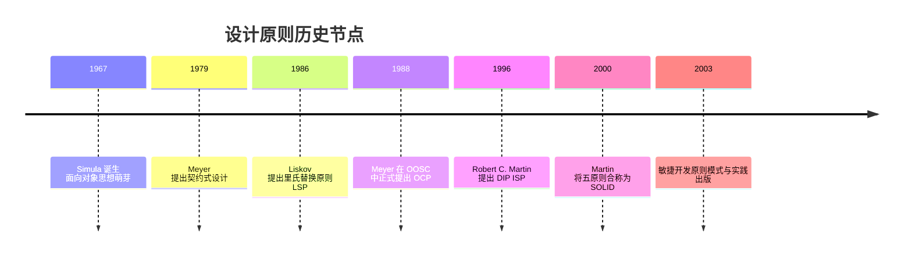
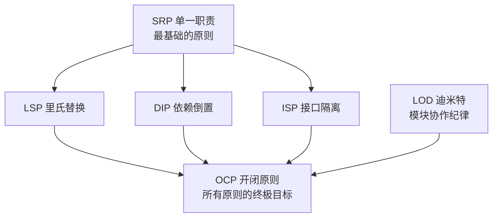

# 第二卷第1章：面向对象六大原则

#### 目录介绍
- [1.工作中的一个真实案例](#1工作中的一个真实案例)
- [2.六大原则总览](#2六大原则总览)
- [3.单一职责原则](#3单一职责原则)
- [4.开闭原则](#4开闭原则)
- [5.里氏替换原则](#5里氏替换原则)
- [6.依赖倒置原则](#6依赖倒置原则)
- [7.接口隔离原则](#7接口隔离原则)
- [8.迪米特法则](#8迪米特法则)
- [9.SOLID的历史由来](#9solid的历史由来)
- [10.六大原则的关系图谱](#10六大原则的关系图谱)
- [11.原则的度量与反模式](#11原则的度量与反模式)
- [12.原则的工业实践](#12原则的工业实践)
- [13.回到开篇的图片加载案例](#13回到开篇的图片加载案例)
- [14.本篇收获](#14本篇收获)
- [15.思考题](#15思考题)
- [16.课后作业](#16课后作业)


## 1.工作中的真实案例

### 1.1 一个上帝类的诞生

做终端开发（Android / iOS / Web / 小程序都一样）最常遇到的一种场景：

> 接手一个列表页的"图片加载"逻辑。最初它只是一个 50 行的工具类，负责"从网络下载图片 → 设置到控件上"。
> 三个月后为了省流量加了**内存缓存**，半年后为了避免重启重新下载又加了**磁盘缓存**，一年后业务方要求线上可以**自定义缓存策略**（有的页面走内存，有的页面走二级缓存，甚至有的页面要走 CDN 预加载）。
> 最终这个类变成了 1200 行的"上帝类"：`if (useMemory) ... else if (useDisk) ... else if (useDouble) ... else if (useCdn) ...`，任何一次需求改动都要在这棵 if-else 森林里小心翼翼地打补丁，每改一次就要提心吊胆地全量回归测试。

这就是真实世界里"小需求把代码堆烂"的典型过程，不是哪个端特有的问题，是**所有终端开发都会踩的坑**。

### 1.2 烂背后的深层原因

如果只说"代码烂"，这是现象。烂背后是三个递进的原因：

- **设计者不知道该什么时候抽象**：第一版只是"下载 + 设 UI"，看不出什么要抽；添加内存缓存时也看不出；直到第三种缓存出现，才发现需要抽——**这时已经走入了“在破东西上面加补丁”的随处联环**。
- **需求变化被误读为“应在原代码中继续套”**：“加个 if 就能进走不同逻辑”表面上能唬人，但它把变化点填进了主流程代码。
- **上下游调用者被隐性耦合**：你改 `ImageLoader` 里一段 `if (useDouble)`，以为只动了一个页面，实际上所有用 `ImageLoader` 的页面都要重测试。

### 1.3 本篇要解决的问题

本篇要解决的问题是：**这同一段图片加载代码，如果从一开始就知道六大原则，它会长成什么样？为什么那样写就能"稳得住"未来三年的需求变化？**

本篇先给一个总览，后面 7 篇逐一深挖每条原则。读完本篇，你至少能回答：六大原则"各自关心什么、彼此怎么配合、在实际项目中怎么落地"。


## 2.六大原则总览



- **单一职责原则 SRP**：一个类的功能要单一，不能包罗万象。
- **开闭原则 OCP**：一个模块在扩展性方面应是开放的，在修改性方面应是封闭的。
- **里氏替换原则 LSP**：子类应当可以替换父类，并出现在父类能够出现的任何位置。
- **依赖倒置原则 DIP**：具体依赖抽象，上层依赖下层的抽象接口。
- **接口隔离原则 ISP**：模块间要通过抽象接口隔开，而不是通过具体的类强行耦合。
- **迪米特法则 LOD**：一个实体应当尽量少地与其他实体发生相互作用，使得系统功能模块相对独立。

下面结合同一个 `ImageLoader` 案例，演示六大原则如何一步步把代码从"上帝类"救出来。


## 3.单一职责原则

### 3.1 原则定义解读

单一职责原则（Single Responsibility Principle，SRP）：**一个类应该仅有一个引起它变化的原因**。说白了就是一个类中应该是"一组相关性很高的函数和数据"的封装。

"如何划分职责"是最容易引起争论的问题，并没有绝对的标准，通常靠经验和业务上下文判断。但有一条基本指导原则：**两个完全不相关的功能，不要放在一个类里**。

### 3.2 实现图片加载

小民接到第一个需求：实现图片加载，并把图片缓存起来。十分钟后小民写下这样的代码：

```java
public class ImageLoader {
    private LruCache<String, Bitmap> cache;
    private ExecutorService executor = Executors.newFixedThreadPool(
            Runtime.getRuntime().availableProcessors());

    public ImageLoader() {
        int max = (int) (Runtime.getRuntime().maxMemory() / 1024);
        cache = new LruCache<>(max / 4);
    }

    public void displayImage(String url, ImageView view) {
        view.setTag(url);
        executor.submit(() -> {
            Bitmap bmp = download(url);                       // 职责 1：下载
            if (bmp != null && url.equals(view.getTag())) {
                view.setImageBitmap(bmp);                     // 职责 2：设到 UI
                cache.put(url, bmp);                          // 职责 3：缓存
            }
        });
    }

    private Bitmap download(String url) { /* HTTP 下载 */ return null; }
}
```

主管一看就指出问题：**"下载、缓存、UI 绑定"三件事挤在一个类里，以后任何一个部分变动都要动这个类**。于是小民把缓存拆出来：

```java
// 专注"缓存"职责
public class ImageCache {
    private final LruCache<String, Bitmap> lru;
    public ImageCache() {
        int max = (int) (Runtime.getRuntime().maxMemory() / 1024);
        lru = new LruCache<>(max / 4);
    }
    public Bitmap get(String url) { return lru.get(url); }
    public void put(String url, Bitmap bmp) { lru.put(url, bmp); }
}

// 专注"加载"职责
public class ImageLoader {
    private final ImageCache cache = new ImageCache();
    private final ExecutorService executor = Executors.newFixedThreadPool(4);

    public void displayImage(String url, ImageView view) {
        Bitmap bmp = cache.get(url);
        if (bmp != null) { view.setImageBitmap(bmp); return; }
        view.setTag(url);
        executor.submit(() -> {
            Bitmap b = download(url);
            if (b != null && url.equals(view.getTag())) {
                view.setImageBitmap(b);
                cache.put(url, b);
            }
        });
    }
    private Bitmap download(String url) { /* ... */ return null; }
}
```

拆完后 `ImageLoader` 只关心"怎么加载"，`ImageCache` 只关心"怎么缓存"。缓存算法未来改成 LFU 也好、接入磁盘也好，都**不会影响 `ImageLoader` 一行代码**——这就是 SRP 的价值。

### 3.3 为什么必须拆开

可能你会问：原来一个类也能跑，什么拆开才是"必须"的？三个原因：

1. **变化频率不同**：下载逻辑、缓存策略、UI 绑定这三件事变化频率及原因都不同。拆开以后，改缓存不会炼上下载，改 UI 不会炼下载。
2. **测试范围不同**：拆开以后缓存能独立单测，`ImageLoader` 能护住不被缓存逻辑炼到。
3. **复用性不同**：`ImageCache` 在别的需求中可以独立复用（比如、你可能会调用东西不仅仅带图片，还可能调用资源。那样可以调用 `ImageCache` 。 ）。

**这三个原因任何一个成立，都足以拆开**。不是为了 SRP 而 SRP，是为了判断为什么要拆。


## 4.开闭原则

### 4.1 原则定义解读

开闭原则（Open-Closed Principle，OCP）：**对扩展开放，对修改关闭**。产品一定会变，但变化应当通过"加新类"而不是"改老类"来实现。

### 4.2 添加磁盘缓存

用户反馈"重启后缓存就没了"，小民加了磁盘缓存，顺手加个开关：

```java
public class ImageLoader {
    private ImageCache memCache = new ImageCache();
    private DiskCache  diskCache = new DiskCache();
    private boolean useDisk = false;
    private boolean useDouble = false;

    public void displayImage(String url, ImageView view) {
        Bitmap bmp;
        if (useDouble)      bmp = doubleGet(url);    // if-else 开始繁殖
        else if (useDisk)   bmp = diskCache.get(url);
        else                bmp = memCache.get(url);
        if (bmp != null) view.setImageBitmap(bmp);
        // else 下载...
    }
    public void useDiskCache(boolean v)   { useDisk = v; }
    public void useDoubleCache(boolean v) { useDouble = v; }
    private Bitmap doubleGet(String url) { /* ... */ return null; }
}
```

主管又来了：**每次加一种缓存就要改 `ImageLoader`，用户还没法自定义缓存**。问题的根源是：`ImageLoader` 和"具体的缓存实现"绑死了。解法是把"缓存"抽象成接口：

```java
// 抽象：缓存规范
public interface ImageCache {
    Bitmap get(String url);
    void put(String url, Bitmap bmp);
}

// 实现 1：内存
public class MemoryCache implements ImageCache { /* ... */ }

// 实现 2：磁盘
public class DiskCache implements ImageCache { /* ... */ }

// 实现 3：双级（组合内存 + 磁盘）
public class DoubleCache implements ImageCache {
    private final ImageCache mem = new MemoryCache();
    private final ImageCache disk = new DiskCache();
    public Bitmap get(String url) {
        Bitmap b = mem.get(url);
        return b != null ? b : disk.get(url);
    }
    public void put(String url, Bitmap bmp) { mem.put(url, bmp); disk.put(url, bmp); }
}

// ImageLoader 依赖抽象
public class ImageLoader {
    private ImageCache cache = new MemoryCache();
    public void setImageCache(ImageCache c) { this.cache = c; }
    public void displayImage(String url, ImageView view) {
        Bitmap b = cache.get(url);
        if (b != null) view.setImageBitmap(b);
        // else 下载 + cache.put...
    }
}
```

用法变得极简：

```java
ImageLoader loader = new ImageLoader();
loader.setImageCache(new MemoryCache());
loader.setImageCache(new DiskCache());
loader.setImageCache(new DoubleCache());
loader.setImageCache(new ImageCache() { /* 用户自定义 */
    public Bitmap get(String url) { return null; }
    public void put(String url, Bitmap bmp) { }
});
```

至此 `ImageLoader` **再也不会因为"新增缓存策略"而被修改**，这就是 OCP。

### 4.3 为何抽象能隔离变化

这里背后的逻辑是：**变化总会发生，问题不是"防变化"而是"压住变化的范围"**。原来一个 if-else 迫使 `ImageLoader` 重新编译、重新测试；抽象之后，变化被仅限缩在“新加一个类”这件事上。

同时有一个必要提醒：**OCP 不是说"一行原代码都不能动"**。“在一个新文件里加一个 `XxxCache implements ImageCache`” 是 “扩展”，是 OCP 鼓励的。“displayImage 里增加一个 if (useXxx)” 是 “修改”，是 OCP 鼓励避免的。**区别在于：动不动主流程代码、需不需要重跑原有回归、会不会拖别人下水**。


## 5.里氏替换原则

### 5.1 原则定义解读

里氏替换原则（Liskov Substitution Principle，LSP）：**所有引用基类的地方，必须能透明地替换为子类的对象**。一句话：**子类替父类，行为不能变坏**。

LSP 与多态相伴相生——没有多态就谈不上 LSP，但有多态不等于自动满足 LSP：**子类能不能"无痛"地替父类上阵，取决于它有没有守住父类的契约**。

### 5.2 用 LSP 看 ImageCache 体系

```java
// 所有缓存实现都必须能"无痛"替换 ImageCache
ImageCache cache = new MemoryCache();   // ✅
cache = new DiskCache();                // ✅
cache = new DoubleCache();              // ✅
loader.setImageCache(cache);            // 调用方毫无感知
```

只要每个子类都老老实实地实现 `get/put` 的语义（put 后应当能 get 出来），`ImageLoader` 就不用关心它拿到的是内存、磁盘还是双级缓存——这正是 OCP 得以成立的前提。如果某个子类把 `put` 实现成"什么都不做"，那就是在**欺骗调用者**——虽然语法上通过了编译，但实际行为破坏了 LSP，`ImageLoader` 的缓存功能会在这个实现上静默失效。

**LSP 的本质是契约守护**，后续《04.里式替换原则介绍》一篇会专门讲契约的四条细则。

## 6.依赖倒置原则

### 6.1 原则定义解读

依赖倒置原则（Dependency Inversion Principle，DIP）：
- 高层模块不应该依赖低层模块，两者都应该依赖其抽象；
- 抽象不应该依赖细节，细节应该依赖抽象。

一句话：**面向接口编程**。

### 6.2 为什么叫"倒置"

"正常"的依赖方向是：高层用到低层，高层就 `new` 一个低层。引入抽象后，低层**反过来**去实现高层定义的接口，依赖箭头被"倒"了一下。



### 6.3 回到图片加载

OCP 那一节的最终版 `ImageLoader` 其实就已经满足了 DIP——它持有的是 `ImageCache` 抽象，而不是任何具体类。**DIP 是 OCP 能够成立的技术基础**，这两条原则通常一起出现。

```java
public class ImageLoader {
    private ImageCache cache;                       // 依赖抽象
    public void setImageCache(ImageCache c) {       // 依赖注入
        this.cache = c;
    }
    // ...
}
```


## 7.接口隔离原则

### 7.1 原则定义解读

接口隔离原则（Interface Segregation Principle，ISP）：**客户端不应该依赖它不需要的接口**。换一种说法：**类间的依赖关系应该建立在最小的接口上**。

ISP 的目的是：让大接口拆成若干小接口，客户端只感知它关心的那部分，从而降低耦合、便于重构。

### 7.2 CloseUtils：一个典型的 ISP 应用

Java 6 时代关资源要写一大串 `try-finally`，小民把它封装成工具：

```java
public final class CloseUtils {
    private CloseUtils() {}

    public static void closeQuietly(Closeable c) {
        if (c == null) return;
        try { c.close(); } catch (IOException ignored) {}
    }
}
```

这里 `closeQuietly` 只依赖 `Closeable` **这一个最小接口**——它不关心 `FileOutputStream` 有 `write` 方法、不关心 `Socket` 有 `shutdown` 方法，它只要"能关闭"。`Closeable` 就是一个**被隔离到极致的角色接口**。

```java
// 用起来干净利落
public void put(String url, Bitmap bmp) {
    FileOutputStream fos = null;
    try {
        fos = new FileOutputStream(cacheDir + url);
        bmp.compress(Bitmap.CompressFormat.PNG, 100, fos);
    } catch (IOException e) {
        e.printStackTrace();
    } finally {
        CloseUtils.closeQuietly(fos);
    }
}
```

`ImageCache` 接口之所以设计成只有 `get / put` 两个方法，也是 ISP 的体现——不把"缓存清理 / 统计 / 预热"这些**调用方不需要**的能力塞给 `ImageLoader` 看到。


## 8.迪米特法则

### 8.1 原则定义解读

迪米特法则（Law of Demeter，LOD，也称最少知识原则 LKP）：**一个对象应该对其他对象有最少的了解**。

更形象的说法是：**Only talk to your immediate friends**——只和直接朋友说话，不要和陌生人说话。

### 8.2 租房的例子

租户只想要房（面积、价格），不该直接去摸中介手里的 `Room` 列表：

```java
// ❌ 违反 LOD：Tenant 直接遍历 Room，知道了太多"陌生人"的细节
public class Tenant {
    public void rentRoom(Mediator mediator) {
        for (Room r : mediator.getAllRooms()) {
            if (isSuitable(r)) { System.out.println("租到啦: " + r); break; }
        }
    }
    private boolean isSuitable(Room r) { /* 比较面积、价格 */ return true; }
}
```

```java
// ✅ 遵循 LOD：Tenant 只和 Mediator（直接朋友）沟通
public class Mediator {
    private final List<Room> rooms = new ArrayList<>();
    public Room rentOut(float area, float price) {
        return rooms.stream()
                    .filter(r -> isSuitable(r, area, price))
                    .findFirst().orElse(null);
    }
    private boolean isSuitable(Room r, float area, float price) { /* ... */ return true; }
}
public class Tenant {
    public void rentRoom(Mediator m, float area, float price) {
        System.out.println("租到啦: " + m.rentOut(area, price));
    }
}
```

同样的思想运用到 `ImageLoader`：上层业务只认识 `ImageCache`，根本不知道底下是 `DiskLruCache` 还是 `OkHttp` 缓存在顶班。底层实现随便换，上层毫无感知——这就是 LOD 带来的稳定性。


## 9.SOLID的历史由来

### 9.1 为什么会有设计原则

20 世纪 60-70 年代，随着软件规模急剧膨胀，出现了"软件危机"——项目延期、预算超支、Bug 难以修复成为常态。1968 年 NATO 软件工程会议首次正式提出"软件工程"概念，标志着人们开始系统性地思考如何写出"好"代码。

从结构化编程（Dijkstra, 1968）→ 面向对象编程（Simula, 1967；Smalltalk, 1972）→ 设计原则（1980s-2000s），软件工程走了一条"关注计算 → 关注结构 → 关注变化"的演进路径。



### 9.2 SOLID 命名由来

SOLID 是五个设计原则英文首字母的缩写，由 Robert C. Martin（"Uncle Bob"）在 2000 年前后整合提出：

| 字母 | 原则 | 英文全称 | 提出者 | 年份 |
|---|---|---|---|---|
| **S** | 单一职责 | Single Responsibility Principle | Robert C. Martin | 2003 |
| **O** | 开闭原则 | Open-Closed Principle | Bertrand Meyer | 1988 |
| **L** | 里氏替换 | Liskov Substitution Principle | Barbara Liskov | 1986 |
| **I** | 接口隔离 | Interface Segregation Principle | Robert C. Martin | 1996 |
| **D** | 依赖倒置 | Dependency Inversion Principle | Robert C. Martin | 1996 |

迪米特法则（Law of Demeter，1987）不属于 SOLID，但与之并称为"六大原则"。


## 10.六大原则的关系图谱

### 10.1 原则协同关系



### 10.2 一条完整的设计逻辑链

1. **SRP** 是基石：先把类拆"小"，每个类只做一件事；
2. **LSP** 是手段：保证子类能安全替换父类；
3. **ISP** 是约束：接口精简，不强迫依赖不需要的方法；
4. **DIP** 是架构：高层不依赖低层，都依赖抽象；
5. **OCP** 是目标：系统能通过扩展而非修改来演进；
6. **LOD** 是纪律：模块间最少知识，降低耦合。

### 10.3 一句话记忆

| 原则 | 一句话核心 | 关键词 |
|---|---|---|
| SRP | 一个类只因一个原因而变化 | 职责单一 |
| OCP | 新增功能靠扩展，不靠修改 | 抽象扩展 |
| LSP | 子类替父类，行为不变 | 契约守护 |
| ISP | 接口小而专，不强迫实现 | 精简隔离 |
| DIP | 依赖抽象，不依赖实现 | 面向接口 |
| LOD | 只和直接朋友通信 | 最少知识 |


## 11.原则的度量与反模式

### 11.1 坏味道与原则对照

| 代码坏味道 | 可能违反的原则 | 改进方向 |
|---|---|---|
| 一个类超过 500 行 | SRP | 拆成多个职责单一的类 |
| 新增功能要改多处旧代码 | OCP | 引入抽象层和扩展点 |
| 子类覆写父类方法后行为异常 | LSP | 重新设计继承关系 |
| 实现接口时有大量空方法 | ISP | 将大接口拆分为小接口 |
| 高层类直接 `new` 低层类 | DIP | 引入接口和依赖注入 |
| 一个类需要了解多个不相关类的细节 | LOD | 引入中介者或门面 |

### 11.2 过度设计的信号

- 简单功能拆成十几个类，看代码需要来回跳转；
- 所有地方都抽了接口，但每个接口只有一个实现；
- 用了很多设计模式，但说不清"为什么要用"；
- 代码"很优雅"但新人完全看不懂。

**平衡三原则**：
- **KISS**（Keep It Simple, Stupid）：保持简单；
- **YAGNI**（You Ain't Gonna Need It）：你不会需要它；
- **Rule of Three**：重复三次再抽象。

### 11.3 原则的冲突与权衡

```
SRP 要求拆分   ←→   拆多了增加复杂度
OCP 不修改    ←→   简单修改有时比抽象更合理
ISP 拆接口   ←→   拆多了增加维护成本
DIP 依赖抽象 ←→   简单场景直接依赖实现更清晰
```

> 设计原则是**指导方针**，不是**法律条文**。**最好的设计是刚刚好的设计**。


## 12.原则的工业实践

### 12.1 Spring 中的 SOLID 体现

| 原则 | Spring 中的体现 |
|---|---|
| SRP | `@Controller / @Service / @Repository` 分层，每层职责单一 |
| OCP | `BeanPostProcessor` 提供扩展点，不改核心就能扩展 |
| LSP | 任何 `ApplicationContext` 子类都可以替换父类 |
| ISP | `BeanFactory`（基础）vs `ApplicationContext`（增强）分层接口 |
| DIP | 核心机制就是依赖注入（`@Autowired`） |
| LOD | IoC 容器管理对象关系，组件之间不直接创建依赖 |

### 12.2 Unix 哲学与设计原则

```
Do one thing and do it well          → SRP
Write programs to work together      → ISP + LOD
Everything is a file                 → DIP（统一文件抽象）
管道机制 ls | grep | sort             → OCP（通过组合扩展功能）
```


## 13.回到开篇的图片加载案例

回头看文章开头那个 1200 行的"图片加载上帝类"，套用六大原则再看一遍，问题就一清二楚了：

| 症状 | 违反的原则 | 解法 |
|---|---|---|
| 下载、缓存、回调、UI 设置全挤在一起 | SRP | 拆成 `Downloader / Cache / ImageBinder` 三件事 |
| 每加一种缓存都要改 `if-else` | OCP | 把缓存抽象成接口，新策略"加类不改类" |
| 某些子类的缓存悄悄改变父类语义 | LSP | 统一 `Cache.get/put` 契约，子类不能破坏 |
| `ImageCache` 一次塞了清理、统计、预热等上层不关心的方法 | ISP | 按角色拆成若干小接口 |
| `ImageLoader` 里 `new MemoryCache()` 硬编码 | DIP | 通过构造函数/Setter 注入 `Cache` 抽象 |
| 出现 `loader.getCache().getDisk().getFile().getPath()` | LOD | 在 `loader` 上提供聚合方法，内部细节不外泄 |

六大原则不是六块独立的规则，它们是**从六个角度检查同一段代码的六把尺子**。一段好代码，六把尺子都量得过去。


## 14.本篇核心收获总结

- **一张知识地图**：知道 SOLID + LOD 各自在解决什么、彼此怎么协作、谁是基础、谁是目标、谁是手段、谁是纪律。
- **一个诊断工具**：再看自己项目里的代码，能说出它"违反了哪条原则、应该往哪个方向改"，而不是只会说"感觉乱"。
- **一条学习主线**：接下来 7 篇每篇只聚焦一个原则，节奏是"工作案例 → 原则 → 由浅入深演进 → 回到案例 → 思考题 → 作业"，每篇都围绕同一类终端开发场景展开，读完能形成闭环。


## 15.三道思考题

1. **识别题**：手头任意一段超过 300 行的类，列出它"有几个会引起它变化的外部原因"。如果超过 1 个，它违反了哪条原则？
2. **辨析题**：LSP 和多态是同一件事吗？为什么有多态的语言（Java/Kotlin）仍然需要 LSP 作为单独的原则？提示：从"语法"和"契约"两个角度思考。
3. **权衡题**：如果一个功能全项目只会有一种实现，未来几乎确定不会变，还值得为它抽一层接口（DIP）吗？结合 YAGNI 给出你的判断标准。


## 16.课后实战作业

在你当前项目里找一段自己或同事写的、**自己都觉得"有点乱"**的代码（建议 200~500 行的类），完成下面三步：

1. **画一张依赖图**：这段代码依赖了哪些类、被哪些类依赖，画成箭头图。
2. **打一份六原则体检表**：对 SRP / OCP / LSP / ISP / DIP / LOD 各写一句"它在这段代码里被满足 / 被违反了，证据是哪一行"。
3. **只选一条原则**做一次最小重构：不要一次全改，只挑违反最明显的那一条，用本篇提到的手段做最小改动，然后跑一遍原有测试，确认行为不变。

做完这 3 步，再进入下一篇《02.单一职责原则详解》，体验"把拆分这一步做到位"的感觉。

