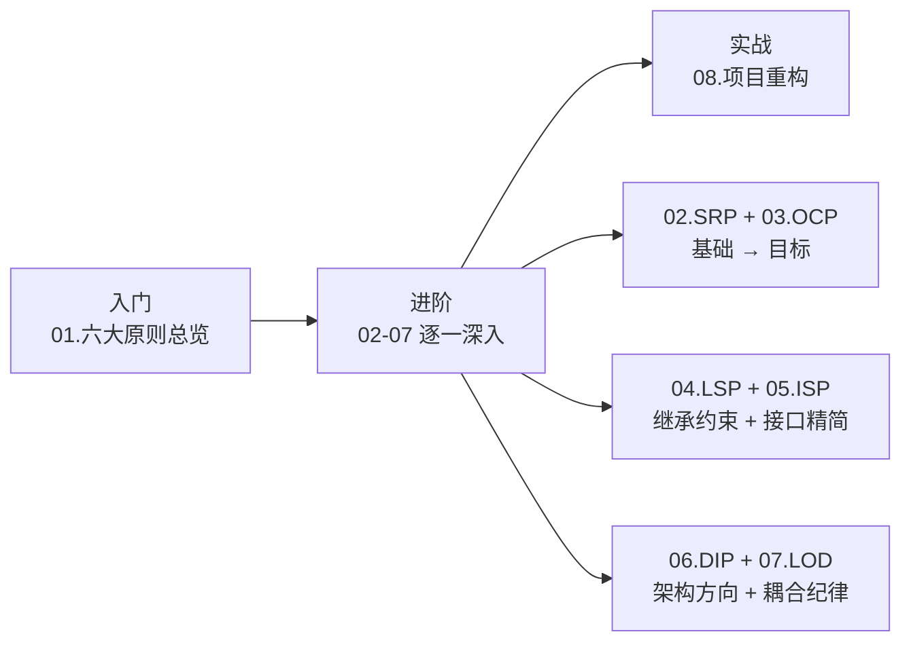
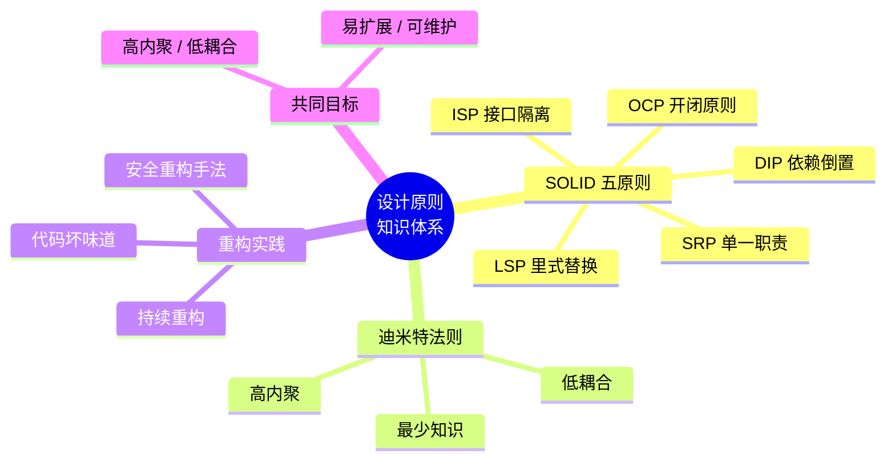
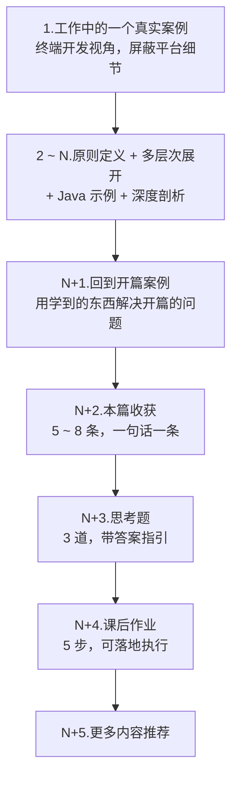

# 常见设计原则系列

## 1.系列概述

本系列深入讲解面向对象设计的 **六大原则（SOLID + 迪米特法则）**，并在最后一篇落到 **项目重构** 的实战方法论上。从原则的历史由来、核心思想、Java 代码实践到工业级应用，帮助读者建立一套完整的设计思维体系。

- **适合人群**：有一定 Java 基础、希望提升代码设计能力的开发者。
- **代码语言**：统一使用 **Java**，保证示例前后一致、可直接迁移到工程中。
- **编排方式**：每篇从一个工作中的真实案例切入，结尾回到该案例，形成闭环。

## 2.学习路线图

## 3.文档索引

| 序号 | 文档 | 核心内容 | 关键词 |
|------|------|---------|--------|
| 01 | [面向对象六大原则](01.面向对象六大原则.md) | SOLID 历史由来、ImageLoader 案例演进、原则关系图谱 | 总览、历史、协同 |
| 02 | [单一职责原则详解](02.单一职责原则详解.md) | SRP 定义、方法 / 接口 / 类 / 模块四层面、内聚度量化 | SRP、内聚、拆分 |
| 03 | [开闭原则详细介绍](03.开闭原则详细介绍.md) | OCP 定义、Meyer vs Martin、折扣策略案例、插件式架构 | OCP、扩展、抽象 |
| 04 | [里式替换原则介绍](04.里式替换原则介绍.md) | LSP 定义、契约式设计、正方形悖论、协变逆变、四条核心规则 | LSP、契约、继承 |
| 05 | [接口隔离原则介绍](05.接口隔离原则介绍.md) | ISP 定义、角色接口 vs 头接口、API 设计、粒度度量 | ISP、角色接口 |
| 06 | [依赖倒置原则介绍](06.依赖倒置原则介绍.md) | DIP 定义、"倒置"详解、三个层次、IoC 容器、整洁架构 | DIP、IoC、抽象 |
| 07 | [迪米特原则介绍](07.迪米特原则介绍.md) | LOD 定义、火车残骸反模式、门面模式、事件驱动解耦 | LOD、解耦、朋友 |
| 08 | [项目重构演进之路](08.项目重构演进之路.md) | 22 种代码坏味道、圈复杂度、重构 Checklist、设计原则 ↔ 重构手法映射 | 重构、坏味道、度量 |

## 4.核心知识图谱

## 5.六大原则速记

| 原则 | 一句话 | 核心关键词 |
|------|--------|-----------|
| **S**RP | 一个类只有一个变化原因 | 职责单一 |
| **O**CP | 对扩展开放，对修改关闭 | 抽象扩展 |
| **L**SP | 子类替换父类，行为不变 | 契约守护 |
| **I**SP | 接口小而专，不强迫依赖 | 精简隔离 |
| **D**IP | 依赖抽象，不依赖实现 | 面向接口 |
| LOD | 只和直接朋友通信 | 最少知识 |

## 6.本专栏的统一结构

为了让整个专栏 **前后连贯、由浅入深、风格统一**，每一篇（01 ~ 08）都按下面这套骨架编排，方便对照阅读：

## 7.各篇工作案例速览

| 序号 | 工作案例 | 痛点 | 对应原则 |
|------|---------|------|---------|
| 01 | 图片加载类从 50 行膨胀到 1200 行 | 上帝类、不可维护 | SOLID 综合 |
| 02 | 2000 行的"详情页上帝类" | 改动扩散、测试难 | SRP |
| 03 | 促销折扣 if-else 从 V1 堆到 V5 | 每加一种促销就动老代码 | OCP |
| 04 | `PhoneInput` 继承 `BaseInput` 静默吞事件 | 子类不能替换父类 | LSP |
| 05 | 30 方法胖 SDK，新增方法编译全炸 | 实现者被迫关心无关方法 | ISP |
| 06 | 380 处 import 第三方网络库，换库改两个月 | 上层依赖下层细节 | DIP |
| 07 | `getUser().getAddress().getCity()` 抄到 31 个文件 | 穿透对象图，牵一发动全身 | LOD |
| 08 | "首页 tab 从 4 改 5"花了 4 天 | 债滚债、无测试、无度量 | 重构 |

## 8.推荐的阅读路径

**按顺序阅读**（强烈推荐，适合系统学习）：

**按问题驱动**（适合带着痛点来查）：

- 代码臃肿、类太大 → 02 SRP
- 每加功能都要改老代码 → 03 OCP
- 继承用错了、子类出 bug → 04 LSP
- 接口太胖、空实现一堆 → 05 ISP
- 想换底层实现但改不动 → 06 DIP
- 链式调用穿透对象图 → 07 LOD
- 老项目积了一屁股债 → 08 重构

**按角色定位**：

- **初级开发**：01 → 02 → 03，先掌握 SRP / OCP 两大基石
- **中级开发**：全部 8 篇按顺序
- **高级开发 / 架构**：重点看每篇的"深度剖析"与 08 重构
- **Code Reviewer**：重点看每篇的"反模式 / 坏味道"清单

## 9.建议的学习节奏

> **每天 1 小时，8 天学完**：每天 1 篇，读完正文后 **务必完成当天的思考题和课后作业**——读懂和会用之间隔着作业量。

> **每周 1 篇，渐进内化**：每周选 1 篇，把作业落地到自己的项目里。8 周后你会发现，同一个项目的新增代码风格已经发生了根本变化。
