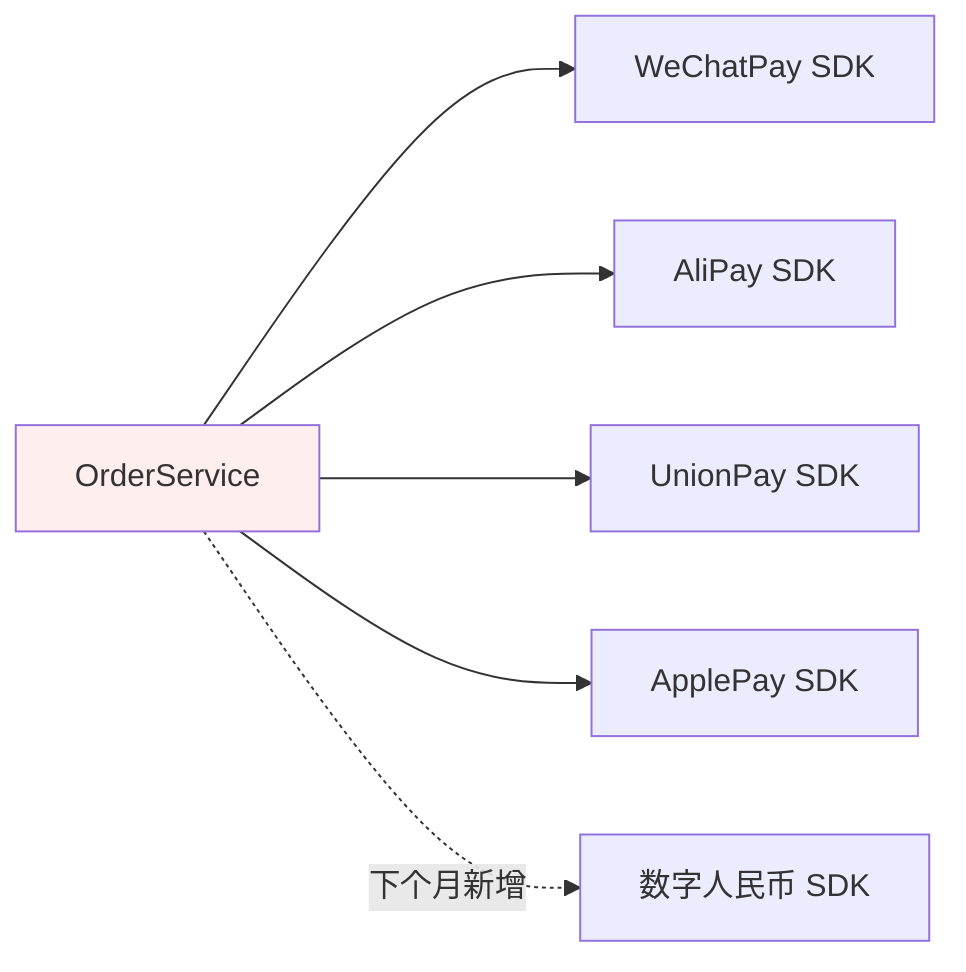
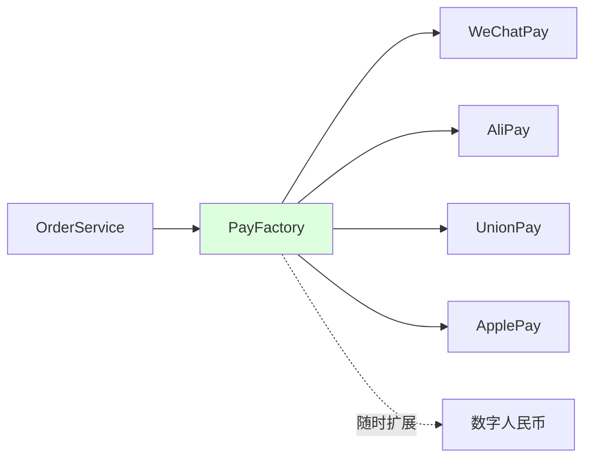
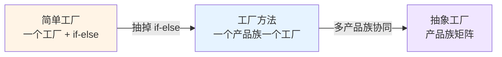
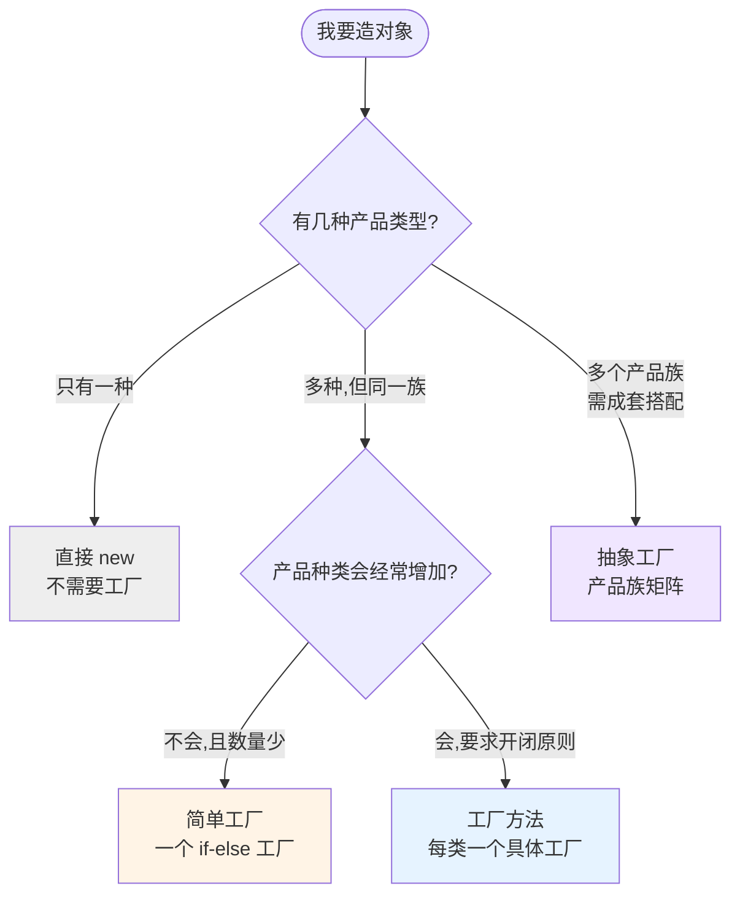
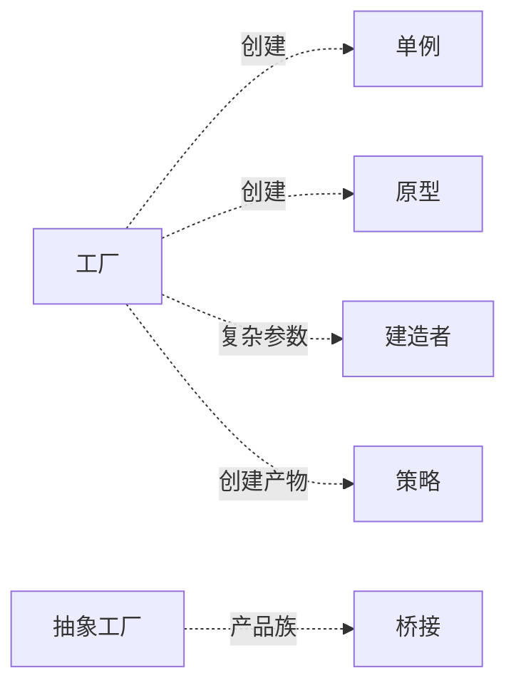

# 第三卷第2章：工厂模式设计思想

> **📚 本篇渐进学习节奏（建议按顺序食用）**
>
> 1. **第 01 节 · 案例引入** — 看一段"凌晨支付事故"的真实代码，先感受痛
> 2. **第 02 节 · 模式总览** — 工厂三件套的演化路线图（简单 → 方法 → 抽象）
> 3. **第 03 节 · 简单工厂** — 把 if-else 抽出来，享受第一波红利
> 4. **第 04 节 · 工厂方法** — 简单工厂的开闭原则被打脸，进化为多态工厂
> 5. **第 05 节 · 抽象工厂** — 当产品"成族出现",工厂方法也救不了
> 6. **第 06 节 · 总结决策** — 三种工厂如何选？什么时候反而不该用？
>
> 阅读到任何一节卡壳，直接跳回上一节复盘场景；本篇代码均可直接运行。

#### 目录介绍
- [01.案例引入与思考](#01案例引入与思考)
    - [1.1 痛点场景](#11-痛点场景)
    - [1.2 它哪里不舒服](#12-它哪里不舒服)
    - [1.3 引出本篇主角](#13-引出本篇主角)
- [02.工厂模式设计](#02工厂模式设计)
    - [2.1 工厂模式类型](#21-工厂模式类型)
    - [2.2 工厂模式思考](#22-工厂模式思考)
    - [2.3 思考一个题目](#23-思考一个题目)
- [03.简单工厂介绍](#03简单工厂介绍)
    - [3.1 简单工厂背景](#31-简单工厂背景)
    - [3.2 简单工厂定义](#32-简单工厂定义)
    - [3.3 简单工厂结构](#33-简单工厂结构)
    - [3.4 简单工厂案例](#34-简单工厂案例)
    - [3.5 简单工厂分析](#35-简单工厂分析)
    - [3.6 简单工厂场景](#36-简单工厂场景)
    - [3.7 简单工厂不足](#37-简单工厂不足)
- [04.工厂方法介绍](#04工厂方法介绍)
    - [4.1 工厂方法背景](#41-工厂方法背景)
    - [4.2 工厂方法定义](#42-工厂方法定义)
    - [4.3 工厂方法结构](#43-工厂方法结构)
    - [4.4 工厂方法案例](#44-工厂方法案例)
    - [4.5 工厂方法分析](#45-工厂方法分析)
    - [4.6 工厂方法场景](#46-工厂方法场景)
    - [4.7 工厂方法不足](#47-工厂方法不足)
- [05.抽象工厂介绍](#05抽象工厂介绍)
    - [5.1 抽象工厂背景](#51-抽象工厂背景)
    - [5.2 抽象工厂定义](#52-抽象工厂定义)
    - [5.3 抽象工厂结构](#53-抽象工厂结构)
    - [5.4 抽象工厂案例](#54-抽象工厂案例)
    - [5.5 抽象工厂分析](#55-抽象工厂分析)
    - [5.6 抽象工厂场景](#56-抽象工厂场景)
    - [5.7 抽象工厂不足](#57-抽象工厂不足)
- [06.工厂模式总结](#06工厂模式总结)
    - [6.1 工厂设计总结](#61-工厂设计总结)
    - [6.2 如何选择](#62-如何选择)
    - [6.3 模式联动与边界](#63-模式联动与边界)


## 01.案例引入与思考

> **本篇主线**：日常开发中最常见的"对象创建分支爆炸"

### 1.1 痛点场景

> **🔥 模拟事故复盘 · 双 11 凌晨 0:47**
>
> 大促首小时，运营紧急通知："Apple Pay 渠道密钥 30 分钟前过期了，必须立即接入苹果新发的 V2 SDK！"
> 接手的同事打开 `OrderService.pay()`，往里塞了第 5 个 `else if`，连带把"WeChatPay 用了 3 年的旧构造方式"一起改了。
> 1 分钟后灰度上线 — **微信支付雪崩，订单全量失败**。
> 排查发现：他在改 ApplePay 分支时，无意中把上面 WeChatPay 的 `setMchId` 顺序挪了一下，触发了 SDK 内部一个隐藏校验。
>
> **事故根因不在 ApplePay，而在"创建逻辑塞在业务类里，改一个动全身"。**

代码长这样（事故现场原貌）：

```java
public class OrderService {
    public void pay(String type, BigDecimal money) {
        if ("wechat".equals(type)) {
            WeChatPay pay = new WeChatPay();
            pay.setAppId("wx123");
            pay.setMchId("...");
            pay.connect();
            pay.charge(money);
        } else if ("alipay".equals(type)) {
            AliPay pay = new AliPay();
            pay.setAppId("ali123");
            pay.setPrivateKey("...");
            pay.connect();
            pay.charge(money);
        } else if ("unionpay".equals(type)) {
            // ... 又是 5 行初始化
        } else if ("applepay".equals(type)) {
            // ... 又是 5 行初始化
        }
    }
}
```

画一张依赖图，瞬间就能看出问题：



业务类被 4+ 个三方 SDK 紧紧绑死，每加一个就要回来改它 — 而**这里改一行，可能错在十米之外**。

### 1.2 它哪里不舒服

- ❌ **业务方背了创建逻辑**：`OrderService` 本来只关心"下单 + 调用支付"，结果把 4 种支付的 SDK 初始化、密钥、连接全揽下来了；
- ❌ **改一个就影响全员**：明天接入"数字人民币"，必须翻进 `OrderService` 加 `else if`，违反开闭原则；
- ❌ **测试灾难**：想测下单流程，必须把 4 个三方 SDK 一起 Mock，单元测试瞬间膨胀；
- ❌ **SDK 升级风险扩散**：`WeChatPay` 构造参数变了，所有写过 `new WeChatPay()` 的地方都要改。

> 这类 "**根据条件选择不同对象**、**对象创建过程复杂**、**调用方不该关心怎么造**" 的场景，正是工厂模式的主战场。

### 1.3 引出本篇主角

> **工厂模式的核心思想**：把"new 谁、怎么 new"这件事从业务里抽离，封装到一个专门的工厂里。调用方只说"我要哪一类"，剩下的留给工厂。



工厂模式不是一个模式，而是三件套——**简单工厂、工厂方法、抽象工厂**，它们沿着"灵活度↑ / 复杂度↑"的轴一步步演化。本篇按这条演化路径讲清楚每一步在解决什么、付出什么。



---

## 02.工厂模式设计
### 2.1 工厂模式类型

一般情况下，工厂模式分为三种更加细分的类型：简单工厂、工厂方法和抽象工厂。

不过，在 GoF 的《设计模式》一书中，它将简单工厂模式看作是工厂方法模式的一种特例，所以工厂模式只被分成了工厂方法和抽象工厂两类。

实际上， 在这三种细分的工厂模式中，简单工厂、工厂方法原理比较简单，在实际的项目中也比较常用。而抽象工厂的原理稍微复杂点，在实际的项目中相对也不常用。

### 2.2 工厂模式思考

讲解的重点也不是原理和实现，因为这些都很简单，重点还是带你搞清楚应用场景。什么时候该用工厂模式？相对于直接 new 来创建对象，用工厂模式来创建究竟有什么好处呢？


### 2.3 思考一个题目
你现在是一个做咖啡的老板。你要在店里买各种咖啡，而这些咖啡中有的加冰，有的加奶，有的加糖。比如美式咖啡，拿铁咖啡，摩卡咖啡，巴西咖啡等等！你需要设计一个咖啡店点餐系统！

**简单工厂实现**：设计一个咖啡类（Coffee），并定义其两个子类（美式咖啡AmericanCoffee和拿铁咖啡LatteCoffee）；再设计一个咖啡店类（CoffeeStore），咖啡店具有点咖啡的功能。

1. 创造抽象产品角色，比如总结出很多咖啡都可能会，加糖，加冰，加奶，因此把它抽成抽象方法。
2. 具体产品角色，这块有：美式咖啡类，拿铁咖啡类，摩卡咖啡等，这些都是具体的咖啡产品。
3. 工厂角色。负责创建不同咖啡，为了简便高效地分配咖啡，设了根据类型（比如`american`，`latte`）来提供不同的咖啡。

新增需求1: 后期我想要再增加一个或者多个新的咖啡，简单工厂这个案例则需要修改工厂角色，这个违背了开闭原则。那有什么好的方式解决呢？可以用工厂方法模式。

**工厂方法实现**：

1. Product：抽象产品。这个和简单工厂模式代码一样，忽略！
2. ConcreteProduct：具体产品。这个和简单工厂模式代码一样，忽略！
3. Factory：抽象工厂。这块定义咖啡工厂接口，通过该接口子类可以自己实现咖啡创建。
4. ConcreteFactory：具体工厂。这里主要是创建美式咖啡工厂类，创建拿铁咖啡工厂类。

新增需求2: 后期咖啡点业务增多，现在不仅生产咖啡，还要生产甜点，请用抽象工厂去实现咖啡店咖啡和甜点的生产。这个可以用到抽象工厂模式。

**抽象工厂实现**：

1. AbstractFactory：抽象工厂。这个时候则需要抽象出生产甜品，生产咖啡的接口。
2. ConcreteFactory：具体工厂。分别实现生产甜品的具体工厂，生产咖啡的具体工厂。
3. AbstractProduct：抽象产品。这里把甜点抽象成一个产品，把咖啡抽象成一个产品。
4. Product：具体产品。创建具体的美式咖啡，拿铁咖啡产品。创建具体的提拉米苏甜点，抹茶慕斯甜点。


## 03.简单工厂介绍

### 3.1 简单工厂背景

**探索问题**：上一节 1.1 的支付案例里，`OrderService` 上背了 4 个 SDK 初始化。于是我们问一个问题：“能不能把 *创建* 这件事抽走，剩下的谁都不管？”

考虑一个更抽象的场景：一个软件系统可以提供多个外观不同的按钮（如圆形按钮、矩形按钮、菱形按钮等），这些按钮都源自同一个基类，不同的子类修改了部分属性从而可以呈现不同外观。

调用方不想记住具体类名，只想传一个参数、拿一个按钮。这就是 "简单工厂" 要解决的原型场景——**这个工厂本质上是一张 "参数 → 实例" 的查找表**。

### 3.2 简单工厂定义

简单工厂模式(Simple Factory Pattern)：又称为静态工厂方法(Static Factory Method)模式，它属于类创建型模式。在简单工厂模式中，可以根据参数的不同返回不同类的实例。简单工厂模式专门定义一个类来负责创建其他类的实例，被创建的实例通常都具有共同的父类。

### 3.3 简单工厂结构

简单工厂模式包含如下角色：

1. Factory：工厂角色 。工厂角色负责实现创建所有实例的内部逻辑
2. Product：抽象产品角色 。抽象产品角色是所创建的所有对象的父类，负责描述所有实例所共有的公共接口
3. ConcreteProduct：具体产品角色 。具体产品角色是创建目标，所有创建的对象都充当这个角色的某个具体类的实例。


### 3.4 简单工厂案例
创造抽象产品角色，比如总结出很多咖啡都可能会，加糖，加冰，加奶，因此把它抽成抽象方法。

```java
// 咖啡类(父类)--抽象类
public abstract class Coffee {

    //每个咖啡都有名字，所以抽取到父类，定义为抽象方法
    public abstract String getName();

    public void addMilk() {
        System.out.println("加奶...");
    }

    public void addSugar() {
        System.out.println("加糖...");
    }
}
```

具体产品角色，这块有：美式咖啡类，拿铁咖啡类，摩卡咖啡等，这些都是具体的咖啡产品。

```java
// 美式咖啡类 继承 咖啡类
public class AmericanCoffee extends Coffee {
    @Override
    public String getName() {
        return "美式咖啡";
    }

    public void show() {
        System.out.println("我是美式咖啡....");
    }
}

// 拿铁咖啡类 继承 咖啡类
public class LatteCoffee extends Coffee {
    @Override
    public String getName() {
        return "拿铁咖啡";
    }
}
```

工厂角色。负责创建不同咖啡，为了简便高效地分配咖啡，设了根据类型（比如`american`，`latte`）来提供不同的咖啡。

```java
// 咖啡工厂
public class SimpleFactory {
    //提供方法,创建具体咖啡
    public Coffee createCoffee(String type) {
        Coffee coffee = null;
        if ("american".equals(type)) {
            coffee = new AmericanCoffee(); //多态
        } else if ("latte".equals(type)) {
            coffee = new LatteCoffee(); //多态
        } else {
            throw new RuntimeException("没有这种咖啡！");
        }

        return coffee;
    }
}
```

尽管简单工厂模式的代码实现中，有多处 if 分支判断逻辑，违背开闭原则，但权衡扩展性和可读性，这样的代码实现在大多数情况下（比如，不需要频繁地添加不同类型咖啡）是没有问题的。


最后就是咖啡点通过不同类型创建不同的咖啡

```java
private void test() {
    // 创建咖啡店对象，进行点咖啡
    CoffeeStore store = new CoffeeStore();
    //隐含了多态，在工厂里
    Coffee coffee = store.orderCoffee("american");
    String name = coffee.getName();
    System.out.println(name);
    //加糖...
    //加奶...
    //美式咖啡
}

// 咖啡店类
public class CoffeeStore {
    public Coffee orderCoffee(String type) {
        //此处解除了咖啡店类和具体的咖啡类的依赖，降低了耦合
        // 创建工厂对象目的是创建具体的咖啡
        SimpleFactory sf = new SimpleFactory();
        // 创建咖啡，返回具体的咖啡对象
        Coffee coffee = sf.createCoffee(type);
        coffee.addSugar();
        coffee.addMilk();
        // 将具体的咖啡对象返回
        return coffee;
    }
}
```

思考一下这种场景，假如我们要更换对象(即，添加一个新的咖啡品种)，我们势必要需求修改SimpleCoffeeFactory的代码，违反了开闭原则。


### 3.5 简单工厂分析
**为什么这么设计**：从“业务丝丝入扣地 new”到“交给工厂”，表面只是多了一个类，本质是把 **“选择哪个子类”这件事从调用方身上拿走**了。后果有三：
- 创建、使用两件事可以独立变化（单一职责）；
- 调用方仅依赖抽象产品接口，不再依赖具体实现（符合依赖倒置）；
- 创建逻辑集中到一点，改变也集中发生（可维护）。

**付出了什么代价**：工厂类本身变成了 if-else 的集中营，职责偏重。增加新产品仍要修改工厂类——这与开闭原则相违背。

**所以记住这句话**：简单工厂是"可读性 × 可维护性"的权衡 —— 产品种类少且不频繁变动时香，一旦类型爆炸，就该走向下一节的 "工厂方法" 了。

**🎯 回到事故现场：用前 vs 用后**

把开篇那段"凌晨 0:47 改 ApplePay 误伤 WeChatPay"的代码套进简单工厂，对比一下：

| 维度 | 改造前（事故现场） | 改造后（简单工厂） |
|------|---------|-----------|
| `OrderService` 行数 | 60+ 行 if-else | 3 行（拿工厂、调 charge） |
| 改 ApplePay 影响范围 | 整个 `pay()` 方法 | 只动 `PayFactory` 中的 ApplePay 分支 |
| WeChatPay 是否会被误伤 | ⚠️ 同方法内极易误伤 | ✅ 完全隔离 |
| 单测 Mock 成本 | 必须 Mock 4 个 SDK | 只需 Mock `PayFactory` 一个 |
| 新增数字人民币 | 改 `OrderService` + 加 SDK | 只在 `PayFactory` 加一个分支 |

> 一句话：简单工厂没消灭 if-else，但**把它从"业务高速公路"挪到了"工厂封闭车间"** — 改错了不会撞到别的车。

### 3.6 简单工厂场景
在以下情况下可以使用简单工厂模式：

1. 工厂类负责创建的对象比较少：由于创建的对象较少，不会造成工厂方法中的业务逻辑太过复杂。
2. 客户端只知道传入工厂类的参数，对于如何创建对象不关心：客户端既不需要关心创建细节，甚至连类名都不需要记住，只需要知道类型所对应的参数。

模式应用场景

1. JDK类库中广泛使用了简单工厂模式，如工具类java.text.DateFormat，它用于格式化一个本地日期或者时间。
2. Java加密技术，获取不同加密算法的密钥生成器: KeyGenerator keyGen=KeyGenerator.getInstance("DESede");


### 3.7 简单工厂不足
缺点1: 使用简单工厂模式将会增加系统中类的个数，在一定程序上增加了系统的复杂度和理解难度。举个例子……

缺点2: 系统扩展困难，一旦添加新产品就不得不修改工厂逻辑，在产品类型较多时，有可能造成工厂逻辑过于复杂，不利于系统的扩展和维护。举个例子……

缺点3: 由于工厂类集中了所有产品创建逻辑，一旦不能正常工作，整个系统都要受到影响。违反了高内聚的责任分配原则。

缺点4: 简单工厂模式中的if else判断非常多，完全是Hard Code，如果有一个新产品要加进来，就要同时添加一个新产品类，并且必须修改工厂类，再加入一个 else if 分支才可以， 这样就违背了 “开放-关闭原则”中的对修改关闭的准则了。当系统中的具体产品类不断增多时候，就要不断的修改工厂类，对系统的维护和扩展不利。


## 04.工厂方法介绍
### 4.1 工厂方法背景

**上一节的问题**：简单工厂被开闭原则护在了门外。那有没有一种办法，加新产品时 **不动原有代码，只加一块**？

**设计思路的跳跰3 步**：
1. 把原来一个 if-else 拆成多个工厂子类——一个产品一个工厂；
2. 调用方面向抽象的 `Factory` 接口，不再面向具体工厂；
3. 新增产品只需新增一个“子工厂”，原有所有代码一行不动。

**为什么能这样**：本质是把 "分支选择" 转化为 "多态调度"。if-else 在编译期选，多态在运行期选——后者天然满足开闭原则。

以按钮为例，预先为每一种按钮准备一个子工厂；有新按钮加新子工厂即可，父工厂、以及原有调用代码都不需要修改。


### 4.2 工厂方法定义

工厂方法模式(Factory Method Pattern)又称为工厂模式，也叫虚拟构造器(Virtual Constructor)模式或者多态工厂(Polymorphic Factory)模式，它属于类创建型模式。

在工厂方法模式中，工厂父类负责定义创建产品对象的公共接口，而工厂子类则负责生成具体的产品对象，这样做的目的是将产品类的实例化操作延迟到工厂子类中完成，即通过工厂子类来确定究竟应该实例化哪一个具体产品类。


### 4.3 工厂方法结构
工厂方法模式包含如下角色：

1. Product：抽象产品。定义了产品的规范，描述了产品的主要特性和功能。
2. ConcreteProduct：具体产品。实现了抽象产品角色所定义的接口，由具体工厂来创建，它同具体工厂之间一一对应。
3. Factory：抽象工厂。提供了创建产品的接口，调用者通过抽象工厂访问具体工厂（多态）的工厂方法来创建产品对象。
4. ConcreteFactory：具体工厂。主要是实现抽象工厂中的抽象方法，完成具体产品的创建。


### 4.4 工厂方法案例

创建抽象产品。这里抽象出咖啡的公共特性，比如总结出很多咖啡都可能会，加糖，加冰，加奶，因此把它抽成抽象方法。这个和简单工厂模式代码一样，忽略！

创建具体产品。这块有：美式咖啡类，拿铁咖啡类，摩卡咖啡等，这些都是具体的咖啡产品。这个和简单工厂模式代码一样，忽略！

创建抽象接口工厂。定义咖啡工厂接口，通过该接口子类可以自己实现咖啡创建。

```java
// 定义咖啡工厂接口
public interface CoffeeFactory {
    public abstract Coffee creatCoffee();
}
```

创建具体工厂。这里主要是创建美式咖啡工厂类，创建拿铁咖啡工厂类

```java
// 创建拿铁咖啡工厂类 实现 咖啡工厂类接口
public class LatteCoffeeFactory implements CoffeeFactory{
    @Override
    public Coffee creatCoffee() {
        return new LatteCoffee();
    }
}

// 创建美式咖啡工厂类 实现 咖啡工厂类接口
public class AmericanCoffeeFactory implements CoffeeFactory {
    @Override
    public Coffee creatCoffee() {
        return new AmericanCoffee();
    }
}
```

最后就是咖啡点通过不同类型创建不同的咖啡。这个时候看看代码如下所示：

```java
private void test() {
    // 创建咖啡店类对象
    CoffeeStore coffeeStore = new CoffeeStore();
    //创建拿铁咖啡工厂，多态
    CoffeeFactory coffeeFactory = new LatteCoffeeFactory();
    //CoffeeFactory amerFactory  = new AmericanCoffeeFactory();
    coffeeStore.setCoffeeFactory(coffeeFactory);
    // 点咖啡
    Coffee coffee = coffeeStore.orderCoffee();
    System.out.println(coffee.getName());
}


//咖啡店类
public class CoffeeStore {

    private CoffeeFactory coffeeFactory;

    public void setCoffeeFactory(CoffeeFactory coffeeFactory) {
        this.coffeeFactory = coffeeFactory;
    }

    public Coffee orderCoffee(){
        // 咖啡工厂来创建具体的咖啡
        Coffee coffee = coffeeFactory.creatCoffee();
        // 加配料
        coffee.addMilk();
        coffee.addSugar();
        return coffee;
    }
}
```


### 4.5 工厂方法分析
工厂方法模式是简单工厂模式的进一步抽象和推广。由于使用了面向对象的多态性，工厂方法模式保持了简单工厂模式的优点，而且克服了它的缺点。

在工厂方法模式中，核心的工厂类不再负责所有产品的创建，而是将具体创建工作交给子类去做。这个核心类仅仅负责给出具体工厂必须实现的接口，而不负责哪一个产品类被实例化这种细节，这使得工厂方法模式可以允许系统在不修改工厂角色的情况下引进新产品。

在工厂方法模式中，工厂方法用来创建客户所需要的产品，同时还向客户隐藏了哪种具体产品类将被实例化这一细节，用户只需要关心所需产品对应的工厂，无须关心创建细节，甚至无须知道具体产品类的类名。

使用工厂方法模式的另一个优点是在系统中加入新产品时，无须修改抽象工厂和抽象产品提供的接口，无须修改客户端，也无须修改其他的具体工厂和具体产品，而只要添加一个具体工厂和具体产品就可以了。这样，系统的可扩展性也就变得非常好，完全符合“开闭原则”。

### 4.6 工厂方法场景

在以下情况下可以使用工厂方法模式：

1. 一个类不知道它所需要的对象的类：在工厂方法模式中，客户端不需要知道具体产品类的类名，只需要知道所对应的工厂即可，具体的产品对象由具体工厂类创建；客户端需要知道创建具体产品的工厂类。
2. 一个类通过其子类来指定创建哪个对象：在工厂方法模式中，对于抽象工厂类只需要提供一个创建产品的接口，而由其子类来确定具体要创建的对象，利用面向对象的多态性和里氏代换原则，在程序运行时，子类对象将覆盖父类对象，从而使得系统更容易扩展。
3. 将创建对象的任务委托给多个工厂子类中的某一个，客户端在使用时可以无须关心是哪一个工厂子类创建产品子类，需要时再动态指定，可将具体工厂类的类名存储在配置文件或数据库中。


### 4.7 工厂方法不足

**这价钱值不值得付**：任何设计都是交换。工厂方法换来了"开闭原则"，付出的代价主要是两点：

1. **类成对增长**：添加一种产品要同时提供一种工厂。如果产品只三4 种，这个代价越发明显，调用方还会问："为什么不直接 new、不直接写 if-else?"
2. **抽象层增加阅读成本**：调用方要理解 "抽象产品 + 抽象工厂 + 两个实现里谁调谁"，运行期需要反射、配置加载等手段定位具体实现。

**🚨 反面踩坑实录 · 30 个支付渠道引发的"工厂海啸"**

某跨境电商接入 30 个国家的本地支付渠道，团队严格按"工厂方法"实现：30 个 `XxxPayment` + 30 个 `XxxPaymentFactory` + 1 个分发器。

3 个月后回顾代码：
- ❌ 项目里多了 60 个类，IDE 搜 `Factory` 翻 3 屏；
- ❌ 新人入职第一周提了一个 PR：把 `BrazilPaymentFactory` 误改成返回 `BoletoPayment`（巴西本地票据），上线灰度才发现错；
- ❌ 那个所谓的"分发器" `Map<String, PaymentFactory>` 变成了新版的"巨型 if-else"，只是从 `OrderService` 搬到了 `FactoryRegistry`。

**复盘**：工厂方法适合"种类相对稳定 + 每种产品创建逻辑差异大"。当产品多到 30+，应该改用 **"工厂方法 + SPI/反射注册表 + 配置驱动"**，让新增产品零代码（只加 jar 和配置）。盲目堆工厂类是把"开闭原则"做成了"开放式办公室原则"。

**如何选**：产品种类多、变动频繁 → 工厂方法；产品种类三五个、三年不变 → 简单工厂甚至直接 new。不要为了"设计模式"而设计模式。


## 05.抽象工厂介绍
### 5.1 抽象工厂背景

**上一节的遗留问题**：工厂方法适合“一类产品”。可业务里一旦出现**产品族**（多个产品总是“成套”出现，不能随便混搭），工厂方法就吓到了。

**什么叫产品族**：举个例子，跳跳棋中黑棋子和黑棋盘是一族、白棋子和白棋盘是一族。“产品族”的关键在于“一起出现、不可混搭”。

在工厂方法模式中具体工厂负责生产具体的产品，每一个具体工厂对应一种具体产品。但是有时候我们需要一个工厂可以提供多个产品对象，而不是单一的产品对象。

当系统所提供的工厂所需生产的具体产品并不是一个简单的对象，而是多个位于不同产品等级结构中属于不同类型的具体产品时需要使用抽象工厂模式。

抽象工厂模式与工厂方法模式最大的区别在于，工厂方法模式针对的是一个产品等级结构，而抽象工厂模式则需要面对多个产品等级结构，一个工厂等级结构可以负责多个不同产品等级结构中的产品对象的创建。


### 5.2 抽象工厂定义
抽象工厂模式(Abstract Factory Pattern)：提供一个创建一系列相关或相互依赖对象的接口，而无须指定它们具体的类。抽象工厂模式又称为Kit模式，属于对象创建型模式。


### 5.3 抽象工厂结构
抽象工厂模式包含如下角色：

1. AbstractFactory：抽象工厂。提供了创建产品的接口，它包含多个创建产品的方法，可以创建多个不同等级的产品。
2. ConcreteFactory：具体工厂。主要是实现抽象工厂中的多个抽象方法，完成具体产品的创建。
3. AbstractProduct：抽象产品。定义了产品的规范，描述了产品的主要特性和功能，抽象工厂模式有多个抽象产品。
4. Product：具体产品。实现了抽象产品角色所定义的接口，由具体工厂来创建，它 同具体工厂之间是多对一的关系。


### 5.4 抽象工厂案例
后期咖啡点业务增多，现在不仅生产咖啡，还要生产甜点，请用抽象工厂去实现咖啡店咖啡和甜点的生产。

实现咖啡抽象产品和具体产品，代码如下：
```java
// 咖啡抽象类
public abstract class Coffee {
    public abstract String getName();

    public void addMilk(){
        System.out.println("加奶...");
    }
    public void addSugar(){
        System.out.println("加糖...");
    }
}

// 美式咖啡类 继承 咖啡类
public class AmericanCoffee extends Coffee {
    @Override
    public String getName() {
        return "美式咖啡";
    }

    public void show() {
        System.out.println("我是美式咖啡....");
    }
}

// 拿铁咖啡类 继承 咖啡类
public class LatteCoffee extends Coffee {
    @Override
    public String getName() {
        return "拿铁咖啡";
    }
}
```

实现甜品抽象产品和具体产品，代码如下：

```java
// 抽象甜品类
public abstract class Dessert {
    // 定义展示具体甜品的规范
    public abstract void show();
}
// 具体甜品--提拉米苏类 继承 抽象甜品类
public class Tiramisu extends Dessert{
    @Override
    public void show() {
        System.out.println("提拉米苏...");
    }
}
// 具体甜品--抹茶慕斯类  继承 抽象甜品类
public class MatchaMousse extends Dessert {
    @Override
    public void show() {
        System.out.println("抹茶慕斯...");
    }
}
```

抽象工厂，这个时候则需要抽象出生产甜品，生产咖啡的接口。代码如下所示

```java
//抽象工厂  生产咖啡类  生产甜品类
public interface DessertFactory {

    // 生产咖啡
    Coffee createCoffee();

    // 生产甜品
    Dessert createDessert();
}
```

具体工厂，分别实现生产甜品的具体工厂，生产咖啡的具体工厂。代码如下所示

```java
// 意大利风味甜品工厂
// 生产拿铁咖啡和提拉米苏甜品
public class ItalyDessertFactory implements DessertFactory{
    // 生产拿铁咖啡
    @Override
    public Coffee createCoffee() {
        return new LatteCoffee();
    }
    // 生产提拉米苏
    @Override
    public Dessert createDessert() {
        return new Tiramisu();
    }
}

// 美式风味的甜品工厂
// 生美式咖啡 和 抹茶慕斯
public class AmericanDessertFactory implements DessertFactory{
    // 生产美式咖啡
    @Override
    public Coffee createCoffee() {
        return new AmericanCoffee();
    }

    // 生产抹茶慕斯
    @Override
    public Dessert createDessert() {
        return new MatchaMousse();
    }
}
```

最后就是咖啡点通过不同类型创建不同的咖啡，也可以点不同类型的甜品。这个时候看看代码如下所示：

```java
private void test() {
    // 创建意大利风味甜品工厂对象
    // 该工厂生产拿铁咖啡 和提拉米苏
    ItalyDessertFactory factory = new ItalyDessertFactory();
    // 获取拿铁咖啡
    Coffee coffee = factory.createCoffee();
    System.out.println(coffee.getName());//拿铁咖啡
    // 获取提拉米苏
    Dessert dessert = factory.createDessert();
    dessert.show();//提拉米苏...

    
    // 创建美式风味的甜品工厂对象
    //该工厂生产美式咖啡 和抹茶慕斯
    AmericanDessertFactory factory1 = new AmericanDessertFactory();
    // 获取美式咖啡
    Coffee coffee1 = factory1.createCoffee();
    System.out.println(coffee1.getName());//美式咖啡
    // 获取抹茶慕斯
    Dessert dessert1 = factory1.createDessert();
    dessert1.show();//抹茶慕斯...
}
```

思考一下该案例

1. 当一个产品族中的多个对象被设计成一起工作时，它能保证客户端始终只使用同一个产品族中的对象。
2. 当产品族中需要增加一个新的产品时，所有的工厂类都需要进行修改。

**为何能保证“同族”**：一个 `ItalyDessertFactory` 里不可能出现“拿铁咡6 + 抹茶慕斯”这种跨族搭配。一旦调用方选中了一个具体工厂，后续拿到的所有产品都被锁定在同一族，不会错乱。

**代价是什么**：一旦产品族增加一个新产品（比如加一个“饮品”），抽象工厂接口、所有具体工厂都要改。这是抽象工厂“开闭原则的倾斜性”——增产品族容易，增产品种类难。


### 5.5 抽象工厂分析
当一个产品族中的多个对象被设计成一起工作时，它能够保证客户端始终只使用同一个产品族中的对象。这对一些需要根据当前环境来决定其行为的软件系统来说，是一种非常实用的设计模式。

增加新的具体工厂和产品族很方便，无须修改已有系统，符合“开闭原则”。


### 5.6 抽象工厂场景
在以下情况下可以使用抽象工厂模式：

1. 一个系统不应当依赖于产品类实例如何被创建、组合和表达的细节，这对于所有类型的工厂模式都是重要的。
2. 系统中有多于一个的产品族，而每次只使用其中某一产品族。
3. 属于同一个产品族的产品将在一起使用，这一约束必须在系统的设计中体现出来。
4. 系统提供一个产品类的库，所有的产品以同样的接口出现，从而使客户端不依赖于具体实现。


### 5.7 抽象工厂不足

在添加新的产品对象时，难以扩展抽象工厂来生产新种类的产品，这是因为在抽象工厂角色中规定了所有可能被创建的产品集合，要支持新种类的产品就意味着要对该接口进行扩展，而这将涉及到对抽象工厂角色及其所有子类的修改，显然会带来较大的不便。

开闭原则的倾斜性（增加新的工厂和产品族容易，增加新的产品等级结构麻烦）。

**🚨 反面踩坑实录 · 一杯"奶茶"逼疯了整个甜品工厂**

回到本篇咖啡 + 甜品的例子。原始设计中 `DessertFactory` 只有两个方法：`createCoffee()` + `createDessert()`。

某天产品经理拍板："意大利店和美式店都要上线奶茶（Tea），下周要！"

开发同学一打开代码就懵了：
- 抽象接口 `DessertFactory` 必须新增 `createTea()` —— 改抽象层；
- `ItalyDessertFactory` 和 `AmericanDessertFactory` 必须各加一个实现 —— 全员被迫改；
- 还没结束 — 半年后又来"咖啡杯（Cup）"、"包装袋（Bag）"，每加一种"产品等级"，所有具体工厂都得改一遍。

最终代码里 `DessertFactory` 接口长成了 8 个方法的"上帝接口"，新人入门看一眼就劝退。

**复盘**：抽象工厂的开闭原则是**单向倾斜的** — 加"产品族"（开新店）很容易，加"产品等级"（新增菜品种类）极其痛。如果你的业务是后者频繁变动，抽象工厂就是错的选择，应该回退到 **"工厂方法 + 多个独立工厂组合"**，或者干脆走 DI 容器（Spring）的路子。

> **判断口诀**：业务在横向扩张（多店、多区、多主题）→ 抽象工厂；业务在纵向加菜（新增产品种类）→ 别用抽象工厂。

## 06.工厂模式总结
### 6.1 工厂设计总结
**01.工厂模式设计**

工厂模式分类，大概分为三种更加细分的类型：简单工厂、工厂方法和抽象工厂。一般情况下，使用简单工厂，工厂方法场景稍多。

工厂模式思考，主要要搞清楚应用场景。什么时候该用工厂模式？相对于直接 new 来创建对象，用工厂模式来创建究竟有什么好处呢？

思考一个题目，你要在店里买各种咖啡，而这些咖啡中有的加冰，有的加奶，有的加糖。比如美式咖啡，拿铁咖啡，摩卡咖啡，巴西咖啡等等！用简单工厂，工厂方法，抽象工厂分别实现。

**02.简单工厂介绍**

一句话概括简单工厂：可以根据参数的不同返回不同类的实例。

简单工厂模式包含如下角色：抽象产品角色，具体产品角色，工厂角色。

简单工厂实现：

1. 创造抽象产品角色，比如总结出很多咖啡都可能会，加糖，加冰，加奶，因此把它抽成抽象方法。
2. 具体产品角色，这块有：美式咖啡类，拿铁咖啡类，摩卡咖啡等，这些都是具体的咖啡产品。
3. 工厂角色。负责创建不同咖啡，为了简便高效地分配咖啡，设了根据类型（比如`american`，`latte`）来提供不同的咖啡。

**03.工厂方法介绍**

工厂方法模式：定义一个创建对象的接口（指的是抽象工厂），让子类（具体工厂）决定实例化哪个产品类对象。工厂方法使一个产品类的实例化延迟到其工厂的子类。

工厂方法实现：

1. Product：抽象产品。这个和简单工厂模式代码一样，忽略！
2. ConcreteProduct：具体产品。这个和简单工厂模式代码一样，忽略！
3. Factory：抽象工厂。这块定义咖啡工厂接口，通过该接口子类可以自己实现咖啡创建。
4. ConcreteFactory：具体工厂。这里主要是创建美式咖啡工厂类，创建拿铁咖啡工厂类。

**04.抽象工厂介绍**

抽象工厂模式：抽象工厂模式是工厂方法模式的升级版本，工厂方法模式只生产一个等级（即，同种的产品）的产品，而抽象工厂模式可生产多个等级（即，多种产品）的产品。

抽象工厂实现：

1. AbstractFactory：抽象工厂。这个时候则需要抽象出生产甜品，生产咖啡的接口。
2. ConcreteFactory：具体工厂。分别实现生产甜品的具体工厂，生产咖啡的具体工厂。
3. AbstractProduct：抽象产品。这里把甜点抽象成一个产品，把咖啡抽象成一个产品。
4. Product：具体产品。创建具体的美式咖啡，拿铁咖啡产品。创建具体的提拉米苏甜点，抹茶慕斯甜点。


### 6.2 如何选择

三件套到底用哪一个？看下面这张决策树即可对号入座：



简单工厂（Simple Factory）模式：

1. 定义：简单工厂模式通过一个工厂类来创建对象，根据传入的参数或条件决定创建哪种具体对象。
2. 特点：简单工厂模式只有一个工厂类，根据条件创建对象，隐藏了对象的创建细节。
3. 适用场景：当需要根据条件创建不同类型的对象时，可以考虑使用简单工厂模式。

工厂方法（Factory Method）模式：

1. 定义：工厂方法模式将对象的创建延迟到子类中，每个子类负责创建自己的对象。
2. 特点：工厂方法模式通过定义一个抽象的工厂接口和多个具体的工厂类，每个工厂类负责创建一种具体对象。
3. 适用场景：当需要创建多个相关对象，并且希望将对象的创建逻辑封装在具体的工厂类中时，可以考虑使用工厂方法模式。

抽象工厂（Abstract Factory）模式：

1. 定义：抽象工厂模式提供一个接口，用于创建一系列相关或相互依赖的对象，而无需指定具体的类。
2. 特点：抽象工厂模式通过定义抽象工厂接口和多个具体工厂类，每个具体工厂类负责创建一组相关的对象。
3. 适用场景：当需要创建一系列相关的对象，并且希望将对象的创建逻辑封装在具体的工厂类中时，可以考虑使用抽象工厂模式。


### 6.3 模式联动与边界



| 模式 | 关系 | 一句话区别 |
|------|------|----------|
| 单例 | 互补 | 工厂常被实现为单例；产物本身也常是单例 |
| 建造者 | 易混 | 工厂关注"造哪个"，建造者关注"分步骤怎么造一个复杂的" |
| 原型 | 替代 | 创建成本极高时，用原型 clone 比工厂 new 更便宜 |
| 策略 | 配合 | 工厂返回的产物常常是某种 Strategy 实现 |
| 抽象工厂 vs 工厂方法 | 同族进阶 | 工厂方法管"一类产品"，抽象工厂管"一族产品" |

**🔍 真实开源代码中的工厂模式**

模式不是 PPT 里的概念，下面这些都是你天天 import 却没意识到的工厂：

| 模式 | 出处 | 代码片段 | 它在解决什么 |
|------|------|---------|-----------|
| 简单工厂 | `java.text.DateFormat#getInstance()` | `DateFormat df = DateFormat.getInstance();` | 调用方不关心是 `SimpleDateFormat` 还是别的 |
| 简单工厂 | `javax.crypto.KeyGenerator#getInstance("AES")` | 传字符串拿密钥生成器 | 算法可插拔 |
| 工厂方法 | `java.util.Calendar#getInstance()` | 根据 Locale 返回 `GregorianCalendar` 或 `BuddhistCalendar` | 不同地区不同子类，调用方无感 |
| 工厂方法 | `java.util.concurrent.ThreadFactory` | 自定义线程命名/优先级 | JUC 线程池让你自己决定怎么造线程 |
| 抽象工厂 | `javax.xml.parsers.DocumentBuilderFactory` | XML 解析器一族（DOM/SAX/StAX） | 同族解析器一起切换 |
| 抽象工厂 | Spring `BeanFactory` / `ApplicationContext` | `ctx.getBean("xxx")` | 整个容器就是一个超级抽象工厂 |
| 工厂方法 + SPI | `java.sql.DriverManager#getConnection()` | 不同数据库厂商各自实现 `Driver` | 零代码切换 MySQL / PG / Oracle |

> **学习建议**：本篇看完，强烈建议翻一眼 `Calendar.getInstance()` 的源码（10 来行）—— 你会发现工厂方法 + 简单工厂混用，比教科书还典型。

**⚠️ 什么时候不该用**

- **只有一个具体类、未来也不会增加**：直接 `new` 比工厂清晰；
- **创建过程极其简单**（一行 `new` 搞定）：包一层工厂只是噪声；
- **抽象工厂的产品族不稳定**：每加一个新产品要改所有具体工厂，扩展性反而比工厂方法差；
- **DI 容器已托管**：Spring/Guice 已经是工业级工厂，自己再写一层是多余。

> 一句话：**当 `new` 出现在 if-else 里，就是工厂模式的信号**；当一组对象总是搭配出现，就是抽象工厂的信号。

**💭 思考题**

1. 简单工厂的 `if-else` 看起来违反开闭原则，是不是必须改成工厂方法才"合规"？什么场景下简单工厂反而更好？
2. Spring 里的 `BeanFactory` 是哪一种工厂？为什么它能脱离类继承体系实现"抽象工厂"的效果？
3. 如果支付渠道有 30 种，且每加一种都要写一个工厂类，类爆炸该怎么收？（提示：反射 + 配置 + 工厂注册表）

> 上一篇 [01.单例](01.单例模式设计思想.md) → 本篇 → [03.建造者](03.建造者模式设计思想.md)：当一个对象的"参数"开始失控（10 个可选字段、强校验、互斥组合），工厂也救不了，建造者登场。

