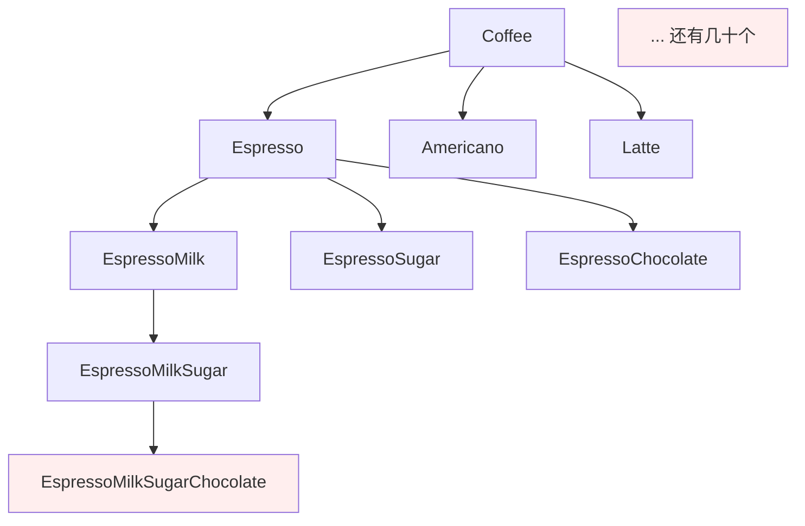
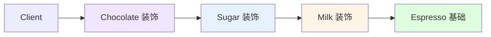
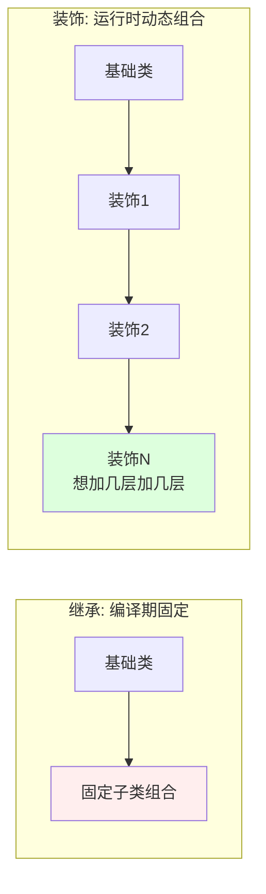

# 第三卷第8章：装饰者模式设计思想

> **📚 本篇渐进学习节奏（建议按顺序食用）**
>
> 1. **第 01 节 · 案例引入** — 咖啡连锁外卖系统的"3 种饮品 × 4 种配料 = 48 个子类"翻车现场
> 2. **第 02 节 · 模式基础** — 从"继承 vs 关联"两种功能扩展机制讲透装饰者本质
> 3. **第 03 节 · 模式实现** — 抽象构件 / 具体构件 / 装饰角色 / 具体装饰 四角色骨架
> 4. **第 04 节 · 实例演示** — 齐天大圣七十二变实战，含"透明 vs 半透明"两种姿态
> 5. **第 05 节 · 经典场景** — 一边读 Java IO 源码一边对照角色映射
> 6. **第 06 节 · 优缺分析 + 踩坑 + 联动** — 4 种翻车姿势 + 与适配器/代理/责任链的边界
>
> 阅读到任一节卡壳，直接跳回上一节复盘场景；本篇代码均可直接运行。

#### 目录介绍
- [01.案例引入与思考](#01案例引入与思考)
    - [1.1 痛点场景](#11-痛点场景)
    - [1.2 它哪里不舒服](#12-它哪里不舒服)
    - [1.3 引出本篇主角](#13-引出本篇主角)
- [02.装饰者模式基础](#02装饰者模式基础)
    - [2.1 装饰者模式由来](#21-装饰者模式由来)
    - [2.2 装饰者模式定义](#22-装饰者模式定义)
    - [2.3 装饰者模式场景](#23-装饰者模式场景)
    - [2.4 装饰者模式思考](#24-装饰者模式思考)
- [03.装饰者模式实现](#03装饰者模式实现)
    - [3.1 罗列一个场景](#31-罗列一个场景)
    - [3.2 装饰者结构](#32-装饰者结构)
    - [3.3 装饰者基本实现](#33-装饰者基本实现)
- [04.装饰者实例演示](#04装饰者实例演示)
    - [4.1 需求分析](#41-需求分析)
    - [4.2 案例基础实现](#42-案例基础实现)
    - [4.3 演变设计思想](#43-演变设计思想)
    - [4.4 使用装饰者模式](#44-使用装饰者模式)
    - [4.5 装饰器能否精简](#45-装饰器能否精简)
    - [4.6 透明性的要求](#46-透明性的要求)
    - [4.7 半透明装饰者模式](#47-半透明装饰者模式)
- [05.装饰器模式场景](#05装饰器模式场景)
    - [5.1 IO流中装饰者模式](#51-io流中装饰者模式)
    - [5.2 IO流设计结构](#52-io流设计结构)
    - [5.3 半透明装饰者模式](#53-半透明装饰者模式)
    - [5.4 InputStream装饰者模式](#54-inputstream装饰者模式)
- [06.装饰器模式分析](#06装饰器模式分析)
    - [6.1 装饰模式优点](#61-装饰模式优点)
    - [6.2 装饰模式缺点](#62-装饰模式缺点)
    - [6.3 总结一下学习](#63-总结一下学习)
    - [6.4 踩坑实录与边界](#64-踩坑实录与边界)


## 推荐一个好玩网站

一个最纯粹的技术分享网站，打造精品技术编程专栏！[编程进阶网](https://yccoding.com/)

https://yccoding.com/


## 01.案例引入与思考

> **本篇主线**：功能组合爆炸 + 无法动态增减

### 1.1 痛点场景

> **🔥 模拟事故复盘 · 咖啡连锁外卖系统 · 双 11 临时加配料活动**
>
> 11 月 5 日下午 14:00，运营拉群："活动定了，双 11 当天每杯咖啡可以免费加 1 种新配料『南瓜糖浆』，第二天上线。"
> 后端组拉开代码一看——**当前系统是用『继承』搞配料组合的**：3 种饮品 × 4 种配料的所有组合，已经有 **48 个子类**：`EspressoMilkSugar`、`LatteMilkSugarChocolate`、`AmericanoMilkChocolate`...
> 小张拍了拍胸："简单啊，再加 4 个『带南瓜糖浆』的版本就行——`EspressoPumpkin`、`LattePumpkin`、`EspressoMilkPumpkin`...""不对"，老李掐指一算："要加南瓜糖浆和已有 4 种配料的全部排列，得 **48 个新子类**。如果运营再加一种『海盐奶盖』，子类直接破百。"
> 周二紧急上线后：
>
> - **22:30**：客单"拿铁 + 奶 + 南瓜糖浆"算成 25 元，但订单后台显示 32 元——**因为某个子类 `LatteMilkPumpkin` 的 `cost()` 方法少加了一次 `super.cost()`，价格算错了**；
> - **23:15**：客户投诉"我加了奶+糖+巧克力+南瓜，怎么菜单没有这个组合？"——**因为 4 种配料 × 1 种新配料的全部排列还没建完**，48 个新子类来不及全部测；
> - **次日凌晨 1:00**：运营追加："南瓜糖浆和奶盖不能同时加，但和巧克力可以"——**业务规则要写在 48 个子类的构造函数里，复杂逻辑全靠手工**。
>
> 这场"加配料事故"暴露了一个本质问题：**用继承表达"功能组合"，规模一旦变大就指数爆炸**。每加一种配料，子类数量翻倍；每改一条规则，几十个子类一起改。如果一开始用『**包裹**』而不是『**继承**』——配料就是一层壳，套在咖啡外面——那么加南瓜糖浆只需要新增 1 个 `PumpkinDecorator` 类，**0 处现有代码改动**。

一家咖啡店，基础饮品是 `Espresso`、`Americano`、`Latte`。客人可以加料：**奶泡、糖浆、巧克力、焦糖**。同事的第一版实现是"每种组合建一个子类"：

```java
class Espresso extends Coffee { ... }
class EspressoMilk extends Coffee { ... }
class EspressoSugar extends Coffee { ... }
class EspressoMilkSugar extends Coffee { ... }
class EspressoMilkSugarChocolate extends Coffee { ... }
// 3 种咖啡 × 4 种配料的任意组合 = 3 × 2^4 = 48 个类
```



### 1.2 它哪里不舒服

- ❌ **子类爆炸**：n 种饮品 × 2^m 种配料组合，数量指数级膨胀；
- ❌ **不可动态调整**：客人临时想"先加奶再加巧克力"你得让他先下单"奶+巧克力"版，运行时没法改；
- ❌ **修改一个配料价格要改一堆类**：糖浆涨价 5 毛 → 所有"带糖"的子类都要改；
- ❌ **继承僵化**：加一个新配料（比如"肉桂"）→ 所有现存子类都要扩出带肉桂的版本；
- ❌ **顺序表达不了**：先加奶后加糖 vs 先加糖后加奶（影响口感）在继承体系里无法表达。

### 1.3 引出本篇主角

> **装饰者模式（Decorator）的核心思想**：把"增加功能"从"继承"换成"包裹"。每个配料就是一层"装饰"，一层套一层，像洋葱一样。调用方依然看到的是 `Coffee` 接口，但实际行为已经被层层加料过。

```java
Coffee c = new Espresso();
c = new Milk(c);     // 包一层奶
c = new Sugar(c);    // 再包一层糖
c = new Chocolate(c);// 再包一层巧克力
System.out.println(c.cost() + " / " + c.desc());
// -> 自动累加价格 + 自动拼描述
```



装饰者和继承的根本区别：



Java IO 流（`BufferedInputStream(new FileInputStream(...))`）、Web 过滤器链、Servlet 的 Wrapper，都是装饰者模式的经典落地。

**🎯 用前用后效果对比（衔接 1.1 事故现场）**

基线：3 种饮品 × 5 种配料（含新增南瓜糖浆），且支持运行时动态组合：

| 维度 | ❌ 继承组合（事故现场） | ✅ 引入装饰者模式 |
|------|----------------------|---------------|
| 类的数量 | 3 × 2⁵ = **96 个子类** | 3 个饮品 + 5 个装饰器 = **8 个类** |
| 加 1 种新配料 | 新增 48 个子类 | **新增 1 个 Decorator** |
| 改 1 条规则（南瓜涨价） | 32 个"带南瓜"子类全改 | **改 1 处 `PumpkinDecorator.cost()`** |
| 运行时动态组合 | 不支持，编译期固定 | `new Sugar(new Milk(new Espresso()))` 任意组合 |
| 同一配料加 2 次（如双倍奶） | 需要新建 `DoubleMilk` 子类 | `new Milk(new Milk(coffee))` 套两层 |
| 配料顺序表达 | 无法表达 | 套娃顺序就是加料顺序 |
| 单元测试 | 96 个组合都要测 | 只测 8 个类 + 几条组合用例 |
| 客单价计算错 | **必然发生**（96 处复制粘贴） | 不可能（每个 Decorator 只 +自己的价） |

> **结论**：装饰者的本质是 **"把'多维组合爆炸'拆成'多层一维包裹'"**。每一层装饰只关心"我自己的那点责任"，组合的灵活性留给运行时。**这就是为什么 Java IO 用 4 个抽象类 + 十几个装饰器，能撑起几十种 IO 组合的根源**。

---

## 02.装饰者模式基础

### 2.1 装饰者模式由来
一般有两种方式可以实现给一个类或对象增加行为：

1. 继承机制，使用继承机制是给现有类添加功能的一种有效途径，通过继承一个现有类可以使得子类在拥有自身方法的同时还拥有父类的方法。但是这种方法是静态的，用户不能控制增加行为的方式和时机。
2. 关联机制，即将一个类的对象嵌入另一个对象中，由另一个对象来决定是否调用嵌入对象的行为以便扩展自己的行为，我们称这个嵌入的对象为装饰器(Decorator)

装饰模式以对客户端透明的方式动态地给一个对象附加上更多的责任，是继承关系的一个替代方案。

**装饰模式可以在不需要创造更多子类的情况下，将对象的功能加以扩展。这就是装饰模式的模式动机**。


### 2.2 装饰者模式定义

装饰者模式又名包装(Wrapper)模式。装饰者模式以对客户端透明的方式扩展对象的功能，是继承关系的一个替代方案。

**装饰者模式动态地将责任附加到对象身上。若要扩展功能，装饰者提供了比继承更有弹性的替代方案**。

### 2.3 装饰者模式场景

**装饰者模式适用于以下场景**：

1. 动态地给一个对象添加额外的功能，而不需要修改其原始类的代码。装饰者模式允许在运行时动态地添加、修改或删除对象的行为。
2. 需要扩展一个类的功能，但是使用继承会导致类的数量急剧增加。通过装饰者模式，可以避免创建大量的子类，而是通过组合不同的装饰器来实现功能的扩展。
3. 需要在不影响其他对象的情况下，对对象的功能进行动态组合和排列。装饰者模式可以通过不同的装饰器组合来实现不同的功能组合，而不需要修改原始对象或其他装饰器。


**装饰者模式常见的应用场景包括**：

1. Java中IO流操作中的装饰者模式、Swing GUI组件中的装饰者模式、Java I/O库中的BufferedInputStream和BufferedOutputStream等。
2. Android中自定义View的功能扩展、RecyclerView的ItemDecoration、Fragment的功能增强等。
3. 其他日志功能，日志记录功能的实现也是装饰者模式的理想应用场景。例如，传统的日志记录器Logger可以通过装饰者模式添加不同的日志处理和记录策略，如格式化日志、输出到文件、发送电子邮件等。


### 2.4 装饰者模式思考

当考虑使用装饰者模式时，可以思考以下几个方面：[更多内容](https://yccoding.com/)

1. 是否需要在运行时动态地添加、修改或删除对象的行为？如果是的话，装饰者模式符合要求
2. 需要扩展一个类的功能，但是使用继承会导致类的数量急剧增加吗？如果是的话，装饰者模式可以通过组合不同的装饰器来实现功能的扩展，而不需要创建大量的子类。
3. 是否需要为一个对象的不同部分或属性提供独立的扩展？如果是的话，装饰者模式允许对对象的不同部分进行独立的扩展，而不会影响其他部分。


## 03.装饰者模式实现
### 3.1 罗列一个场景

我们将以一个具体的咖啡示例来介绍装饰者模式的实现。在这个例子中，我们有一个基本的咖啡对象，可以动态地添加不同的配料（如牛奶和糖）。[更多内容](https://yccoding.com/)

比如：

1. 咖啡A，加牛奶和半糖
2. 咖啡B，加牛奶和全糖
3. 咖啡C，加牛奶和多糖
4. 咖啡D，不加牛奶和半糖


### 3.2 装饰者结构

装饰者模式以对客户透明的方式动态地给一个对象附加上更多的责任。

换言之，客户端并不会觉得对象在装饰前和装饰后有什么不同。装饰者模式可以在不使用创造更多子类的情况下，将对象的功能加以扩展。

在装饰模式中的角色有：[更多内容](https://yccoding.com/)

1. ● 抽象构件(Component)角色：给出一个抽象接口，以规范准备接收附加责任的对象。
2. ● 具体构件(ConcreteComponent)角色：定义一个将要接收附加责任的类。
3. ● 装饰(Decorator)角色：持有一个构件(Component)对象的实例，并定义一个与抽象构件接口一致的接口。
4. ● 具体装饰(ConcreteDecorator)角色：负责给构件对象"贴上"附加的责任。


### 3.3 装饰者基本实现

**抽象构件角色**

```java
// Java实现
public interface Coffee {
    double cost();
    String getDescription();
}
```

**具体构件角色**

```java
public class SimpleCoffee implements Coffee {
    public double cost() {
        return 5.0;
    }
    
    public String getDescription() {
        return "Simple Coffee";
    }
}
```

**装饰角色**

```java
public abstract class CoffeeDecorator implements Coffee {
    protected Coffee coffee;

    public CoffeeDecorator(Coffee coffee) {
        this.coffee = coffee;
    }
    
    public double cost() {
        return coffee.cost();
    }
    
    public String getDescription() {
        return coffee.getDescription();
    }
}
```

**具体装饰角色**

```java
public class MilkDecorator extends CoffeeDecorator {
    public MilkDecorator(Coffee coffee) {
        super(coffee);
    }

    public double cost() {
        return super.cost() + 1.5;
    }
    
    public String getDescription() {
        return super.getDescription() + ", Milk";
    }
}

public class SugarDecorator extends CoffeeDecorator {
    public SugarDecorator(Coffee coffee) {
        super(coffee);
    }

    public double cost() {
        return super.cost() + 0.5;
    }
    
    public String getDescription() {
        return super.getDescription() + ", Sugar";
    }
}
```

使用装饰者模式

```java
private void test1() {
    Coffee coffee = new SimpleCoffee();
    System.out.println(coffee.getDescription() + " Cost: $" + coffee.cost());

    coffee = new MilkDecorator(coffee);
    System.out.println(coffee.getDescription() + " Cost: $" + coffee.cost());

    coffee = new SugarDecorator(coffee);
    System.out.println(coffee.getDescription() + " Cost: $" + coffee.cost());
}
```

## 04.装饰者实例演示
### 4.1 需求分析

**齐天大圣的例子**

孙悟空有七十二般变化，他的每一种变化都给他带来一种附加的本领。他变成鱼儿时，就可以到水里游泳；他变成鸟儿时，就可以在天上飞行。


### 4.2 案例基础实现

如果不用装饰者模式，直接用继承怎么写？

```java
class MonkeyAsBird extends Monkey { /* 重写 move 为飞 */ }
class MonkeyAsFish extends Monkey { /* 重写 move 为游 */ }
class MonkeyAsBirdThenFish extends MonkeyAsBird { /* 再重写一次 */ }
// 72 种变化 × 任意顺序 → 子类爆炸
```

问题一目了然：**顺序、组合、双重变化**这三件事继承都进不了小发。


### 4.3 演变设计思想

**从"静态继承"跳到"动态包裹"**的关键三问：

1. "变鱼还是孙悟空吗" → 是，身份不变 → **需要共同接口 TheGreatestSage**
2. "变鱼之后还能变鸟吗" → 能，可叠加 → **装饰器自身必须也是 Sage**
3. "能在运行时决定变什么吗" → 能 → **装饰器接收一个 Sage 参数**

三问三答，装饰者模式的骨架就出来了：装饰器与被装饰者实现同一接口 + 内部持有被装饰者引用。


### 4.4 使用装饰者模式

本例中，Component的角色便由鼎鼎大名的齐天大圣扮演；ConcreteComponent的角色属于大圣的本尊，就是猢狲本人；Decorator的角色由大圣的七十二变扮演。而ConcreteDecorator的角色便是鱼儿、鸟儿等七十二般变化。

**抽象构件角色"齐天大圣"接口定义了一个move()方法，这是所有的具体构件类和装饰类必须实现的。**

```java
//大圣的尊号
public interface TheGreatestSage {
    void move();
}
```

**具体构件角色"大圣本尊"猢狲类**[更多内容](https://yccoding.com/)

```java
public class Monkey implements TheGreatestSage {

    @Override
    public void move() {
        //代码
        System.out.println("Monkey Move");
    }
}
```

**抽象装饰角色"七十二变"**

```java
public class Change implements TheGreatestSage {
    private TheGreatestSage sage;

    public Change(TheGreatestSage sage){
        this.sage = sage;
    }
    @Override
    public void move() {
        // 代码
        sage.move();
    }
}
```

**具体装饰角色"鱼儿"**

```java
public class Fish extends Change {

    public Fish(TheGreatestSage sage) {
        super(sage);
    }

    @Override
    public void move() {
        // 代码
        System.out.println("Fish Move");
    }
}
```

**具体装饰角色"鸟儿"**

```java
public class Bird extends Change {

    public Bird(TheGreatestSage sage) {
        super(sage);
    }

    @Override
    public void move() {
        // 代码
        System.out.println("Bird Move");
    }
}
```

**客户端调用**

```java
public class Client {

    public static void main(String[] args) {
        TheGreatestSage sage = new Monkey();
        // 第一种写法  单层装饰
        TheGreatestSage bird = new Bird(sage);
        TheGreatestSage fish = new Fish(bird);
        // 第二种写法 双层装饰
        //TheGreatestSage fish = new Fish(new Bird(sage));
        fish.move(); 
    }
}
```

"大圣本尊"是ConcreteComponent类，而"鸟儿"、"鱼儿"是装饰类。要装饰的是"大圣本尊"，也即"猢狲"实例。

上面的例子中，第二种些方法：系统把大圣从一只猢狲装饰成了一只鸟儿（把鸟儿的功能加到了猢狲身上），然后又把鸟儿装饰成了一条鱼儿（把鱼儿的功能加到了猢狲+鸟儿身上，得到了猢狲+鸟儿+鱼儿）。


### 4.5 装饰器能否精简

大多数情况下，装饰者模式的实现都要比上面给出的示意性例子要简单。[更多内容](https://yccoding.com/)

如果只有一个ConcreteComponent类，那么可以考虑去掉抽象的Component类（接口），把Decorator作为一个ConcreteComponent子类。

如果只有一个ConcreteDecorator类，那么就没有必要建立一个单独的Decorator类，而可以把Decorator和ConcreteDecorator的责任合并成一个类。甚至在只有两个ConcreteDecorator类的情况下，都可以这样做。


### 4.6 透明性的要求

装饰者模式的透明性要求是指在使用装饰者模式时，对于客户端来说，应该能够透明地使用原始对象和装饰器对象，而不需要关心具体的对象类型。

装饰者模式对客户端的透明性要求程序不要声明一个ConcreteComponent类型的变量，而应当声明一个Component类型的变量。

用孙悟空的例子来说，必须永远把孙悟空的所有变化都当成孙悟空来对待，而如果把老孙变成的鱼儿当成鱼儿，而不是老孙，那就被老孙骗了，而这时不应当发生的。下面的做法是对的：

```java
TheGreatestSage sage = new Monkey();
TheGreatestSage bird = new Bird(sage);
```

而下面的做法是不对的：

```java
Monkey sage = new Monkey();
Bird bird = new Bird(sage);
```

在实际应用中，可能会因为装饰器对象的嵌套而导致透明性的破坏。因此，在使用装饰者模式时，需要权衡透明性和复杂性，并根据具体的需求和情况做出决策。

### 4.7 半透明装饰者模式

然而，纯粹的装饰者模式很难找到。装饰者模式的用意是在不改变接口的前提下，增强所考虑的类的性能。在增强性能的时候，往往需要建立新的公开的方法。[更多内容](https://yccoding.com/)

即便是在孙大圣的系统里，也需要新的方法。比如齐天大圣类并没有飞行的能力，而鸟儿有。这就意味着鸟儿应当有一个新的fly()方法。再比如，齐天大圣类并没有游泳的能力，而鱼儿有，这就意味着在鱼儿类里应当有一个新的swim()方法。

这就导致了大多数的装饰者模式的实现都是"半透明"的，而不是完全透明的。换言之，允许装饰者模式改变接口，增加新的方法。这意味着客户端可以声明ConcreteDecorator类型的变量，从而可以调用ConcreteDecorator类中才有的方法：

```java
TheGreatestSage sage = new Monkey();
Bird bird = new Bird(sage);
bird.fly();
```

半透明的装饰者模式是介于装饰者模式和适配器模式之间的。适配器模式的用意是改变所考虑的类的接口，也可以通过改写一个或几个方法，或增加新的方法来增强或改变所考虑的类的功能。大多数的装饰者模式实际上是半透明的装饰者模式，这样的装饰者模式也称做半装饰、半适配器模式。


## 05.装饰器模式场景
### 5.1 IO流中装饰者模式

装饰者模式在Java语言中的最著名的应用莫过于Java I/O标准库的设计了。

由于Java I/O库需要很多性能的各种组合，如果这些性能都是用继承的方法实现的，那么每一种组合都需要一个类，这样就会造成大量性能重复的类出现。而如果采用装饰者模式，那么类的数目就会大大减少，性能的重复也可以减至最少。因此装饰者模式是Java I/O库的基本模式。

Java I/O库的对象结构图如下，由于Java I/O的对象众多，因此只画出InputStream的部分。

1. InputStream是最上层的父类，表示字节流
2. FileInputStream是一个具体类，用来对文件进行读取
3. BufferedInputStream是字节缓冲流，主要是为了减少I/O操作的次数，提高效率。


### 5.2 IO流设计结构

IO流中装饰者模式结构如下所示：[更多内容](https://yccoding.com/)

1. 抽象构件(Component)角色：由InputStream扮演。这是一个抽象类，为各种子类型提供统一的接口。
2. 具体构件(ConcreteComponent)角色：由ByteArrayInputStream、FileInputStream、PipedInputStream、StringBufferInputStream等类扮演。它们实现了抽象构件角色所规定的接口。
3. 抽象装饰(Decorator)角色：由FilterInputStream扮演。它实现了InputStream所规定的接口。
4. 具体装饰(ConcreteDecorator)角色：由几个类扮演，分别是BufferedInputStream、DataInputStream以及两个不常用到的类LineNumberInputStream、PushbackInputStream。


### 5.3 半透明装饰者模式

然而，纯粹的装饰者模式很难找到。装饰者模式的用意是在不改变接口的前提下，增强所考虑的类的性能。在增强性能的时候，往往需要建立新的公开的方法。[更多内容](https://yccoding.com/)

即便是在孙大圣的系统里，也需要新的方法。比如齐天大圣类并没有飞行的能力，而鸟儿有。这就意味着鸟儿应当有一个新的fly()方法。再比如，齐天大圣类并没有游泳的能力，而鱼儿有，这就意味着在鱼儿类里应当有一个新的swim()方法。

这就导致了大多数的装饰者模式的实现都是"半透明"的，而不是完全透明的。换言之，允许装饰者模式改变接口，增加新的方法。这意味着客户端可以声明ConcreteDecorator类型的变量，从而可以调用ConcreteDecorator类中才有的方法：

```java
TheGreatestSage sage = new Monkey();
Bird bird = new Bird(sage);
bird.fly();
```

半透明的装饰者模式是介于装饰者模式和适配器模式之间的。适配器模式的用意是改变所考虑的类的接口，也可以通过改写一个或几个方法，或增加新的方法来增强或改变所考虑的类的功能。大多数的装饰者模式实际上是半透明的装饰者模式，这样的装饰者模式也称做半装饰、半适配器模式。


### 5.4 InputStream装饰者模式

InputStream类型中的装饰者模式是半透明的。为了说明这一点，不妨看一看作装饰者模式的抽象构件角色的InputStream的源代码。这个抽象类声明了九个方法，并给出了其中八个的实现，另外一个是抽象方法，需要由子类实现。

```java
public abstract class InputStream implements Closeable {

    public abstract int read() throws IOException;

    public int read(byte b[]) throws IOException {}

    public int read(byte b[], int off, int len) throws IOException {}

    public long skip(long n) throws IOException {}

    public int available() throws IOException {}

    public void close() throws IOException {}

    public synchronized void mark(int readlimit) {}

    public synchronized void reset() throws IOException {}

    public boolean markSupported() {}
}
```

下面是作为装饰模式的抽象装饰角色FilterInputStream类的源代码。[更多内容](https://yccoding.com/)可以看出，FilterInputStream的接口与InputStream的接口是完全一致的。也就是说，直到这一步，还是与装饰模式相符合的。

```java
public class FilterInputStream extends InputStream {
    protected FilterInputStream(InputStream in) {}

    public int read() throws IOException {}

    public int read(byte b[]) throws IOException {}

    public int read(byte b[], int off, int len) throws IOException {}

    public long skip(long n) throws IOException {}

    public int available() throws IOException {}

    public void close() throws IOException {}

    public synchronized void mark(int readlimit) {}

    public synchronized void reset() throws IOException {}

    public boolean markSupported() {}
}
```

下面是具体装饰角色PushbackInputStream的源代码。

```java
public class PushbackInputStream extends FilterInputStream {
    private void ensureOpen() throws IOException {}

    public PushbackInputStream(InputStream in, int size) {}

    public PushbackInputStream(InputStream in) {}

    public int read() throws IOException {}

    public int read(byte[] b, int off, int len) throws IOException {}

    public void unread(int b) throws IOException {}

    public void unread(byte[] b, int off, int len) throws IOException {}

    public void unread(byte[] b) throws IOException {}

    public int available() throws IOException {}

    public long skip(long n) throws IOException {}

    public boolean markSupported() {}

    public synchronized void mark(int readlimit) {}

    public synchronized void reset() throws IOException {}

    public synchronized void close() throws IOException {}
}
```

查看源码，你会发现，这个装饰类提供了额外的方法unread()，这就意味着PushbackInputStream是一个半透明的装饰类。[更多内容](https://yccoding.com/)，换言 之，它破坏了理想的装饰者模式的要求。如果客户端持有一个类型为InputStream对象的引用in的话，那么如果in的真实类型是 PushbackInputStream的话，只要客户端不需要使用unread()方法，那么客户端一般没有问题。但是如果客户端必须使用这个方法，就 必须进行向下类型转换。将in的类型转换成为PushbackInputStream之后才可能调用这个方法。但是，这个类型转换意味着客户端必须知道它 拿到的引用是指向一个类型为PushbackInputStream的对象。这就破坏了使用装饰者模式的原始用意。

现实世界与理论总归是有一段差距的。纯粹的装饰者模式在真实的系统中很难找到。一般所遇到的，都是这种半透明的装饰者模式。

下面是使用I/O流读取文件内容的简单操作示例。

```java
public static void main(String[] args) throws IOException {
    // 流式读取文件
    DataInputStream dis = null;
    try{
        dis = new DataInputStream(new BufferedInputStream(new FileInputStream("test.txt")));
        //读取文件内容
        byte[] bs = new byte[dis.available()];
        dis.read(bs);
        String content = new String(bs);
        System.out.println(content);
    }finally{
        dis.close();
    }
}
```

观察上面的代码，会发现最里层是一个FileInputStream对象，然后把它传递给一个BufferedInputStream对象，经过BufferedInputStream处理，再把处理后的对象传递给了DataInputStream对象进行处理，这个过程其实就是装饰器的组装过程。

FileInputStream对象相当于原始的被装饰的对象，而BufferedInputStream对象和DataInputStream对象则相当于装饰器。[更多内容](https://yccoding.com/)


## 06.装饰器模式分析

### 6.1 装饰模式优点

1. 1）装饰模式与继承关系的目的都是要扩展对象的功能，但是装饰模式可以提供比继承更多的灵活性。装饰模式允许系统动态决定"贴上"一个需要的"装饰"，或者除掉一个不需要的"装饰"。继承关系则不同，继承关系是静态的，它在系统运行前就决定了。
2. 2）通过使用不同的具体装饰类以及这些装饰类的排列组合，设计师可以创造出很多不同行为的组合。

### 6.2 装饰模式缺点

1. 由于使用装饰模式，可以比使用继承关系需要较少数目的类。使用较少的类，当然使设计比较易于进行。[更多内容](https://yccoding.com/)，但是，在另一方面，使用装饰模式会产生比使用继承关系更多的对象。更多的对象会使得查错变得困难，特别是这些对象看上去都很相像。


### 6.3 总结一下学习

**01.装饰者模式基础**

给一个类或者对象增加行为：1.继承，子类通过重写父类方法修改行为。2.关联机制，将一个类的对象嵌入另一个对象中用于行为拓展。

装饰者模式以对客户端透明的方式扩展对象的功能，是继承关系的一个替代方案。

装饰者模式适用于以下场景：[更多内容](https://yccoding.com/)

1. 动态地给一个对象添加额外的功能，而不需要修改其原始类的代码。
2. 需要扩展一个类的功能，但是使用继承会导致类的数量急剧增加。
3. 需要在不影响其他对象的情况下，对对象的功能进行动态组合和排列。


**02.装饰者模式实现**

比如：有一个基本的咖啡对象，可以动态地添加不同的配料（如牛奶和糖）。在不改变对象情况下，对行为进行拓展！

1. 咖啡A，加牛奶和半糖
2. 咖啡B，加牛奶和全糖
3. 咖啡C，加牛奶和多糖
4. 咖啡D，不加牛奶和半糖

在装饰模式中的角色有：

1. ● 抽象构件(Component)角色：给出一个抽象接口，以规范准备接收附加责任的对象。
2. ● 具体构件(ConcreteComponent)角色：定义一个将要接收附加责任的类。
3. ● 装饰(Decorator)角色：持有一个构件(Component)对象的实例，并定义一个与抽象构件接口一致的接口。
4. ● 具体装饰(ConcreteDecorator)角色：负责给构件对象"贴上"附加的责任。


**03.装饰者实例演示**

半透明的装饰者模式是介于装饰者模式和适配器模式之间的。适配器模式的用意是改变所考虑的类的接口，也可以通过改写一个或几个方法，或增加新的方法来增强或改变所考虑的类的功能。大多数的装饰者模式实际上是半透明的装饰者模式，这样的装饰者模式也称做半装饰、半适配器模式。

**04.装饰器模式场景**

装饰者模式在Java语言中的最著名的应用莫过于Java I/O标准库的设计了。

IO流中装饰者模式结构如下所示：

1. 抽象构件(Component)角色：由InputStream扮演。这是一个抽象类，为各种子类型提供统一的接口。
2. 具体构件(ConcreteComponent)角色：由ByteArrayInputStream、FileInputStream、PipedInputStream、StringBufferInputStream等类扮演。它们实现了抽象构件角色所规定的接口。
3. 抽象装饰(Decorator)角色：由FilterInputStream扮演。它实现了InputStream所规定的接口。
4. 具体装饰(ConcreteDecorator)角色：由几个类扮演，分别是BufferedInputStream、DataInputStream以及两个不常用到的类LineNumberInputStream、PushbackInputStream。


### 6.4 踩坑实录与边界

装饰者写起来"看似很优雅"，但下面 4 类问题几乎人人翻过车，**每一类都对应一个真实事故场景**：

**坑 1：把"装饰"用成了"修改"，破坏 LSP（里氏替换原则）**
```java
class DiscountDecorator extends CoffeeDecorator {
    public double cost() {
        // ❌ 直接覆盖,把基础价格也吞了
        return 3.0;  // 不再调用 super.cost()
    }
}
```
**根因**：装饰者的本职工作是 **"在原有行为上叠加一层"**，不是 **"完全重写"**。这里直接 return 3.0 等于把所有底层装饰链全废掉。**正解**：必须 `super.cost() * 0.8` 或 `super.cost() - 2`，永远以"在父结果上加工"的姿态出现。

**坑 2：装饰链顺序敏感写错位**
```java
// ❌ 先打折后加税: (10 * 0.8) * 1.1 = 8.8
Coffee c = new TaxDecorator(new DiscountDecorator(new Latte()));
// ✅ 先加税后打折: (10 * 1.1) * 0.8 = 8.8 ?  其实结果一样,但是
//    业务上"先税后折"和"先折后税"是不同的财税语义
```
**根因**：装饰链的顺序就是 **业务执行的顺序**，写错位置导致计算结果差几分钱、报表对不上、税务被罚。**正解**：在 Builder 里固化装饰顺序，业务代码不直接 `new`。

**坑 3：装饰器持有状态，导致同一对象多次装饰互相串扰**
```java
class LogDecorator extends CoffeeDecorator {
    private List<String> logs = new ArrayList<>();  // ❌ 装饰器持有状态
    public double cost() {
        logs.add("cost called");
        return super.cost();
    }
}
// 同一个 LogDecorator 实例被两条不同链路复用 → 日志混乱
```
**根因**：装饰器应该是 **"无状态的薄包装"**。一旦持有状态，就要面对线程安全、日志混淆、计费重复等连锁问题。**正解**：状态外置（放业务对象上）或每次 new 新装饰器实例。

**坑 4：透明性破坏，下游代码不得不 instanceof**
```java
TheGreatestSage sage = new Bird(new Monkey());
if (sage instanceof Bird) {           // ❌ 装饰者模式被破坏
    ((Bird) sage).fly();
}
```
**根因**：当装饰器新增了不在抽象接口里的方法（即 4.7 节的"半透明装饰"），客户端就被迫 `instanceof` 判断 + 强转。**正解**：要么把方法纳入抽象接口（保持透明），要么明确告诉团队这是"半装饰半适配"模式，调用方知情。

**🔍 真实开源代码中的装饰者模式**

装饰者是 Java 生态最常见的模式之一，几乎所有"流式 / 链式 / 包装"框架都有它：

| 出处 | 关键源码 | 它在装饰什么 |
|------|---------|-------------|
| **JDK IO 体系** | `BufferedInputStream` / `DataInputStream` / `PushbackInputStream` 都继承 `FilterInputStream` | 在 `InputStream` 之上叠加缓冲、数据类型解析、回退能力 |
| JDK 字符流 | `BufferedReader(new InputStreamReader(new FileInputStream(...)))` | 字节流 → 字符流 → 缓冲读取，三层装饰链 |
| JDK Collections | `Collections.synchronizedList` / `unmodifiableList` / `checkedList` | 给普通 List 套上"线程安全/不可变/类型检查"装饰 |
| Servlet | `HttpServletRequestWrapper` / `HttpServletResponseWrapper` | 在过滤器中包装请求/响应（如 XSS 过滤、字符编码转换） |
| Spring | `TransactionAwareCacheDecorator` 等 `*Decorator` 系 | 给 Cache 加事务感知能力 |
| Spring Security | `DelegatingFilterProxy` 把 Servlet Filter 装饰成 Spring Bean | Servlet 容器规则 → Spring 容器规则 |
| MyBatis | `Cache` 接口的 `LoggingCache` / `LruCache` / `BlockingCache` / `SerializedCache` 多层包裹 | 同一个 Cache 接口叠加日志、淘汰、阻塞、序列化能力 |
| Netty | `ChannelHandler` 责任链每个 Handler 也是装饰一层 | （注：Netty 严格说是责任链，但形态接近装饰）|
| Guava | `ForwardingList` / `ForwardingMap` 抽象基类 | 提供"装饰任意 Collection"的脚手架 |
| Java 并发 | `ReentrantReadWriteLock` 内部 ReadLock/WriteLock 包装 Sync | 给底层同步原语装饰读/写视角 |

> **学习路径**：先读 `Collections.synchronizedList`（30 行就能看完）→ 再读 `BufferedInputStream` → 最后读 **MyBatis 的 Cache 装饰链**（生产级 5 层装饰链堪称教科书）。读完这三个，你对"为什么装饰能撑起一整个 IO/Cache 体系"就彻底通透了。

**⚠️ 装饰者 vs 三个最易混淆的兄弟**

| 模式 | 核心目的 | 接口是否一致 | 套娃方向 |
|------|---------|-------------|---------|
| **装饰者** | 增强行为，**不改接口** | 一致（透明）/ 微扩（半透明） | 任意层数，灵活组合 |
| **适配器**（07 篇） | **转换接口**，让两个不兼容接口能对话 | **不一致**（这是核心目的） | 通常单层 |
| **代理**（05/06 篇） | **控制访问**（鉴权 / 缓存 / 远程 / 懒加载） | 一致 | 通常单层（特定职责） |
| **责任链**（17 篇） | 把请求**沿链传递直到被处理** | 一致 | 多层，但各 Handler 可能终止链 |

一句话区分：
- **想换皮 → 适配器**；
- **想加料 → 装饰者**；
- **想控访 → 代理**；
- **想审批 → 责任链**。

**⚠️ 什么时候不该用装饰者**

- **配料组合不会再增长**：写死 3-5 种就够用 → 直接子类继承反而清晰；
- **配料之间有强约束**（如"加奶 + 加南瓜糖浆不能并存"）：装饰链没法表达约束，应该结合 **Builder 模式**（03 篇）+ 校验逻辑；
- **要的是接口转换**：那是适配器（07 篇），不是装饰者；
- **要的是访问控制**：那是代理（05/06 篇），别为了"装饰"而装饰。

> 一句话：**装饰者解决的是"功能组合爆炸"，不是"任何想加点东西"的场景**。该用继承时别硬上装饰，否则只会让简单事变复杂。

