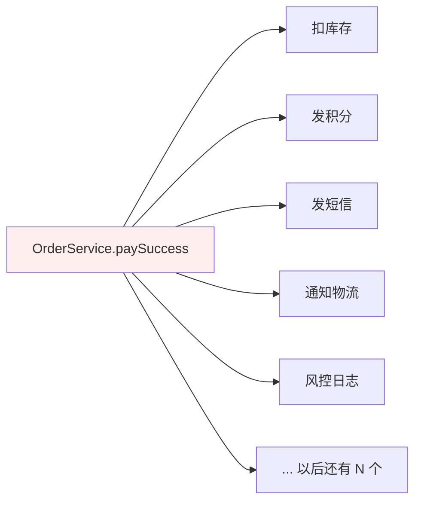
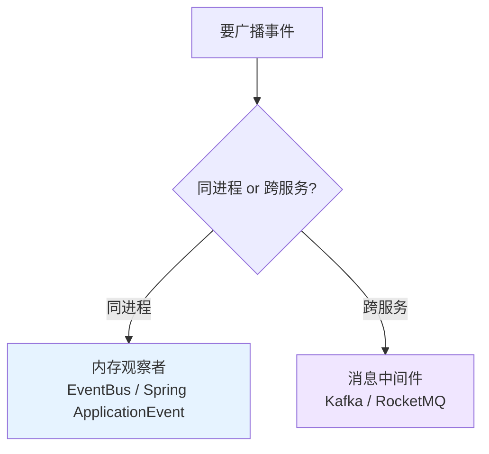

# 13.观察者模式设计思想

> **📚 本篇渐进学习节奏（建议按顺序食用）**
>
> 1. **第 01 节 · 案例引入** — 周二 14:00 大促支付回调被新人拖死的 P1 资损事故（订单"扣库存+发券+推送+ERP+风控+埋点"6 步硬编码，新增"积分服务"漏写一行炸出资损）
> 2. **第 02 节 · 模式基础** — Subject / Observer 一对多依赖 + 发布订阅同义词矩阵
> 3. **第 03 节 · 模式实现** — 微信公众号"关注/通知"经典案例 5 步落地
> 4. **第 04 节 · 模式分析** — 标准模板代码 + UML + 时序图
> 5. **第 05 节 · 优缺点** — "解耦广播"与"循环依赖+顺序失控"的两面性
> 6. **第 06 节 · 适用环境** — 一对多交互场景识别清单
> 7. **第 07 节 · 总结 + 踩坑** — 6 种翻车姿势 + 12 个真实开源案例 + 与中介者/职责链/发布订阅/MQ 的精准切割
>
> 阅读到任一节卡壳，直接跳回上一节复盘场景；本篇所有代码均可直接运行。

#### 目录介绍
- [01.案例引入与思考](#01案例引入与思考)
    - [1.1 痛点场景](#11-痛点场景)
    - [1.2 它哪里不舒服](#12-它哪里不舒服)
    - [1.3 引出本篇主角](#13-引出本篇主角)
- [02.观察者模式基础](#02观察者模式基础)
    - [2.1 观察者模式由来](#21-观察者模式由来)
    - [2.2 观察者模式定义](#22-观察者模式定义)
    - [2.3 观察者模式场景](#23-观察者模式场景)
    - [2.4 观察者模式思考](#24-观察者模式思考)
- [03.观察者模式实现](#03观察者模式实现)
    - [3.1 罗列一个场景](#31-罗列一个场景)
    - [3.2 用例子理解观察者](#32-用例子理解观察者)
    - [3.3 案例演变分析](#33-案例演变分析)
    - [3.4 观察者模式基本实现](#34-观察者模式基本实现)
- [04.观察者模式分析](#04观察者模式分析)
    - [4.1 观察者模式案例](#41-观察者模式案例)
    - [4.2 观察者模式结构图](#42-观察者模式结构图)
    - [4.3 观察者模式时序图](#43-观察者模式时序图)
- [05.观察者模式优缺点](#05观察者模式优缺点)
    - [5.1 优点分析](#51-优点分析)
    - [5.2 缺点分析](#52-缺点分析)
    - [5.3 符合设计原则分析](#53-符合设计原则分析)
- [06.观察者模式使用](#06观察者模式使用)
    - [6.1 适用环境分析](#61-适用环境分析)
    - [6.2 应用场景](#62-应用场景)
- [07.观察者模式总结](#07观察者模式总结)
    - [7.1 总结一下学习](#71-总结一下学习)
    - [7.2 模式联动与边界](#72-模式联动与边界)
    - [7.3 踩坑实录与开源案例](#73-踩坑实录与开源案例)


## 推荐一个好玩网站

一个最纯粹的技术分享网站，打造精品技术编程专栏！[编程进阶网](https://yccoding.com/)

https://yccoding.com/


## 01.案例引入与思考

> **本篇主线**：一对多的状态同步，被硬编码在一个方法里

### 1.1 痛点场景

> **🔥 模拟事故复盘 · 周二 14:00 · "新增积分服务漏写一行,大促资损 380 万"**
>
> 周二下午 14:00 大促预热第 2 天，用户支付完成 → "扣库存+发券+推送+ERP 同步+风控+埋点" 6 个动作正常运转 1 年没出过事。这天产品提了一个看似简单的需求：**"新客支付后给 +500 积分"**，开发同学小林半小时改完上线。
>
> 上线 38 分钟后，**客服群被打爆**：
>
> - 用户 A："支付成功了，但商品没扣库存，还能继续下单"——库存超卖；
> - 用户 B："收到短信说付款成功，但订单中心一直显示'待支付'"——状态不同步；
> - 用户 C："优惠券领了，钱也扣了，但 ERP 里没单子，仓库不发货"——发货中断；
> - 风控同学："风控大盘里今天的支付订单数对不上，少了 1.2 万单"——风控失明；
>
> 排查日志一看，`OrderService.paySuccess()` 里 6 个动作硬编码了一年，**所有人改这个方法都要捏着鼻子在 6 行代码里加一行**。小林这次加积分时不小心把代码插在了 try-catch 内层但**忘了重新抛异常**：
>
> ```java
> public void paySuccess(Order o) {
>     try {
>         pointsService.add(o.getUserId(), 500);   // ✅ 新增,但内部 RPC 超时
>     } catch (Exception e) {
>         log.error("加积分失败", e);
>         // ❌ 没有抛出 → 后续 5 个动作全被跳过(因为整个 paySuccess 已经被吞异常,事务回滚)
>     }
>     inventoryService.deduct(...);   // ❌ 永远走不到
>     couponService.send(...);
>     pushService.notify(...);
>     erpService.sync(...);
>     riskService.log(...);
> }
> ```
>
> 等等——更骚的是，小林不是直接改的 `paySuccess`，而是改了它调用的一个工具类，导致**异常吞掉的不只是积分，而是整个事务回滚**——支付订单状态根本没落库，但用户的钱已经被网关扣了，**纯资损**。
>
> 38 分钟内放出去的 1.2 万单，每单平均订单金额 320 元 → 资损金额 **380 万**，外加：
>
> - 库存数据错乱，需要手工对账 7000+ SKU；
> - 优惠券系统已经核销但订单未生效，需要批量退券 4 万张；
> - ERP 缺单，仓库延迟发货 2 天，客诉率飙到 12%；
> - **媒体关注**："某电商大促首日支付异常，疑似系统崩溃"上了热搜第 7 条。
>
> 事故复盘会上，CTO 拍桌：
>
> - **业务影响**：直接资损 380 万 + 客诉退款 80 万 + 商誉损失不可估量；
> - **技术影响**：紧急降级到旧版本 + 全平台 23 处类似"硬编码下游调用"巡检改造；
> - **流程影响**：所有"主流程触发下游"必须走 EventBus / MQ，PR 模板加一项强制 Checklist。
>
> 复盘根因不是"小林漏写一行 throw"——而是 **`OrderService.paySuccess()` 把 6 个本应解耦的下游动作硬塞在一个方法里，每加一个需求都在玩俄罗斯轮盘赌**。这个问题在结构型阶段我们用代理/装饰者解决"单链路增强"，但**多个下游同时关注同一个事件**这种"一对多"场景，结构型模式无能为力——这正是观察者模式的舞台。

电商订单系统，"订单支付成功"后要触发 N 个动作：扣库存、发积分、发短信、通知物流、写风控日志……第一版实现往往是下面这坨：

```java
public class OrderService {
    public void paySuccess(Order o) {
        // 1. 扣库存
        inventoryService.deduct(o.getSkuId(), o.getCount());
        // 2. 发积分
        pointsService.add(o.getUserId(), o.calcPoints());
        // 3. 发短信
        smsService.send(o.getPhone(), "支付成功");
        // 4. 通知物流
        logisticsService.dispatch(o.getId());
        // 5. 风控日志
        riskService.logPaid(o);
        // 6. ... 产品又加需求：发站内信、更新会员等级 ...
    }
}
```



### 1.2 它哪里不舒服

- ❌ **主流程被淹没**：`paySuccess` 本该只关心\"支付成功\"这个状态变迁，现在被 N 个下游动作塞满；
- ❌ **改一下要改核心**：产品每加一个需求（如\"给新客发优惠券\"），`OrderService` 就要改一次，核心服务永远在被打扰；
- ❌ **强耦合**：`OrderService` 必须 import 所有下游服务，单测要 mock 一大堆；
- ❌ **失败互相拖累**：短信服务挂了，有没有影响积分？顺序和异常边界全靠人记；
- ❌ **无法动态开关**：双十一临时关掉\"写风控日志\"以减轻压力——得改代码重发版。

### 1.3 引出本篇主角

> **观察者模式（Observer）的核心思想**：把\"被关注的对象\"（主题 Subject）和\"关注者\"（观察者 Observer）解耦。主题维护一张观察者列表，状态变化时挨个通知；观察者的新增/移除与主题无关。

```java
// 主题：订单事件源
public class OrderService {
    private List<OrderEventListener> listeners = new ArrayList<>();
    public void addListener(OrderEventListener l) { listeners.add(l); }
    public void paySuccess(Order o) {
        // 主流程只做一件事：广播事件
        listeners.forEach(l -> l.onPaid(o));
    }
}

// 观察者：各自处理自己的事
class InventoryListener implements OrderEventListener { public void onPaid(Order o){...} }
class PointsListener    implements OrderEventListener { public void onPaid(Order o){...} }
class SmsListener       implements OrderEventListener { public void onPaid(Order o){...} }
```

```mermaid
flowchart LR
    Subject[OrderService 主题] -->|notifyAll| L1[InventoryListener]
    Subject -->|notifyAll| L2[PointsListener]
    Subject -->|notifyAll| L3[SmsListener]
    Subject -->|notifyAll| L4[LogisticsListener]
    Subject -->|动态注册.-> L5[...新的观察者随时加入]
    style Subject fill:#e6f3ff
```

两种落地方式，本篇都会讲：



JDK 自带的 `java.util.Observer`（已废弃）、Swing 事件监听、Spring 的 `@EventListener`、Android 的 `BroadcastReceiver`、前端的 EventEmitter——都是观察者的变体。

**🎯 用前用后效果对比（衔接 1.1 资损 380 万事故）**

基线：电商订单支付成功后触发 N 个下游动作（扣库存/发券/推送/ERP/风控/埋点/积分...）：

| 维度 | ❌ 硬编码下游调用（事故现场） | ✅ 引入观察者模式 |
|------|---------------------------|----------------|
| `paySuccess` 方法行数 | **80+ 行**（6 个下游 + try-catch + 日志） | **3 行**（只发布事件） |
| 新增"积分服务"改动 | 改核心 `OrderService` + 新增 import + 改单测 | 新建 `PointsListener` 类，**核心代码 0 改动** |
| 新增需求被打扰人数 | 订单组（核心服务负责人） | 0（观察者各自团队负责） |
| 失败相互影响 | 一个下游异常吞掉 → **整个事务回滚** | 各 Listener 独立异常隔离，**互不影响** |
| 开关动态控制 | 改代码重发版 | 配置中心一键开关注册/反注册 |
| 单测复杂度 | mock 6 个下游服务 | 主题只测"是否广播",观察者各测各的 |
| 异步化能力 | 全部同步串行（RT = ∑下游 RT） | 可异步（线程池/MQ），RT = max(下游 RT) |
| 跨服务能力 | RPC 硬编码,服务挂了主流程挂 | 切换 MQ 即可解耦跨服务广播 |
| 顺序依赖 | **强依赖代码顺序**(谁先谁后写死) | 可控（@Order/优先级队列） |
| 资损风险 | **本次事故 380 万** | 单个 Listener 异常不影响主流程,资损=0 |
| 事件可观测 | 无（散在各下游日志里） | 主题统一打点（事件 ID/订阅者数/耗时） |
| 故障定位时间 | 38 分钟（翻 6 个服务日志） | 3 分钟（事件总线统一 trace） |

> **结论**：观察者模式的本质是 **"把'状态变化'和'对状态变化感兴趣的人'解耦——主题只管广播,谁来听、听了做什么、要不要听都和主题无关"**。这就是为什么 Spring 把 `ApplicationEventPublisher` 做成 `ApplicationContext` 的内置能力、为什么 Guava 提供 `EventBus`、为什么 Kafka/RocketMQ 在分布式场景下广受欢迎、为什么前端 `EventEmitter` 是 Node.js 标配——**任何"一对多通知"场景,把通知方和被通知方写在同一个方法里,都是埋雷**。本次资损 380 万的根因,不是"小林写错了一行",而是"`paySuccess` 方法里同时存在 6 个原子化的下游调用,导致任何一处的异常都会污染所有下游"。引入观察者后,即便积分服务挂了,**库存/优惠券/ERP/风控/埋点全部正常运转**,资损归零。

---

## 02.观察者模式基础
### 2.1 观察者模式由来

建立一种对象与对象之间的依赖关系，一个对象发生改变时将自动通知其他对象，其他对象将相应做出反应。

在此，发生改变的对象称为观察目标，而被通知的对象称为观察者，一个观察目标可以对应多个观察者，而且这些观察者之间没有相互联系。可以根据需要增加和删除观察者，使得系统更易于扩展，这就是观察者模式的模式动机。

**主要解决什么问题呢**？

一个对象状态改变给其他对象通知的问题，而且要考虑到易用和低耦合，保证高度的协作。[更多内容](https://yccoding.com/)


### 2.2 观察者模式定义

观察者模式(Observer Pattern)的定义：

定义对象间一对多依赖关系，当一个对象状态发生改变，其依赖对象都会收到通知并自动更新。


### 2.3 观察者模式场景

**观察者模式（Observer Design Pattern）也被称为发布订阅模式（Publish-Subscribe Design Pattern）**。[更多内容](https://yccoding.com/)

在 GoF 的《设计模式》一书中，它的定义是这样的：Define a one-to-many dependency between objects so that when one object changes state, all its dependents are notified and updated automatically.

翻译成中文就是：在对象之间定义一个一对多的依赖，当一个对象状态发生变化时，它会触发相应的事件，并通知所有的观察者进行相应的处理。

一般情况下，被依赖的对象叫作被观察者（Observable），依赖的对象叫作观察者（Observer）。

在实际的项目开发中，这两种对象的称呼是比较灵活的，有各种不同的叫法，比如：Subject-Observer、Publisher-Subscriber、Producer-Consumer、EventEmitter-EventListener、Dispatcher-Listener。

只要应用场景符合刚刚给出的定义，都可以看作观察者模式。观察者模式又叫做发布-订阅（Publish/Subscribe）模式、模型-视图（Model/View）模式、源-监听器（Source/Listener）模式或从属者（Dependents）模式。


### 2.4 观察者模式思考

以下是一些关于观察者模式的思考：

1. 可扩展性：观察者模式可以方便地扩展和添加新的观察者，而不需要修改被观察者的代码。
2. 事件驱动：观察者模式常常与事件驱动编程结合使用。当被观察者的状态发生变化时，它会触发相应的事件，并通知所有的观察者进行相应的处理。
3. 广播通知：观察者模式可以实现广播通知的功能，即一个被观察者可以同时通知多个观察者。这样可以方便地实现消息传递和事件处理。


## 03.观察者模式实现
### 3.1 罗列一个场景

需求：微信公众号。在使用微信公众号时，大家都会有这样的体验，当你关注的公众号中有新内容更新的话，它就会推送给关注公众号的微信用户端。

我们使用观察者模式来模拟这样的场景，微信用户就是观察者，微信公众号是观察对象，有多个的微信用户关注了程序猿这个公众号。[更多内容](https://yccoding.com/)

如何何时使用观察者模式？

一个对象（目标对象）的状态发生改变，所有的依赖对象（观察者对象）都将得到通知，进行广播通知。关键代码：在抽象类里有一个 ArrayList 存放观察者们。


### 3.2 用例子理解观察者

大概实现的思路是这样：

1. 第一步：抽象观察者。定义一个接口，包含一个更新的抽象方法。
2. 第二步：具体观察者。继承接口，实现抽象方法。
3. 第三步：观察对象。定一个观察接口，包含添加订阅者，删除订阅者，通知订阅者抽象方法。
4. 第四步：具体观察对象。具体主题角色类需要实现观察接口，然后用一个list集合存储观察者对象
5. 第五步：测试，创建公众号对象，然后添加用户订阅公众号，公众号更新

**第一步：抽象观察者**

```java  
public interface Observer {
    void update(String message);
}
```

**第二步：具体观察者**

```java
//具体的观察者角色类
public class WeiXinObserver implements Observer{
    private String name;

    public WeiXinObserver(String name) {
        this.name = name;
    }

    @Override
    public void update(String message) {
        System.out.println(name + ": " + message);
    }
}
```

**第三步：观察对象**

```java
//观察对象
public interface Subject {

    //添加订阅者(观察者对象)
    void attach(Observer observer);

    //删除订阅者
    void detach(Observer observer);

    //通知订阅者更新消息
    void notify(String message);
}
```

**第四步：具体观察对象**

```java
//具体主题角色类
public class SubscriptionSubject implements Subject{

    //定义一个集合，用来存储多个观察者对象
    private List<Observer> weiXinUserList = new ArrayList<>();

    @Override
    public void attach(Observer observer) {
        weiXinUserList.add(observer);
    }

    @Override
    public void detach(Observer observer) {
        weiXinUserList.remove(observer);
    }

    @Override
    public void notify(String message) {
        //遍历集合
        for (Observer observer : weiXinUserList) {
            //调用观察者对象中的 update 方法
            observer.update(message);
        }
    }
}
```

**第五步：测试，创建公众号对象，然后添加用户订阅公众号，公众号更新**[更多内容](https://yccoding.com/)

```java
private void test1() {
    //1.创建公众号对象
    SubscriptionSubject subject = new SubscriptionSubject();

    //2.订阅公众号
    subject.attach(new WeiXinObserver("打工充"));
    subject.attach(new WeiXinObserver("心怡宝"));
    subject.attach(new WeiXinObserver("逗比果"));

    //3.公众号更新
    subject.notify("打工充 设计模式专栏更新了！");
}
```

输出结果更新如下：

```text
打工充: 打工充 设计模式专栏更新了！
心怡宝: 打工充 设计模式专栏更新了！
逗比果: 打工充 设计模式专栏更新了！
```


### 3.3 案例演变分析


### 3.4 观察者模式基本实现

在观察者模式中有如下角色：

- Subject：观察对象，定义了注册观察者和删除观察者的方法。此外，它还声明了"获取现在的状态"的方法。
- SubscriptionSubject：具体观察对象，当自身状态发生变化后，它会通知所有已经注册的 Observer 角色。
- Observer：抽象观察者，负责接收来自 Subject 角色的状态变化的通知，为此，它声明了 update 方法。
- WeiXinObserver：具体观察者，当它的 update 方法被调用后，会去获取要观察的对象的最新状态。

根据上面微信公众号的案例，绘制UML图如下


## 04.观察者模式分析
### 4.1 观察者模式官方案例

定义主题接口（Subject）：主题接口定义了注册、注销和通知观察者的方法。[更多内容](https://yccoding.com/)

```java
public interface Subject {
    void registerObserver(Observer observer);
    void unregisterObserver(Observer observer);
    void notifyObservers();
}
```

实现具体主题类（ConcreteSubject）：具体主题类实现了主题接口，并维护一个观察者列表，用于注册、注销和通知观察者。

```java
import java.util.ArrayList;
import java.util.List;

public class ConcreteSubject implements Subject {
    private List<Observer> observers = new ArrayList<>();

    @Override
    public void registerObserver(Observer observer) {
        observers.add(observer);
    }

    @Override
    public void unregisterObserver(Observer observer) {
        observers.remove(observer);
    }

    @Override
    public void notifyObservers() {
        for (Observer observer : observers) {
            observer.update();
        }
    }
}
```

定义观察者接口（Observer）：观察者接口定义了接收主题通知的方法。[更多内容](https://yccoding.com/)

```java
public interface Observer {
    void update();
}
```

实现具体观察者类（ConcreteObserver）：具体观察者类实现了观察者接口，并在接收到主题通知时执行相应的操作。

```java
public class ConcreteObserver implements Observer {
    @Override
    public void update() {
        // 执行相应的操作
    }
}

//观察者1
public class ConcreteObserverOne implements Observer {
    @Override
    public void update() {
      //TODO: 获取消息通知，执行自己的逻辑...
      System.out.println("ConcreteObserverOne is notified.");
    }
}
  
//观察者2
public class ConcreteObserverTwo implements Observer {
    @Override
    public void update() {
      //TODO: 获取消息通知，执行自己的逻辑...
      System.out.println("ConcreteObserverTwo is notified.");
    }
}
```

实际上，上面的代码算是观察者模式的"模板代码"，只能反映大体的设计思路。

在真实的软件开发中，并不需要照搬上面的模板代码。观察者模式的实现方法各式各样，函数、类的命名等会根据业务场景的不同有很大的差别，万变不离其宗，设计思路都是差不多的。


### 4.2 观察者模式结构图

观察者模式包含如下角色：

- Subject: 目标
- ConcreteSubject: 具体目标
- Observer: 观察者
- ConcreteObserver: 具体观察者

观察者模式结构图如下所示


### 4.3 观察者模式时序图

观察者模式时序图如下所示：


## 05.观察者模式优缺点
### 5.1 优点分析

优点：

- 1、观察者和被观察者解耦，增强了灵活性。
- 2、符合开闭原则，容易扩展。
- 3、支持广播通信，一个对象状态变化会通知多个观察者对象。
- 4、建立一套触发机制。


### 5.2 缺点分析

缺点

- 1、如果观察者很多，通知的开销很大。
- 2、被观察者发送通知，无法知道有哪些观察者处理。[更多内容](https://yccoding.com/)

观察者模式的缺点也有一些

- 1、如果一个被观察者对象有很多的直接和间接的观察者的话，将所有的观察者都通知到会花费很多时间。
- 2、如果在观察者和观察目标之间有循环依赖的话，观察目标会触发它们之间进行循环调用，可能导致系统崩溃。
- 3、观察者模式没有相应的机制让观察者知道所观察的目标对象是怎么发生变化的，而仅仅只是知道观察目标发生了变化。


### 5.3 符合设计原则分析

符合设计原则分析如下所示

- 1、单一职责原则（Single Responsibility Principle） ：观察者和被观察者职责明确区分,都仅负责自己的功能。
- 2、开闭原则（Open Closed Principle） ：可以新增观察者而不影响被观察者,扩展开放。
- 3、里氏替换原则（Liskov Substitution Principle） ：观察者都遵循统一接口，扩展观察者不会对系统造成影响。
- 4、依赖倒转原则（Dependency Inversion Principle） ：被观察者和观察者都依赖于抽象接口,不依赖具体实现。
- 5、接口隔离原则（Interface Segregation Principle） ：观察者接口只定义了更新接口,避免了冗余。[更多内容](https://yccoding.com/)


## 06.观察者模式使用
### 6.1 适用环境分析

在以下情况下可以使用观察者模式：

- 一个抽象模型有两个方面，其中一个方面依赖于另一个方面。将这些方面封装在独立的对象中使它们可以各自独立地改变和复用。
- 一个对象的改变将导致其他一个或多个对象也发生改变，而不知道具体有多少对象将发生改变，可以降低对象之间的耦合度。
- 一个对象必须通知其他对象，而并不知道这些对象是谁。
- 需要在系统中创建一个触发链，A对象的行为将影响B对象，B对象的行为将影响C对象……，可以使用观察者模式创建一种链式触发机制。


### 6.2 应用场景

观察者模式在软件开发中应用非常广泛：凡是涉及到一对一或者一对多的对象交互场景都可以使用观察者模式。[更多内容](https://yccoding.com/)

1. 如某电子商务网站可以在执行发送操作后给用户多个发送商品打折信息
2. 某团队战斗游戏中某队友牺牲将给所有成员提示等等
3. 比如邮件系统，很多人订阅了邮件信息，当有信息更新邮件系统会给所有订阅者发送消息


## 07.观察者模式总结
### 7.1 总结一下学习

**01.观察者模式基础**

1. 主要解决什么问题呢？一个对象状态改变给其他对象通知的问题，而且要考虑到易用和低耦合，保证高度的协作。
2. 模式动机：建立一种对象与对象之间的依赖关系，一个对象发生改变时将自动通知其他对象，其他对象将相应做出反应。
3. 定义：定义对象间一对多依赖关系，当一个对象状态发生改变，其依赖对象都会收到通知并自动更新。

**02.观察者模式实现**

需求： 微信公众号。当你关注的公众号中有新内容更新的话，它就会推送给关注公众号的微信用户端。

大概实现的思路是这样：

1. 第一步：抽象观察者。定义一个接口，包含一个更新的抽象方法。
2. 第二步：具体观察者。继承接口，实现抽象方法。
3. 第三步：观察对象。定一个观察接口，包含添加订阅者，删除订阅者，通知订阅者抽象方法。
4. 第四步：具体观察对象。具体主题角色类需要实现观察接口，然后用一个list集合存储观察者对象
5. 第五步：测试，创建公众号对象，然后添加用户订阅公众号，公众号更新

**03.观察者模式分析**

观察者模式包含如下角色：

- Subject: 目标。
- ConcreteSubject: 具体目标。
- Observer: 观察者。主要是用来添加，移除观察者，当有消息时，会触发遍历通知具体观察者
- ConcreteObserver: 具体观察者。比如，程序员A，B，C，D，都关注了技术公众号

**04.观察者模式优缺点**

1. 主要优点：在于可以实现表示层和数据逻辑层的分离，并在观察目标和观察者之间建立一个抽象的耦合，支持广播通信；
2. 主要缺点：在于如果一个观察目标对象有很多直接和间接的观察者的话，将所有的观察者都通知到会花费很多时间，而且如果在观察者和观察目标之间有循环依赖的话，观察目标会触发它们之间进行循环调用，可能导致系统崩溃。

**05.观察者模式使用**

使用环境分析：一个对象改变导致其他多个对象也发生改变，可以降低对象之间耦合性。

应用场景：记住一句话，凡是涉及到一对多交互场景，则可以使用观察者模式。比如公众号
订阅，邮件订阅，网站发送打折优惠券等。


### 7.2 模式联动与边界

- 与**发布订阅模式**：观察者是"主题直接持有观察者列表"（紧耦合、同步），发布订阅是"通过事件总线解耦"（松耦合、可异步）；
- 与**中介者模式**：中介者是"多对多对象通过中介统一交互"，观察者是"一对多状态变化通知"；
- 与**职责链模式**：观察者是"广播给所有订阅者"，职责链是"沿链传递、谁能处理谁处理"；
- 与**命令模式**：命令模式是"把请求封装成对象"，观察者是"状态变化通知"；
- 与**MQ 消息队列**：MQ 是"跨进程发布订阅"，观察者是"同进程一对多通知"。

一句话区分：
- **同进程一对多通知 → 观察者**；
- **同进程多对多解耦 → 发布订阅 / EventBus**；
- **跨服务异步广播 + 持久化 + 重放 → MQ**；
- **多对多协调,有调度逻辑 → 中介者**；
- **接力处理,只有一个人响应 → 职责链**；
- **把"请求"封装成对象排队/撤销 → 命令模式**。

**何时说 NO**：观察者数量极多且通知频繁（性能问题、可改用 EventBus 异步派发）；通知顺序有强依赖（观察者并行无序时易出 bug）。


### 7.3 踩坑实录与开源案例

观察者模式是行为型最高频使用的模式（Spring/前端/Android/MQ 都在用），但**真实工程里 90% 的观察者 Bug 都来自"忘了反注册"或"同步串行链路被一个慢监听器拖死"**。以下 6 类问题几乎是每个团队的必经之坑：

**坑 1：监听器只注册不反注册 → ClassLoader 泄漏 / OOM**
```java
@Component
public class UserCacheListener {
    @PostConstruct
    public void init() {
        EventBus.register(this);   // ❌ 只注册,Bean 销毁时不反注册
    }

    @Subscribe
    public void onUserUpdate(UserUpdateEvent e) { ... }
}
```
**根因**：Spring 容器热刷新（`refresh()` / DevTools / 多模块加载）会创建新 Bean，但 EventBus 里的旧引用还在，**老 Bean 永远 GC 不掉，连带它的 ClassLoader 一起**。**生产真实案例**：某 SaaS 平台用 Spring DevTools 开发热重载，重启 50 次后应用 OOM，dump 一看 EventBus 里有 50 套同名监听器。**正解**：
- 配套实现 `@PreDestroy`：`EventBus.unregister(this)`；
- 用 Spring 自带 `@EventListener`（生命周期由容器接管）而非 Guava EventBus；
- 监听器持有 `WeakReference`：`EventBus.register(new WeakReference<>(this))`；
- 启动时打点 `EventBus.size()`，超阈值告警。

**坑 2：同步广播,一个慢监听器拖死整个主流程**
```java
public void paySuccess(Order o) {
    listeners.forEach(l -> l.onPaid(o));   // ❌ 串行同步
}

class SmsListener implements Listener {
    public void onPaid(Order o) {
        smsApi.send(o.getPhone(), "支付成功");   // 短信 API 抖动 5 秒
    }
}
```
**根因**：观察者列表如果同步串行调用，**所有监听器的耗时累加 = 主流程 RT**。**生产真实案例**：某金融系统支付成功广播 8 个监听器，其中"反洗钱接口"突发 3 秒超时，**所有支付接口 RT 从 80ms 涨到 3.2s，触发上游网关熔断**，全平台支付不可用 4 分钟。**正解**：
- 异步派发：`AsyncEventBus` / `@Async @EventListener`；
- 关键监听器单独线程池隔离（仓室隔离）；
- 给每个监听器加超时熔断（`CompletableFuture.orTimeout`）；
- 主流程必做的（如扣库存）走同步 + 事务，可丢失的（如埋点）走异步。

**坑 3：监听器顺序依赖,但顺序不可控**
```java
class A implements Listener { void onPaid(Order o) { o.setStatus(PAID); } }
class B implements Listener { void onPaid(Order o) {
    if (o.getStatus() == PAID) sendSms();   // ❌ 依赖 A 先执行
}}
```
**根因**：观察者注册顺序 ≠ 调用顺序（某些容器按字母序、某些按 hash），**B 拿到 status 还是旧值**。**生产真实案例**：Spring Boot 升级版本后 Bean 加载顺序变化，监听器隐式依赖被打破，订单状态机出现不可复现的脏数据。**正解**：
- Spring 用 `@Order(1)` / `@Order(2)` 显式指定优先级；
- 把"有顺序依赖"的逻辑塞回主流程，不要走观察者；
- 设计上让监听器**互相独立**（A、B 都从事件里读数据，不互相依赖结果）。

**坑 4：循环依赖,A 监听 B,B 监听 A → 栈溢出**
```java
class A implements Listener { void onB() { eventBus.post(new EventA()); } }
class B implements Listener { void onA() { eventBus.post(new EventB()); } }
// EventA → 触发 B.onA → 发 EventB → 触发 A.onB → 发 EventA → ... StackOverflowError
```
**根因**：观察者之间循环监听，事件像乒乓球一样无限传递。**生产真实案例**：某 IM 应用，"用户在线状态"和"会话列表"互相监听，登录瞬间栈溢出闪退。**正解**：
- 事件源必须是单向（A → B 单向，B 不能反过来发事件给 A）；
- 用版本号/递归深度计数器拦截：`if (event.depth > 10) return`；
- 大型项目画事件依赖图（事件流图），CI 校验无环。

**坑 5：在监听器里修改主题状态 → 并发问题 / 数据错乱**
```java
class StockListener implements Listener {
    void onPaid(Order o) {
        order.addRefundLog("...");   // ❌ 监听器里改了订单状态
        eventBus.post(new OrderChangedEvent(o));   // 又触发一轮新事件
    }
}
```
**根因**：监听器本意是"被动接收通知"，主动修改主题状态打破了观察者的语义边界。**正解**：监听器只读取事件数据，**不修改主题**；如果确实需要更新，发新的事件让对应负责人处理。

**坑 6：JDK `Observable` 已被废弃,新人还在用**
```java
// ❌ Java 9 起 @Deprecated,Java 21 仍未删除但官方明确不推荐
public class Subject extends Observable { ... }
class MyObserver implements Observer {
    public void update(Observable o, Object arg) { ... }
}
```
**根因**：JDK `Observable` 设计有 4 大问题：① 是类不是接口（无法多继承）；② `Object` 类型参数（无类型安全）；③ 不支持有序通知；④ 没有事件源类型区分。**生产真实案例**：某金融系统 Java 17 升级时编译警告爆表，巡检发现 47 处 `extends Observable`，重构耗时 2 周。**正解**：
- 业务用 Guava `EventBus` / Spring `ApplicationEvent` / Reactor `Sinks`；
- 不依赖第三方库就用 `PropertyChangeSupport` 或自己写一套接口；
- 新项目**直接禁用** `java.util.Observable`（CheckStyle / SpotBugs 规则）。

**🔍 真实开源代码中的观察者模式**

| 出处 | 主题 | 观察者 | 它解决了什么 |
|------|-----|-------|-------------|
| **Spring `ApplicationEventPublisher`** | `ApplicationContext` | `@EventListener` 注解的方法 | 容器内事件总线（启动/刷新/关闭）+ 业务事件 |
| **Spring `@TransactionalEventListener`** | 事务提交后 | 异步监听器 | 事务后置通知，避免"消息发了但事务回滚"的双写问题 |
| **Guava `EventBus` / `AsyncEventBus`** | `EventBus.post()` | `@Subscribe` 方法 | 进程内同步/异步广播，弱引用自动清理 |
| **JDK `PropertyChangeSupport`** | `Bean` 属性变更 | `PropertyChangeListener` | JavaBean 规范的属性绑定（Swing/JavaFX 大量使用） |
| **JDK `Flow.Publisher` / `Flow.Subscriber`**（Java 9+） | 响应式流 | 订阅者 | 替代 `Observable`，支持背压（backpressure） |
| **Reactor `Sinks` / `Flux`** | 数据流 | `subscribe()` | 响应式编程的事件源,支持冷热流/背压/重放 |
| **RxJava `Observable` / `Subject`** | 数据流 | `Observer.onNext` | 异步事件流的标杆实现,操作符链式处理 |
| **Netty `ChannelFuture.addListener`** | I/O 操作完成 | `ChannelFutureListener` | 异步 I/O 的回调,避免阻塞等待 |
| **Kafka / RocketMQ 消费者** | Topic | Consumer Group | 跨进程/跨服务的"分布式观察者",带顺序+持久化+回放 |
| **Vue `watch` / `computed`** | 响应式数据 | watcher 函数 | MVVM 中数据 → 视图自动更新的核心 |
| **React `useEffect`** | state / props 变化 | effect 回调 | Hooks 时代的响应式副作用绑定 |
| **Redux `store.subscribe`** | 全局 state | 订阅函数 | 单向数据流中"state 变了通知 UI 重渲染" |
| **Android `LiveData` / `Flow`** | 数据源 | Activity / Fragment | 自带生命周期感知的观察者,自动反注册 |
| **Node.js `EventEmitter`** | `emit('xxx')` | `on('xxx', fn)` | Node 异步生态的基础设施 |

> **学习路径**：先读 **Guava `EventBus`**（教科书级实现，500 行内）→ 再读 **Spring `AbstractApplicationEventMulticaster`**（带 `@Order` 排序、异步、事务感知，工业级）→ 进阶读 **Reactor `Sinks.Many`**（响应式流的现代演进，理解"背压"为什么是 `Observable` 没解决的问题）→ 最后读 **Kafka Consumer**（分布式版本的观察者，理解"持久化 + 重放 + 分组消费"的工程意义）。

**⚠️ 观察者 vs 五个最易混淆的兄弟**

| 模式 | 关系 | 通信方式 | 耦合 | 典型场景 |
|------|-----|---------|------|---------|
| **观察者（Observer）** | 一对多（主题 → 观察者） | 主题直接持有列表 + 同步/异步通知 | **半解耦**（主题知道接口） | 进程内事件 |
| **发布订阅（Pub/Sub）** | 多对多（通过事件总线） | 中间 Broker 转发 | **完全解耦**（互不知道） | EventBus / MQ |
| **中介者（Mediator）** | 多对多（通过中介） | 中介统一协调 | 半解耦 | 飞机调度 / 聊天室 |
| **职责链（Chain）** | 一对一接力 | 沿链传递,谁能处理谁处理 | 弱耦合 | 审批流 / Servlet Filter |
| **命令模式（Command）** | 请求 → 执行者 | 把请求封装成对象 | 强解耦 | Undo/Redo / 任务队列 |
| **MQ 消息队列** | 跨进程发布订阅 | 持久化 Broker + 网络 | **跨进程解耦** | Kafka / RocketMQ / RabbitMQ |

一句话区分：
- **同进程一对多通知 → 观察者**；
- **同进程多对多解耦 → 发布订阅 / EventBus**；
- **跨服务异步广播 + 持久化 + 重放 → MQ**；
- **多对多协调,有调度逻辑 → 中介者**；
- **接力处理,只有一个人响应 → 职责链**；
- **把"请求"封装成对象排队/撤销 → 命令模式**。

**⚠️ 什么时候不该用观察者**

- **顺序强依赖**：A 必须在 B 之前完成且依赖 B 的结果——直接顺序调用更清晰；
- **同步事务必须保证**：跨服务广播改库存+发券，需要分布式事务——用 Saga / TCC，而非观察者；
- **观察者数量极少且固定**（≤ 2 个）：直接调用更直观，引入观察者是过度设计；
- **事件量极高（>1w QPS）**：内存观察者 GC 压力大，应该上 MQ；
- **需要事件持久化/重放**：观察者只在内存里广播，重启就丢——上 MQ；
- **强一致性要求**：观察者的异步派发本质是最终一致，不适合资金等强一致场景。

> 一句话：**观察者的价值在于"把'状态变化'和'对状态变化感兴趣的人'解耦"**——这正好是"大促资损 380 万"的解药：6 个下游不再硬塞在 paySuccess 里，每个观察者独立异常隔离、独立扩缩容、独立增删，**主流程的稳定性不再被任何一个下游绑架**。但观察者不是银弹——**强一致 / 强顺序 / 极少订阅者**这三种场景下，朴素的顺序调用反而是最佳解。
