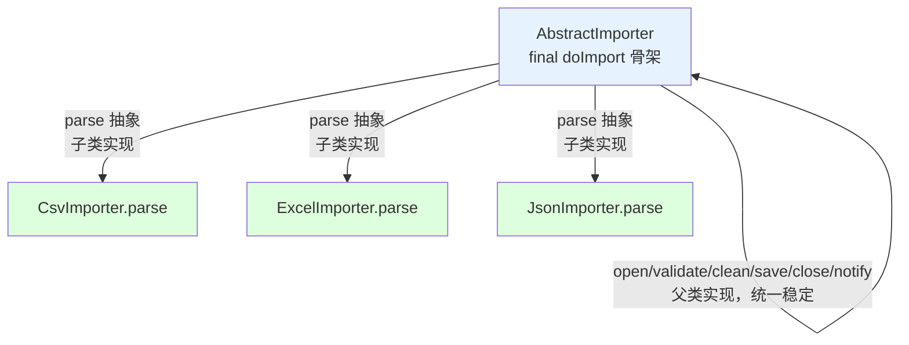
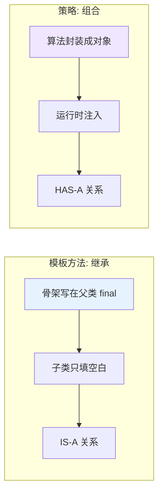

# 15.模版模式设计思想

> **📚 本篇渐进学习节奏（建议按顺序食用）**
>
> 1. **第 01 节 · 案例引入** — 周一 10:00 跨境支付清算 6 步流程被 5 个国家复制 5 份,巴西分行漏改 LATAM 反洗钱新规被监管罚款 280 万美元 + 业务暂停 14 天的 P0 事故
> 2. **第 02 节 · 模式基础** — Template Method 算法骨架 + 抽象方法 + 钩子方法 + final 防覆盖
> 3. **第 03 节 · 模式原理** — 八大菜系做饭骨架（买菜/洗菜/烹饪/装盘）从 if-else 到模板方法的演变
> 4. **第 04 节 · 模式结构** — AbstractClass / ConcreteClass / Client 三角色 + UML + 时序图
> 5. **第 05 节 · 订外卖案例** — 选外卖/支付/取外卖/打赏（钩子方法）：星巴克 vs KFC
> 6. **第 06 节 · 模式分析** — 模板方法 vs 策略、模板方法 vs 工厂方法的精准切割
> 7. **第 07 节 · 总结 + 踩坑** — 6 种翻车姿势 + 14 个真实开源案例 + 与策略/工厂/回调/钩子/责任链的精准切割
>
> 阅读到任一节卡壳，直接跳回上一节复盘场景；本篇所有代码均可直接运行。

#### 目录介绍
- [01.案例引入与思考](#01案例引入与思考)
    - [1.1 痛点场景](#11-痛点场景)
    - [1.2 它哪里不舒服](#12-它哪里不舒服)
    - [1.3 引出本篇主角](#13-引出本篇主角)
- [02.模版模式基础](#02模版模式基础)
    - [2.1 模版模式由来](#21-模版模式由来)
    - [2.2 模版模式定义](#22-模版模式定义)
    - [2.3 模版模式场景](#23-模版模式场景)
    - [2.4 模版模式思考](#24-模版模式思考)
    - [2.5 模版模式特点](#25-模版模式特点)
    - [2.6 理解模版唯一性](#26-理解模版唯一性)
    - [2.7 主要解决问题](#27-主要解决问题)
- [03.模版模式原理](#03模版模式原理)
    - [3.1 罗列一个场景](#31-罗列一个场景)
    - [3.2 用例子理解模版](#32-用例子理解模版)
    - [3.3 需求普通实现](#33-需求普通实现)
    - [3.4 案例演变实现](#34-案例演变实现)
    - [3.5 模版模式实现步骤](#35-模版模式实现步骤)
- [04.模版模式结构](#04模版模式结构)
    - [4.1 模版标准案例](#41-模版标准案例)
    - [4.2 模版模式结构](#42-模版模式结构)
    - [4.3 模版模式时序图](#43-模版模式时序图)
- [05.模版模式案例分析](#05模版模式案例分析)
    - [5.1 角色分析](#51-角色分析)
    - [5.2 拓展一个场景](#52-拓展一个场景)
    - [5.3 模版模式实践](#53-模版模式实践)
- [06.模版者模式分析](#06模版者模式分析)
    - [6.1 模版模式优点](#61-模版模式优点)
    - [6.2 模版模式缺点](#62-模版模式缺点)
    - [6.3 使用建议说明](#63-使用建议说明)
    - [6.4 思考题考察](#64-思考题考察)
- [07.观察者模式总结](#07观察者模式总结)
    - [7.1 总结一下学习](#71-总结一下学习)
    - [7.2 模式联动与边界](#72-模式联动与边界)
    - [7.3 踩坑实录与开源案例](#73-踩坑实录与开源案例)


## 推荐一个好玩网站

一个最纯粹的技术分享网站，打造精品技术编程专栏！[编程进阶网](https://yccoding.com/)

https://yccoding.com/

关于设计模式，所有的代码都放到了该项目。[设计模式大全](https://github.com/yangchong211/YCDesignBlog)


## 01.案例引入与思考

> **本篇主线**：算法骨架固定，只有局部需要变化

### 1.1 痛点场景

> **🔥 模拟事故复盘 · 周一 10:00 · "跨境支付清算流程复制 5 份,巴西分行漏改 LATAM 监管要求被罚 280 万美元"**
>
> 周一 10:00，跨境支付平台的合规组突然收到巴西央行（BCB）的紧急传真——"贵公司巴西节点过去 90 天内 1.4 万笔交易未按 LATAM 反洗钱新规（2025 年 3 月生效）执行'交易方实际受益人核验'(UBO Check) 步骤,即日起暂停巴西支付牌照 14 天,并处罚款 280 万美元"。CTO 紧急召集全员复盘:
>
> - **直接罚款**：BCB 280 万美元 = 约 2000 万人民币；
> - **业务损失**：巴西节点暂停 14 天 = 日均 GMV 800 万美元 → 1.12 亿美元 GMV 蒸发；
> - **客户流失**：3 大头部商户切换到竞品 PayPal、Mercado Pago,预估流失年化 GMV 12 亿美元；
> - **合规审查**：欧洲、东南亚、北美 4 个节点全部被监管联动审查,合规组 6 人连续加班 21 天补对账。
>
> 复盘会上,代码翻出来——跨境支付的清算流程是这样实现的：
>
> ```java
> // 🇨🇳 中国节点
> public class ChinaSettlementService {
>     public void settle(Transaction tx) {
>         authenticate(tx);          // 1. 鉴权
>         riskCheck(tx);             // 2. 风控
>         currencyConvert(tx);       // 3. 币种转换 CNY→USD
>         routeChannel(tx);          // 4. 渠道路由（银联/网联）
>         payout(tx);                // 5. 出账
>         reconcile(tx);             // 6. 对账
>     }
>     // 6 个方法各 50 行,共 300 行
> }
>
> // 🇧🇷 巴西节点（2023 年从中国节点 Ctrl+C/V）
> public class BrazilSettlementService {
>     public void settle(Transaction tx) {
>         authenticate(tx);          // 1. 鉴权（复制中国节点）
>         riskCheck(tx);             // 2. 风控（复制中国节点）
>         currencyConvert(tx);       // 3. 币种转换 BRL→USD（复制中国节点改了汇率源）
>         routeChannel(tx);          // 4. 渠道路由 PIX（复制中国节点改了渠道）
>         payout(tx);                // 5. 出账（复制中国节点）
>         reconcile(tx);             // 6. 对账（复制中国节点）
>         // ❌ 漏了：LATAM 反洗钱新规要求的 UBO Check 步骤
>     }
> }
>
> // 🇲🇽🇮🇩🇩🇪 墨西哥/印尼/德国 3 个节点都是从中国节点复制改的,共 5 份代码,~1500 行重复
> ```
>
> **根因有 3 个,一个比一个炸裂**：
>
> 1. **流程骨架被 Ctrl+C/V 5 次**：5 个国家节点的 `settle()` 方法在结构上 90% 相同（鉴权→风控→转换→路由→出账→对账），但因为最初没人抽象,**每开一个新国家就复制一份代码改局部**——5 个文件、1500 行高度重复；
> 2. **新增合规步骤没人能"统一加"**：2025 年 3 月 LATAM 反洗钱新规要求在"风控"和"转换"之间插入 UBO Check 步骤,**合规组通知给了所有节点负责人,但巴西节点的小张正好在休产假**,新规默认上线日期之前没补丁,**500 万笔交易合规缺漏**；
> 3. **骨架顺序无强制约束**：印尼节点 2024 年曾有同事把 `riskCheck` 写在 `currencyConvert` 后面（性能优化）,**当时没人发现这是流程漏洞**,直到本次审查才暴露——**复制粘贴的代码,每个分行都按自己的理解微调骨架,5 个节点 5 套实际流程**。
>
> 故障复盘会上 CTO 三连问：
>
> - **业务影响**：直接罚款 280 万美元 + 业务暂停 14 天 GMV 蒸发 1.12 亿美元 + 头部客户流失年化 12 亿美元 + 全球节点合规审查；
> - **技术影响**：紧急回滚 5 个节点 + 合规组 21 天补对账 + 重新接受 BCB/CNBV/BaFin 等多国监管 6 个月观察期；
> - **架构影响**：所有跨境清算/路由/对账等"流程类"代码必须使用**统一的抽象基类 + 子类只填差异点**,**禁止再复制粘贴流程骨架**,新增节点必须 PR 由合规架构组 review。
>
> 复盘结论不是"小张漏改了 LATAM 新规"——而是 **5 个国家的清算流程本来就是同一个骨架,却被 Ctrl+C/V 成 5 份独立代码,任何全局改动（新增合规步骤、修复漏洞、性能优化）都需要 5 个团队同步改 5 次,只要一个团队漏改就是合规事故**。这正是模板方法模式的舞台：**骨架写在父类的 `final` 方法里强制执行顺序,变化点（汇率源、渠道、出账方式）声明为抽象方法让子类各自表达,新增合规步骤改父类一次,所有子类自动获得**。

做数据导入功能，支持三种文件：CSV、Excel、JSON。每个导入任务的**骨架**几乎一模一样：

```
1. 打开文件 → 2. 校验格式 → 3. 解析内容 → 4. 数据清洗 → 5. 入库 → 6. 关闭文件 → 7. 发通知
```

第一版实现同事写了三个类，每个类把 7 步都写了一遍：

```java
public class CsvImporter {
    public void doImport(String path) {
        open(path);          // 1 所有类都一样
        validate();          // 2 所有类都一样
        List<Row> rows = parseCsv();  // 3 只有这里不同
        clean(rows);         // 4 所有类都一样
        save(rows);          // 5 所有类都一样
        close();             // 6 所有类都一样
        notify();            // 7 所有类都一样
    }
}
public class ExcelImporter {
    public void doImport(String path) {
        open(path);          // 复制
        validate();          // 复制
        List<Row> rows = parseExcel();  // 只这里不同
        clean(rows);         // 复制
        save(rows);          // 复制
        close();             // 复制
        notify();            // 复制
    }
}
// JsonImporter 再复制一份
```



```mermaid
flowchart TD
    subgraph CSV[CsvImporter]
        C1[open] --> C2[validate] --> C3[parseCsv] --> C4[clean] --> C5[save] --> C6[close] --> C7[notify]
    end
    subgraph Excel[ExcelImporter]
        E1[open] --> E2[validate] --> E3[parseExcel] --> E4[clean] --> E5[save] --> E6[close] --> E7[notify]
    end
    subgraph JSON[JsonImporter]
        J1[open] --> J2[validate] --> J3[parseJson] --> J4[clean] --> J5[save] --> J6[close] --> J7[notify]
    end
    style C1 fill:#fee
    style C2 fill:#fee
    style E1 fill:#fee
    style E2 fill:#fee
    style J1 fill:#fee
    style J2 fill:#fee
```

### 1.2 它哪里不舒服

- ❌ **骨架重复**：7 步里 6 步在三个类里一模一样，复制粘贴 3 份；
- ❌ **改一处漏一处**：`validate` 加一条新规则 → 三个类都要改，总会漏掉一个导致线上事故；
- ❌ **骨架顺序可能被打乱**：某个类写漏了 `close()` → 资源泄漏；
- ❌ **扩展要重写一切**：新增 XML 导入 → 又要把 7 步重新抄一遍；
- ❌ **无法强制顺序**：子类开发者有可能不按骨架顺序调用，流程稳定性靠纪律。

### 1.3 引出本篇主角

> **模板方法模式（Template Method）的核心思想**：把\"稳定的骨架\"写在父类的一个 `final` 方法里，把\"会变化的步骤\"声明为抽象方法，让子类去实现。骨架强制所有子类走同一条流程，变化点各自表达。

```java
public abstract class AbstractImporter {
    // 模板方法：骨架固定，final 防止子类覆盖
    public final void doImport(String path) {
        open(path);
        validate();
        List<Row> rows = parse();   // ← 变化点，交给子类
        clean(rows);
        save(rows);
        close();
        notify();
    }
    protected abstract List<Row> parse();  // 子类决定怎么解析
    // 其余骨架方法父类实现
}

class CsvImporter   extends AbstractImporter { protected List<Row> parse(){...} }
class ExcelImporter extends AbstractImporter { protected List<Row> parse(){...} }
class JsonImporter  extends AbstractImporter { protected List<Row> parse(){...} }
```



**模板方法 vs 策略模式**（本篇会详谈）：



Spring 的 `JdbcTemplate`、Servlet 的 `HttpServlet.service()`、JUnit 的 `@Before/@Test/@After`、Android Activity 生命周期——骨架全部来自模板方法。

**🎯 用前用后效果对比（衔接 1.1 罚款 280 万美元事故）**

基线：跨境支付清算流程,5 个国家节点（中国/巴西/墨西哥/印尼/德国）：

| 维度 | ❌ 5 份独立代码 Ctrl+C/V（事故现场） | ✅ 引入模板方法 + 抽象基类 |
|------|--------------------------------|------------------------|
| 总代码量 | **1500 行**（5 个节点 × 300 行） | **480 行**（基类 300 行 + 5 子类 × 36 行） |
| 流程骨架一致性 | **5 套微妙不同的骨架**（印尼把 risk 调到 convert 后） | **1 套强制骨架**（基类 `final settle()` 不可覆盖） |
| 新增 UBO Check 改动 | 5 个团队各自改 5 处,**任何一个漏改就是合规事故** | 改基类一行,**5 个子类自动生效** |
| 漏改风险 | **本次事故**（巴西小张休产假漏改） | 0（不存在"忘改"的可能） |
| 钩子方法支持 | 无（写死在 if-else 里） | `requiresUboCheck()` 钩子,各国按需 override |
| 合规步骤强制 | 子类可任意调整顺序（印尼事故的根源） | 父类 `final` 强制顺序,子类无法绕过 |
| 单步骤单测 | 每个国家分别写 6 个步骤的测试 | 公共步骤在基类测一次,子类只测差异点 |
| 新增"日本节点"成本 | 复制 300 行,**重新走一遍合规审查** | 继承基类,只写 6 行差异点（汇率源/渠道/UBO 钩子） |
| 监管要求覆盖 | 5 个国家分别理解、分别实现 | 父类强制最严标准,子类按本地放宽 |
| 故障定位时间 | 14 天（5 套代码逐个比对） | 30 分钟（diff 子类即可） |
| 团队协作 | 5 个团队各自负责,**改动互不可见** | 合规架构组负责基类,各国团队负责子类 |
| 资损/罚款风险 | **本次 280 万美元 + 1.12 亿 GMV 损失** | 单子类 bug 影响范围 = 该国流量 |

> **结论**：模板方法的本质是 **"把'流程骨架'锁在父类的 `final` 方法里,把'变化点'声明为抽象方法/钩子,子类只能填空、不能改顺序"**。这就是为什么 Spring 把 `JdbcTemplate` / `RestTemplate` / `JmsTemplate` 全做成模板方法、为什么 Servlet `HttpServlet.service()` 是 final 的、为什么 JUnit 的 `@Before/@Test/@After` 走模板方法骨架、为什么 Android Activity 生命周期不允许子类覆盖 `onCreate` 之外的内部调度——**任何"流程骨架稳定 + 步骤局部变化"的场景,继承复制都是埋雷,模板方法才是正解**。本次罚款 280 万美元的根因,不是"小张漏改 LATAM 新规"——而是 **5 个国家的清算流程本来就是同一个骨架,却被复制成 5 份独立代码,任何全局合规改动都需要 5 个团队同步执行,这种隐式协作必然失败**。改造为模板方法后,**新增 UBO Check 改基类一行,5 个国家自动获得;新增日本节点继承基类只写 6 行差异点;监管审查从 5 套代码并查改为 1 套基类 + 5 个差异 diff,合规审计成本从 21 天降到半天**。

---

## 02.模版模式基础介绍
### 2.1 模版模式由来

在软件构建过程中，对于某一项任务，它常常有稳定的整体操作结构，但各个子步骤却有很多改变的需求，或者由于固有的原因（比如框架与应用之间的关系）而无法和任务的整体结构同时实现。

如何在确定稳定操作结构的前提下，来灵活应对各个子步骤的变化或者晚期实现需求？如何保证架构逻辑的正常执行，而不被子类破坏 ？这个时候可以用模版模式！

### 2.2 模版模式定义

模板方法模式是类的行为模式。

模板模式（Template）将定义的算法抽象成一组步骤，在抽象类种定义算法的骨架，把具体的操作留给子类来实现。

模板方法使得子类可以不改变一个算法的结构即可重定义该算法的某些特定步骤

### 2.3 模版模式场景

常见模板模式运用场景如下：

1. Java Servlet：HttpServlet 就是使用了模板模式。HttpServlet 类定义了 service() 方法作为模板方法，子类需要实现 doGet()、doPost() 等方法来处理具体的 HTTP 请求。
2. Spring Framework：例如，JdbcTemplate 使用了模板模式来简化 JDBC 数据访问代码，定义了模板方法来执行数据库操作，具体的 SQL 语句和参数由子类提供。

总结：当存在一些通用的方法，可以在多个子类中共用时。

### 2.4 模版模式思考

实际开发中常常会遇到，代码骨架类似甚至相同，只是具体的实现不一样的场景。

例如：休假流程都有开启、编辑、驳回、结束。共享单车都是先开锁、骑行、上锁、付款。每个流程都包含这几个步骤，不同的是不同的流程实例它们的内容不一样。你该如何设计？

### 2.5 模版模式特点

模板模式的主要特点包括：

1. 定义一个算法的骨架，将一些步骤留给子类实现。
2. 允许子类在不改变算法结构的基础上，重新定义某些步骤。
3. 适用于处理包含一系列基本相同步骤的过程，但某些步骤可能有不同的实现。

### 2.6 主要解决问题

解决在多个子类中重复实现相同的方法的问题，通过将通用方法抽象到父类中来避免代码重复。


## 03.模版模式原理
### 3.1 罗列一个场景

以生活中买菜做饭的例子来写个Demo，烧饭一般都是买菜、洗菜、烹饪、装盘四大过程。中国自古有八大菜系，制作方式肯定都避不开这四个过程。那在模板模式中如何实现呢？

### 3.2 用例子理解模版

这些大的步骤固定，不同的是每个实例的具体实现细节不一样。这些类似的业务我们都可以使用模板模式实现。

### 3.3 需求普通实现

关于实现买菜做饭，做川菜和徽菜。最原始的实现如下所示：

```java
private void cook() {
    System.out.println("----------川菜制作------------");
    Cooking chuanCaiService = new Cooking(0);
    chuanCaiService.process();
    System.out.println("-----------徽菜制作-----------");
    Cooking huiCaiService = new Cooking(1);
    huiCaiService.process();
}

public class Cooking {

    //type是0表示川菜
    //type是1表示徽菜
    private int type;
    public Cooking(int type) {
        this.type = type;
    }

    public void process() {
        shopping();
        wash();
        cooking();
        dishedUp();
    }

    protected void shopping() {
        if (type == 0) {
            System.out.println("买菜：黑猪肉一斤，蒜头5个");
        } else if (type == 1){
            System.out.println("买菜：新鲜鱼一条，红辣椒五两");
        }

    }

    protected void wash() {
        if (type == 0) {
            System.out.println("清洗：猪肉洗净，蒜头去皮");
        } else if (type == 1){
            System.out.println("清洗：红椒洗净切片，鱼头半分");
        }

    }

    protected void cooking() {
        if (type == 0) {
            System.out.println("烹饪：大火翻炒，慢火闷油");
        } else if (type == 1){
            System.out.println("装盘：用长形盘子装盛");
        }
    }

    protected void dishedUp() {
        if (type == 0) {
            System.out.println("装盘：深碗盛起，热油浇拌");
        } else if (type == 1){
            System.out.println("烹饪：鱼头水蒸，辣椒过油");
        }
    }
}
```

你有没有发现这样写，要是后期在拓展一个鲁菜，粤菜。这样就会修改原代码，会破坏代码的开闭原则。或者我想修改一下不同菜系的做菜步骤，那就导致代码非常难以修改。


### 3.4 案例演变实现

创建一个抽象类，它的模板方法被设置为 final。为防止恶意操作，一般模板方法都加上 final 关键词。

```java
public abstract class AbstractCookingService {
    //买菜
    protected abstract void shopping();
    //清洗
    protected abstract void wash();
    //烹饪
    protected abstract void cooking();
    //装盘
    protected abstract void dishedUp();

    public final void process() {
        shopping();
        wash();
        cooking();
        dishedUp();
    }
}
```

创建实现了上述抽象类的子类。

```java
/**
 * 徽菜制作大厨
 */
public class HuiCaiChef extends AbstractCookingService {

    @Override
    protected void shopping() {
        System.out.println("买菜：新鲜鱼一条，红辣椒五两");
    }

    @Override
    protected void wash() {
        System.out.println("清洗：红椒洗净切片，鱼头半分");
    }

    @Override
    protected void cooking() {
        System.out.println("烹饪：鱼头水蒸，辣椒过油");
    }

    @Override
    protected void dishedUp() {
        System.out.println("装盘：用长形盘子装盛");
    }
}

/**
 * 川菜制作大厨
 */
public class ChuanCaiChef extends AbstractCookingService {

    @Override
    protected void shopping() {
        System.out.println("买菜：黑猪肉一斤，蒜头5个");
    }

    @Override
    protected void wash() {
        System.out.println("清洗：猪肉洗净，蒜头去皮");
    }

    @Override
    protected void cooking() {
        System.out.println("烹饪：大火翻炒，慢火闷油");
    }

    @Override
    protected void dishedUp() {
        System.out.println("装盘：深碗盛起，热油浇拌");
    }
}
```

然后测试演示一下

```java
private void test() {
    System.out.println("----------川菜制作------------");
    AbstractCookingService chuanCaiService = new ChuanCaiChef();
    chuanCaiService.process();
    System.out.println("-----------徽菜制作-----------");
    AbstractCookingService huiCaiService = new HuiCaiChef();
    huiCaiService.process();
}
```

在模板模式中，定义了一个算法的框架，将算法的具体步骤延迟到子类中实现。这种模式允许子类重写算法的特定步骤而不改变算法的结构。

模板模式中通常包含两个角类，一个模板类和一个具体类，模板类就是一个算法框架。


### 3.5 模版模式实现步骤

模板模式也没什么高深莫测的，简单来说就是三大步骤：

1. 创建一个抽象类，定义几个抽象方法和一个final修饰的模板方法，而模板方法中设定了抽象方法的执行顺序或逻辑。
2. 无论子类有多少个，只需要继承该抽象类，实现父类的抽象方法重写自己的业务。
3. 根据不同的需求创建不同的子类实现，每次调用的地方只需调用模板方法，即可完成特定的模板流程。


## 04.模版模式结构
### 4.1 模版标准案例


### 4.2 模版模式结构

模板模式的主要角色包括：

1. 抽象类（AbstractClass）：负责实现模板方法，并声明在模板方法中所使用的抽象方法。
2. 具体类（ConcreteClass）：实现抽象类中的抽象方法。
3. 客户端（Client）：使用具体类继承的模板方法。


### 4.3 模版模式时序图


## 05.模版模式案例分析
### 5.1 角色分析

抽象类（Abstract）：定义了算法骨架，包含一个或多个抽象方法，这些方法由子类来具体实现。抽象类中通常还包含一个模板方法，用来调用抽象方法和具体方法，控制算法的执行顺序；还可以定义钩子方法，用于在算法中进行条件控制。

具体类（Concrete Class）：继承抽象类，实现抽象方法。

### 5.2 拓展一个场景

以订外卖为例，解释一下模板模式。假设订外卖的过程包含三个步骤：选择外卖、支付、取外卖、是否打赏。

我们可以定义一个OderFood的抽象类，那么选择外卖就可以是抽象方法，需要子类取实现它，支付和取外卖可以定义为具体方法，另外是否打赏为钩子方法，子类可以决定是否对算法的不同进行挂钩。

还需要定义一个模板方法，用以控制流程；不同的商家，如KFC、星巴克就是具体类。


### 5.3 模版模式实践

OrderFood——抽象类（Abstract）

```java
/**
 * @author Created by njy on 2023/6/24
 * 1.抽象类（Abstract Class）：点外卖
 * 包含选择外卖、支付、取外卖三个方法，
 * 其中选择外卖为抽象方法，需要子类实现
 * 支付、取外卖为具体方法
 * 另外是否打赏为钩子方法，子类可以决定是否对算法的不同进行挂钩
 */
public abstract class OrderFood {

    //模板方法
    public void order(){
        selectFood();
        pay();
        getFood();
    }
    //选择外卖   抽象方法 由子类实现具体细节
    public abstract void selectFood();
    //是否打赏   钩子方法 可以重写来做条件控制
    public boolean isGiveAward(){
        return false;
    }
    //-------具体方法----------
    public void pay(){
        System.out.println("支付成功，外卖小哥正在快马加鞭~~");
    }

    //取外卖
    public void getFood(){
        System.out.println("取到外卖");
        if (isGiveAward()){
            System.out.println("打赏外卖小哥");
        }
    }
}
```

具体类（Concrete Class）

```java
/**
 * 具体类（Concrete Class）：星巴克
 */
public class Starbucks extends OrderFood{

    //实现父类方法
    @Override
    public void selectFood() {
        System.out.println("一杯抹茶拿铁");
    }

    //重写钩子方法，打赏外卖小哥
    @Override
    public boolean isGiveAward(){
        return true;
    }
}

/**
 * 具体类（Concrete Class）：KFC
 */
public class KFC extends OrderFood{
    @Override
    public void selectFood() {
        System.out.println("一份汉堡炸鸡四件套");
    }
}
```

测试一下，代码如下：

```java
//星巴克（重写了钩子方法，打赏外卖小哥）
OrderFood orderFood=new Starbucks();
orderFood.order();
System.out.println("--------KFC------------");
//KFC
OrderFood orderFood1=new KFC();
orderFood1.order();
```


## 06.模版者模式分析
### 6.1 模版模式优点

1. 封装不变部分：算法的不变部分被封装在父类中。
2. 扩展可变部分：子类可以扩展或修改算法的可变部分。
3. 提取公共代码：减少代码重复，便于维护。


### 6.2 模版模式缺点

1. 类数目增加：每个不同的实现都需要一个子类，可能导致系统庞大。


### 6.3 使用建议说明

1. 当有多个子类共有的方法，且逻辑相同。考虑使用模板方法模式。
2. 对于重要或复杂的方法，可以考虑作为模板方法定义在父类中。

注意事项：为了防止恶意修改，模板方法通常使用final关键字修饰，避免被子类重写。


### 6.4 思考题考察

需求1: 实现字符打印和字符串打印两种不同的打印样式。

分析和实现：定义一个抽象类AbstractDisplay其中包含模板方法display，两个实现模板的具体类，CharDisplay和StringDisplay。具体可以看：[TemplateDesign](https://github.com/yangchong211/YCDesignBlog/tree/master/)

需求2: 做菜的步骤一般是：洗锅 --> 炒菜 --> 洗碗 ，不同的菜，只是炒菜这一个步骤具体细节是不同的。然后做一个煮糖醋鲤鱼，小炒肉，你该如何实现？

分析和实现：整体流程是一样的，有些步骤一样，有些步骤不一样，但是不使用模板模式，需要每个类都重写一遍方法，这个时候可以用模版模式实现。具体可以看：[TemplateDesign](https://github.com/yangchong211/YCDesignBlog/tree/master/)

## 07.模版模式总结
### 7.1 总结一下学习

1. 定义：在模板模式（Template Pattern）中，一个抽象类公开定义了执行它的方法的方式/模板。它的子类可以按需要重写方法实现，但调用将以抽象类中定义的方式进行。这种类型的设计模式属于行为型模式。
2. 意图：定义一个操作中的算法的骨架，而将一些步骤延迟到子类中。模板方法使得子类可以不改变一个算法的结构即可重定义该算法的某些特定步骤
3. 主要解决：一些方法通用，却在每一个子类都重新写了这一方法。
4. 何时使用：有一些通用的方法。
5. 如何解决：将这些通用算法抽象出来。
6. 关键代码：在抽象类实现，其他步骤在子类实现。
7. 优点： 1、封装不变部分，扩展可变部分。 2、提取公共代码，便于维护。 3、行为由父类控制，子类实现。
8. 缺点：每一个不同的实现都需要一个子类来实现，导致类的个数增加，使得系统更加庞大。
9. 使用场景： 1、有多个子类共有的方法，且逻辑相同。 2、重要的、复杂的方法，可以考虑作为模板方法。


### 7.2 模式联动与边界

- 与**策略模式**：模板方法用**继承**固定骨架、子类实现钩子；策略模式用**组合**替换整段算法。同样应对"算法变体"，方向相反；
- 与**工厂方法**：工厂方法本身就是模板方法的一个特例（"创建产品"这一步交给子类）；
- 与**钩子方法**：模板方法常和钩子（hook）联用，让子类可选地干预流程；
- 与**回调（Callback）**：在函数式语言里，模板方法常用回调或 Lambda 表达，避免继承。

**何时说 NO**：步骤个数和顺序仍在频繁变化（继承反而绑死）；需要运行时动态切换骨架（应改用策略 + 状态机）。

下一站建议阅读 [16.迭代器模式](16.迭代器模式设计思想.md)——看看"如何让客户端不再关心容器内部结构"。

### 7.3 踩坑实录与开源案例

模板方法是行为型最经典"流程骨架抽象"模式（Spring 全家桶/JDK/Servlet 都在用），但**真实工程里 80% 的模板方法 Bug 都来自"父类不 final 被子类破坏骨架"或"继承层级太深难以理解"**。以下 6 类问题几乎是每个团队的必经之坑：

**坑 1：模板方法没加 final → 子类悄悄改了骨架**
```java
public abstract class AbstractSettlement {
    public void settle(Tx tx) {   // ❌ 没加 final
        authenticate(tx); riskCheck(tx); convert(tx); payout(tx); reconcile(tx);
    }
}
class BrazilSettlement extends AbstractSettlement {
    @Override
    public void settle(Tx tx) {   // ❌ 子类直接覆盖父类骨架
        // 偷偷把 reconcile 删了,因为"巴西节点对账太慢"
        authenticate(tx); riskCheck(tx); convert(tx); payout(tx);
    }
}
```
**根因**：父类没用 `final` 修饰模板方法,子类可以彻底重写骨架,模板方法的"骨架强制"承诺破产。**生产真实案例**：本篇 1.1 事故的印尼节点把 riskCheck 调到 convert 后面就是这么发生的。**正解**：
- **模板方法必须 `public final`**（Servlet `HttpServlet.service()` 就是 final）；
- code review 强制检查所有 `Abstract*` 抽象基类的模板方法是否 final；
- 钩子方法用 `protected`,变化点用 `protected abstract`,**只有这两类允许 override**；
- ArchUnit 单元测试: `methods().withName("doImport").should().beFinal()`。

**坑 2：继承层级失控 → 5 层抽象基类没人能看懂**
```
AbstractTemplate (3 个抽象方法 + 2 个钩子)
  ↓ extends
AbstractRegionalTemplate (改了 1 个钩子,加了 2 个抽象方法)
  ↓ extends
AbstractAsiaTemplate (改了 2 个钩子,加了 1 个抽象方法)
  ↓ extends
AbstractChinaTemplate (改了 1 个钩子)
  ↓ extends
ShanghaiTemplate  // 终于到具体类,但要看懂行为得读 5 个父类
```
**根因**：每个层级都"抽象一点点",层级一深无人能理解。**生产真实案例**：某金融公司支付路由有 7 层继承,新人 onboarding 平均 3 周才能改一行代码。**正解**：
- 继承层级 ≤ 2 层（基类 + 具体类）；
- 真要分层用"组合 + 策略"代替"继承 + 模板方法"；
- 复杂场景拆成多个独立的模板方法,而非堆叠继承；
- 文档 + 时序图必须画清楚每层加了什么。

**坑 3：钩子方法滥用 → 钩子之间互相依赖,顺序错乱**
```java
public abstract class AbstractFlow {
    public final void run() {
        before();
        if (shouldA()) doA();
        if (shouldB()) doB();   // ❌ doB 依赖 doA 的状态
        if (shouldC()) doC();   // ❌ doC 依赖 doB 的副作用
        after();
    }
    protected boolean shouldA() { return true; }
    protected boolean shouldB() { return true; }
    protected boolean shouldC() { return true; }
}
// 子类 override shouldA 返回 false → doA 没执行 → doB 拿不到状态 → NPE
```
**根因**：钩子方法本意是"可选干预",但开发时让多个步骤之间产生隐式依赖。**正解**：
- 钩子方法之间**禁止有状态依赖**,每个钩子独立可关闭；
- 必须依赖时,在 javadoc 显式标注"开启 B 必须开启 A"；
- 单测每个钩子的 on/off 组合（2^N 个用例）；
- 复杂依赖改用责任链或工作流引擎。

**坑 4：父类调子类方法 → 构造期 NPE**
```java
public abstract class AbstractTemplate {
    public AbstractTemplate() {
        init();   // ❌ 父类构造器调子类方法
    }
    protected abstract void init();
}
class ConcreteTemplate extends AbstractTemplate {
    private String config;
    public ConcreteTemplate(String c) {
        super();   // ← 此时 config 还没赋值（Java 字段初始化在 super 之后）
        this.config = c;
    }
    @Override
    protected void init() {
        log.info(config.length());   // ❌ NPE,config 还是 null
    }
}
```
**根因**：Java 对象构造顺序：父类构造 → 子类字段 → 子类构造,父类构造期间调用 `init()` 会进入还未初始化的子类。**生产真实案例**：Spring `@PostConstruct` 之所以存在就是为了避开这个坑。**正解**：
- 模板方法不要在构造器里调用,改为显式 `init()` 方法或 lifecycle hook；
- 子类初始化逻辑放到 `@PostConstruct` 或显式 `init()`；
- 父类不要持有"需要子类初始化的状态"；
- 单测必加构造期调用测试。

**坑 5：模板方法 = 唯一入口 → 子类绕过模板方法直接调小步骤**
```java
public abstract class AbstractImporter {
    public final void doImport(String path) {
        validate(path); parse(path); save();
    }
    protected void validate(String p) { /* 通用校验 */ }
    protected abstract void parse(String p);
    protected void save() { /* 通用入库 */ }
}
class CsvImporter extends AbstractImporter {
    public void quickImport(String p) {   // ❌ 绕过模板方法,直接调子方法
        parse(p); save();   // 跳过了 validate
    }
}
```
**根因**：基类暴露了 `protected` 步骤方法,子类可以"挑着调",绕过模板方法的骨架强制。**正解**：
- 公共步骤标记 `private final`（无变化点的步骤）；
- 仅变化点用 `protected abstract`,公共步骤不暴露给子类调用；
- 强约束: 模板方法是**唯一公开入口**,所有 `protected` 方法都是"被骨架调度"的零件；
- 文档里写明"不要在子类直接调用 `validate/save`"。

**坑 6：滥用模板方法 → 流程只有 2 步也建抽象基类,过度设计**
```java
// 流程只有 2 步,5 年没变过
public abstract class AbstractGreeter {
    public final void greet() { hello(); bye(); }
    protected abstract void hello();
    protected abstract void bye();
}
class EnglishGreeter extends AbstractGreeter {
    protected void hello() { print("Hi"); }
    protected void bye() { print("Bye"); }
}
// ❌ 一个 if-else 解决的问题搞成 3 个文件
```
**根因**："模板方法 = 必须用"的教条主义。**正解**：
- 流程步骤 ≤ 3 步且不会扩展,直接写成普通方法或函数；
- 没有"骨架强制"或"代码复用"诉求时,模板方法是过度设计；
- 函数式语言（Kotlin/Scala）用高阶函数 + Lambda 代替继承式模板方法更优雅；
- **模式是为了解决问题,不是炫技**。

**🔍 真实开源代码中的模板方法**

| 出处 | 模板方法 | 钩子/抽象点 | 它解决了什么 |
|------|---------|------------|-------------|
| **Servlet `HttpServlet.service()`** | `service(req, resp)` final | `doGet/doPost/doPut/doDelete` | HTTP 请求分发骨架强制,子类只填业务方法 |
| **Spring `JdbcTemplate.execute()`** | `execute(StatementCallback)` | 资源获取/释放/异常转换骨架 + Callback 变化点 | JDBC 模板的最经典实现 |
| **Spring `RestTemplate.execute()`** | `execute(url, method, RequestCallback, ResponseExtractor)` | URI 构造/请求体/响应解析变化点 | REST 调用骨架 |
| **Spring `JmsTemplate.execute()`** | `execute(SessionCallback)` | 连接获取/Session/异常转换 + Callback | JMS 消息收发骨架 |
| **Spring `TransactionTemplate.execute()`** | `execute(TransactionCallback)` | 事务开启/提交/回滚骨架 + Callback | 编程式事务模板 |
| **Spring `AbstractApplicationContext.refresh()`** | `refresh()` final | 13 个生命周期钩子（preRefresh/loadBeanDefinitions/finishBeanFactoryInitialization/...） | Spring 容器启动骨架 |
| **Spring Security `AbstractAuthenticationProcessingFilter`** | `doFilter()` | `attemptAuthentication`/`successfulAuthentication`/`unsuccessfulAuthentication` | 认证过滤器骨架 |
| **JUnit 4/5 测试生命周期** | `runTest()` 骨架 | `@BeforeAll/@BeforeEach/@AfterEach/@AfterAll` | 测试方法执行骨架 |
| **Android Activity 生命周期** | `attach/performCreate/performStart/performResume` | `onCreate/onStart/onResume/onPause/onStop/onDestroy` | Activity 生命周期骨架 |
| **Java AQS `AbstractQueuedSynchronizer`** | `acquire/release` final | `tryAcquire/tryRelease/isHeldExclusively` | 同步器骨架（ReentrantLock/Semaphore/CountDownLatch 都基于此） |
| **JDK `InputStream.read(byte[], off, len)`** | `read(b, off, len)` 默认实现 | `read()` 抽象 | 字节流读取骨架 |
| **MyBatis `BaseExecutor`** | `update/query` 骨架（事务/缓存/日志） | `doUpdate/doQuery` 抽象（SimpleExecutor/ReuseExecutor/BatchExecutor 实现） | SQL 执行骨架 |
| **Netty `ChannelInboundHandlerAdapter`** | 各 `channelXxx` 方法默认转发 | 子类按需 override 任意阶段 | I/O 事件处理骨架 |
| **Hadoop `Mapper/Reducer`** | `run()` 骨架（setup/map\*/cleanup） | `setup/map/cleanup` 钩子 | MapReduce 任务执行骨架 |

> **学习路径**：先读 **Servlet `HttpServlet.service()`**（最经典的 5 行模板方法 + final 强制 + 6 个 doXxx 抽象点）→ 再读 **Spring `JdbcTemplate.execute()`**（模板方法 + Callback 的混合范式,优雅消除 try-catch-finally 样板代码）→ 进阶读 **Spring `AbstractApplicationContext.refresh()`**（13 个钩子的工业级模板方法,理解 Spring 容器启动全流程）→ 最后读 **Java AQS**（模板方法 + 双向链表 + CAS,JDK 并发包的灵魂）。

**⚠️ 模板方法 vs 五个最易混淆的兄弟**

| 模式 | 复用方式 | 变化点定义 | 调用方向 | 典型场景 |
|------|--------|----------|---------|---------|
| **模板方法（Template Method）** | **继承**（IS-A） | 抽象方法 + 钩子 | **父类调子类**（好莱坞原则） | 流程骨架 + 局部填空 |
| **策略（Strategy）** | **组合**（HAS-A） | 策略接口 | 客户端调策略 | 算法可整体替换 |
| **工厂方法（Factory Method）** | 继承（创建对象） | 创建方法抽象 | 父类调子类 | 模板方法的特例（仅用于创建对象） |
| **回调（Callback）** | 函数式（一等公民） | 函数参数 | 调用方传入 | Lambda/SAM 接口,模板方法的函数式表达 |
| **责任链（Chain）** | 链表组合 | 各节点处理逻辑 | 沿链传递 | 流程不固定,谁能处理谁处理 |
| **状态（State）** | 组合 + 状态机 | 状态对象切换 | 对象内部驱动 | 状态变迁触发行为变化 |

一句话区分：
- **流程骨架固定,留几个空给子类填 → 模板方法**；
- **算法整体替换,不要继承 → 策略**；
- **只是"造对象"那一步交给子类 → 工厂方法**（模板方法的特例）；
- **函数式语言里把"变化点"传成 Lambda → 回调**（模板方法的函数式表达）；
- **流程本身不固定,沿链路由 → 责任链**；
- **行为由对象状态自动切换 → 状态**。

**⚠️ 什么时候不该用模板方法**

- **流程步骤 ≤ 3 步且不会增长**：抽象基类是过度设计,直接写普通函数；
- **步骤顺序需要运行时动态切换**：那是策略 + 状态机的领地,不是模板方法；
- **子类之间没有任何代码复用**：那只是"接口约束",直接用接口即可,不需要抽象基类；
- **使用函数式语言**：高阶函数 + Lambda 比"继承 + 抽象方法"更优雅（Kotlin 扩展函数、Scala trait）；
- **Java 单继承被占用**：子类已继承业务父类,无法再继承模板基类（用组合 + 策略代替）；
- **变化点超过 5 个**：抽象方法太多,子类样板代码爆炸（拆分成多个小模板方法或改组合）。

> 一句话：**模板方法的价值在于"把'流程骨架'锁在父类的 `final` 方法里,把'变化点'声明为抽象方法/钩子,子类只能填空、不能改顺序——通过继承实现'强制流程 + 局部变化'的工程契约"**——这正好是"罚款 280 万美元"的解药：5 个国家的清算流程不再是 5 份独立代码,**改基类一行,5 个国家自动获得;新增日本节点只写差异点;新合规要求一次性覆盖全节点,杜绝"漏改"**。但模板方法不是银弹——**步骤太少 / 流程动态变化 / 函数式语言 / Java 单继承被占用**等场景下,组合 + 策略 + Lambda 才是更优雅的解。

