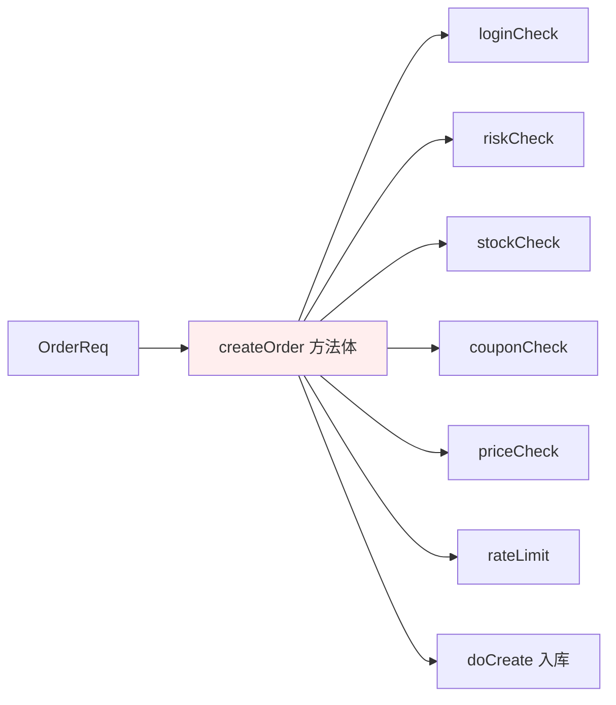
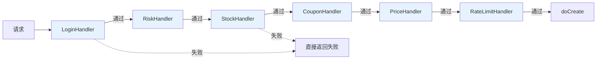
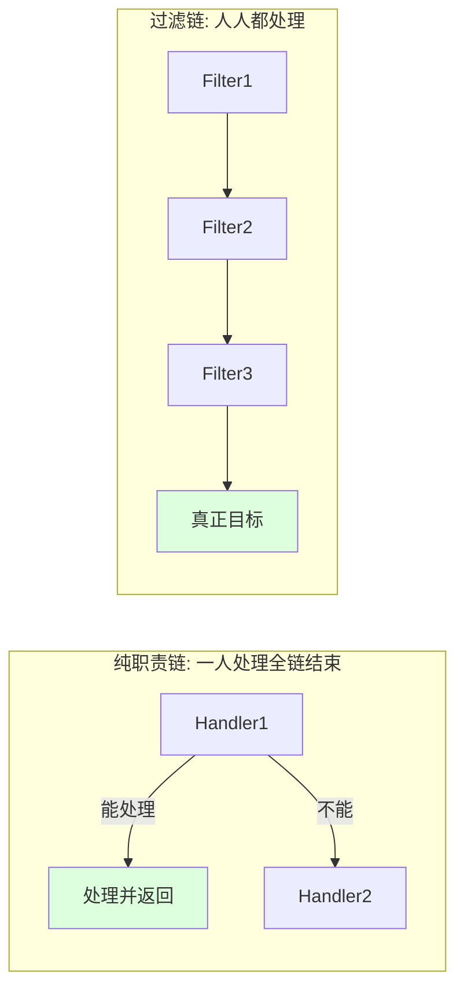
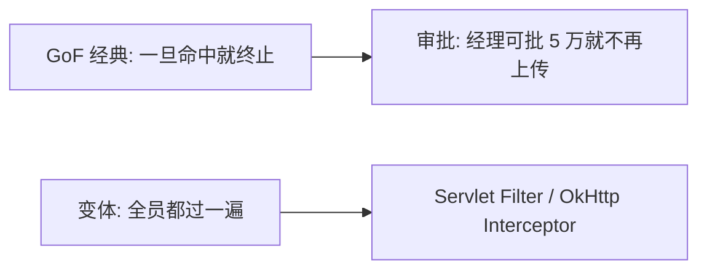
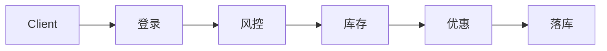
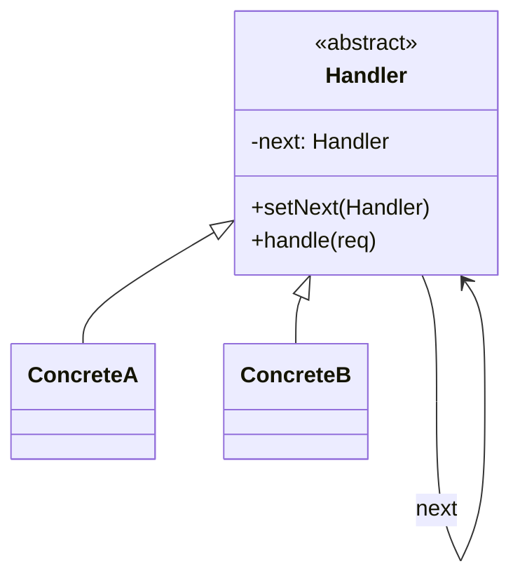
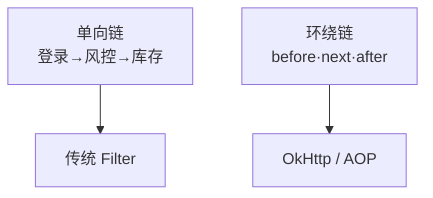
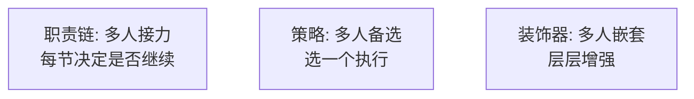

# 17.职责链模式设计思想

> **📚 本篇渐进学习节奏（建议按顺序食用）**
>
> 1. **第 01 节 · 案例引入** — 双 11 大促直播带货 4 小时,内容审核硬编码 200 行 if-else,新增"反诈骗"规则插队漏审,主播账号违禁词全场未拦截 → 监管通报 → 官方账号封禁 14 天 → **直播 GMV 损失 2300 万 + 主播解约赔款 + 品牌降级**的 P0 事故
> 2. **第 02 节 · 模式基础** — 多处理器顺序传递,纯链 vs 过滤链两种变体
> 3. **第 03 节 · 模式原理** — 链表 + 多态 + 短路控制,if-else 反例 → 链节点改造
> 4. **第 04 节 · 模式结构** — Handler 抽象 + ConcreteHandler + Client 组装链
> 5. **第 05 节 · 真实案例** — 下单 6 道校验链 + Servlet/OkHttp/Spring Security/Netty/MyBatis 拦截器全家桶
> 6. **第 06 节 · 模式分析** — 职责链 vs 策略 vs 装饰器对比,链长度/调试/终止控制
> 7. **第 07 节 · 总结 + 踩坑** — 6 种翻车姿势 + 14 个真实开源案例 + 与策略/装饰器/命令/管道的精准切割
>
> 阅读到任一节卡壳,直接跳回上一节复盘场景；本篇所有代码均可直接运行。

#### 目录介绍

- 01.案例引入与思考
- 02.职责链模式基础介绍
- 03.职责链模式原理
- 04.职责链模式结构
- 05.职责链模式案例
- 06.职责链模式分析
- 07.职责链模式总结
  - 7.1 一句话记忆
  - 7.2 适用环境
  - 7.3 思考题
  - 7.4 踩坑实录与开源案例

---

## 01.案例引入与思考

> **本篇主线**：多个处理器依次校验一个请求

### 1.1 痛点场景

> **🔥 模拟事故复盘 · 双 11 大促 · "直播带货违禁词漏审,平台被通报封禁 14 天,GMV 损失 2300 万"**
>
> 双 11 大促预热第三天,头部主播 A（粉丝 4800 万,坑位费 80 万/场）开播 4 小时大场。直播间在线峰值 230 万人,GMV 跑到 6800 万正在冲榜。**18:23,主播在介绍一款"金融理财产品"的链接时,使用了违规承诺收益话术 + 涉嫌虚假宣传**——监管侧实时巡查捕捉到,内容安全团队立刻介入,但**直播间内容审核服务全程返回"通过"**,后台日志显示这条违规内容根本就**没进过审核**。
>
> 4 小时直播结束,**当晚监管下达"违反广告法 + 金融营销违规"双重通报**。次日凌晨 03:30,平台收到行政处罚:
>
> - **官方主账号封禁 14 天**（直播 + 短视频 + 站内广告全停）；
> - **大促剩余 18 天的直播日历整体降权**（流量减少 60%）；
> - **罚款 + 整改报告 + 高管面谈监管**。
>
> 损失复盘:
>
> - **直接 GMV 损失**：14 天封禁期 + 18 天降权,日均直播 GMV 1.6 亿,**直接 GMV 损失 23 亿,平台抽佣 1% 折损 2300 万**；
> - **主播赔款**：头部 A 单场坑位费 80 万,因平台封禁导致后续 6 场无法履约,**赔款 480 万 + 主播经纪公司解约威胁**；
> - **品牌商赔偿**：本场带货品牌方 18 家,因违规连带处理,**品牌方索赔 + 公关费用 670 万**；
> - **监管成本**：法务团队 3 周整改报告 + 5 名高管现场面谈 + 政策合规岗紧急扩招 12 人。
>
> 复盘会上,内容审核服务 `LiveContentReviewService` 翻出来——**整整 287 行 if-else,5 个团队轮流加规则,没人敢动**：
>
> ```java
> public class LiveContentReviewService {
>     // 直播实时弹幕 + 主播口播 + 商品链接 + 评论 全审核入口
>     public ReviewResult review(LiveContent content) {
>         // 第 1 道:基础敏感词（2019 年内容团队加的）
>         if (containsSensitiveWord(content)) {
>             return ReviewResult.reject("敏感词");
>         }
>         // 第 2 道:广告法违禁词（2020 年法务团队加的）
>         if (containsAdLawViolation(content)) {
>             return ReviewResult.reject("广告法");
>         }
>         // 第 3 道:涉黄涉政（2021 年安全团队加的,因为顶层要求加在最前面 → 但实际上代码塞在中间）
>         if (containsPornPolitics(content)) {
>             return ReviewResult.reject("涉黄涉政");
>         }
>         // 第 4 道:涉赌涉诈（2022 年金融合规团队加的）
>         if (content.getCategory() == Category.FINANCE) {
>             if (containsGamblingFraud(content)) {
>                 return ReviewResult.reject("涉赌涉诈");
>             }
>         }
>         // 第 5 道:虚假宣传（2023 年质量团队加的,但只对"商品介绍"生效,直播口播没接入！）
>         if (content.getType() == ContentType.PRODUCT_INTRO) {
>             if (containsFalseAdvertising(content)) {
>                 return ReviewResult.reject("虚假宣传");
>             }
>         }
>         // 第 6 道:金融营销违规（2024 年金融合规团队紧急加的,但代码 review 时被合到了广告法分支里 → 被前面 return 短路掉了）
>         // ❌ 这段代码永远走不到!
>         if (content.getCategory() == Category.FINANCE) {
>             if (containsFinanceMarketingViolation(content)) {
>                 return ReviewResult.reject("金融营销违规");
>             }
>         }
>         // 第 7 道:反诈骗（2024 年 11 月双 11 前一周紧急加的,被插队到第 1 行 → 但是开发把分支结构破坏了）
>         // ……还有 280 行 if-else
>         return ReviewResult.pass();
>     }
> }
> ```
>
> **根因有 4 个,一个比一个炸裂**：
>
> 1. **287 行 if-else 没人敢动 → 规则顺序错位**：金融营销违规校验是 2024 年新加的,但因为它放在了广告法之后,**而广告法分支里有个 catch-all 兜底返回了 pass()**,导致金融营销违规这一段**永远走不到**。本次主播的违规话术正好命中"金融营销违规"规则,**但被前面的广告法分支静默吃掉了**；
> 2. **审核类型分支硬编码 → 直播口播未接入虚假宣传校验**：第 5 道虚假宣传只对 `ContentType.PRODUCT_INTRO` 生效,**直播实时口播 `ContentType.LIVE_VOICE` 根本不走这条规则**——因为加这条规则的人不知道直播口播也算商品介绍；
> 3. **新增反诈骗规则插队到第 1 行 → 破坏其他分支结构**：双 11 前一周紧急加的反诈骗规则,新人开发为了"重要的放最前面",直接插到了 if 链最顶部,**结果把后面 6 个规则的 else-if 链改散了**,部分规则的 return 语句失去了 else 守护,**变成了静默 fall-through**；
> 4. **5 个团队各自加规则 → 顺序/优先级/灰度全靠口头约定**：内容/法务/安全/金融/质量 5 个团队都往这一个 service 里塞代码,**没有统一的规则注册中心,没有规则版本号,没有灰度开关,没有审计日志**。事故复盘时回放日志,**根本不知道哪条规则在哪个版本生效,哪条规则被哪个分支短路了**。
>
> 故障复盘会上 CTO + 法务总监 + CEO 三人三连问：
>
> - **业务影响**：GMV 损失 2300 万 + 主播赔款 480 万 + 品牌赔偿 670 万 + 法务整改 + 监管面谈,**总损失 3450 万 + 不可估量的政策风险**；
> - **技术影响**：内容审核服务 287 行 if-else 必须重构,**所有规则改为可插拔的 ReviewHandler 链节点,每条规则有独立的版本/灰度/审计**；
> - **架构影响**：所有"多步校验/审核/拦截"场景**严禁** if-else 累加超过 5 条,必须改造为 **职责链 / 责任链 / Filter Chain**,新人入职考核必考此题,代码 review 卡控规则强制扫描超过 80 行的 if 链。
>
> 复盘结论不是"代码不严谨"——而是 **"多步校验"和"主流程"在 287 行 if-else 里被强行耦合,5 个团队都往同一个方法里塞规则,顺序 / 优先级 / 灰度 / 短路全靠口头约定,任何一个新规则插入都可能破坏前面的规则结构,任何一个团队的修改都可能让其他团队的规则失效**。这正是职责链模式的舞台：**每条审核规则独立成一个 `ReviewHandler` 类,自己负责"我要不要拦截 / 我要不要继续传"的决策,5 个团队各自维护各自的 Handler,规则注册中心统一管理顺序 / 优先级 / 灰度 / 审计,主流程只接触链头**。

电商下单接口在真正落库前要依次做 6 道校验：登录 → 风控 → 库存预占 → 优惠券核销 → 价格计算 → 防刷限流。第一版实现把全部逻辑塞在一个方法里：

```java
public OrderResult createOrder(OrderReq req) {
    if (!loginCheck(req)) return fail("未登录");
    if (!riskCheck(req))  return fail("风控拦截");
    if (!stockCheck(req)) return fail("库存不足");
    if (!couponCheck(req)) return fail("优惠券不可用");
    if (!priceCheck(req)) return fail("价格异常");
    if (!rateLimit(req))  return fail("请求太频繁");
    return doCreate(req);
}
```



### 1.2 它哪里不舒服

- ❌ **主流程被校验淹没**：`createOrder` 本该关心"下单落库"，却被 6 个 if-else 围起来；
- ❌ **顺序写死**：哪天风控要换到库存之后——要改主流程；
- ❌ **校验可插拔？不可能**：灰度关闭"风控"这一步、只对 VIP 跳过"防刷"——if-else 里塞开关，越塞越乱；
- ❌ **复用困难**：支付、退款、取消订单也要做一部分相同校验——校验代码各自复制；
- ❌ **扩展要改核心**：新增一步"黑名单校验"——必须改 `createOrder`，违反开闭原则。

### 1.3 引出本篇主角

> **职责链模式（Chain of Responsibility）的核心思想**：把每个校验/处理器做成独立的类，**各自持有一个"下一环"引用**，形成一条链。请求沿链传递，每个处理器只关心自己要不要处理、要不要继续传；调用方只和链头打交道。

```java
abstract class OrderHandler {
    protected OrderHandler next;
    public OrderHandler linkWith(OrderHandler n){ this.next = n; return n; }
    public abstract OrderResult handle(OrderReq req);
    protected OrderResult toNext(OrderReq req) {
        return next == null ? OrderResult.ok() : next.handle(req);
    }
}

class LoginHandler extends OrderHandler { public OrderResult handle(OrderReq r){
    if (!logined(r)) return fail("未登录");
    return toNext(r);
}}
// 其余处理器类似

// 组装链
OrderHandler head = new LoginHandler();
head.linkWith(new RiskHandler())
    .linkWith(new StockHandler())
    .linkWith(new CouponHandler())
    .linkWith(new PriceHandler())
    .linkWith(new RateLimitHandler());

// 调用方只认链头
public OrderResult createOrder(OrderReq req) {
    OrderResult r = head.handle(req);
    return r.ok() ? doCreate(req) : r;
}
```



链的两种经典形态（本篇会详谈）：



Servlet `FilterChain`、Spring Security 的 `SecurityFilterChain`、Spring MVC 的 `HandlerInterceptor`、OkHttp 的 Interceptor 链、Netty `ChannelPipeline`——它们本质都是职责链。

**🎯 用前用后效果对比（衔接 1.1 直播 GMV 2300 万事故）**

基线：直播实时内容审核服务（5 团队 / 7 类规则 / 双 11 流量峰值）：

| 维度 | ❌ 287 行 if-else（事故现场） | ✅ 引入职责链模式 + 规则注册中心 |
|------|------------------------------|-------------------------------|
| 主方法长度 | 287 行 | 5 行（链头.handle()） |
| 团队协作 | 5 团队抢改一个文件 → git 冲突频发 | 各团队独立维护各自 Handler 类 |
| 规则插入 | 改主方法,破坏其他分支 → **本次事故根因** | 注册中心 register(handler, order),零侵入 |
| 规则顺序错位 | 287 行肉眼难查,**金融营销规则被静默吃掉** | 链表结构线性可见,审计日志可回放 |
| catch-all 短路误吃 | **本次事故根因 2** | 每节明确 toNext() / shortCircuit(),不会误吃 |
| 类型分支漏接入 | 直播口播未接虚假宣传 → **本次事故根因 3** | Handler 接收统一 Content 接口,所有类型都过链 |
| 灰度开关 | if-else 里塞 if(featureFlag)→ 越塞越乱 | 注册中心动态启用 / 禁用 Handler |
| 单测可测性 | 287 行串成一坨,Mock 困难 | 每个 Handler 独立单测,Mock 简单 |
| 调试可追踪性 | 一个 review() 黑盒,排查靠 log.info 撒胡椒 | 链节点级 trace,每节进入/退出/通过/拦截全可见 |
| 新规则上线 | 改主代码,review 5 团队联签 | 新增 Handler 类,注册中心一行 register |
| 规则版本管理 | 全靠 git history 翻 | Handler 自带 version + author + 上线日期 |
| 监管审计 | "为什么这条违规没拦下"无法回答 | 链路追踪日志,每节决策有据可查 |
| 监管事故 | **本次封禁 14 天 + GMV 2300 万** | 0 |

> **结论**：职责链模式的本质是 **"把'多步校验/审核/拦截'拆解为链节点,每节独立持有自己的处理逻辑,自己决定'要不要拦截 / 要不要继续传',主流程只接触链头,新增/修改/灰度/审计/监控全部由链路框架统一支持"**。这正是为什么 Servlet `FilterChain` 是 J2EE 标配、为什么 Spring Security 用 16+ 个 Filter 串成的 SecurityFilterChain、为什么 OkHttp 把网络请求拆成 5 层 Interceptor、为什么 Netty 把入站/出站消息处理拆成 ChannelPipeline、为什么 Express/Koa 把 HTTP 中间件做成洋葱模型——**任何"多步处理 + 顺序敏感 + 可插拔 + 可灰度"的场景,把每步处理独立成链节点,主流程只接触链头,才能让"多团队协作 / 规则插入 / 顺序调整 / 灰度开关 / 监管审计"五件事同时成立**。本次直播事故 GMV 2300 万的根因,不是"开发不严谨"——而是 **287 行 if-else 让 5 个团队互相破坏对方的规则,任何一个分支顺序错位或 catch-all 误吃,都会让某个监管规则静默失效,在大促流量 + 监管严查的双重压力下被精准命中**。改造为职责链 + 规则注册中心后,**287 行 → 5 行主流程 + 7 个 Handler 类 + 1 个注册中心,每条规则独立单测 / 灰度 / 版本 / 审计,后续 6 个月再无监管事故**。

---

## 02.职责链模式基础介绍

### 2.1 模式动机

请求的处理需要经过**多个不固定的处理器**，且：

- 处理器顺序可能调整；
- 处理器可能新增/移除；
- 调用者**不需要知道**有几个处理器、是谁。

### 2.2 模式定义

> 让多个对象都有机会处理请求，从而避免请求发送者与接收者耦合。把这些对象连成一条链，请求沿链传递，直到有对象处理它（GoF 经典版）或全部处理完（变体版）。

### 2.3 两种变体



### 2.4 何时考虑

- 多个对象可处理同一请求，且**具体哪个处理由运行时决定**；
- 处理逻辑要**动态可配**；
- 不希望客户端知道处理细节。

---

## 03.职责链模式原理

### 3.1 朴素if-else方案

```java
// 反例
public Result placeOrder(Order o) {
    if (!checkLogin(o)) return Result.fail("未登录");
    if (!riskControl(o)) return Result.fail("风控拦截");
    if (!lockStock(o)) return Result.fail("库存不足");
    if (!useCoupon(o)) return Result.fail("券失效");
    // ……每加一项都要改
    return doPlace(o);
}
```

每加一个校验都修改主方法 = 违反 OCP。

### 3.2 职责链改造



每节只持有 `next` 引用，处理完决定**继续传**还是**短路**。

---

## 04.职责链模式结构

### 4.1 结构图



### 4.2 角色

- **抽象处理器**：定义 `handle()` 与 `next`；
- **具体处理器**：实现自己的 `handle()`，必要时调用 `next.handle()`；
- **客户端**：组装链，把请求丢给链头。

---

## 05.职责链模式案例

### 5.1 下单校验链

```java
public abstract class OrderHandler {
    protected OrderHandler next;
    public OrderHandler then(OrderHandler n) { this.next = n; return n; }

    public final Result handle(Order o) {
        Result r = doHandle(o);
        if (!r.success() || next == null) return r;
        return next.handle(o);
    }
    protected abstract Result doHandle(Order o);
}

public class LoginHandler extends OrderHandler {
    protected Result doHandle(Order o) {
        return o.user != null ? Result.ok() : Result.fail("未登录");
    }
}
public class RiskHandler extends OrderHandler { ... }
public class StockHandler extends OrderHandler { ... }

// 组装
OrderHandler chain = new LoginHandler();
chain.then(new RiskHandler()).then(new StockHandler()).then(new CouponHandler());

// 调用
Result r = chain.handle(order);
```

新增"防刷"校验？

```java
chain.then(new RateLimitHandler());   // 一行搞定
```

### 5.2 真实世界的职责链

| 框架 | 链 |
|------|----|
| Servlet | `FilterChain.doFilter()` |
| OkHttp | `Interceptor.Chain.proceed()` |
| Spring Security | `FilterSecurityInterceptor` 链 |
| Netty | `ChannelPipeline` 入站/出站链 |
| MyBatis | `Interceptor` 插件链 |

> **观察**：所有"过滤器/拦截器"功能，底层几乎都是职责链。

### 5.3 链的两种结构



环绕版处理器长这样：

```java
public Result handle(Order o, Chain c) {
    log.info("before");
    Result r = c.proceed(o);   // 调下一节
    log.info("after");
    return r;
}
```

---

## 06.职责链模式分析

### 6.1 优点

- **解耦**：发送者不知道处理者；
- **可扩展**：加节点只改装配，不改主流程（OCP）；
- **顺序灵活**：拼链顺序可配置。

### 6.2 缺点

- 调试链路稍烦——一次请求穿好几节；
- 链未正确终止可能导致请求**永远转下去**；
- 链过长时性能有累积。

### 6.3 与策略、装饰器对比



| 维度 | 职责链 | 策略 | 装饰器 |
|------|--------|------|--------|
| 执行个数 | 多个串行 | 一个 | 多个嵌套 |
| 关注点 | 谁来处理 | 怎么处理 | 增强什么 |
| 终止权 | 处理器自己 | — | — |

### 6.4 模式联动

- **与命令模式**：链上每节封装成 Command，可缓存/重放；
- **与装饰器**：环绕版职责链 ≈ 装饰器在动态运行期的兄弟；
- **与外观**：外观可作为链头对外的统一入口。

---

## 07.职责链模式总结

### 7.1 一句话记忆

> 职责链 = **链表 + 多态 + 短路控制**。

### 7.2 适用环境

下单/支付/审批 / 风控 / 框架级拦截器 / 中间件 pipeline。

### 7.3 思考题

电商订单链跑完没问题就落库——但若希望**任何一节失败都能"回滚已执行节"**，怎么办？（提示：链 + 命令 + 备忘录的组合）

下一站建议阅读 [18.命令模式](18.命令模式设计思想.md)——把"调用"也变成对象。

### 7.4 踩坑实录与开源案例

职责链是 Web 框架/网络框架/中间件的标配模式（Servlet Filter / Spring Security / OkHttp / Netty / Express / Koa 全部用它），但**真实工程里 80% 的责任链 Bug 都来自"链未正确终止"或"链节点顺序错位"**。以下 6 类问题几乎每个团队都踩过：

**坑 1：链节点忘记调 next.handle() → 请求悄无声息丢失**
```java
public class AuthHandler extends Handler {
    public Result handle(Request req) {
        if (!req.isLoggedIn()) {
            return Result.fail("未登录");
        }
        // ❌ 登录通过后忘记调 next.handle(req)
        // 请求到这里结束,后续 RiskHandler/RateLimitHandler 全部跳过
        return Result.ok();
    }
}
```
**根因**：开发者只关注本节的"拒绝逻辑",忘了"通过后传递"。**生产真实案例**：某支付系统订单审核链 8 节,第 3 节漏调 next 导致风控/反洗钱/限额校验全部跳过,**1 周内被黑产薅走 230 万**。**正解**：
- 用模板方法封死: 抽象类提供 `final handle()`,子类只实现 `doHandle()` 返回 PASS/REJECT,框架统一处理 next 调用；
- Spring Security 的 `OncePerRequestFilter` 就是这个套路,子类必须 `chain.doFilter(req, res)` 显式传递；
- 单测必加"链路完整性"用例: 每个 Handler 都要测"通过后是否传递给下一节"。

**坑 2：链顺序错位 → 风控放在限流后,黑产先打满限额再触发风控**
```java
// ❌ 顺序错位
new RateLimitHandler().linkWith(new RiskHandler())   // 先限流后风控
                       .linkWith(new InventoryHandler());
```
**根因**：限流 Handler 是按 IP/用户维度计数的,黑产用代理 IP 池打满限额后,真实用户被限流,**而风控规则反而对正常用户生效（反向拦截）**。**生产真实案例**：某秒杀系统因风控放在限流后,黑产用 1.2 万代理 IP 把限流额度耗尽,**真实用户大面积秒杀失败,客诉量 2 小时涨 80 倍**。**正解**：
- 顺序原则 1: **重的放后面**（数据库/外部服务调用放最后）；
- 顺序原则 2: **拒绝率高的放前面**（限流/反爬/黑名单先于业务校验）；
- 顺序原则 3: **依赖少的放前面**（不依赖 DB 的本地校验先于查库校验）；
- 顺序固化在配置中心 + 上线必须 review,严禁开发随意调整。

**坑 3：链节点抛异常未处理 → 整条链中断,后续清理逻辑不执行**
```java
public Result handle(Request req) {
    riskRpcClient.check(req);   // ❌ RPC 调用可能抛 TimeoutException
    return next.handle(req);
}
```
**根因**：RPC/DB/外部服务调用抛异常后,链直接中断,**后续 ResourceCleanupHandler 不执行,资源泄漏**。**生产真实案例**：某订单系统库存预占 Handler 抛超时异常,**已锁定的库存没人释放,30 分钟内库存被锁死,前台显示"商品已售罄"**。**正解**：
- 用 try-finally 保护 next 调用: `try { riskCheck(); return next.handle(req); } finally { metrics.record(); }`；
- 链路框架统一异常包装: 所有异常转为 `Result.fail()`,链路继续走完清理节点（类似 Servlet Filter 的 finally 兜底）；
- OkHttp Interceptor 的 `Response proceed(Request)` 抛异常会被上层 Call 捕获,但**不会跳过已注册的 Network Interceptor 的 finally 清理**。

**坑 4：链长度无上限 → 一个请求穿 50+ 节,延迟雪崩**
```java
// ❌ 5 个团队各自加 Handler,链长度无人 review
chain.add(new TeamA_LogHandler())
     .add(new TeamA_AuthHandler())
     .add(new TeamB_RiskHandler())
     .add(new TeamB_BlackListHandler())
     .add(new TeamC_LimitHandler())
     // ……48 个 Handler
```
**根因**：每个 Handler 平均 2ms,50 节 = 100ms 纯链路开销,**P99 延迟从 80ms 涨到 280ms,接口超时率上升**。**生产真实案例**：某 API 网关 Filter 链 47 节,**网关层 P99 延迟占整个请求链路 60%**,业务团队投诉"网关比业务还慢"。**正解**：
- 链长度硬上限（如 ≤ 15 节）,超过强制代码 review；
- 同类规则合并: 5 个限流 Handler 合并为 1 个 RateLimitHandler 内部多策略；
- 异步化非关键节点: 日志/审计/监控 Handler 改为异步发送,不阻塞主链路；
- 链路 trace 监控每节耗时,慢节点必须优化或下线。

**坑 5：环绕版职责链（before/after）忘记成对调用 → 资源未释放**
```java
public Response intercept(Chain chain) {
    Request req = chain.request();
    log.info("before");
    // ❌ if 分支提前 return,after 日志丢失,且如果是开了 Span,Span 未关闭
    if (req.isCanceled()) {
        return Response.error();
    }
    Response resp = chain.proceed(req);
    log.info("after");
    return resp;
}
```
**根因**：环绕版（OkHttp/AOP/Servlet Filter）需要 before+after 配对,中间提前 return 会丢失 after 的清理逻辑。**生产真实案例**：某追踪系统 OkHttp Interceptor 提前 return 导致 Span 未 close,**Tracer 内存堆积 → Full GC → 服务降级**。**正解**：
- 用 try-finally 保护: `Span span = tracer.start(); try { return chain.proceed(req); } finally { span.close(); }`；
- 单元测试必测"before 走了,after 也要走"；
- 用 AOP `@Around` 替代手写,框架保证 finally 执行；
- Spring `HandlerInterceptor` 的 `afterCompletion` 也是这个语义,必须配对。

**坑 6：链节点共享可变状态 → 并发场景数据串号**
```java
public class CounterHandler extends Handler {
    private int counter = 0;   // ❌ 实例变量,多线程共享
    public Result handle(Request req) {
        counter++;
        return next.handle(req);
    }
}
```
**根因**：Handler 通常是单例,多线程并发时实例变量会互相覆盖。**生产真实案例**：某限流 Handler 用实例变量记录用户访问次数,**1.2 万 QPS 下计数器混乱,限流策略完全失效**。**正解**：
- Handler 必须无状态: 计数器/缓存等用 ThreadLocal / ConcurrentHashMap / Redis；
- 状态绑定到 Request 上下文: `req.setAttribute(KEY, value)`,Spring 的 RequestContextHolder 就是这个套路；
- 用 Reactor/Netty 的 ChannelHandlerContext 携带状态,框架保证线程隔离；
- Code review 卡控: Handler 类禁止有非 final 实例变量（除依赖注入的 service）。

**🔍 真实开源代码中的职责链**

| 出处 | 链实现 | 节点类型 | 它解决了什么 |
|------|------|---------|-------------|
| **Servlet `FilterChain`** | `Filter.doFilter(req, res, chain)` | 跨切面过滤器 | J2EE 标准的请求过滤模型 |
| **Spring Security `SecurityFilterChain`** | 16+ Filter（Auth/CSRF/Session/Logout） | 安全过滤器 | 企业级安全控制管线 |
| **Spring MVC `HandlerInterceptor`** | `preHandle/postHandle/afterCompletion` | MVC 拦截器 | 控制器前后处理 |
| **OkHttp `Interceptor`** | `Chain.proceed(request)` 洋葱模型 | 网络拦截器 | 网络请求 + 缓存 + 重试 + 日志 |
| **Netty `ChannelPipeline`** | `ChannelHandlerContext.fire***()` | 入站/出站事件 | 高性能网络事件流转 |
| **MyBatis `Interceptor`** | `@Intercepts` + `Plugin.wrap` | SQL 插件链 | 分页/审计/监控/动态 SQL |
| **Express.js `middleware`** | `app.use((req, res, next) => next())` | HTTP 中间件 | Node.js Web 标准模式 |
| **Koa.js `middleware`** | `async (ctx, next) => await next()` | 洋葱模型 | 异步 + Promise 风格中间件 |
| **gRPC `Interceptor`** | Unary/Stream Interceptor | RPC 拦截器 | 跨语言 RPC 拦截标准 |
| **Dubbo `Filter`** | `@Activate` + Provider/Consumer Filter | RPC 过滤器 | 服务治理（监控/限流/降级） |
| **Apache Camel `Pipeline`** | EIP 路由处理器链 | 集成处理器 | 企业集成模式管线 |
| **Kafka `Interceptor`** | Producer/Consumer Interceptor | 消息拦截器 | 消息发送 / 消费拦截 |
| **Tomcat `Valve`** | `Pipeline.invoke()` + Valve 链 | 请求处理阀 | 容器级请求处理 |
| **Logback/Log4j2 `Filter`** | `decide(event)` + ACCEPT/DENY/NEUTRAL | 日志过滤器 | 日志事件分级过滤 |
| **JWT 鉴权链 / OAuth2 Filter** | 多种 Authentication Provider | 认证链 | 多种认证方式串联 |

> **学习路径**：先读 **Servlet `FilterChain.doFilter()`**（最朴素的链路传递,理解 chain 语义就够了）→ 再读 **OkHttp `RealInterceptorChain.proceed()`**（洋葱模型 + before/after 经典实现,30 行代码教科书）→ 进阶读 **Spring Security `FilterChainProxy`**（生产级 16+ Filter 串联 + 动态匹配）→ 最后读 **Netty `DefaultChannelPipeline`**（高性能 + 入站/出站双向链,异步事件驱动的极致）。

**⚠️ 职责链 vs 五个最易混淆的兄弟**

| 模式 | 核心目的 | 节点关系 | 终止权 | 典型场景 |
|------|--------|--------|------|---------|
| **职责链（Chain）** | 多人接力处理 | 链表（next 引用） | 任意节点可短路 | 审批 / Filter / 拦截器 |
| **策略（Strategy）** | 多人备选 | 平级互斥 | 选一个执行 | 支付方式 / 折扣算法 |
| **装饰器（Decorator）** | 层层增强同一对象 | 包装关系 | 不短路,逐层调用 | IO 流 / Spring AOP |
| **命令（Command）** | 调用对象化 | 平级独立 | 单个执行 | 撤销 / 重做 / 异步队列 |
| **管道（Pipeline）** | 数据流式处理 | 顺序传递 | 不短路,数据穿全程 | Stream / Reactor / 数仓 ETL |
| **观察者（Observer）** | 事件广播 | 一对多 | 全部触发 | 事件总线 / 消息发布订阅 |

一句话区分：
- **多人接力 + 任意节点可短路 → 职责链**；
- **多人备选 + 选一执行 → 策略**；
- **层层包装同一接口 + 不短路 → 装饰器**（环绕版职责链 ≈ 装饰器在动态运行期的兄弟）；
- **数据流式处理 + 不短路 → 管道**（职责链是控制流,管道是数据流）；
- **调用对象化 + 可缓存可重放 → 命令**（链节点封装为 Command 即可缓存/回放）；
- **事件广播 + 多订阅者 → 观察者**。

**⚠️ 什么时候不该用职责链**

- **校验只有 2-3 步**：直接 if-else 更直观,职责链是过度设计；
- **每步都必须执行（无短路语义）**：用管道/Stream/责任链的"环绕版"更合适；
- **节点之间有强依赖关系**：链表结构难以表达 DAG,改用工作流引擎（如 Camunda / Activiti）；
- **需要并行执行多个节点**：职责链是串行的,改用 CompletableFuture / Reactor / Fork-Join；
- **节点数量在运行时高度动态**：高频增删用注册中心 + 优先级队列,而非链表 next 引用；
- **超低延迟场景（< 1ms）**：链路框架本身有开销,直接 inline 调用更快。

> 一句话：**职责链模式的价值在于"把'多步处理 + 顺序敏感 + 可插拔 + 可灰度'的逻辑拆解为链节点,每节独立持有自己的处理逻辑,自己决定'要不要拦截 / 要不要继续传',主流程只接触链头,新增/修改/灰度/审计/监控全部由链路框架统一支持"**——这正好是"双 11 直播 GMV 2300 万"的解药：内容审核服务从 287 行 if-else 拆解为 7 个独立 ReviewHandler,每条规则独立类 + 独立单测 + 独立灰度 + 独立审计日志,5 个团队各自维护各自的 Handler,**规则注册中心统一管理顺序/优先级,任何一个团队的修改都不会影响其他团队的规则,任何一条违规都有据可查**。但职责链不是银弹——**校验仅 2-3 步 / 节点必全执行 / DAG 依赖 / 需要并行 / 超低延迟**等场景下,直接 if-else / 管道 / 工作流引擎 / Fork-Join 才是更优雅的解。

