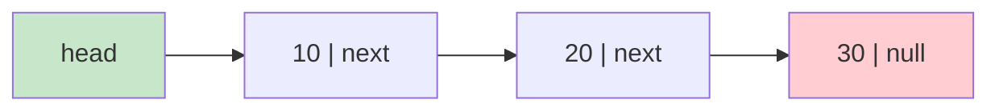
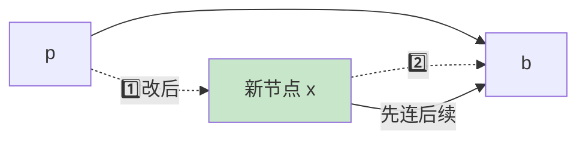
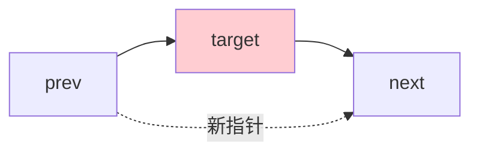
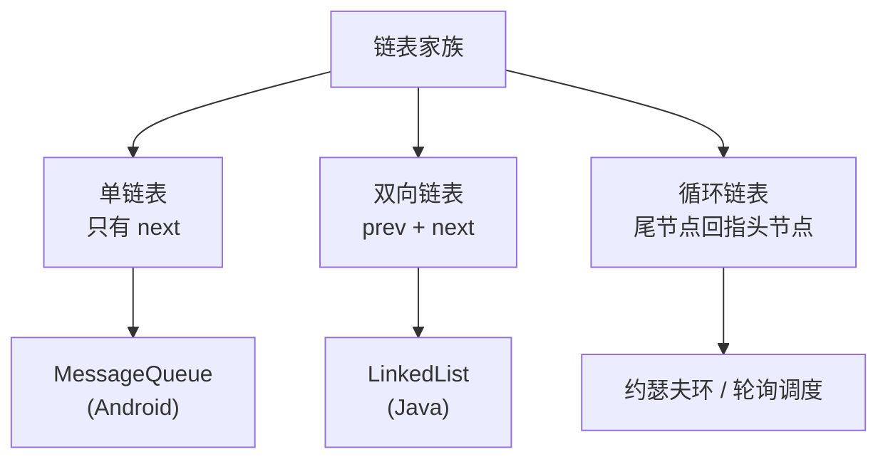

# 04.链表的设计和实践

## 目录指引与导读

> 阅读建议：链表题最大的坑是"指针操作出错"，建议先读 §5.1 的"先连后续"口诀，再带着这条口诀看后面所有代码。

- [01. 从工作案例说起](#01-从工作案例说起)
- [02. 链表本质与动机](#02-链表本质与动机)
  - [2.1 链表本质一句话](#21-链表本质一句话)
  - [2.2 为何发明链表](#22-为何发明链表)
  - [2.3 链表的优缺点](#23-链表的优缺点)
- [03. 指针与引用基础](#03-指针与引用基础)
- [04. 节点与内存布局](#04-节点与内存布局)
  - [4.1 单链表节点定义](#41-单链表节点定义)
  - [4.2 双向链表节点](#42-双向链表节点)
  - [4.3 节点内存开销分析](#43-节点内存开销分析)
- [05. 插入与删除操作](#05-插入与删除操作)
  - [5.1 插入操作两铁律](#51-插入操作两铁律)
  - [5.2 删除操作要点](#52-删除操作要点)
  - [5.3 常见指针丢失](#53-常见指针丢失)
- [06. 边界与哨兵节点](#06-边界与哨兵节点)
  - [6.1 边界检查黄金五问](#61-边界检查黄金五问)
  - [6.2 哨兵节点的妙用](#62-哨兵节点的妙用)
- [07. 链表的三种形态](#07-链表的三种形态)
  - [7.1 单链表实现示例](#71-单链表实现示例)
  - [7.2 双向链表精简版](#72-双向链表精简版)
  - [7.3 循环链表约瑟夫环](#73-循环链表约瑟夫环)
- [08. 链表性能分析](#08-链表性能分析)
  - [8.1 综合性能对比](#81-综合性能对比)
  - [8.2 链表无法二分查找](#82-链表无法二分查找)
  - [8.3 理论与现实的差距](#83-理论与现实的差距)
- [09. 链表的实际应用](#09-链表的实际应用)
  - [9.1 链表实现队列](#91-链表实现队列)
  - [9.2 LRU双链加哈希](#92-lru双链加哈希)
- [10. 案例回扣与收获](#10-案例回扣与收获)
- [11. 思考题深度练](#11-思考题深度练)
- [12. 课后作业实战](#12-课后作业实战)
- [13. 进阶专题与延伸](#13-进阶专题与延伸)

---

## 01. 从工作案例说起

> 真实踩坑：一次由"错用数据结构"引发的性能退化。

背景：一个"任务调度中心"服务，维护用户的待办任务队列，支持：

- 队首取任务执行（出队）
- 随机位置取消任务（按 taskId 删除）
- 队尾追加任务（入队）

最初选型直接用 `ArrayList<Task>`，上线三个月后某次大促，单用户队列长度冲到 10 万级，监控告警：**取消任务接口 P99 从 5ms 飙到 1.2s，线程池堆积**。

翻代码：

```java
// 旧实现——取消任务
public boolean cancel(long taskId) {
    for (int i = 0; i < tasks.size(); i++) {         // O(N) 查找
        if (tasks.get(i).getId() == taskId) {
            tasks.remove(i);                         // O(N) 搬移后续元素
            return true;
        }
    }
    return false;
}
```

两次 O(N) 叠加为 **O(N²) 批量取消**，10 万级队列直接崩。

**改造方向**：任务队列的核心特征是 —— **频繁的中间删除 + 双端插入，几乎不按下标随机访问**。这正是链表擅长的场景。

问题是：换成链表后，怎么做到"O(1) 删除"？直接遍历找节点还是 O(N)。答案是 **哈希表 + 双向链表**——哈希表按 taskId 定位到节点指针，双向链表 O(1) 摘除节点。

改造后：P99 回落到 3ms。这个"哈希 + 双链"结构，就是后面 LRU 缓存的同款套路。

> 本篇我们一起把链表从"指针是什么"讲到"为什么 LRU 要选双链"，学完你就能独立把开篇这套取消任务模块写对、写稳。

---

## 02. 链表的本质与设计动机

### 2.1 一句话本质

链表 = **一组"节点"通过指针串联的线性结构**，节点在内存中可以完全不连续。



### 2.2 为何发明链表

数组的三大痛点 → 正是链表的设计动机：

| 数组痛点 | 链表的解法 |
|---------|-----------|
| 插入 / 删除需搬移元素，O(N) | 只改指针，O(1) |
| 容量预估难、扩容要整体复制 | 按需分配，天然动态 |
| 要求大块连续内存 | 利用零散内存碎片 |

### 2.3 链表的优缺点

优点：

- 动态增长 / 缩减，无需预分配容量
- 已定位到节点时，插入 / 删除是 O(1)
- 内存利用灵活，能吃掉碎片

缺点：

- **无法随机访问**，按下标取是 O(N)
- 每节点多一个指针开销，空间不紧凑
- 节点散布内存 → CPU 缓存不友好
- 指针操作容易出 Bug（丢链、环、内存泄漏）

### 2.4 链表的六大变体

教科书常说"链表有单链、双链、循环链"三种，工业界实则远不止：

| 变体 | 关键特征 | 代表场景 |
|------|---------|---------|
| 单链表 | 只有 `next` | Android `MessageQueue`、Java 哈希桶短链 |
| 双向链表 | `prev + next` | Java `LinkedList`、LRU 缓存 |
| 循环链表 | 尾指头 | Linux 内核 `list_head`、约瑟夫环、轮询调度 |
| 带哨兵链表 | 头/尾虚节点 | 统一边界，几乎所有工程级链表 |
| **侵入式链表**（intrusive） | 链接字段嵌在业务结构体内 | Linux 内核、Boost.Intrusive、Nginx |
| **无锁链表** | CAS 更新 next | `ConcurrentLinkedQueue`、Michael-Scott 队列 |
| **跳表**（skip list） | 链表 + 多层索引 | Redis ZSet、LevelDB MemTable |
| **XOR 链表** | 用异或同时存前后地址 | 嵌入式省内存（已很少用） |
| **解链表**（unrolled） | 每节点存一小段数组 | Python Deque 的实现思路 |

最容易被忽视的是 **侵入式链表**：把 `next/prev` 两字段直接嵌进业务结构体，而不是包一层 Node——节省一次堆分配，缓存更友好。Linux 内核 40+ 年的所有链表都走这条路：

```c
// Linux 内核：侵入式链表的极致
struct task_struct {
    pid_t pid;
    struct list_head tasks;     // 链接字段内嵌
    // ... 业务字段 ...
};

struct list_head {
    struct list_head *next, *prev;
};

// 通过 container_of 宏从 list_head 反查到外层结构
#define container_of(ptr, type, member) \
    ((type *)((char *)(ptr) - offsetof(type, member)))
```

这也是为什么\"Java 写链表永远比 C 写链表慢一截\"——Java 没法让你把 next/prev 嵌到对象内部，每个节点都是独立对象，必然多一次指针解引用。

---

## 03. 指针与引用的基本理解

不同语言对"连接"的叫法：

| 语言 | 术语 | 能否为空 | 手动释放 |
|-----|------|---------|---------|
| C / C++ | 指针 | 可以 | 需要 |
| Java / Go / Python | 引用 | 可以（Java / Go） | GC 自动 |

对写链表来说，只需记一条：**"指针 / 引用存储的就是对象的内存地址"**。

常见两行链表代码的含义：

```text
p.next = q;              // p 的 next 字段改为"指向 q 的地址"
p.next = p.next.next;    // p 的 next 改为"指向 p 下下个节点"
```

> 写链表时思维方式：先脑补"改了哪几条箭头"，再落笔改代码。

---

## 04. 节点与内存布局

### 4.1 单链表节点定义

```java
class Node<T> {
    T data;
    Node<T> next;
    Node(T data) { this.data = data; }
}
```

### 4.2 双向链表节点

```java
class DNode<T> {
    T data;
    DNode<T> prev;
    DNode<T> next;
    DNode(T data) { this.data = data; }
}
```

### 4.3 节点内存开销分析

以 64 位 JVM、压缩指针、节点存一个 `Integer` 为例：

```text
Node 对象：对象头 12B + item 引用 4B + next 引用 4B + 对齐 → 24B
Integer 对象本身再多 16B
合计约 40B ——— 而数组存一个 int 只要 4B
```

空间膨胀约 10 倍，这就是"链表天生吃内存"的由来。

### 4.4 跨语言内存布局对比

| 语言 | 节点最小开销（存一个 int/指针） | 说明 |
|------|-----------|------|
| C/C++ `struct { int; Node*; }` | 16B | 无对象头，指针 8B，int 4B + 4B 对齐 |
| C++ `std::list<int>` 节点 | 24B | 双向 + 一个值，GCC libstdc++ 标准布局 |
| Rust `Box<Node>` | 16-24B | 无对象头，Option\<Box\<T\>\> 优化后 next 可能为 8B |
| Java `LinkedList.Node<Integer>` | 24B + Integer 16B ≈ **40B** | 对象头 12B + prev 4B + next 4B + item 4B + pad |
| Go `container/list.Element` | 40B | 5 个字段：prev/next/list/prev-mark/value |
| Python `list`（实际是动态数组） | —— | Python 没有通用链表，`deque` 用 block 链 |

**观察**：Java 节点内存膨胀最严重（40B 存 4B 的 int，10 倍），C 最紧凑。这也是 Netty 等高性能 Java 框架大量用对象池的原因——每次 new Node 都是 GC 压力。

### 4.5 为什么 Linux 内核选侵入式链表

```c
// 普通链表：next 存"业务数据的指针"
struct node { void* data; struct node* next; };

// Linux 侵入式链表：业务结构自己带 next
struct mystruct { int x; struct list_head link; };
```

对比：

| 维度 | 普通链表 | 侵入式链表 |
|------|---------|-----------|
| 堆分配次数 | 2 次（node + data） | 1 次 |
| 缓存友好 | 访问 data 要多跳一次指针 | data 和 link 在同一对象里 |
| 同一对象加入多个链表 | 不支持（要多个 node） | 天然支持（多个 list_head 字段） |
| 类型安全 | void* 要强转 | 靠 container_of 宏 |

内核的 task_struct 同时挂在 `tasks` 链表、`run_queue` 链表、`sibling` 链表等多个链表上，侵入式是**唯一零开销的做法**。

---

## 05. 链表的插入与删除

### 5.1 插入操作的两条铁律



口诀：**"先连后续，再接前驱"**。

```java
// 正确：在节点 p 之后插入 x
x.next = p.next;   // 第一步：x 先把后面连好
p.next = x;        // 第二步：p 再把前面接上

// 错误：反过来会直接把 b 及之后全部丢掉
p.next = x;
x.next = p.next;   // 此时 p.next 已经是 x，x.next = x 自环！
```

### 5.2 删除操作要点



```java
// 删除 target（已知 prev）
prev.next = target.next;
target.next = null;   // 可选：帮 GC / 防止误用
```

双向链表删除更优雅（已知节点即可 O(1)）：

```java
// 双链直接摘
node.prev.next = node.next;
node.next.prev = node.prev;
```

### 5.3 常见错误：指针丢失

```text
想在 a 和 b 之间插入 x：
错误写法：
    p.next = x;           // ❌ 此刻 b 就被"弄丢"了
    x.next = p.next;      // ❌ x.next = x，形成自环

正确写法：
    x.next = p.next;      // ✅ 先让 x 指 b
    p.next = x;           // ✅ 再让 p 指 x
```

---

## 06. 边界与哨兵节点

### 6.1 边界检查黄金五问

写完链表代码，必须逐条问自己：

1. 链表为空（`head == null`）会空指针吗？
2. 只有一个节点时，head / tail 是否正确维护？
3. 只有两个节点时，操作头和尾是否都正确？
4. 头节点被插入 / 删除后，head 指针更新了吗？
5. 尾节点被插入 / 删除后，tail.next 是 null 吗？

### 6.2 哨兵节点：消灭"头节点特殊"

不带哨兵——头部必须特判：

```java
if (head == null || position == 0) {
    newNode.next = head;
    head = newNode;
    return;
}
// 一般情况 ...
```

带哨兵——统一逻辑：

```java
// 初始化：sentinel.next = null，head = sentinel.next
Node cur = sentinel;                 // 所有操作都从哨兵开始
for (int i = 0; i < position; i++) cur = cur.next;
newNode.next = cur.next;
cur.next = newNode;
```

> 哨兵的本质是"**用空间换代码简洁**"，在归并排序、二分查找、链表题等场景都反复出现。

---

## 07. 链表的三种形态



### 7.1 单链表实现示例

```java
public class SinglyLinkedList<T> {
    private Node<T> head;
    private int size;

    public void addHead(T data) {
        Node<T> n = new Node<>(data);
        n.next = head;
        head = n;
        size++;
    }

    public boolean remove(T data) {
        Node<T> dummy = new Node<>(null);
        dummy.next = head;
        Node<T> cur = dummy;
        while (cur.next != null) {
            if (cur.next.data.equals(data)) {
                cur.next = cur.next.next;
                size--;
                head = dummy.next;
                return true;
            }
            cur = cur.next;
        }
        return false;
    }
}
```

### 7.2 双向链表（精简版）

```java
public class DoublyLinkedList<T> {
    private Node<T> head, tail;
    static class Node<T> { T data; Node<T> prev, next; Node(T d){data=d;} }

    public void addTail(T d) {
        Node<T> n = new Node<>(d);
        if (tail == null) head = tail = n;
        else { n.prev = tail; tail.next = n; tail = n; }
    }

    public void unlink(Node<T> n) {               // O(1) 摘除
        if (n.prev != null) n.prev.next = n.next; else head = n.next;
        if (n.next != null) n.next.prev = n.prev; else tail = n.prev;
        n.prev = n.next = null;
    }
}
```

> 为什么 Java `LinkedList` 选双向？因为它要同时实现 `List + Deque`，既要双端 O(1)，又要按索引从"近的一端"向里找，双向链表天然合适。

### 7.3 循环链表约瑟夫环

```java
// 约瑟夫环（Java 版，用 ArrayList 模拟循环表更易读）
class Josephus {
    static int solve(int n, int k) {
        List<Integer> people = new ArrayList<>();
        for (int i = 1; i <= n; i++) people.add(i);
        int idx = 0;
        while (people.size() > 1) {
            idx = (idx + k - 1) % people.size();
            people.remove(idx);
        }
        return people.get(0);
    }
}
```

> **数学优化版**：循环链表 / 列表模拟是 `O(n × k)`。其实约瑟夫环有递推公式 `J(n,k) = (J(n-1,k) + k) % n`，能 `O(n)` 求解，迭代版甚至 `O(1)` 空间。这是"用数学结构代替数据结构"的经典案例。

---

## 08. 链表的性能分析

### 8.1 综合对比

| 操作 | 数组 | 单链表 | 双链表 | 跳表 |
|-----|------|--------|--------|------|
| 随机访问 | **O(1)** | O(N) | O(N) | O(log N) |
| 头插 / 头删 | O(N) | **O(1)** | **O(1)** | O(log N) |
| 尾插 / 尾删 | O(1)* | O(N) / O(N) | **O(1)** | O(log N) |
| 已知节点删除 | O(N) | O(N) | **O(1)** | — |
| 按值查找 | O(N) | O(N) | O(N) | **O(log N)** |
| 空间开销 | 低 | 中 | 高 | 高 |

\*数组尾插不扩容为 O(1)，扩容瞬时 O(N)。

### 8.2 链表无法二分查找

二分要求 O(1) 拿到中点，链表从头走到中点就已经 O(N)，后面再二分也无意义。**跳表**正是通过"多层索引"在链表上模拟二分，把查找压到 O(log N)——Redis ZSet 正是这个思路。

### 8.3 理论 O(1) 为什么现实常输给 O(N)

- **内存分配开销**：每次 new 节点都要进堆，ArrayList 批量搬移是单条 `memcpy`；
- **CPU 缓存**：数组连续访问命中 L1，链表跳来跳去几乎每步 cache miss；
- **GC 负担**：大量小对象加重年轻代 GC。

所以"理论分析给方向，实测数据做决策"。

### 8.4 实测：LinkedList vs ArrayList

JDK 的官方文档里，`LinkedList` 的 Javadoc 直接写着一段几乎等同于\"别用我\"的警告：

> Note that this implementation is not synchronized... **all of the operations perform as could be expected for a doubly-linked list**. Operations that index into the list will traverse the list from the beginning or the end, whichever is closer to the specified index.

来一组 JMH 实测（100 万元素、M1/i7 量级）：

| 场景 | ArrayList | LinkedList | 差距 |
|------|-----------|------------|------|
| 顺序遍历（增强 for） | 2.5ms | 18ms | 7 倍 |
| `get(i)` 随机访问 1 万次 | 0.4ms | 4800ms（O(N)） | **12000 倍** |
| 头部插入 1 万次 | 9200ms | 0.3ms | — |
| 尾部插入 1 万次（无扩容） | 0.2ms | 0.3ms | 接近 |
| `remove(Object)` 按值删除 1 万次 | 3200ms | 3800ms | 接近（都是 O(N²)） |

**结论**：
- 只有**纯头部操作**这一个场景 LinkedList 明显胜出；
- 其他所有场景 ArrayList 都更快或持平；
- 这就是为什么阿里巴巴《Java 开发手册》直接规定\"ArrayList 优先\"。

真要\"头部 O(1) 插入\"的场景，用 `ArrayDeque` 比 LinkedList 还快 3-5 倍——因为它底层是环形数组。

### 8.5 无法二分、但可以"跳跃"

单纯的链表没有办法做二分，但如果允许在链表上"加索引"，就能把它升级为跳表：

```
level 3:  head ─────────────────────► 25 ──────────► null
level 2:  head ──────► 10 ─────────► 25 ──► 40 ───► null
level 1:  head ─► 5 ─► 10 ─► 20 ───► 25 ─► 40 ─► 55 null
level 0:  head ─► 5 ─► 10 ─► 20 ─► 22 ─► 25 ─► 40 ─► 55 (原始链表)
```

查找 22：
- level 3 看到 25 > 22，下降
- level 2 看到 10 ≤ 22，前进；看到 25 > 22，下降
- level 1 看到 20 ≤ 22，前进；看到 25 > 22，下降
- level 0 向后找到 22

**期望 O(log N)**，而实现只比普通链表多了一个\"每节点 flip 一次硬币决定层数\"的小技巧。Redis ZSet 为什么选跳表而不是红黑树？作者 antirez 在源码注释里写了三点：
1. 实现简单，400 行就搞定；
2. 范围查找（ZRANGEBYSCORE）天然高效；
3. 多层有序，方便按排名反查。

---

## 09. 链表的实际应用

### 9.1 链表实现队列

```java
public class LinkedQueue<T> {
    static class Node<T> { T data; Node<T> next; Node(T d){data=d;} }
    private Node<T> front, rear;

    public void enqueue(T d) {
        Node<T> n = new Node<>(d);
        if (rear == null) front = rear = n;
        else { rear.next = n; rear = n; }
    }

    public T dequeue() {
        if (front == null) throw new IllegalStateException("empty");
        T d = front.data;
        front = front.next;
        if (front == null) rear = null;
        return d;
    }
}
```

### 9.2 LRU 缓存：哈希表 + 双向链表

核心套路：**哈希表实现 O(1) 定位节点，双向链表实现 O(1) 摘除 + 头部插入**。

```java
public class LRUCache {
    static class Node { int key, val; Node prev, next; Node(int k,int v){key=k;val=v;} }
    private final int cap;
    private final Map<Integer, Node> map = new HashMap<>();
    private final Node head = new Node(0,0), tail = new Node(0,0);

    public LRUCache(int cap) {
        this.cap = cap;
        head.next = tail; tail.prev = head;
    }

    public int get(int k) {
        Node n = map.get(k);
        if (n == null) return -1;
        moveToHead(n);
        return n.val;
    }

    public void put(int k, int v) {
        Node n = map.get(k);
        if (n != null) { n.val = v; moveToHead(n); return; }
        if (map.size() == cap) {
            Node last = tail.prev;
            remove(last); map.remove(last.key);
        }
        Node nn = new Node(k, v);
        map.put(k, nn); addToHead(nn);
    }

    private void addToHead(Node n) {
        n.prev = head; n.next = head.next;
        head.next.prev = n; head.next = n;
    }
    private void remove(Node n) {
        n.prev.next = n.next; n.next.prev = n.prev;
    }
    private void moveToHead(Node n) { remove(n); addToHead(n); }
}
```

这套结构在下一篇「05.链表实现 LRU 原理」会再拆一遍内部细节。

---

## 10. 案例回扣与收获

回到开篇的"任务调度中心"案例：

- **问题根因**：我们用 `ArrayList` 承载"频繁中间删除"的场景，每次 `remove(i)` 都要搬移后续元素，叠加线性查找形成 O(N²)。
- **正确解法**：用 **`HashMap<Long, DNode> + 双向链表`**——
  - 入队：双链尾部 O(1) 插入，HashMap 记录节点引用
  - 出队：双链头部 O(1) 摘除
  - 取消：HashMap 定位节点 O(1)，双链摘除 O(1)，总 O(1)
- **落地效果**：P99 从 1.2s → 3ms，线程池再也没堆积。

通过本篇你应该拿到以下能力：

1. 能解释**链表 vs 数组**的取舍依据：随机访问 vs 中间增删；
2. 能正确写出**插入 / 删除**，不犯"先断再连"的指针丢失错误；
3. 能用**哨兵 + 黄金五问**稳住所有边界情况；
4. 理解 Java `LinkedList`、`LinkedHashMap`、Redis ZSet 选型背后的链表 / 跳表动机；
5. 能独立实现 **链表队列 + LRU** 两个最常见工业级结构。

---

## 11. 思考题

> 建议先独立思考，再查资料验证。

1. **成本取舍**：双向链表每个节点比单链表多 8 字节，什么场景下这 8 字节"值得"？什么场景下坚持用单链表？请结合缓存行、GC 压力两个角度说明。
2. **哨兵本质**：哨兵节点到底解决了什么？除了链表，归并排序、二分查找、KMP 里你还能找到哪些"哨兵"身影？
3. **判环算法**：请用 Floyd 快慢指针判断单链表是否有环并找到入口，并**严格证明**："慢指针走 a 步进入环，它们在距入口 b 步处相遇，从 head 和相遇点同时一步步走为什么会在入口汇合？"
4. **缓存视角**：为什么"同是 O(N)"的遍历，数组比链表快好几倍？请结合 CPU 缓存行与预取机制解释。并说明 Linux 内核为什么把 `list_head` 侵入式嵌入结构体内部。
5. **反直觉**：Java `LinkedList` 实现了 `List + Deque`，为什么主流代码规范（如 Alibaba 规约）几乎不推荐使用？在哪些"理论链表更优"的场景，`ArrayList` 实测反而更快？

---

## 12. 课后作业实战

### 作业一｜还原开篇事故并对比修复前后

1. 用 `ArrayList` 实现一份"任务队列"，支持 `enqueue / dequeue / cancelById`；
2. 构造 10 万条任务，按 taskId 随机取消 5 万次，记录总耗时；
3. 用 `HashMap + 双向链表` 重写同样接口，跑同样数据；
4. 对比两版耗时，撰写 200 字结论（结合本篇知识说明原因）。

### 作业二｜用哨兵节点改写链表

- 请实现两个版本的单链表 `insert / remove`：
  - 版本 A：不带哨兵，处处特判；
  - 版本 B：带哨兵节点，代码统一；
- 比较两版代码的 **行数、特判次数、出错概率**，得出自己的经验结论。

### 作业三｜手写 LRU 缓存

1. 按本篇 §9.2 的思路实现 `LRUCache`，要求 `get / put` 严格 O(1)；
2. 加一版 "带过期时间" 的变种（key 过期视为 miss，同时要从链表摘除）；
3. 跑一段随机读写测试脚本，统计命中率与耗时；
4. 思考：如果缓存 QPS 非常高，`HashMap + LinkedList` 的全局锁会是瓶颈，你会怎么改？（提示：分段锁、`ConcurrentHashMap` + `ConcurrentLinkedDeque`、或参考 Caffeine 的 W-TinyLFU）

---

## 13. 进阶专题与延伸

### 13.1 无锁链表：Michael-Scott 队列

`ConcurrentLinkedQueue` 的祖师爷。核心思想：**用 CAS 原子更新 tail 指针**，配合\"双重检查\"解决并发入队：

```java
// 入队简化版
boolean enqueue(T x) {
    Node<T> newNode = new Node<>(x);
    while (true) {
        Node<T> t = tail;
        Node<T> next = t.next;
        if (t == tail) {                     // 双重检查 tail 没被改
            if (next == null) {
                if (t.casNext(null, newNode)) {   // CAS 接到尾
                    casTail(t, newNode);          // 推进 tail（失败也没事）
                    return true;
                }
            } else {
                casTail(t, next);            // 帮别的线程推进
            }
        }
    }
}
```

三个精妙点：
1. **tail 可以暂时滞后**——CAS `tail.next` 成功即算入队成功，tail 推进失败会被下个入队者帮忙完成；
2. **任何线程都可能帮其他线程推进 tail**——lock-free 的典型特征（至少一个线程有进展）；
3. **ABA 问题**：tail 字段用 AtomicReference，但如果出现\"tail 被删了又加回同地址\"，会出错；JDK 用 AtomicReferenceArray 配合版本号或\"只加不删\"语义规避。

**性能**：单生产者吞吐 1000 万 ops/s 量级，比 `LinkedBlockingQueue` 快 2-3 倍。但多生产者下不如 Disruptor（环形数组）。

### 13.2 侵入式链表的 C 魔法

Linux 内核 `include/linux/list.h` 的 `list_for_each_entry` 宏：

```c
#define list_for_each_entry(pos, head, member)             \
    for (pos = list_entry((head)->next, typeof(*pos), member); \
         &pos->member != (head);                           \
         pos = list_entry(pos->member.next, typeof(*pos), member))

// 使用示例：遍历所有进程
struct task_struct *task;
list_for_each_entry(task, &init_task.tasks, tasks) {
    printk("%s\n", task->comm);
}
```

`list_entry` 就是 `container_of`——**已知成员地址，反推外层结构首地址**：

```c
// 假设结构体：struct mystruct { int x; struct list_head link; };
// offsetof(mystruct, link) = 4（x 占 4 字节）
// 已知 &mystruct.link 的地址 P，则 &mystruct = (mystruct*)((char*)P - 4)
```

这是 C 语言\"零成本抽象\"的典型——不需要模板、不需要虚函数，一个宏就实现了\"任意对象都能链\"的泛型能力。C++ Boost.Intrusive、Rust `intrusive-collections` 都是这个思路的现代翻版。

### 13.3 跳表（Skip List）的数学之美

跳表由 William Pugh 在 1990 年论文《Skip Lists: A Probabilistic Alternative to Balanced Trees》提出。每个节点以概率 p（通常 1/2 或 1/4）升一层，**期望层数 log_{1/p}(N)**，查询期望 O(log N)。

```python
# 节点升层的核心代码
def random_level():
    lvl = 1
    while random.random() < 0.5 and lvl < MAX_LEVEL:
        lvl += 1
    return lvl
```

- p=0.5 时平均每节点 2 个指针，Redis 选 p=0.25 以节省内存（平均 1.33 指针）；
- 最大层数 MAX_LEVEL 通常设为 32（支持 N≈2^32 ≈ 40 亿元素）；
- **无需旋转、无需重平衡**——这是跳表相对红黑树最大的工程优势。

Redis 的跳表还做了两个增强：
1. **后退指针**（backward）支持反向 range scan；
2. **每层记录 span**（跨度）支持 O(log N) 按排名查询（ZRANK）。

### 13.4 链表在现代系统中的五个关键应用

1. **JVM 的 G1/ZGC**：Remembered Set 用链表收集跨区引用；
2. **Linux 内核的 RCU**：Read-Copy-Update 基于链表节点"旧版本保留到 grace period 后再释放"；
3. **日志系统 LSM Tree**：SSTable 文件之间用链表组织层级，LevelDB/RocksDB 均如此；
4. **JS V8 引擎**：Hidden Class 用链表管理 transition；
5. **现代 GC**：Mark-Compact 阶段的 forwarding pointer 用侵入式链表链接存活对象。

**观察**：几乎所有\"对象存活期复杂、需要高效 O(1) 摘除\"的场景都用链表——因为这是链表唯一的绝对优势。

### 13.5 经典书与论文

- Michael & Scott. 1996. *Simple, Fast, and Practical Non-Blocking and Blocking Concurrent Queue Algorithms*——无锁队列的开山之作
- William Pugh. 1990. *Skip Lists: A Probabilistic Alternative to Balanced Trees*——跳表论文
- Cormen et al. 《算法导论》第 10 章基础链表、第 11 章哈希表、第 21 章并查集
- 《Linux 内核设计与实现》（Robert Love）第 6 章数据结构：侵入式链表、红黑树在内核的用法
- Doug Lea. *Concurrent Programming in Java*——JUC 中 `ConcurrentLinkedQueue` 等链表结构的设计思想源头
- Redis 源码 `src/t_zset.c`、`src/server.h` 里的 zskiplist——400 行跳表实现，读完基本能自己写一个

---

> 这一篇把链表从"基础指针操作"讲到"无锁/侵入式/跳表"三条进阶路线。下一篇《05.链表实现 LRU 原理》会专门把\"哈希 + 双链\"这个最常用模式拆到极致，并延伸到 LFU、W-TinyLFU（Caffeine）等现代缓存算法——**LRU 不是终点，而是缓存算法宇宙的入口**。

