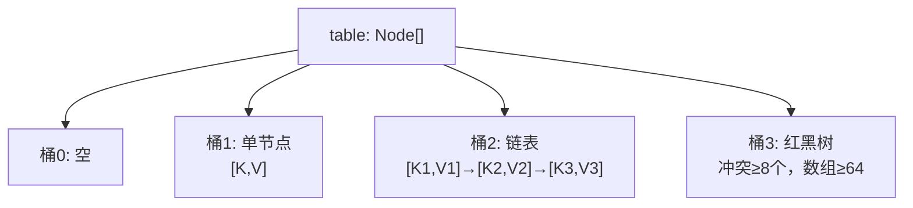
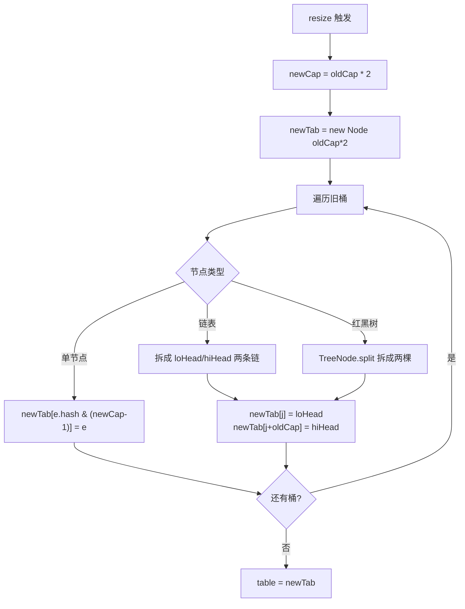

# 14.工业级Map的设计

## 目录指引与导读

> 阅读建议：从"20 万规则用 List 查找把 QPS 打到 40"的案例切入，逐层拆 HashMap 的存储结构、扰动、put/get/remove、红黑树退化、ConcurrentHashMap 演进、容量规划。源码片段 + 为什么一体化讲解。

- [01. 从工作案例说起](#01-从一个工作案例说起)
- [02. Map设计核心挑战](#02-map设计的核心挑战)
- [03. HashMap三层结构](#03-hashmap三层存储结构)
- [04. 哈希函数扰动设计](#04-哈希函数与扰动设计)
- [05. put与扩容机制](#05-put与扩容机制)
- [06. get三层过滤查找](#06-get与三层过滤查找)
- [07. remove与树退化](#07-remove与树退化)
- [08. 线程安全CHM演进](#08-线程安全与concurrenthashmap演进)
- [09. 容量规划工程陷阱](#09-容量规划与工程陷阱)
- [10. 本篇收获与回扣](#10-本篇收获与案例回扣)
- [11. 思考题深度练](#11-思考题深度练)
- [12. 课后作业实战](#12-课后作业实战)
- [13. 进阶专题与延伸](#13-进阶专题与延伸)


## 01. 从一个工作案例说起

某风控规则引擎，每次调用需要从 20 万条规则里按 `ruleId` 查找命中项。新人写了这段代码：

```java
// 错误写法：用 List 存 + 遍历查找
private final List<Rule> rules = loadRules();   // 20 万条

public Rule findById(String id) {
    for (Rule r : rules) {
        if (r.getId().equals(id)) return r;     // O(N) 查找
    }
    return null;
}
```

**后果**：单次查找 ≈ 20 万次 `equals`，QPS 从 5000 掉到 40。线上堆积告警。

改成一行：

```java
private final Map<String, Rule> rules = loadRules().stream()
        .collect(Collectors.toMap(Rule::getId, r -> r));

public Rule findById(String id) {
    return rules.get(id);        // O(1) 查找
}
```

QPS 瞬间回到 6000+。但新问题来了——另一个同事发现：**以自己写的 `MutableKey` 当 key，put 后再 get 居然返回 null**；还有同事在 `HashMap` 上并发 put 导致 CPU 100% 死循环。

**本篇要回答的问题**：

- HashMap 凭什么 O(1)？最坏情况是多少？
- 为什么容量必须是 2 的幂？为什么默认 16？
- 扰动函数 `(h = hashCode()) ^ (h >>> 16)` 在做什么？
- JDK 8 为什么引入红黑树？阈值 8 怎么来的？
- 多线程用 HashMap 会死循环吗？JDK 8 修了哪里？
- 可变对象当 key 为什么是内存泄漏？

## 02. Map设计的核心挑战

Map 的本质：**从 key 到 value 的快速查找**。实现方式决定性能：

| 实现 | 查找 | 插入 | 有序 | 代表 |
|------|------|------|------|------|
| 无序数组 | O(N) | O(1) | 否 | List 遍历 |
| 有序数组 | O(log N) 二分 | O(N) | 是 | `Arrays.binarySearch` |
| 平衡树 | O(log N) | O(log N) | 是 | `TreeMap` |
| 哈希表 | **平均 O(1)** | 均摊 O(1) | 否 | `HashMap` |
| 跳表 | O(log N) | O(log N) | 是 | `ConcurrentSkipListMap` |

HashMap 胜在常数时间查找，但要付出代价：
- 空间浪费（负载因子 0.75 → 至少 25% 空位）
- 哈希冲突处理
- 扩容时机与成本
- 线程安全保障

## 03. HashMap三层存储结构

### 3.1 三层混合



- **第一层（数组）**：哈希定位桶，O(1)
- **第二层（链表）**：少量冲突，O(k)
- **第三层（红黑树）**：极端冲突兜底，O(log k)

### 3.2 核心字段

```java
transient Node<K,V>[] table;   // 桶数组，长度必须是 2 的幂
transient int size;            // 实际键值对数
int threshold;                 // 扩容阈值 = capacity × loadFactor
final float loadFactor;        // 负载因子，默认 0.75
transient int modCount;        // 结构修改次数，用于 fail-fast
```

### 3.3 关键常量

```java
static final int DEFAULT_INITIAL_CAPACITY = 1 << 4;   // 16
static final int MAXIMUM_CAPACITY         = 1 << 30;  // 约 10 亿
static final float DEFAULT_LOAD_FACTOR    = 0.75f;
static final int TREEIFY_THRESHOLD        = 8;        // 链表 → 红黑树
static final int UNTREEIFY_THRESHOLD      = 6;        // 红黑树 → 链表
static final int MIN_TREEIFY_CAPACITY     = 64;       // 数组 <64 时优先扩容
```

**为什么是 8 和 6（不是 8 和 8）？**

理想哈希下链表长度服从泊松分布，长度达 8 的概率 ≈ 6×10⁻⁸，树化触发极少。留 6~8 的缓冲区避免在临界点反复"树化↔退化"抖动。

## 04. 哈希函数与扰动设计

### 4.1 扰动函数

```java
static final int hash(Object key) {
    int h;
    return (key == null) ? 0 : (h = key.hashCode()) ^ (h >>> 16);
}
```

把高 16 位异或到低 16 位。**为什么？**

```
假设 capacity = 16，则 index = hash & 15 = hash 的低 4 位
若两个 key 的 hashCode 只是高位不同，低位相同 → 必撞桶！

扰动后：高位信息被混入低位，即使 capacity 很小也能利用高位差异
```

### 4.2 容量必须是 2 的幂

```java
// 取模（慢）
index = hash % capacity;
// 位运算（快，仅当 capacity 是 2 的幂时等价）
index = hash & (capacity - 1);
```

位运算比除法快 10-30 倍。为了用上它，HashMap 强制容量是 2 的幂。

`tableSizeFor` 把任意 n 向上取到最近的 2 的幂：

```java
static final int tableSizeFor(int cap) {
    int n = cap - 1;
    n |= n >>> 1;
    n |= n >>> 2;
    n |= n >>> 4;
    n |= n >>> 8;
    n |= n >>> 16;
    return (n < 0) ? 1 : (n >= MAXIMUM_CAPACITY) ? MAXIMUM_CAPACITY : n + 1;
}
// tableSizeFor(10) = 16
// tableSizeFor(17) = 32
```

原理：用 5 次右移+或把最高位 1 后面所有位填充为 1，+1 得到 2 的幂。

## 05. put与扩容机制

### 5.1 putVal 主流程

```java
final V putVal(int hash, K key, V value, boolean onlyIfAbsent, boolean evict) {
    Node<K,V>[] tab; Node<K,V> p; int n, i;
    // 1. 延迟初始化
    if ((tab = table) == null || (n = tab.length) == 0)
        n = (tab = resize()).length;
    // 2. 桶为空，直接放
    if ((p = tab[i = (n - 1) & hash]) == null)
        tab[i] = newNode(hash, key, value, null);
    else {
        Node<K,V> e; K k;
        // 3. 首节点命中
        if (p.hash == hash && ((k = p.key) == key || (key != null && key.equals(k))))
            e = p;
        // 4. 红黑树
        else if (p instanceof TreeNode)
            e = ((TreeNode<K,V>)p).putTreeVal(this, tab, hash, key, value);
        // 5. 链表
        else {
            for (int binCount = 0; ; ++binCount) {
                if ((e = p.next) == null) {
                    p.next = newNode(hash, key, value, null);
                    if (binCount >= TREEIFY_THRESHOLD - 1)  // 长度到 8
                        treeifyBin(tab, hash);               // 树化（内部会判断数组≥64）
                    break;
                }
                if (e.hash == hash && ((k = e.key) == key || (key != null && key.equals(k))))
                    break;
                p = e;
            }
        }
        // 6. 已有 key，更新 value
        if (e != null) {
            V oldValue = e.value;
            if (!onlyIfAbsent || oldValue == null) e.value = value;
            return oldValue;
        }
    }
    ++modCount;
    if (++size > threshold) resize();   // 7. 触发扩容
    return null;
}
```

### 5.2 扩容：2 倍 + 位运算重定位

```
旧容量 16 = 10000
新容量 32 = 100000

某个 key 的 hash = ...?????
  旧索引 = hash & 01111 = 低 4 位
  新索引 = hash & 11111 = 低 5 位

两者只差第 5 位：
  第 5 位 = 0 → 新索引 = 旧索引（位置不变）
  第 5 位 = 1 → 新索引 = 旧索引 + 16
```

JDK 8 据此把一个桶的链表拆成"低位链"和"高位链"两条，分别放到 `newTab[j]` 和 `newTab[j+oldCap]`。**无需重算 hash**。



### 5.3 各语言扩容策略对比

| 实现 | 扩容倍数 | 负载因子 | 特殊设计 |
|------|---------|---------|---------|
| Java HashMap | 2× | 0.75 | 链表→红黑树 |
| Go map | 2× | 6.5（bucket 平均） | 渐进式搬迁（每次操作搬一点） |
| Python dict | 2× 或 4× | 2/3 | 开放寻址 |
| Rust HashMap | 2× | 7/8 | Robin Hood |

Go 的"渐进式搬迁"值得一提：扩容不一次性完成，每次 put/get 顺手搬一个桶，**避免单次 O(N) 抖动**，适合低延迟场景。

## 06. get与三层过滤查找

### 6.1 getNode 源码

```java
final Node<K,V> getNode(int hash, Object key) {
    Node<K,V>[] tab; Node<K,V> first, e; int n; K k;
    if ((tab = table) != null && (n = tab.length) > 0 &&
        (first = tab[(n - 1) & hash]) != null) {
        // 优化：优先比首节点（命中率 35%+）
        if (first.hash == hash &&
            ((k = first.key) == key || (key != null && key.equals(k))))
            return first;
        if ((e = first.next) != null) {
            if (first instanceof TreeNode)
                return ((TreeNode<K,V>)first).getTreeNode(hash, key);
            do {
                if (e.hash == hash &&
                    ((k = e.key) == key || (key != null && key.equals(k))))
                    return e;
            } while ((e = e.next) != null);
        }
    }
    return null;
}
```

### 6.2 三层过滤（从便宜到昂贵）

```
第 1 层：hash 比较    → int 比较，CPU 一条指令（绝大多数不匹配在此排除）
第 2 层：引用 ==      → 指针比较，一条指令
第 3 层：equals       → 字符串逐字符、对象递归比较（最贵）
```

### 6.3 为什么说"平均 O(1)"

负载因子 0.75 下桶内元素数量的泊松分布：

| 桶内元素数 | 概率 |
|----------|------|
| 0 | 47.3% |
| 1 | 35.5% |
| 2 | 13.3% |
| 3 | 3.3% |
| ≥8 | 6×10⁻⁸ |

→ **97% 查找在 1-2 次比较内完成**。

### 6.4 containsValue 是 O(N)

```java
public boolean containsValue(Object value) {
    // 必须遍历所有桶的所有节点
    for (Node<K,V> e : table)
        for (; e != null; e = e.next)
            if (value.equals(e.value)) return true;
    return false;
}
```

需要按 value 反查？自己维护一对多的反向 Map，或用 Guava `BiMap`。

## 07. remove与树退化

```java
final Node<K,V> removeNode(int hash, Object key, ...) {
    // 1. 定位桶，查找节点（链表/红黑树）
    // 2. 找到后
    if (node instanceof TreeNode)
        ((TreeNode<K,V>)node).removeTreeNode(this, tab, movable);
        // ↑ 内部检查：如果树太小（根/左/右/左左为空），退化回链表
    else if (node == p)
        tab[index] = node.next;
    else
        p.next = node.next;
    ++modCount;
    --size;
    return node;
}
```

**退化条件**：红黑树删除时，若满足 `root == null || root.right == null || root.left == null || root.left.left == null`（树极度不平衡或很小），退化为链表。**不是按 UNTREEIFY_THRESHOLD=6 严格计数的**——这是常见误解。

## 08. 线程安全与ConcurrentHashMap演进

### 8.1 HashMap 的并发问题

```java
// put 不是原子的，至少 6 步：
// 1. 计算 hash    2. 定位桶   3. 读桶首节点
// 4. 比较 key     5. 写入      6. ++size
```

**JDK 7 的死循环**：并发扩容时链表会成环，下次 get 进入死循环 → CPU 100%。

**JDK 8 的修复**：扩容改用"低位链+高位链"拆分，保持原有相对顺序，不再成环。但 **并发 put 仍会丢数据**。

### 8.2 ConcurrentHashMap 的演进

```
JDK 7：分段锁（Segment）
┌────────────────────────────┐
│ Segment[0..15]             │
│  ├─ lock                   │
│  └─ HashEntry[]            │
└────────────────────────────┘
并发度 = 16（固定）
问题：锁粒度太粗

JDK 8+：CAS + synchronized（桶级别）
┌─────┬─────┬─────┬─────┐
│ 桶0 │ 桶1 │ 桶2 │ ... │
└─────┴─────┴─────┴─────┘
空桶 → CAS 直接写入，无锁
非空桶 → synchronized 锁单个桶首节点
并发度 = 桶数量（可达数万）
```

**性能实测**（16 线程，100 万次 put）：

| 实现 | 耗时 |
|------|------|
| `Collections.synchronizedMap(HashMap)` | ~2500ms |
| `ConcurrentHashMap` JDK 7 | ~800ms |
| `ConcurrentHashMap` JDK 8+ | ~350ms |

### 8.3 正确用法

```java
// 错误：check-then-act 竞态
if (!map.containsKey(k)) map.put(k, compute());

// 正确：原子操作
map.computeIfAbsent(k, this::compute);
map.putIfAbsent(k, v);
map.merge(k, 1L, Long::sum);
```

## 09. 容量规划与工程陷阱

### 9.1 初始容量计算

```java
// 预期 1000 个元素，避免扩容
int expected = 1000;
int cap = (int)(expected / 0.75f) + 1;      // = 1334
Map<String, User> map = new HashMap<>(cap); // 构造时 tableSizeFor 取 2048
```

Guava 直接提供工具：

```java
Maps.newHashMapWithExpectedSize(1000);  // 内部自动算好容量
```

### 9.2 可变 Key 陷阱

```java
class Point {
    int x, y;
    public int hashCode() { return x * 31 + y; }
    public boolean equals(Object o) { /* x y 相等 */ }
}

Point p = new Point(1, 2);
map.put(p, "A");
p.x = 5;                    // hashCode 变了！
map.get(p);                 // null —— 用新 hashCode 定位到新桶，原位置还在旧桶
map.remove(p);              // 也 remove 不掉！
// → entry 永远躺在旧桶中，无法访问也无法 GC → 内存泄漏
```

**规则**：key 必须是**不可变对象**或参与 hashCode 的字段不可变。`String`、`Integer`、`Long` 是最安全的。

### 9.3 WeakHashMap 与缓存

```java
// 全局缓存只进不出 → 内存持续增长
static final Map<String, Heavy> cache = new HashMap<>();

// 解法 1：Key 无强引用时自动回收
Map<Key, V> weak = new WeakHashMap<>();

// 解法 2：带过期/大小上限（生产首选）
Cache<K, V> cache = Caffeine.newBuilder()
    .maximumSize(10_000)
    .expireAfterWrite(Duration.ofMinutes(10))
    .build();
```

## 10. 本篇收获与案例回扣

回到开篇 20 万规则的查找案例：

| 现象 | 根因 |
|------|------|
| List 遍历 QPS 40 | O(N) × 20 万 = 单次 200μs，40 QPS 打满一个核 |
| HashMap 后 QPS 6000+ | 平均 O(1)，单次 ~100ns，CPU 几乎空闲 |
| MutableKey put 后 get 返回 null | 修改了字段，hashCode 改变，桶定位错 |
| 并发 put 死循环/数据丢失 | 单机 HashMap 非线程安全；应使用 ConcurrentHashMap |

**学完你能做的事**：

1. **选对 Map**：单线程 `HashMap`，并发 `ConcurrentHashMap`，有序 `TreeMap`，按插入序 `LinkedHashMap`
2. **容量预估**：`new HashMap<>((int)(size/0.75)+1)` 或 `Maps.newHashMapWithExpectedSize`
3. **Key 设计**：永远用不可变对象，重写 `hashCode` 要分布均匀
4. **原子操作**：`putIfAbsent` / `computeIfAbsent` / `merge` 替代 check-then-act
5. **缓存选型**：长期缓存一律用 Caffeine/Guava，避免 HashMap 裸跑
6. **源码面试**：1.5→2 倍扩容、树化阈值 8、扰动函数、CAS+synchronized，都能讲清为什么

## 11. 思考题深度练

1. **容量计算**：`new HashMap<>(10)` 实际容量是多少？`tableSizeFor(10)` 如何一步步计算出这个值？
2. **扰动函数**：如果去掉 `(h = hashCode()) ^ (h >>> 16)`，只用 `hashCode() & (n-1)`，构造一个使大量 key 撞到同一个桶的例子。
3. **树化阈值**：链表长度到 8 时 `treeifyBin` 会直接树化吗？什么情况下会改为扩容而不是树化？
4. **并发演进**：JDK 7 ConcurrentHashMap 分段锁的最大并发度是多少？JDK 8 改成 CAS+synchronized 后并发度上限变成什么？
5. **Key 陷阱**：写一段代码，让 `map.containsKey(k)` 返回 false 但 `map.entrySet()` 中确实有这个 key。

## 12. 课后作业实战

### 作业 1：基础 —— 手写 MyHashMap

```
要求：
  固定 16 桶，负载因子 0.75，2 倍扩容
  实现 put/get/remove/size 四个方法
  链表结构即可，不要求红黑树
  构造测试：put 一万个随机 Integer，对比 JDK HashMap 正确性
```

### 作业 2：进阶 —— 扰动效果量化

```
要求：
  生成 10 万个 hashCode 只在高 16 位不同、低 16 位相同的 key
  分别用"有扰动"和"无扰动"哈希到 16 个桶
  统计两种方式下桶的最大长度、标准差
  画柱状图观察扰动的收益
```

### 作业 3：实战 —— 并发场景选型

```
场景：计数器 Map，记录每个 userId 的访问次数，100 线程并发 ++
要求：
  实现 A：synchronized(HashMap) + map.put(k, map.get(k)+1)
  实现 B：ConcurrentHashMap + computeIfAbsent + AtomicLong
  实现 C：ConcurrentHashMap + merge(k, 1L, Long::sum)
  JMH 对比三者吞吐量，解释差异
```

### LeetCode 刷题清单

| 题号 | 题名 | 考点 |
|------|------|------|
| 1 | 两数之和 | HashMap 最经典 |
| 49 | 字母异位词分组 | Map<排序后字符串, List> |
| 146 | LRU Cache | LinkedHashMap / 手写 HashMap + 双链表 |
| 242 | 有效的字母异位词 | 计数 Map |
| 560 | 和为 K 的子数组 | 前缀和 + HashMap |
| 295 | 数据流的中位数 | 双堆（对照 TreeMap 思路） |

---

## 13. 进阶专题与延伸

### 13.1 ConcurrentHashMap 的三代演进

**JDK 1.5**（Segment 分段锁）：
```
整个 map 切成 16 个 Segment，每个 Segment 独立加锁
读少量冲突，写只锁 1/16 的数据
```
问题：段数固定（默认 16），高并发下仍成为瓶颈。

**JDK 1.8**（桶级同步 + CAS + 红黑树）：
```java
final V putVal(K key, V value, boolean onlyIfAbsent) {
    // ...
    for (Node<K,V>[] tab = table;;) {
        if ((f = tabAt(tab, i = (n - 1) & hash)) == null) {
            if (casTabAt(tab, i, null, new Node<>(hash, key, value, null)))  // CAS 插入空桶
                break;
        } else {
            synchronized (f) {                                             // 锁首节点
                // 链表 / 红黑树操作
            }
        }
    }
}
```
**三大改进**：
- 锁粒度从"段"缩小到"桶"——锁数量从 16 到 N；
- 读完全无锁（table/Node 字段用 `volatile`）；
- 并发扩容——多线程协作迁移桶。

**JDK 21** 的 Virtual Thread 适配：进一步减少 pinning，让 VT 内部的 ConcurrentHashMap 操作不会把 carrier thread 挂住。

### 13.2 LongAdder：高并发计数器的教科书

传统 `AtomicLong.incrementAndGet()` 在 32 线程争用下 CAS 失败率高，吞吐下降严重。JUC 的 `LongAdder` 用"**分散热点**"思路：

```
单变量 base
多 cell[] 数组（每 cell 独立 volatile long）
  ↓
更新时：
  1. 先尝试 CAS base
  2. 失败则根据 thread hash 选一个 cell 去 CAS
  3. 再失败就扩容 cells 或更换 cell

取值时：base + sum(cells)
```

**效果**：100 线程累加 10 亿次，LongAdder 比 AtomicLong 快 5-10 倍。代价是 `sum()` 不精确（期间有并发写入）——但对统计类场景完全够用。

Doug Lea 2011 年引入这个数据结构后，JUC 全面迁移：`ConcurrentHashMap.size()`、`Stream.count()`、JDK 内部的性能计数器都用 LongAdder。

### 13.3 ConcurrentHashMap 的原子操作方法

除了 get/put，JDK 8+ 引入了一组**原子组合操作**——这才是 ConcurrentHashMap 的正确用法：

```java
// 错误：非原子！
if (!map.containsKey(k)) map.put(k, v);
int old = map.get(k); map.put(k, old + 1);

// 正确：原子
map.putIfAbsent(k, v);                          // 不存在才放
map.computeIfAbsent(k, key -> loadHeavy(key));  // 不存在时 lazy 加载
map.compute(k, (key, old) -> old == null ? 1 : old + 1);  // 原子更新
map.merge(k, 1L, Long::sum);                    // 原子合并
```

**`computeIfAbsent` 的两大坑**：
- **不能递归调用同 map**——JDK 8 会死锁（JDK 9+ 变成 ClassCastException）；
- **lambda 执行期间持有桶锁**——重计算会拖慢并发，应尽量只做 `new Object()`。

### 13.4 缓存穿透：`Map.computeIfAbsent` + 空值标记

"查数据库，若有则放进缓存"的典型模式：

```java
// ❌ 被查询不存在的 key 打爆 DB
private final Map<Long, User> cache = new ConcurrentHashMap<>();
public User find(long id) {
    User u = cache.get(id);
    if (u == null) {
        u = db.query(id);                      // 1 亿次不存在的 id → 1 亿次 DB
        if (u != null) cache.put(id, u);
    }
    return u;
}

// ✓ 用特殊标记避免穿透
private static final User TOMBSTONE = new User();
public User find(long id) {
    User u = cache.computeIfAbsent(id, k -> {
        User found = db.query(k);
        return found != null ? found : TOMBSTONE;
    });
    return u == TOMBSTONE ? null : u;
}
```

Guava `Cache` / Caffeine 的 `refreshAfterWrite` 做得更精致——还能避免 thundering herd（多线程同时重建缓存）。

### 13.5 TreeMap 的红黑树并发化困境

为什么 JDK 没有 `ConcurrentTreeMap`？

1. **旋转影响范围大**：单次插入最多 2 次旋转，但影响 3 个节点的 parent/left/right；
2. **锁粒度难定**：锁节点 = 不够（旋转跨节点），锁整棵树 = 并发度为 1；
3. **MVCC 代价高**：每次修改都要复制受影响路径上的所有节点（O(log N) 额外空间）。

JDK 的并发有序 Map 是 `ConcurrentSkipListMap`（跳表）：
- 每节点独立 CAS 链入/链出——粒度最细；
- 期望 O(log N)，最坏 O(N)；
- 支持 `NavigableMap` 全部接口（`firstKey`、`ceilingKey`、`subMap` 等）。

**选型**：
- 低并发有序 Map → `TreeMap`（加外部锁）；
- 高并发有序 Map → `ConcurrentSkipListMap`；
- 不需要有序 → `ConcurrentHashMap`（最快）。

### 13.6 EnumMap 与 IdentityHashMap：特化优化

JDK 里两个容易被忽视的特化 Map：

**EnumMap**：key 是枚举时用它比 HashMap 快 3-5 倍：
```java
EnumMap<DayOfWeek, List<Task>> scheduled = new EnumMap<>(DayOfWeek.class);
```
底层：`Object[] values`，用枚举 `ordinal()` 当下标——零 hash 计算、零冲突、O(1) 最坏。

**IdentityHashMap**：比较 key 用 `==` 而非 `equals`：
```java
IdentityHashMap<Object, Meta> registry = new IdentityHashMap<>();
```
适用场景：对象引用跟踪（如 JVM 调试工具）、序列化时的循环引用检测。

### 13.7 Fastutil / Eclipse Collections：高性能 Map 库

JDK 的 `HashMap<Integer, Integer>` 对每个 key/value 都装箱——内存膨胀 5 倍，CPU 慢 3 倍。

**Fastutil**（<https://fastutil.di.unimi.it/>）提供原始类型特化：
```java
Int2IntOpenHashMap counter = new Int2IntOpenHashMap();
counter.addTo(userId, 1);    // 零装箱，O(1)
```

**Eclipse Collections**（前 GS Collections）提供完整的原始类型集合族：
```java
IntIntHashMap m = IntIntHashMap.newWithKeysValues(1, 10, 2, 20);
```

**性能**：内存 1/5，吞吐 3-5 倍。Hadoop、Spark、Flink 等大数据框架内部大量使用。

### 13.8 Caffeine：JVM 上最强缓存

Guava Cache 的继任者。作者 Ben Manes 是 Google 前工程师：

**核心算法**：W-TinyLFU（Window + TinyLFU），见第 05 篇的延伸讨论。

**API 亮点**：
```java
LoadingCache<String, User> cache = Caffeine.newBuilder()
    .maximumSize(10_000)
    .expireAfterWrite(Duration.ofMinutes(5))
    .refreshAfterWrite(Duration.ofMinutes(1))       // 过期前主动刷新
    .recordStats()                                  // 命中率统计
    .build(key -> userService.load(key));
User u = cache.get("alice");
```

**性能**：
- 命中率比 Guava 高 5-10 个百分点（W-TinyLFU 优势）；
- 并发吞吐 4-8 倍于 Guava（分段锁 + lock-free queue）；
- Spring Boot 2.x 默认把 `cache-type=caffeine` 作为首选。

### 13.9 经典书与论文

- Doug Lea. *A Java Fork/Join Framework*
- Herlihy & Shavit 《The Art of Multiprocessor Programming》
- Maged M. Michael. 2002. *High Performance Dynamic Lock-Free Hash Tables*
- Click, C. 2007. *A Lock-Free Hash Table*——Cliff Click NonBlocking HashMap 论文
- Pugh, W. 1990. *Skip Lists: A Probabilistic Alternative to Balanced Trees*
- Einziger, G. et al. 2017. *TinyLFU*
- Goetz et al. 《Java Concurrency in Practice》第 5 章：并发容器

**工业代码**：
- JDK `java.util.HashMap`、`ConcurrentHashMap`、`TreeMap`、`LinkedHashMap`
- Caffeine（`com.github.ben-manes.caffeine`）
- Fastutil（`it.unimi.dsi.fastutil`）
- Eclipse Collections
- Google Guava `Cache`、`ImmutableMap`
- NonBlockingHashMap（`org.jctools.maps`，Cliff Click 原始实现）

---

> Map 篇收尾。下一篇《15.工业级 Set 设计思想》会把"去重"这个看似简单的需求拆开来看——**它其实是 Map 的投影**：key 保留、value 用占位哨兵填充。这种"概念的派生"是理解集合框架最根本的思维方式。