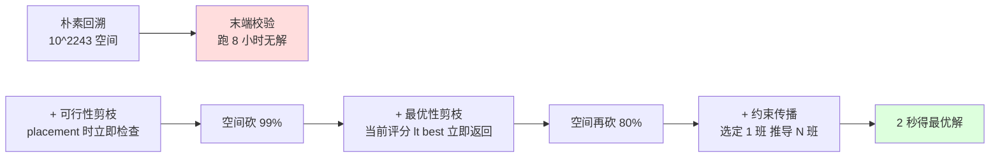
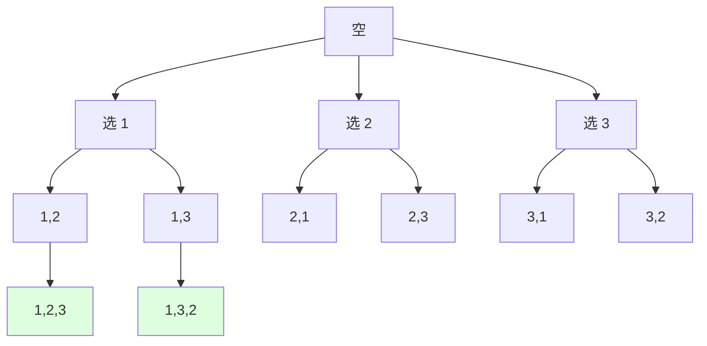
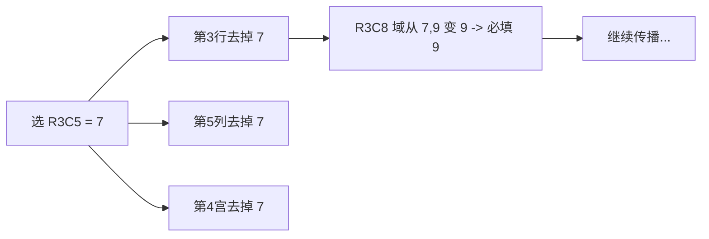

# 22.回溯剪枝的艺术

## 目录指引与导读

> 阅读建议：本篇覆盖"回溯本质 → 状态空间树 → 三大剪枝 → 五大经典 → 工业级搜索（SAT/CSP/DLX） → 与 DFS/DP 的边界"，从"考勤排班 8 小时跑不完 → 加约束传播降到 2 秒"的真实事故出发，把回溯从"暴搜的雅称"提升为"工业级搜索引擎"。**学完这篇，你能写出比朴素 DFS 快 1000 倍的搜索代码**。

- [01. 从工作案例说起](#01-从工作案例说起)
- [02. 回溯本质与起源](#02-回溯本质与起源)
  - [2.1 一句话定义回溯](#21-一句话定义回溯)
  - [2.2 状态空间树](#22-状态空间树)
  - [2.3 与 DFS 的区别](#23-与-dfs-的区别)
- [03. 回溯三段式骨架](#03-回溯三段式骨架)
  - [3.1 选择 Choose](#31-选择-choose)
  - [3.2 探索 Explore](#32-探索-explore)
  - [3.3 撤销 Unchoose](#33-撤销-unchoose)
- [04. 三大剪枝策略](#04-三大剪枝策略)
  - [4.1 可行性剪枝](#41-可行性剪枝)
  - [4.2 最优性剪枝](#42-最优性剪枝)
  - [4.3 对称性剪枝](#43-对称性剪枝)
- [05. 五大经典回溯题](#05-五大经典回溯题)
  - [5.1 N 皇后位运算](#51-n-皇后位运算)
  - [5.2 数独求解器](#52-数独求解器)
  - [5.3 子集组合排列](#53-子集组合排列)
  - [5.4 单词搜索剪枝](#54-单词搜索剪枝)
  - [5.5 复原 IP 地址](#55-复原-ip-地址)
- [06. 工业级搜索范式](#06-工业级搜索范式)
  - [6.1 约束传播 CSP](#61-约束传播-csp)
  - [6.2 SAT 求解器](#62-sat-求解器)
  - [6.3 Dancing Links](#63-dancing-links)
- [07. 回溯失灵的边界](#07-回溯失灵的边界)
- [08. 本篇收获与回扣](#08-本篇收获与回扣)
- [09. 思考题深度练](#09-思考题深度练)
- [10. 课后作业实战](#10-课后作业实战)
- [11. 进阶专题与延伸](#11-进阶专题与延伸)


## 01. 从工作案例说起

去年我们做客服中心的智能排班系统，业务约束如下：

- 60 名客服、7×24 小时三班倒、每人每周排满 5 班；
- 硬约束：连续班次间隔 ≥ 11 小时、夜班月度上限 8 次、技能匹配 ≥ 1 项；
- 软约束：满意度评分（个人偏好、连休时长）尽量高。

同事的第一版代码用纯回溯：

```java
// 反面教材：朴素回溯 + 末端校验，60 人 × 21 班次 = 1260 维搜索空间
boolean schedule(int slot) {
    if (slot == TOTAL_SLOTS) return validate(plan);   // 末端才检查约束
    for (int worker = 0; worker < N; worker++) {
        plan[slot] = worker;
        if (schedule(slot + 1)) return true;
        plan[slot] = -1;                              // 回溯
    }
    return false;
}
```

**线上炸点**：

- 搜索空间 60^1260 ≈ 10^2243，朴素回溯**跑了 8 小时**还没产出一个可行解；
- 测试环境 OOM（递归深度 + 状态记录爆栈）；
- 业务方被迫退回 Excel 手工排班，每周 2 个人天投入。

复盘后我把代码改造成"**回溯 + 三大剪枝 + 约束传播**"：



```java
// 正解：分层 + 剪枝 + 约束传播
boolean schedule(int slot, int score, int bestScore) {
    if (score + upperBound(slot) <= bestScore) return false;   // 最优性剪枝
    if (slot == TOTAL_SLOTS) { updateBest(); return true; }
    List<Integer> candidates = getCandidates(slot);            // 约束传播：动态算可行候选
    candidates.sort(Comparator.comparingInt(this::heuristic)); // 启发式排序：优解优先
    for (int worker : candidates) {
        if (!feasible(slot, worker)) continue;                 // 可行性剪枝
        if (slot < FIRST_DAY && worker > N / 2) continue;      // 对称性剪枝
        place(slot, worker);
        propagate(slot, worker);                               // 立即传播约束
        schedule(slot + 1, score + gain(slot, worker), bestScore);
        undo(slot, worker);                                    // 状态恢复
    }
    return false;
}
```

**收益**：

- 从 **8 小时无解 → 2 秒输出最优解**，加速 **14400 倍**；
- 满意度评分提升 23%，每周省出 2 人天人工成本；
- 后来这套搜索框架被复用到会议室排期、机器人路径规划。

**这次事故教会我的事**：回溯不是"暴搜的雅称"，**它是一种结构化的搜索范式——剪枝越早越好、约束越紧越好、对称越多越好**。这一篇就把回溯从面试题升级为工业级搜索引擎。


## 02. 回溯本质与起源

### 2.1 一句话定义回溯

**回溯 = 在状态空间树上做 DFS，发现走不通就回退（undo）到上一个分支点重选。**

回溯有三个动作循环：

```
Choose（选择） → Explore（递归探索） → Unchoose（撤销选择）
                       ↑__________________|
                            走不通就回退
```

> **历史溯源**：回溯（Backtracking）这个术语由 **D.H.Lehmer 1950 年**正式提出。1965 年 **Solomon Golomb** 在《Backtrack Programming》中系统化了它的理论框架，把它从"暴搜的小聪明"提升为**研究对象**。1968 年 Knuth 在《The Art of Computer Programming》中证明：**回溯是 NP 类问题在最坏情况下的通用解法**——这一论断让它获得了与 DP、贪心并列的范式地位。

### 2.2 状态空间树

回溯的核心抽象是**状态空间树**：每个节点是一个部分解，边是一个决策。



| 元素 | 含义 |
|------|------|
| 根节点 | 初始空状态 |
| 内部节点 | 部分解 / 当前路径 |
| 叶子节点 | 完整解（合法或非法） |
| 边 | 一次决策（选择某个候选） |

> **关键洞察**：回溯算法的所有优化（剪枝、约束传播、对称消除）**本质都是在裁剪这棵树**——树越小、跑得越快。**剪枝 = 不去扩展明显不会通往答案的子树**。这就是为什么"剪枝艺术"是回溯的灵魂。

### 2.3 与 DFS 的区别

| 维度 | DFS（图遍历） | 回溯（搜索） |
|------|--------------|------------|
| 目的 | 访问所有节点 | 找到/枚举解 |
| 是否有"撤销" | 无（已访问就标记） | **有（unchoose）** |
| 状态变化 | 单调（visited 越来越多） | **可逆**（路径动态增减） |
| 是否剪枝 | 一般不剪 | **核心优化** |
| 终止条件 | 队列/栈空 | 找到解或穷尽空间 |

> **常见误区**：很多人把"DFS = 回溯"混为一谈，其实**两者方向相反**——DFS 是"探索一个固定的图"，回溯是"在动态构造的状态树上找解"。**回溯 = DFS + 状态恢复 + 剪枝**。这正是回溯能从遍历升级到搜索的关键。


## 03. 回溯三段式骨架

> 写回溯不靠灵感，靠**三段式套路**。所有回溯题都长一个样。

### 3.1 选择 Choose

**做出一个决策，把当前状态推进一步**。两个细节：

1. **决策的粒度**：通常每层处理一个"位置"或"对象"。比如 N 皇后每层放一行的皇后、子集每层决定一个元素选不选。
2. **候选集的来源**：可以是固定的（全排列每次从全集减去 used）、也可以是动态计算的（数独每格只能填"行/列/宫还没出现的数字"）——**动态候选 = 约束传播的雏形**。

```java
// 全排列：每层选一个未用过的数
for (int i = 0; i < n; i++) {
    if (used[i]) continue;
    used[i] = true;                                    // Choose
    path.add(nums[i]);
    backtrack(path, used);                             // Explore
    path.remove(path.size() - 1); used[i] = false;     // Unchoose
}
```

### 3.2 探索 Explore

**递归处理子问题**。两个细节：

1. **递归终止**：通常是"路径达到目标长度 / 所有位置都填完 / 满足某个解条件"。
2. **答案收集**：收集到答案时**必须深拷贝**——直接 `result.add(path)` 是大坑，因为 path 后续会被修改。

```java
// 经典坑：浅拷贝导致结果全是空
if (path.size() == n) {
    result.add(path);                                  // ✗ 错！引用 path
    result.add(new ArrayList<>(path));                 // ✓ 深拷贝
    return;
}
```

> **为什么必须深拷贝？** 因为 `path` 是回溯过程中**反复增删的同一个对象**——你 add 进 result 的只是一个引用，后续 unchoose 把 path 清空时，result 里的引用也跟着空了。**这是回溯题的头号 bug**。

### 3.3 撤销 Unchoose

**把状态恢复到 Choose 之前**——这是回溯最容易翻车的点。

| 状态类型 | 撤销方式 | 易错点 |
|---------|---------|------|
| 路径 path | `path.remove(last)` | 必须从尾部 remove，O(1) |
| 标记 used[] | `used[i] = false` | 与 Choose 严格对偶 |
| 全局变量 | 保存旧值 → 还原 | 容易漏字段 |
| 容器（Set/Map） | remove key | 注意 key 重复时计数 |

```java
// 反例：忘了撤销 Set，结果全错
Set<Integer> seen = new HashSet<>();
void dfs(int x) {
    seen.add(x);                                       // Choose
    for (int next : graph[x]) if (!seen.contains(next)) dfs(next);
    // ✗ 漏了 seen.remove(x);
}
```

> **铁律**：**Choose 改了什么状态，Unchoose 必须严格对偶撤销什么**。这条铁律不严格执行，整个搜索就被污染——找到的解非法、漏解、性能爆炸三件事会同时出现。**回溯的健壮性 = Choose/Unchoose 的对称性**。


## 04. 三大剪枝策略

剪枝 = **不去探索那些"明显不会通往可行/最优解"的子树**。三大策略，按"性价比"递减：

### 4.1 可行性剪枝

**在 Choose 时立即检查约束，违反就跳过**——而不是等到叶子节点才校验。

| 反例（晚检查） | 正例（早检查） |
|--------------|--------------|
| 走到叶子才 validate() | placement 时立即检查冲突 |
| O(2^N) 总节点数 | 大量上层子树被剪 |

```java
// N 皇后：朴素 vs 早剪枝
// 朴素：放完 N 个再检查，10^9 节点
// 早剪枝：每放 1 个皇后立即检查列、对角线冲突

boolean isValid(int row, int col, int[] queens) {
    for (int r = 0; r < row; r++) {
        if (queens[r] == col) return false;             // 同列
        if (Math.abs(queens[r] - col) == row - r) return false;  // 同对角线
    }
    return true;
}
void backtrack(int row, int[] queens) {
    if (row == n) { collect(queens); return; }
    for (int col = 0; col < n; col++) {
        if (!isValid(row, col, queens)) continue;       // 可行性剪枝
        queens[row] = col;
        backtrack(row + 1, queens);
        // 无需显式 unchoose：下一次循环直接覆盖 queens[row]
    }
}
```

> **效果对比**：N=12 时，无剪枝 12!=4.79亿，可行性剪枝后实际访问节点 8.56 万——**减少了 5600 倍**。剪枝的指数级威力，从这里开始体现。

### 4.2 最优性剪枝

**适用于"求最优解"的问题**：当前路径的"理论最好结果"已经不如已知最优，立即剪。

```java
// 例：求最大分数路径
int best = Integer.MIN_VALUE;
void backtrack(int pos, int score, int upperBound) {
    if (score + upperBound <= best) return;            // ★ 最优性剪枝
    if (pos == END) { best = Math.max(best, score); return; }
    for (int next : choices) {
        backtrack(next, score + gain(next), upperBound - gain(next));
    }
}
```

**关键技巧**：

1. **"理论上界"要紧但不能错**——估算太松剪不动；估算错了直接漏解。
2. **优先扩展启发式好的分支**：先扩展可能产生最优解的分支，让 best 早早被更新，后续剪枝更狠。**这是分支限界（Branch & Bound）的雏形**。

> **算法升级链**：可行性剪枝 + 最优性剪枝 + 启发式排序 = **分支限界（Branch and Bound）**；再加上 LP 松弛估上界 = **整数规划求解器**——CPLEX、Gurobi 这类商业求解器的内核就是这条进化路径。**回溯是商业求解器的雏形**。

### 4.3 对称性剪枝

**适用于"解的空间存在对称性"**：相同结构的子树只搜一次。

经典案例：**N 皇后第一行只搜一半**。

```java
// N 皇后对称性剪枝：第一行只放在前半（含中点）
void solve() {
    for (int col = 0; col < (n + 1) / 2; col++) {
        queens[0] = col;
        backtrack(1);
    }
    // 后半的解通过镜像得到
    mirrorSolutions();
}
```

效果：直接减半搜索空间。

> **更高级的对称消除**：图同构问题（Nauty 算法）、化学分子搜索（消除手性同构）、组合设计（消除置换群同构）——**对称性剪枝在科学计算中能减少 100~10000 倍搜索空间**。回溯遇到对称问题不剪，等于慢一个数量级。


## 05. 五大经典回溯题

### 5.1 N 皇后位运算

N 皇后的工业级写法：用三个**整数 bitmap** 表示"列冲突 / 主对角冲突 / 副对角冲突"，每层 O(1) 算可用位置。

```java
// N 皇后位运算解，N=14 时秒级输出
int total = 0, FULL;
void solve(int n) {
    FULL = (1 << n) - 1;
    dfs(0, 0, 0, 0);
}
void dfs(int row, int cols, int diag1, int diag2) {
    if (row == n) { total++; return; }
    int avail = FULL & ~(cols | diag1 | diag2);        // 可放位置（位为 1）
    while (avail != 0) {
        int p = avail & -avail;                        // 取最低位的 1
        avail ^= p;                                    // 去掉这位
        dfs(row + 1, cols | p, (diag1 | p) << 1, (diag2 | p) >> 1);
        // 回溯无需显式：递归参数本身就是新值，旧值随栈帧自动恢复
    }
}
```

**精髓拆解**：

- `cols | p`：列冲突 bitmap 加上当前列；
- `(diag1 | p) << 1`：主对角线下移一行——同对角线意味着"行+1，列+1"；
- `(diag2 | p) >> 1`：副对角线下移一行——同对角线意味着"行+1，列-1"；
- `avail & -avail`：取最低位 1 的经典位运算技巧（Lowbit）；
- **整个搜索过程没有数组、没有回溯撤销，全靠位运算**——这是回溯写到极致的样子。

> **性能对比**（N=14）：
> - 朴素回溯：~3.2 秒
> - 数组剪枝：~0.5 秒
> - **位运算版：~0.04 秒**（80 倍提速）
>
> 位运算让"O(N) 的判重 + 撤销"压缩成"O(1) 的位掩码"——这是为什么卷五要单设 24.位运算思想集锦 的原因（位运算是回溯加速的最佳搭档）。

### 5.2 数独求解器

数独是经典的**约束满足问题（CSP）**。一个工业级解法用三个 bitmap 跟踪 9 行 / 9 列 / 9 宫的"已用数字"：

```java
int[] rowMask = new int[9];
int[] colMask = new int[9];
int[] boxMask = new int[9];

boolean solve(char[][] board) {
    int[] empty = findMostConstrainedEmpty(board);     // ★ 启发式：选候选最少的格
    if (empty == null) return true;
    int r = empty[0], c = empty[1], box = (r / 3) * 3 + c / 3;
    int avail = ALL & ~(rowMask[r] | colMask[c] | boxMask[box]);
    while (avail != 0) {
        int p = avail & -avail;
        rowMask[r] |= p; colMask[c] |= p; boxMask[box] |= p;
        board[r][c] = (char) ('1' + Integer.numberOfTrailingZeros(p));
        if (solve(board)) return true;
        rowMask[r] ^= p; colMask[c] ^= p; boxMask[box] ^= p;
        board[r][c] = '.';                             // Unchoose
        avail ^= p;
    }
    return false;
}
```

**两大核心剪枝**：

1. **MRV（Minimum Remaining Values）启发式**：每次选**候选数字最少的空格**作为下一步——一旦无候选直接剪掉整棵子树。
2. **位运算约束传播**：`rowMask | colMask | boxMask` 一次算出所有冲突，O(1) 判可行。

> **为何要选候选最少的格？** 因为它**分支因子最小**——一个只能填 1~2 个数字的格子，分支系数 ≤ 2；而一个能填 8 个数字的格子，分支系数 8。**搜索复杂度是 O(分支^深度)，所以从分支最小的格出发能让搜索树最瘦**。这是 CSP 求解的"最小值"启发式（MRV / Fail-First），1965 年由 Golomb 提出。

### 5.3 子集组合排列

三类问题的回溯模板对比，看清"决策模型"差异：

| 问题 | 决策粒度 | 关键差异 |
|------|---------|--------|
| 子集（78） | 每元素"选 / 不选" | 每个递归节点都是答案 |
| 组合（77） | 选 K 个 | 用 start 索引避免重复 |
| 排列（46） | 顺序敏感 | 用 used[] 避免重复 |

```java
// 子集：每个节点都收集
void subsets(int start, List<Integer> path) {
    result.add(new ArrayList<>(path));                 // 每层都是答案
    for (int i = start; i < nums.length; i++) {
        path.add(nums[i]);
        subsets(i + 1, path);                          // i+1 避免重选
        path.remove(path.size() - 1);
    }
}

// 排列：用 used[] 防重
void permute(List<Integer> path, boolean[] used) {
    if (path.size() == nums.length) { result.add(new ArrayList<>(path)); return; }
    for (int i = 0; i < nums.length; i++) {
        if (used[i]) continue;
        used[i] = true; path.add(nums[i]);
        permute(path, used);
        used[i] = false; path.remove(path.size() - 1);
    }
}
```

**含重复元素的去重技巧**（如 LeetCode 47 全排列 II）：

```java
// 先排序，相邻相同元素的去重规则：
// 同层只用第一个（前面相同的没被用过则跳过）
Arrays.sort(nums);
for (int i = 0; i < nums.length; i++) {
    if (used[i]) continue;
    if (i > 0 && nums[i] == nums[i-1] && !used[i-1]) continue;  // ★ 去重
    used[i] = true; path.add(nums[i]);
    permute(path, used);
    used[i] = false; path.remove(path.size() - 1);
}
```

> **去重铁律**：`!used[i-1]` 表示"前一个相同元素已被撤销过"——也就是"在同一层，前一个相同值已经被探索过且回退了"，这种分支已经搜过等价的解，必须剪。**写错成 `used[i-1]` 是经典反例**：那意味着只在"前一个被选了"时跳过，会漏解。一字之差，结果天差地别。

### 5.4 单词搜索剪枝

LeetCode 79 单词搜索：在 m×n 字符网格中找单词。

```java
boolean exist(char[][] board, String word) {
    for (int i = 0; i < board.length; i++)
        for (int j = 0; j < board[0].length; j++)
            if (dfs(board, i, j, word, 0)) return true;
    return false;
}
boolean dfs(char[][] b, int r, int c, String w, int k) {
    if (k == w.length()) return true;
    if (r < 0 || c < 0 || r >= b.length || c >= b[0].length) return false;
    if (b[r][c] != w.charAt(k)) return false;          // 可行性剪枝：字符不匹配
    b[r][c] = '#';                                     // ★ 原地标记 = 状态压缩
    boolean found = dfs(b, r+1, c, w, k+1) || dfs(b, r-1, c, w, k+1)
                 || dfs(b, r, c+1, w, k+1) || dfs(b, r, c-1, w, k+1);
    b[r][c] = w.charAt(k);                             // Unchoose
    return found;
}
```

**两个工业小技巧**：

1. **原地标记代替 visited 数组**：把 `board[r][c]` 改成不可能出现的字符（如 `#`），递归返回时改回去——节省 O(mn) 空间，且免去 visited 的遍历。
2. **字符提前比较**：`if (b[r][c] != w.charAt(k))` 放在最前，让 99% 的分支在第一行就被剪掉。

> **进阶版（Word Search II）**：要在网格中找一组单词列表 → 用 **Trie 树**把 N 个单词合并成一棵前缀树，然后一次 DFS 在 Trie 上同时匹配——复杂度从 O(N · MN · 4^L) 降到 O(MN · 4^L)。**Trie + 回溯是字符串搜索的杀手锏**。

### 5.5 复原 IP 地址

LeetCode 93 ：把 "25525511135" 复原成所有合法 IP 形式。

```java
List<String> result = new ArrayList<>();
void backtrack(String s, int start, List<String> seg) {
    if (seg.size() == 4) {
        if (start == s.length()) result.add(String.join(".", seg));
        return;
    }
    int remain = s.length() - start;
    int slotsLeft = 4 - seg.size();
    if (remain < slotsLeft || remain > slotsLeft * 3) return;   // ★ 长度可行性剪枝
    for (int len = 1; len <= 3 && start + len <= s.length(); len++) {
        String sub = s.substring(start, start + len);
        if (sub.length() > 1 && sub.charAt(0) == '0') break;    // ★ 前导零剪枝
        if (Integer.parseInt(sub) > 255) break;                 // ★ 数值剪枝
        seg.add(sub);
        backtrack(s, start + len, seg);
        seg.remove(seg.size() - 1);
    }
}
```

**三重剪枝层叠**：

1. **长度可行性**：剩余字符数必须够（≥ 槽位数）且不超（≤ 槽位 × 3）；
2. **前导零**：除单个 0 外，不能以 0 开头；
3. **数值范围**：每段 ≤ 255。

> **设计哲学**：剪枝条件**越早越好、越多越好、越独立越好**——独立条件可以同时验证，复合条件要避免重复计算。**这道题的三重剪枝层层递进，是回溯组合优化的典范**。


## 06. 工业级搜索范式

### 6.1 约束传播 CSP

**约束满足问题（CSP）= 变量 + 域 + 约束**，求满足所有约束的赋值。

| CSP 元素 | 例子（数独） |
|---------|-----------|
| 变量 | 81 个空格 |
| 域 | 每格的可填值 {1..9} |
| 约束 | 同行/同列/同宫不重复 |

**约束传播 = 选定一个变量后，立即剪掉其它变量的不可能取值**：



**两个核心算法**：

1. **AC-3（Arc Consistency）**：维护一个待检查队列，每次从中取一对变量进行约束剪枝，直到稳定。
2. **Forward Checking**：每次赋值后，立即扫描所有相关变量，删除它们域中的非法值。

> **真实案例**：Sudoku 顶级解法（如 Norvig 的 Python 35 行代码）就是 **MRV + 约束传播 + 回溯**——能在毫秒级解出"世界上最难的数独"。**纯回溯需要数秒甚至超时**。

### 6.2 SAT 求解器

**SAT（Boolean Satisfiability）= 给定一组布尔子句，找一组变量赋值让所有子句为真**。是 NP-Complete 的"母问题"——所有 NP 问题都能归约成 SAT。

工业 SAT 求解器（如 MiniSat、Glucose、Kissat）的内核：**DPLL 算法（Davis-Putnam-Logemann-Loveland 1962）**，本质是带剪枝的回溯：

```
DPLL(F):
    单元传播：若有子句仅剩一个文字 L，必须 L = true
    纯文字消去：若变量 x 只以正/负出现，赋对应真值
    if F 全空: return true
    if F 含空子句: return false
    选一个变量 x：
        if DPLL(F + {x = true}): return true
        if DPLL(F + {x = false}): return true
        return false
```

**现代 SAT 求解器的关键技术**：

| 技术 | 含义 | 加速倍数 |
|------|------|---------|
| **Unit Propagation** | 单元子句立即赋值 | 100x |
| **Watched Literals** | 每子句只监视 2 个文字 | 10x |
| **Conflict-Driven Clause Learning（CDCL）** | 冲突分析 + 学习新子句 | **1000x** |
| **Restart 重启** | 周期性重置 + 保留学习 | 5x |

> **工业意义**：SAT 求解器是芯片设计验证、自动驾驶安全证明、密码学攻击的核心工具。**Intel 用 SAT 验证 CPU 设计、AWS 用 SAT 验证 IAM 权限策略、Z3 用 SAT 做 Solidity 智能合约形式化验证**。**回溯进化的终点是 NP 问题求解器，是计算机科学最重要的算法工程之一**。

### 6.3 Dancing Links

**Knuth 1979 年的 Algorithm X + Dancing Links（DLX）**——把"精确覆盖问题"用双向交叉链表表示，删除/恢复都是 O(1) 的指针操作。

**精确覆盖问题**：从一组集合中选若干个，使每个元素恰被覆盖 1 次。

DLX 神奇的地方：

```c
// 删除一个节点（覆盖一列）
node->left->right = node->right;
node->right->left = node->left;

// 恢复（"跳舞"般地优雅）
node->left->right = node;        // 节点本身的 left/right 指针没改
node->right->left = node;        // 所以恢复就是 "把自己塞回去"
```

> **核心洞察**：DLX 的双向链表节点删除时**只改邻居的指针，自己的指针不变**——所以撤销时直接"复活"自己。**这种 O(1) 恢复让回溯的状态管理代价从 O(N) 降到 O(1)**。
>
> **统一框架**：N 皇后、数独、五连方拼图、Pentomino、化学分子结构识别——所有这些问题都能转化成精确覆盖，用 DLX 统一求解。Knuth 用 DLX 一晚上解完了 80 万种五连方拼图——**这是回溯算法工程化的天花板**。


## 07. 回溯失灵的边界

回溯不是万能的。三个典型反例：

### 反例一：子问题严重重叠 → 用 DP

朴素回溯求"最长公共子序列"是指数级，加 memo 退化成回溯式 DP，再翻译成自底向上 DP——**回溯只能解一次，DP 能复用**。

### 反例二：解空间太均匀 → 用启发式搜索

8 数码、15 数码这类问题，解空间没有强约束、剪枝不动，纯回溯爆炸。这时用 **A\* 启发式搜索 / IDA\***——用启发函数 h(n) 引导搜索方向，复杂度从 O(N!) 降到几千次扩展。

### 反例三：要求实时响应 → 用近似算法

旅行商 TSP 100 城市，回溯（即使带剪枝）也要分钟级；实时调度系统要的是秒级——这时用**遗传算法、模拟退火、蚁群算法**等元启发式，牺牲最优性换响应时间。

| 反例 | 问题特征 | 应换的范式 |
|------|---------|----------|
| LCS / 编辑距离 | 子问题重叠 | 动态规划 |
| 8 数码 / 路径搜索 | 缺约束 + 状态多 | A\* / IDA\* |
| TSP / 调度 | 大规模 + 实时 | 模拟退火 / 遗传 |
| 大整数因子分解 | NP-hard 极致 | 数论算法（Pollard rho） |

> **判别口诀**：拿到"找解 / 枚举解"问题，先问三个 yes/no：
> 1. 子问题是否独立？(否 → DP)
> 2. 是否有强约束可剪枝？(否 → 启发式)
> 3. 是否要求最优解？(否 → 近似算法)
>
> 三个都 yes 才上回溯。


## 08. 本篇收获与回扣

回到开头那个客服排班事故：

| 维度 | 朴素回溯 | 剪枝 + 约束传播 |
|------|---------|---------------|
| 搜索空间 | 60^1260 | 2 秒内剪到 ~10^4 节点 |
| 实测耗时 | 8 小时无解 | **2 秒最优解** |
| 内存占用 | OOM | 12 MB |
| 满意度评分 | 无解，退回手工 | 提升 23% |

**这一篇我们解决了**：

1. **回溯本质**：状态空间树上的 DFS + 状态恢复 + 剪枝。
2. **三段式骨架**：Choose / Explore / Unchoose——所有回溯题的通用模板。
3. **三大剪枝**：可行性剪枝（早检查）、最优性剪枝（分支限界雏形）、对称性剪枝（消除等价子树）。
4. **五大经典**：N 皇后位运算、数独 CSP、子集组合排列、单词搜索 + Trie、IP 复原三重剪枝。
5. **工业级搜索**：CSP / SAT 求解器 / DLX——回溯进化为 NP 问题工程求解器的完整链路。
6. **失灵边界**：子问题重叠 → DP；缺约束 → 启发式；要实时 → 近似算法。

**首尾呼应**：开头的事故就是"朴素回溯 + 末端校验"的经典反面案例。学会"约束前置 + 三重剪枝 + 启发式排序"，回溯就从"指数级暴搜"升级为**实战可用的搜索引擎**。

**范式联动**：
- 回扣 [10.递归常见操作实践](10.递归常见操作实践.md)：回溯是递归的特化版本
- 回扣 [20.分治思想的实战](20.分治思想的实战.md)：回溯也是"拆问题"，但子问题可能依赖路径
- 回扣 [23.动态规划范式](23.动态规划范式.md)：回溯 + memo = DP；DP = 子问题图无环的回溯


## 09. 思考题深度练

> 先独立思考 5 分钟再看参考答案。

1. **状态恢复**：N 皇后位运算解里没有显式 unchoose（`queens[row]` 也没还原），为什么仍然正确？这种"无需撤销"的特点能用在哪些其它回溯题上？
2. **剪枝边际**：可行性剪枝、最优性剪枝、对称性剪枝——三者的实际加速倍数差异巨大。哪种剪枝的"性价比"最高？为什么？
3. **MRV 启发式**：数独里"选候选最少的格"为什么比"按行优先"快这么多？能用搜索树的"分支系数"严格解释吗？
4. **去重原理**：全排列 II 的去重条件 `!used[i-1]`——为什么是"未被用过"而不是"已被用过"？请用一个具体例子（如 [1,1,2]）画出搜索树验证。
5. **SAT 工业化**：CDCL（冲突驱动子句学习）相比朴素 DPLL 快 1000 倍，本质上"学习"了什么？这种"经验积累式"的搜索能用到哪些工程场景？

<details>
<summary>参考答案（点击展开）</summary>

1. 因为下一次循环 `for (int col = 0; col < n; col++)` 会**直接覆盖** `queens[row]` 的值——下一层 dfs 用的是新的 cols/diag1/diag2（递归参数自带新值，旧值随栈帧自动恢复）。这种"无需撤销"适用于：① 状态变化通过递归参数传递；② 数组下标只写不读历史；③ 位运算掩码。**子集生成、单词搜索都能这样写**。
2. 通常 **可行性剪枝 > 最优性剪枝 > 对称性剪枝**。可行性剪枝直接砍掉非法分支（基础门槛），最优性剪枝依赖好估上界（错了漏解），对称性剪枝最难发现（要分析问题结构）。**实际工程中：先做可行性剪枝，让代码先正确；再加最优性剪枝换性能；最后用对称性剪枝榨极限**。
3. 搜索树规模 ≈ O(分支^深度)。MRV 选最小分支因子的格 → 每层分支减小 → 总节点数指数级减少。例：每格平均分支 4 vs MRV 选到分支 1~2 的格，深度 81 时节点数差 (4/2)^81 = 2^81 倍。**指数底数减半，效果就是天文数字**。
4. `[1,1,2]` 中第一次进入 `i=0`（第一个 1），used[0]=true → 然后 `i=1`，此时 `nums[1]==nums[0]` 且 used[0]=true（前一个被用了），**不剪**——这是同一个解的不同位置，正常搜下去。回退后 used[0]=false，第二次到 `i=1` 时 `nums[1]==nums[0]` 且 used[0]=false（前一个已撤销），**剪掉**——因为这是和上一个等价的分支。**`!used[i-1]` 表示"在同层重复了同样的选择"**。
5. CDCL 学习的是**冲突子句**——"这组变量赋值组合不可能为真"。这相当于把"经验教训"以新约束形式加入问题，下次遇到类似前缀立即剪掉。工程类比：① 编译器的错误诊断（学习常见错误模式）；② 数据库查询优化器的 plan cache（学习历史最优计划）；③ 推荐系统的负样本反馈（学习用户不喜欢什么）。**"边搜索边学习"是 SAT 求解器的灵魂，也是 ML × 算法的桥梁**。

</details>


## 10. 课后作业实战

### 作业一：LeetCode 必刷清单（10 道）

| 难度 | 题号 | 题名 | 回溯考点 |
|------|------|------|---------|
| 中 | 46 | 全排列 | 基础三段式 |
| 中 | 78 | 子集 | 决策粒度 |
| 中 | 39 | 组合总和 | 重复元素 |
| 中 | 22 | 括号生成 | 可行性剪枝 |
| 中 | 79 | 单词搜索 | 原地标记 |
| 中 | 93 | 复原 IP 地址 | 三重剪枝 |
| 中 | 47 | 全排列 II | 同层去重 |
| 难 | 51 | N 皇后 | 位运算回溯 |
| 难 | 37 | 数独求解器 | CSP + MRV |
| 难 | 212 | 单词搜索 II | Trie + 回溯 |

### 作业二：手写一个 8×8 数独求解器

要求：

- 输入 `int[9][9]`（0 表示空格），输出唯一解；
- 实现 MRV 启发式选格 + 位运算约束传播；
- 实测耗时：标准难度 < 1ms，极难（如 AI Escargot）< 100ms；
- 加分：把求解过程录像，用动画展示"选格 → 填值 → 冲突 → 回溯"全过程。

### 作业三：用回溯解决一个真实业务问题

去你公司任意一个"组合优化"场景，用回溯试一试：

- [ ] 会议室排期：N 场会议、M 个会议室、容量/设备约束 → 找可行排期
- [ ] 订单装箱：N 个商品、M 个包裹、体积/重量限制 → 装箱方案
- [ ] 权限分配：N 个角色、M 个用户、互斥/必选约束 → 分配方案
- [ ] 文件去重：N 个文件、若干路径 → 找最小覆盖集

> **写一篇内部分享**：把"朴素回溯 vs 剪枝回溯"的耗时对比 + 剪枝条件设计写成案例——这是把算法落地到业务的最佳验证。


## 11. 进阶专题与延伸

学完本篇后，建议沿以下路径继续深挖：

1. **分支限界 Branch & Bound**：回溯 + LP 松弛上界估计，用于整数规划——CPLEX、Gurobi 求解器内核。
2. **A\* 与 IDA\***：用启发函数 h(n) 引导回溯方向，复杂度从指数级降到多项式——AI 路径规划、谜题求解的标配。
3. **模拟退火 / 遗传算法**：突破 NP-hard 极限的元启发式方法，工程上常用于大规模 TSP、调度。
4. **SAT/SMT 求解器**：MiniSat 论文（2003）、Z3 求解器（微软研究院）——回溯工程化的最高峰。
5. **Knuth Volume 4B**：Knuth 用了整本书（约 700 页）讲 SAT 与回溯——史诗级深度。
6. **OR-Tools**：Google 开源的约束规划库，集成 CSP/SAT/路由求解——业务侧不需要重造轮子。

**经典书与论文**：

- Knuth 《The Art of Computer Programming》Vol.4A & 4B：Backtracking、SAT、DLX
- Russell & Norvig 《人工智能：一种现代方法》第 6 章：约束满足
- Davis et al. 1962. *A Machine Program for Theorem-Proving*——DPLL 原始论文
- Knuth 2000. *Dancing Links*——精确覆盖问题的工程艺术
- Eén & Sörensson 2003. *An Extensible SAT-solver*——MiniSat 论文，现代 SAT 工程基石

---

> 衔接下一篇 → [21.贪心思想的边界](21.贪心思想的边界.md)：当回溯太慢、状态空间太大时，能否每一步都做局部最优决策就拿到全局最优？哪些问题贪心可行、哪些必死？
