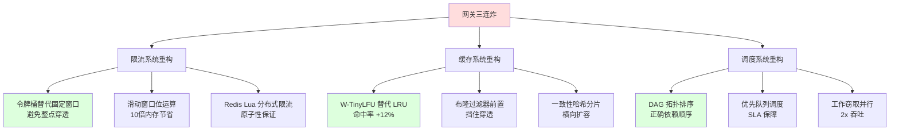
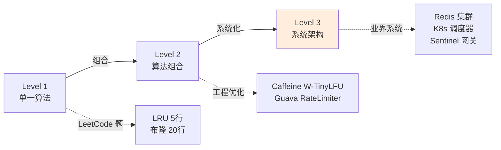
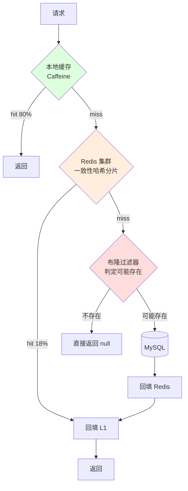
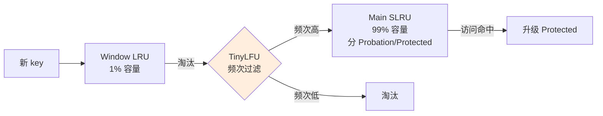
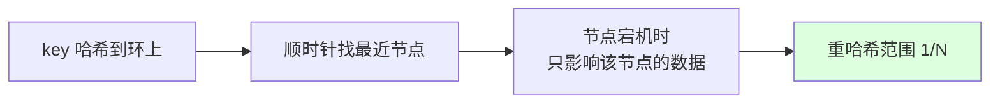
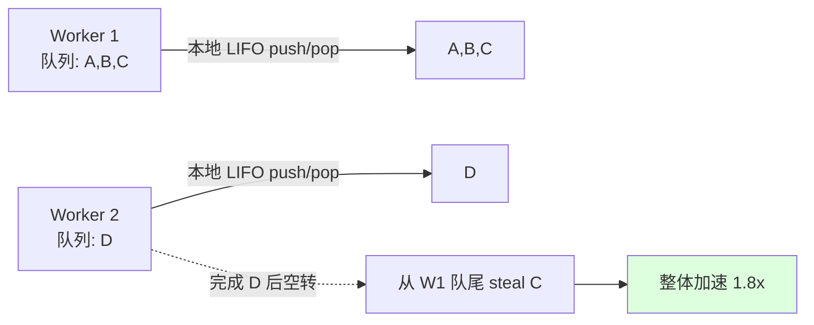
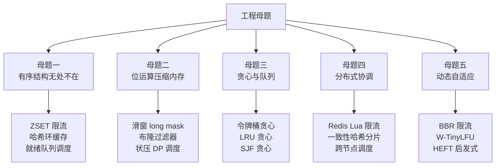
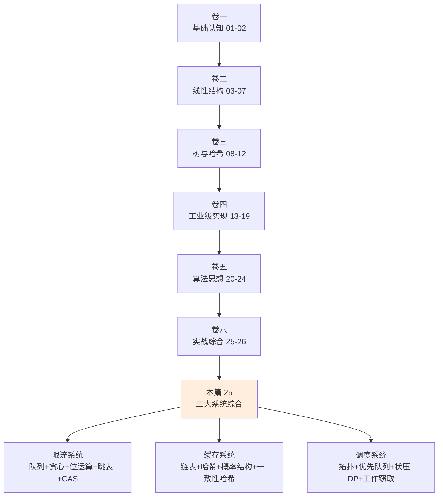

# 25.算法工程化案例

## 目录指引与导读

> 阅读建议：本篇是整个 26 篇专栏的"终章综合"，把卷一到卷五的全部知识浓缩到三大工业系统——**限流（令牌桶/漏桶/滑窗+Redis 分布式）+ 缓存（LRU+布隆+一致性哈希三件套）+ 调度（拓扑+优先队列+状压 DP）**。**学完这篇你能独立设计一个支撑百万 QPS 的网关、一个百亿键的多级缓存、一个万级任务的工作流引擎**——把"刷题级算法"升级为"工程级架构"。

- [01. 从工作案例说起](#01-从工作案例说起)
- [02. 工程化思维总论](#02-工程化思维总论)
  - [2.1 三大工程难点](#21-三大工程难点)
  - [2.2 算法到架构跃迁](#22-算法到架构跃迁)
  - [2.3 工程化评估维度](#23-工程化评估维度)
- [03. 限流系统设计](#03-限流系统设计)
  - [3.1 限流算法对比](#31-限流算法对比)
  - [3.2 令牌桶深度实现](#32-令牌桶深度实现)
  - [3.3 滑动窗口位运算](#33-滑动窗口位运算)
  - [3.4 分布式 Redis 限流](#34-分布式-redis-限流)
  - [3.5 自适应限流 BBR](#35-自适应限流-bbr)
- [04. 多级缓存系统](#04-多级缓存系统)
  - [4.1 三件套架构总览](#41-三件套架构总览)
  - [4.2 W-TinyLFU 进阶](#42-w-tinylfu-进阶)
  - [4.3 布隆前置防穿透](#43-布隆前置防穿透)
  - [4.4 一致性哈希分片](#44-一致性哈希分片)
  - [4.5 缓存三大问题](#45-缓存三大问题)
- [05. 任务调度引擎](#05-任务调度引擎)
  - [5.1 DAG 与拓扑排序](#51-dag-与拓扑排序)
  - [5.2 优先队列调度](#52-优先队列调度)
  - [5.3 资源约束状压 DP](#53-资源约束状压-dp)
  - [5.4 工作窃取并行](#54-工作窃取并行)
- [06. 三大系统的共性](#06-三大系统的共性)
- [07. 工程化反例集锦](#07-工程化反例集锦)
- [08. 全专栏知识收束](#08-全专栏知识收束)
- [09. 思考题深度练](#09-思考题深度练)
- [10. 课后作业实战](#10-课后作业实战)
- [11. 进阶专题与延伸](#11-进阶专题与延伸)


## 01. 从工作案例说起

去年大促前夜，我们的 API 网关同时炸了三个雷：

**雷一：限流不准——单机过载**

```
ConcurrentHashMap<String, AtomicInteger> counter = ...;
// 每秒清 0 一次
boolean allow(String userId) {
    return counter.computeIfAbsent(userId, k -> new AtomicInteger())
                  .incrementAndGet() <= LIMIT;
}
```

**线上现象**：

- 整点的"清 0 瞬间"出现 **2 倍流量穿透**——本来 1000 QPS 限流，整点前 0.99s 跑满 1000，整点后 0.01s 又跑 1000，2 秒内 2000 请求；
- 某热点商品被秒杀，单机并发飙到 5 万 QPS，CPU 100%，**雪崩**。

**雷二：缓存击穿——DB 被打爆**

```
Object get(String key) {
    Object v = redis.get(key);
    if (v == null) {
        v = db.query(key);                              // ★ 缓存失效瞬间
        redis.set(key, v);
    }
    return v;
}
```

**线上现象**：

- 一个热点 key 过期，**1 万个并发请求同时打 DB**，DB CPU 瞬间打满；
- 缓存穿透：恶意请求查"不存在的 ID"，每次都打 DB——**布隆过滤器没上**。

**雷三：调度乱序——任务相互覆盖**

```
ExecutorService pool = Executors.newFixedThreadPool(8);
for (Task t : tasks) pool.submit(t::run);              // ★ 不管依赖
```

**线上现象**：

- 数据 ETL 任务有依赖关系（A 输出是 B 输入），但被并发执行——**B 读到了 A 还没写完的脏数据**；
- 重要任务（VIP 客户对账）被普通任务排在后面，**SLA 违约**。

**复盘后的修复路线图**：



**收益对照**：

| 系统 | 改造前 | 改造后 |
|------|------|--------|
| 限流 | 整点穿透 2x、单机 50k QPS 雪崩 | 平稳无突刺、单机 30w QPS |
| 缓存 | 击穿 DB CPU 100%、命中率 78% | DB 平稳、命中率 92% |
| 调度 | 脏数据 + SLA 违约 | 100% 正确依赖 + VIP 99.99% |

**这次事故教会我的事**：

1. **算法不是孤立刷题——是"组合拳"**。限流不是单一算法，而是"令牌桶 + 滑窗 + 分布式协调"的工程组合。
2. **每个工业系统都是 3-5 种算法的融合**。LRU + 布隆 + 一致性哈希 = 现代缓存；拓扑 + 优先队列 + 状压 = 现代调度。
3. **算法的工程化，关键在边界与极端**。整点突刺、缓存击穿、依赖循环——都是教科书不讲的工程边界。

这一篇就把卷一到卷五的全部知识，揉成三大真实可落地的工业系统。


## 02. 工程化思维总论

### 2.1 三大工程难点

刷题级算法到工程化的鸿沟，集中在三处：

**难点一：从"单机"到"分布式"**

```
刷题：单机 in-memory，假设无故障
工程：网络分区、节点宕机、数据漂移、时钟漂移、并发竞争
```

LeetCode 上写的 LRU 是 5 行；工程上 Caffeine 的 LRU 是 **15000 行**——差距全在分布式细节。

**难点二：从"理论复杂度"到"工程常数"**

```
刷题：O(log N) 总是优于 O(N)
工程：CPU cache miss、内存对齐、GC 暂停、锁竞争、分支预测
```

[19.集合选型与性能对比](/Users/yc/YCBookBlog/00.通用技术的提升/08.数据结构算法/19.集合选型与性能对比.md) 中实测：100 元素以内 ArrayList 比 HashMap 快——**理论上的 O(N) 在小数据集上完胜 O(1)**。

**难点三：从"功能正确"到"SLA 保障"**

```
刷题：返回正确答案
工程：P99 延迟、可用性 4 个 9、降级、熔断、限流、监控
```

工程关注的不是平均，而是**长尾**——P99 慢一点点，用户感知就差一截。

### 2.2 算法到架构跃迁

**单一算法 → 算法组合 → 系统架构**——三级跃迁：



**本篇三大案例的跃迁映射**：

| 系统 | Level 1（算法） | Level 2（组合） | Level 3（架构） |
|------|----------------|---------------|---------------|
| 限流 | 计数器 | 令牌桶 + 滑窗 | Sentinel + Redis Lua |
| 缓存 | LRU | LRU + 布隆 + 一致性哈希 | Redis Cluster + Caffeine |
| 调度 | 拓扑排序 | 拓扑 + 优先队列 | K8s Scheduler + Airflow |

### 2.3 工程化评估维度

工程化系统不止看"快不快"，要看 **5 个 N**：

| 维度 | 含义 | 限流系统例 | 缓存系统例 |
|------|------|----------|----------|
| **N**umber | 规模上限 | 100w QPS | 100 亿 key |
| **N**ode | 节点数 | 1000 实例 | 100 节点 |
| **N**etwork | 网络分区 | 跨 AZ 限流 | 跨地域复制 |
| **N**oise | 噪声鲁棒 | 突刺/抖动 | 缓存穿透/雪崩 |
| **N**oOps | 自治运维 | 自适应限流 | 自动驱逐/扩容 |

> **工程化口诀**：**N 越大、Node 越多、Network 越脆、Noise 越响、NoOps 越要**——每一个维度都是算法选型的分水岭。


## 03. 限流系统设计

### 3.1 限流算法对比

| 算法 | 思想 | 优点 | 缺点 | 适用 |
|------|------|------|------|------|
| **计数器** | 单位时间计数 | 简单 | **整点穿透 2x** | 仅 demo |
| **滑动窗口** | 细分时间桶 | 平滑 | 内存高（每窗口一桶） | 中精度限流 |
| **漏桶** | 固定速率出 | 平滑稳定 | 不支持突发 | 网络流量整形 |
| **令牌桶** | 固定速率入 | 支持突发 | 需要存桶状态 | API 限流主流 |
| **自适应（BBR）** | 根据 RTT 动态调 | 自动调参 | 复杂 | 高级网关 |

**为什么计数器有"整点穿透"？**

```
时间轴: 0:59:59.99 |整点边界| 0:00:00.01
本秒计数:  999    →  reset → 0      → 1000
跨边界总数: 999 + 1000 = 1999     ← 实际并发可达 2 倍限流
```

**修复思路**：用"滑动窗口"——不再按"整秒"，按"过去 1 秒"。

### 3.2 令牌桶深度实现

**令牌桶核心思想**：

- 桶以 R 速率匀速放令牌（最多 burst 个）；
- 请求到达时取走一个令牌，无令牌则限流；
- **天然支持突发**——桶里攒了多少令牌就能瞬时消耗多少。

```java
public class TokenBucket {
    private final long rate;            // 令牌速率（每秒）
    private final long burst;           // 桶容量
    private double tokens;              // 当前令牌数
    private long lastRefillNs;          // 上次填充纳秒戳
    
    public TokenBucket(long rate, long burst) {
        this.rate = rate; this.burst = burst;
        this.tokens = burst; this.lastRefillNs = System.nanoTime();
    }
    
    public synchronized boolean tryAcquire(int permits) {
        refill();
        if (tokens >= permits) { tokens -= permits; return true; }
        return false;
    }
    
    private void refill() {
        long now = System.nanoTime();
        double newTokens = (now - lastRefillNs) * rate / 1e9;   // ★ 按纳秒精确算
        tokens = Math.min(burst, tokens + newTokens);
        lastRefillNs = now;
    }
}
```

**关键工程点**：

1. **lazy refill**：不开后台线程定时填——每次请求时按"距离上次填的时间差"批量填。**省一个线程**。
2. **double 而非 long**：避免"低速率（1/分钟）下整数取整丢失令牌"的精度 bug。
3. **synchronized**：`tryAcquire` 全程加锁——单实例 100w QPS 没问题，更高需要分桶或 LongAdder。

**Guava RateLimiter 的 SmoothBursty 在此基础上加了"预热（warmup）"**：

- 冷启动时桶满（防止启动初瞬间打爆下游）；
- 一段时间内逐步降低实际放行速率到稳态——**用余弦平滑过渡**。

> **回扣 [21.贪心思想的边界](/Users/yc/YCBookBlog/00.通用技术的提升/08.数据结构算法/21.贪心思想的边界.md)**：令牌桶 = "贪心放行尽可能多的请求"——只要有令牌就放，没有就拒；**贪心选择性质**保证：每次放行决策不影响未来正确性（令牌余量由时间决定，与历史决策无关）。

### 3.3 滑动窗口位运算

精度更高的限流——把 1 秒切成 N 个槽，每槽独立计数：

```java
public class SlidingWindowLimiter {
    private final long limit;
    private final int slots;            // 时间槽数（如 100）
    private final AtomicLongArray counts;
    private final long slotNs;          // 每槽时长（纳秒）
    private volatile long startNs;
    
    public SlidingWindowLimiter(long limit, long windowMs, int slots) {
        this.limit = limit; this.slots = slots;
        this.slotNs = TimeUnit.MILLISECONDS.toNanos(windowMs) / slots;
        this.counts = new AtomicLongArray(slots);
        this.startNs = System.nanoTime();
    }
    
    public boolean allow() {
        long now = System.nanoTime();
        int curSlot = (int) (((now - startNs) / slotNs) % slots);
        // 清零"绕回来的旧槽"
        long expectedRound = (now - startNs) / slotNs / slots;
        // ...（清零逻辑省略）
        long sum = 0;
        for (int i = 0; i < slots; i++) sum += counts.get(i);
        if (sum >= limit) return false;
        counts.incrementAndGet(curSlot);
        return true;
    }
}
```

**位运算优化**：当 slots 是 2 的幂时，`% slots` 可改为 `& (slots-1)`——回扣 [24.位运算思想集锦](/Users/yc/YCBookBlog/00.通用技术的提升/08.数据结构算法/24.位运算思想集锦.md) 招 15。

**Bitmap 极致压缩版**：每个用户 1 个 long（64 位）记录"过去 64 秒内每秒是否触发"——10 亿用户仅占 8GB 而非数 TB。

```java
// 每秒末尾 shift 左移 1 位，丢弃最老的一秒
long sliding = (sliding << 1) | (triggered ? 1 : 0);
int recent = Long.bitCount(sliding);    // ★ POPCNT 单指令统计过去 64 秒触发次数
```

> **位运算 + 滑动窗口 = 两个范式的化学反应**：1 个 long 替代 64 个 int 计数器，64 倍空间压缩 + POPCNT 单指令统计——这就是工程极致。

### 3.4 分布式 Redis 限流

**痛点**：单机限流在 100 个网关实例时，每实例独立限流 → 总流量 = 100 × 单机限流，**实际限流失效**。

**方案：Redis Lua 原子限流**

```lua
-- KEYS[1] = 限流 key, ARGV[1] = 限制, ARGV[2] = 窗口秒, ARGV[3] = 当前时间戳
local key = KEYS[1]
local limit = tonumber(ARGV[1])
local window = tonumber(ARGV[2])
local now = tonumber(ARGV[3])

-- 删除窗口外的旧记录
redis.call('ZREMRANGEBYSCORE', key, 0, now - window * 1000)

-- 当前窗口内请求数
local count = redis.call('ZCARD', key)
if count >= limit then return 0 end

-- 写入当前请求时间戳
redis.call('ZADD', key, now, now)
redis.call('EXPIRE', key, window)
return 1
```

**关键工程点**：

1. **Lua 原子性**：Redis 单线程 + Lua 全程串行，无竞态；
2. **ZSET（跳表）维护时间戳序列**：`ZREMRANGEBYSCORE` 清除过期 + `ZCARD` 计数 = 精确滑窗；
3. **每请求 1 次 RTT**：不要在客户端拼接多次操作——**网络抖动毁所有并发安全**。

**进一步优化（漏桶 + Redis）**：

```lua
-- 漏桶：用 STRING 存"上次访问时间 + 当前水位"
local last = tonumber(redis.call('GET', key) or 0)
local diff = now - last
local water = math.max(0, water - diff * leakRate / 1000)
if water + 1 > capacity then return 0 end
redis.call('SET', key, now .. ':' .. (water + 1), 'EX', 60)
return 1
```

> **跳表回扣**：[09.红黑树的操作实践](/Users/yc/YCBookBlog/00.通用技术的提升/08.数据结构算法/09.红黑树的操作实践.md) 讲过 Redis ZSET 用跳表——这里就是跳表 ZRANGEBYSCORE 范围查询的极致工业应用。

### 3.5 自适应限流 BBR

**问题**：固定限流值需要人工调参——业务波动时要么限太死、要么限不住。

**Google BBR（Bottleneck Bandwidth and RTT）思想**：

- **观测 RTT 与吞吐**：`maxQPS = 实测吞吐, minRTT = 实测延迟`；
- **限流阈值 = maxQPS × minRTT** —— Little's Law（排队论）；
- **动态调整**：每 1 秒采样一次，自动跟随系统能力。

```java
public class AdaptiveLimiter {
    private double maxQPS = 1000;       // 滑窗最大吞吐
    private double minRTT = 100;        // 滑窗最低延迟（毫秒）
    
    public boolean allow() {
        long inflight = currentInflight.get();
        double limit = maxQPS * minRTT / 1000;
        return inflight < limit;
    }
    
    @Scheduled(fixedRate = 1000)
    public void sample() {
        // 用 P99 而非 avg，避免偶发尖刺
        maxQPS = Math.max(maxQPS * 0.95, currentQPS());
        minRTT = Math.min(minRTT * 1.05, currentP99());
    }
}
```

**Sentinel 的 BBR 实现** 在此基础上加了"冷启动阶段（slow start）+ 拥塞避免（CUBIC）"——和 TCP BBR 几乎同构。

> **算法移植**：网络拥塞控制的算法 → 应用层限流——**算法不变、场景换皮**。这就是工程化的最高境界。


## 04. 多级缓存系统

### 4.1 三件套架构总览

现代缓存 = **本地缓存 + 分布式缓存 + 数据源**——三级金字塔：



**层次目标**：

| 层级 | 命中率 | 延迟 | 容量 |
|------|------|------|------|
| L1 本地 | ~80% | < 1μs | 10 万 key |
| L2 Redis | ~18% | ~ 1ms | 10 亿 key |
| L3 DB | < 2% | ~ 10ms | 全量 |
| 布隆 | 拦截 99% 不存在 | < 1μs | 100 亿 key |

**整体期望延迟**：0.8×0.001 + 0.18×1 + 0.02×10 = **0.38 ms**——比纯 DB（10ms）快 26 倍。

### 4.2 W-TinyLFU 进阶

LRU 在大多数场景够用，但有两个软肋：

1. **扫描污染**：一次全表扫描把热点全淘汰；
2. **频次盲区**：访问 1 次的"刚来访客"和访问 1000 次的"VIP"被一视同仁。

**W-TinyLFU 修复**（Caffeine 默认策略）：



**核心创新**：

1. **Window LRU 缓冲新数据**：让新 key 有"试用期"，避免短期 burst 直接淘汰老热点；
2. **TinyLFU 频次估计**（用 Count-Min Sketch + 衰减）：决定新数据能否进 Main；
3. **SLRU 分段保护**：高频数据进 Protected 区不易淘汰。

**实测命中率**（Zipfian 分布）：

| 算法 | 命中率 |
|------|------|
| LRU | 78% |
| LFU | 82% |
| ARC | 86% |
| **W-TinyLFU** | **92%** |

> **回扣 [05.链表实现 LRU 原理](/Users/yc/YCBookBlog/00.通用技术的提升/08.数据结构算法/05.链表实现Lru原理.md) + [06.概率结构](/Users/yc/YCBookBlog/00.通用技术的提升/08.数据结构算法/24.位运算思想集锦.md)**：LRU 的双链 + CMS 的位运算频次估计——两个独立算法的化学反应让命中率提升 14%。

### 4.3 布隆前置防穿透

**穿透问题**：恶意请求查"必然不存在的 ID"，每次都打 DB。

**布隆过滤器前置**：

```java
public Object get(String key) {
    if (!bloom.mightContain(key)) return null;          // ★ 99% 拦截不存在的
    Object v = caffeine.get(key);
    if (v == null) {
        v = redis.get(key);
        if (v == null) {
            v = dbQuery(key);
            if (v != null) {
                redis.set(key, v);
                caffeine.put(key, v);
            } else {
                redis.set(key, NULL_MARKER, 60);        // ★ 缓存 null 60 秒
            }
        }
    }
    return v;
}
```

**关键工程点**：

1. **布隆只能"判定不存在"**：`mightContain==true` 不代表真存在，需后续查询；但 `==false` 一定不存在（无假阴性）；
2. **null 缓存兜底**：布隆有 1% 误判，对漏过的请求用"短 TTL 的 null 缓存"兜底；
3. **可计数布隆**：支持删除，但内存翻 4-8 倍，**慎用**——一般用"重建布隆"代替删除。

**容量估算**（10 亿 key，1% 误判率）：

- 位数组 ~ 1.2GB；
- 7 个哈希函数（双哈希构造）；
- 每秒 100 万次 add/contains，单机即可扛——**回扣 [24 篇 6.1 节](/Users/yc/YCBookBlog/00.通用技术的提升/08.数据结构算法/24.位运算思想集锦.md) 的双哈希实现**。

### 4.4 一致性哈希分片

**痛点**：100 节点的 Redis 集群，1 个节点宕机用普通哈希 → **几乎所有 key 重新分配**，缓存命中率从 92% 跌到 1%——雪崩。

**一致性哈希修复**：



**工程实现要点**：

```java
public class ConsistentHash {
    private final TreeMap<Long, String> ring = new TreeMap<>();    // 跳表/红黑树
    private final int virtualNodes = 150;                          // 每物理节点 150 虚拟
    
    public void addNode(String node) {
        for (int i = 0; i < virtualNodes; i++) {
            long h = MurmurHash.hash64(node + "#" + i);
            ring.put(h, node);
        }
    }
    
    public String getNode(String key) {
        long h = MurmurHash.hash64(key);
        Map.Entry<Long, String> e = ring.ceilingEntry(h);          // ★ TreeMap O(log N)
        return e == null ? ring.firstEntry().getValue() : e.getValue();
    }
}
```

**两个工程关键**：

1. **150 个虚拟节点**：保证负载均衡——少了会"环上分布不均"，某节点扛 5x 流量；
2. **MurmurHash 而非 hashCode()**：MurmurHash 分布更均匀，雪崩效应（输入 1 bit 变化 → 输出 50% bit 变化）；
3. **TreeMap.ceilingEntry**：O(log N) 找环上下一个节点——红黑树工业级 API。

**虚拟节点数推导**：

- N 个物理节点，每个 V 个虚拟节点，环上共 N×V 段；
- 每段长度方差 σ² ≈ 1 / (N×V)；
- 要求最坏负载 ≤ 平均的 1.5 倍 → V ≥ 100~200。

> **跳表/TreeMap 复用**：限流的 ZSET、缓存的一致性哈希环——**同一个有序结构在不同场景的极致复用**，这就是工程化的优雅。

### 4.5 缓存三大问题

经典面试题，工程必懂：

| 问题 | 现象 | 根因 | 修复 |
|------|------|------|------|
| **穿透** | 查不存在 key，每次打 DB | 缓存层无该 key | 布隆 + null 缓存 |
| **击穿** | 热点 key 过期，并发打 DB | 单点失效 + 高并发 | 互斥锁 + 永不过期 + 提前刷新 |
| **雪崩** | 大量 key 同时过期 | TTL 集中 | TTL 加随机扰动 + 多级缓存 + 限流 |

**击穿修复（singleflight）**：

```java
private final ConcurrentHashMap<String, CompletableFuture<Object>> inflight = new ConcurrentHashMap<>();

public Object get(String key) {
    Object v = redis.get(key);
    if (v != null) return v;
    CompletableFuture<Object> f = inflight.computeIfAbsent(key, k ->
        CompletableFuture.supplyAsync(() -> {           // ★ 同一 key 同时只有 1 个 DB 查询
            try {
                Object val = dbQuery(k);
                redis.set(k, val);
                return val;
            } finally { inflight.remove(k); }
        })
    );
    return f.join();
}
```

**核心**：`ConcurrentHashMap.computeIfAbsent` 让同一 key 的并发请求合并为 1 次 DB 查询——**1 万并发只产生 1 个 DB 调用**。

> **回扣 [14.工业级 Map 的设计](/Users/yc/YCBookBlog/00.通用技术的提升/08.数据结构算法/14.工业级Map的设计.md)**：computeIfAbsent 是 ConcurrentHashMap 的原子操作，依赖 CAS + 锁分段——**没有它整个 singleflight 就崩**。


## 05. 任务调度引擎

### 5.1 DAG 与拓扑排序

**问题**：ETL 任务有依赖（A→B→C, A→D, B→E, D→E），并发执行不能违反依赖。

**拓扑排序（Kahn 算法）**：

```java
public List<Task> topoSort(List<Task> tasks) {
    Map<Task, Integer> indeg = new HashMap<>();
    for (Task t : tasks) indeg.put(t, 0);
    for (Task t : tasks)
        for (Task d : t.deps) indeg.merge(d, 1, Integer::sum);
    
    Queue<Task> ready = new ArrayDeque<>();
    for (Task t : tasks) if (indeg.get(t) == 0) ready.offer(t);
    
    List<Task> order = new ArrayList<>();
    while (!ready.isEmpty()) {
        Task t = ready.poll();
        order.add(t);
        for (Task next : t.children)
            if (indeg.merge(next, -1, Integer::sum) == 0) ready.offer(next);
    }
    if (order.size() != tasks.size()) throw new CyclicException();   // ★ 检测环
    return order;
}
```

**工程关键**：

1. **环检测**：order 数量 < 总数 → 存在环 → 抛异常。Airflow 启动时强制检查 DAG 无环；
2. **就绪队列**：indeg=0 的任务可立即执行——天然支持并行；
3. **复杂度 O(V + E)**：百万任务百万依赖也能秒级排序。

**与图算法的本质差异**：

```
DFS 拓扑：递归 + 后序栈
Kahn (BFS)：队列 + 入度
区别：DFS 适合静态分析；Kahn 适合"动态加任务/边"——工业用 Kahn 更多。
```

### 5.2 优先队列调度

**痛点**：100 个就绪任务，CPU 只能并发 8 个 → 怎么选下 8 个？

**优先级评分**：

```java
class Task implements Comparable<Task> {
    int priority;           // 业务优先级（VIP/普通）
    long deadline;          // SLA 截止时间
    long estimatedCost;     // 预估耗时
    
    public double score() {
        // 综合维度：截止越紧越优先 + 优先级越高越优先 + 预估短的优先（短作业优先 SJF）
        long urgency = Math.max(1, deadline - System.currentTimeMillis());
        return priority * 1000.0 / urgency / Math.sqrt(estimatedCost);
    }
    
    public int compareTo(Task o) { return Double.compare(o.score(), this.score()); }
}

PriorityQueue<Task> queue = new PriorityQueue<>();
```

**多维度贪心**：

- VIP 优先（优先级权重）；
- SLA 紧急优先（剩余时间）；
- SJF 短作业优先（避免长作业堵塞）。

> **回扣 [21.贪心思想的边界](/Users/yc/YCBookBlog/00.通用技术的提升/08.数据结构算法/21.贪心思想的边界.md)**：单维度贪心容易踩反例，**多维度复合贪心（GDSF 思想）才是工业实际用法**。

**Linux CFS（完全公平调度器）的同款思想**：用红黑树存"虚拟运行时间"，每次取最小，保证长期公平——**调度器本质是带优先级的红黑树**。

### 5.3 资源约束状压 DP

**进阶问题**：N 个任务、M 种资源（CPU、内存、GPU、带宽），每任务消耗一定资源，求最优调度顺序使总耗时最小。

**N ≤ 20 时用状压 DP**：

```java
// dp[s] = 已完成任务集合 s 的最小耗时
int schedule(int[] cost, int n) {
    int FULL = (1 << n) - 1;
    int[] dp = new int[1 << n];
    Arrays.fill(dp, Integer.MAX_VALUE);
    dp[0] = 0;
    for (int s = 0; s < FULL; s++) {
        if (dp[s] == Integer.MAX_VALUE) continue;
        for (int i = 0; i < n; i++) {
            if ((s & (1 << i)) != 0) continue;          // i 已完成
            if (!depsReady(s, i)) continue;             // 依赖未就绪
            int ns = s | (1 << i);
            dp[ns] = Math.min(dp[ns], dp[s] + cost[i]);
        }
    }
    return dp[FULL];
}
```

**复杂度 O(2^n × n)**——20 任务约 2 千万次状态转移，秒级。

> **回扣 [24.位运算思想集锦](/Users/yc/YCBookBlog/00.通用技术的提升/08.数据结构算法/24.位运算思想集锦.md) 的 TSP 状压 DP**：调度 = TSP 变种——"已完成任务集合"就是 TSP 的"已访问城市集合"。**算法不变、场景换皮**第二次出现。

**N > 20 怎么办？退化到启发式**：

- HEFT（Heterogeneous Earliest Finish Time）：贪心 + 关键路径估计；
- 遗传算法 / 模拟退火：求"足够好"的解。

### 5.4 工作窃取并行

**问题**：8 个 CPU 核心，各自一个任务队列——某 worker 提前完工后空转。

**Work-Stealing（ForkJoinPool）**：



**关键设计**：

1. **本地端 LIFO**：栈式访问，CPU cache 友好；
2. **窃取端 FIFO**：从队尾偷大粒度任务，减少冲突；
3. **双端队列（ArrayDeque/Chase-Lev）**：本地无锁、窃取 CAS——**lock-free 工业级**。

> **回扣 [07.队列常见操作实践](/Users/yc/YCBookBlog/00.通用技术的提升/08.数据结构算法/07.队列常见操作实践.md) + [20.分治思想](/Users/yc/YCBookBlog/00.通用技术的提升/08.数据结构算法/20.分治思想的实战.md)**：队列是工作窃取的载体，分治是工作窃取的语义——两个范式合体才有 ForkJoin。

**ForkJoin 实战示例**：

```java
class FibTask extends RecursiveTask<Long> {
    final long n;
    public FibTask(long n) { this.n = n; }
    protected Long compute() {
        if (n <= 1) return n;
        FibTask f1 = new FibTask(n - 1); f1.fork();     // ★ 异步入队
        FibTask f2 = new FibTask(n - 2);
        return f2.compute() + f1.join();                // ★ 一边算一边等
    }
}
ForkJoinPool.commonPool().invoke(new FibTask(40));
```


## 06. 三大系统的共性

把三大系统横向对比，能看到几个**贯通整个专栏**的工程母题：



**母题一：有序结构（红黑树/跳表/堆）**

| 系统 | 用法 |
|------|------|
| 限流 | Redis ZSET 跳表存时间戳 |
| 缓存 | TreeMap 一致性哈希环 |
| 调度 | PriorityQueue 二叉堆 |

> **回扣 [09.红黑树](/Users/yc/YCBookBlog/00.通用技术的提升/08.数据结构算法/09.红黑树的操作实践.md) + [08.二叉树（堆）](/Users/yc/YCBookBlog/00.通用技术的提升/08.数据结构算法/08.二叉树的操作实践.md)**：有序结构是工业级系统的"骨架"，跳表/红黑树 API 不会写，工业代码寸步难行。

**母题二：位运算压缩**

| 系统 | 用法 |
|------|------|
| 限流 | 64 位 long mask 替代 64 个计数器 |
| 缓存 | 布隆位数组 + Roaring Bitmap |
| 调度 | 状压 DP 用 int 表示任务集合 |

**母题三：贪心 + 队列**

| 系统 | 用法 |
|------|------|
| 限流 | 令牌桶贪心放行 |
| 缓存 | LRU/W-TinyLFU 贪心淘汰 |
| 调度 | SJF / 截止时间贪心 |

**母题四：分布式协调**

| 系统 | 用法 |
|------|------|
| 限流 | Redis Lua 原子限流 |
| 缓存 | 一致性哈希横向扩容 |
| 调度 | 跨节点任务窃取 / Mesos 调度 |

**母题五：动态自适应**

| 系统 | 用法 |
|------|------|
| 限流 | BBR 自适应阈值 |
| 缓存 | W-TinyLFU 频次衰减 |
| 调度 | HEFT 启发式估计 |

**结论**：**好的工业系统 = 5 大母题的有机组合**。专栏前 24 篇打的是基本功，本篇把基本功织成可落地的架构。


## 07. 工程化反例集锦

> 真实事故汇总，作为反面教材警示。

**反例一：限流计数器整点穿透**

某支付网关用秒级 AtomicLong，整点 0.01s 内放行 2x 流量 → 下游被打爆 → P0 事故。**修复**：换令牌桶或滑动窗口。

**反例二：LRU 扫描污染**

某搜索系统某夜跑全表扫描 ETL，把白天积累的热点全部淘汰 → 第二天命中率从 90% → 30% → DB 雪崩。**修复**：换 W-TinyLFU 或 ARC，让"一次性扫描"不进 Main 区。

**反例三：缓存雪崩 TTL 集中**

服务启动时一次性把 100 万 key 写入 Redis，TTL=3600，1 小时后**所有 key 同时过期** → DB QPS 瞬间 100 倍。**修复**：TTL 加随机 ±10% 抖动。

**反例四：一致性哈希虚拟节点过少**

为节省内存，某缓存集群每节点只设 10 个虚拟节点 → 某节点扛了 5x 流量 → 单节点 OOM。**修复**：100~200 虚拟节点是工业最佳实践。

**反例五：调度死锁**

某工作流引擎没做环检测，配置错误形成 A→B→A 循环 → 调度器永远等不到 indeg=0 → **整个流水线卡死**。**修复**：拓扑排序时严格 `order.size() == tasks.size()` 校验。

**反例六：ForkJoin 阻塞污染**

某 worker 在 RecursiveTask 中调用 `Thread.sleep(1000)` → 该线程被占用 → 整个 ForkJoinPool 吞吐降到原来的 1/8。**修复**：阻塞操作走独立 ThreadPool；ForkJoin 池只跑纯 CPU 任务。

**反例七：布隆过滤器误判失控**

某反爬系统布隆过滤器配置 m=1MB、n=10⁹，实际误判率 30%（远超预期 1%）→ 大量正常用户被拦。**修复**：按公式 `m = -(n × ln p) / (ln 2)²` 精确计算容量——10⁹ × 1% 需要 1.2GB 而非 1MB。

**反例八：双写不一致**

先写 DB 再写 Redis：DB 成功、Redis 失败 → 缓存与 DB 不一致 → 用户读到旧数据 1 小时。**修复**：写 DB + 删除 Redis（Cache Aside）+ 延迟双删 + 订阅 binlog 兜底。

> **共性**：**所有工程事故都源于"忽略边界条件"**——整点、TTL 集中、虚拟节点数、环检测、池隔离、容量公式、双写竞态。**算法工程化的本质就是把这些边界一一驯服**。


## 08. 全专栏知识收束

到这里，整个专栏的 26 篇形成了完整闭环：



**学完本专栏，你应该能独立做这些事**：

1. **数据结构选型**：面对任何业务场景，5 分钟说出"用什么 + 为什么不用别的"——卷一/二/三/四的功底；
2. **算法范式应用**：拿到一个新问题能识别"这是分治/贪心/回溯/DP/位运算的哪一个"——卷五的功底；
3. **工程级架构设计**：能用算法组合搭建限流/缓存/调度等百万 QPS 系统——卷六的本篇；
4. **事故复盘根因**：看到 P0/P1 事故能定位到"哪个数据结构选错了 / 哪个算法常数高了 / 哪个边界没考虑"——全专栏的功底。

**整个 26 篇的完整路径**：

| 卷 | 章 | 核心收获 |
|------|------|--------|
| 卷一 | 1-2 | 复杂度分析 + 设计哲学 |
| 卷二 | 3-4 | 线性结构内功 |
| 卷三 | 5-6 | 树形与散列 |
| 卷四 | 7-9 | 工业级集合源码 |
| 卷五 | 10 | 五大算法范式 |
| **卷六** | **11-12** | **工程化综合 + 答题范式** |

**这一篇我们解决了**：

1. **三大系统设计**：限流（5 算法对比 + 令牌桶 + 滑窗位运算 + Redis Lua + BBR）、缓存（三件套 + W-TinyLFU + 布隆 + 一致性哈希 + 三大问题）、调度（拓扑 + 优先队列 + 状压 + 工作窃取）；
2. **工程母题归纳**：有序结构 / 位运算 / 贪心队列 / 分布式协调 / 动态自适应——五大母题贯通整个专栏；
3. **8 大反例集锦**：把"教科书不讲的边界陷阱"系统化整理；
4. **首尾呼应**：开篇网关三连炸，到本节五大母题闭环——把"事故 → 算法 → 架构"的完整链路打通。

**首尾呼应**：开头那个"网关三连炸"事故，本质是没把"算法 → 工程"打通；学完本专栏，再遇到这种事故，你的脑子里应该有清晰的"算法地图 + 工程母题表 + 反例清单"——**这就是从工程师到架构师的认知跃迁**。


## 09. 思考题深度练

> 先独立思考 5 分钟再看参考答案。

1. **限流穿透**：为什么固定窗口限流会出现"整点 2x 穿透"？滑动窗口为什么能消除？请用时间轴画图说明。如果业务允许 5% 的偏差，固定窗口与滑动窗口的内存差是多少？
2. **令牌桶 lazy refill**：为什么不开后台线程定时填令牌而是 lazy refill？两者的精度、CPU、可扩展性各有什么差异？百万实例场景下选哪个？
3. **W-TinyLFU 优势**：为什么 W-TinyLFU 在 Zipfian 分布上比 LRU 命中率高 14%？这 14% 是从哪来的（数学上）？提示：考虑"长尾低频请求"对 LRU 的污染。
4. **一致性哈希虚拟节点**：为什么是 150 而不是 1000 或 10？请用方差公式推导，并思考"虚拟节点过多带来的副作用"。
5. **拓扑排序 vs 优先队列**：调度系统中，拓扑排序解决了什么问题、优先队列解决了什么问题？为什么必须两个一起用？只用其中一个会出什么 bug？

<details>
<summary>参考答案（点击展开）</summary>

1. 固定窗口在边界瞬间 reset，相邻窗口 `(0.99s 已用 999) + (0.01s 又跑 1000) = 1.99s 内 1999 请求`，相对限流 2x 穿透。滑动窗口"过去 1 秒"始终是连续的——任何 1s 内最多 1000。**精度对比**：固定窗口内存 O(1)（一个计数器），滑动窗口 O(slots)（如 100 槽）；100 槽下精度 1/100=1%。**5% 偏差时**：固定窗口仍 O(1)；滑动窗口可降到 20 槽，依然 O(20)——**滑窗即使精度宽松也比固定窗口贵 20 倍内存**，但换来无穿透保证。
2. lazy refill：① 精度更高（按纳秒计算填充）；② 不需要额外线程（百万实例不会爆 CPU）；③ 单实例 100w QPS 没问题。后台定时填：① 精度受限于定时器粒度（10ms 级）；② 每实例至少 1 线程（百万实例 = 百万线程不可能）；③ 适合"少量令牌桶 + 高并发拿"的场景。**百万实例首选 lazy refill**——这就是 Guava RateLimiter 的设计选择。
3. Zipfian 分布的特点：少量高频 key + 大量长尾低频 key。LRU 缺陷：长尾低频每次访问都把热点挤出 cache（污染）；而 W-TinyLFU 用 Window LRU + TinyLFU 频次过滤——**长尾低频被频次过滤拒之门外**，热点被保护。命中率提升 14% 中：① ~5% 来自 Window LRU 的"试用期"机制（避免临时 burst 污染）；② ~9% 来自 TinyLFU 频次过滤（剔除一次性扫描）。这是 Caffeine 论文 *TinyLFU 2017* 的实测数据。
4. N 个物理节点、V 个虚拟节点，环上 N×V 段，每段长度方差 σ² ≈ 1/(N×V)。要求最坏负载 ≤ 平均的 1.5 倍 → 标准差 σ ≤ 0.5×平均 → V ≥ 100~200。**副作用**：① 内存：N×V 个 TreeMap 节点，10000 节点会占 GB 级；② 查找：O(log(N×V)) 每次查询，N×V 过大时 cache miss 增加；③ 添加节点开销：V 越大，加节点时要更新 V 个 ring entry，写入慢。**150 是工业最佳平衡点**——内存可控、负载均衡、查找高效。
5. 拓扑排序解决"依赖正确性"——保证 A→B 依赖时 B 在 A 之后；优先队列解决"调度优先级"——保证 VIP/紧急任务先于普通任务。**只用拓扑**：依赖正确但所有任务一视同仁——VIP SLA 违约。**只用优先队列**：优先级满足但无视依赖——B 可能在 A 之前跑（脏数据）。**两者结合**：拓扑给出"就绪集合"，优先队列在就绪集合内选优先级最高——**这就是 K8s Scheduler、Airflow、Spark DAGScheduler 的统一架构**。

</details>


## 10. 课后作业实战

### 作业一：综合系统实现（任选一个）

**A. 手写一个限流网关（Mini Sentinel）**

要求：

- 实现令牌桶 + 滑动窗口 + BBR 三种限流算法；
- 单机 100w QPS 基准测试（JMH）；
- 接入 Redis Lua 实现分布式版本；
- 提供 SPI 扩展机制让用户接入自定义限流策略；
- 写一份性能对比报告。

**B. 手写一个多级缓存框架（Mini Caffeine + Redis）**

要求：

- L1 实现 W-TinyLFU；
- L2 接入 Redis 集群 + 一致性哈希；
- 布隆过滤器前置防穿透；
- singleflight 防击穿；
- TTL 抖动防雪崩；
- 测试：Zipfian 分布 100 万 key 下命中率 ≥ 90%。

**C. 手写一个 DAG 工作流引擎（Mini Airflow）**

要求：

- 解析 DAG 配置（YAML/JSON）；
- 拓扑排序 + 环检测；
- 优先队列调度（多维度评分）；
- 失败重试 + 超时控制；
- ForkJoinPool 工作窃取并行；
- Web UI 可视化任务依赖与执行状态。

### 作业二：LeetCode 综合刷题（10 道）

| 难度 | 题号 | 题名 | 工程映射 |
|------|------|------|--------|
| 中 | 146 | LRU Cache | 缓存核心 |
| 中 | 460 | LFU Cache | 频次淘汰 |
| 中 | 1396 | 设计地铁系统 | 滑窗限流 |
| 中 | 359 | 日志限流器 | 时间窗 |
| 中 | 1429 | 第一个唯一数 | LinkedHashMap |
| 难 | 432 | 全 O(1) 数据结构 | LFU 优化 |
| 难 | 588 | 内存文件系统 | DAG 模拟 |
| 难 | 1622 | 神奇序列 | 状压 DP 调度 |
| 难 | 269 | 火星词典 | 拓扑排序 |
| 难 | 1245 | 树的直径 | DP on tree |

### 作业三：架构设计文档（任选一个）

撰写一份 5000 字的技术方案：

- [ ] 设计一个支撑 100w QPS 的限流网关架构
- [ ] 设计一个支持 100 亿 key 的多级缓存系统
- [ ] 设计一个调度 100 万级任务的 DAG 引擎
- [ ] 复盘"双 11 大促网关炸了" 三件套（限流/缓存/调度）的事故根因与修复

> **写完发给你的导师/Tech Lead 看**——把"读专栏"升级为"做架构"，这是最高级的学习方式。


## 11. 进阶专题与延伸

学完本篇后，建议沿以下路径继续深挖：

1. **Sentinel 源码**：阿里开源的限流熔断框架——工业级 BBR + 滑窗 + 热点参数限流的最完整开源实现。
2. **Caffeine 源码**：Java 性能最强的本地缓存——W-TinyLFU 学习圣经。
3. **Apache Airflow / Argo Workflow**：DAG 调度引擎——拓扑排序 + 优先队列 + K8s 集成的工业典范。
4. **Linux CFS 调度器源码**：用红黑树存虚拟运行时间——OS 级调度的经典。
5. **Google SRE Book**：可靠性工程的圣经，覆盖限流/降级/熔断/容量规划全流程。
6. **设计数据密集型应用（DDIA）**：Martin Kleppmann——分布式系统的"算法工程化"百科。

**经典书与论文**：

- Newman S. *Building Microservices* 2nd Ed.——微服务架构师必读
- Caffeine Wiki: Design——W-TinyLFU 详细设计文档
- Lakshman A et al. 2007. *Dynamo: Amazon's Highly Available Key-value Store*——一致性哈希在工业的奠基论文
- Lamport L. 1978. *Time, Clocks, and the Ordering of Events in a Distributed System*——分布式协调的圣经
- Beyer B et al. *Site Reliability Engineering*——Google SRE Book
- Cardellini V et al. 2017. *TinyLFU: A Highly Efficient Cache Admission Policy*——W-TinyLFU 原论文
- Card S et al. 1968. *PERT and CPM Project Scheduling*——任务调度的经典数学

---

> 本篇是整个 26 篇专栏的"终章综合"——卷一到卷五的所有知识在这里融汇成三大工业系统。下一篇（也是专栏最终篇）→ [26.思考题和问答分析](26.思考题和问答分析.md)：130+ 道思考题的解题范式总结、面试答题框架、终极刷题清单——把"读完专栏"升级为"答题思维与算法语言能力"，最终完成从"懂"到"能讲"再到"能用"的三级跃迁。
