# 01.通用架构设计方案

> **本篇定位**：架构设计是所有方案的"地基"。本文不讲花哨的概念，而是回答三个问题——**为什么必须做架构？业界主流方案怎么演进的？我该选哪种？**

#### 目录介绍
- [01.一个真实的事故](#01一个真实的事故)
  - [1.1 事故背景还原](#11-事故背景还原)
  - [1.2 复盘根因定位](#12-复盘根因定位)
  - [1.3 反思架构价值](#13-反思架构价值)
- [02.要解决什么问题](#02要解决什么问题)
  - [2.1 复杂度的失控](#21-复杂度的失控)
  - [2.2 协作的边界](#22-协作的边界)
  - [2.3 演进的成本](#23-演进的成本)
  - [2.4 三个核心矛盾](#24-三个核心矛盾)
- [03.业界主流方案](#03业界主流方案)
  - [3.1 三种架构溯源](#31-三种架构溯源)
  - [3.2 横向对比矩阵](#32-横向对比矩阵)
  - [3.3 代码结构对比](#33-代码结构对比)
- [04.架构设计原则](#04架构设计原则)
  - [4.1 三条优先级法则](#41-三条优先级法则)
  - [4.2 SOLID 落地解读](#42-solid-落地解读)
  - [4.3 分层依赖原则](#43-分层依赖原则)
- [05.MVC 方案落地](#05mvc-方案落地)
  - [5.1 核心结构图](#51-核心结构图)
  - [5.2 数据流时序](#52-数据流时序)
  - [5.3 适用与不适用](#53-适用与不适用)
- [06.MVP 方案落地](#06mvp-方案落地)
  - [6.1 核心结构图](#61-核心结构图)
  - [6.2 数据流时序](#62-数据流时序)
  - [6.3 适用与不适用](#63-适用与不适用)
- [07.MVVM 方案落地](#07mvvm-方案落地)
  - [7.1 核心结构图](#71-核心结构图)
  - [7.2 数据流时序](#72-数据流时序)
  - [7.3 适用与不适用](#73-适用与不适用)
- [08.架构设计陷阱](#08架构设计陷阱)
  - [8.1 过度设计反例](#81-过度设计反例)
  - [8.2 欠缺设计反例](#82-欠缺设计反例)
  - [8.3 选型错配反例](#83-选型错配反例)
- [09.架构演进路线](#09架构演进路线)
  - [9.1 V1 单体启动](#91-v1-单体启动)
  - [9.2 V2 分层规范](#92-v2-分层规范)
  - [9.3 V3 组件治理](#93-v3-组件治理)
- [10.总结与决策](#10总结与决策)
  - [10.1 黄金五法则](#101-黄金五法则)
  - [10.2 选型决策树](#102-选型决策树)

## 01.一个真实的事故

### 1.1 事故背景还原

某团队接手一个迭代了 3 年的 App 项目，**单 Activity 文件 4200 行**，登录逻辑、网络请求、UI 刷新、埋点全在一个 `onCreate` 里。某次产品提了一个看似简单的需求："登录后给老用户弹一个优惠券"。结果上线第二天炸了——

- **现象**：30% 老用户进入 App 闪退
- **影响**：当天日活下跌 18%，丢单约 200 万
- **修复**：紧急回滚，3 天后重新发版

### 1.2 复盘根因定位

回头看代码，那段"加优惠券弹窗"的逻辑只有 12 行，但它依赖了 7 个全局变量、3 个静态单例和 1 个还没初始化的 Service。**真正的根因不是这 12 行代码，而是过去 3 年没有人定义过"什么逻辑应该写在哪一层"**。

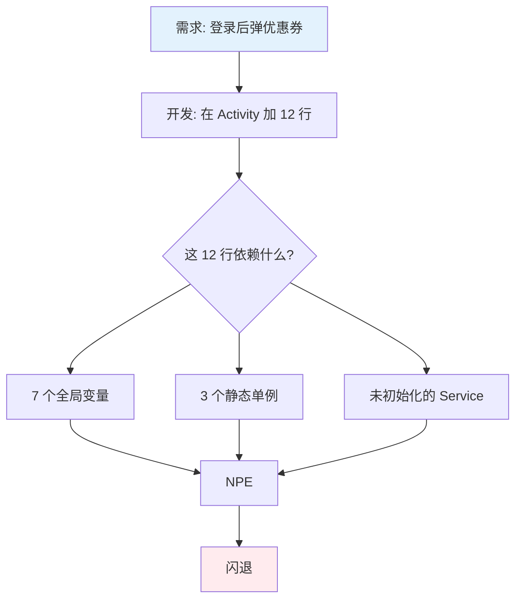

### 1.3 反思架构价值

这次事故揭示了一个朴素但被忽视的事实：**没有架构 ≠ 没有结构，而是结构由"最后一个写代码的人"随机决定**。架构设计的本质，不是写更多代码，而是**用一套规则约束未来所有迭代**。

> 架构 = 一组可以让团队在 3 年后依然敢于改动它的约束。

带着这个事故的痛感，我们重新审视架构设计要解决的问题。

## 02.要解决什么问题

### 2.1 复杂度的失控

软件复杂度有两类：**本质复杂度**（业务本身就难，例如金融风控规则）和**偶然复杂度**（架构腐坏带来的难，例如全局变量随处可改）。架构能消除的只有偶然复杂度，但偶然复杂度一旦失控，会比本质复杂度大 5～10 倍。

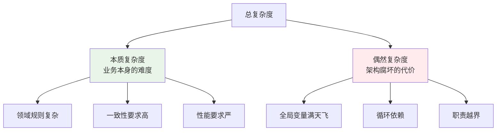

**架构的第一个使命**：把偶然复杂度压到最低。

### 2.2 协作的边界

3 人团队靠口头约定就能高效协作，但 30 人团队没有架构约束就会迅速变成"代码管不住"。架构通过**强制的边界**（包/模块/组件）让"我不需要看你的代码也能和你协作"成为可能。

| 团队规模 | 没有架构 | 有架构 |
|---|---|---|
| 3 人 | 还行，靠默契 | 收益不大 |
| 10 人 | 开始打架 | 开始有价值 |
| 30 人 | 频繁回滚 | 必须 |
| 100 人 | 不可能交付 | 唯一选择 |

### 2.3 演进的成本

架构的真正回报不在第一次写完，而在**第 N 次改它**。一个好的架构，让你 3 年后改一行代码只需要看 3 个文件；一个坏的架构，让你 3 个月后改一行代码就得跑全量回归。

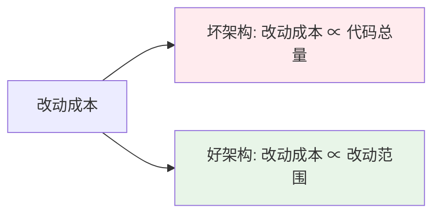

### 2.4 三个核心矛盾

把上面的问题抽象一下，架构设计实际是在解三组矛盾：

| 矛盾 | 一端 | 另一端 | 架构的作用 |
|---|---|---|---|
| **耦合 vs 复用** | 调用越直接越快 | 直接调用就耦合死了 | 通过抽象层让它们共存 |
| **简单 vs 扩展** | 越简单越好维护 | 太简单不够灵活 | 留出"可扩展点" |
| **稳定 vs 演进** | 不动最稳 | 不动就过时 | 提供安全的演进路径 |

理解了"要解决什么问题"，再看业界给出的方案就有的放矢了。

## 03.业界主流方案

### 3.1 三种架构溯源

**为什么会出现 MVC？** 1979 年 Trygve Reenskaug 在 Smalltalk 里提出 MVC，要解决的问题非常具体——**让 GUI 程序的视图刷新和业务逻辑解耦**。这是计算机历史上第一次把"视图"和"模型"在代码层面分开。

**为什么会演化出 MVP？** 90 年代桌面程序变得越来越复杂，MVC 的 View 还是会回头读 Model（双向耦合），导致单元测试几乎不可能写。MVP 的发明者（Mike Potel）做了一个看似很小但极关键的改动：**让 View 变成"被动"的，所有逻辑收敛到 Presenter**。这一改让 GUI 单元测试第一次成为可能。

**为什么会出现 MVVM？** 2005 年微软 WPF 团队遇到一个新问题：UI 越来越声明式（XAML），但 Presenter 里到处是 `view.setText()` 这种命令式代码。他们把"声明式 UI + 数据绑定"组合起来，让 ViewModel 完全不需要持有 View 的引用。这是响应式编程的雏形。

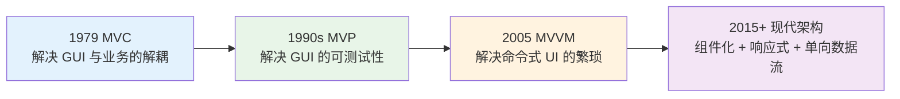

**关键洞察**：每一次架构演进，都是为了解决前一代留下的具体痛点，**不是为了"更先进"**。这也是后面 §4 我们强调"合适优于先进"的根本原因。

### 3.2 横向对比矩阵

| 维度 | MVC | MVP | MVVM |
|---|---|---|---|
| **诞生年份** | 1979 | 1990s | 2005 |
| **核心目标** | 视图与模型分离 | 视图被动化 + 可测试 | 数据绑定 + 声明式 UI |
| **View 是否有逻辑** | 有部分 | 完全没有 | 只有声明式绑定 |
| **可测试性** | 弱（View-Model 耦合） | 强（Presenter 可单测） | 中（依赖绑定框架） |
| **代码量** | 少 | 多（接口爆炸） | 中 |
| **性能开销** | 低 | 低 | 中（绑定监听） |
| **学习曲线** | 平 | 中 | 陡 |
| **团队适配** | 小团队 / 简单页面 | 中型团队 / 复杂逻辑 | 大型团队 / 重交互 |
| **典型场景** | 后台管理页 | 表单密集型 App | 实时数据看板 |

### 3.3 代码结构对比

同样一个"用户登录"场景，三种架构的代码组织截然不同：

| 组件 | MVC | MVP | MVVM |
|---|---|---|---|
| **触发入口** | Controller 接收点击 | View 委托给 Presenter | View 触发 Command |
| **业务逻辑位置** | Controller / Model | Presenter | ViewModel |
| **UI 更新方式** | Model 通知 View | Presenter 调 View 接口 | 数据绑定自动更新 |
| **失败处理** | View 自己判断 | Presenter 调 `showError()` | ViewModel 设置 errorState |
| **单元测试** | 需启动 UI | Mock View 接口即可 | 直接测 ViewModel |

## 04.架构设计原则

### 4.1 三条优先级法则

回到那个事故团队的真实选择题——他们要把 4200 行的 Activity 改成什么？答案不是"最先进的架构"，而是"**当下最合适的**"。这就引出了架构设计第一性的三条法则：

> **合适优于先进 > 演化优于一步到位 > 简单优于复杂**

| 法则 | 反面案例 | 正确做法 |
|---|---|---|
| **合适优于先进** | 一个 5 人团队的内部工具上微服务 + K8s | 单体 + Docker 就够 |
| **演化优于一步到位** | 一开始就规划 50 个组件的拆分 | 先拆 3 个核心组件，跑半年看效果 |
| **简单优于复杂** | 引入 6 个中间件解决一个问题 | 能用 if-else 解决的不上策略模式 |

举个例子：MVP 模式很流行，理论上能降低耦合。但事实是，引入 MVP 后代码极度膨胀，新增了大量 Contract 接口，可读性反而下降。**用了 MVP 真的让维护成本降低了吗？这取决于你的项目规模——10 个页面以下的 App，MVC 完全够用**。

### 4.2 SOLID 落地解读

SOLID 五原则讲烂了，但真正能用在架构里的只有两条最关键：

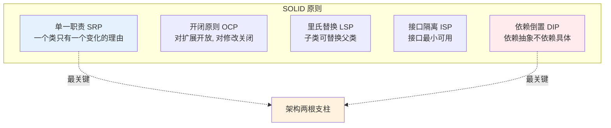

- **SRP（单一职责）** 是分层和分模块的根本依据——每一层、每一个组件，都应该只为"一种变化"负责
- **DIP（依赖倒置）** 是解耦的根本手段——上层依赖抽象接口，而不是依赖具体实现，这样替换实现就不影响上层

### 4.3 分层依赖原则

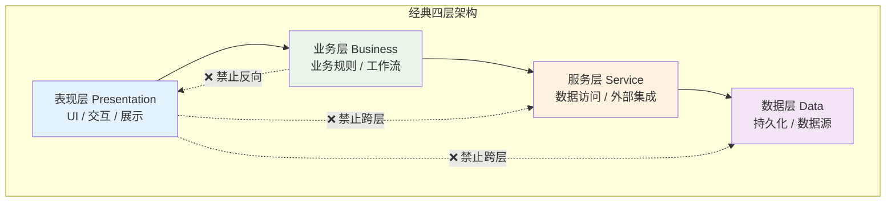

**三条铁律**：

1. **单向依赖**：上层依赖下层，绝不允许反向
2. **不跨层**：表现层不能直接访问数据层（除非这个项目就不打算分层）
3. **依赖接口**：跨层调用走接口，方便替换底层实现

这三条铁律一旦写进 Code Review 检查清单，架构腐坏速度会下降一个数量级。

## 05.MVC 方案落地

### 5.1 核心结构图

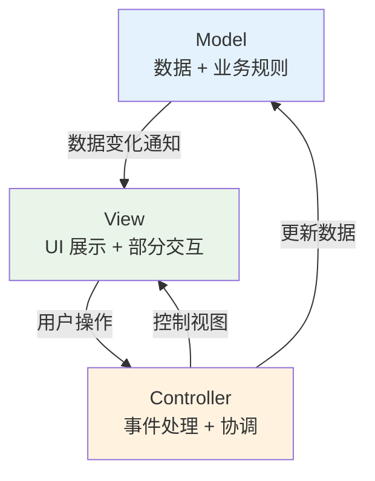

**为什么 View 和 Model 还有箭头？** 这是 MVC 的"原罪"——View 会订阅 Model 的变化（观察者模式），所以 View 知道 Model 长什么样。这就是后来 MVP 要"切断"的那条边。

### 5.2 数据流时序

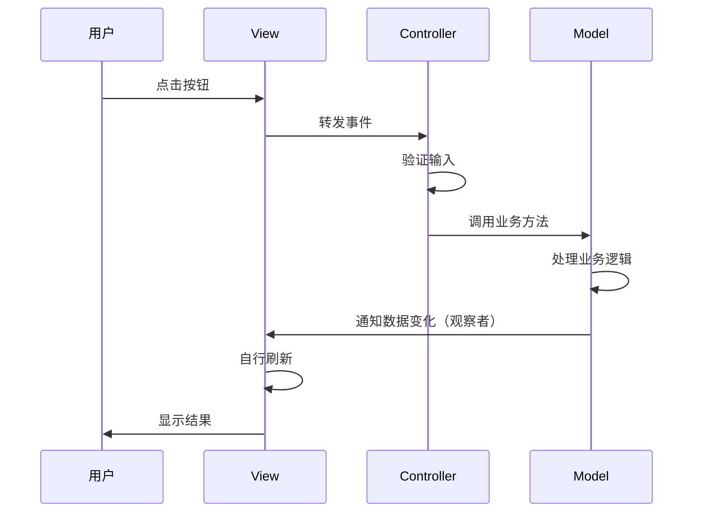

### 5.3 适用与不适用

| 场景 | 是否适用 | 原因 |
|---|---|---|
| 后台管理系统 | ✅ 适用 | 页面简单，不需要复杂交互 |
| 简单 App（< 10 页） | ✅ 适用 | 学习成本低，开发快 |
| 重交互 App | ❌ 不适用 | View-Model 耦合会阻碍迭代 |
| 强测试要求 | ❌ 不适用 | View 难以 Mock |
| 多端共用业务逻辑 | ❌ 不适用 | 业务嵌在 Controller，难复用 |

**Android 的特殊性**：很多人吐槽 Android 的 MVC 不"纯"，根源在于 **Activity 既是 Controller 又是 View 的容器**。XML 是声明式的（View），但布局逻辑（动态显隐、颜色变化）只能写在 Activity 里，于是 Activity 就胀成了"超级类"。这也是 Android 圈最早全面拥抱 MVP 的原因。

## 06.MVP 方案落地

### 6.1 核心结构图

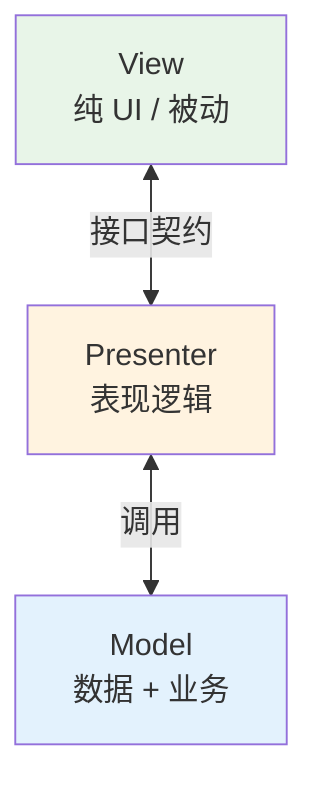

**关键改动**：MVP 把 View 和 Model 之间的箭头切断了，换成 View ↔ Presenter ↔ Model 的链式关系。**View 不再知道 Model 长什么样，它只认 Presenter 给它的"展示数据"**。这就让 View 可以被任意替换、Mock。

### 6.2 数据流时序

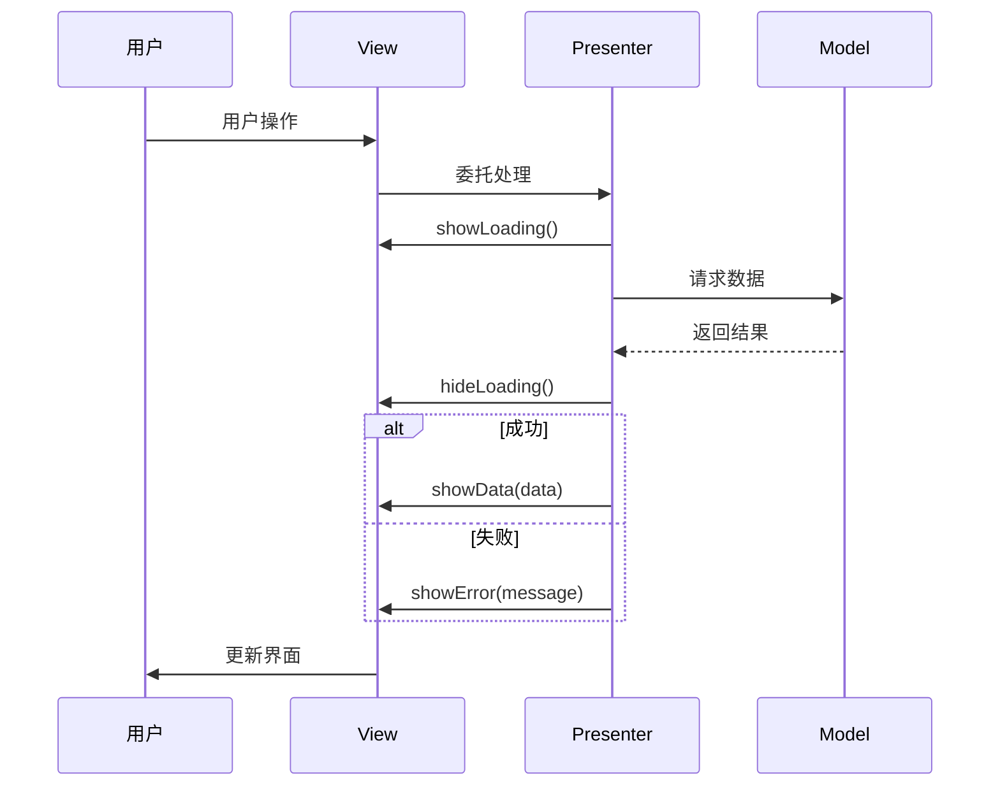

注意 **Presenter 调用 View 都是通过接口**（如 `IUserView.showData()`），所以单元测试时可以 Mock 一个 IUserView 实现，完全不需要启动 UI。

### 6.3 适用与不适用

| 场景 | 是否适用 | 原因 |
|---|---|---|
| 表单密集型 App | ✅ 适用 | 表单校验逻辑收敛在 Presenter |
| 强测试覆盖要求 | ✅ 适用 | View 可 Mock，单测好写 |
| 多平台共享业务 | ✅ 适用 | Presenter 抽出来跨端复用 |
| 简单展示页面 | ❌ 过度设计 | Contract 接口反而让代码膨胀 |
| 强依赖 UI 框架 | ❌ 困难 | 比如 Compose / SwiftUI 这种声明式 UI 与 MVP 思路冲突 |

**MVP 的副作用**：每个页面都要写 Contract（IXxxView + IXxxPresenter），新增一个简单页面也要建 4-5 个类。我见过一个 50 页面的 App 用了 MVP 后代码量翻了 1.8 倍——这就是"过度设计"的代价。

## 07.MVVM 方案落地

### 7.1 核心结构图

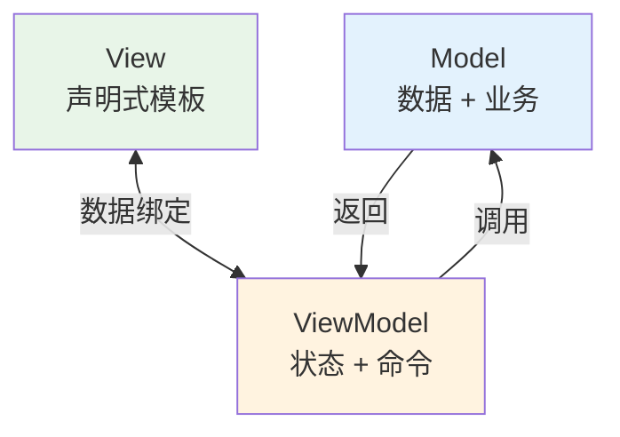

**关键创新**：ViewModel **完全不知道 View 的存在**，它只管暴露状态（如 `LiveData<UserInfo>`）和命令（如 `loginCommand`）。View 通过"绑定语法"自动响应状态变化——这就是响应式编程的本质。

### 7.2 数据流时序

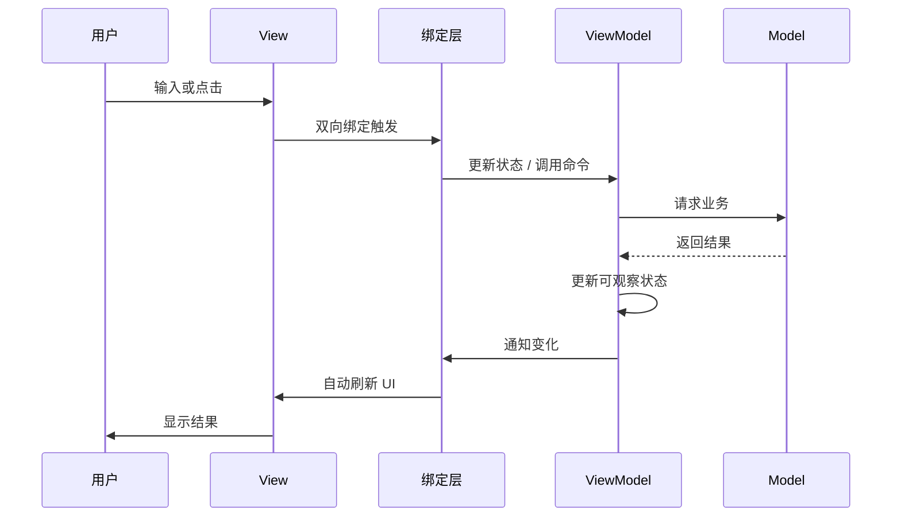

### 7.3 适用与不适用

| 场景 | 是否适用 | 原因 |
|---|---|---|
| 实时数据看板 | ✅ 适用 | 数据变化频繁，绑定省去手动刷新 |
| 复杂表单（多字段联动） | ✅ 适用 | 联动逻辑天然适合响应式 |
| Compose / SwiftUI / Vue | ✅ 必选 | 这些框架本身就是 MVVM 思路 |
| 简单静态页 | ❌ 过度设计 | 不需要绑定，用 MVC 就行 |
| 性能敏感的列表 | ⚠️ 谨慎 | 大量绑定监听会有开销 |

**MVVM 的副作用**：绑定让数据流变"隐式"，调试时 BUG 链会断在绑定框架内部，新人很难上手。一个常见的踩坑是 **ViewModel 持有 Context 导致内存泄漏**——这就需要严格的 Lint 规则约束。

## 08.架构设计陷阱

> 知道哪些坑不能踩，比知道哪些方案好用更重要。

### 8.1 过度设计反例

**反例**：5 人团队的内部 OA 工具，团队负责人引入 Clean Architecture（4 层 + UseCase + Repository + DataSource），每个简单的"获取列表"接口要写 8 个类。

**问题**：6 个月后团队抱怨"加一个字段要改 8 个文件"，开发效率比纯 MVC 慢 3 倍。

**教训**：架构复杂度必须**与团队规模 + 业务复杂度匹配**。Clean Architecture 是为 100 人级别团队 + 高频变更业务设计的，5 人内部工具用它就是用大炮打蚊子。

### 8.2 欠缺设计反例

**反例**：本文开头那个 4200 行 Activity 的事故，就是典型的"欠缺设计"——团队从来没有约定过任何分层规则。

**问题**：每个新开发都按自己习惯加代码，3 年后已经无法回溯任何变更链路。

**教训**：**架构最低标准 = 团队对"代码该写在哪"达成共识**，哪怕只有一张纸的规则。

### 8.3 选型错配反例

**反例**：一个图片浏览 App（核心是图片列表 + 详情页），团队全面铺 MVVM + DataBinding。

**问题**：图片列表性能下降 30%，因为每个 Cell 都注册了 4 个 LiveData 观察者，滑动时频繁触发绑定计算。

**教训**：**性能敏感场景慎用 MVVM**，列表 Cell 这种高频复用对象用普通 MVC + ViewHolder 反而更好。

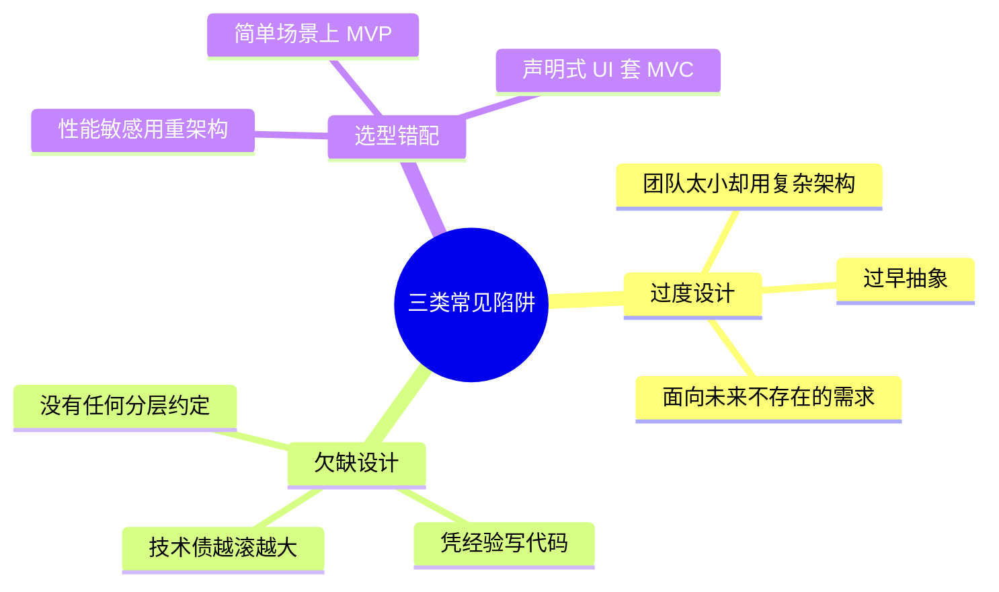

## 09.架构演进路线

> 真实的架构是"长出来"的，不是一次性设计完成的。下面以那个事故团队的真实演进为例。

### 9.1 V1 单体启动

**团队规模**：3 人 / **业务规模**：5 个核心页面 / **架构选择**：Activity + Service 直接调用

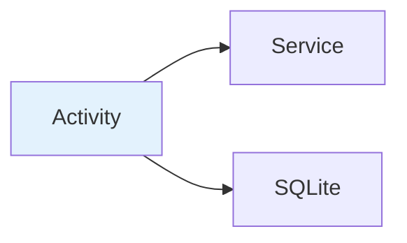

**为什么这样选**：3 人团队、5 个页面，分层只会让简单事情变复杂。
**何时该升级**：页面数 > 15 或团队 > 8 人。

### 9.2 V2 分层规范

**团队规模**：10 人 / **业务规模**：30 个页面 / **架构选择**：MVP + Repository

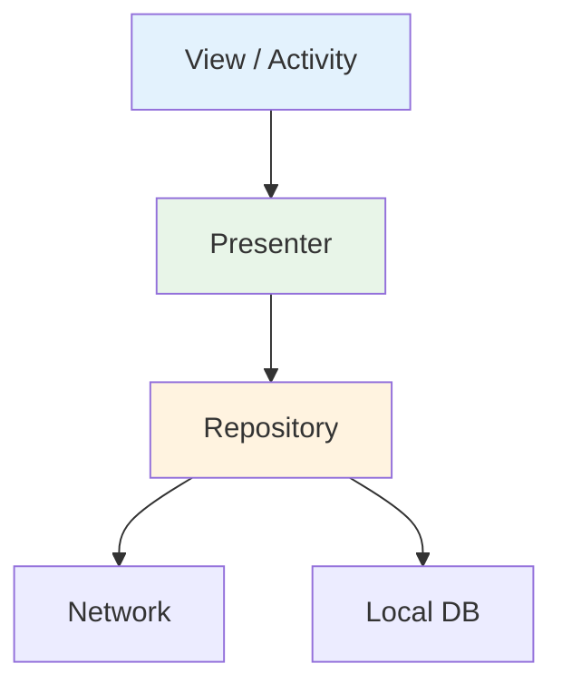

**为什么这样选**：10 人团队需要明确边界 + 强制单测，MVP 是性价比最高的选择。
**带来的痛**：Contract 接口爆炸，每个页面都要写 IView/IPresenter。
**何时该升级**：跨业务线复用需求强烈、团队 > 30 人。

### 9.3 V3 组件治理

**团队规模**：30+ 人 / **业务规模**：100+ 页面 / **架构选择**：MVVM + 组件化 + 单向数据流

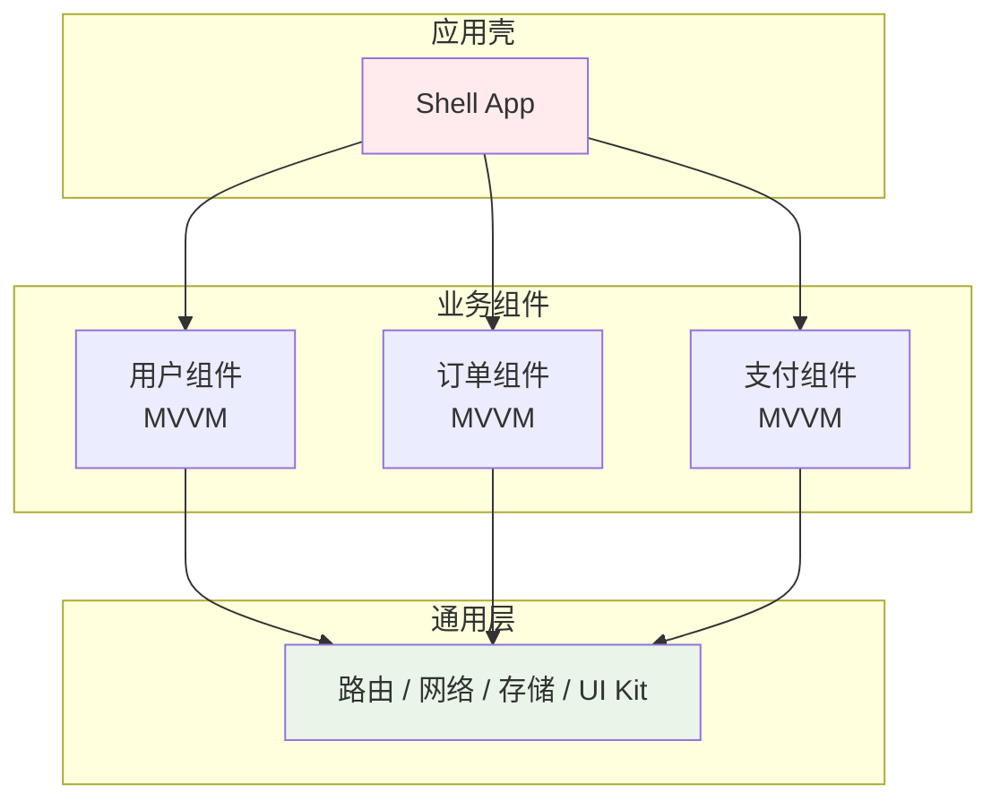

**为什么这样选**：组件化让大团队可以独立开发独立发布，MVVM 配合声明式 UI 大幅降低样板代码。
**带来的痛**：组件间通信成本上升，需要专门的路由方案（详见本卷 02 篇）。

> ⚠️ **关键提醒**：不是每个团队都要走完 V1→V2→V3。**走到自己业务能 Hold 住的那一站就停**——很多创业公司终身停留在 V1，反而活得很好。

## 10.总结与决策

### 10.1 黄金五法则

1. **业务优先** —— 架构服务于业务，不要为了技术而技术
2. **渐进演进** —— 从简单开始，随着业务发展逐步演进
3. **团队匹配** —— 架构复杂度要与团队能力匹配
4. **持续改进** —— 架构不是一成不变的，要持续优化
5. **文档先行** —— 好的架构需要好的文档支撑

### 10.2 选型决策树

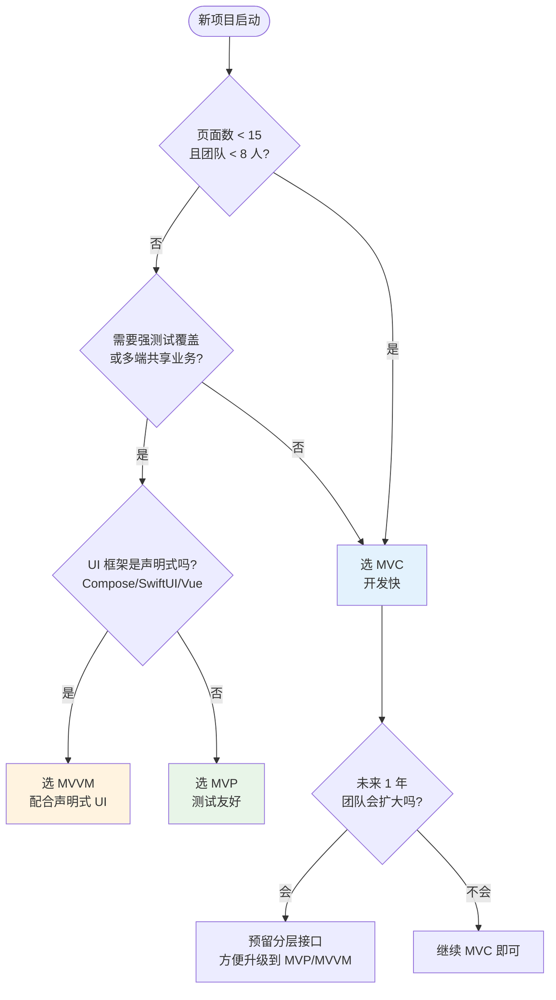

**最后一句话**：架构没有银弹，只有"在当前条件下最不坏的选择"。回到本文开头的事故，那个团队最终选了 V2（MVP + Repository）——不是因为 MVP 最先进，而是因为它的 10 人团队**正好需要这种程度的约束**。

> 好的架构 = **既能当下跑得动，又能 3 年后还敢改**。
