# 11.消息队列方案选型

> **本篇定位**：消息队列是分布式系统的"快递员"——它解耦服务、削峰填谷、异步处理。但选错了 MQ 就像选错了快递公司，**便宜的丢件，贵的小件也用，慢的耽误事**。本文从一个消息丢失事故讲起，回答三个核心问题——**MQ 解决什么本质问题？业界四大 MQ 怎么选？怎么保证消息不丢不重？**

#### 目录介绍
- [01.一条丢失的消息](#01一条丢失的消息)
  - [1.1 消失的退款](#11-消失的退款)
  - [1.2 故障定位过程](#12-故障定位过程)
  - [1.3 反思 MQ 设计](#13-反思-mq-设计)
- [02.要解决的核心矛盾](#02要解决的核心矛盾)
  - [2.1 同步耦合的代价](#21-同步耦合的代价)
  - [2.2 流量峰谷不均](#22-流量峰谷不均)
  - [2.3 一致性与解耦](#23-一致性与解耦)
  - [2.4 MQ 的本质](#24-mq-的本质)
- [03.业界主流方案](#03业界主流方案)
  - [3.1 四大 MQ 概览](#31-四大-mq-概览)
  - [3.2 横向对比矩阵](#32-横向对比矩阵)
  - [3.3 典型场景对照](#33-典型场景对照)
- [04.设计核心原则](#04设计核心原则)
  - [4.1 不丢消息原则](#41-不丢消息原则)
  - [4.2 幂等消费原则](#42-幂等消费原则)
  - [4.3 顺序保证原则](#43-顺序保证原则)
  - [4.4 削峰填谷原则](#44-削峰填谷原则)
- [05.MQ 落地实战](#05mq-落地实战)
  - [5.1 整体架构设计](#51-整体架构设计)
  - [5.2 生产端可靠投递](#52-生产端可靠投递)
  - [5.3 消费端可靠消费](#53-消费端可靠消费)
  - [5.4 死信与重试](#54-死信与重试)
  - [5.5 消息事务方案](#55-消息事务方案)
- [06.三大经典问题](#06三大经典问题)
  - [6.1 消息丢失问题](#61-消息丢失问题)
  - [6.2 消息重复问题](#62-消息重复问题)
  - [6.3 消息堆积问题](#63-消息堆积问题)
- [07.常见陷阱与反例](#07常见陷阱与反例)
  - [7.1 误用 MQ 反例](#71-误用-mq-反例)
  - [7.2 顺序错位反例](#72-顺序错位反例)
  - [7.3 消息风暴反例](#73-消息风暴反例)
- [08.演进路线](#08演进路线)
  - [8.1 V1 进程内队列](#81-v1-进程内队列)
  - [8.2 V2 引入 MQ](#82-v2-引入-mq)
  - [8.3 V3 多 MQ 体系](#83-v3-多-mq-体系)
- [09.总结与决策](#09总结与决策)
  - [9.1 MQ 上线检查表](#91-mq-上线检查表)
  - [9.2 选型决策树](#92-选型决策树)


## 01.一条丢失的消息

### 1.1 消失的退款

某电商客服收到一个用户投诉："已经退款 7 天还没到账"。客服查订单系统：**已退款**。查支付系统：**未收到退款指令**。两个系统数据对不上。

进一步排查发现：**当天有 134 笔退款"消失了"**——订单系统标记已退款，但支付系统从来没收到退款消息。

### 1.2 故障定位过程

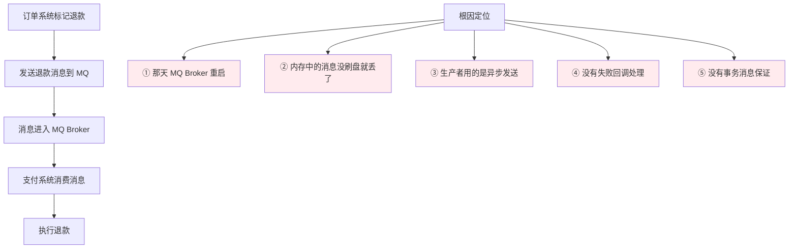

**5 道防线全部失守**——任意一道做对都不会丢这 134 笔。

### 1.3 反思 MQ 设计

事后这个团队总结了三个最深刻的教训：

1. **MQ 不是"丢了无所谓"的轻量组件**——业务依赖它就要把它当数据库一样可靠
2. **可靠性不是 MQ 单方面保证**——生产端、Broker、消费端三方都要做对
3. **消息事务才是金融场景的兜底**——没事务消息的退款链路本质上是赌博

带着这个事故，我们重新审视 MQ 解决的本质问题。

## 02.要解决的核心矛盾

### 2.1 同步耦合的代价

没有 MQ 时，A 服务调用 B 服务、B 调用 C，一个挂了全链路挂：

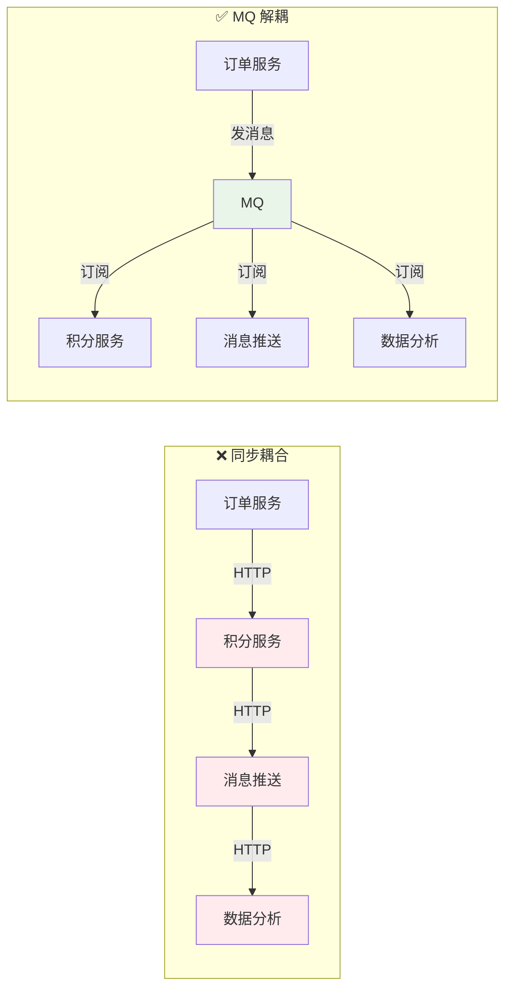

**同步链路的 3 个致命问题**：
- **耦合**：每加一个下游就要改 A 服务
- **扩散故障**：D 挂了 A 也挂
- **响应慢**：耗时 = 所有服务耗时之和

### 2.2 流量峰谷不均

某秒杀场景：平时 1000 QPS，秒杀瞬间 10w QPS。

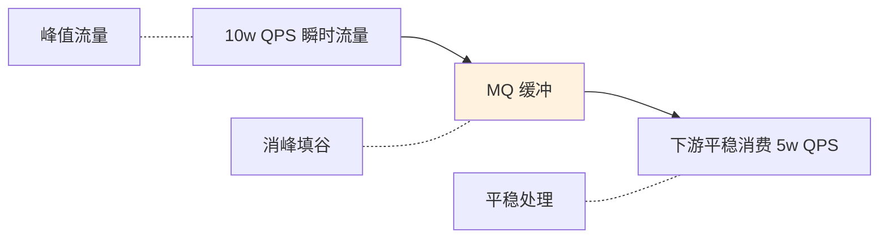

**MQ 的削峰能力**：把瞬时洪峰摊平成持续的稳定流量，下游只需要按平均流量设计容量。

### 2.3 一致性与解耦

解耦带来的副作用是**不再实时一致**：

| 维度 | 同步 | 异步（MQ） |
|---|---|---|
| 一致性 | 实时一致 | 最终一致 |
| 性能 | 慢 | 快 |
| 耦合 | 强 | 弱 |
| 故障扩散 | 易 | 隔离 |

**关键认知**：**用 MQ 就是接受"最终一致"**——业务方必须能容忍短暂的状态不一致。

### 2.4 MQ 的本质

> **MQ = 用一份数据存储 + 异步消费换"解耦"和"削峰"**

它不是免费的——你换来了**可扩展性 + 高性能**，付出的代价是**复杂度 + 最终一致性**。

## 03.业界主流方案

### 3.1 四大 MQ 概览

**Kafka（LinkedIn → Apache）**
**为大数据而生**。日志、监控、数据管道首选。吞吐量极高，但功能相对简单。

**RocketMQ（阿里 → Apache）**
**为业务而生**。事务消息、延迟消息、消息回溯等业务特性丰富。国内电商场景占主导。

**RabbitMQ（Erlang）**
**经典传统 MQ**。AMQP 协议、丰富的路由能力（Exchange / Routing Key），中小型企业流行。

**Pulsar（Yahoo → Apache）**
**新一代 MQ**。云原生、计算与存储分离、多租户。后来者，社区上升中。

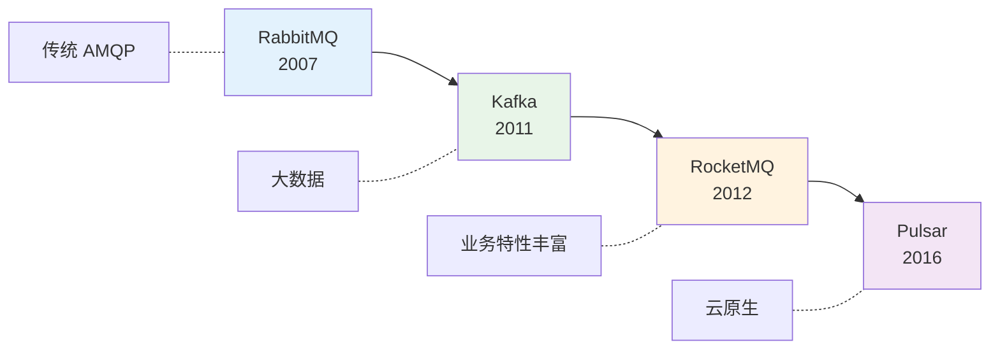

### 3.2 横向对比矩阵

| 维度 | Kafka | RocketMQ | RabbitMQ | Pulsar |
|---|---|---|---|---|
| **吞吐量** | 极高（百万 TPS） | 高（10w TPS） | 中（万 TPS） | 极高 |
| **延迟** | 毫秒 | 毫秒 | 微秒（最低） | 毫秒 |
| **可靠性** | 高 | 高 | 高 | 高 |
| **事务消息** | 有但弱 | ✅ 强 | ❌ | ✅ |
| **延迟消息** | ❌ | ✅ | 插件 | ✅ |
| **消息回溯** | ✅ | ✅ | ❌ | ✅ |
| **顺序消息** | 分区内有序 | 严格有序 | 队列内有序 | 分区内有序 |
| **消息过滤** | ❌ | ✅ Tag/SQL | ✅ | ✅ |
| **多租户** | 弱 | 弱 | 中 | ✅ 强 |
| **学习曲线** | 中 | 中 | 平 | 陡 |
| **社区** | 顶级 | 顶级（中文） | 活跃 | 上升中 |

### 3.3 典型场景对照

| 场景 | 首选 MQ | 原因 |
|---|---|---|
| **日志收集 / 大数据** | Kafka | 高吞吐 + 持久化 |
| **业务消息（订单/支付）** | RocketMQ | 事务消息 + 业务特性 |
| **传统企业 / 复杂路由** | RabbitMQ | AMQP + 丰富路由 |
| **云原生 / 多租户** | Pulsar | 计算存储分离 |
| **任务队列 / 简单异步** | RabbitMQ / Redis Stream | 轻量 |
| **实时计算上游** | Kafka | Flink / Spark 标配 |
| **金融级事务** | RocketMQ | 事务消息能力 |

**实战建议**：
- **不知道选什么 → Kafka**（生态最好）
- **业务消息为主 → RocketMQ**（特性最贴合业务）
- **传统企业 / 小流量 → RabbitMQ**（最简单）

## 04.设计核心原则

### 4.1 不丢消息原则

**端到端不丢消息**需要三方协作：

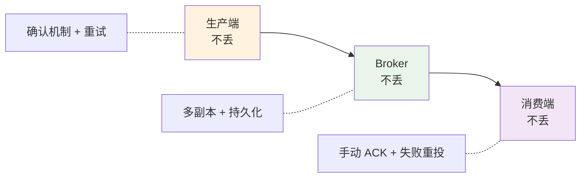

任何一环掉链子，端到端可靠性就破功了。

### 4.2 幂等消费原则

**幂等 = 同一条消息被消费多次，业务结果不变**。

为什么必须幂等？因为**重复消费几乎不可避免**：
- 网络超时但消息其实送达了，生产者重发
- 消费者处理完没来得及 ACK 就重启了
- Broker 故障切主导致消息重发

**实现幂等的 4 种典型模式**：

| 模式 | 思路 | 适用 |
|---|---|---|
| **唯一索引** | 业务 ID 落 DB 唯一索引，重复直接报错 | 简单场景 |
| **状态机** | 业务流转有严格状态，重复操作无效 | 订单 / 支付 |
| **乐观锁** | version 字段，同 version 只生效一次 | 更新场景 |
| **Token / 去重表** | 每条消息有唯一 ID，消费前先查去重表 | 通用 |

### 4.3 顺序保证原则

**有些业务必须按顺序消费**：

| 场景 | 顺序要求 |
|---|---|
| 订单状态变更 | 创建 → 支付 → 发货 → 完成 |
| 银行流水 | 必须按时间序 |
| MySQL binlog 同步 | 必须严格按写入顺序 |

**实现顺序的关键**：**同一业务键的消息进同一队列**。

```kotlin
// 生产端：相同 orderId 投递到同一分区
producer.send(message, partitionKey = orderId)

// 消费端：单线程消费每个分区
consumer.subscribe(partition) { 
    // 单线程处理
}
```

**代价**：吞吐量下降（不能并行），所以**只在必要场景用顺序消息**。

### 4.4 削峰填谷原则

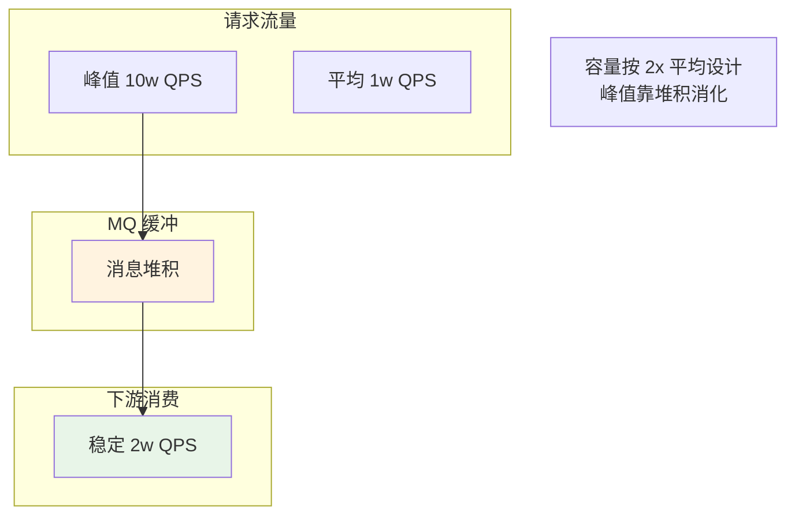

**关键设计**：
- 消费者容量按"平均流量 × 2"配置（不是峰值）
- MQ 容量按"峰值持续时间 × 流量差"配置
- 监控消息堆积，超过阈值告警或自动扩容

## 05.MQ 落地实战

### 5.1 整体架构设计

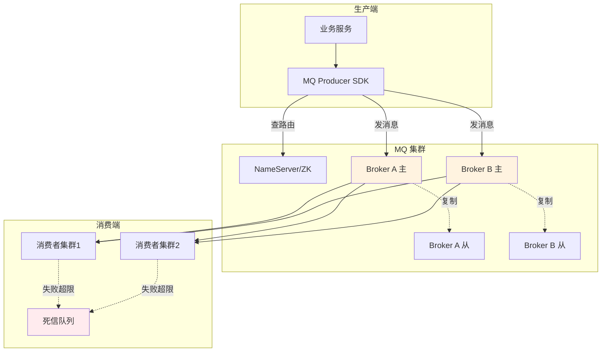

### 5.2 生产端可靠投递

**三个关键动作**：

```kotlin
// 1. 同步发送 + 确认（最可靠）
val result = producer.send(message)
if (result.status != SUCCESS) {
    throw RuntimeException("发送失败")
}

// 2. 异步发送 + 回调（性能好但要处理失败）
producer.sendAsync(message, object : Callback {
    override fun onSuccess(result: SendResult) { /* 记录成功 */ }
    override fun onException(e: Throwable) { 
        // ❗ 必须有失败处理：重试 / 落库 / 告警
    }
})

// 3. 事务消息（金融级一致性）
producer.sendInTransaction(message) {
    // 本地事务
    db.update(...)
}
```

**消息丢失最常见的原因**：异步发送 + 没有失败处理 → 故障时静默丢消息。开篇那个 134 笔退款丢失就是这个原因。

### 5.3 消费端可靠消费

**核心是 ACK 机制**：

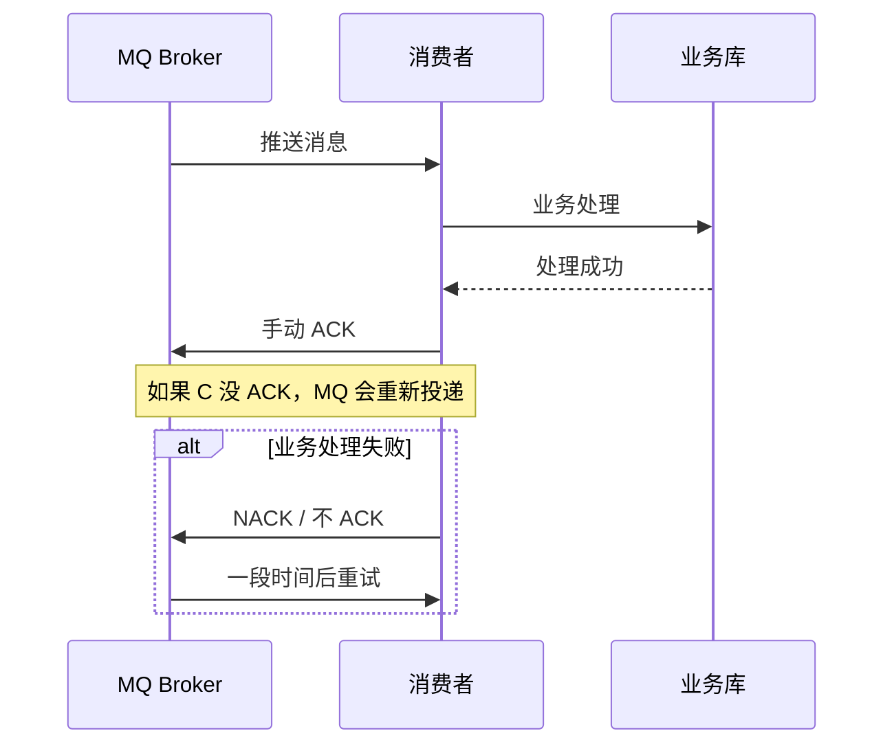

**铁律**：**业务处理成功后才 ACK**——绝不能"先 ACK 后处理"。

### 5.4 死信与重试

**重试策略**：

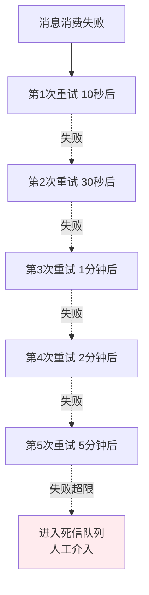

**死信队列（DLQ）的价值**：
- 失败消息不丢（可人工修复）
- 不阻塞正常消费
- 提供告警入口

### 5.5 消息事务方案

**最严苛的场景**：本地数据库操作和消息发送必须**同时成功或同时失败**。

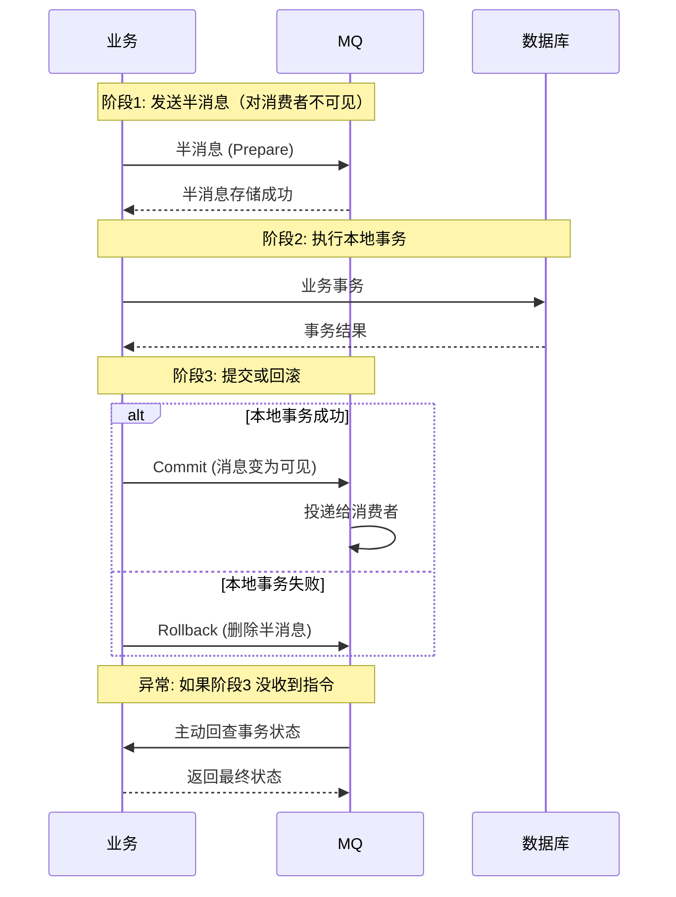

**这就是 RocketMQ 事务消息的核心机制**——通过"半消息 + 回查"保证消息发送和本地事务原子性。

## 06.三大经典问题

### 6.1 消息丢失问题

**全链路可能丢失的 5 个点 + 解决方案**：

| 丢失点 | 原因 | 解决 |
|---|---|---|
| 生产端发送时 | 网络抖动 | 同步发送 + 重试 + 失败兜底 |
| Broker 内存 | 还没刷盘就重启 | 同步刷盘配置 |
| 主从切换时 | 主库消息没同步到从 | 多副本同步复制 |
| 消费端拉取后 | 没处理就 ACK 了 | 业务成功后再 ACK |
| 消费业务异常 | 处理失败但 ACK 了 | try-catch + 失败重投 |

### 6.2 消息重复问题

**重复几乎不可避免**，唯一对策是**消费者保证幂等**。

```kotlin
// 通用幂等模板
@MessageHandler
fun handle(msg: Message): Boolean {
    val msgId = msg.id
    
    // 1. 查去重表
    if (idempotentRepo.exists(msgId)) {
        return true  // 已处理过，直接返回成功
    }
    
    // 2. 业务处理 + 写去重表（一个事务内）
    transaction {
        businessLogic(msg)
        idempotentRepo.save(msgId)
    }
    
    return true
}
```

### 6.3 消息堆积问题

**消费速度跟不上生产速度，消息越堆越多**：

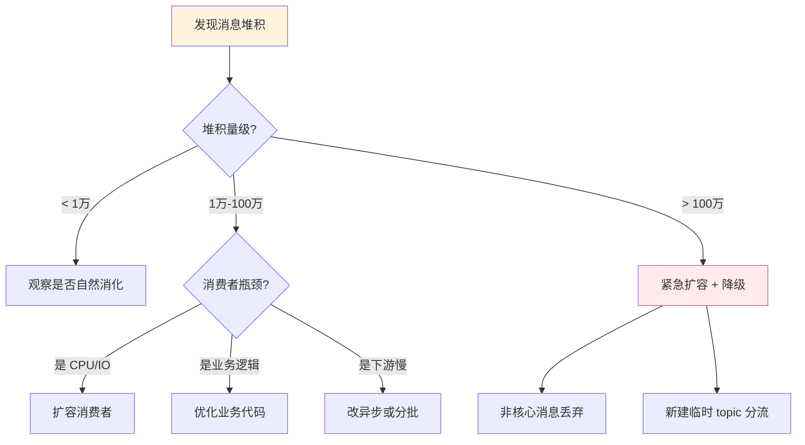

**预防比应对更重要**：
- 监控消费 lag，预警阈值要低
- 消费者集群有自动扩容能力
- 关键 topic 单独限流隔离

## 07.常见陷阱与反例

### 7.1 误用 MQ 反例

**反例**：某团队用 Kafka 做"实时 RPC 调用"——A 发请求消息，等 B 处理完发响应消息回来。

**问题**：
- 延迟比 RPC 高 10 倍
- 实现复杂（要管理 correlation ID）
- 失去了同步调用的简洁性

**教训**：**MQ 适合异步、解耦的场景，不适合替代同步 RPC**。

### 7.2 顺序错位反例

**反例**：订单状态变更发到多个分区，消费时并发处理，结果"已支付"消息比"创建订单"消息先到。

**正确**：**同一 orderId 进同一分区，消费端单线程**。

### 7.3 消息风暴反例

**反例**：用户登录发一条 MQ → 触发积分服务 → 积分变更又发 MQ → 触发等级服务 → 等级变更又发 MQ → ……**一次登录引发 10+ 条消息**。

**问题**：消息风暴时整个系统瘫痪。

**教训**：
- MQ 不是"事件总线滥用器"
- 每条消息都要评估必要性
- 监控 MQ 总流量

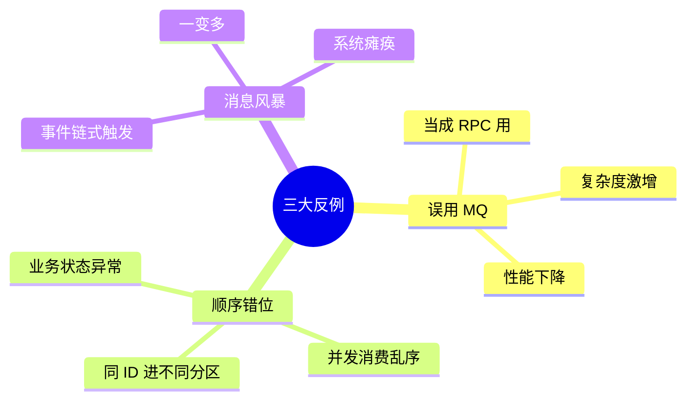

## 08.演进路线

### 8.1 V1 进程内队列

**特征**：单服务、流量小。

**做法**：
- Java BlockingQueue / Disruptor
- 简单的异步任务

**适用阶段**：起步、单体应用

### 8.2 V2 引入 MQ

**特征**：服务拆分、需要解耦。

**做法**：
- 选一个 MQ（推荐 RocketMQ / Kafka）
- 标准的生产消费模式
- 基本的监控和死信队列

**适用阶段**：中型系统

### 8.3 V3 多 MQ 体系

**特征**：大型公司、多业务线、多场景。

**做法**：
- 分场景用不同 MQ（业务用 RocketMQ、日志用 Kafka）
- 统一的 MQ 管理平台
- Topic 治理、容量管控
- 全链路追踪

**适用阶段**：大型互联网公司

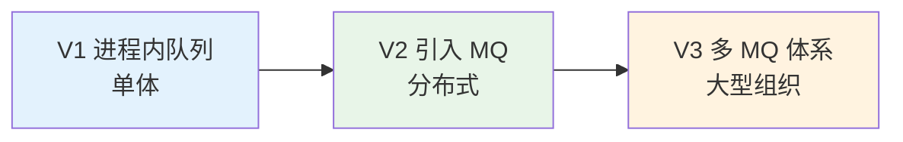

## 09.总结与决策

### 9.1 MQ 上线检查表

新引入 MQ 或新增 Topic 前对照：

- [ ] 已确认场景适合 MQ（异步、解耦、削峰）
- [ ] 选定了 MQ 类型（Kafka / RocketMQ / RabbitMQ）
- [ ] Topic 命名遵循规范（业务域.对象.动作）
- [ ] 生产端有可靠投递机制（同步 / 异步带回调 / 事务）
- [ ] 消费端有幂等设计
- [ ] 顺序消费场景已用同分区策略
- [ ] 失败重试 + 死信队列已配置
- [ ] 监控告警就位（生产失败率、消费延迟、堆积量）
- [ ] 容量评估完成（峰值 × 持续时间）
- [ ] 关键消息有事务消息保护
- [ ] 死信队列有人值守
- [ ] 容灾预案已演练

### 9.2 选型决策树

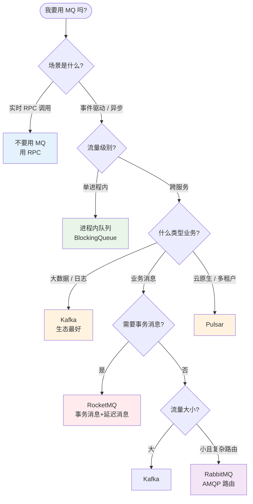

**最后一句话**：MQ 是分布式系统最常用也最容易用错的组件——**它的价值不在 MQ 本身，而在你怎么用**。开篇那 134 笔退款消失，不是 MQ 错了，是用 MQ 的人少做了 5 道防线。

> 好的 MQ 设计 = **生产不丢、消费幂等、顺序可控、堆积可监、事务可保**。
