# 13.RPC框架设计方案

> **本篇定位**：RPC 是微服务架构的"神经系统"——服务间所有调用都走它。RPC 框架决定了系统的性能、稳定性、可观测性。本文从一次因为 RPC 超时配错引发的全链路雪崩讲起，回答三个核心问题——**RPC 解决了什么本质问题？业界几大主流框架怎么选？怎么设计一个生产级的 RPC？**

#### 目录介绍
- [01.一次超时引发的雪崩](#01一次超时引发的雪崩)
  - [1.1 一行配置的代价](#11-一行配置的代价)
  - [1.2 故障扩散链路](#12-故障扩散链路)
  - [1.3 反思 RPC 设计](#13-反思-rpc-设计)
- [02.要解决的核心矛盾](#02要解决的核心矛盾)
  - [2.1 远程调用的复杂](#21-远程调用的复杂)
  - [2.2 性能与易用性](#22-性能与易用性)
  - [2.3 可靠与高效](#23-可靠与高效)
  - [2.4 RPC 的本质](#24-rpc-的本质)
- [03.业界主流方案](#03业界主流方案)
  - [03.1 主流 RPC 框架](#031-主流-rpc-框架)
  - [03.2 横向对比矩阵](#032-横向对比矩阵)
  - [03.3 协议层选择](#033-协议层选择)
- [04.设计核心原则](#04设计核心原则)
  - [04.1 透明调用原则](#041-透明调用原则)
  - [04.2 失败可控原则](#042-失败可控原则)
  - [04.3 可观测原则](#043-可观测原则)
  - [04.4 可演进原则](#044-可演进原则)
- [05.RPC 架构落地](#05rpc-架构落地)
  - [05.1 整体分层架构](#051-整体分层架构)
  - [05.2 序列化选型](#052-序列化选型)
  - [05.3 服务注册发现](#053-服务注册发现)
  - [05.4 负载均衡策略](#054-负载均衡策略)
  - [05.5 容错与降级](#055-容错与降级)
- [06.关键问题解决](#06关键问题解决)
  - [06.1 超时设计问题](#061-超时设计问题)
  - [06.2 重试与幂等](#062-重试与幂等)
  - [06.3 链路追踪](#063-链路追踪)
- [07.常见陷阱与反例](#07常见陷阱与反例)
  - [07.1 超时雪崩反例](#071-超时雪崩反例)
  - [07.2 滥用同步反例](#072-滥用同步反例)
  - [07.3 序列化反例](#073-序列化反例)
- [08.演进路线](#08演进路线)
  - [08.1 V1 直接 HTTP](#081-v1-直接-http)
  - [08.2 V2 引入 RPC](#082-v2-引入-rpc)
  - [08.3 V3 服务网格](#083-v3-服务网格)
- [09.总结与决策](#09总结与决策)
  - [09.1 RPC 上线检查表](#091-rpc-上线检查表)
  - [09.2 选型决策树](#092-选型决策树)


## 01.一次超时引发的雪崩

### 1.1 一行配置的代价

某互联网公司订单系统由 8 个微服务组成。**订单服务 → 商品服务 → 库存服务 → 仓储服务**，调用链 4 层。

某天上午 10:00，仓储服务因为底层 DB 慢查询，**响应时间从平均 50ms 涨到 5 秒**。**10:05**，告警开始：库存服务超时。**10:08**，商品服务大量超时。**10:12**，**整个订单链路雪崩**——首页都打不开。

诡异的是，**仓储服务只占订单的 5% 流量**——一个边缘服务为什么能拖垮全链路？

### 1.2 故障扩散链路

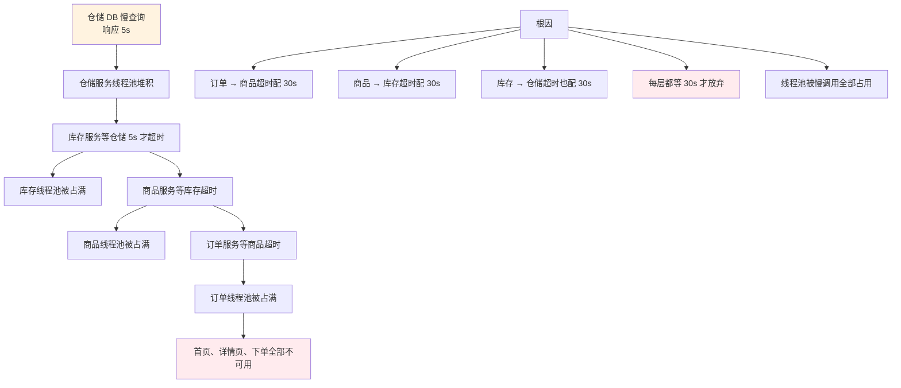

### 1.3 反思 RPC 设计

事后复盘发现 4 个最深刻的教训：

1. **超时是"传染病"**——上游超时必须比下游更短
2. **线程池是有限资源**——慢调用会占满线程池让所有请求挂起
3. **必须有熔断**——下游持续慢/挂时主动断开调用
4. **必须有超时分层**——网关层 3s、业务层 1s、数据层 500ms

> 这次事故的本质：**RPC 把分布式系统的"远程调用"伪装成"本地调用"，但远程调用的失败模式比本地复杂 100 倍**。

## 02.要解决的核心矛盾

### 2.1 远程调用的复杂

本地调用 vs 远程调用的根本差异：

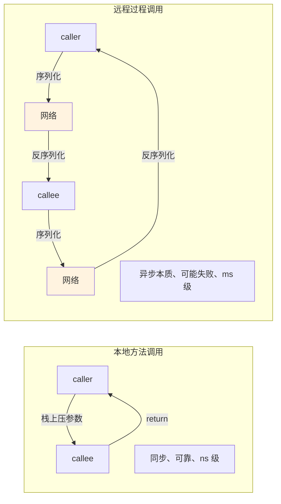

**远程调用相比本地调用多了 6 个变数**：
1. **网络可能丢包**
2. **服务可能挂掉**
3. **数据要序列化**
4. **延迟天差地别**
5. **可能调用错节点**
6. **可能被中间人攻击**

### 2.2 性能与易用性

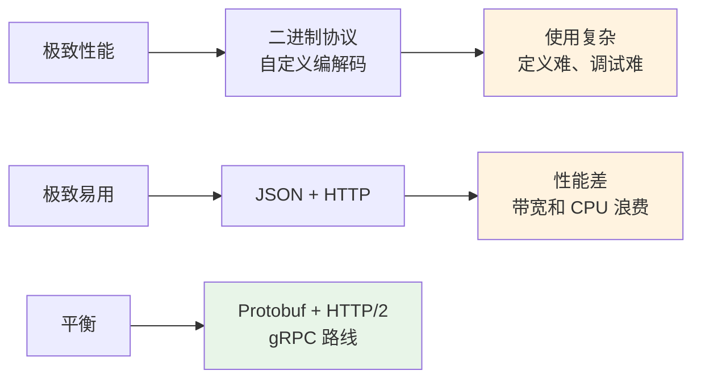

### 2.3 可靠与高效

| 一端 | 另一端 | RPC 取舍 |
|---|---|---|
| 同步等待结果（可靠） | 异步发完即走（高效） | 多数同步 |
| 长超时（不漏） | 短超时（不堵） | 业务定 |
| 重试（不丢） | 不重试（不重） | 接口幂等才重试 |
| 强一致 | 最终一致 | 看业务 |

### 2.4 RPC 的本质

> **RPC = 把"远程过程调用"伪装成"本地方法调用"**

它的核心是**屏蔽分布式细节**：网络协议、序列化、寻址、负载均衡、容错——这些细节业务代码不应该感知。

## 03.业界主流方案

### 03.1 主流 RPC 框架

**Dubbo（阿里 → Apache）**
**国内 Java 系最流行**。完整服务治理（注册发现、负载均衡、限流熔断）。基于自定义 TCP 协议。

**gRPC（Google → CNCF）**
**云原生事实标准**。HTTP/2 + Protobuf。多语言原生支持，Service Mesh 首选。

**Thrift（Facebook → Apache）**
**多语言 RPC 老兵**。自定义协议，IDL 定义清晰。Twitter / Uber 等大量使用。

**bRPC（百度）**
**性能极致**。C++ 实现，纳秒级延迟。百度内部统一 RPC。

**Tars（腾讯 → Apache）**
**大规模微服务治理**。腾讯 10 亿级用户业务底层。

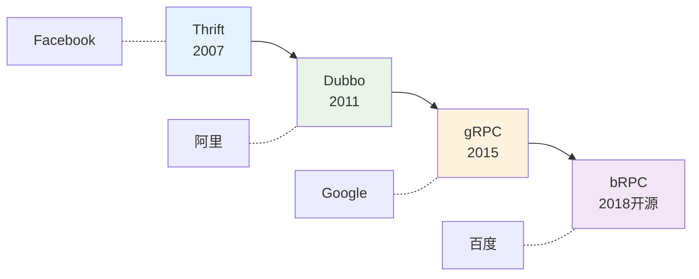

### 03.2 横向对比矩阵

| 维度 | Dubbo | gRPC | Thrift | bRPC |
|---|---|---|---|---|
| **协议** | 自定义 TCP / HTTP | HTTP/2 | 自定义 TCP | 多协议 |
| **序列化** | Hessian / Protobuf | Protobuf | Thrift | 多种 |
| **多语言** | 主 Java（其他较弱） | ✅ 完整 | ✅ 完整 | C++ 主 |
| **服务治理** | 完整 | 一般（依赖网格） | 弱 | 完整 |
| **生态** | 国内强 | 全球强 | 全球中 | 国内 |
| **性能** | 高（10w+ QPS） | 高 | 高 | 极高（百万 QPS） |
| **学习曲线** | 中 | 平（IDL 简单） | 平 | 陡 |
| **典型用户** | 阿里 / 京东 / 国内众多 | Google / 字节 / 云原生 | Facebook / Uber | 百度 |

### 03.3 协议层选择

| 协议 | 性能 | 易用 | 适用 |
|---|---|---|---|
| **HTTP/1 + JSON** | ⭐⭐ | ⭐⭐⭐⭐⭐ | 跨团队 / 公开 API |
| **HTTP/2 + Protobuf (gRPC)** | ⭐⭐⭐⭐ | ⭐⭐⭐⭐ | 多语言微服务 |
| **TCP + Hessian (Dubbo)** | ⭐⭐⭐⭐ | ⭐⭐⭐ | 内部 Java 服务 |
| **TCP + Thrift** | ⭐⭐⭐⭐ | ⭐⭐⭐ | 多语言但要求高性能 |
| **TCP + 自定义二进制** | ⭐⭐⭐⭐⭐ | ⭐⭐ | 极端性能场景 |

## 04.设计核心原则

### 04.1 透明调用原则

**好的 RPC 应该让业务代码感觉不到"远程"**：

```kotlin
// 业务代码看起来像本地调用
@DubboReference
private lateinit var orderService: OrderService

fun handleRequest() {
    val order = orderService.create(req)  // 看起来像本地，实际是远程
}
```

**框架在背后做的事**：
- 找到服务实例（注册中心）
- 选一个实例（负载均衡）
- 序列化请求
- 发送网络包
- 等待响应
- 反序列化结果
- 处理失败（重试 / 熔断 / 降级）

### 04.2 失败可控原则

**远程调用必有失败**，框架必须提供完整的失败应对工具箱：

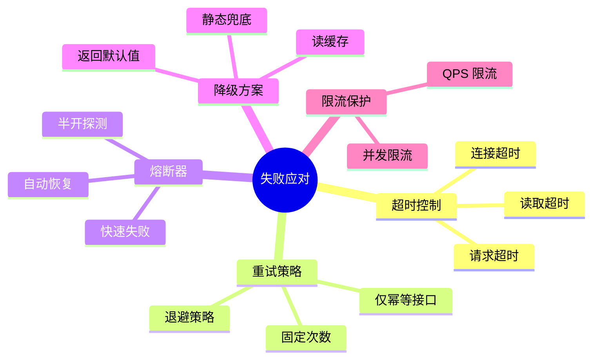

### 04.3 可观测原则

**没有可观测的 RPC 是黑盒**。必备三件套：

| 维度 | 内容 |
|---|---|
| **Metrics** | QPS、RT、错误率、超时率（按方法粒度） |
| **Tracing** | 全链路追踪 ID + 每跳耗时 |
| **Logging** | 关键参数和异常日志 |

### 04.4 可演进原则

接口要能向前兼容：

```protobuf
// V1
message User {
    int64 id = 1;
    string name = 2;
}

// V2 - 新增字段不影响 V1 消费者
message User {
    int64 id = 1;
    string name = 2;
    string email = 3;  // 新增 - 向前兼容
}

// ❌ 反例：删除字段或改变 tag 序号 → 破坏兼容
```

## 05.RPC 架构落地

### 05.1 整体分层架构

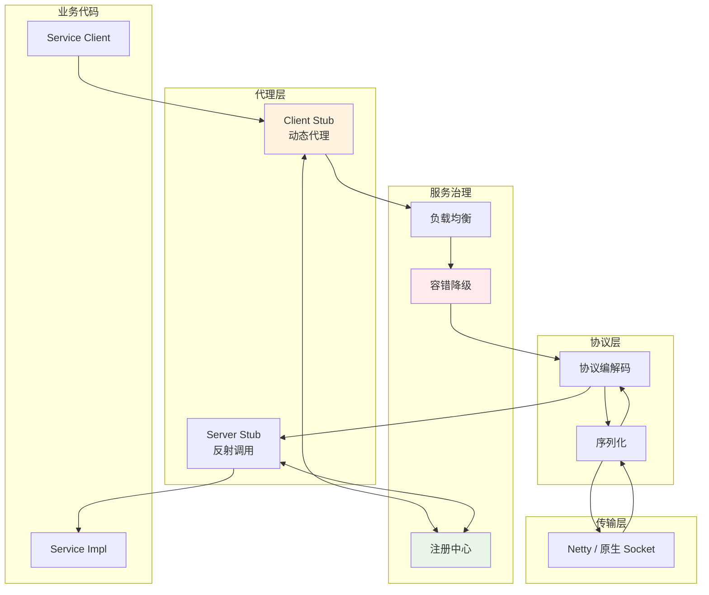

### 05.2 序列化选型

序列化是 RPC 的"性能杀手 / 救星"。

| 序列化 | 类型 | 体积 | 速度 | 跨语言 | 可读性 |
|---|---|---|---|---|---|
| **JSON** | 文本 | 大 | 慢 | ✅ | ✅ |
| **XML** | 文本 | 极大 | 极慢 | ✅ | ✅ |
| **Hessian** | 二进制 | 中 | 快 | ✅ | ❌ |
| **Protobuf** | 二进制 | 极小 | 极快 | ✅ | ❌ |
| **Thrift** | 二进制 | 小 | 快 | ✅ | ❌ |
| **Java 原生** | 二进制 | 大 | 慢 | ❌ | ❌ |
| **Kryo** | 二进制 | 小 | 极快 | ❌ | ❌ |

**实战推荐**：
- **跨语言 / 公开 API → Protobuf**
- **Java 内部高性能 → Kryo**
- **需要可读性 → JSON**
- **绝对不要用 Java 原生序列化**（既慢又有安全漏洞）

### 05.3 服务注册发现

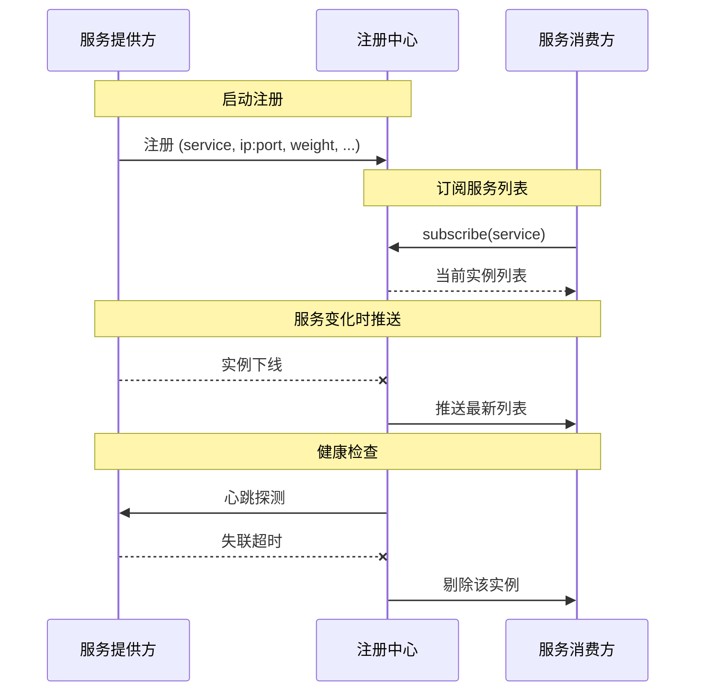

**注册中心选型**：

| 注册中心 | 一致性 | 性能 | 适用 |
|---|---|---|---|
| **Zookeeper** | CP（强一致） | 中 | 传统 Java 系（Dubbo 老搭档） |
| **Nacos** | AP/CP 可选 | 高 | 国内主流 |
| **Eureka** | AP（高可用） | 高 | Spring Cloud 生态（已停更） |
| **etcd** | CP | 中 | 云原生（gRPC + K8s） |
| **Consul** | CP | 中 | HashiCorp 生态 |

**关键认知**：**RPC 注册中心宁可选 AP（高可用）也别选 CP（强一致）**——注册中心挂了不能影响服务调用。

### 05.4 负载均衡策略

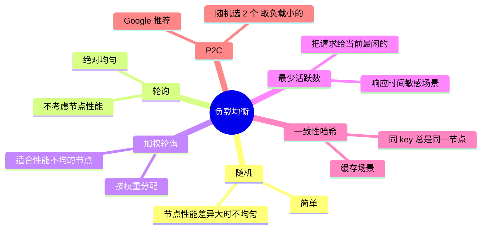

**实战推荐**：
- **默认用最少活跃数**：自适应慢节点
- **缓存路径用一致性哈希**
- **不要用纯随机**（节点性能不均时压垮慢节点）

### 05.5 容错与降级

**Dubbo 经典 6 种容错策略**：

| 策略 | 行为 | 适用 |
|---|---|---|
| **Failover**（默认） | 失败重试其他节点 | 读操作 |
| **Failfast** | 立即失败 | 写操作（不重试避免重复） |
| **Failsafe** | 失败忽略 | 日志、统计 |
| **Failback** | 失败异步重试 | 通知类 |
| **Forking** | 并行调多个，最快返回 | 实时性高 |
| **Broadcast** | 广播调所有 | 缓存清理 |

**熔断器（Hystrix / Sentinel）状态机**：

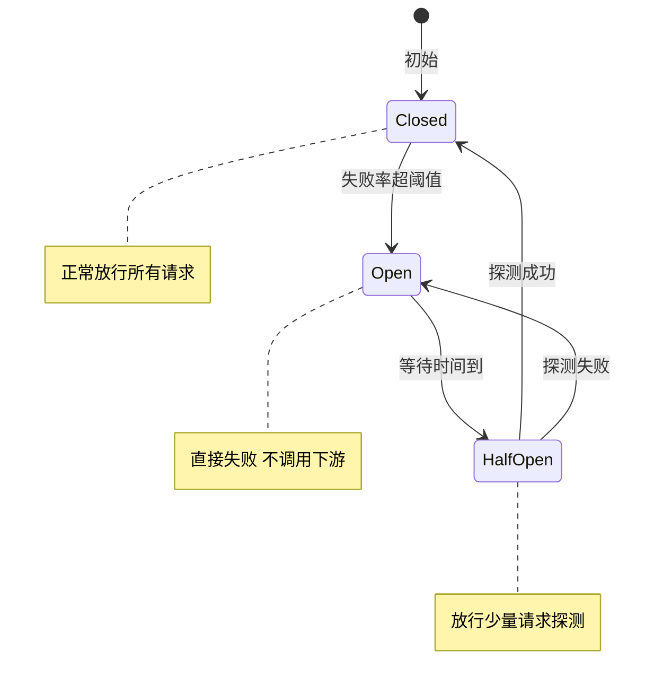

## 06.关键问题解决

### 06.1 超时设计问题

**铁律**：**上游超时必须 > 下游超时**——否则下游还在处理上游已经放弃了，资源浪费。

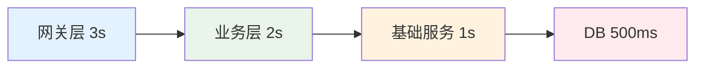

**超时设置原则**：
- **每跳留 buffer**：上游 = 下游 + 200ms（网络 + 处理）
- **写操作短超时**：避免重复写入
- **读操作可适度长**：但也别超过 1-3s
- **超时不能配 30s**——这是开篇雪崩的直接原因

### 06.2 重试与幂等

**重试的危险**：

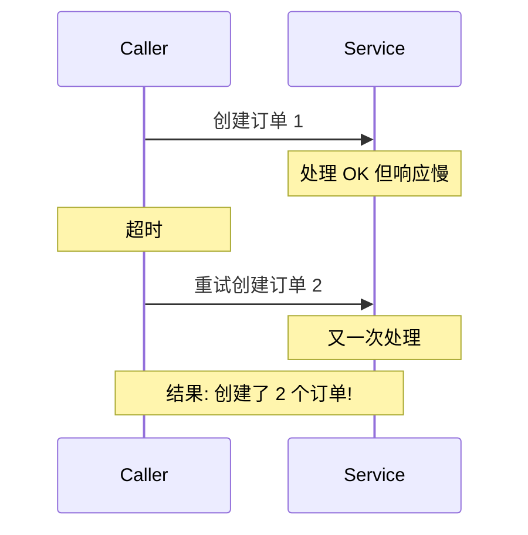

**正确做法**：
- **写操作必须幂等才能重试**（用业务 ID 去重）
- **读操作可以放心重试**
- **超时但服务可能已成功** → 业务层补偿对账

**幂等的常用模式**：

| 模式 | 实现 |
|---|---|
| **唯一索引** | 业务 ID 落 DB 唯一索引 |
| **状态机** | 仅在特定状态下才执行 |
| **乐观锁** | version 字段 |
| **Token** | 调用前先取 Token，调用时带上消费 |

### 06.3 链路追踪

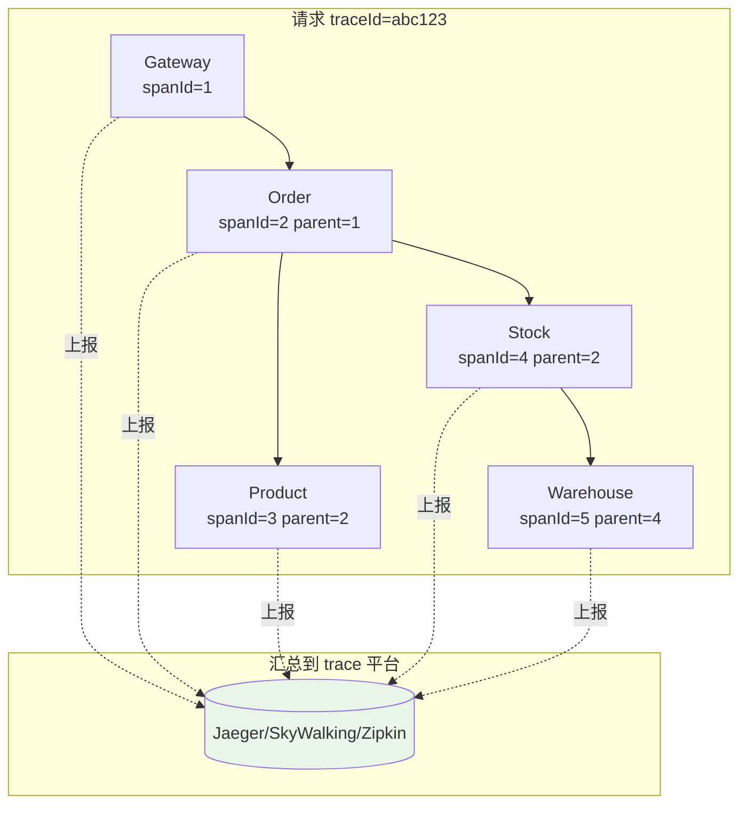

**核心字段**：
- `traceId`：全链路唯一
- `spanId`：每一跳唯一
- `parentSpanId`：父跨度

**业界主流方案**：Jaeger（CNCF）、SkyWalking（中国之光）、Zipkin（Twitter）。

## 07.常见陷阱与反例

### 07.1 超时雪崩反例

**反例**：开篇那个 30s 超时配置。

**教训**：
- 超时不能配的太长
- 必须做超时分层
- 必须有熔断器
- 必须有线程池隔离（不同服务不要共用一个线程池）

### 07.2 滥用同步反例

**反例**：用 RPC 做"批量任务触发"——A 服务调 B 服务跑 1 小时的数据导出，**A 同步等 1 小时**。

**问题**：
- A 的线程被占满
- 中间任意网络抖动整个失败
- 不能取消、不能查进度

**正确**：用 MQ 异步触发，B 处理完发结果消息。**RPC 适合"调用 + 立即返回"，不适合长任务**。

### 07.3 序列化反例

**反例**：内部 RPC 用 JSON 序列化。

**问题**：
- 体积大（字段名重复）
- CPU 消耗高（字符串解析）
- 类型不严格（数字精度丢失）

**正确**：内部 RPC 用 Protobuf / Hessian 等二进制序列化。**JSON 留给跨团队 / 公开 API**。

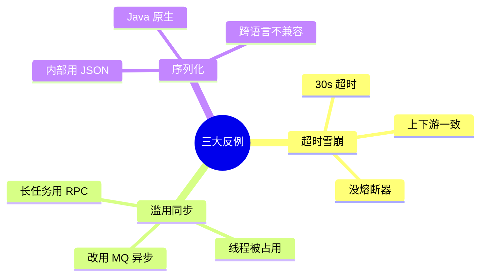

## 08.演进路线

### 08.1 V1 直接 HTTP

**特征**：服务起步、调用关系简单。

**做法**：
- Spring Cloud Feign / OkHttp 直连
- DNS 寻址
- 简单的超时和重试

**适用阶段**：< 10 个服务

### 08.2 V2 引入 RPC

**特征**：服务数量增长、需要服务治理。

**做法**：
- 引入 Dubbo / gRPC
- 注册中心 + 服务发现
- 完整的负载均衡、熔断、限流
- 链路追踪 + 监控

**适用阶段**：10-1000 个服务

### 08.3 V3 服务网格

**特征**：超大规模微服务、多语言混用。

**做法**：
- Istio + Envoy（Service Mesh）
- 把治理能力下沉到 Sidecar
- 业务代码彻底解耦治理逻辑
- 跨语言统一治理

**适用阶段**：> 1000 个服务、多语言团队

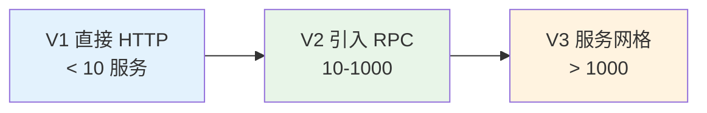

## 09.总结与决策

### 09.1 RPC 上线检查表

新引入 RPC 服务前对照：

- [ ] 框架选型完成（Dubbo/gRPC/Thrift）
- [ ] 序列化方案确定（Protobuf 推荐）
- [ ] 注册中心就绪
- [ ] 接口 IDL 定义清晰且支持向前兼容
- [ ] 超时配置合理（< 3s 大多数情况）
- [ ] 上游超时 > 下游超时（分层设置）
- [ ] 写操作有幂等设计
- [ ] 重试策略明确（仅幂等接口）
- [ ] 熔断器配置（失败率阈值、半开探测）
- [ ] 线程池隔离（关键服务独立）
- [ ] 限流策略（QPS / 并发）
- [ ] 链路追踪接入
- [ ] 监控大盘就绪（QPS、RT、错误率、超时率）
- [ ] 日志记录关键调用
- [ ] 容灾预案（注册中心挂、单服务挂）

### 09.2 选型决策树

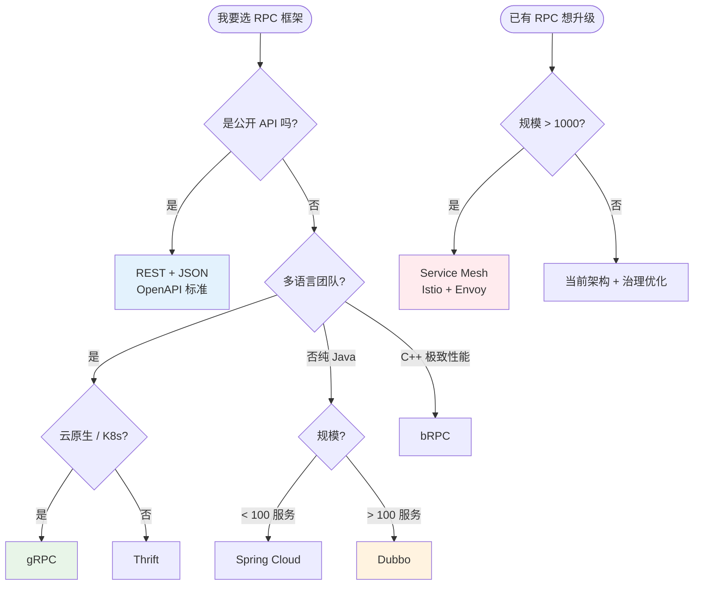

**最后一句话**：RPC 是微服务的"神经系统"——好的 RPC 让你感觉不到它的存在，差的 RPC 让所有服务都为它陪葬。

> 好的 RPC 设计 = **业务无感、失败可控、性能足够、治理完整**。
