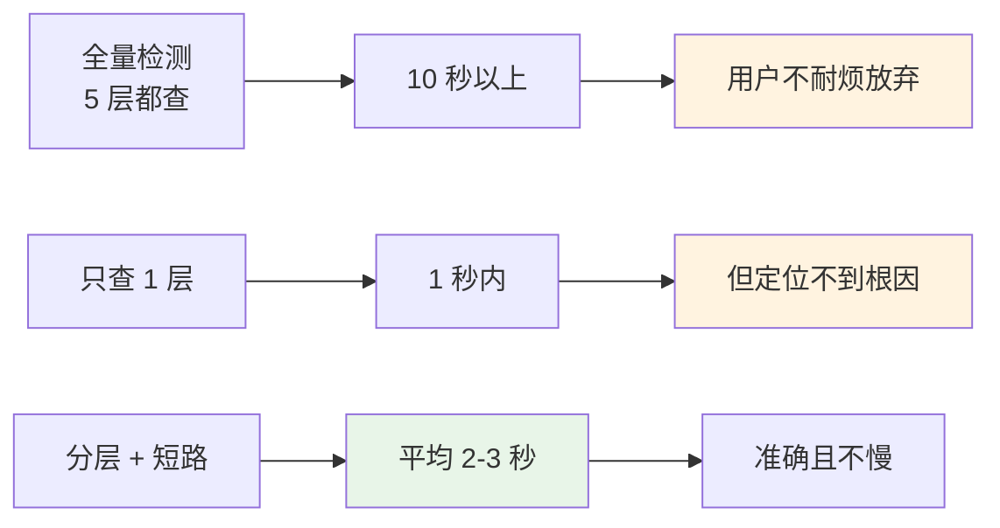
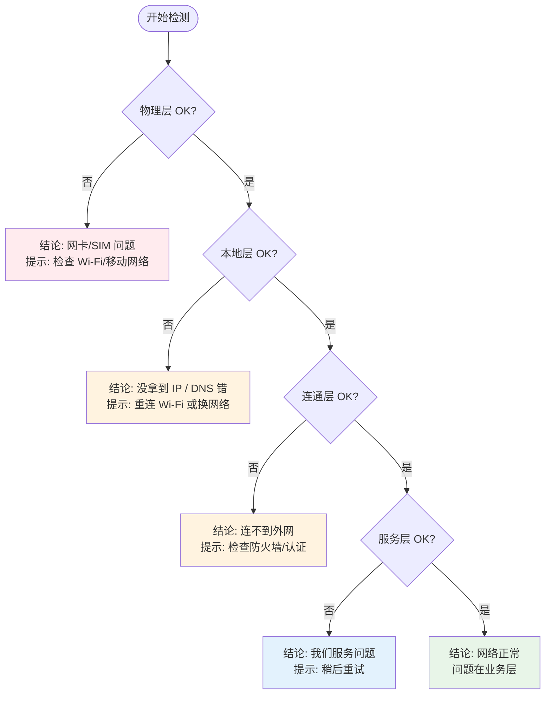
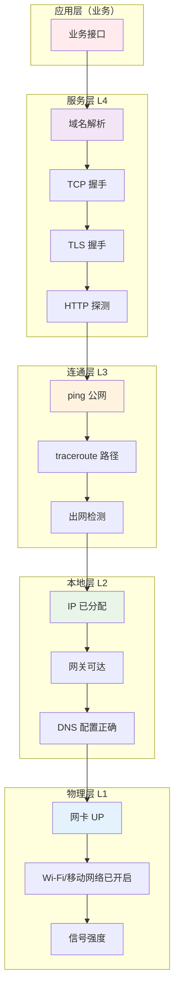
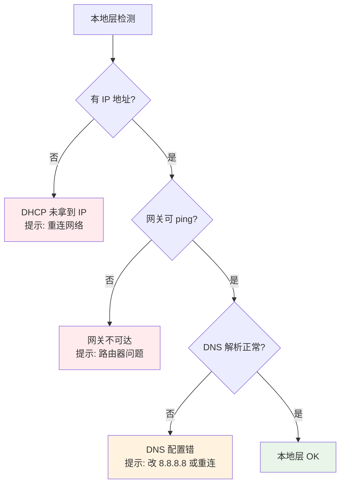
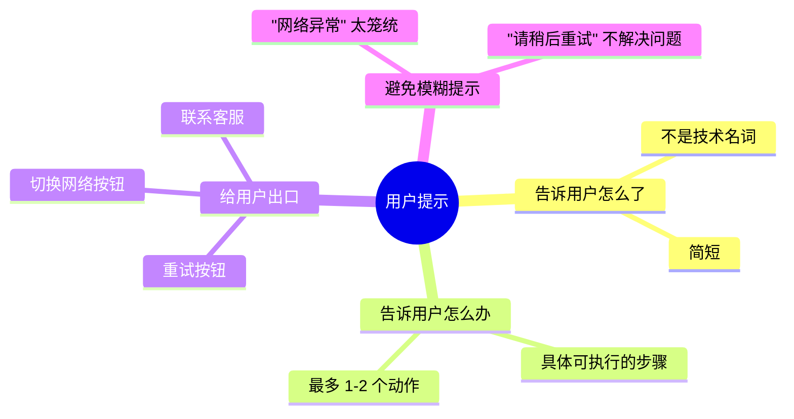
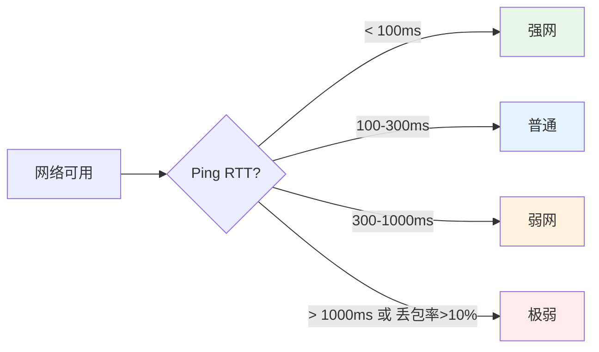
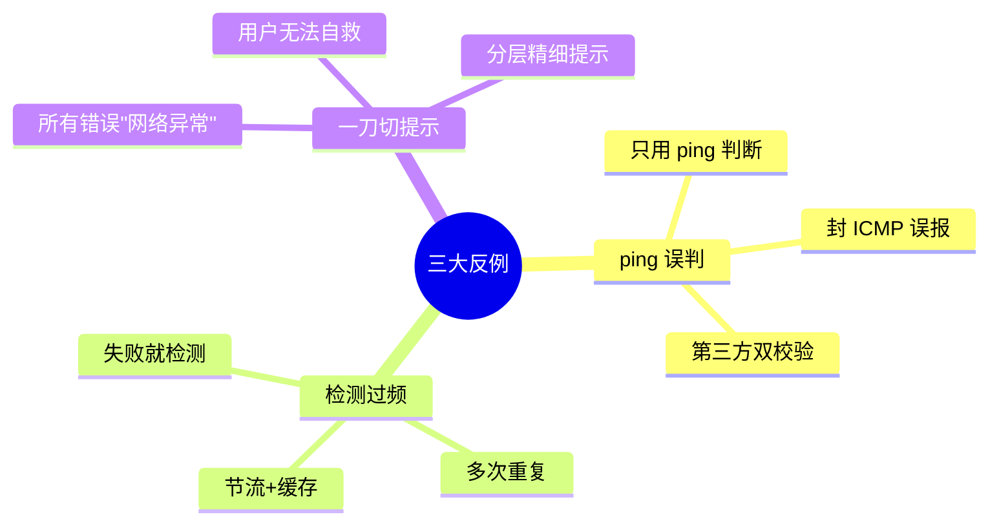
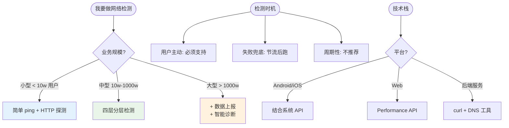

# 16.网络检测方案设计

> **本篇定位**：网络异常是 App 故障投诉的 NO.1 来源——但 80% 的"网络问题"不是真的网络挂了，而是某一层有问题。本文从一个"明明有 Wi-Fi 但 App 不能用"的故事讲起，回答三个核心问题——**网络问题为什么这么难定位？业界四层检测模型怎么设计？怎么帮用户/客服秒级判断问题在哪？**

#### 目录介绍
- [01.明明有网却用不了](#01明明有网却用不了)
  - [1.1 客服的崩溃](#11-客服的崩溃)
  - [1.2 真相是什么](#12-真相是什么)
  - [1.3 反思网络检测](#13-反思网络检测)
- [02.要解决的核心矛盾](#02要解决的核心矛盾)
  - [2.1 网络问题的复杂](#21-网络问题的复杂)
  - [2.2 用户视角的局限](#22-用户视角的局限)
  - [2.3 准确与代价](#23-准确与代价)
  - [2.4 网络检测的本质](#24-网络检测的本质)
- [03.业界主流方案](#03业界主流方案)
  - [03.1 检测能力分类](#031-检测能力分类)
  - [03.2 横向对比矩阵](#032-横向对比矩阵)
  - [03.3 经典工具集](#033-经典工具集)
- [04.设计核心原则](#04设计核心原则)
  - [04.1 分层检测原则](#041-分层检测原则)
  - [04.2 短路返回原则](#042-短路返回原则)
  - [04.3 兜底容错原则](#043-兜底容错原则)
  - [04.4 用户体感原则](#044-用户体感原则)
- [05.四层检测模型](#05四层检测模型)
  - [05.1 整体分层架构](#051-整体分层架构)
  - [05.2 物理层检测](#052-物理层检测)
  - [05.3 本地层检测](#053-本地层检测)
  - [05.4 连通层检测](#054-连通层检测)
  - [05.5 服务层检测](#055-服务层检测)
- [06.关键问题解决](#06关键问题解决)
  - [06.1 错误码设计](#061-错误码设计)
  - [06.2 用户提示设计](#062-用户提示设计)
  - [06.3 弱网识别](#063-弱网识别)
- [07.常见陷阱与反例](#07常见陷阱与反例)
  - [07.1 ping 误判反例](#071-ping-误判反例)
  - [07.2 检测过频反例](#072-检测过频反例)
  - [07.3 一刀切反例](#073-一刀切反例)
- [08.演进路线](#08演进路线)
  - [08.1 V1 简单 ping](#081-v1-简单-ping)
  - [08.2 V2 分层检测](#082-v2-分层检测)
  - [08.3 V3 智能诊断](#083-v3-智能诊断)
- [09.总结与决策](#09总结与决策)
  - [09.1 上线检查表](#091-上线检查表)
  - [09.2 选型决策树](#092-选型决策树)


## 01.明明有网却用不了

### 1.1 客服的崩溃

某 App 客服每天处理大量"无法登录 / 无法刷新"的投诉，**80% 都长这样**：

| 用户描述 | 实际原因（事后查到） |
|---|---|
| "App 用不了，肯定是 App 的问题" | 用户连了酒店 Wi-Fi 没认证 |
| "我有 4G 但 App 没反应" | 公司 Wi-Fi 限制了出网端口 |
| "其他 App 都行就你们家不行" | DNS 污染，特定域名解析不到 |
| "我连了 Wi-Fi 啊" | Wi-Fi 没拿到 IP（已连接但无效） |
| "刚才还能用现在不行了" | 移动网络在弱信号区切换 |

客服一遍遍问"打开手机设置 → 看一下 IP → 试试 ping...."，**用户根本听不懂**，最后只能让用户卸载重装。

### 1.2 真相是什么

```mermaid
flowchart TD
    User["用户感知:<br/>App 不能用"] --> Many{真正的原因}
    
    Many --> P1[物理层: 没开 Wi-Fi / 没 SIM]
    Many --> P2[本地层: 没拿到 IP / DNS 错]
    Many --> P3[连通层: 连不到外网 / 防火墙]
    Many --> P4[服务层: 我们服务挂了]
    Many --> P5[业务层: 接口超时 / 错误]
    
    Show[App 表现] --> S[全都是同一个"加载失败"提示]
    
    style User fill:#fff3e0
    style Show fill:#ffebee
```

**问题的核心**：**App 把所有网络问题都报"加载失败"**——既不告诉用户该怎么办，也不告诉客服问题在哪。

### 1.3 反思网络检测

事后这个团队总结了三个最深刻的认知：

1. **网络问题不能笼统判断**——必须分层定位
2. **检测要从底向上**——物理层挂了去检测服务层是浪费
3. **结果要"用户语言"**——不能让用户看 IP 看 ping 值

> 好的网络检测 = **让客服秒级定位 + 让用户知道下一步该做什么**。

## 02.要解决的核心矛盾

### 2.1 网络问题的复杂

一次正常的 HTTP 请求要经过 **5 层 + 7 个环节**：

```mermaid
graph TB
    A[1. 物理层: 网卡/Wi-Fi/4G] --> B[2. 链路层: ARP/DHCP]
    B --> C[3. 网络层: IP/路由]
    C --> D[4. DNS 层: 域名解析]
    D --> E[5. 传输层: TCP 握手]
    E --> F[6. TLS 层: SSL 握手]
    F --> G[7. 应用层: HTTP 业务]
    
    Issue[任何一环挂了都算"网络问题"]
    
    style A fill:#e3f2fd
    style D fill:#fff3e0
    style F fill:#ffebee
```

### 2.2 用户视角的局限

| 用户能看到 | 用户看不到 |
|---|---|
| Wi-Fi 图标亮不亮 | DHCP 是否拿到了 IP |
| 4G 信号格数 | DNS 是否能解析 |
| App 加载转圈 | TCP 是否能握手 |
| 网页是否能打开 | TLS 证书是否过期 |

**所以**：**用户给客服的描述大都不准确**——必须靠工具检测拿到真相。

### 2.3 准确与代价



### 2.4 网络检测的本质

> **网络检测 = 用最低代价定位"问题在第几层"**

它不是修复网络，是**确定问题边界**——告诉用户/客服"是手机问题"还是"我们服务问题"。

## 03.业界主流方案

### 03.1 检测能力分类

| 检测类型 | 检测内容 | 典型工具 |
|---|---|---|
| **物理层** | 网卡 / Wi-Fi / 4G 信号 | `ip link` / 系统 API |
| **本地层** | IP / 网关 / DNS 配置 | `ifconfig` / `nslookup` |
| **连通层** | 能否到达外网 | `ping` / `traceroute` |
| **服务层** | 业务域名解析、TCP / TLS / HTTP | `curl` / `dig` / 自研 |
| **质量层** | 延迟 / 丢包 / 抖动 / 带宽 | `mtr` / `iperf` |

### 03.2 横向对比矩阵

| 维度 | 简单 ping | 系统自带诊断 | 业界专业方案 |
|---|---|---|---|
| **检测层数** | 1（连通） | 2-3 | 4-5 |
| **结果可读** | 给程序员看 | 给程序员看 | 给用户/客服看 |
| **耗时** | 1-3s | 5-10s | 2-5s（短路） |
| **准确性** | 低 | 中 | 高 |
| **代价** | 极低 | 低 | 中 |
| **典型代表** | 个人开发者 | 路由器自带 | 微信 mars / 钉钉 / 自研 |

### 03.3 经典工具集

**底层网络诊断五件套**：

| 工具 | 用途 |
|---|---|
| **ping** | 测试 ICMP 连通性和延迟 |
| **traceroute / tracert** | 查看路径上每一跳 |
| **nslookup / dig** | DNS 解析测试 |
| **curl -v** | HTTP/HTTPS 完整链路（含 TLS） |
| **mtr** | ping + traceroute 综合 |

**App 层网络监控库**：

| 库 | 平台 | 特点 |
|---|---|---|
| **微信 mars** | 跨端 | 长连接 + 网络诊断 |
| **OkHttp EventListener** | Android | 全链路埋点 |
| **NSURLSession Metrics** | iOS | 系统级耗时统计 |
| **Performance Timing API** | Web | 浏览器原生 |

## 04.设计核心原则

### 04.1 分层检测原则

**铁律**：**从下往上检测**——物理层都没了，去检测应用层是浪费。



### 04.2 短路返回原则

**任何一层失败立即返回**——下面的层不再检测。

**收益**：
- 平均检测耗时大幅缩短
- 给用户的结论更精确（"问题在第 X 层"）
- 减少无意义请求

### 04.3 兜底容错原则

**检测自身不能崩**——检测代码挂了用户彻底不知道发生了什么。

```kotlin
suspend fun detectNetwork(): NetworkResult {
    return try {
        val physicalOk = withTimeout(1000) { detectPhysical() }
        if (!physicalOk) return NetworkResult.PHYSICAL_FAIL
        
        // ... 后续层级
        
        NetworkResult.OK
    } catch (e: TimeoutCancellationException) {
        NetworkResult.TIMEOUT  // 超时也是结论
    } catch (e: Throwable) {
        NetworkResult.UNKNOWN  // 兜底
    }
}
```

### 04.4 用户体感原则

**结论必须用"用户语言"**：

| ❌ 程序员语言 | ✅ 用户语言 |
|---|---|
| "ICMP 不可达" | "无法连接到网络，请检查 Wi-Fi" |
| "DNS 解析超时" | "网络异常，可以尝试切换 Wi-Fi 或移动网络" |
| "TLS 握手失败" | "时间不正确导致连接失败，请检查手机时间" |
| "HTTP 502" | "服务器繁忙，稍后重试" |

## 05.四层检测模型

### 05.1 整体分层架构



### 05.2 物理层检测

**检测内容**：网卡是否开启、Wi-Fi 是否连接、移动网络是否可用。

```kotlin
fun detectPhysical(): Boolean {
    val cm = getSystemService<ConnectivityManager>()
    val activeNetwork = cm?.activeNetwork ?: return false
    val capabilities = cm.getNetworkCapabilities(activeNetwork) ?: return false
    
    return capabilities.hasCapability(NET_CAPABILITY_INTERNET) &&
           capabilities.hasCapability(NET_CAPABILITY_VALIDATED)
}
```

**典型问题**：
- Wi-Fi 已连接但 `VALIDATED` 为 false → 还没认证（如酒店 Wi-Fi）
- 飞行模式打开
- 移动数据被关掉了

### 05.3 本地层检测

**检测内容**：IP / 网关 / DNS 是否正常。



**关键检测点**：

| 项 | 检测方法 |
|---|---|
| **是否有 IP** | 系统 API 或 `ifconfig` |
| **网关可达** | ping 网关地址 |
| **DNS 解析** | 解析一个公认的域名（如 baidu.com） |

### 05.4 连通层检测

**检测内容**：是否能到达外网。

```kotlin
suspend fun detectConnectivity(): Boolean {
    val targets = listOf(
        "www.baidu.com",      // 国内可达性
        "www.qq.com",          // 备选
        "8.8.8.8"              // 谷歌公共 DNS（境外参考）
    )
    
    return targets.any { ping(it, timeout = 1000) }
}
```

**关键设计**：
- **多目标试**——单个目标不可达不代表网络不通
- **不同地理位置**——境内外各试一个
- **混合协议**——ping + HTTP 双校验（部分网络封 ICMP）

### 05.5 服务层检测

**检测内容**：我们的业务服务是否可达。

**完整请求耗时分解**：

```mermaid
gantt
    title HTTPS 请求耗时分解
    dateFormat X
    axisFormat %s
    
    DNS 解析    :a, 0, 50
    TCP 握手    :b, 50, 100
    TLS 握手    :c, 150, 200
    Server 处理 :d, 350, 100
    数据传输    :e, 450, 50
```



**典型实现**：

```kotlin
suspend fun detectService(domain: String): ServiceResult {
    val dnsTime = measure { resolveDns(domain) }
    if (dnsTime < 0) return ServiceResult.DNS_FAIL
    
    val tcpTime = measure { tcpConnect(domain, 443) }
    if (tcpTime < 0) return ServiceResult.TCP_FAIL
    
    val tlsTime = measure { tlsHandshake(domain) }
    if (tlsTime < 0) return ServiceResult.TLS_FAIL
    
    val httpTime = measure { httpProbe("https://$domain/api/health") }
    if (httpTime < 0) return ServiceResult.HTTP_FAIL
    
    return ServiceResult.OK(
        dnsTime, tcpTime, tlsTime, httpTime
    )
}
```

**结果价值**：
- 单独看每段耗时**精确定位瓶颈**
- DNS 慢 → DNS 服务器问题
- TCP 慢 → 中间网络问题
- TLS 慢 → 证书问题或中间人
- HTTP 慢 → 我们服务问题

## 06.关键问题解决

### 06.1 错误码设计

**好的错误码 = 一眼能看出在哪一层**：

```kotlin
enum class NetErrorCode(val code: Int, val msg: String) {
    // 物理层 1xxx
    NO_NETWORK(1001, "网络未连接"),
    AIRPLANE_MODE(1002, "飞行模式开启"),
    NO_SIM(1003, "无 SIM 卡"),
    
    // 本地层 2xxx
    NO_IP(2001, "未分配 IP"),
    GATEWAY_UNREACHABLE(2002, "网关不可达"),
    DNS_ERROR(2003, "DNS 解析失败"),
    PORTAL_REQUIRED(2004, "需要 Wi-Fi 认证"),  // 酒店等
    
    // 连通层 3xxx
    PUBLIC_NET_FAIL(3001, "无法连接公网"),
    FIREWALL_BLOCK(3002, "防火墙限制"),
    
    // 服务层 4xxx
    DOMAIN_DNS_FAIL(4001, "我们服务域名解析失败"),
    SERVICE_TCP_FAIL(4002, "无法连接到我们服务"),
    SERVICE_TLS_FAIL(4003, "证书校验失败"),
    SERVICE_500(4004, "服务器内部错误"),
    
    // 业务层 5xxx
    AUTH_FAIL(5001, "鉴权失败"),
    DATA_INVALID(5002, "数据异常"),
}
```

**收益**：
- 客服一看错误码就知道问题层级
- 监控可以按层级聚合统计
- 用户可以根据提示自助解决

### 06.2 用户提示设计



**好提示 vs 坏提示**：

| ❌ 坏提示 | ✅ 好提示 |
|---|---|
| "网络异常" | "Wi-Fi 没连上，[切换到移动网络] 或 [重连 Wi-Fi]" |
| "请稍后重试" | "服务繁忙，正在重试 (3s)" + 取消按钮 |
| "Error 503" | "服务暂时不可用，[查看公告]" |

### 06.3 弱网识别

**弱网不是"没网"**，而是"信号弱、延迟高、丢包多"。



**弱网下的应对**：
- 启用更激进的重试
- 减小请求体（图片用更低清版本）
- 切换备用接入点
- 用户提示"网络较慢，正在加载中..."

## 07.常见陷阱与反例

### 07.1 ping 误判反例

**反例**：单纯用 `ping baidu.com` 判断网络是否通。

**问题**：
- 部分网络封 ICMP，ping 不通但 HTTP 能通
- ping 通不代表 HTTPS 能通（防火墙可能只放 80 不放 443）
- ping 自家域名挂了，不代表用户不能用其他 App

**正确**：**ping 第三方公认域名 + HTTP 探测**双校验。

### 07.2 检测过频反例

**反例**：每次接口失败都跑一遍完整 5 层检测。

**问题**：
- 1 次检测 3 秒，5 次接口失败 = 15 秒检测 = 用户疯狂等待
- 检测期间又会发起更多请求 → 又触发更多检测 → 雪球

**正确**：
- **节流**：5 分钟内只跑一次完整检测
- **缓存结果**：检测结果缓存几分钟
- **按需检测**：只在用户主动点"检测网络"时跑

### 07.3 一刀切反例

**反例**：所有错误都报 "网络异常，请稍后重试"。

**问题**：
- 用户连 Wi-Fi 没认证 → 永远等不到
- DNS 污染 → 重试 100 次也没用
- 我们服务挂了 → 用户以为是自己的问题

**正确**：**精细化的分层错误码 + 针对性提示**。



## 08.演进路线

### 08.1 V1 简单 ping

**特征**：业务起步、无专门网络监控。

**做法**：
- 出错时调用 ping
- 简单二分（"网络通/不通"）

**痛点**：定位不准，用户体验差。

### 08.2 V2 分层检测

**特征**：用户量大、客服压力高。

**做法**：
- 实现物理 / 本地 / 连通 / 服务四层检测
- 短路返回
- 分层错误码 + 用户提示
- 客服后台展示用户检测结果

**适用阶段**：中大型 App

### 08.3 V3 智能诊断

**特征**：超大用户量、需要自动化诊断。

**做法**：
- 网络埋点全链路（DNS / TCP / TLS / HTTP）
- 大数据聚合分析（看是不是某地区/某运营商问题）
- 自动诊断 → 自动建议
- 主动推送（如 "您所在地区某运营商不稳定"）

**适用阶段**：超大型 App / 全球用户


## 09.总结与决策

### 09.1 上线检查表

实施网络检测前对照：

- [ ] 四层检测能力齐备（物理/本地/连通/服务）
- [ ] 短路返回逻辑实现
- [ ] 检测耗时控制在 5 秒内
- [ ] 检测有节流（5 分钟内不重复）
- [ ] 错误码分层设计（1xxx-5xxx）
- [ ] 用户提示用"用户语言"
- [ ] 提示有可执行的下一步动作
- [ ] 弱网识别能力
- [ ] 检测自身有兜底（不能崩）
- [ ] 客服后台可查看用户检测结果
- [ ] 数据上报（按地区/运营商聚合）
- [ ] 主动诊断告警（区域性故障）

### 09.2 选型决策树



**最后一句话**：网络检测是 App 体验的"X 光机"——它的价值不在炫技，而在**让用户和客服都能在 30 秒内知道问题在哪**。开篇那个客服天天处理的"App 不能用"，80% 都不是 App 的锅。

> 好的网络检测 = **分层精确、短路高效、提示人性、行动明确**。
