# 18.分布式锁方案设计

> **本篇定位**：分布式锁是分布式系统的"互斥保险丝"——多节点要协调访问共享资源时离不开它。本文从一次"超卖 1200 件"的秒杀事故讲起，回答三个核心问题——**为什么需要分布式锁？业界三大方案怎么选？怎么避开分布式锁的"九大坑"？**

#### 目录介绍
- [01.超卖 1200 件](#01超卖-1200-件)
  - [1.1 秒杀的灾难](#11-秒杀的灾难)
  - [1.2 故障扩散链路](#12-故障扩散链路)
  - [1.3 反思分布式锁](#13-反思分布式锁)
- [02.要解决的核心矛盾](#02要解决的核心矛盾)
  - [2.1 单机锁失效](#21-单机锁失效)
  - [2.2 性能与正确](#22-性能与正确)
  - [2.3 可用与一致](#23-可用与一致)
  - [2.4 分布式锁的本质](#24-分布式锁的本质)
- [03.业界主流方案](#03业界主流方案)
  - [03.1 三大主流方案](#031-三大主流方案)
  - [03.2 横向对比矩阵](#032-横向对比矩阵)
  - [03.3 Redlock 争议](#033-redlock-争议)
- [04.设计核心原则](#04设计核心原则)
  - [04.1 互斥性原则](#041-互斥性原则)
  - [04.2 防死锁原则](#042-防死锁原则)
  - [04.3 锁主对应原则](#043-锁主对应原则)
  - [04.4 可重入原则](#044-可重入原则)
- [05.方案落地实战](#05方案落地实战)
  - [05.1 整体架构](#051-整体架构)
  - [05.2 Redis 分布式锁](#052-redis-分布式锁)
  - [05.3 Zookeeper 锁](#053-zookeeper-锁)
  - [05.4 etcd 锁](#054-etcd-锁)
  - [05.5 Redisson 实战](#055-redisson-实战)
- [06.关键问题解决](#06关键问题解决)
  - [06.1 锁超时问题](#061-锁超时问题)
  - [06.2 锁续期问题](#062-锁续期问题)
  - [06.3 锁粒度问题](#063-锁粒度问题)
- [07.常见陷阱与反例](#07常见陷阱与反例)
  - [07.1 误删别人锁](#071-误删别人锁)
  - [07.2 锁未释放](#072-锁未释放)
  - [07.3 滥用分布式锁](#073-滥用分布式锁)
- [08.演进路线](#08演进路线)
  - [08.1 V1 数据库锁](#081-v1-数据库锁)
  - [08.2 V2 Redis 锁](#082-v2-redis-锁)
  - [08.3 V3 高可用锁集群](#083-v3-高可用锁集群)
- [09.总结与决策](#09总结与决策)
  - [09.1 上线检查表](#091-上线检查表)
  - [09.2 选型决策树](#092-选型决策树)


## 01.超卖 1200 件

### 1.1 秒杀的灾难

某商城做"iPhone 抢购"，库存 1000 台，**结果卖出去 2200 台**——超卖 1200 台，单台亏 4000 元，**直接损失 480 万元**。

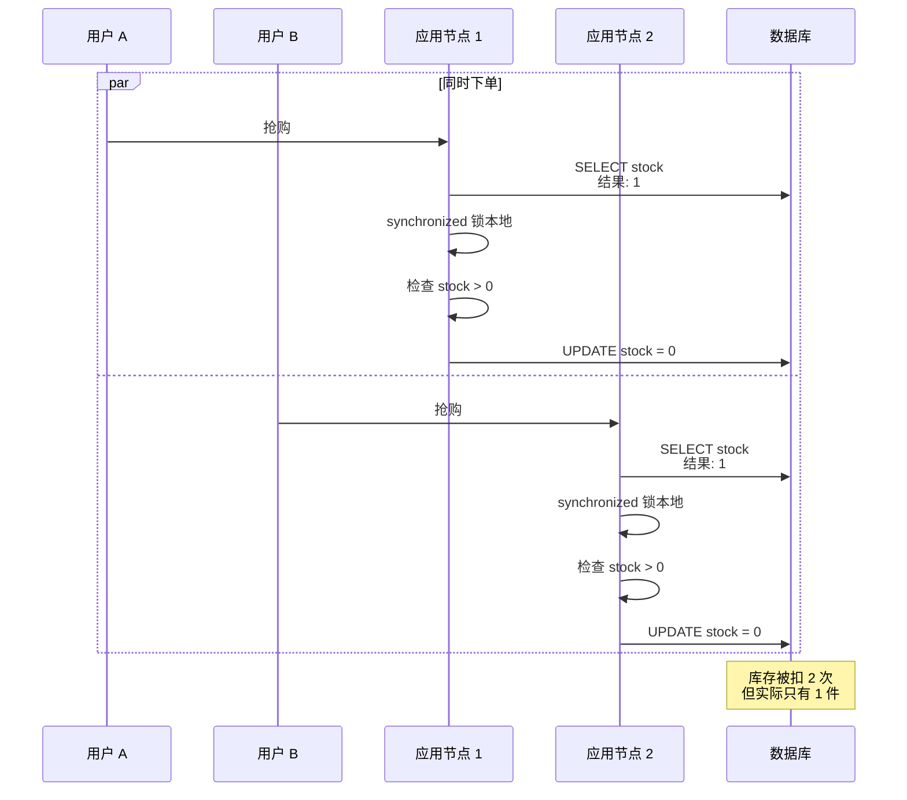

**根因**：开发用了 `synchronized` 做并发控制——**单机内有效，但集群部署后每个节点各自有自己的锁**，根本不互斥。

### 1.2 故障扩散链路

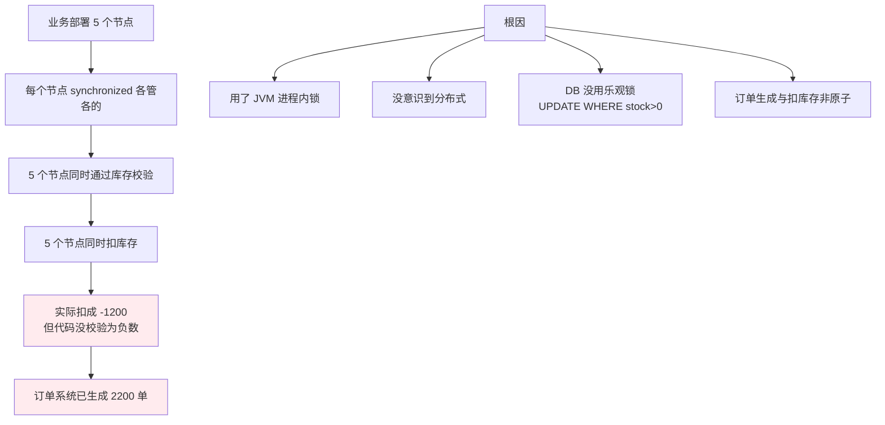

### 1.3 反思分布式锁

事后这个团队总结了三个最深刻的教训：

1. **JVM 锁（synchronized / ReentrantLock）只在单进程内有效**
2. **多节点部署一定要用分布式锁**——这是底线
3. **业务正确性"第二道防线"很重要**——库存扣减用 `UPDATE stock = stock - 1 WHERE stock > 0`，DB 也守一道

> 分布式锁的价值就是**把"多机"变回"单机"**——让 N 个节点像 1 个节点一样竞争资源。

## 02.要解决的核心矛盾

### 2.1 单机锁失效

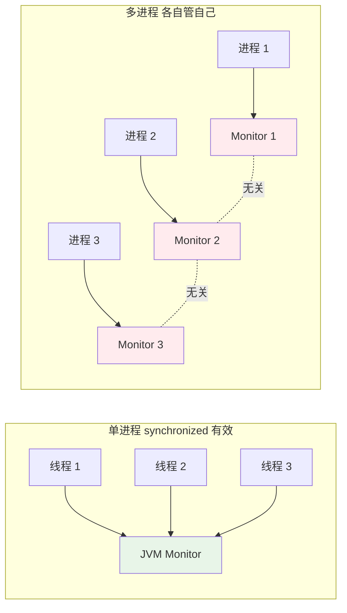

**核心**：分布式锁要把锁状态**放在所有进程都能访问的"第三方"**——Redis、Zookeeper、etcd、DB 都行。

### 2.2 性能与正确

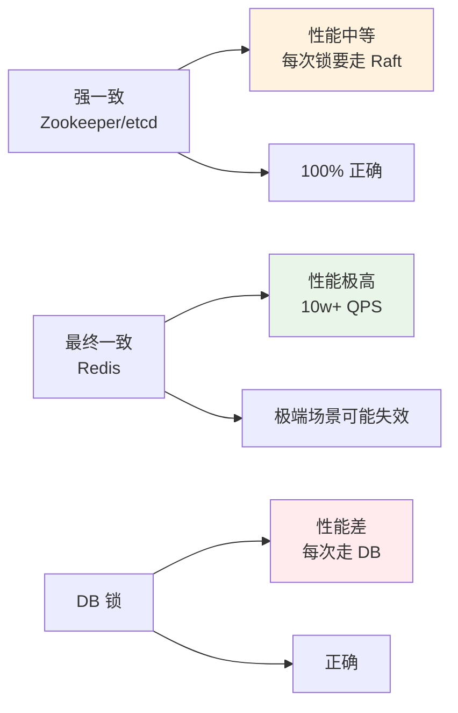

### 2.3 可用与一致

**CAP 取舍**：

| 锁实现 | 倾向 | 取舍 |
|---|---|---|
| **Redis 单节点** | AP | 高性能，挂了能重启 |
| **Redis 哨兵** | AP | 主备切换瞬间可能丢锁 |
| **Redlock** | 试图 CP | 实际仍是 AP，争议大 |
| **Zookeeper** | CP | 强一致，性能略低 |
| **etcd** | CP | Raft 共识，云原生标配 |

**实战经验**：
- **大多数业务（防误操作、降低重复率）→ Redis 够用**
- **金融、库存等绝不能错 → Zookeeper / etcd**
- **业务上还要有"二道防线"**（DB 唯一约束、状态机）

### 2.4 分布式锁的本质

> **分布式锁 = 一个所有节点都看得到的"标记位"**

它的核心追求是 **互斥**：同一时刻最多一个节点持有锁。

但它**不是"绝对正确"的银弹**——所以分布式锁要和业务幂等设计配合，不要把"系统正确性"完全押在锁上。

## 03.业界主流方案

### 03.1 三大主流方案

**Redis（最流行）**
SETNX + 过期时间，单条命令搞定。配合 Redisson 等框架成熟。**互联网公司 80% 选这个**。

**Zookeeper（最严谨）**
临时顺序节点 + Watch 机制。**金融系统首选**。

**etcd（云原生标配）**
基于 Raft 的强一致 KV，**K8s 生态默认**。

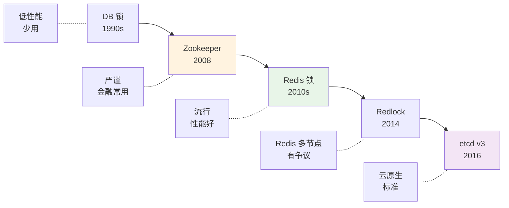

### 03.2 横向对比矩阵

| 维度 | Redis | Zookeeper | etcd | DB |
|---|---|---|---|---|
| **一致性** | AP | CP | CP | CP |
| **性能** | ⭐⭐⭐⭐⭐ | ⭐⭐⭐ | ⭐⭐⭐⭐ | ⭐⭐ |
| **客户端复杂度** | 中 | 高 | 中 | 低 |
| **死锁风险** | 中（依赖过期） | 低（临时节点） | 低（lease） | 高 |
| **Watch / 通知** | 弱 | ✅ 完美 | ✅ 完美 | ❌ |
| **可重入** | 需框架支持 | 需框架支持 | 需框架支持 | 自己实现 |
| **公平锁** | 难 | ✅ 顺序节点 | ✅ | 难 |
| **生态** | Redisson 成熟 | Curator 成熟 | clientv3 | 原生 |
| **适用场景** | 互联网常规 | 金融严谨 | 云原生 | 简单场景 |

### 03.3 Redlock 争议

**Redis 之父 Antirez 提出的多节点锁算法 Redlock**：在 N 台 Redis 上同时获取锁，**多数（N/2+1）成功才算锁住**。

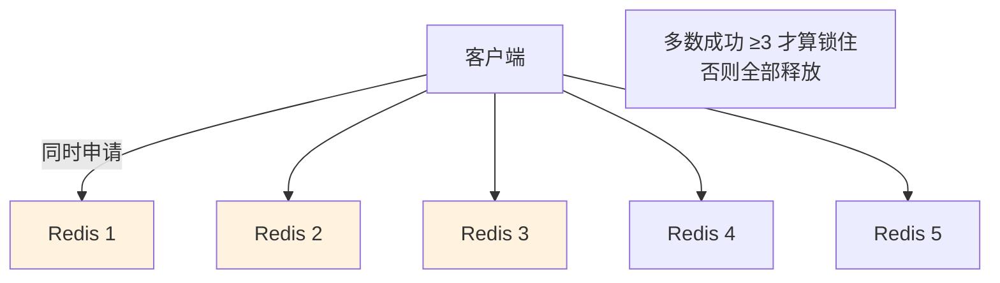

**Martin Kleppmann 反驳**：Redlock 在某些异常场景（GC 暂停、时钟跳变）下仍会出错。**真正强一致需要 fencing token（递增序列）**。

**实战建议**：
- **业务能接受小概率失误 → 简单 Redis 单节点足够**
- **必须严格正确 → 直接用 Zookeeper / etcd**
- **不推荐 Redlock**：复杂度上去了正确性还有争议

## 04.设计核心原则

### 04.1 互斥性原则

**任何时刻最多一个客户端持有锁**——这是分布式锁的灵魂。

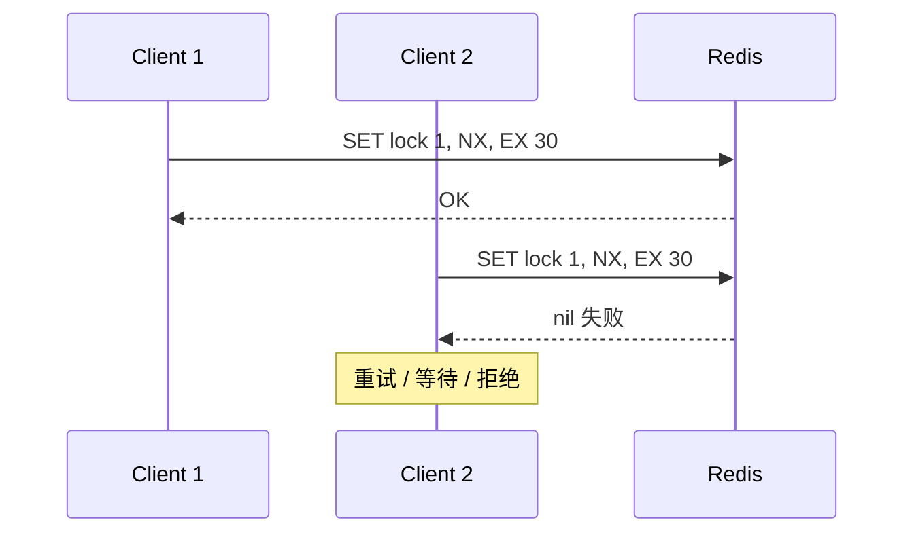

**核心命令**：`SET key value NX EX seconds`——**原子操作**，不存在才设置 + 设置过期时间。

### 04.2 防死锁原则

**铁律**：**锁必须有过期时间**——客户端崩溃没释放锁也能自动释放。

```kotlin
// ✅ 正确：原子设置 + 过期
redis.set(key, value, "NX", "EX", 30)

// ❌ 错误：分两步 - 中间崩溃就死锁
redis.setnx(key, value)
redis.expire(key, 30)  // 万一崩在这一步...永久死锁
```

### 04.3 锁主对应原则

**释放锁时必须验证"是不是自己的锁"**——避免误删别人的锁。

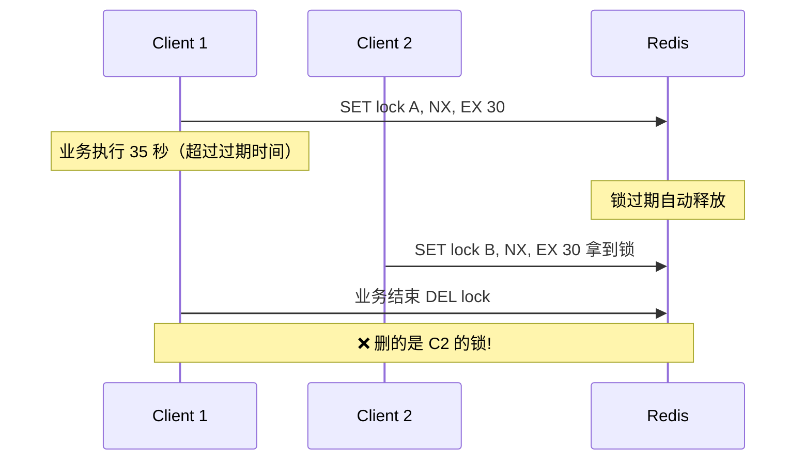

**正确做法**：**用 Lua 脚本保证"判断 + 删除"原子性**：

```lua
-- 释放锁的 Lua 脚本
if redis.call('GET', KEYS[1]) == ARGV[1] then
    return redis.call('DEL', KEYS[1])
else
    return 0
end
```

加锁时 value 用 UUID（每个客户端唯一），释放时校验 value 一致才删。

### 04.4 可重入原则

**同一个客户端能否多次获取同一把锁**？

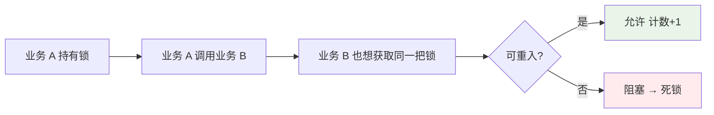

**实现**：value 里存 "客户端 ID + 重入次数"，每次加锁判断。**Redisson 默认就实现了可重入**。

## 05.方案落地实战

### 05.1 整体架构

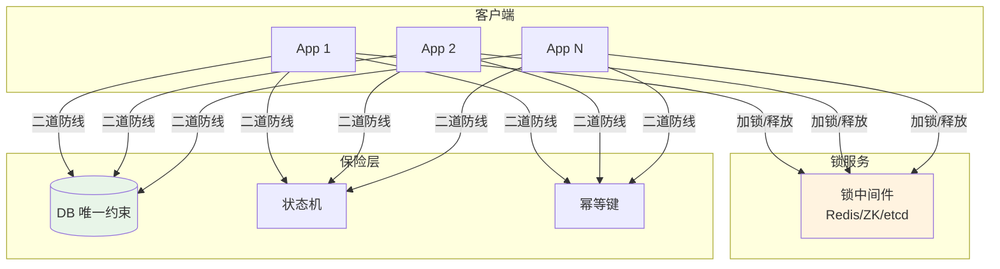

### 05.2 Redis 分布式锁

**完整实现**：

```kotlin
class RedisLock(private val redis: Jedis, private val key: String) {
    private val value = UUID.randomUUID().toString()
    
    fun tryLock(expireSec: Long = 30): Boolean {
        val result = redis.set(key, value, SetParams().nx().ex(expireSec))
        return "OK" == result
    }
    
    fun unlock(): Boolean {
        val script = """
            if redis.call('GET', KEYS[1]) == ARGV[1] then
                return redis.call('DEL', KEYS[1])
            else
                return 0
            end
        """.trimIndent()
        val result = redis.eval(script, listOf(key), listOf(value))
        return result == 1L
    }
}

// 使用
val lock = RedisLock(redis, "lock:order:$orderId")
if (lock.tryLock(30)) {
    try {
        doBusinessLogic()
    } finally {
        lock.unlock()
    }
}
```

**关键点**：
- `SET ... NX EX` 原子操作
- `value` 用 UUID 确保唯一
- 释放用 Lua 脚本

### 05.3 Zookeeper 锁

**临时顺序节点机制**：

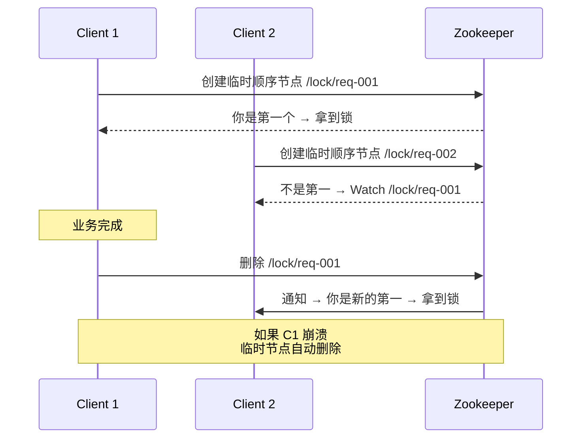

**优点**：
- **天然防死锁**：客户端断连临时节点自动删
- **公平锁**：按创建顺序排队
- **强一致**：基于 ZAB 协议

**缺点**：性能比 Redis 差一个数量级。

### 05.4 etcd 锁

**基于 lease（租约）+ KV 的实现**：

```go
// Go 客户端示例
session, _ := concurrency.NewSession(client, concurrency.WithTTL(10))
defer session.Close()

mutex := concurrency.NewMutex(session, "/lock/order")
if err := mutex.Lock(ctx); err != nil {
    return err
}
defer mutex.Unlock(ctx)

// 业务逻辑
```

**特点**：
- Raft 强一致
- 自动续约（lease keep-alive）
- K8s 生态原生支持

### 05.5 Redisson 实战

**Java 业界事实标准**：

```java
RLock lock = redisson.getLock("order:" + orderId);

// 简单加锁
lock.lock();
try {
    // 业务
} finally {
    lock.unlock();
}

// 带超时
boolean ok = lock.tryLock(3, 30, TimeUnit.SECONDS);
// 等待 3s，持有最多 30s

// 公平锁
RLock fairLock = redisson.getFairLock("queue:" + bizId);

// 读写锁
RReadWriteLock rwLock = redisson.getReadWriteLock("data");
rwLock.readLock().lock();   // 读
rwLock.writeLock().lock();  // 写
```

**Redisson 自动解决了 4 个难题**：
- ✅ 自动续期（看门狗 watchdog）
- ✅ 可重入
- ✅ Lua 脚本保证原子
- ✅ 多种锁类型（公平 / 读写 / 联锁）

## 06.关键问题解决

### 06.1 锁超时问题

**经典场景**：业务执行时间不确定，锁过期了业务还没结束。

```mermaid
gantt
    title 锁超时危险时间线
    dateFormat X
    axisFormat %s
    
    section Client 1
    持有锁         :a, 0, 30
    业务执行       :b, 0, 45
    业务超过锁时长!  :crit, c, 30, 15
    
    section Client 2
    抢到过期锁     :d, 30, 30
    业务执行       :e, 30, 30
    与 C1 并发!    :crit, f, 30, 15
```

**解决方案**：
- **看门狗（自动续期）**：Redisson 默认每 1/3 锁时长自动续 1 次
- **业务时长可控**：能预估就设大一点（比业务时长长 2 倍）
- **失败补偿**：业务结束发现锁已过期 → 触发对账或补偿

### 06.2 锁续期问题

**Redisson 看门狗实现思路**：

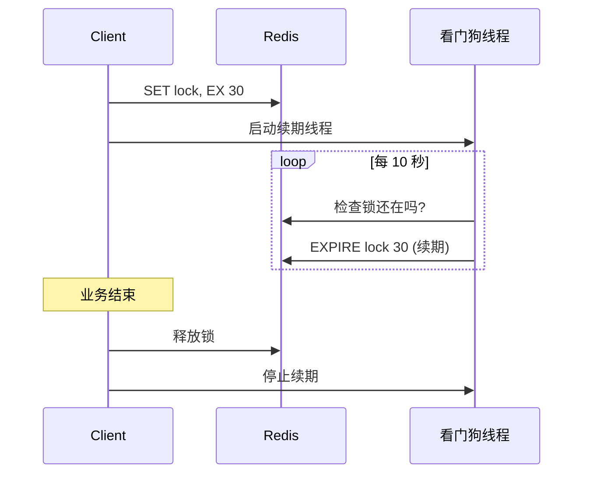

**关键设计**：
- 续期间隔 = 锁时长 / 3（默认）
- 释放锁时停止续期线程
- 客户端宕机 → 续期停止 → 锁自然过期

### 06.3 锁粒度问题

**粒度过粗**：锁住整张商品表 → 所有商品互相阻塞。
**粒度过细**：每个 SKU 一把锁 → 锁数量爆炸。

**实战经验**：

| 场景 | 锁粒度 |
|---|---|
| 秒杀单 SKU | `lock:sku:${skuId}` |
| 用户操作 | `lock:user:${userId}:${action}` |
| 订单防重 | `lock:order:create:${userId}:${requestId}` |
| 全局开关 | `lock:global:promotion` |

**原则**：**锁粒度 = 业务竞争的最小单元**。

## 07.常见陷阱与反例

### 07.1 误删别人锁

**反例**：

```kotlin
// ❌ 错误
redis.setnx("lock", "1", 30)
doBusiness()  // 业务超过 30 秒
redis.del("lock")  // 删的可能是别人的锁
```

**修正**：用 UUID + Lua 校验删除（前面已展示）。

### 07.2 锁未释放

**反例**：

```kotlin
// ❌ 错误：异常时锁不释放
lock.tryLock()
doBusiness()  // 抛异常
lock.unlock()  // 永远不会执行
```

**修正**：

```kotlin
// ✅ 正确：finally 兜底
if (lock.tryLock()) {
    try {
        doBusiness()
    } finally {
        lock.unlock()
    }
}
```

### 07.3 滥用分布式锁

**反例**：每个 HTTP 请求都加分布式锁——QPS 直接跌 70%。

**问题**：
- 大多数场景 DB 乐观锁就够
- 分布式锁是网络调用，开销大
- 高竞争场景才有必要

**正确**：**先用乐观锁、唯一索引、状态机；真正高竞争场景才上分布式锁**。

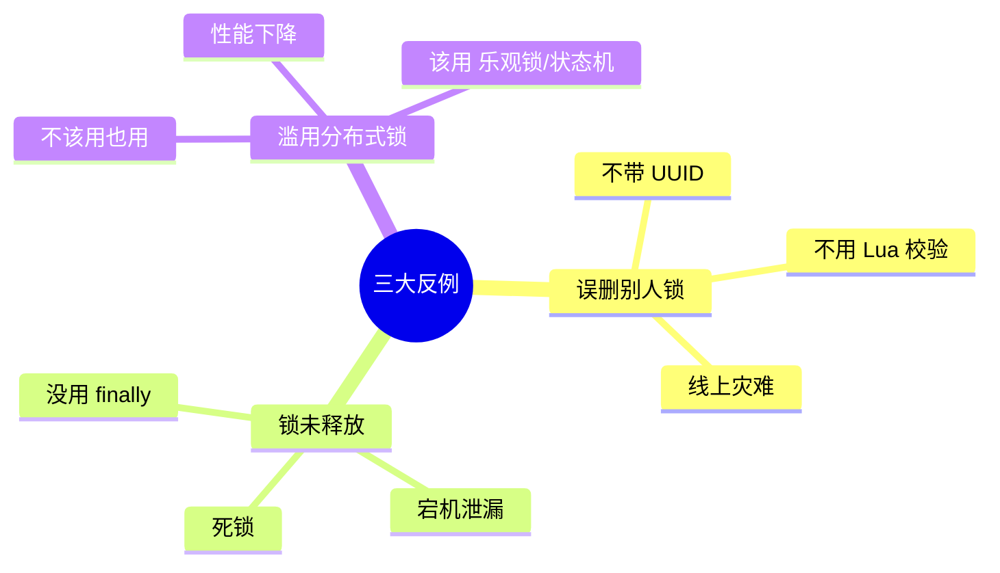

## 08.演进路线

### 08.1 V1 数据库锁

**特征**：业务起步、并发不高。

**做法**：
- DB 行锁（`SELECT ... FOR UPDATE`）
- 乐观锁（version 字段）
- 唯一索引

**适用阶段**：< 1000 QPS

### 08.2 V2 Redis 锁

**特征**：并发上来、需要更好性能。

**做法**：
- Redis SETNX + 过期
- Redisson 框架
- 看门狗自动续期

**适用阶段**：1000-10w QPS

### 08.3 V3 高可用锁集群

**特征**：金融级 / 严格正确性。

**做法**：
- Zookeeper / etcd 集群
- fencing token 二次校验
- 业务层补偿对账

**适用阶段**：金融、库存、票务

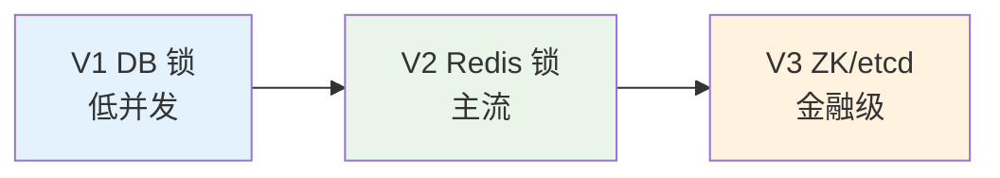

## 09.总结与决策

### 09.1 上线检查表

引入分布式锁前对照：

- [ ] 真的需要分布式锁吗？（先尝试乐观锁/唯一索引）
- [ ] 锁服务高可用（Redis 哨兵 / ZK 集群）
- [ ] 加锁有过期时间
- [ ] 加锁是原子操作（SET NX EX）
- [ ] value 是唯一标识（UUID）
- [ ] 释放锁用 Lua 脚本校验
- [ ] 锁超时有兜底（自动续期 / 失败补偿）
- [ ] 业务有 finally 保证释放
- [ ] 锁粒度合理（不太粗也不太细）
- [ ] 业务层有"二道防线"（DB 唯一约束 / 状态机）
- [ ] 监控（加锁失败率、持有时长、超时次数）
- [ ] 压测覆盖

### 09.2 选型决策树

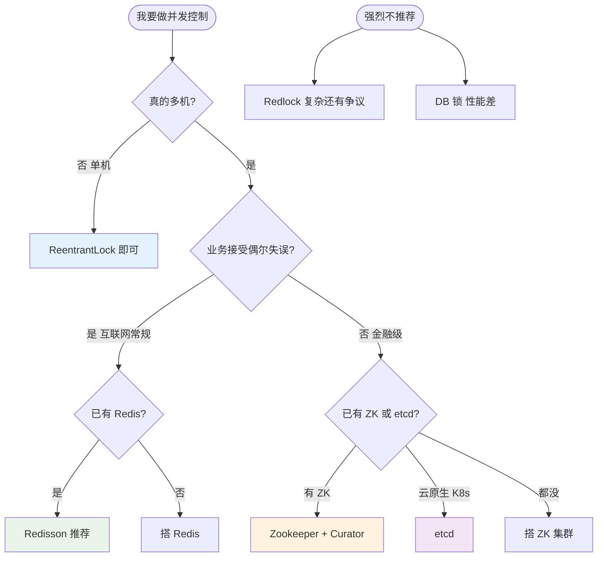

**最后一句话**：分布式锁是看似简单实则陷阱多多的组件——开篇 480 万损失只是因为开发用 `synchronized` 替代了分布式锁。

> 好的分布式锁设计 = **互斥可靠、防死锁、可重入、二道防线兜底**。
