# 20.终端设备鉴权设计

> **本篇定位**：设备鉴权是 IoT、移动端、车机、智能硬件的"身份证"——决定一台设备能不能接入服务。本文从一次"假设备刷数据"的故事讲起，回答三个核心问题——**为什么设备鉴权和用户鉴权不一样？业界四种鉴权方案怎么选？怎么设计一个抗破解的设备鉴权体系？**

#### 目录介绍
- [01.被克隆的设备](#01被克隆的设备)
  - [1.1 假设备刷数据](#11-假设备刷数据)
  - [1.2 攻击扩散链路](#12-攻击扩散链路)
  - [1.3 反思设备鉴权](#13-反思设备鉴权)
- [02.要解决的核心矛盾](#02要解决的核心矛盾)
  - [2.1 设备 vs 用户](#21-设备-vs-用户)
  - [2.2 安全与成本](#22-安全与成本)
  - [2.3 离线与在线](#23-离线与在线)
  - [2.4 设备鉴权的本质](#24-设备鉴权的本质)
- [03.业界主流方案](#03业界主流方案)
  - [03.1 四大鉴权方案](#031-四大鉴权方案)
  - [03.2 横向对比矩阵](#032-横向对比矩阵)
  - [03.3 适用场景速查](#033-适用场景速查)
- [04.设计核心原则](#04设计核心原则)
  - [04.1 一机一密原则](#041-一机一密原则)
  - [04.2 密钥安全原则](#042-密钥安全原则)
  - [04.3 防重放原则](#043-防重放原则)
  - [04.4 可吊销原则](#044-可吊销原则)
- [05.方案落地实战](#05方案落地实战)
  - [05.1 整体架构](#051-整体架构)
  - [05.2 对称密钥方案](#052-对称密钥方案)
  - [05.3 非对称密钥方案](#053-非对称密钥方案)
  - [05.4 证书 mTLS 方案](#054-证书-mtls-方案)
  - [05.5 OAuth 设备流](#055-oauth-设备流)
- [06.关键问题解决](#06关键问题解决)
  - [06.1 密钥存储问题](#061-密钥存储问题)
  - [06.2 接口防篡改](#062-接口防篡改)
  - [06.3 防重放设计](#063-防重放设计)
- [07.常见陷阱与反例](#07常见陷阱与反例)
  - [07.1 一密走天下反例](#071-一密走天下反例)
  - [07.2 明文存密钥反例](#072-明文存密钥反例)
  - [07.3 无吊销机制反例](#073-无吊销机制反例)
- [08.演进路线](#08演进路线)
  - [08.1 V1 简单 token](#081-v1-简单-token)
  - [08.2 V2 一机一密](#082-v2-一机一密)
  - [08.3 V3 证书 + 安全芯片](#083-v3-证书--安全芯片)
- [09.总结与决策](#09总结与决策)
  - [09.1 上线检查表](#091-上线检查表)
  - [09.2 选型决策树](#092-选型决策树)


## 01.被克隆的设备

### 1.1 假设备刷数据

某共享单车平台某日发现：**某个区域单日新增"骑行"50w 次，但实际车辆总数才 8000 辆**。一辆车不可能每天骑 60+ 次。

排查发现：**黑产把 App 反编译，提取了"设备签名密钥"，伪造了 5w 个虚假"骑行设备"**——直接刷流量套补贴，**单日损失 18 万元**。

```mermaid
flowchart TD
    A[App 反编译] --> B[找到签名密钥]
    B --> C[发现密钥写死在代码里]
    C --> D[用 5w 台 PC 模拟设备]
    D --> E[每个模拟设备刷"骑行"]
    E --> F[骗到补贴 18 万/天]
    
    Cause[根因] --> R1[密钥硬编码在代码]
    Cause --> R2[全局只有一个密钥<br/>所有设备共用]
    Cause --> R3[没有设备身份校验]
    Cause --> R4[没有异常行为识别]
    
    style F fill:#ffebee
```

### 1.2 攻击扩散链路

```mermaid
flowchart TD
    Start[设备鉴权用了"全局密钥"] --> Risk{密钥被破解后?}
    
    Risk --> A[所有设备身份都能伪造]
    Risk --> B[服务端无法区分真假]
    Risk --> C[只能强制升级 + 换密钥]
    
    Real[真实代价] --> R1[补贴损失]
    Real --> R2[业务数据被污染]
    Real --> R3[用户信任危机]
    Real --> R4[紧急停服换密钥]
    
    style A fill:#ffebee
    style C fill:#ffebee
```

### 1.3 反思设备鉴权

事后这个团队总结了三个最深刻的教训：

1. **绝不能用"全局密钥"**——必须一机一密
2. **密钥不能写在代码里**——必须用安全存储
3. **必须有异常行为识别**——单密钥被盗时能限速 / 限流

> 设备鉴权和用户鉴权最大的区别：**用户密码丢了改一下就行，设备密钥泄露往往是大规模灾难**。

## 02.要解决的核心矛盾

### 2.1 设备 vs 用户

| 维度 | 用户鉴权 | 设备鉴权 |
|---|---|---|
| **主体** | 真实人 | 物理设备 |
| **凭证** | 用户名 + 密码 | 设备 ID + 密钥/证书 |
| **变更频率** | 用户可改密码 | 出厂烧录，难变更 |
| **数量级** | 每人 1 个 | 每用户 N 个 |
| **存储** | 服务端数据库 | 设备本地（容易被破解） |
| **吊销难度** | 低（改密码即可） | 高（设备难批量更新） |

### 2.2 安全与成本

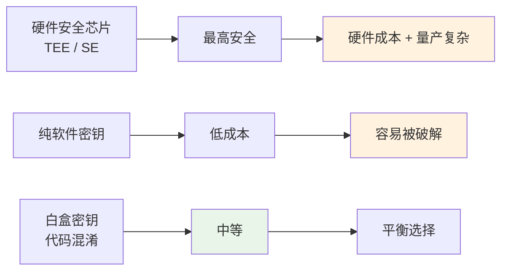

### 2.3 离线与在线

| 场景 | 鉴权要求 |
|---|---|
| **联网设备**（手机、车机） | 在线鉴权，可动态更新 |
| **离线设备**（IoT 偶尔联网） | 本地鉴权 + 上线同步 |
| **断电断网**（智能锁、智能表） | 完全离线鉴权（挑战大） |

### 2.4 设备鉴权的本质

> **设备鉴权 = 验证"这是不是合法的设备"**

它的核心是 **唯一性 + 不可伪造性**——服务端能识别每一台真实设备。

## 03.业界主流方案

### 03.1 四大鉴权方案

| 方案 | 核心机制 | 典型场景 |
|---|---|---|
| **对称密钥** | 设备和服务端共享一个 key | IoT 简单设备 |
| **非对称密钥** | 设备私钥签名，服务端公钥验签 | 中高安全 |
| **数字证书 mTLS** | 双向 TLS 证书 | 银行、车联网 |
| **OAuth 设备流** | 设备通过用户授权 | 智能音箱、TV |

### 03.2 横向对比矩阵

| 维度 | 对称密钥 | 非对称密钥 | mTLS 证书 | OAuth |
|---|---|---|---|---|
| **安全性** | ⭐⭐⭐ | ⭐⭐⭐⭐ | ⭐⭐⭐⭐⭐ | ⭐⭐⭐⭐ |
| **性能** | ⭐⭐⭐⭐⭐ | ⭐⭐⭐ | ⭐⭐⭐ | ⭐⭐⭐⭐ |
| **实现复杂度** | ⭐ | ⭐⭐⭐ | ⭐⭐⭐⭐⭐ | ⭐⭐⭐ |
| **密钥分发** | 麻烦 | 公钥可公开 | PKI 体系 | 用户授权 |
| **吊销机制** | 改密钥 | 服务端清除公钥 | CRL/OCSP | 撤销 token |
| **典型代表** | MQTT 简单设备 | 智能门锁 | 车联网 | 智能 TV |

### 03.3 适用场景速查

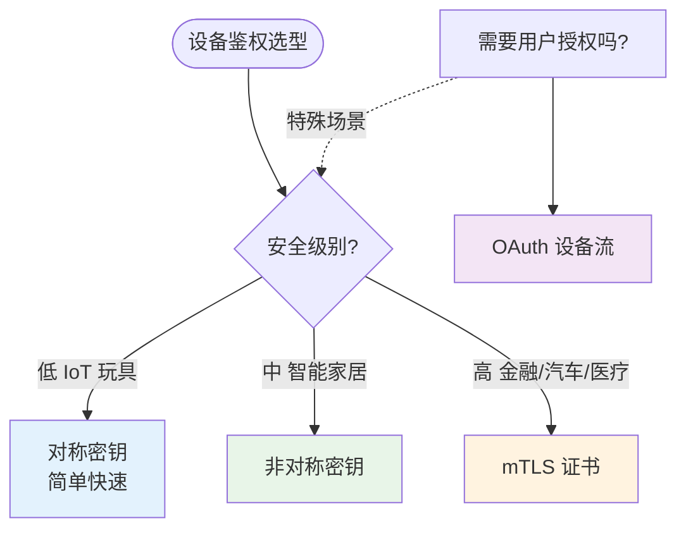

## 04.设计核心原则

### 04.1 一机一密原则

**铁律**：**每台设备有自己唯一的密钥**——一台被破解不影响其他。

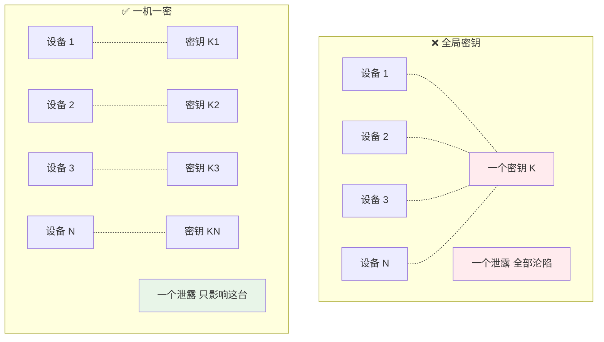

**实现**：
- 出厂时为每台设备烧录唯一密钥
- 服务端存对应关系：`deviceId → key`
- 大规模设备用密钥派生：`device_key = HMAC(master_key, deviceId)`

### 04.2 密钥安全原则

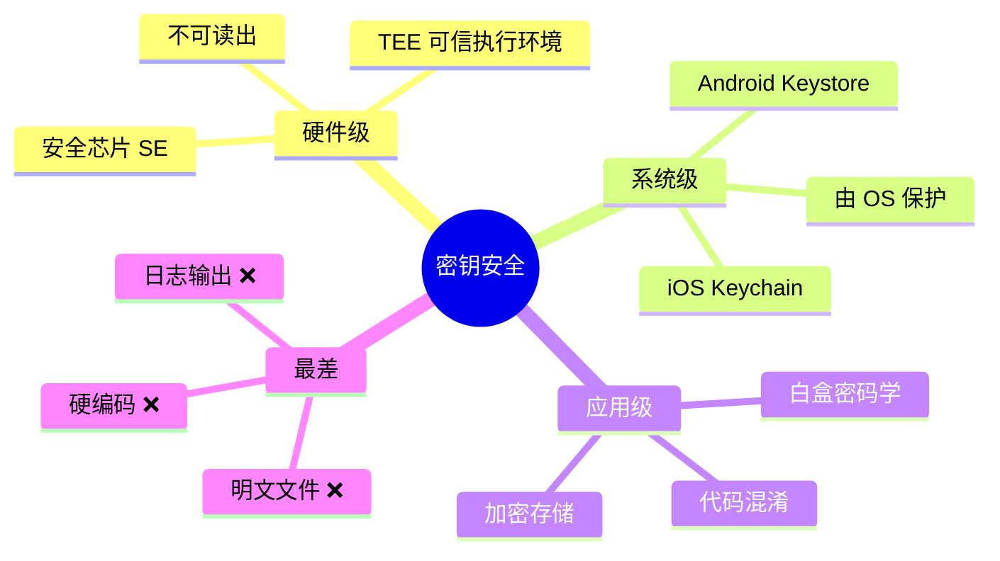

### 04.3 防重放原则

**重放攻击**：黑客抓到一个合法请求，**反复重发**——服务端无法识别。

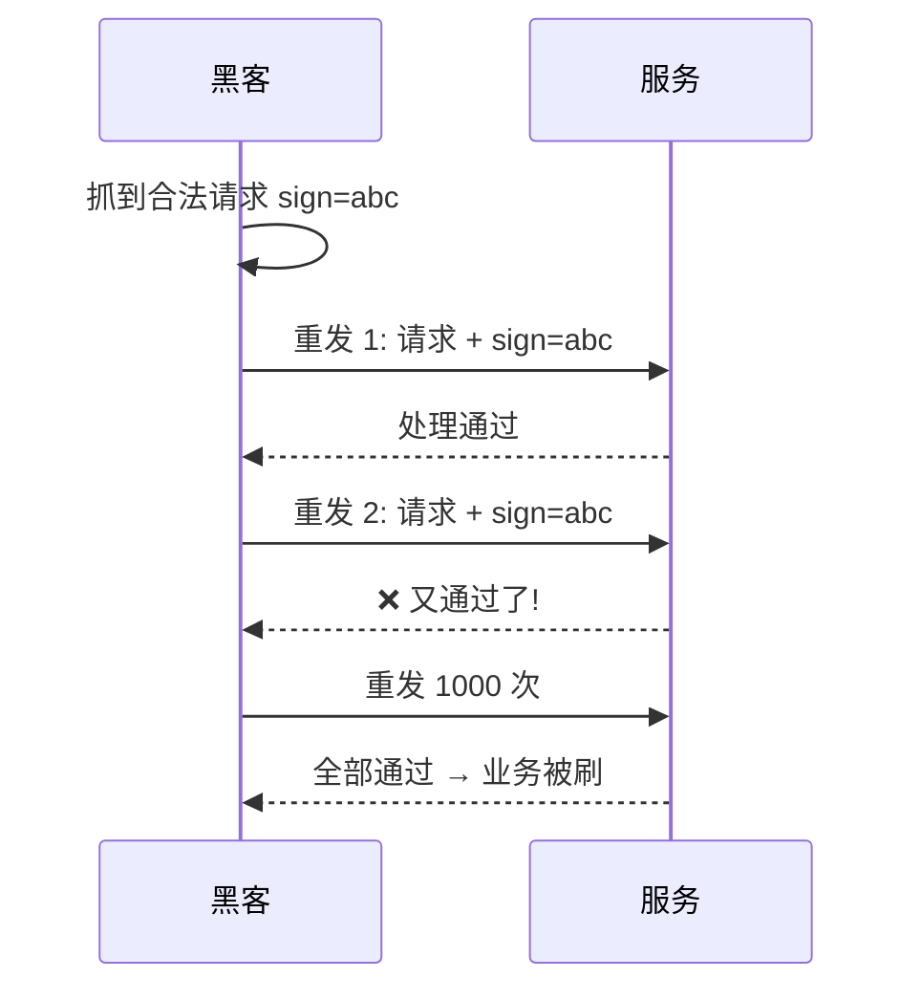

**防重放手段**：
- **timestamp**：请求带时间戳，超过 5 分钟拒绝
- **nonce**：随机串，服务端记录已用 nonce
- **sequence**：递增序列号，必须比上次大

### 04.4 可吊销原则

**设备丢失 / 被破解时必须能立即吊销**：

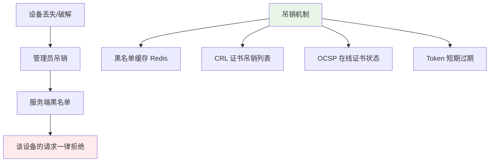

## 05.方案落地实战

### 05.1 整体架构

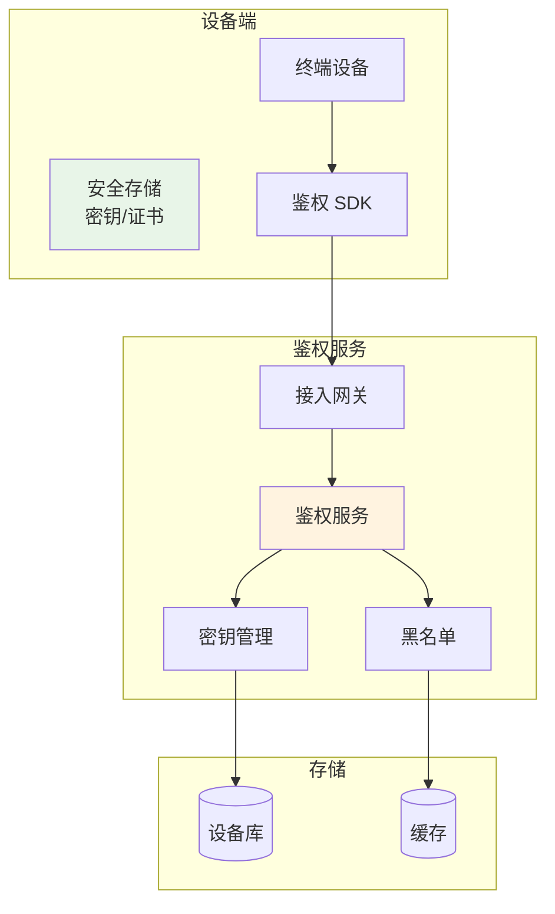

### 05.2 对称密钥方案

**典型流程**（HMAC 签名）：

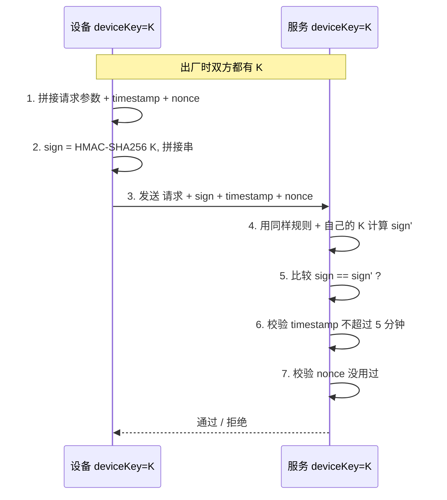

**优点**：性能高（HMAC 速度极快）。
**缺点**：服务端要存所有设备的 key（一旦泄露影响大）。

### 05.3 非对称密钥方案

**典型流程**（RSA / ECDSA 签名）：

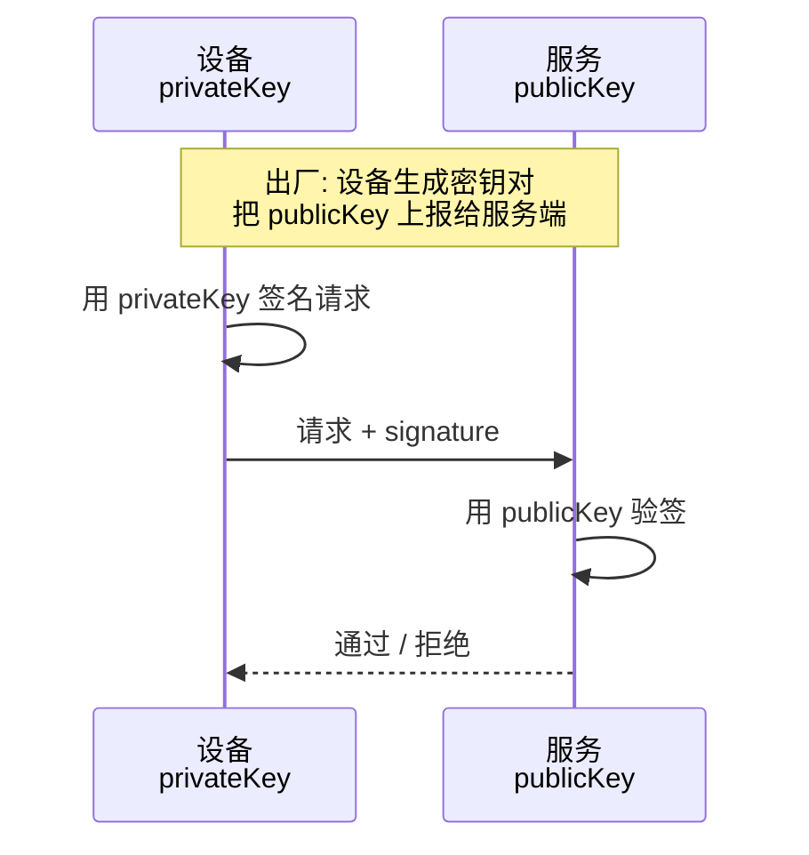

**优点**：服务端只存公钥（**公钥泄露无所谓**）。
**缺点**：签名 / 验签性能比 HMAC 慢 100 倍。

**实战**：**私钥必须存在设备的 TEE / Keystore**，永不外传。

### 05.4 证书 mTLS 方案

**双向 TLS 握手**：

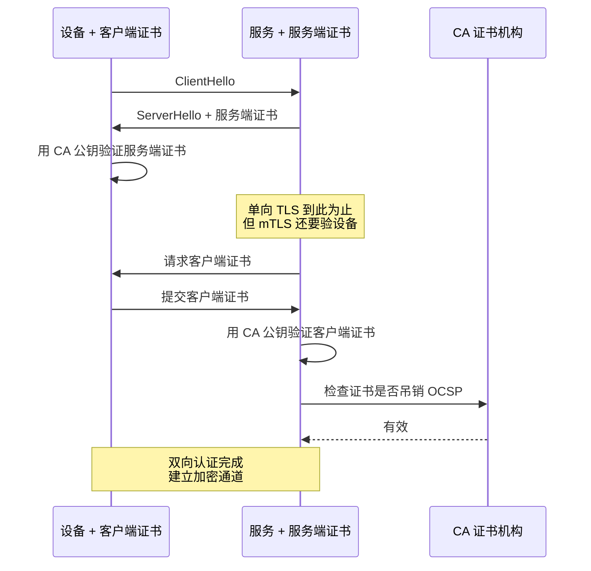

**适用**：
- 银行、金融
- 车联网（车与云）
- 工业 IoT（高价值设备）

### 05.5 OAuth 设备流

**适用场景**：智能 TV、音箱、车机——**设备没键盘，无法输用户名密码**。

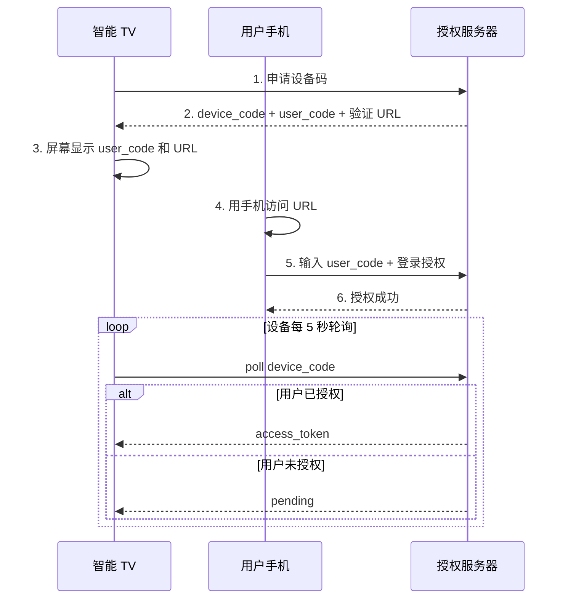

## 06.关键问题解决

### 06.1 密钥存储问题

**不同平台的安全存储能力**：

| 平台 | 推荐方案 |
|---|---|
| **iOS** | Keychain + Secure Enclave |
| **Android** | KeyStore + StrongBox（硬件） |
| **Linux IoT** | TPM 芯片 / OP-TEE |
| **MCU 单片机** | 安全启动 + 安全 Flash |
| **车机** | HSM（硬件安全模块） |

**通用最佳实践**：
- **密钥永不离开安全模块**——签名操作发生在内部
- **代码里不直接读密钥**——通过 API 调用
- **多重保护**：白盒密码学 + 代码混淆

### 06.2 接口防篡改

**完整接口安全 = 鉴权 + 签名**：


**典型签名规则**：

```kotlin
fun sign(params: Map<String, String>, secret: String): String {
    val sorted = params.toSortedMap()
    val raw = sorted.entries.joinToString("&") { "${it.key}=${it.value}" }
    val signRaw = "$raw&timestamp=$timestamp&nonce=$nonce"
    return HmacSHA256(secret, signRaw)
}
```

### 06.3 防重放设计

**完整防重放三件套**：

```kotlin
fun verifyRequest(req: Request): Boolean {
    // 1. 时间窗口校验
    if (System.currentTimeMillis() - req.timestamp > 5 * 60 * 1000) {
        return false  // 5 分钟外拒绝
    }
    
    // 2. nonce 去重
    if (redis.exists("nonce:${req.nonce}")) {
        return false  // 用过了
    }
    redis.setEx("nonce:${req.nonce}", value = "1", expire = 5 * 60)
    
    // 3. 签名校验
    return verifySignature(req)
}
```

## 07.常见陷阱与反例

### 07.1 一密走天下反例

**反例**：开篇共享单车，**所有设备共用一个 key 写死在代码**。

**教训**：必须一机一密。

### 07.2 明文存密钥反例

**反例**：某 IoT 厂商把设备密钥直接存在 `/etc/device.key`，任何人 root 后能直接读到。

**教训**：必须用安全存储（TEE / Keystore / TPM）。

### 07.3 无吊销机制反例

**反例**：某车联网用了证书 mTLS，但**没接 CRL/OCSP**——一辆车被偷后证书还能正常使用，黑客可以一直冒充该车。

**教训**：必须有吊销机制（黑名单 / CRL / OCSP）。

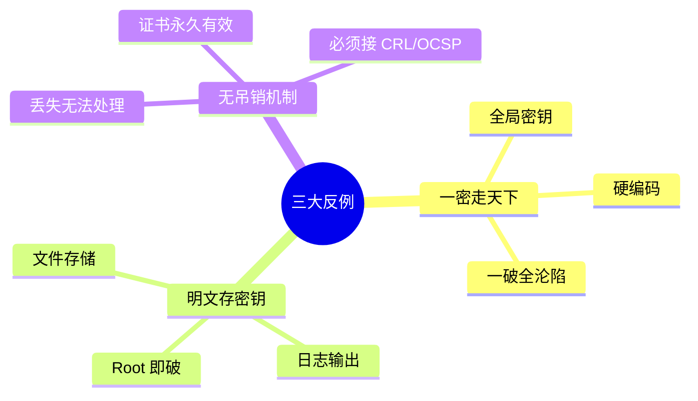

## 08.演进路线

### 08.1 V1 简单 token

**特征**：业务起步、安全要求不高。

**做法**：
- 简单 token（如 deviceId + 时间戳哈希）
- 服务端校验
- 适合内部 / 测试设备

### 08.2 V2 一机一密

**特征**：上规模、需要防破解。

**做法**：
- 出厂烧录唯一密钥
- HMAC 签名 + 防重放
- 安全存储
- 接口完整签名

**适用阶段**：智能家居 / IoT / 移动 App

### 08.3 V3 证书 + 安全芯片

**特征**：金融级 / 工业级 / 车联网。

**做法**：
- mTLS 双向证书
- HSM / SE 安全芯片
- PKI 体系（CA/RA/CRL）
- OCSP 在线吊销

**适用阶段**：银行、汽车、医疗设备

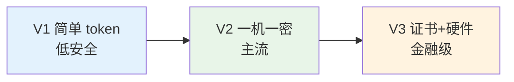

## 09.总结与决策

### 09.1 上线检查表

设备接入前对照：

- [ ] 一机一密机制就位（绝不全局密钥）
- [ ] 密钥安全存储（TEE/Keystore/TPM）
- [ ] 密钥不在代码 / 日志 / 配置里
- [ ] 接口签名机制（HMAC / RSA）
- [ ] 防重放（timestamp + nonce）
- [ ] 吊销机制（黑名单 / CRL）
- [ ] 异常行为检测（频率 / 地理位置）
- [ ] 密钥派生方案（主密钥不落地）
- [ ] 设备生命周期管理（注册 / 激活 / 注销）
- [ ] OTA 升级安全（签名校验）
- [ ] 监控（鉴权失败率、异常设备）
- [ ] 应急预案（密钥泄露后的批量切换）

### 09.2 选型决策树

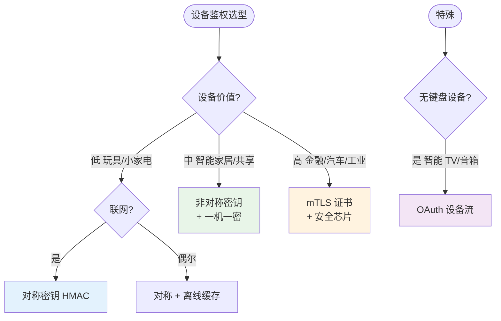

**最后一句话**：设备鉴权和用户鉴权最大的差别就是**密钥不容易换**——一旦设计错了就是大规模灾难。

> 好的设备鉴权 = **一机一密、密钥不出芯片、签名防篡改、可吊销可追溯**。
