# 21.移动端防抓包实践

> **本篇定位**：抓包是 App 安全的"第一关"——抓包能看到所有接口、参数、token、签名规则。本文从一次"接口被刷 200 万次"的攻防讲起，回答三个核心问题——**抓包到底在抓什么？业界四道防线怎么搭？怎么和黑产持续对抗？**

#### 目录介绍
- [01.被抓包的那一夜](#01被抓包的那一夜)
  - [1.1 接口被刷 200 万次](#11-接口被刷-200-万次)
  - [1.2 攻击扩散链路](#12-攻击扩散链路)
  - [1.3 反思防抓包](#13-反思防抓包)
- [02.要解决的核心矛盾](#02要解决的核心矛盾)
  - [2.1 抓包原理拆解](#21-抓包原理拆解)
  - [2.2 安全与体验](#22-安全与体验)
  - [2.3 攻防的螺旋](#23-攻防的螺旋)
  - [2.4 防抓包的本质](#24-防抓包的本质)
- [03.业界主流方案](#03业界主流方案)
  - [03.1 主流抓包工具](#031-主流抓包工具)
  - [03.2 防抓包四道线](#032-防抓包四道线)
  - [03.3 横向对比矩阵](#033-横向对比矩阵)
- [04.设计核心原则](#04设计核心原则)
  - [04.1 多层防御原则](#041-多层防御原则)
  - [04.2 检测与拒绝](#042-检测与拒绝)
  - [04.3 服务端兜底](#043-服务端兜底)
  - [04.4 持续对抗原则](#044-持续对抗原则)
- [05.方案落地实战](#05方案落地实战)
  - [05.1 整体架构](#051-整体架构)
  - [05.2 第一道线 HTTPS](#052-第一道线-https)
  - [05.3 第二道线 证书绑定](#053-第二道线-证书绑定)
  - [05.4 第三道线 代理检测](#054-第三道线-代理检测)
  - [05.5 第四道线 端到端加密](#055-第四道线-端到端加密)
- [06.关键问题解决](#06关键问题解决)
  - [06.1 双向证书绑定](#061-双向证书绑定)
  - [06.2 越狱 Root 检测](#062-越狱-root-检测)
  - [06.3 应用加固混淆](#063-应用加固混淆)
- [07.常见陷阱与反例](#07常见陷阱与反例)
  - [07.1 只用 HTTPS 反例](#071-只用-https-反例)
  - [07.2 客户端独大反例](#072-客户端独大反例)
  - [07.3 防御静止反例](#073-防御静止反例)
- [08.演进路线](#08演进路线)
  - [08.1 V1 仅 HTTPS](#081-v1-仅-https)
  - [08.2 V2 多重加固](#082-v2-多重加固)
  - [08.3 V3 持续攻防对抗](#083-v3-持续攻防对抗)
- [09.总结与决策](#09总结与决策)
  - [09.1 上线检查表](#091-上线检查表)
  - [09.2 选型决策树](#092-选型决策树)


## 01.被抓包的那一夜

### 1.1 接口被刷 200 万次

某电商 App 周五凌晨突然报警：**"领优惠券"接口被请求了 200 万次**——平时每日才 5 万次。

```mermaid
flowchart TD
    A[黑产抓包 App] --> B[拿到"领券"接口]
    B --> C[拿到签名规则]
    C --> D[写脚本绕过 App 直接调接口]
    D --> E[200 万账号自动领券]
    E --> F[2000 万元优惠券池被领光]
    F --> G[正常用户领不到 → 大量投诉]
    
    Cause[根因] --> R1[只用了 HTTPS<br/>没做证书绑定]
    Cause --> R2[签名算法可逆向<br/>放在 Java 层]
    Cause --> R3[没检测代理]
    Cause --> R4[没行为风控]
    
    style F fill:#ffebee
    style G fill:#ffebee
```

### 1.2 攻击扩散链路

**黑产的标准攻击流程**：

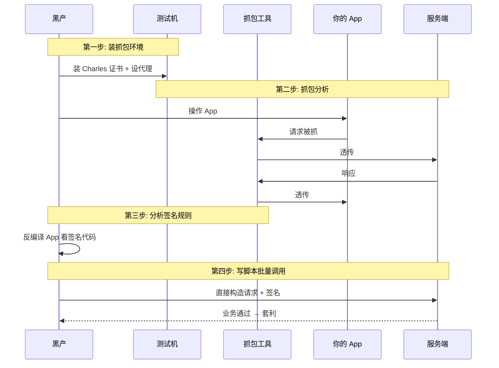

### 1.3 反思防抓包

事后这个团队总结了三个最深刻的教训：

1. **HTTPS 不等于安全**——它只防中间人，不防"自家用户安装抓包证书"
2. **客户端能做的有限，最终要靠服务端兜底**——风控、行为分析、限流
3. **防抓包是持续战争**——黑产工具一直在更新，防御也要持续迭代

> 防抓包的目标不是"绝对防住"——这不可能，**而是"提高攻击成本"**：让黑产破解一次需要 2 周，而不是 2 小时。

## 02.要解决的核心矛盾

### 2.1 抓包原理拆解

**抓包工具（如 Charles / Fiddler）的本质**：

```mermaid
graph LR
    App[App] -->|流量| Proxy[抓包代理<br/>Charles]
    Proxy -->|可见明文| Server[真实服务器]
    Server -->|可见明文| Proxy
    Proxy -->|流量| App
    
    Note[抓包工具扮演"中间人"<br/>需要 App 信任它的证书]
    
    style Proxy fill:#ffebee
    style Note fill:#fff3e0
```

**HTTPS 抓包的关键**：用户主动安装抓包工具的根证书 → 系统信任它 → HTTPS 解密。**HTTPS 防的是被动中间人，不防主动安装证书**。

### 2.2 安全与体验

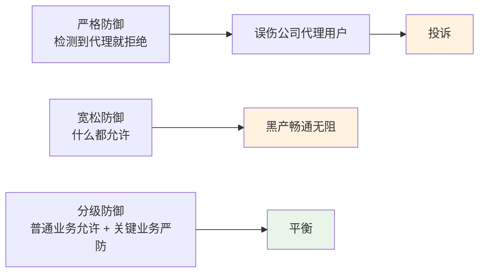

### 2.3 攻防的螺旋

```mermaid
flowchart LR
    V1[V1 HTTPS] --> Crack1[抓包+证书安装破解]
    Crack1 --> V2[V2 证书绑定]
    V2 --> Crack2[Hook 绕过校验]
    Crack2 --> V3[V3 SO 实现 + 加固]
    V3 --> Crack3[Frida 动态调试]
    Crack3 --> V4[V4 反调试 + 反 Hook]
    V4 --> Crack4[内存 dump]
    Crack4 --> V5[V5 端云协同 + 行为风控]
    
    style V1 fill:#e3f2fd
    style V3 fill:#fff3e0
    style V5 fill:#e8f5e8
```

### 2.4 防抓包的本质

> **防抓包 = 提高黑产的破解成本**

它不是"绝对安全"，而是 **让破解时间 > 业务红利时间**——黑产破解一次需要 2 周，但活动只搞 1 周，破解了也来不及刷。

## 03.业界主流方案

### 03.1 主流抓包工具

| 工具 | 平台 | 特点 |
|---|---|---|
| **Charles** | Mac/Windows | 商业、易用、UI 友好 |
| **Fiddler** | Windows | 老牌、免费 |
| **Wireshark** | 全平台 | 网络层、底层抓包 |
| **mitmproxy** | 全平台 | 命令行、可编程 |
| **HTTPCanary**（小黄鸟） | Android | 手机本地抓包，黑产常用 |
| **Stream** | iOS | 手机本地抓包 |

### 03.2 防抓包四道线

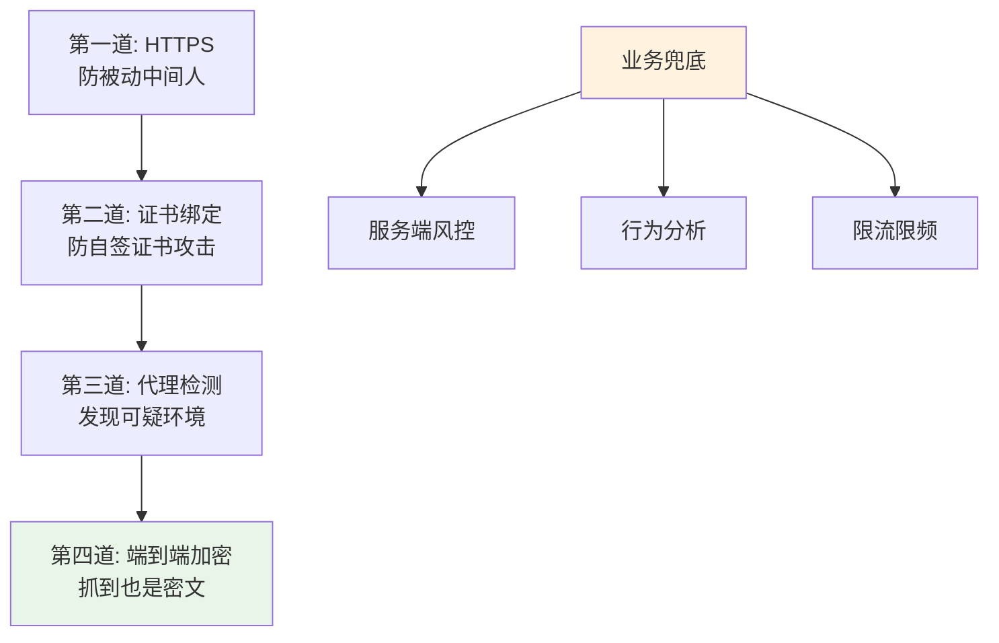

### 03.3 横向对比矩阵

| 方案 | 防御强度 | 实现难度 | 误伤率 | 性能影响 |
|---|---|---|---|---|
| **HTTPS** | ⭐ | ⭐ | 0% | 低 |
| **证书绑定** | ⭐⭐⭐ | ⭐⭐ | 极低 | 低 |
| **代理检测** | ⭐⭐ | ⭐⭐ | 中（公司代理） | 低 |
| **VPN 检测** | ⭐⭐ | ⭐⭐ | 高（VPN 用户多） | 低 |
| **端到端加密** | ⭐⭐⭐⭐ | ⭐⭐⭐⭐ | 0% | 中 |
| **应用加固** | ⭐⭐⭐⭐ | ⭐⭐⭐⭐⭐ | 0% | 中 |
| **服务端风控** | ⭐⭐⭐⭐⭐ | ⭐⭐⭐⭐ | 低 | 0 |

## 04.设计核心原则

### 04.1 多层防御原则

**不要押注单一方案**——任何一道线都可能被破。

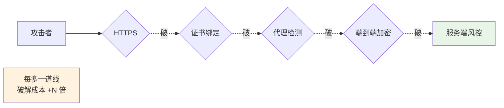

### 04.2 检测与拒绝

**检测到风险后的处理策略**：

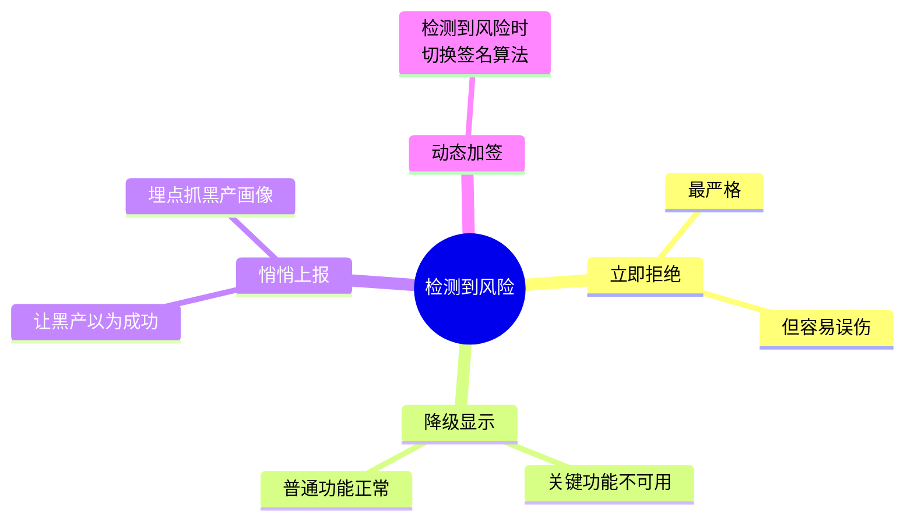

**最佳实战**：**不要立即拒绝，而是悄悄上报 + 后台风控**——让黑产以为成功，避免他们立即换方案。

### 04.3 服务端兜底

**铁律**：**任何客户端的安全都不可信**——所有关键校验必须在服务端做。

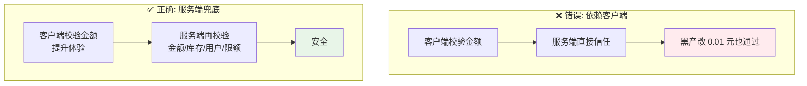

### 04.4 持续对抗原则

**防抓包不是"做一次就完事"**——必须持续：
- 监控黑产工具更新（HTTPCanary 升级了？）
- 业务有"刷子"信号时升级防御
- 关键活动前做"红队演练"

## 05.方案落地实战

### 05.1 整体架构

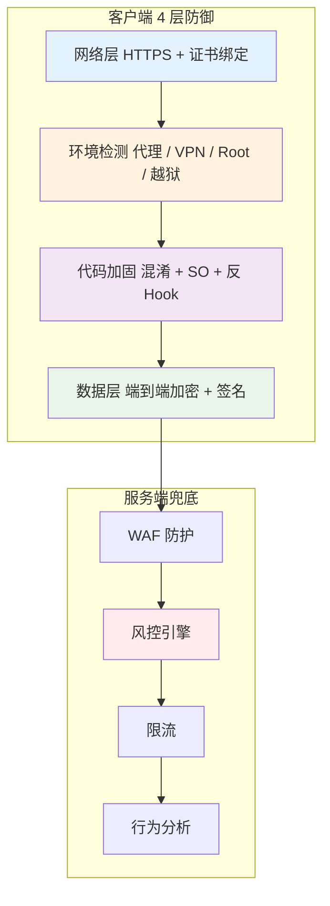

### 05.2 第一道线 HTTPS

**只用 HTTPS 的限制**：

| 防 | 不防 |
|---|---|
| ✅ 公网中间人 | ❌ 用户安装抓包证书 |
| ✅ 流量被运营商劫持 | ❌ 被恶意 App 嗅探 |
| ✅ 传输加密 | ❌ 用户主动 MITM |

**强烈建议**：
- **TLS 1.3**（更安全更快）
- **HSTS**（强制 HTTPS）
- **禁用 TLS 1.0/1.1**

### 05.3 第二道线 证书绑定

**SSL Pinning（证书绑定）**：客户端不仅校验"证书有效"，还校验"证书是不是我们家的"。

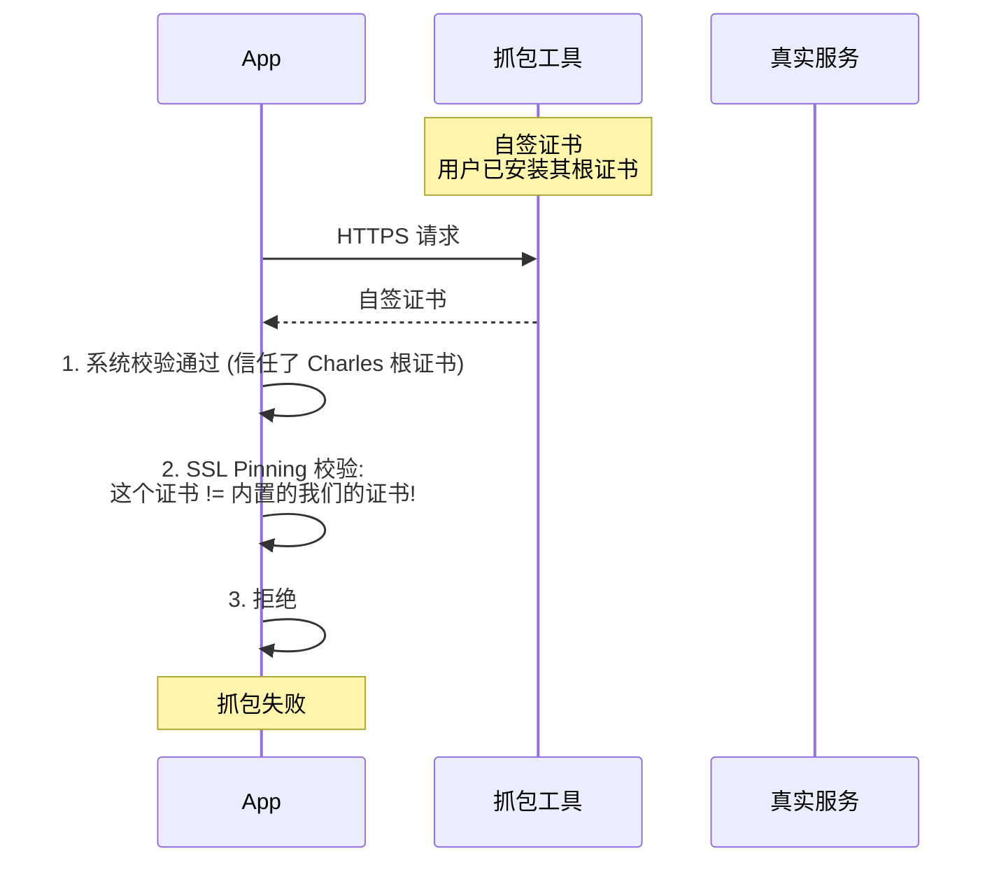

**实现方式**：

| 方式 | 描述 |
|---|---|
| **Public Key Pinning** | 绑定服务端公钥的哈希 |
| **Certificate Pinning** | 绑定证书 |
| **CA Pinning** | 绑定 CA 颁发机构 |

**实战推荐**：**Public Key Pinning**——证书更换不影响绑定。

```kotlin
// OkHttp 实现 Public Key Pinning
val certificatePinner = CertificatePinner.Builder()
    .add("api.example.com", "sha256/AAAAAAAAAAAAAA=")
    .add("api.example.com", "sha256/BBBBBBBBBBBB=")  // 备用
    .build()

val client = OkHttpClient.Builder()
    .certificatePinner(certificatePinner)
    .build()
```

### 05.4 第三道线 代理检测

**代理检测的常见方法**：

```kotlin
// Android: 检测 HTTP 代理
fun isProxy(): Boolean {
    val host = System.getProperty("http.proxyHost")
    val port = System.getProperty("http.proxyPort")
    return !host.isNullOrEmpty() && !port.isNullOrEmpty()
}

// 检测 VPN
fun isVpnActive(context: Context): Boolean {
    val cm = context.getSystemService<ConnectivityManager>()
    val networks = cm?.allNetworks
    return networks?.any { network ->
        cm.getNetworkCapabilities(network)
            ?.hasTransport(NetworkCapabilities.TRANSPORT_VPN) == true
    } ?: false
}
```

**注意**：代理检测**误伤率高**（公司网、海外 VPN、加速器）——**只在关键操作时检测，不要全局拦截**。

### 05.5 第四道线 端到端加密

**业务数据自己加密**（即使被抓包也是密文）：

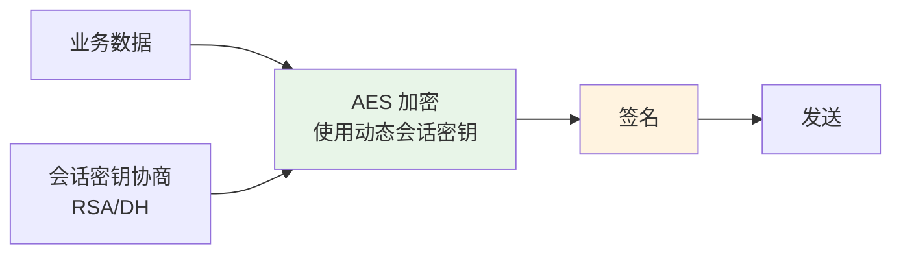

**典型流程**：

| 步骤 | 描述 |
|---|---|
| 1. 启动握手 | 客户端用服务端公钥加密一个随机 sessionKey |
| 2. 服务端解密 | 双方都有了 sessionKey |
| 3. 业务通信 | 用 sessionKey 做 AES 加密 |
| 4. 签名 | 用 deviceKey 做请求签名 |

**抓到的内容**：

```
{
    "encrypted_body": "AES加密的密文，看不懂",
    "sign": "签名",
    "timestamp": "1234567890",
    "nonce": "abc123"
}
```

## 06.关键问题解决

### 06.1 双向证书绑定

**升级方案：mTLS 双向证书**——服务端也校验客户端证书。

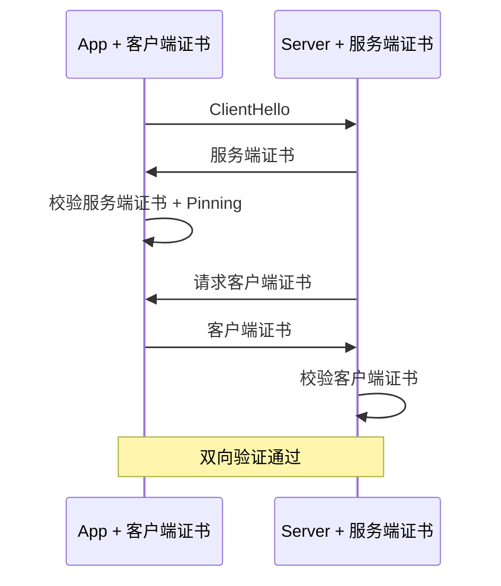

**适合场景**：金融、银行 App。

### 06.2 越狱 Root 检测

**越狱 / Root 设备的风险**：黑产可以 Hook 任何 API。

**检测手段**：

| Android Root 检测 | iOS 越狱检测 |
|---|---|
| 检查 su 命令 | 检查 cydia 文件 |
| 检查 Magisk | 检查 /private 写权限 |
| 检查 root 文件 | 检查 fork 是否成功 |
| Build.TAGS 包含 test-keys | 检查 dyld 注入 |

**注意**：黑产工具能伪造检测结果——**不要完全信任客户端检测**。

### 06.3 应用加固混淆

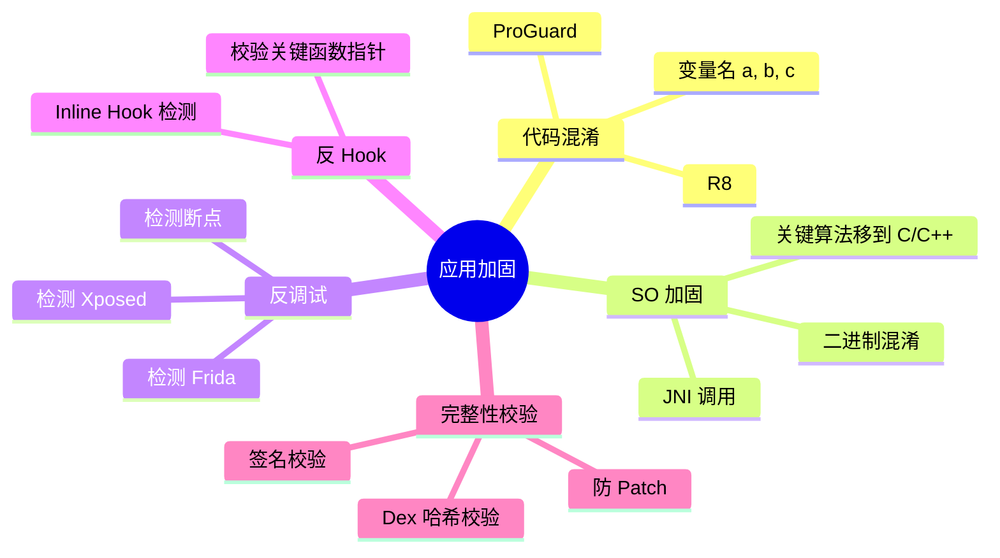

**业界主流加固服务**：360 加固、腾讯乐固、阿里聚安全、网易易盾。

## 07.常见陷阱与反例

### 07.1 只用 HTTPS 反例

**反例**：开篇电商，**只用了 HTTPS 就以为安全**。

**教训**：HTTPS 防不了"自家用户主动抓包"。必须 + 证书绑定。

### 07.2 客户端独大反例

**反例**：金额校验、库存校验、用户身份校验全在客户端做——**黑产改一行代码就绕过**。

**教训**：所有关键校验必须服务端做，客户端只是体验优化。

### 07.3 防御静止反例

**反例**：3 年前做了一套防抓包，**3 年没更新**——黑产工具早就升级 N 代。

**教训**：
- 关注黑产工具更新动态
- 关键活动前升级防御
- 持续做攻防演练

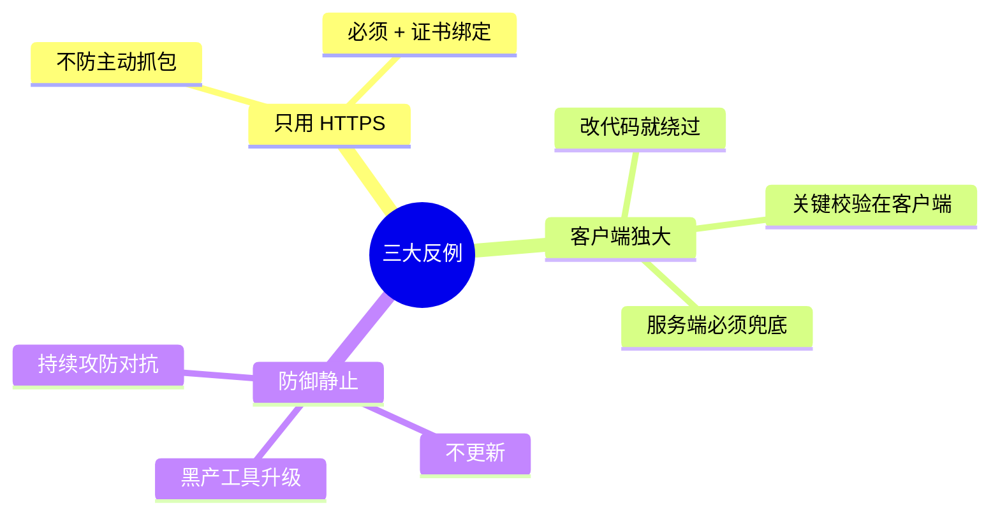

## 08.演进路线

### 08.1 V1 仅 HTTPS

**特征**：业务起步、低安全要求。

**做法**：
- HTTPS（TLS 1.2+）
- 基础参数签名

**适用阶段**：MVP / 内部 App

### 08.2 V2 多重加固

**特征**：业务上规模、有黑产关注。

**做法**：
- HTTPS + 证书绑定
- 代理 / VPN 检测
- 端到端加密
- 应用加固（混淆 + SO）
- 反调试反 Hook

**适用阶段**：互联网常规 App

### 08.3 V3 持续攻防对抗

**特征**：高价值业务（金融、电商大促、游戏）。

**做法**：
- 一切 V2 措施
- mTLS 双向证书
- 端云协同风控
- 行为指纹 + 设备指纹
- 红蓝对抗演练

**适用阶段**：金融 / 大型电商 / 头部游戏

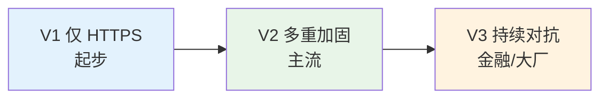

## 09.总结与决策

### 09.1 上线检查表

App 上线前对照：

- [ ] HTTPS 全启用 + TLS 1.2+
- [ ] HSTS 启用
- [ ] 证书绑定（Public Key Pinning）
- [ ] 备用证书（防主证书过期）
- [ ] 代理检测（关键操作时）
- [ ] 越狱 / Root 检测（高安全场景）
- [ ] 端到端加密（关键接口）
- [ ] 接口签名 + 防重放
- [ ] 应用混淆（ProGuard/R8）
- [ ] 应用加固（必要时）
- [ ] 反调试 / 反 Hook
- [ ] 服务端 WAF + 风控
- [ ] 限流 / 限频
- [ ] 异常监控告警
- [ ] 应急预案（密钥泄露、签名破解）

### 09.2 选型决策树

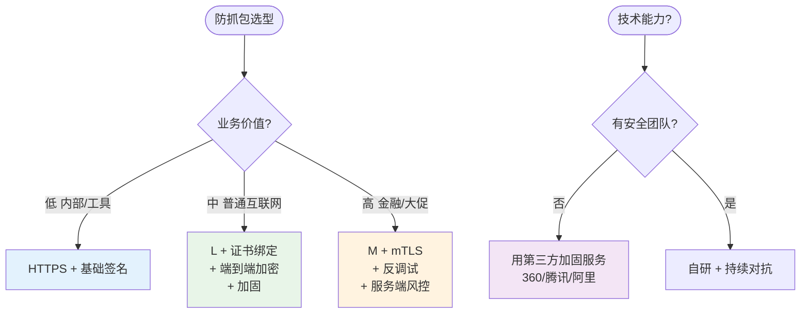

**最后一句话**：防抓包是和黑产的"持续军备竞赛"——目标不是"绝对防住"，而是"让破解成本 > 业务红利"。开篇 200 万次刷券的根因，是只用了一道 HTTPS 防线。

> 好的防抓包设计 = **多层防御、持续迭代、客户端检测、服务端兜底**。
