# 22.IoT框架设计方案

> **本篇定位**：IoT 框架是连接"硬件设备—云端—App"三端的中枢——一个家电厂商可能要管理百万级智能设备、几十种品类、跨平台跨协议接入。本文从一次"百万设备同时掉线"的灾难讲起，回答三个核心问题——**IoT 框架要解决哪些独特挑战？业界主流架构怎么搭？怎么让"设备—云—端"三端协同稳定运行？**

#### 目录介绍
- [01.百万设备同时掉线](#01百万设备同时掉线)
  - [1.1 那场全国性的故障](#11-那场全国性的故障)
  - [1.2 故障扩散链路](#12-故障扩散链路)
  - [1.3 反思 IoT 框架](#13-反思-iot-框架)
- [02.要解决的核心矛盾](#02要解决的核心矛盾)
  - [2.1 设备多样异构](#21-设备多样异构)
  - [2.2 海量与弱网](#22-海量与弱网)
  - [2.3 实时与功耗](#23-实时与功耗)
  - [2.4 IoT 框架的本质](#24-iot-框架的本质)
- [03.业界主流方案](#03业界主流方案)
  - [03.1 主流 IoT 平台](#031-主流-iot-平台)
  - [03.2 横向对比矩阵](#032-横向对比矩阵)
  - [03.3 协议选型对比](#033-协议选型对比)
- [04.设计核心原则](#04设计核心原则)
  - [04.1 三端解耦原则](#041-三端解耦原则)
  - [04.2 物模型抽象](#042-物模型抽象)
  - [04.3 离线优先原则](#043-离线优先原则)
  - [04.4 长连接与低耗](#044-长连接与低耗)
- [05.方案落地实战](#05方案落地实战)
  - [05.1 整体架构](#051-整体架构)
  - [05.2 设备接入层](#052-设备接入层)
  - [05.3 物模型设计](#053-物模型设计)
  - [05.4 OTA 升级机制](#054-ota-升级机制)
  - [05.5 端云协同](#055-端云协同)
- [06.关键问题解决](#06关键问题解决)
  - [06.1 雪崩重连问题](#061-雪崩重连问题)
  - [06.2 时序消息错乱](#062-时序消息错乱)
  - [06.3 离线状态同步](#063-离线状态同步)
- [07.常见陷阱与反例](#07常见陷阱与反例)
  - [07.1 协议直裸反例](#071-协议直裸反例)
  - [07.2 强一致执着反例](#072-强一致执着反例)
  - [07.3 OTA 不灰度反例](#073-ota-不灰度反例)
- [08.演进路线](#08演进路线)
  - [08.1 V1 单品类直连](#081-v1-单品类直连)
  - [08.2 V2 平台化框架](#082-v2-平台化框架)
  - [08.3 V3 端云一体智能](#083-v3-端云一体智能)
- [09.总结与决策](#09总结与决策)
  - [09.1 上线检查表](#091-上线检查表)
  - [09.2 选型决策树](#092-选型决策树)


## 01.百万设备同时掉线

### 1.1 那场全国性的故障

某智能家居厂商凌晨 03:00 做"接入服务器扩容"——升级后**全国 280 万设备瞬间全部掉线**。更糟的是，280 万设备开始**每秒重连一次**，**接入网关被瞬时 280 万 QPS 直接打挂**。

```mermaid
gantt
    title IoT 雪崩故障时间线
    dateFormat HH:mm
    axisFormat %H:%M
    
    section 真实故障
    扩容操作 → 设备掉线 :a, 03:00, 5m
    280 万设备无脑重连 :crit, b, 03:05, 60m
    网关被打挂        :crit, c, 03:10, 50m
    级联打挂消息中心   :crit, d, 03:15, 45m
    
    section 用户感知
    App 显示设备离线   :e, 03:05, 60m
    早起打不开空调     :crit, f, 06:00, 120m
    舆情爆发          :crit, g, 07:00, 180m
```

**故障代价**：
- 280 万设备离线 4 小时
- 全国早高峰用户打不开智能空调 / 智能锁
- 舆情上 30+ 媒体头条
- App Store 评分掉到 1.8

### 1.2 故障扩散链路

```mermaid
flowchart TD
    A[网关扩容触发设备掉线] --> B[设备重连策略写死<br/>1 秒重试一次]
    B --> C[280 万设备每秒尝试重连]
    C --> D[新网关瞬时 280w QPS]
    D --> E[新网关被打挂]
    E --> F[级联到消息中心]
    F --> G[全网瘫痪 4 小时]
    
    Cause[根因] --> R1[设备端重连无退避]
    Cause --> R2[设备端无随机抖动]
    Cause --> R3[网关无限流保护]
    Cause --> R4[扩容流程没"分批接入"]
    
    style E fill:#ffebee
    style G fill:#ffebee
```

### 1.3 反思 IoT 框架

事后这个团队总结了三个最深刻的教训：

1. **设备端不能"无脑重连"**——必须指数退避 + 随机抖动
2. **网关必须"限流保护"**——上限是已知容量的 1.5 倍
3. **大规模操作必须"分批"**——直接全量切换是灾难

> IoT 系统的特殊性在于：**设备数量是 App 的 100 倍，故障放大效应也是 100 倍**——所以稳定性设计比普通业务严苛得多。

## 02.要解决的核心矛盾

### 2.1 设备多样异构

| 维度 | 异构表现 |
|---|---|
| **品类** | 灯泡、空调、门锁、摄像头、扫地机... |
| **芯片** | MCU、ARM、Linux、Android、RTOS... |
| **协议** | MQTT、CoAP、HTTP、私有协议... |
| **网络** | WiFi、4G/5G、蓝牙、Zigbee、ZWave... |
| **算力** | 几 KB 到几 GB 内存差距 1000 倍 |
| **能源** | 常电、电池（要省电） |

**核心**：**不能用一套协议吃遍所有设备**——需要分层抽象。

### 2.2 海量与弱网

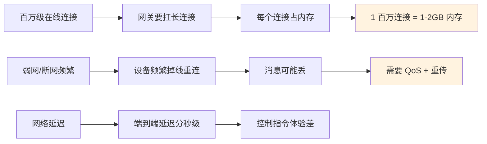

### 2.3 实时与功耗

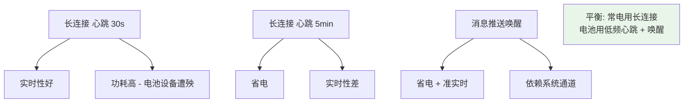

### 2.4 IoT 框架的本质

> **IoT 框架 = 把"设备—云—端"的复杂性收敛到一套统一抽象里**

它要解决：**N 种设备 × M 种协议 × K 种 App** 的乘法复杂度——靠"物模型"抽象成统一语义。

## 03.业界主流方案

### 03.1 主流 IoT 平台

| 平台 | 厂商 | 特点 |
|---|---|---|
| **阿里云 IoT** | 阿里 | 物模型 + 规则引擎 + 设备孪生 |
| **腾讯云 IoT** | 腾讯 | 微信生态联动 |
| **华为 IoT** | 华为 | 鸿蒙生态 + LiteOS |
| **AWS IoT Core** | AWS | 全球节点 + 设备影子 |
| **Azure IoT Hub** | 微软 | 工业 IoT 强 |
| **米家 / HomeKit** | 小米/苹果 | 消费侧生态 |
| **EMQX** | 自部署 | 开源 MQTT broker，国内用得最多 |

### 03.2 横向对比矩阵

| 维度 | 自建 | 公有云 IoT |
|---|---|---|
| **接入复杂度** | 高（自己搭 broker） | 低（平台 SDK 直接接入） |
| **接入容量** | 看你能力 | 千万级现成 |
| **物模型** | 自己定义 | 平台已支持 |
| **OTA / 规则引擎** | 自研 | 现成 |
| **数据归属** | 完全自控 | 受限 |
| **成本** | 长期低 | 按量付费 |
| **典型场景** | 大厂、强自控 | 中小品牌、快速接入 |

### 03.3 协议选型对比

| 协议 | 说明 | 适用 |
|---|---|---|
| **MQTT** | 长连接、低带宽、QoS 0/1/2 | **最主流**，几乎所有 IoT 都用 |
| **CoAP** | UDP 上的"REST"，超低功耗 | 电池设备、传感器 |
| **HTTP** | 简单、不省电 | 间歇上报、固件下载 |
| **WebSocket** | 双向通信 | App / Web 端控制 |
| **私有 TCP** | 自己定 | 老设备改造 |

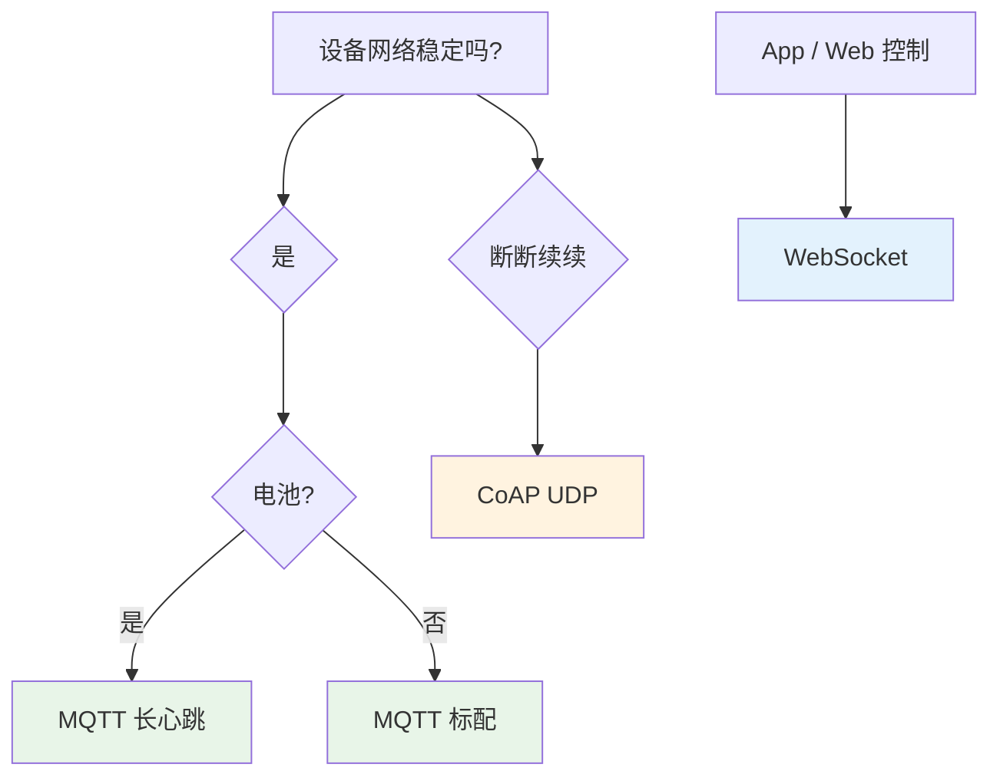

## 04.设计核心原则

### 04.1 三端解耦原则

```mermaid
graph LR
    Device[设备端] -->|物模型| Cloud[云端]
    Cloud -->|物模型| App[App 端]
    
    Note[物模型作为"中间语言"<br/>三端各自演进，不强耦合]
    
    style Cloud fill:#fff3e0
    style Note fill:#e8f5e8
```

**核心**：设备升级不影响 App，App 升级也不影响设备。**通过物模型解耦**。

### 04.2 物模型抽象

**物模型（Thing Model）**：把硬件设备抽象成"属性 / 服务 / 事件"三件套。

```yaml
# 智能空调的物模型
device: AirConditioner
properties:
  - power: bool       # 开关
  - temp: int         # 温度
  - mode: enum [cool, heat, auto]
  - humidity: int (read-only)  # 湿度（只读）

services:
  - turnOn()
  - setTemp(int)
  - setMode(enum)

events:
  - lowTempWarning(temp: int)
  - filterDirty()
```

**好处**：
- App 不需要知道空调的物理细节，只调 `setTemp(26)`
- 不同厂商的空调，只要遵循同一物模型，App 代码完全复用
- 云端规则引擎可以直接基于物模型写规则（"温度 > 30 时打开空调"）

### 04.3 离线优先原则

**铁律**：**断网不能让设备变砖**——核心功能本地必须能用。

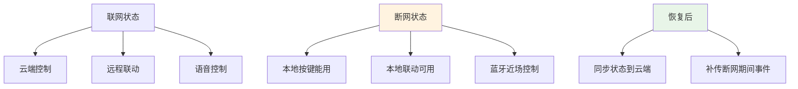

### 04.4 长连接与低耗

**心跳设计经验值**：

| 设备类型 | 心跳间隔 | 理由 |
|---|---|---|
| **常电设备**（空调、电视） | 30s-60s | 实时性优先 |
| **WiFi 电池设备**（监控） | 2-5 min | 平衡 |
| **低功耗设备**（门磁、温感） | 30 min+ | 极致省电 |
| **NB-IoT 设备** | 1 hour+ | 网络代价高 |

## 05.方案落地实战

### 05.1 整体架构

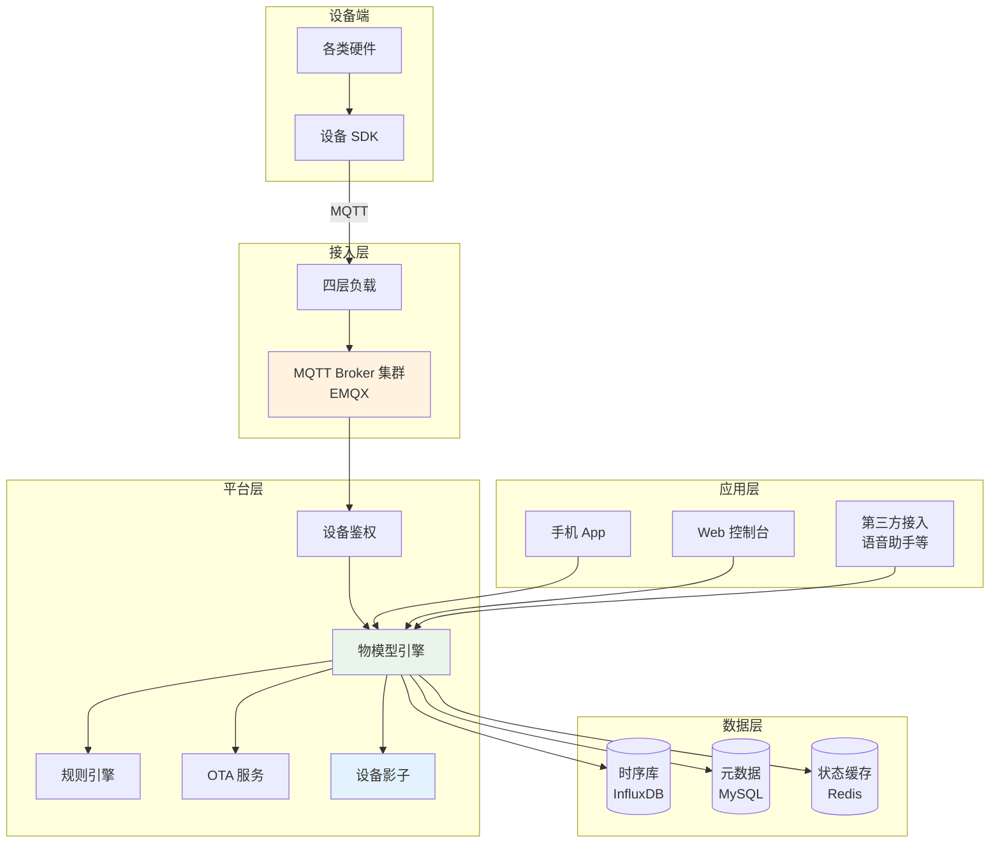

### 05.2 设备接入层

**EMQX MQTT 集群部署**：

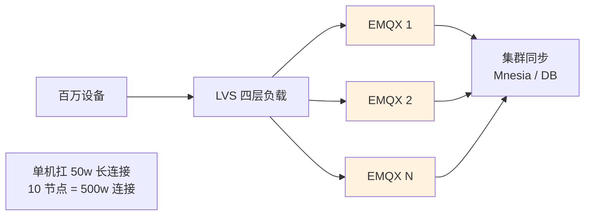

**关键参数**：
- 最大连接数：**单节点 50 万**
- 心跳：**60s**（默认）
- 消息 QoS：**1**（至少一次，平衡）
- TLS：**强制启用**

### 05.3 物模型设计

**典型 MQTT topic 设计**：

```
# 属性上报
device/{deviceId}/property/post

# 属性下发
device/{deviceId}/property/set

# 服务调用
device/{deviceId}/service/{serviceName}/invoke

# 事件上报
device/{deviceId}/event/{eventName}

# OTA
device/{deviceId}/ota/upgrade
```

**消息标准格式**：

```json
{
    "id": "msg_001",                  // 消息 ID
    "version": "1.0",
    "method": "thing.property.post",
    "params": {
        "temp": 26,
        "power": true
    },
    "timestamp": 1234567890
}
```

### 05.4 OTA 升级机制

**OTA 升级最容易翻车**——一定要灰度。

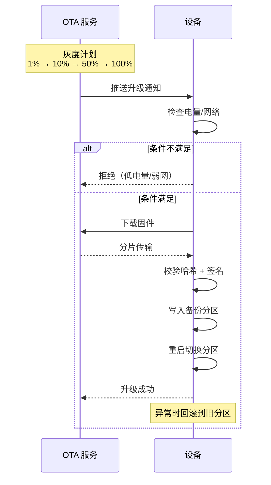

**关键设计**：
- **A/B 双分区**：升级失败能秒级回滚
- **签名校验**：防恶意固件
- **断点续传**：弱网下也能升级
- **灰度策略**：按城市 / 设备型号分批
- **熔断机制**：失败率超过 5% 立即停止

### 05.5 端云协同

**设备影子（Device Shadow）**：云端缓存设备状态，App 直接读云端，不用每次都查设备。

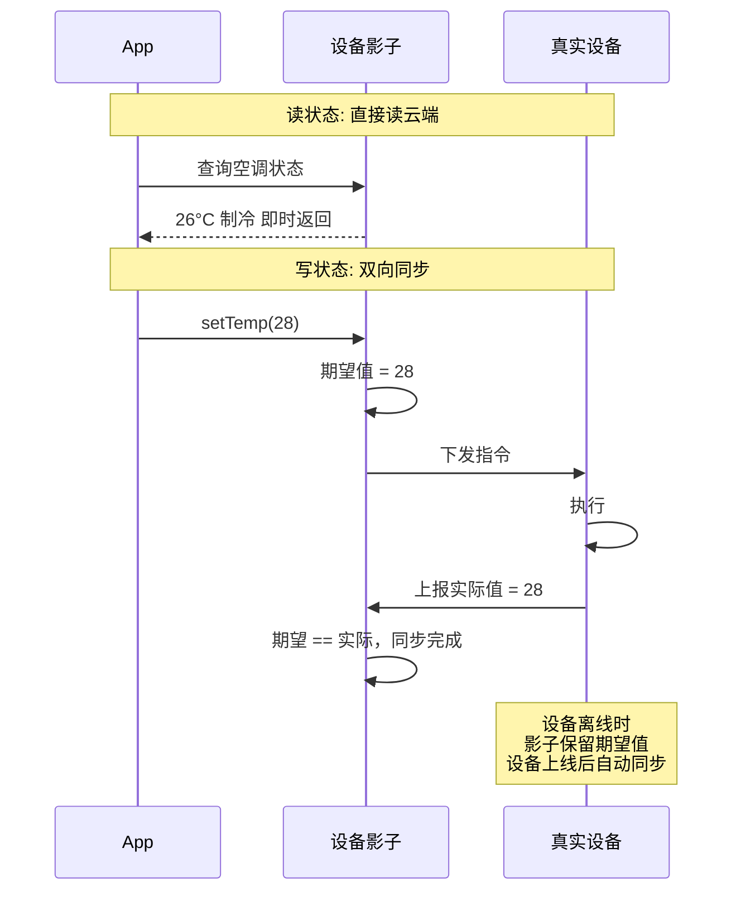

## 06.关键问题解决

### 06.1 雪崩重连问题

**开篇 280 万设备雪崩**的解决：**指数退避 + 随机抖动**。

```kotlin
class ReconnectStrategy {
    private var attempt = 0
    
    fun nextDelay(): Long {
        attempt++
        // 指数退避: 1s → 2s → 4s → 8s ... 最大 5 分钟
        val base = min(60_000L * (1 shl (attempt.coerceAtMost(8))), 5 * 60_000L)
        // 加 50% 随机抖动，避免设备齐步走
        val jitter = (base * 0.5 * Math.random()).toLong()
        return base + jitter
    }
    
    fun reset() {
        attempt = 0
    }
}
```

**配合服务端措施**：
- 网关接入限流（每秒最多接受 N 个新连接）
- 分批引导（设备按 deviceId 哈希分散到时间窗口）
- 应急熔断（关闭部分非核心功能）

### 06.2 时序消息错乱

**问题**：网络抖动导致消息乱序——后发的"关闭"先到，先发的"打开"后到。

**解决方案**：**版本号 / 时间戳兜底**。

```json
{
    "method": "thing.property.set",
    "params": {
        "power": false,
        "version": 1234567890   // 版本号递增
    }
}
```

**设备端处理**：

```kotlin
fun onCommand(cmd: Command) {
    if (cmd.version <= lastVersion) {
        return  // 旧消息丢弃
    }
    lastVersion = cmd.version
    apply(cmd)
}
```

### 06.3 离线状态同步

**设备从离线恢复时，可能错过了大量指令**。

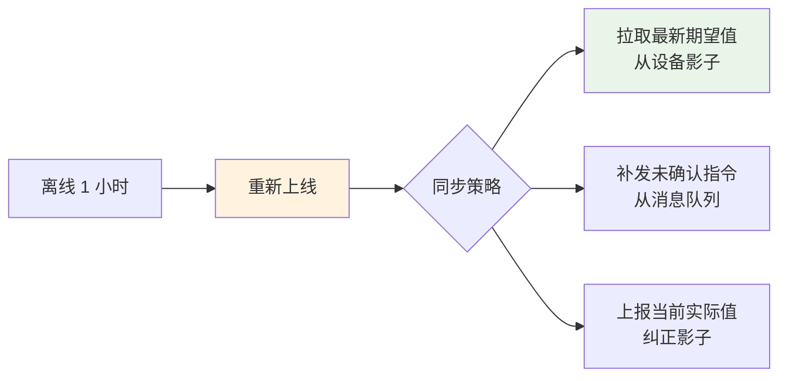

## 07.常见陷阱与反例

### 07.1 协议直裸反例

**反例**：每个品类各自定义私有协议——空调一套、灯泡一套、门锁一套——**App 要写 30 套适配代码**。

**教训**：必须有**统一的物模型抽象层**——上层逻辑只关心"设备能做什么"，不关心"具体怎么做"。

### 07.2 强一致执着反例

**反例**：要求"App 显示的状态必须 100% 等于设备实时状态"——为此每秒查询一次设备 → 设备耗电翻倍 + 网关压力暴涨。

**教训**：**IoT 是最终一致系统**——接受秒级延迟，用设备影子缓存。

### 07.3 OTA 不灰度反例

**反例**：某厂商发布固件 V2.0 → **直接全量推送 1000 万设备** → V2.0 有 bug → **1000 万设备全部变砖**。

**教训**：
- 必须灰度（1% → 10% → 100%）
- 必须有自动熔断（失败率超阈值停止）
- 必须有 A/B 分区回滚

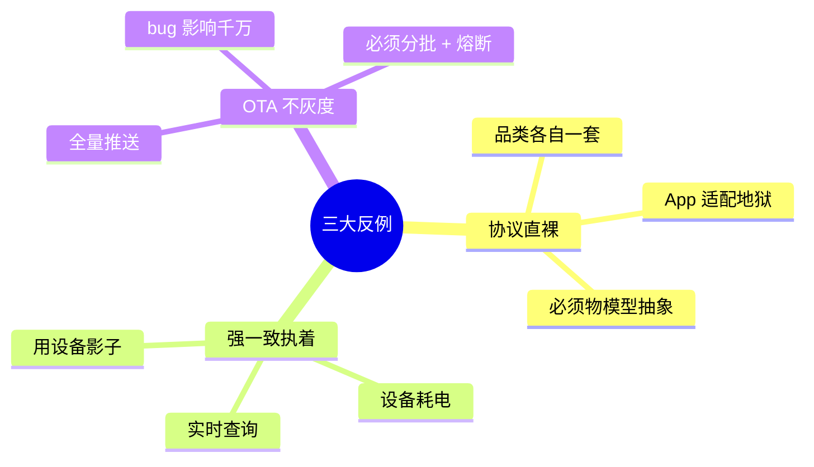

## 08.演进路线

### 08.1 V1 单品类直连

**特征**：业务起步、单品类、几万设备。

**做法**：
- 单品类私有协议
- HTTP 间歇上报
- 简单 App 直连云

**适用阶段**：早期 / POC

### 08.2 V2 平台化框架

**特征**：多品类、十万级设备。

**做法**：
- MQTT 长连接
- 物模型抽象
- 设备影子
- 简单 OTA + 灰度

**适用阶段**：成长期 / 品牌化

### 08.3 V3 端云一体智能

**特征**：百万级设备、智能联动。

**做法**：
- EMQX 集群（千万级连接）
- 规则引擎 + 场景联动
- AI 模型下发
- 边缘计算
- 全链路灰度 + 智能监控

**适用阶段**：头部 IoT 厂商

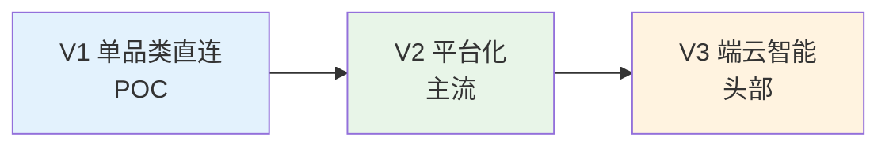

## 09.总结与决策

### 09.1 上线检查表

IoT 平台上线前对照：

- [ ] 设备端重连指数退避 + 随机抖动
- [ ] 网关有连接数限流
- [ ] 物模型 schema 有版本管理
- [ ] 设备影子覆盖核心属性
- [ ] OTA 有 A/B 分区 + 签名校验
- [ ] OTA 有灰度策略 + 自动熔断
- [ ] 离线场景核心功能可用
- [ ] 消息有版本号防乱序
- [ ] 设备鉴权一机一密
- [ ] 心跳间隔与设备类型匹配
- [ ] 监控覆盖（在线率、消息延迟、上下行 QPS）
- [ ] 大规模操作必须分批
- [ ] 故障演练（网关挂、broker 挂、设备雪崩）

### 09.2 选型决策树

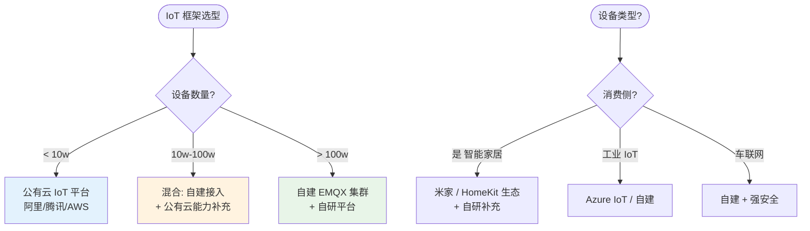

**最后一句话**：IoT 框架 = 把"百万级异构设备"管理得像"一个虚拟设备"一样简单——开篇 280 万设备雪崩，根因不过是少了"指数退避 + 限流"两行代码。

> 好的 IoT 框架 = **三端解耦、物模型统一、离线优先、灰度可控**。
