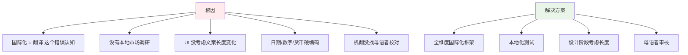
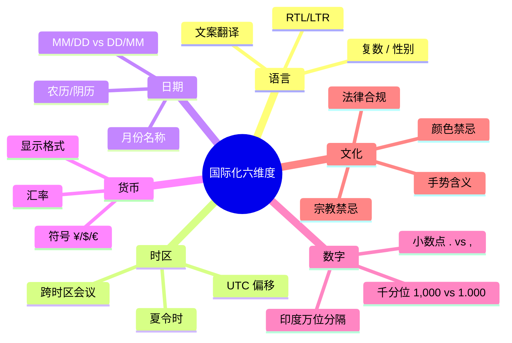
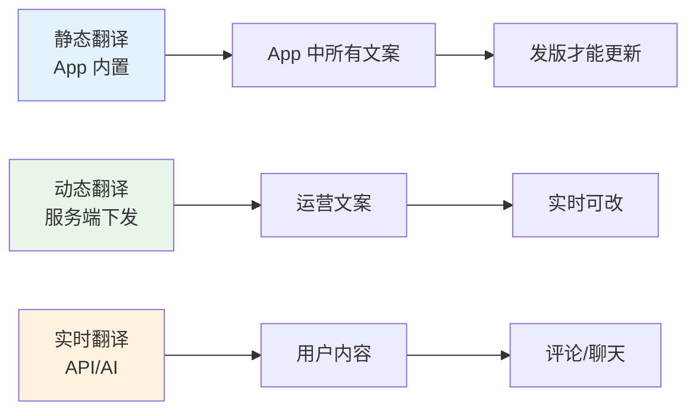
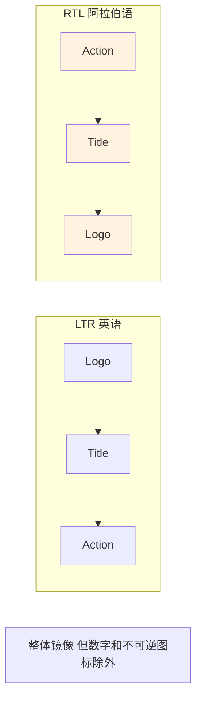
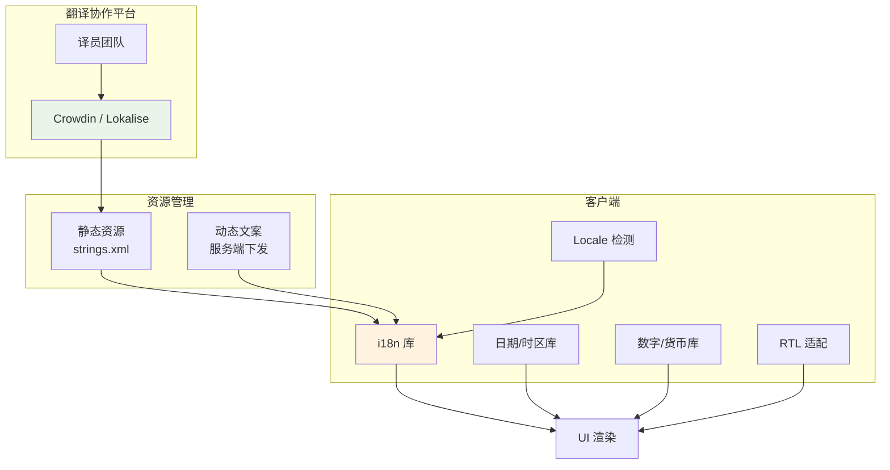
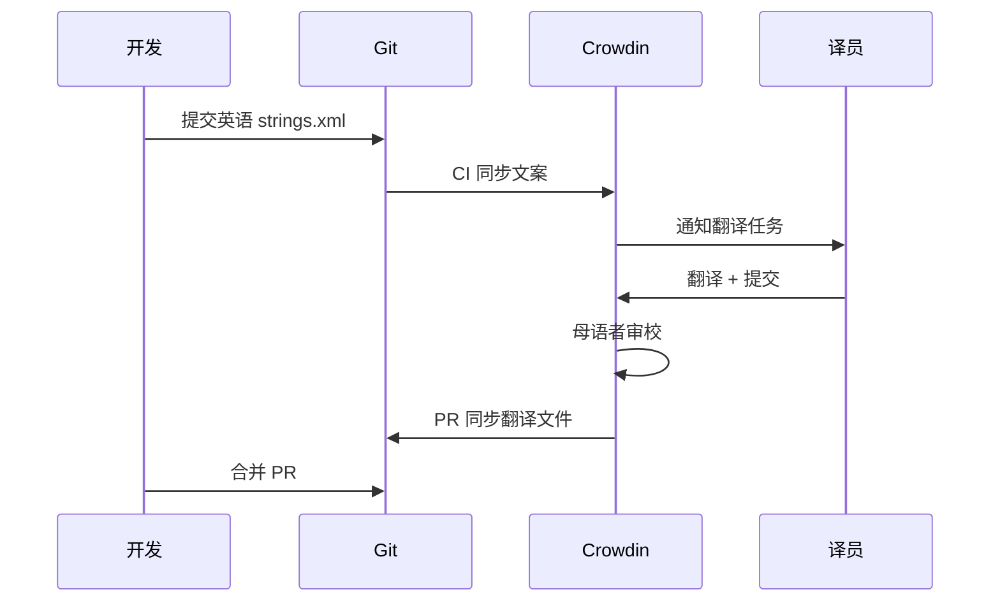
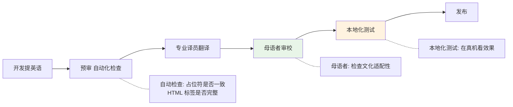
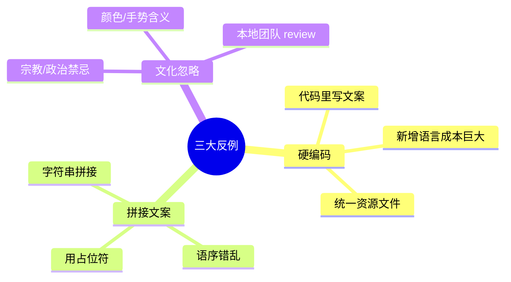
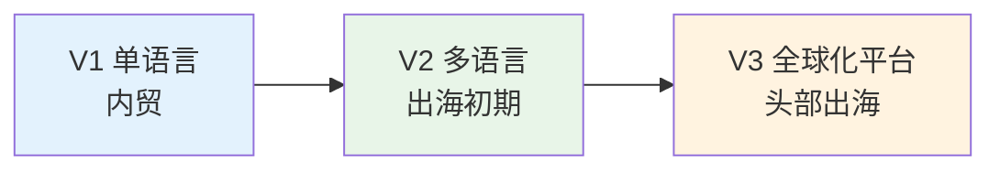
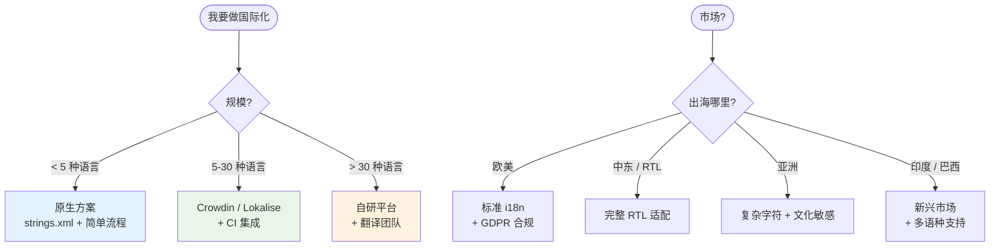

# 25.国际化实践方案

> **本篇定位**：国际化（i18n）是出海产品的"通行证"——支持多语言、多时区、多货币、多文化。本文从一次"印度市场上线翻车"的故事讲起，回答三个核心问题——**国际化不只是翻译那么简单——还有哪些坑？业界主流方案怎么做？怎么设计一套支持百国上线的体系？**

#### 目录介绍
- [01.印度上线翻车记](#01印度上线翻车记)
  - [1.1 上线第一天的灾难](#11-上线第一天的灾难)
  - [1.2 翻车扩散链路](#12-翻车扩散链路)
  - [1.3 反思国际化](#13-反思国际化)
- [02.要解决的核心矛盾](#02要解决的核心矛盾)
  - [2.1 国际化的六个维度](#21-国际化的六个维度)
  - [2.2 静态与动态](#22-静态与动态)
  - [2.3 文化与法律](#23-文化与法律)
  - [2.4 国际化的本质](#24-国际化的本质)
- [03.业界主流方案](#03业界主流方案)
  - [03.1 主流 i18n 框架](#031-主流-i18n-框架)
  - [03.2 横向对比矩阵](#032-横向对比矩阵)
  - [03.3 翻译资源管理](#033-翻译资源管理)
- [04.设计核心原则](#04设计核心原则)
  - [04.1 资源分离原则](#041-资源分离原则)
  - [04.2 文案占位原则](#042-文案占位原则)
  - [04.3 RTL 友好原则](#043-rtl-友好原则)
  - [04.4 时区货币原则](#044-时区货币原则)
- [05.方案落地实战](#05方案落地实战)
  - [05.1 整体架构](#051-整体架构)
  - [05.2 文案资源管理](#052-文案资源管理)
  - [05.3 时区与日期](#053-时区与日期)
  - [05.4 货币与数字](#054-货币与数字)
  - [05.5 RTL 双向布局](#055-rtl-双向布局)
- [06.关键问题解决](#06关键问题解决)
  - [06.1 复数与性别](#061-复数与性别)
  - [06.2 长度溢出问题](#062-长度溢出问题)
  - [06.3 翻译协作流程](#063-翻译协作流程)
- [07.常见陷阱与反例](#07常见陷阱与反例)
  - [07.1 硬编码反例](#071-硬编码反例)
  - [07.2 拼接文案反例](#072-拼接文案反例)
  - [07.3 文化忽略反例](#073-文化忽略反例)
- [08.演进路线](#08演进路线)
  - [08.1 V1 单语言](#081-v1-单语言)
  - [08.2 V2 多语言基础](#082-v2-多语言基础)
  - [08.3 V3 全球化平台](#083-v3-全球化平台)
- [09.总结与决策](#09总结与决策)
  - [09.1 上线检查表](#091-上线检查表)
  - [09.2 选型决策树](#092-选型决策树)


## 01.印度上线翻车记

### 1.1 上线第一天的灾难

某出海 App 进军印度市场，**上线第一天投诉激增**：
- 价格显示成 `₹100,000` —— 印度数字格式应该是 `1,00,000`（万位分隔）
- 时间显示 `11/05/2024` —— 印度用户以为是 11 月 5 日，实际是 5 月 11 日
- "登录"按钮文字溢出，按钮变成两行
- 阿拉伯语用户反馈 "整个 App 是反的"——RTL 没适配
- 印地语翻译有侮辱性词汇——机翻用了带歧义的词

```mermaid
flowchart TD
    A[出海印度] --> B[本地化只做了"翻译"]
    B --> Issue1[数字格式不对]
    B --> Issue2[日期格式歧义]
    B --> Issue3[文案长度溢出]
    B --> Issue4[RTL 没适配]
    B --> Issue5[机翻有歧义]
    
    Result[结果] --> R1[第一周流失 60% 印度用户]
    Result --> R2[本地媒体差评]
    Result --> R3[紧急下架重新发版]
    
    style B fill:#fff3e0
    style Result fill:#ffebee
```

### 1.2 翻车扩散链路



### 1.3 反思国际化

事后这个团队总结了三个最深刻的教训：

1. **国际化 ≠ 翻译**——还有时区、日期、数字、货币、RTL、文化禁忌
2. **本地化必须有本地人参与**——机翻只是起点
3. **UI 设计必须为"长文本"留余量**——德语单词通常比英语长 30%

> 进入一个新市场不是"加一份翻译文件"——而是要把产品**重新打磨一遍**。

## 02.要解决的核心矛盾

### 2.1 国际化的六个维度



### 2.2 静态与动态



### 2.3 文化与法律

**法律合规是上线前必须做的功课**：

| 国家/地区 | 必须遵守 |
|---|---|
| **欧盟** | GDPR（数据保护） |
| **加州** | CCPA |
| **中国** | 《个人信息保护法》《数据安全法》 |
| **印度** | 数据本地化要求 |
| **俄罗斯** | 个人数据存储在境内 |
| **中东** | 宗教内容合规 |

### 2.4 国际化的本质

> **国际化 = 让产品"看起来就是为本地市场打造"的**

它不是 "translate everything"——而是 **think globally, design locally（全球思考，本地设计）**。

## 03.业界主流方案

### 03.1 主流 i18n 框架

| 平台 | 主流方案 |
|---|---|
| **Web** | i18next、react-intl、vue-i18n |
| **iOS** | Localizable.strings + NSLocalizedString |
| **Android** | strings.xml + values-xx 资源目录 |
| **跨端** | i18next-react-native、flutter_localizations |
| **后端** | gettext、Java MessageSource |
| **翻译协作** | Crowdin、Lokalise、Phrase、Localazy |

### 03.2 横向对比矩阵

| 维度 | 内置静态 | 服务端动态 | 翻译平台 |
|---|---|---|---|
| **更新方式** | 发版 | 实时 | 集成式 |
| **覆盖范围** | App 内文案 | 运营文案 | 全部 |
| **流程协作** | 手工提交 | 后台编辑 | 译员协作 |
| **典型场景** | 系统文案 | 营销活动 | 大型多语项目 |

### 03.3 翻译资源管理

**典型资源目录结构**（Android）：

```
res/
├── values/strings.xml        ← 默认（英语）
├── values-zh/strings.xml     ← 中文
├── values-zh-rTW/strings.xml ← 繁体中文
├── values-ja/strings.xml     ← 日语
├── values-ar/strings.xml     ← 阿拉伯语
├── values-hi/strings.xml     ← 印地语
└── values-de/strings.xml     ← 德语
```

**典型 strings.xml**：

```xml
<resources>
    <string name="login_button">Login</string>
    <string name="welcome_user">Welcome, %1$s!</string>
    <plurals name="item_count">
        <item quantity="one">%d item</item>
        <item quantity="other">%d items</item>
    </plurals>
</resources>
```

## 04.设计核心原则

### 04.1 资源分离原则

**铁律**：**代码和文案完全分离**。

```kotlin
// ❌ 错误：硬编码
button.text = "登录"

// ✅ 正确：通过资源 ID
button.text = getString(R.string.login_button)
```

**好处**：
- 翻译只动 strings.xml，不动代码
- 译员不需要懂技术
- 增加新语言无需改代码

### 04.2 文案占位原则

**变量必须用占位符，不要拼接**。

```kotlin
// ❌ 错误：拼接
val text = "你好，" + userName + "，你有 " + count + " 条消息"

// ✅ 正确：占位符
val text = getString(R.string.greet_user, userName, count)
// strings.xml: "你好，%1$s，你有 %2$d 条消息"
```

**为什么**：不同语言的语序不同。

| 语言 | 语序示例 |
|---|---|
| 中文 | "你好，张三，你有 3 条消息" |
| 英语 | "Hi, Zhang San, you have 3 messages" |
| 德语 | "Hallo, Zhang San, Sie haben 3 Nachrichten" |
| 阿拉伯语 | "مرحبا 张三， لديك 3 رسائل" |

### 04.3 RTL 友好原则

**阿拉伯语、希伯来语等是 RTL（Right-to-Left）**——整个 UI 要镜像。



**实现要点**：
- 使用 **start/end 代替 left/right**（自动适配方向）
- 图标方向（如箭头）需要镜像
- 但**不可逆图标**（如时钟、播放按钮）不要镜像

### 04.4 时区货币原则

**时间永远存 UTC，显示时转本地**：

```kotlin
// ❌ 错误：存本地时间
val orderTime = "2024-01-01 10:00:00"  // 哪个时区?

// ✅ 正确：存 UTC
val orderTime = Instant.now()  // UTC

// 显示时按用户时区
val display = orderTime.atZone(ZoneId.systemDefault())
    .format(DateTimeFormatter.ofLocalizedDateTime(FormatStyle.MEDIUM))
// 中国用户: "2024年1月1日 18:00"  
// 美国用户: "Jan 1, 2024, 2:00 AM"
```

## 05.方案落地实战

### 05.1 整体架构



### 05.2 文案资源管理

**翻译协作流程**：



**版本管理要点**：
- 文案 key 不轻易改名
- 删除文案要走流程
- 新增文案立即同步翻译

### 05.3 时区与日期

**多时区场景的最佳实践**：

| 场景 | 处理 |
|---|---|
| **数据库存储** | 永远存 UTC |
| **API 传输** | ISO 8601 格式（含时区）`2024-01-01T10:00:00Z` |
| **客户端展示** | 转用户本地时区 |
| **跨时区活动** | 注明时区 "8 AM PST" |
| **服务器定时任务** | 用 UTC 配置 |

**日期格式**：

```kotlin
// 用 ICU 库处理本地化日期
val df = DateFormat.getDateInstance(DateFormat.MEDIUM, Locale.getDefault())
// 中国: 2024年1月1日
// 美国: Jan 1, 2024
// 德国: 1. Jan. 2024
// 印度: 01-Jan-2024
```

### 05.4 货币与数字

**数字格式的国家差异**：

| 国家 | 100 万的写法 |
|---|---|
| 中国 / 美国 / 英国 | `1,000,000.00` |
| 德国 / 法国 | `1.000.000,00` |
| 瑞士 | `1'000'000.00` |
| 印度 | `10,00,000.00`（万位分隔） |

```kotlin
val nf = NumberFormat.getCurrencyInstance(Locale.getDefault())
nf.format(1234.56)
// 美国: $1,234.56
// 德国: 1.234,56 €
// 印度: ₹1,234.56
// 日本: ￥1,235
```

### 05.5 RTL 双向布局

**Android 启用 RTL**：

```xml
<!-- AndroidManifest.xml -->
<application android:supportsRtl="true">

<!-- 布局用 start/end 而非 left/right -->
<TextView
    android:layout_marginStart="16dp"  <!-- ✅ -->
    android:layout_marginLeft="16dp"   <!-- ❌ -->
    android:textAlignment="viewStart"  <!-- ✅ -->
/>
```

**测试 RTL 简便方法**：

```kotlin
// 开发者选项 → Force RTL Layout Direction
// 或代码强制
config.layoutDirection = View.LAYOUT_DIRECTION_RTL
```

## 06.关键问题解决

### 06.1 复数与性别

**英语和很多语言的复数规则不同**：

| 语言 | 规则 |
|---|---|
| 英语 | 单 / 复数 (1 item / 2 items) |
| 俄语 | 单 / 少数 / 复数 (1 / 2-4 / 5+) |
| 阿拉伯语 | 0 / 1 / 2 / 少数 / 多数 / 其他（6 种） |
| 中文 / 日语 | 不区分 |

**解决**：用 ICU MessageFormat：

```
{count, plural,
    =0 {No items}
    one {# item}
    other {# items}
}
```

### 06.2 长度溢出问题

**翻译后文本长度变化**：

| 源语言 | 目标语言 | 长度变化 |
|---|---|---|
| 英语 → 中文 | -50% | 中文更短 |
| 英语 → 德语 | +30% | 德语更长 |
| 英语 → 俄语 | +25% | |
| 英语 → 阿拉伯语 | +25% | |
| 英语 → 日语 | -30% | |

**应对**：
- UI 设计预留 30% 余量
- 按钮宽度自适应
- 文本溢出时截断 + ...
- 长文案考虑两行

### 06.3 翻译协作流程

**完整流程**：



## 07.常见陷阱与反例

### 07.1 硬编码反例

**反例**：直接在代码里写中文/英文 → **新增语言时需要全代码扫描**。

**教训**：所有用户可见文案必须走资源文件。

### 07.2 拼接文案反例

**反例**：
```kotlin
val msg = "您选择了 " + product + " 数量 " + count + " 件"
// 翻译成日语后语序变化 → 完全错乱
```

**教训**：用占位符模板。

### 07.3 文化忽略反例

**反例**：
- 在阿拉伯国家用猪图标 ❌
- 在印度用牛肉图标 ❌
- 在伊斯兰国家用十字架 ❌
- 国旗的微小错误（颜色 / 顺序）→ 政治风险

**教训**：
- 设计前做文化调研
- 找本地团队 review
- 准备每个市场的"文化清单"



## 08.演进路线

### 08.1 V1 单语言

**特征**：业务起步、单一市场。

**做法**：
- 单语言（如中文）
- 时间用本地时区
- 暂不考虑 i18n 基础设施

**适用阶段**：内贸 App / 早期产品

### 08.2 V2 多语言基础

**特征**：开始出海、几个市场。

**做法**：
- 资源文件分离
- 时间存 UTC
- 接入翻译协作平台
- RTL 适配
- 数字/货币本地化

**适用阶段**：出海初期

### 08.3 V3 全球化平台

**特征**：百国上线 / 多业务线。

**做法**：
- 完整 i18n 框架
- 母语者审校流程
- 本地化测试体系
- 法律合规自动化检查
- 文化适配指南

**适用阶段**：TikTok / SHEIN / 字节出海产品



## 09.总结与决策

### 09.1 上线检查表

新增语言/市场前对照：

- [ ] 文案完全资源化（无硬编码）
- [ ] 占位符正确（无拼接）
- [ ] 复数规则正确（ICU MessageFormat）
- [ ] 日期格式按 Locale
- [ ] 时间存 UTC，显示转本地
- [ ] 数字 / 货币按 Locale
- [ ] RTL 完全支持（阿语 / 希伯来语）
- [ ] UI 长度兼容（德语 +30%）
- [ ] 母语者审校完成
- [ ] 文化禁忌检查
- [ ] 法律合规（GDPR / 数据本地化）
- [ ] 本地真机测试
- [ ] 客服 / 帮助文档同步翻译
- [ ] 应用商店描述本地化
- [ ] 推送通知本地化

### 09.2 选型决策树



**最后一句话**：国际化不是"加几个语言文件"——而是把产品"重新打磨成本地化版本"。开篇印度市场翻车的根因，就是把"国际化 = 翻译"。

> 好的国际化方案 = **资源分离、占位规范、本地适配、文化尊重**。
