# 28.状态机设计的思想

**本篇定位**：状态机是后端最朴素也最强大的"业务建模武器"，但绝大多数业务代码都把它写成了"if-else 地狱"。本文从一次"已发货订单又被支付一次"的事故讲起，回答三个核心问题，**状态机到底解决什么本质问题？什么时候用、什么时候不用？怎么落地一套扛得住业务变化的状态机？**

#### 目录介绍
- [01.已发货订单又被支付](#01已发货订单又被支付)
  - [1.1 一次状态错乱事故](#11-一次状态错乱事故)
  - [1.2 事故扩散链路](#12-事故扩散链路)
  - [1.3 反思状态管理](#13-反思状态管理)
- [02.状态机是什么](#02状态机是什么)
  - [2.1 一句话定义](#21-一句话定义)
  - [2.2 五元组数学模型](#22-五元组数学模型)
  - [2.3 状态机的类型](#23-状态机的类型)
  - [2.4 状态机六大好处](#24-状态机六大好处)
- [03.要解决的核心矛盾](#03要解决的核心矛盾)
  - [3.1 状态分散与一致](#31-状态分散与一致)
  - [3.2 灵活与约束](#32-灵活与约束)
  - [3.3 简单与扩展](#33-简单与扩展)
  - [3.4 状态机的本质](#34-状态机的本质)
- [04.业界主流方案](#04业界主流方案)
  - [4.1 主流实现方式](#41-主流实现方式)
  - [4.2 横向对比矩阵](#42-横向对比矩阵)
  - [4.3 选型速查](#43-选型速查)
- [05.设计核心原则](#05设计核心原则)
  - [5.1 状态封闭原则](#51-状态封闭原则)
  - [5.2 转换显式原则](#52-转换显式原则)
  - [5.3 默认拒绝原则](#53-默认拒绝原则)
  - [5.4 副作用隔离](#54-副作用隔离)
- [06.从普通代码到状态机的演变](#06从普通代码到状态机的演变)
  - [6.1 V0 散落式 if-else](#61-v0-散落式-if-else)
  - [6.2 V1 集中式状态判断](#62-v1-集中式状态判断)
  - [6.3 V2 转换表 + 状态机](#63-v2-转换表--状态机)
  - [6.4 V3 配置化 DSL](#64-v3-配置化-dsl)
  - [6.5 演变路径全景](#65-演变路径全景)
- [07.方案落地实战](#07方案落地实战)
  - [7.1 整体架构](#71-整体架构)
  - [7.2 五元组建模](#72-五元组建模)
  - [7.3 状态机重构核心](#73-状态机重构核心)
  - [7.4 转换流程](#74-转换流程)
- [08.关键问题解决](#08关键问题解决)
  - [8.1 状态爆炸](#81-状态爆炸)
  - [8.2 状态持久化](#82-状态持久化)
  - [8.3 并发与幂等](#83-并发与幂等)
- [09.常见陷阱与反例](#09常见陷阱与反例)
  - [9.1 状态散布反例](#91-状态散布反例)
  - [9.2 副作用混入反例](#92-副作用混入反例)
  - [9.3 过度设计反面教材](#93-过度设计反面教材)
  - [9.4 何时不要用状态机](#94-何时不要用状态机)
- [10.总结与决策](#10总结与决策)
  - [10.1 上线检查表](#101-上线检查表)
  - [10.2 选型决策树](#102-选型决策树)


## 01.已发货订单又被支付

### 1.1 一次状态错乱事故

某电商大促，运营紧急上线一个"补偿支付"接口，用户支付被风控误拦时，可以重新调用补偿。**结果上线第二天大事故**：

- 客服收到大量投诉："我已经收到货了，怎么又扣了一次钱？"
- 财务系统对账：**1.7 万笔订单被重复支付**，总金额 230 万
- 紧急排查：补偿支付接口**只校验"订单存在 + 金额匹配"**，没校验"当前状态"
- 已发货 / 已收货状态的订单也能被"补偿支付"，直接二次扣款

```mermaid
gantt
    title 重复支付事故时间线
    dateFormat HH:mm
    axisFormat %H:%M
    
    section 上线
    补偿支付接口上线  :a, 09:00, 1h
    
    section 灾难
    1.7w 笔重复扣款  :crit, b, 10:00, 8h
    客服炸锅          :crit, c, 11:00, 7h
    
    section 复盘
    紧急下线接口     :crit, d, 18:00, 1h
    全量退款 230w    :crit, e, 19:00, 12h
```

### 1.2 事故扩散链路

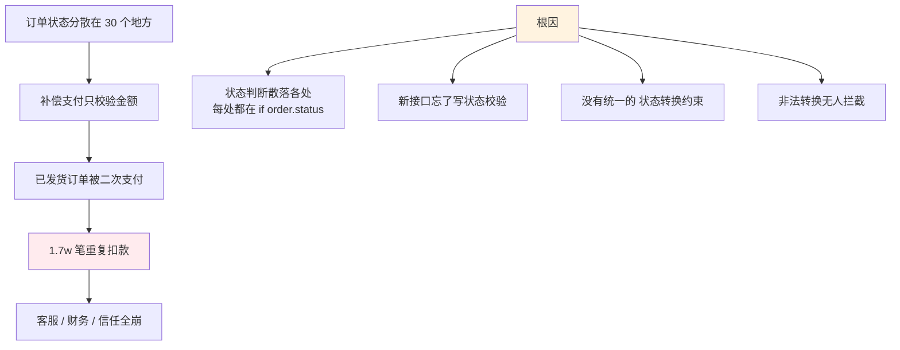

### 1.3 反思状态管理

事后这个团队总结了三个最深刻的教训：

1. **状态判断必须收敛到一处**，分散在 30 个 if-else 里 = 30 个潜在 bug
2. **转换约束必须代码化**，不能靠"开发记得校验"
3. **非法转换必须默认拒绝**，而不是默认允许

状态机的真正价值不是"枚举几个状态"，而是 **"用代码把业务规则变成不可绕过的约束"**。

## 02.状态机是什么

### 2.1 一句话定义

**状态机（State Machine）= 在任意时刻，系统只能处于一个明确状态；状态之间的切换由事件触发，并严格遵循预定义规则。**

用大白话说，状态机就是一个 **"智能开关"**：

- 它**记得**自己当前在哪个状态
- 它**根据**收到的事件 + 当前状态，决定要不要切换、切换到哪
- 它**拒绝**所有不在规则表里的非法切换

以网购订单为例："待支付 → 已支付 → 已发货 → 已收货 → 已完成"，每一步切换都由具体事件（支付/发货/收货）触发，且**只能按预定路径走**。

### 2.2 五元组数学模型

学术上状态机被定义为一个五元组 `(S, Σ, δ, s₀, F)`：

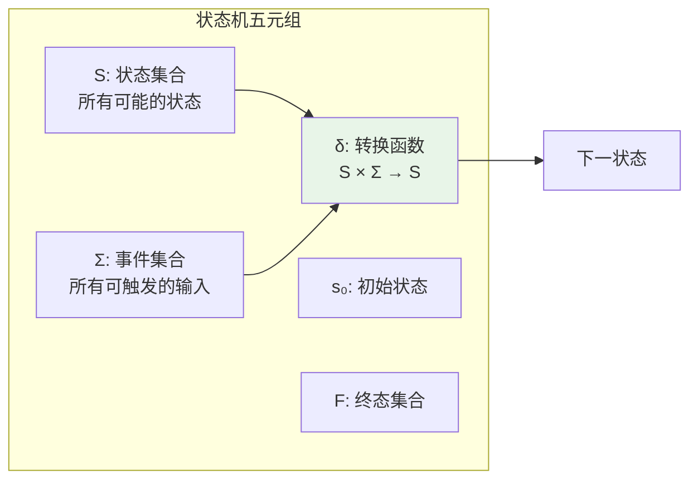

**工程视角的等价表达**：

| 数学符号 | 工程概念 | 订单举例 |
|---|---|---|
| **S** | 状态枚举 | PENDING / PAID / SHIPPED / ... |
| **Σ** | 事件枚举 | PAY / SHIP / CANCEL / ... |
| **δ** | 转换规则表 | (PENDING, PAY) → PAID |
| **s₀** | 初始状态 | PENDING |
| **F** | 终态 | COMPLETED / CANCELLED |

再加上工程实践的两个补充：

- **守卫（Guard）**：转换的前置条件，例如"金额必须足够才能 PAY"
- **动作（Action）**：转换发生时执行的副作用，例如"PAY 成功后扣库存、发短信"

### 2.3 状态机的类型

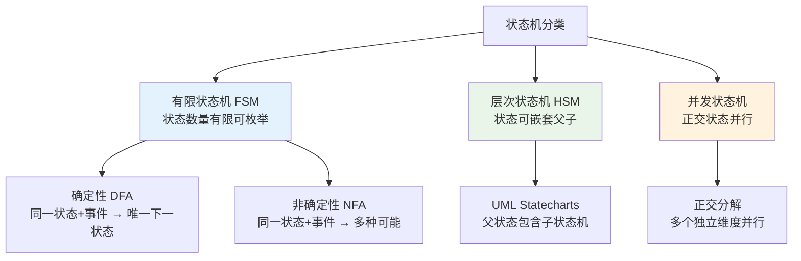

| 类型 | 特点 | 典型场景 |
|---|---|---|
| **DFA 确定性 FSM** | 状态扁平、转换唯一 | 订单 / 工单 / 审批（**90% 业务首选**）|
| **NFA 非确定性 FSM** | 同一输入有多分支 | 词法分析 / 正则引擎 |
| **HSM 层次状态机** | 父子嵌套、行为继承 | 游戏 AI / 嵌入式设备 |
| **并发状态机** | 多维度独立演化 | UI（登录态 × 网络态 × 权限态）|

> **工程经验**：业务系统 90% 用 DFA 就够了，**不要一上来就上 HSM 或并发状态机**，那是杀鸡用牛刀。

### 2.4 状态机六大好处

这是回答"**为什么要用状态机**"的核心：

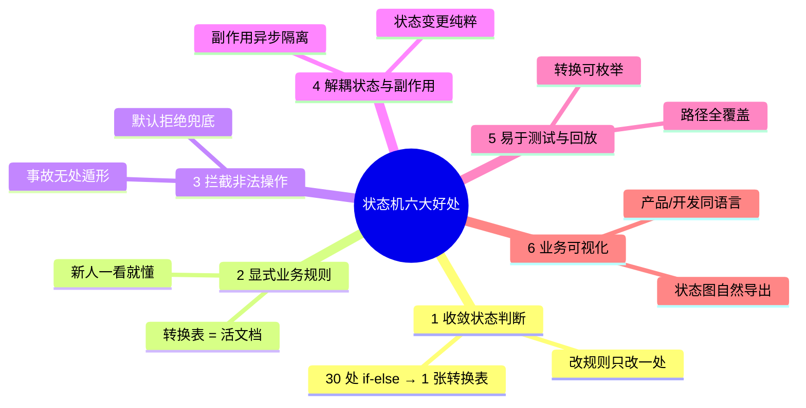

**对照开篇事故**，为什么用状态机就不会出 230 万的事故？

| 事故根因 | 状态机如何免疫 |
|---|---|
| 状态判断散落 30 处 | **好处 1**：所有判断收敛到 `fire(event)` |
| 新人忘了写状态校验 | **好处 3**：默认拒绝，未声明转换直接抛异常 |
| 没人能说清完整规则 | **好处 2**：转换表就是唯一事实来源 |
| 短信失败回滚状态 | **好处 4**：副作用走 MQ，状态变更纯粹 |

## 03.要解决的核心矛盾

### 3.1 状态分散与一致

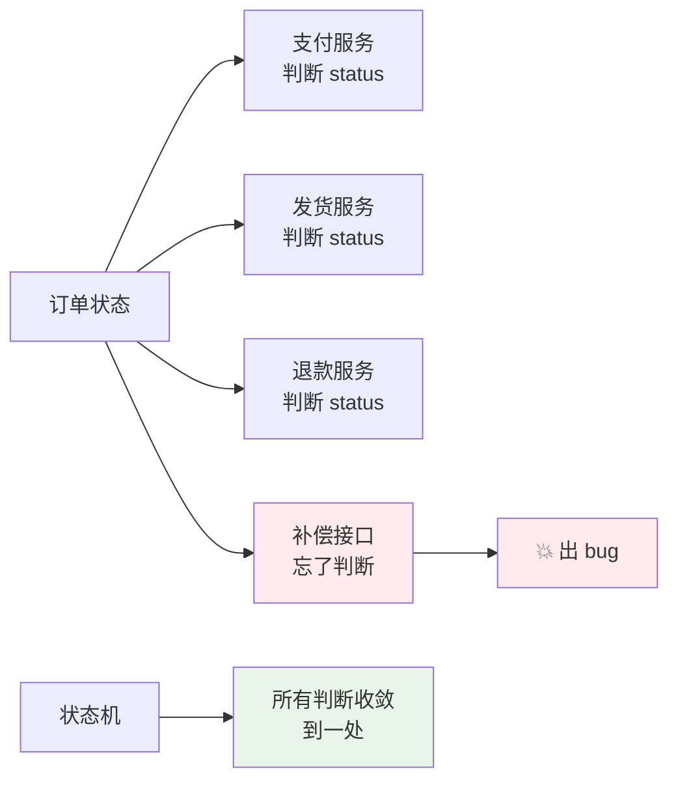

### 3.2 灵活与约束

| 维度 | 灵活（无约束） | 约束（状态机） |
|---|---|---|
| **代码自由度** | 高 | 受限 |
| **业务正确性** | 靠开发自觉 | 系统强制 |
| **新人上手** | 容易出错 | 沿着规则走 |
| **重构风险** | 极高 | 可控 |

### 3.3 简单与扩展

**最常见误区**：业务一上来就上"超复杂状态机框架" → 杀鸡用牛刀。

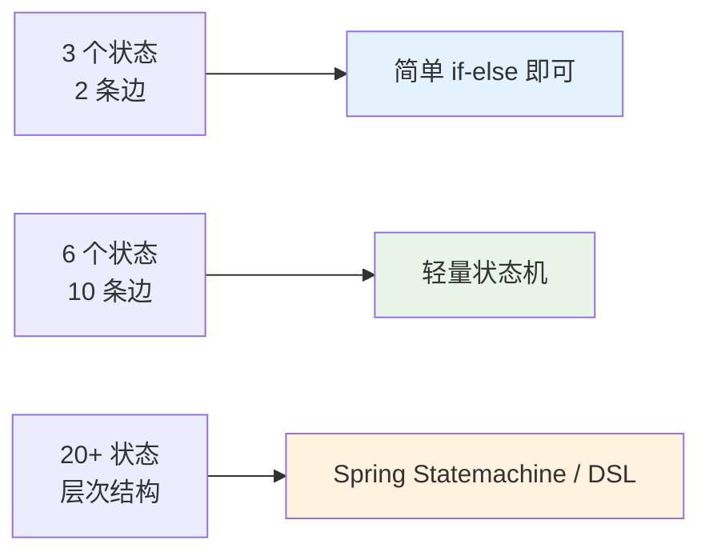

### 3.4 状态机的本质

**状态机 = 把"什么时候可以做什么"显式建模为代码**

它的核心 = **状态 + 事件 + 转换 + 守卫 + 动作** 的五元组。

## 04.业界主流方案

### 4.1 主流实现方式

| 方案 | 描述 | 代表 |
|---|---|---|
| **if-else** | 直接条件判断 | 最朴素 |
| **switch + 转换表** | 集中转换规则 | 中小项目 |
| **状态模式** | 每个状态一个类 | OOP 经典 |
| **状态机框架** | 声明式 DSL | Spring Statemachine / Stateless4j |
| **工作流引擎** | 可视化建模 | Camunda / Activiti |
| **Actor 模型** | 状态 + 消息 | Akka / 游戏引擎 |

### 4.2 横向对比矩阵

| 维度 | if-else | 转换表 | 状态模式 | 状态机框架 | 工作流引擎 |
|---|---|---|---|---|---|
| **学习成本** | 极低 | 低 | 中 | 中 | 高 |
| **代码量** | 极少 | 少 | 中 | 配置 | 配置 |
| **可视化** | ❌ | ❌ | ❌ | ⚠️ | ✅ |
| **运行时改规则** | ❌ | ❌ | ❌ | ⚠️ | ✅ |
| **状态规模** | < 5 | < 20 | < 50 | 任意 | 任意 |
| **典型场景** | 简单流程 | 订单 / 工单 | 复杂业务 | 中后台 | BPM |

### 4.3 选型速查

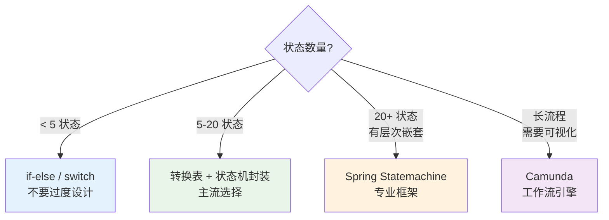

## 05.设计核心原则

### 5.1 状态封闭原则

**铁律**：**状态字段只能由状态机修改，业务代码绝不直接 setStatus**。

```java
// ❌ 反例 - 业务代码直接改状态
order.setStatus(PAID);
orderRepo.save(order);

// ✅ 正确 - 通过状态机触发事件
stateMachine.fire(order, OrderEvent.PAY);
```

### 5.2 转换显式原则

**所有合法转换必须在一处声明**，禁止"代码里偷偷加新转换"。

```java
// 转换规则集中表 - 一目了然
private static final Map<Pair<State, Event>, State> TRANSITIONS = Map.of(
    Pair.of(PENDING, PAY),               PAID,
    Pair.of(PENDING, CANCEL),            CANCELLED,
    Pair.of(PAID, SHIP),                 SHIPPED,
    Pair.of(PAID, CANCEL),               CANCELLED,   // 已支付取消 → 走退款
    Pair.of(SHIPPED, CONFIRM_RECEIPT),   RECEIVED,
    Pair.of(RECEIVED, COMPLETE),         COMPLETED
);
```

### 5.3 默认拒绝原则

**铁律**：**未在转换表里声明的 (状态, 事件) 组合 = 一律拒绝**。

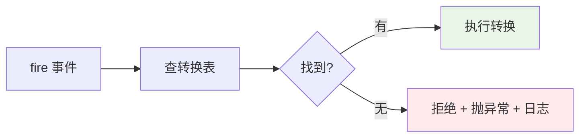

→ 这就是开篇事故的解药：补偿支付如果走状态机，**已发货状态 + PAY 事件**根本查不到映射，直接拒绝。

### 5.4 副作用隔离

**状态转换 ≠ 副作用**，把"改状态"和"做业务（发短信/退款/扣库存）"分离。

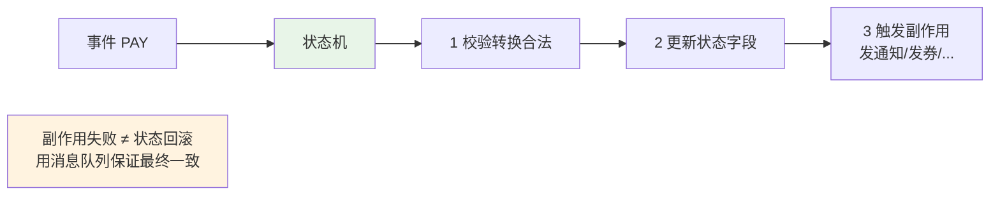

## 06.从普通代码到状态机的演变

这一章回答 **"业务代码是怎么从最朴素的 if-else 一步步长成状态机的"**，把演化过程切片展示，让你看到每一步**解决了什么问题、引入了什么新约束**。

### 6.1 V0 散落式 if-else

**业务起步阶段**，3 个程序员各写各的接口：

```java
// 支付接口 - 张三写
public boolean payOrder(Order order, double amount) {
    if (order.getStatus() != PENDING) return false;   // 状态判断 1
    payService.charge(amount);
    order.setStatus(PAID);
    return true;
}

// 取消接口 - 李四写
public boolean cancelOrder(Order order) {
    OrderStatus s = order.getStatus();
    if (s == PENDING) {                                // 状态判断 2
        order.setStatus(CANCELLED);
    } else if (s == PAID) {                            // 状态判断 3
        refundService.refund(order);
        order.setStatus(CANCELLED);
    } else if (s == SHIPPED) {                         // 状态判断 4
        logisticsService.intercept(order);
        order.setStatus(CANCELLED);
    } else { return false; }
    return true;
}

// 💥 补偿支付 - 王五新人写（开篇事故根因）
public boolean compensatePay(Order order, double amount) {
    // 忘了状态判断！
    payService.charge(amount);
    order.setStatus(PAID);   // 已发货也能改回 PAID → 二次扣款
}
```

**问题画像**：
- 状态判断分散在 N 个接口，**每个新接口都要"记得"写**
- 取消逻辑里 if-else 越来越长，加新状态要改多处
- 没有任何"全局规则总览"，新人无从下手
- **开篇 230 万事故就发生在这一阶段**

### 6.2 V1 集中式状态判断

**第一次抽象**，把状态判断提取成一个工具方法：

```java
public class OrderStatusValidator {
    public static boolean canPay(OrderStatus s)    { return s == PENDING; }
    public static boolean canShip(OrderStatus s)   { return s == PAID; }
    public static boolean canCancel(OrderStatus s) { return s == PENDING || s == PAID || s == SHIPPED; }
}

// 业务接口都调工具
public boolean payOrder(Order order, double amount) {
    if (!OrderStatusValidator.canPay(order.getStatus())) return false;
    // ...
    order.setStatus(PAID);
}
```

**改进点**：
- ✅ 状态判断从 N 处收敛到 1 个工具类
- ✅ 改规则只改 Validator

**仍未解决的问题**：
- ❌ `setStatus(PAID)` **依然散落在每个接口**，状态变更入口不唯一
- ❌ "PENDING + PAY → PAID"这条规则**没有显式声明**，只能从代码推断
- ❌ 副作用（扣款/退款）和状态变更**还混在一起**
- ❌ 新人写接口可能**绕过 Validator** 直接 setStatus

### 6.3 V2 转换表 + 状态机

**真正的状态机**，把"事件 → 状态变更"统一收敛：

```java
public class OrderStateMachine {
    
    // 1️⃣ 显式声明所有合法转换
    private static final Map<Key, OrderState> TRANSITIONS = Map.of(
        new Key(PENDING,  PAY),              PAID,
        new Key(PENDING,  CANCEL),           CANCELLED,
        new Key(PAID,     SHIP),             SHIPPED,
        new Key(PAID,     CANCEL),           CANCELLED,
        new Key(SHIPPED,  CONFIRM_RECEIPT),  RECEIVED,
        new Key(RECEIVED, COMPLETE),         COMPLETED
    );
    
    // 2️⃣ 唯一的状态变更入口
    public OrderState fire(Order order, OrderEvent event) {
        OrderState from = order.getStatus();
        OrderState to = TRANSITIONS.get(new Key(from, event));
        if (to == null) {
            throw new IllegalTransitionException("非法转换: " + from + " + " + event);
        }
        order.setStatus(to);
        eventBus.publish(new OrderTransitionEvent(order, from, to, event));  // 副作用异步
        return to;
    }
    record Key(OrderState state, OrderEvent event) {}
}

// 业务接口极简化
public boolean payOrder(Order order)      { return stateMachine.fire(order, PAY) != null; }
public boolean cancelOrder(Order order)   { return stateMachine.fire(order, CANCEL) != null; }
public boolean compensatePay(Order order) { return stateMachine.fire(order, PAY) != null; }
//                                                    ↑ SHIPPED + PAY 直接抛异常 → 事故免疫
```

**质的飞跃**：
- ✅ **状态变更只有一个入口** `fire()` → 不可能绕过
- ✅ **业务规则全部写在转换表** → 一目了然，就是活文档
- ✅ **默认拒绝** → 新人写新接口想出错都难
- ✅ **副作用异步发出** → 状态变更原子、可靠
- ✅ **新增状态/事件** → 加一行映射 + 加一个枚举值，结束

### 6.4 V3 配置化 DSL

**演化终点**，业务规则频繁变 / 需要运营可配 / 跨多个状态机时：

```yaml
# YAML 配置文件 - 运营可改、不发版
order-state-machine:
  initial: PENDING
  transitions:
    - from: PENDING,  on: PAY,             to: PAID,      action: chargeAndNotify
    - from: PENDING,  on: CANCEL,          to: CANCELLED, action: releaseStock
    - from: PAID,     on: SHIP,            to: SHIPPED,   action: createLogistics
    - from: PAID,     on: CANCEL,          to: CANCELLED, action: refundAndRelease
    - from: SHIPPED,  on: CONFIRM_RECEIPT, to: RECEIVED,  action: startReviewTimer
    - from: RECEIVED, on: COMPLETE,        to: COMPLETED, action: grantPoints
```

或使用 Spring Statemachine、Camunda BPMN 等专业框架，进一步获得可视化建模 / 运行时改规则 / 完整审计回放能力。

**适用阶段**：大型 BPM 平台 / SaaS 工作流 / 状态规模 20+ 且经常变。

> ⚠️ **警告**：V3 的成本远高于 V2，**99% 业务停在 V2 就够了**，盲目上 V3 = 引入下一节的"过度设计反面教材"。

### 6.5 演变路径全景

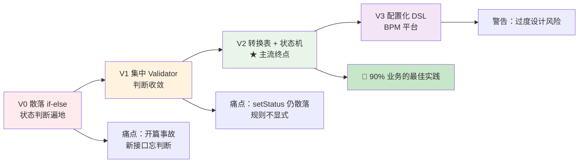

| 版本 | 适用阶段 | 投入成本 | 收益 |
|---|---|---|---|
| **V0** | 仅适合一次性脚本 / Demo | 0 | 短期省事，长期事故源头 |
| **V1** | 业务起步、状态 < 5 | ⭐ | 比 V0 略好 |
| **V2** | **绝大多数中后台业务** | ⭐⭐ | **投产比最高** |
| **V3** | 大型 BPM / 规则常变 | ⭐⭐⭐⭐ | 灵活但复杂 |

> **核心建议**：直接从 V0 跳到 V2，**V1 是过渡形态，没必要专门停留**。除非确认有 V3 的强烈业务诉求（运营可配 / 可视化建模），否则不要上 V3。

## 07.方案落地实战

### 7.1 整体架构

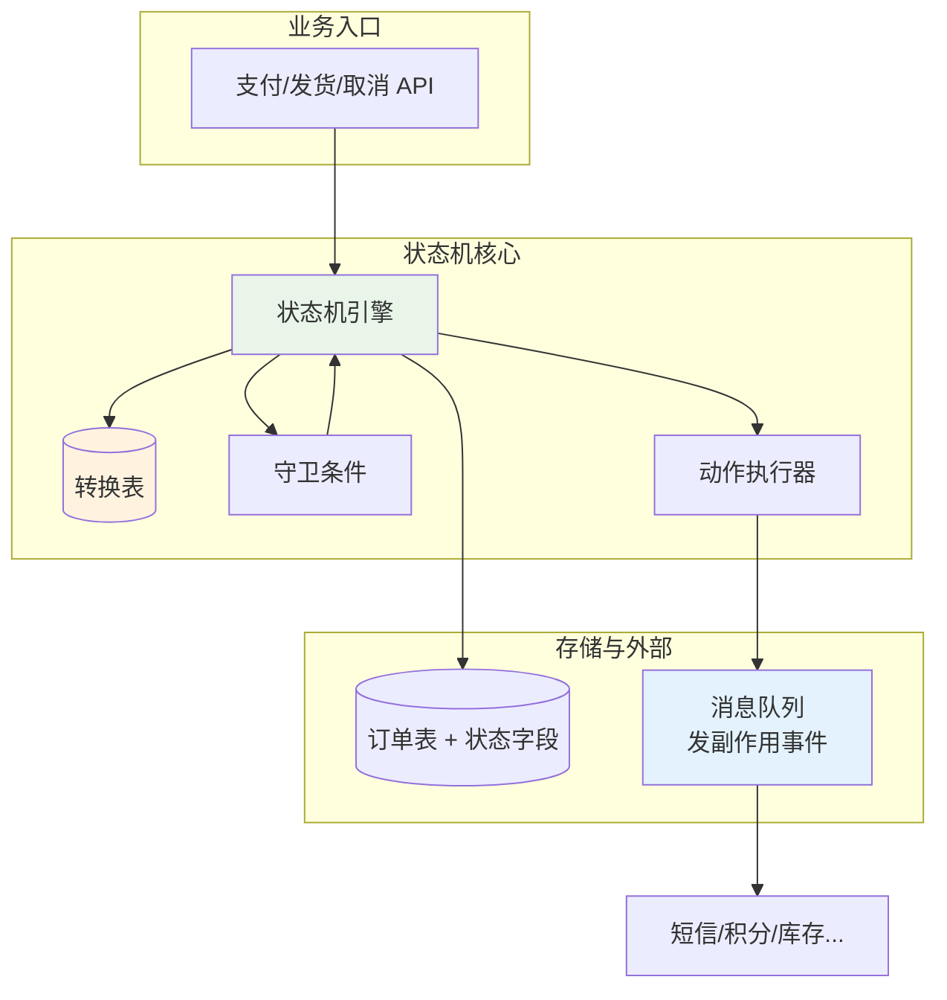

### 7.2 五元组建模

以**订单状态机**为例（保留全文最核心的案例）：

**① 状态枚举**

```java
public enum OrderState {
    PENDING,    // 待支付 - 初始
    PAID,       // 已支付
    SHIPPED,    // 已发货
    RECEIVED,   // 已收货
    COMPLETED,  // 已完成 - 终态
    CANCELLED   // 已取消 - 终态
}
```

**② 事件枚举**

```java
public enum OrderEvent {
    PAY, SHIP, CANCEL, CONFIRM_RECEIPT, COMPLETE
}
```

**③ 转换规则表**

| 当前状态 | 事件 | 目标状态 | 副作用 |
|---|---|---|---|
| PENDING | PAY | PAID | 扣款 + 通知 |
| PENDING | CANCEL | CANCELLED | 释放库存 |
| PAID | SHIP | SHIPPED | 创建物流单 |
| PAID | CANCEL | CANCELLED | **退款** + 释放库存 |
| SHIPPED | CONFIRM_RECEIPT | RECEIVED | 启动评价定时器 |
| RECEIVED | COMPLETE | COMPLETED | 发积分 + 归档 |

**④ 状态转换图**

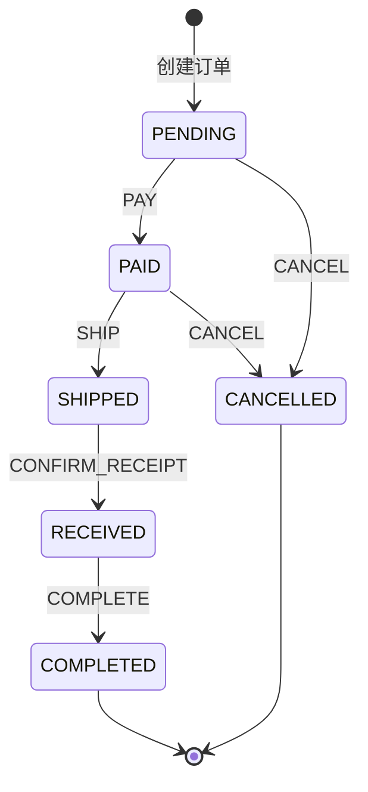

### 7.3 状态机重构核心

**核心思路**：**所有状态变更必走 `fire(event)`**。

```java
public class OrderStateMachine {
    
    // 转换规则表 - 唯一的事实来源
    private static final Map<Key, OrderState> TRANSITIONS = Map.of(
        new Key(PENDING,  PAY),              PAID,
        new Key(PENDING,  CANCEL),           CANCELLED,
        new Key(PAID,     SHIP),             SHIPPED,
        new Key(PAID,     CANCEL),           CANCELLED,
        new Key(SHIPPED,  CONFIRM_RECEIPT),  RECEIVED,
        new Key(RECEIVED, COMPLETE),         COMPLETED
    );
    
    /**
     * 唯一的状态变更入口
     */
    public OrderState fire(Order order, OrderEvent event) {
        OrderState from = order.getStatus();
        OrderState to = TRANSITIONS.get(new Key(from, event));
        
        // 默认拒绝
        if (to == null) {
            throw new IllegalTransitionException(
                String.format("非法转换: %s + %s", from, event));
        }
        
        // 执行转换 + 副作用（解耦发到 MQ）
        order.setStatus(to);
        orderRepo.save(order);
        eventBus.publish(new OrderTransitionEvent(order, from, to, event));
        
        log.info("Order[{}] {} --{}--> {}", order.getId(), from, event, to);
        return to;
    }
    
    record Key(OrderState state, OrderEvent event) {}
}

// 业务代码极简
public class OrderService {
    public void payOrder(Order order)    { stateMachine.fire(order, PAY); }
    public void shipOrder(Order order)   { stateMachine.fire(order, SHIP); }
    public void cancelOrder(Order order) { stateMachine.fire(order, CANCEL); }
    
    // 💡 补偿支付？同样走状态机 → 已发货状态根本走不通
    public void compensatePay(Order order) { 
        stateMachine.fire(order, PAY);  // SHIPPED + PAY 直接抛异常
    }
}
```

**重构后开篇事故自动免疫**：补偿支付在已发货状态调 `fire(order, PAY)` → 转换表查不到 → 异常拒绝。

### 7.4 转换流程

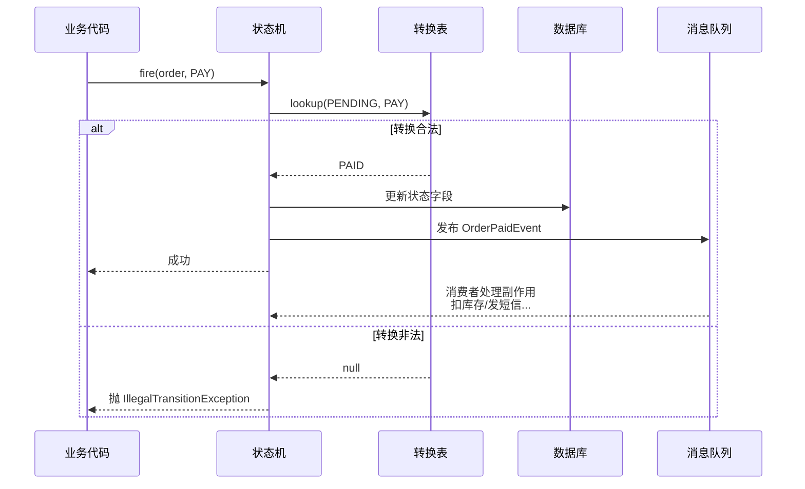

## 08.关键问题解决

### 8.1 状态爆炸

**典型场景**：登录(4) × 权限(4) × 网络(4) = 64 状态，直接爆炸。

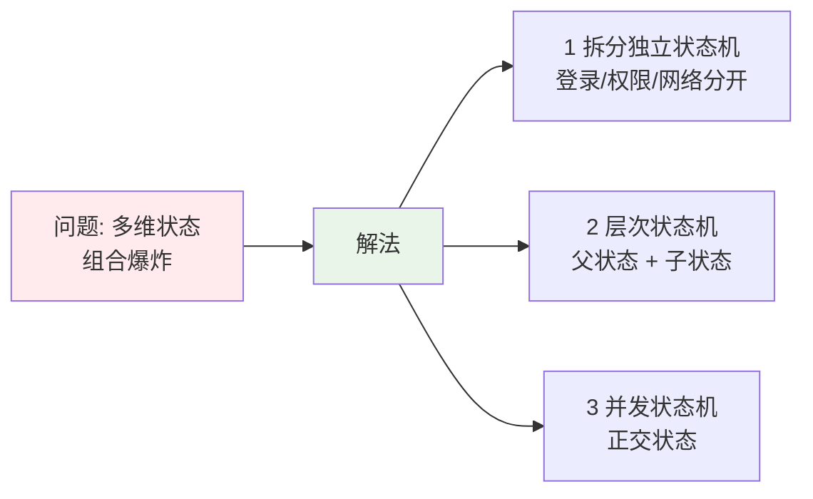

**实战经验**：单个状态机超过 10 个状态就要考虑**拆分**。

### 8.2 状态持久化

**关键问题**：进程重启 / 多机部署 → 状态在哪？

```yaml
方案 1: 状态字段持久化（最常用）
    在业务表加 status 字段
    优点: 简单、和业务一体
    缺点: 历史轨迹查不到

方案 2: 状态 + 事件流持久化
    业务表 status + 独立事件表
    优点: 可审计、可回放
    缺点: 多写一张表

方案 3: 事件溯源（Event Sourcing）
    只存事件、状态由事件回放得到
    优点: 完整历史
    缺点: 复杂、查询麻烦
```

### 8.3 并发与幂等

**真实坑**：用户**双击"支付按钮"** → 两个请求同时进 `fire(PAY)` → 都通过校验 → **状态被改两次** + 扣款两次。

```java
// ✅ 用 CAS 乐观锁保证只有一次成功
public OrderState fire(Order order, OrderEvent event) {
    OrderState from = order.getStatus();
    OrderState to = TRANSITIONS.get(new Key(from, event));
    if (to == null) throw new IllegalTransitionException(...);
    
    // CAS: 只有 status = from 时才能改成 to
    int updated = orderRepo.updateStatusCAS(order.getId(), from, to);
    if (updated == 0) {
        throw new ConcurrentTransitionException("状态已被其他请求修改");
    }
    
    eventBus.publish(...);
    return to;
}
```

```sql
-- CAS SQL
UPDATE orders SET status = ?, version = version + 1 
WHERE id = ? AND status = ?
```

## 09.常见陷阱与反例

### 9.1 状态散布反例

**反例**：30 个文件里都有 `if (order.status == ...)` → 加新状态要改 30 处 → 必漏。

**教训**：
- 状态判断**收敛到状态机**
- 业务代码只调 `fire(event)`，不直接读 status 做分支

### 9.2 副作用混入反例

**反例**：在状态机内部直接发短信 / 调支付 → 短信失败导致状态回滚 → 数据错乱。

**教训**：
- 状态机只负责**改状态字段**
- 副作用**异步发出**（MQ / 事件总线）
- 副作用失败不影响状态变更

### 9.3 过度设计反面教材

**真实案例**：某创业公司做内部审批系统，**只有 3 个状态、2 条转换线**：

```text
DRAFT --提交--> SUBMITTED --审批通过--> APPROVED
                          --审批驳回--> DRAFT
```

技术负责人为了"显得专业"，决定上 Spring Statemachine + XML 配置：

```xml
<!-- 50+ 行 XML 配置 -->
<state-machine id="approvalMachine" initial-state="DRAFT">
    <state id="DRAFT"/>
    <state id="SUBMITTED"/>
    <state id="APPROVED" final="true"/>
    <transitions>
        <transition source="DRAFT"     target="SUBMITTED" event="SUBMIT"/>
        <transition source="SUBMITTED" target="APPROVED"  event="APPROVE"/>
        <transition source="SUBMITTED" target="DRAFT"     event="REJECT"/>
    </transitions>
    <!-- 还有一堆 listener / action / guard 配置 -->
</state-machine>
```

**结果**：
- ❌ 引入框架后**项目代码量从 50 行膨胀到 500 行**
- ❌ 团队没人懂 Spring Statemachine 调试 → 出 bug 排查 3 天
- ❌ 新人入职第一周 = 学框架，**学不会还不敢动审批模块**
- ❌ 加一个新状态 → 要改 XML + 监听器 + 守卫类 + 单测，**比 if-else 慢 5 倍**
- ❌ 半年后接手的团队怒了，**直接删掉框架，回到 30 行 switch-case**

```java
// 后来重写的版本 - 30 行搞定
public class ApprovalMachine {
    private static final Map<Key, Status> T = Map.of(
        new Key(DRAFT,     SUBMIT),  SUBMITTED,
        new Key(SUBMITTED, APPROVE), APPROVED,
        new Key(SUBMITTED, REJECT),  DRAFT
    );
    public Status fire(Approval a, Event e) {
        Status to = T.get(new Key(a.getStatus(), e));
        if (to == null) throw new IllegalStateException();
        a.setStatus(to);
        return to;
    }
}
```

**血泪教训**：

| 误区 | 真相 |
|---|---|
| "框架显得专业" | **专业 ≠ 复杂**，简单解决问题才专业 |
| "万一以后要扩展呢" | YAGNI 原则，**等真要扩展再演进**，提前设计 99% 是过度设计 |
| "状态机 = 一定要用框架" | V2 的 30 行手写代码已经是状态机了 |
| "可视化建模很酷" | **3 个状态根本不需要可视化** |

> ⚠️ **过度使用状态机的危害**：增加学习成本、增加调试难度、增加维护负担、降低开发速度，**性价比为负**。

### 9.4 何时不要用状态机

**反向决策**，下列情况坚决不要上状态机：

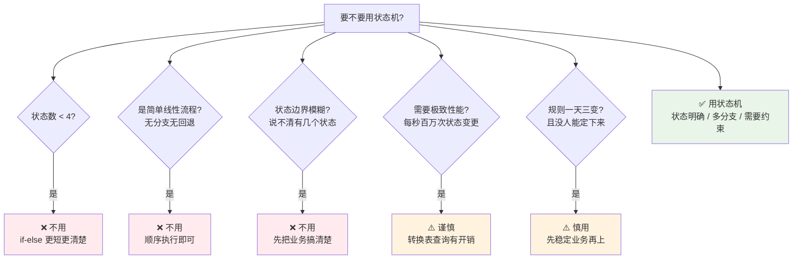

| 不用状态机的场景 | 理由 | 替代方案 |
|---|---|---|
| **状态 < 4 个** | 引入状态机的脚手架成本 > 收益 | if-else / switch |
| **简单线性流程** | 无回退、无分支，顺序执行即可 | 直接顺序代码 |
| **状态边界模糊** | 状态机要求"互斥且穷尽"，模糊状态会越绕越乱 | 先做业务建模 |
| **极致性能场景** | Map 查询 + 异常抛出有开销 | 直接判断或位运算 |
| **业务规则未稳定** | 频繁改状态机比改 if-else 还痛苦 | 先 if-else 跑通 |

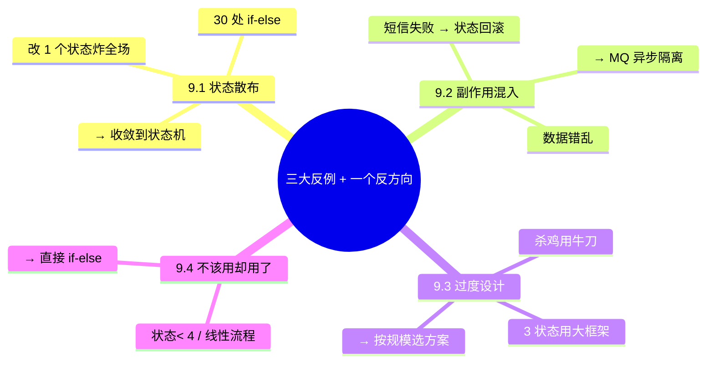

## 10.总结与决策

### 10.1 上线检查表

状态机方案上线前对照：

- [ ] 状态枚举完整（含初始态、终态）
- [ ] 事件枚举完整
- [ ] 转换规则表集中声明（一处事实来源）
- [ ] 唯一 `fire(event)` 入口
- [ ] 业务代码不直接 setStatus
- [ ] 默认拒绝（未声明的 (状态, 事件) 抛异常）
- [ ] CAS 乐观锁防并发
- [ ] 副作用异步化（MQ / 事件总线）
- [ ] 状态变更日志（可审计）
- [ ] 单元测试覆盖所有合法 + 非法转换
- [ ] 监控（非法转换告警、状态分布）
- [ ] 文档（状态图同步更新）

### 10.2 选型决策树

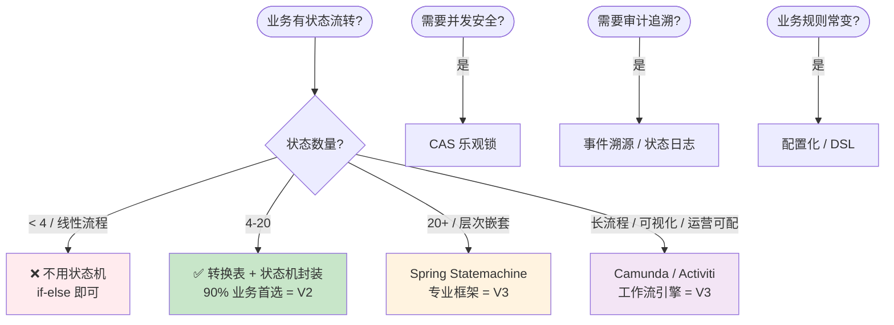

**最后一句话**：状态机不是"高大上的架构"，而是 **"把业务规则变成代码强制约束"** 的最小武器。开篇 1.7 万笔重复扣款的根因，不是技术不行，是**状态规则没收敛、新接口忘校验**，而状态机能让"忘校验"从根本上不可能发生。

> 好的状态机 = **状态封闭、转换显式、默认拒绝、副作用隔离**。
> 
> 但更重要的是，**不要为了用状态机而用状态机**：3 个状态用 30 行手写转换表就够了，引入大框架反而是事故的另一个源头。
