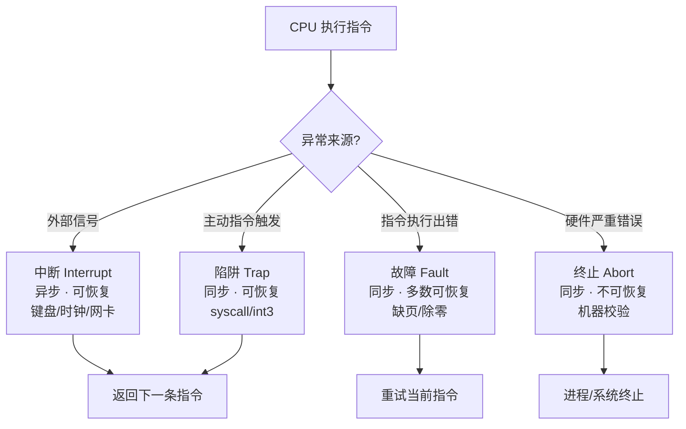
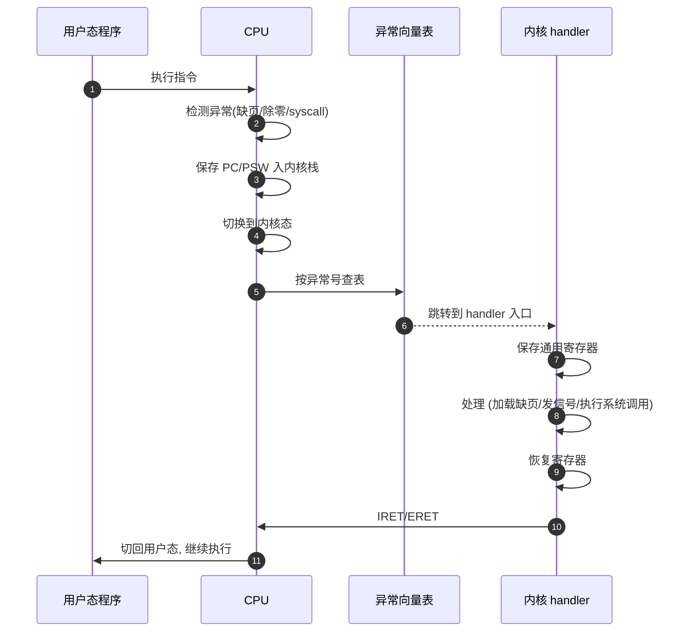
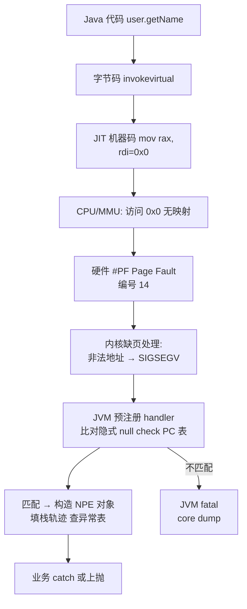

# 11.计算机异常处理机制
#### 目录介绍
- [01.工作案例引入](#01工作案例引入)
  - [1.1 进程没死服务不可用](#11-进程没死服务不可用)
  - [1.2 初步结论](#12-初步结论)
  - [1.3 本文要回答的问题](#13-本文要回答的问题)
- [02.异常的基本概念](#02异常的基本概念)
  - [2.1 什么是异常](#21-什么是异常)
  - [2.2 为何需要异常机制](#22-为何需要异常机制)
  - [2.3 异常与中断关系](#23-异常与中断关系)
- [03.异常的分类](#03异常的分类)
  - [3.1 中断（外部异常）](#31-中断外部异常)
  - [3.2 陷阱（Trap）](#32-陷阱trap)
  - [3.3 故障（Fault）](#33-故障fault)
  - [3.4 终止（Abort）](#34-终止abort)
  - [3.5 四种异常对比](#35-四种异常对比)
- [04.异常处理流程](#04异常处理流程)
  - [4.1 硬件层面的处理](#41-硬件层面的处理)
  - [4.2 软件层面的处理](#42-软件层面的处理)
  - [4.3 异常向量表](#43-异常向量表)
  - [4.4 异常嵌套](#44-异常嵌套)
- [05.常见异常场景](#05常见异常场景)
  - [5.1 缺页异常](#51-缺页异常)
  - [5.2 除零异常](#52-除零异常)
  - [5.3 段错误](#53-段错误)
  - [5.4 系统调用](#54-系统调用)
- [06.硬件到语言异常](#06硬件到语言异常)
  - [6.1 硬件与软件异常](#61-硬件与软件异常)
  - [6.2 C语言信号机制](#62-c语言信号机制)
  - [6.3 Java的异常机制](#63-java的异常机制)
  - [6.4 异常处理的代价](#64-异常处理的代价)
- [07.异常与系统安全](#07异常与系统安全)
  - [7.1 特权级别与异常](#71-特权级别与异常)
  - [7.2 栈溢出攻击原理](#72-栈溢出攻击原理)
  - [7.3 现代防护机制](#73-现代防护机制)
- [08.综合案例NPE之旅](#08综合案例npe之旅)
  - [8.1 7层接力图](#81-7层接力图)
  - [8.2 每层做了什么](#82-每层做了什么)
  - [8.3 若JVM不包SIGSEGV](#83-若jvm不包sigsegv)
  - [8.4 回到开头案例](#84-回到开头案例)
- [09.思考题与作业](#09思考题与作业)
  - [9.1 基础理解题](#91-基础理解题)
  - [9.2 进阶思考题](#92-进阶思考题)
  - [9.3 动手作业](#93-动手作业)


## 01.工作案例引入

### 1.1 进程没死服务不可用

Java 后端同学小郭接到线上告警：某个推送服务的 QPS 突然降为 0，但进程依然"活着"、健康检查返回 200、CPU 很低、内存也正常。`jstack` 一看，Tomcat 工作线程都卡在一个奇怪的位置：

```
"http-nio-8080-exec-23" #45 waiting on condition
  java.lang.Thread.State: WAITING (parking)
  at sun.misc.Unsafe.park(Native Method)
  at java.util.concurrent.locks.LockSupport.park(LockSupport.java:175)
  at java.util.concurrent.FutureTask.awaitDone(FutureTask.java:429)
  ...
  at com.xxx.PushService.handle(PushService.java:142)
```

小郭再往下翻，在 `jstack` 输出的末尾发现一行关键日志：

```
SIGSEGV (0xb) at pc=0x00007f8a1b2c6d58, pid=1234, tid=0x00007f89f8021700
# Problematic frame: # C  [libnative.so+0x12d58]
# core dump written
```

原来是**一个业务用到的 JNI 本地库段错误崩了**，按理说 SIGSEGV 应该让整个 JVM 直接挂掉；但这个项目为了"稳"，在 JVM 启动参数加了 `-Xrs` 并自实现了 `SIGSEGV` 处理器，导致：

1. JVM 捕获了 SIGSEGV，但本地库的内部状态已经错乱；
2. JNI 调用再也不返回，调用它的 Java 线程永远 `park` 在 Future 上；
3. 进程没死，线程池耗尽 → 所有请求排队 → 外部看起来服务"完全卡住"。

修复两件事：

- 移除 `-Xrs`、让 JVM 在致命 SIGSEGV 时该死就死，配合 K8s 自动拉起；
- JNI 调用加超时和 circuit breaker，避免被 native 的故障拖死。

### 1.2 初步结论

这次事故让小郭明白了三件事：

1. **硬件异常（SIGSEGV）→ 操作系统信号 → JVM 信号处理器 → Java 线程状态**，这是一条完整的调用链，中间任何一层"吞了"异常，上层都会出现诡异的表现。
2. **`NullPointerException` 在 Java 里"长得很温柔"，但它底层很多时候就是一次 SIGSEGV**：JVM 先让 CPU 去访问 `null`，然后内核给 JVM 发 SIGSEGV，JVM 再转成 NPE 抛出来。
3. **异常不是一个单纯的语言概念**，它是 **CPU → OS → 语言运行时 → 业务代码** 四层共同演出的剧本。

### 1.3 本文要回答的问题

- 异常和中断到底什么区别？Trap、Fault、Abort、Interrupt 这四个词分别指什么？
- CPU 检测到异常后，硬件自动做了哪些事？软件接管后又要做哪些事？
- 缺页异常为什么可以"修好再重试"？程序为啥感知不到？
- Java 的 `NullPointerException` 和 C 的段错误，底层的机制是不是同一回事？
- 为什么"用 try-catch 做流程控制"会被 Code Review 打回？
- 栈溢出攻击、Stack Canary、NX、ASLR 这些安全机制和异常有什么关系？

文末我们用一次 `obj.getName()` 的 NPE 把上述概念串联起来。


## 02.异常的基本概念

### 2.1 什么是异常

异常（Exception）是指CPU在执行指令过程中遇到的各种意外事件，需要暂停当前程序的正常执行流程，转去处理这些事件。

**疑惑：CPU不是只会按顺序取指令、执行指令吗？为什么会有"意外"？**

**答疑**：程序运行并不总是一帆风顺的。

```
意外情况举例：
  ① 你在算 10 ÷ 0 → 除零错误，CPU不知道结果是什么
  ② 程序要访问的数据不在内存中（在硬盘上）→ 缺页
  ③ 外面有人按了键盘 → 需要及时响应
  ④ 程序执行了非法指令 → 不能继续
  ⑤ 程序主动请求操作系统服务 → 系统调用

这些情况都需要打断CPU的正常执行流程
```

### 2.2 为何需要异常机制

如果没有异常机制：

```
没有异常的世界：
  程序除以零 → CPU不知道怎么办 → 继续执行 → 数据全部错乱
  程序访问非法地址 → 破坏其他程序的数据 → 系统崩溃
  键盘按键 → 没人理 → 电脑变"死机"

有了异常机制：
  程序除以零 → CPU检测到 → 通知操作系统 → 操作系统杀死出错程序
  程序访问非法地址 → CPU拒绝 → 报段错误 → 只有出错程序被终止
  键盘按键 → 产生中断 → 操作系统及时处理

异常机制是操作系统能够管理和保护系统的基础！
```

### 2.3 异常与中断关系

```
广义上"异常"包含所有打断正常执行的事件：

              异常（广义）
           ┌──────┴──────┐
       同步异常           异步异常
    （由指令执行触发）   （由外部事件触发）
    ┌────┬────┐              │
  陷阱  故障  终止          中断
 Trap  Fault  Abort     Interrupt

同步：执行到某条指令时必然发生（可预期）
异步：随时可能发生，与当前指令无关（不可预期）
```


## 03.异常的分类

### 3.1 中断（外部异常）

中断是由CPU外部的事件触发的，与当前执行的指令无关。

```
来源：外部I/O设备
特点：异步（什么时候发生不确定）
处理后：返回到被中断的下一条指令继续执行

例子：
  ① 键盘按键 → 键盘中断
  ② 网卡收到数据 → 网络中断
  ③ 定时器到期 → 时钟中断（操作系统用这个来做进程调度）
  ④ DMA传输完成 → DMA中断
```

### 3.2 陷阱（Trap）

陷阱是程序有意触发的异常。

```
来源：特定的指令（如INT、SVC、SYSCALL）
特点：同步、有意为之
处理后：返回到触发指令的下一条指令

最典型的应用——系统调用：
  用户程序想要读文件，但没有权限直接操作硬盘
  → 执行 syscall 指令，触发陷阱
  → CPU切换到内核态
  → 操作系统代替程序完成文件读取
  → 返回用户程序

类比：你在银行柜台取钱
  你不能自己去金库拿钱（没权限）
  而是填一张取款单交给柜员（系统调用）
  柜员替你去金库取钱（内核态操作）
  然后把钱给你（返回结果）
```

### 3.3 故障（Fault）

故障是执行指令时遇到的错误条件，**可能可以修复**。

```
来源：指令执行过程中检测到的错误
特点：同步、可能可恢复
处理后：
  如果修复成功 → 重新执行触发故障的那条指令
  如果无法修复 → 终止程序

最典型的例子——缺页异常（Page Fault）：
  程序访问一个虚拟地址，但对应的数据不在物理内存中
  → 触发缺页异常
  → 操作系统从磁盘把数据加载到内存
  → 更新页表
  → 重新执行那条访存指令
  → 这次成功了！
  
  这是一个"修复成功"的故障，程序感知不到这个过程
```

### 3.4 终止（Abort）

终止是不可恢复的严重错误。

```
来源：硬件故障或严重的指令错误
特点：同步、不可恢复
处理后：操作系统强制终止程序（甚至系统崩溃）

例子：
  ① 奇偶校验错误（内存位翻转）
  ② 机器校验异常（CPU内部错误）
  ③ 双重故障（处理故障时又发生故障）
```

### 3.5 四种异常对比

| 类型 | 触发原因 | 同步/异步 | 可恢复 | 返回位置 | 典型例子 |
|------|---------|----------|--------|---------|---------|
| 中断 | 外部I/O设备 | 异步 | 是 | 下一条指令 | 键盘按键、时钟 |
| 陷阱 | 执行特定指令 | 同步 | 是 | 下一条指令 | 系统调用 |
| 故障 | 指令执行出错 | 同步 | 可能 | 当前指令（重试） | 缺页异常 |
| 终止 | 严重硬件错误 | 同步 | 否 | 不返回 | 机器校验 |

用一张 mermaid 图把这四类异常放在一起看，差异更直观：




## 04.异常处理流程

### 4.1 硬件层面的处理

```
CPU检测到异常后的硬件自动操作：

  ① 确定异常类型和编号
  ② 保存当前执行状态：
     - 将PC（程序计数器）压入内核栈
     - 将PSW（程序状态字）压入内核栈
     - 保存异常原因信息
  ③ 切换特权级别：用户态 → 内核态
  ④ 根据异常编号查找异常向量表，获取处理程序入口
  ⑤ 跳转到异常处理程序

这些操作都是CPU硬件自动完成的，不需要软件参与！
```

"硬件阶段 → 软件阶段 → 返回用户态"这条完整处理链路，用 mermaid 表达如下：



### 4.2 软件层面的处理

```
操作系统的异常处理程序：

  ① 保存更多的寄存器状态
  ② 判断异常类型和原因
  ③ 执行对应的处理逻辑：
     - 缺页？→ 从磁盘加载数据到内存
     - 除零？→ 给进程发送SIGFPE信号
     - 系统调用？→ 执行请求的内核功能
  ④ 恢复寄存器状态
  ⑤ 执行异常返回指令（IRET/ERET）
     - 恢复PC和PSW
     - 切换回用户态
     - 继续执行用户程序
```

### 4.3 异常向量表

```
异常向量表（Interrupt/Exception Vector Table）：
  一个由CPU预定义的表，每个异常类型对应一个入口地址。

x86 前32个异常（CPU预留）：
  编号  异常                   类型
   0   除零异常（#DE）         故障
   1   调试异常（#DB）         故障/陷阱
   3   断点（#BP）             陷阱
   6   非法指令（#UD）         故障
   8   双重故障（#DF）         终止
  13   通用保护故障（#GP）      故障
  14   缺页异常（#PF）         故障
  
  32-255：由操作系统和设备驱动定义
  如：32=时钟中断, 33=键盘中断...
```

### 4.4 异常嵌套

**疑惑：处理异常的时候又发生异常怎么办？**

```
场景：正在处理键盘中断时，时钟中断来了

方案1：禁止嵌套
  处理异常时关中断，处理完再开中断
  简单但可能错过紧急中断

方案2：允许嵌套（现代CPU采用）
  高优先级异常可以打断低优先级异常的处理
  每次嵌套都保存上一层的执行状态到栈中
  
  正常执行 → [键盘中断] → 处理键盘 → [时钟中断!] → 处理时钟
                                            ↓
                                        处理完时钟
                                            ↓
                                        继续处理键盘
                                            ↓
                                        处理完键盘
                                            ↓
                                        恢复正常执行
```


## 05.常见异常场景

### 5.1 缺页异常

这是操作系统最核心的异常之一，使得虚拟内存机制成为可能。

```
缺页异常的完整过程：

1. 程序执行: LOAD R1, [0x12345678]
2. CPU查页表: 虚拟地址 0x12345678 → 页表项标记为"不在内存"
3. 触发缺页异常（#PF, 编号14）
4. 操作系统的缺页处理程序接管：
   a. 检查这个地址是否合法（在进程的地址空间内？）
      - 不合法 → 发送SIGSEGV信号（段错误），终止进程
      - 合法 → 继续处理
   b. 找到数据在磁盘上的位置
   c. 如果物理内存已满，选择一个页换出到磁盘
   d. 将目标页从磁盘读入物理内存
   e. 更新页表，将虚拟地址映射到新的物理地址
5. 异常返回，CPU重新执行LOAD指令
6. 这次页表查找成功，顺利读取数据

整个过程对程序是透明的！程序不知道数据原本不在内存中。
```

### 5.2 除零异常

```c
// C语言除零
int a = 10;
int b = 0;
int c = a / b;  // CPU执行DIV指令时检测到除数为0

// CPU层面：
//   执行 DIV 指令
//   检测到除数为0
//   触发 #DE 异常（编号0）
//   操作系统收到异常
//   向当前进程发送 SIGFPE 信号
//   默认处理：终止进程，打印 "Floating point exception"

// Java层面：
//   JVM捕获SIGFPE信号
//   将其转换为 ArithmeticException
//   沿调用栈向上传播
//   如果有catch捕获，执行catch块
//   如果没有catch，终止线程
```

### 5.3 段错误

```
段错误（Segmentation Fault）是程序员最常见的错误之一。

触发原因：
  ① 访问空指针（地址0附近被操作系统保护）
  ② 访问已释放的内存
  ③ 数组越界访问
  ④ 栈溢出（递归太深）
  ⑤ 写入只读内存（如修改字符串常量）
```

```c
// 各种段错误示例
// ① 空指针
int *p = NULL;
*p = 42;  // 段错误！访问地址0

// ② 释放后使用
int *p = malloc(sizeof(int));
free(p);
*p = 42;  // 段错误（未必立即崩溃，但属于未定义行为）

// ③ 栈溢出
void infinite() {
    int arr[10000]; // 每次调用占用40KB栈空间
    infinite();     // 无限递归
}                   // 很快栈空间耗尽 → 段错误
```

### 5.4 系统调用

```
系统调用是用户程序与操作系统内核之间的接口。

Linux 常见系统调用：
  编号  名称     功能
   0   read     读文件
   1   write    写文件
   2   open     打开文件
   3   close    关闭文件
  39   getpid   获取进程ID
  57   fork     创建子进程
  59   execve   执行程序
  60   exit     退出进程

系统调用的完整过程：
  ① 用户程序设置参数（系统调用号放入EAX，参数放入其他寄存器）
  ② 执行 syscall/int 0x80 指令
  ③ CPU触发陷阱，切换到内核态
  ④ 内核根据系统调用号找到对应的处理函数
  ⑤ 执行内核功能
  ⑥ 将结果放入EAX
  ⑦ 执行 sysret/iret 返回用户态
```


## 06.硬件到语言异常

### 6.1 硬件与软件异常

```
硬件异常（CPU层面）：
  由CPU硬件检测和触发
  通过中断向量表路由到处理程序
  处理过程涉及特权级切换
  例：缺页、除零、非法指令

软件异常（编程语言层面）：
  由程序代码主动抛出
  通过语言运行时的异常机制传播
  不涉及CPU特权级切换
  例：Java的NullPointerException、Python的ValueError

关系：
  某些软件异常的底层实现依赖硬件异常
  Java的NullPointerException → 底层就是段错误(SIGSEGV)
  Java的ArithmeticException → 底层就是除零异常(SIGFPE)
  JVM捕获硬件异常信号，包装成Java异常对象
```

### 6.2 C语言信号机制

```c
#include <signal.h>
#include <stdio.h>

// 自定义信号处理函数
void handle_segfault(int sig) {
    printf("捕获到段错误信号！\n");
    // 注意：实际中很难从段错误中恢复
    exit(1);
}

int main() {
    // 注册信号处理函数
    signal(SIGSEGV, handle_segfault);
    
    int *p = NULL;
    *p = 42;  // 触发段错误 → 操作系统发送SIGSEGV → 调用handle_segfault
    
    return 0;
}
```

### 6.3 Java的异常机制

```java
// Java异常的底层原理
try {
    int[] arr = new int[10];
    arr[100] = 42;  // 数组越界
    
    // JVM层面发生了什么：
    // 1. JVM检查数组边界（纯软件检查，不触发硬件异常）
    // 2. 发现越界
    // 3. 创建 ArrayIndexOutOfBoundsException 对象
    // 4. 沿调用栈查找匹配的catch块
    
} catch (ArrayIndexOutOfBoundsException e) {
    System.out.println("数组越界: " + e.getMessage());
}

// Java异常的实现机制：
// 1. 编译器在class文件中生成"异常表"
// 2. 异常表记录：[起始PC, 结束PC, 处理器PC, 异常类型]
// 3. 抛异常时，JVM在异常表中查找匹配的处理器
// 4. 找到 → 跳转到处理器PC
// 5. 没找到 → 沿调用栈向上传播（方法返回），在上层方法的异常表中继续查找
```

### 6.4 异常处理的代价

```
异常处理的成本：
  硬件异常（如缺页）：~10000 时钟周期
  系统调用：~1000 时钟周期
  Java try-catch（无异常发生时）：几乎零成本
  Java throw（抛出异常时）：~数千时钟周期（构建栈追踪信息）

结论：
  不要用异常做流程控制！
  
  // 错误：把异常当if用
  try {
      value = map.get(key);
  } catch (NullPointerException e) {
      value = defaultValue;
  }
  
  // 正确：先检查再操作
  if (map.containsKey(key)) {
      value = map.get(key);
  } else {
      value = defaultValue;
  }
```


## 07.异常与系统安全

### 7.1 特权级别与异常

```
x86 CPU 有4个特权级别（Ring 0-3）：
  Ring 0：内核态（最高权限）→ 操作系统内核
  Ring 1：保留
  Ring 2：保留
  Ring 3：用户态（最低权限）→ 应用程序

异常是用户态进入内核态的"合法入口"：
  系统调用（陷阱）→ Ring 3 → Ring 0
  缺页异常（故障）→ Ring 3 → Ring 0

如果用户程序试图执行内核态才能执行的特权指令：
  → 触发 #GP（通用保护故障）
  → 操作系统终止该程序
  → 保护了系统安全
```

### 7.2 栈溢出攻击原理

```
经典的缓冲区溢出攻击：

正常的栈帧：
  ┌─────────────┐ 高地址
  │  返回地址     │ ← 函数返回后跳转到这个地址
  ├─────────────┤
  │  保存的EBP   │
  ├─────────────┤
  │  局部变量     │
  │  char buf[8]  │ ← 只有8字节的缓冲区
  └─────────────┘ 低地址

攻击者输入了超过8字节的数据：
  ┌─────────────┐
  │ 恶意代码地址  │ ← 返回地址被覆盖！
  ├─────────────┤
  │  AAAAAAAAAA  │ ← 溢出的数据覆盖了保存的EBP
  ├─────────────┤
  │  AAAAAAAAAA  │ ← 溢出！
  │  正常数据     │
  └─────────────┘

函数返回时，跳转到"恶意代码地址"→ 执行攻击者的代码！
```

### 7.3 现代防护机制

| 防护机制 | 原理 | 效果 |
|---------|------|------|
| 栈保护（Stack Canary） | 在返回地址前放一个随机值，返回前检查是否被篡改 | 检测栈溢出攻击 |
| 地址随机化（ASLR） | 每次运行时随机化栈、堆、库的地址 | 攻击者无法预知目标地址 |
| 不可执行栈（NX/DEP） | 将栈标记为不可执行 | 即使注入代码也无法执行 |
| 控制流完整性（CFI） | 检查跳转目标是否合法 | 防止劫持控制流 |

```c
// 栈保护的原理（编译器自动插入）
void vulnerable_function() {
    int canary = __random_canary_value;  // 编译器插入
    
    char buf[8];
    gets(buf);  // 危险的函数，可能溢出
    
    if (canary != __random_canary_value) {  // 编译器插入
        // 金丝雀值被篡改！检测到栈溢出！
        abort();  // 立即终止程序
    }
    return;  // 只有金丝雀完好才返回
}
```


## 08.综合案例NPE之旅

我们来看一个让所有 Java 工程师都不陌生的错误：

```java
User u = userService.findById(uid);   // 查不到，返回 null
String name = u.getName();             // ← NPE！
```

这行 `u.getName()` 抛出一个 `NullPointerException` —— 但其实背后发生了一场横跨 CPU、OS、JVM、业务代码的完整异常接力。

### 8.1 7层接力图

```
 Java 代码
    │
    ▼
 字节码: aload_1 / invokevirtual getName
    │
    ▼
 JIT 编译后机器码: mov rax, [rdi]   ← rdi = null
    │
    ▼
 CPU 执行访存指令 → MMU 发现虚拟地址 0x0 没有映射
    │
    ▼
 【硬件】触发 #PF (Page Fault, 编号 14)      ← 本章 §3.1, §4.1
    │
    ▼
 【OS 内核】缺页处理程序：这是非法地址 → 发 SIGSEGV    ← §4.3
    │
    ▼
 【JVM】预先注册的 SIGSEGV handler 接管              ← §5.1
    │   - 检查是否发生在 "隐式 null check" 标记的 PC
    │   - 是 → 转成 NullPointerException
    │   - 否 → JVM fatal error, 打 core dump
    │
    ▼
 【JVM】构造 NPE 对象，填栈追踪，从异常表查找 catch
    │
    ▼
 【业务代码】catch 或者一路往上抛到 Controller
```

同样的 7 层接力，用 mermaid 画成一条时序图，能更清楚看到"谁调用谁、谁把异常抛给谁"：



### 8.2 每层做了什么

| 层 | 做的事 | 代价（近似） | 本章章节 |
|---|---|---|---|
| CPU 执行 | 尝试访问 `0x0`，MMU 查页表 | 1~2 cycle | §3.1 |
| 硬件异常 | 保存 PC/PSW、切内核态、查 IDT | 数百 cycle | §3.1, §3.3 |
| 内核 | 判定非法地址、构造 `siginfo_t`、调用信号分发 | ~1μs | §3.2, §4.3 |
| JVM | 信号 handler 对比 PC 表，判定为隐式 NPE | ~100 cycle | §5.1 |
| JVM 构造 NPE | 分配对象、填栈轨迹 | **数万 cycle** | §5.4 |
| Java 层 | 异常表查找 catch，展开栈帧 | ~数千 cycle | §5.3 |
| 业务层 | 日志 + 兜底 | 视业务而定 | — |

**结论**：一个 NPE 虽然对 CPU 来说开销不大，但**抛出瞬间要分配对象、记录栈轨迹**，如果一秒钟抛几万次，对 GC 和 CPU 都有明显压力。这也是为什么"不要用异常做流程控制"（§5.4）在 Java 里尤为重要。

### 8.3 若JVM不包SIGSEGV

想象一下把 §5.1 这一步抽掉：

- JVM 进程直接崩溃，core dump；
- K8s 容器重启；
- 本来一次查询返回 null 的错误，变成**整个服务几秒不可用**。

Java 用信号处理机制把 CPU 级的 `#PF` + 内核的 `SIGSEGV` 一路抽象成"可捕获、可恢复、可打印栈"的 `NullPointerException`，才让亿万 Java 工程师可以坦然写 `try-catch` —— 这背后是硬件异常机制、OS 信号机制、JVM 机制三层配合。

### 8.4 回到开头案例

§0 那个案例之所以恐怖，就是因为 JVM 的信号处理器**没能把 native 代码里的 SIGSEGV 抽象成 NPE**（因为 JNI 的栈轨迹 JVM 管不到），而又被用户加了 `-Xrs` 阻止了 JVM 的默认致命处理。结果：

1. 硬件 `#PF` → 发 SIGSEGV ✓
2. 内核转交 JVM handler ✓
3. JVM handler 识别不出是 Java 代码触发 → 按"用户自定义"处理 ✗
4. 本该 abort 的进程继续跑，但 JNI 的内部状态已污染 → 业务线程永远阻塞

看懂了这条链路，你就能理解：**为什么碰到 JNI 崩溃"宁愿让它崩也别救"、为什么 Java 服务不要随便关默认信号处理**。


## 09.思考题与作业

### 9.1 基础理解题

1. 异常和中断有什么区别？Trap、Fault、Abort 三者分别对应什么场景？
2. 缺页异常为什么属于"可恢复故障"？恢复后 CPU 会从哪里继续执行？
3. 异常向量表（IDT）是什么？它在硬件和软件之间扮演什么角色？
4. 系统调用（syscall）属于"陷阱"，它和普通函数调用的区别是什么？
5. Java 的 `try-catch`（无异常发生时）为什么几乎零成本？异常抛出瞬间又贵在哪？

### 9.2 进阶思考题

1. JVM 的"隐式 null check"机制是什么？它为什么能在大多数情况下把 NPE 检查的成本降到 0？
2. `kill -9`（SIGKILL）为什么不能被捕获？它和 SIGSEGV、SIGTERM 的机制差异是什么？
3. Linux 的 `vfork` 系统调用为什么说"父进程会被阻塞直到子进程 exec 或 exit"？这个阻塞和异常机制有什么关系？
4. 为什么说 "Meltdown / Spectre 攻击利用了异常处理的副作用"？提示：推测执行 + 异常丢弃 + Cache 状态。
5. 一个服务 1s 内抛 10w 次 NPE 为什么可能引发 Full GC？异常对象本身的代价在哪？

### 9.3 动手作业

**作业 1：观察缺页异常**

用 C 写一个程序，`mmap` 一段 1GB 的匿名内存但只触碰 1 个页，用 `strace -c ./a.out` 看 `mmap`/`munmap`/`brk` 次数，再用 `/usr/bin/time -v ./a.out` 查看 "Major/Minor page faults" 计数。

进一步，把触碰改成"每 4KB 访问一次"、"每 4MB 访问一次"，对比 minor fault 的数量。

**作业 2：用信号处理"捕获"段错误**

实现一段 C 代码：

```c
void handler(int sig, siginfo_t *info, void *ctx);
```

在 handler 里打印出访问的非法地址（来自 `info->si_addr`）和当前 PC。然后触发一次空指针解引用，观察输出。

**作业 3：对比 Java 正常返回 vs 异常抛出的性能**

```java
@Benchmark public Object normal() { return lookupNormal(); }
@Benchmark public Object exception() {
    try { return lookupThrow(); } catch (MyExn e) { return null; }
}
```

用 JMH 对比两种模式在 1e6/s 请求量下的吞吐和 GC 次数，感受一下 §5.4 所说的"异常不要当 if 用"的实际代价。

